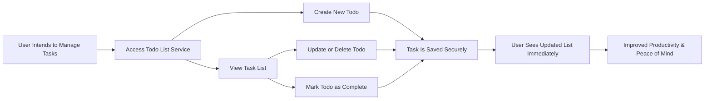
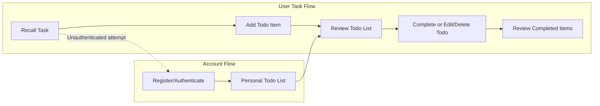
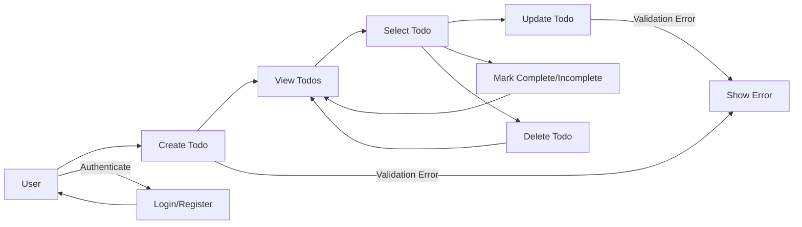
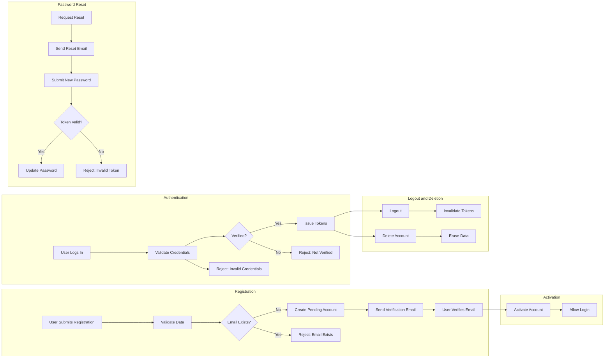
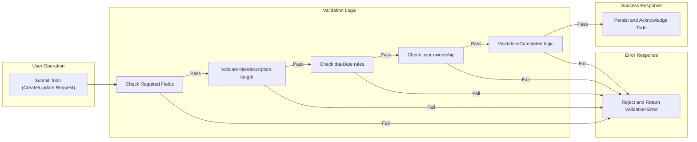

# Todo List Requirements Analysis

## 1. Introduction & Service Overview

THE todo list application SHALL exist to provide every registered user with a simple, secure, and reliable service to record, organize, and track their personal or professional tasks. The mission of the service is to maximize individual productivity while maintaining the lowest possible cognitive and operational overhead. 

### Mission Statement
WHEN a user accesses the Todo List service, THE application SHALL enable rapid entry, review, and management of todo items with zero unnecessary features or distractions. Simplicity, privacy, and data integrity SHALL be foundational principles.

### Target Users
THE application SHALL serve individuals needing a distraction-free productivity aid: professionals, students, homemakers, freelancers—anyone who must reliably track and complete personal responsibilities in their own isolated account.

### Unique Value Proposition
THE todo list service SHALL distinguish itself by deliberate minimalism. WHEN compared with alternatives, THE system SHALL not support collaboration, integration, subscription, or advanced labeling features in its initial version—maintaining strict focus on core CRUD and account management only.

---

## 2. Business Model & Success Metrics

THE service SHALL deliver value by supporting only the most essential personal task management features. Individual privacy, data control, and reliability SHALL be prioritized over expansion or monetization. 

### Value Delivery
- Immediate, frictionless access for new users
- Strict isolation of each user’s todos and settings
- Performance and availability for all regular operations

### Market Gap
WHEN compared with more complex tools, THE todo list service SHALL reject feature bloat, acquiring users frustrated with complexity elsewhere.

### Monetization & Sustainability
THE service SHALL be free for its basic use case. If sustainability demands later monetization, THE application SHALL utilize only non-intrusive approaches such as optional donations, unobtrusive premium features, or one-time licensing—never advertising or user-data resale.

### Success Metrics
- Number of active users (monthly, daily)
- Percentage of todos created and completed within 1 day
- User retention at 1, 7, and 30 day intervals
- Average number of todos per user
- User feedback citing simplicity and reliability

---

## 3. User Actors & Authentication

THE todo list system SHALL comprise a single actor: the registered user.

### User Actor
- Registered users may create, view, update, mark as complete, and delete only their own todos.
- No guest or shared accounts allowed.

### Authentication & Account Lifecycle
- Registration: Users SHALL sign up with unique email and password. Duplicate emails SHALL be rejected.
- Email verification SHALL be required prior to any login or data access.
- Login: Users SHALL receive JWT-based access and refresh tokens on successful authentication.
- Token expiry: Access tokens expire within 30 minutes; refresh tokens within 14 days.
- Password Reset: Users MAY request reset via time-limited email link; invalid or expired links SHALL be rejected with a specific error.
- Account deletion: Upon irreversible deletion, all user data and credentials SHALL be permanently erased and unrecoverable.
- Profile: Users MAY update name and password (never email). All updates require current password and input validation.

### Permissions Matrix
| Operation                      | Registered User |
|--------------------------------|-----------------|
| Register                       | ✅              |
| Verify Email                   | ✅              |
| Log In/Out                     | ✅              |
| View, Create, Edit Own Todos   | ✅              |
| Delete Own Todos               | ✅              |
| Manage Other Users             | ❌              |
| View/Edit/Delete Other Todos   | ❌              |
| Reset/Change Password          | ✅              |
| Delete Account                 | ✅              |
| Revoke All Sessions            | ✅              |

### EARS Format Authentication Requirements
- WHEN user submits registration, THE system SHALL create a pending account, send verification email, and disallow login until verified.
- WHEN verification is complete, THE system SHALL enable login and issue tokens.
- WHEN login credentials are invalid/expired, THEN THE system SHALL return a clear error.
- WHEN user requests password reset, THE system SHALL send secure link and complete change only with valid submission.
- WHEN user logs out, THE system SHALL invalidate all current tokens.
- WHEN account is deleted, THE system SHALL erase all data, prohibit reuse of deleted credentials.
- WHEN a user attempts any operation on others’ data or accounts, THE system SHALL always deny.

---

## 4. Functional Requirements

All requirements in this section are expressed in EARS format and are implementation-ready for backend development without ambiguity.

### Todo Management
- WHEN a user submits a new todo, THE system SHALL require a non-empty title and SHALL create the item, assigned uniquely to that user.
- WHEN a user provides a description or due date, THE system SHALL accept them as optional fields. Due date must be future or present (ISO 8601) if supplied.
- WHEN a user requests their list, THE system SHALL retrieve only their own todos, ordered by creation date descending (unless user requests alternate order).
- WHEN a user requests to filter todos, THE system SHALL support filtering by completion status (completed/incomplete) and by due date.
- WHEN a user selects a todo to update, THE system SHALL allow only the owner to update title (non-empty), description (up to 1000 chars), or future due date. Titles over 100 chars or empty SHALL be rejected.
- WHEN a user marks a todo complete, THE system SHALL set completion timestamp to current time (ISO 8601 UTC).
- WHEN marking incomplete, THE system SHALL clear completedAt.
- WHEN user requests deletion, THE system SHALL remove todo only if owned by user and confirm the deletion.
- IF a user attempts any modification of another’s todo, access SHALL always be denied with an explicit error.
- List, CRUD, and filtering operations for up to 100 todos SHALL complete within 1 second for the user in standard conditions.

---

## 5. User Flows & Processes

### Registration Flow
- User enters email and password, submits registration.
- System validates uniqueness, creates account in pending-verification, sends email verification link.
- User verifies; system enables login.

### Authentication Flow
- User submits credentials, receives session tokens on success.
- Token expiry enforces re-login and re-auth where appropriate.

### Password Reset
- User submits email, system sends password reset link.
- User submits new password, system validates and applies change if token is valid.

### Adding Todos
- User (logged in) clicks to add new todo.
- System prompts for required (title) and optional fields; saves and displays new item or shows error.

### Viewing & Managing Todos
- User requests todo list; system fetches todos (latest 100), displays by default order (creation date descending).
- User may select any todo to update; only owner has access.
- User marks todos as complete/incomplete and sees changes reflected instantly.
- User deletes their own todo; system confirms and updates list.

### Exception and Edge Flows
- Any attempt by a user to access, modify, or delete a todo not owned by them SHALL always result in a denied action and clear error.
- Input or validation errors SHALL always return clear, actionable feedback.
- On transient system or network error, user may retry; system ensures idempotency for repeated requests.

---

## 6. Non-Functional Requirements

### Security
- All sensitive data encrypted in transit (TLS 1.2+) and at rest (industry-standard algorithms).
- All password storage SHALL use salted, strong hash (bcrypt or Argon2).
- JWT tokens for session; expire in 30 min for access and 14 days for refresh.
- Database access limited to application layer; admin or direct access must be logged and require MFA.
- Authentication mandatory for any data operation (create, update, delete, view, etc.); non-authenticated attempts denied.

### Privacy
- Absolute data isolation—users only operate on, and can access, their own data.
- Only minimum information (email, password) required for registration.
- Users may delete their account and have all associated data permanently erased.
- No personal data/usage analytics for advertising, only minimal anonymized system metrics for performance/bug tracking.

### Performance
- 95% of all user operations (CRUD, list) SHALL complete in<1s, for up to 100 concurrent users.
- System SHALL scale up to 500 users without statistically significant performance degradation.

### Reliability
- Minimum uptime target: 99.5% (rolling 30 days, excluding planned maintenance).
- Durable storage; auto-backups at least every 4 hours with 30-day retention.
- Automated error detection and component failover/removal from load balancer on health failure.

### Compliance
- GDPR or local equivalent compliance: user consent, erasure rights, minimal data collection.
- System adaptable to future legal/audit requirements.

---

## 7. Business Rules & Validation

### Todo Item Rules
- Each todo is always owned exclusively by a single user.
- Compound tasks discouraged in title/description (validated by limiting excessive conjunctions/delimiters).
- Deleting a todo removes only the selected item; no recovery feature in MVP.

### Validation Constraints
| Field          | Required | Constraints                                   |
|---------------|----------|-----------------------------------------------|
| title         | Yes      | 1-100 chars, non-empty, trimmed                 |
| description   | No       | Up to 1000 chars                               |
| dueDate       | No       | ISO 8601 format, present or future only         |
| isCompleted   | Yes      | Boolean; only changed by owner                  |
| completedAt   | No       | System-managed; set on completion, cleared else |
| createdAt     | Yes      | System-managed, ISO 8601 UTC                    |
| updatedAt     | Yes      | System-managed, ISO 8601 UTC                    |
| id            | Yes      | System-managed, unique per todo                 |
| userId        | Yes      | System-managed, matches creating user           |

### Validation EARS
- WHEN creating/updating a todo, THE system SHALL require non-empty, trimmed title (≤100 chars).
- WHEN description supplied, THE system SHALL accept up to 1000 chars.
- WHEN dueDate supplied, THE system SHALL require ISO 8601 and present/future only—never past.
- WHEN marking complete, THE system SHALL set completedAt; marking incomplete SHALL clear it.
- WHEN a user tries to operate on another’s todo, THE system SHALL reject and return access-denied error.
- Auto-managed fields (`createdAt`, `updatedAt`, etc.) SHALL never be user-editable.
- All field and validation errors SHALL return clear, actionable user messages.

---

## 8. Error Handling

### Input Errors
- Missing/invalid title: "Please enter a title for your todo item (1-100 characters)."
- Description over 1000 chars: "Description is too long."
- Due date invalid or in past: "Due date must be in the present or future."

### Authentication/Authorization
- Not authenticated: "You need to log in to perform this action."
- Attempt to access or modify other user’s data: "You do not have permission to modify this todo."
- Expired session: "Your session has expired. Please log in again."

### CRUD Operation Failure
- System error: "Could not complete your request. Please try again later."
- Deleting/updating item that does not exist: "This todo item could not be found or has been removed."

### General Principles
- All error messages SHALL be clear, polite, actionable, and never reveal internals.
- Errors SHALL be logged for diagnostics; repeated/unknown errors direct users to support path.
- Every error type is handled explicitly to guarantee recovery/guidance for every scenario.

---

## 9. Mermaid Diagrams

### User Value Flow

### User–System Interaction Overview

### Minimal Todo Workflow

### Registration and Authentication Flow

### Validation and Completion Flow

---

## 10. Consolidated Summary

The Todo List application requirements presented here address every business, validation, and non-functional expectation necessary for secure, predictable, and reliable management of personal tasks. All requirements are business-focused, EARS-compliant, implementation-ready for backend development, and ensure an absolute minimum feature set for user empowerment and data integrity, with no vague or ambiguous statements.
