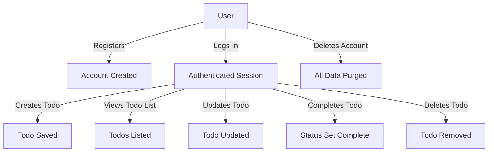

# Todo List Application – Requirements Analysis

## 1. Scope and Objectives

THE Todo List service SHALL empower each authenticated user to efficiently record, manage, update, track, and delete their personal tasks ("todos") solely for themselves, strictly excluding collaboration or sharing features. Focus SHALL remain on minimum functionality necessary for reliable and secure solo use, emphasizing simplicity, privacy, and frictionless experience above feature expansion.

WHEN compared to external task apps, THE system SHALL provide only core list management, no advanced categorization, integrations, tagging, or notifications beyond direct CRUD operations on todos and user credentials.

## 2. User Actor

### User
A User is a registered individual who can:
- Register for an account using a unique identifier (such as email or username) and password
- Authenticate themselves securely
- Create, view, update, complete, and delete ONLY their own todos
- Update or delete their personal account
- Access the service only after authentication (except registration)

WHEN a User is authenticated, THE system SHALL associate all todo data and actions exclusively to that user, never exposing any information to others.

## 3. Functional Requirements (EARS Format)

1. WHEN a user is authenticated, THE system SHALL allow creation of new todo items by providing task content and optional metadata (e.g., due date).
2. WHEN a user accesses their todo list, THE system SHALL display all their current todos clearly, ordered by creation date or completion status.
3. WHEN a user updates a todo, THE system SHALL validate ownership, apply changes, and reflect the update immediately.
4. WHEN a user marks a todo as complete, THE system SHALL mark the task as finished and update its status in the list.
5. WHEN a user deletes a todo, THE system SHALL immediately and irrevocably remove the task from the user’s list and storage.
6. WHEN a user attempts to access, update, or delete a todo they do not own, THE system SHALL deny the action with an appropriate error message.
7. WHEN a user registers, THE system SHALL require a unique identifier and securely store the credential (password hash).
8. WHEN a user authenticates, THE system SHALL verify credentials and provide a secure session or token for further requests.
9. WHEN a user logs out or their session expires, THE system SHALL terminate access to personal data until login is repeated.
10. WHEN a user deletes their account, THE system SHALL remove all associated todos and user data from persistent storage with no recovery.

## 4. Non-Functional Requirements

- THE system SHALL ensure user data privacy using industry best practices for authentication and storage.
- THE system SHALL maintain high availability (target uptime: 99.9%) and fast response times (<500ms typical operations).
- THE interface and backend SHALL be accessible over secure HTTPS only.
- THE system SHALL support scaling for at least 10,000 active users without performance degradation.
- WHEN an input or operation fails, THE system SHALL provide user-friendly error feedback within two seconds.
- Data persistence SHALL be robust, maintaining no loss or corruption of todos across sessions.

## 5. Business Rules and Validations

- A todo SHALL consist minimally of required content (non-empty string, ~1 to 200 characters).
- Optional fields: due date (ISO 8601 date string, not required).
- Todos SHALL be unique to a user (task duplication allowed within a user’s own list).
- Users SHALL never see, access, or modify any other user’s todos or account information.
- Passwords SHALL never be retrievable; password reset requires secure flow (e.g., current password or account email proven).
- Completion status SHALL be a boolean field, toggled only by the owner.

## 6. Main User Flows (Scenarios)

### Register & Authenticate
- WHEN a new user registers with unique ID and password, THE system SHALL store securely and authenticate immediately.
- WHEN a user logs in, THE system SHALL issue a secure session or token permitting access to todo features.
  
### CRUD – Manage Todos
- WHEN a user creates, updates, completes, or deletes todos, THE system SHALL check session, validate ownership, apply operation, and reflect changes with no delay.
- WHEN a user queries their task list, THE system SHALL present latest data, with completed and pending tasks visually separated (where applicable).

### Account Deletion
- WHEN a user deletes their own account, THE system SHALL remove their todos and credentials permanently.

## 7. Access Control & Authentication

- All endpoints except registration and login SHALL require a valid authenticated session or token.
- THE system SHALL verify user identity and ensure every request’s context is restricted to only that user’s data.
- Access to todo operations is strictly isolated per user.
- No administrative or privileged users exist; all users have identical, individual capabilities.

## 8. Error Handling

- WHEN a user enters invalid data (empty todo text, malformed date), THE system SHALL present clear, actionable error messages.
- WHEN an unauthorized action is attempted (cross-user access, expired session), THE system SHALL immediately deny the operation and prompt user to reauthenticate as needed.
- Exceptional errors (e.g., system failures) SHALL produce generic, non-revealing messages and log details internally for audit.

## 9. Strict Adherence Note

Developers implementing this system SHALL provide ONLY the requirements specified herein—no additional features, integrations, or external dependencies SHALL be introduced without explicit revision to this specification.

## 10. Mermaid Diagram: User and Todo Workflow

## 11. Summary and Developer Guidance

THE Todo List service demands strict, minimal, and robust architecture with no hidden complexity. Requirements are articulated in precise EARS format. All user data and actions are individual, private, and protected. Permission controls, authentication, and validation are fully specified above. Adherence to these requirements ensures clarity, security, and usability, yielding a production-grade todo application with optimal user trust and satisfaction.