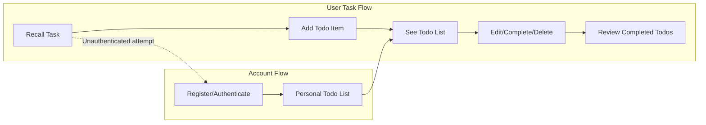

# User Personas and Scenarios for Minimal Todo List Application

## 1. User Personas

### Registered User (Primary Actor)
A Registered User is an adult busy with personal or professional responsibilities who seeks to manage their daily tasks efficiently. This user is generally tech-comfortable but values speed and ease of use over complex features or configuration. Their primary goals are to capture tasks immediately and review or modify them easily on any device.
- **Demographics:** Age 18-60, students, professionals, parents, freelancers
- **Needs:** Simplicity, privacy, device-agnostic task management
- **Goals:** Record, view, complete, update, or delete tasks with minimum friction
- **Frustrations:** Forgetting commitments, complex registration, convoluted functionality

## 2. Key Scenarios (with EARS-mode Requirements)

### Scenario 1: Adding a New Todo
- **WHEN** a registered user remembers a task, **THE** system **SHALL** provide a simple, accessible input to add a todo with a single field (task description).
- **WHEN** the user is authenticated, **THE** system **SHALL** save each new todo in the user’s private list instantly and reliably.
- **WHEN** an unauthenticated visitor attempts to add a todo, **THE** system **SHALL** require registration or login before saving any todos to ensure privacy and isolated data.

### Scenario 2: Reviewing the Todo List
- **WHEN** a registered user logs in, **THE** system **SHALL** immediately show a complete and clear list of all their current todos, sorted with pending tasks first.
- **WHEN** the user's todo list is empty, **THE** system **SHALL** provide an encouraging message to add the first task.

### Scenario 3: Completing Todos
- **WHEN** a user clicks to mark a todo as done, **THE** system **SHALL** update the task’s status to completed and update the display within one second.
- **WHEN** the user wishes to see completed work, **THE** system **SHALL** allow toggling between active and completed todos with a clear control.

### Scenario 4: Editing or Deleting Todos
- **WHEN** a user edits a todo, **THE** system **SHALL** present an edit view with the existing description populated and save changes immediately upon confirmation.
- **WHEN** a user decides to delete a todo, **THE** system **SHALL** prompt for confirmation to avoid accidental removals, and only then permanently remove the item from their personal list.

### Scenario 5: Account and Session Management
- **WHEN** a user wishes to manage their account, **THE** system **SHALL** provide password reset and profile update functions accessible from the main application menu.
- **WHEN** a user signs out, **THE** system **SHALL** ensure all personal data is inaccessible until the user signs in again.

## 3. User Motivations
- **Personal Organization:** Users want a clear, simple system to track and manage all types of tasks for personal or professional life.
- **Productivity:** Marking off completed todos provides a sense of accomplishment and motivates continual use.
- **Reliability:** Users expect their data to be instantly saved and available, across browser sessions and devices, with no risk of accidental loss.
- **Minimalism:** Users dislike clutter and want only the essential actions for adding, checking, editing, or deleting tasks.
- **Privacy:** Every user’s todos are private by default, with no public or shared access.

## 4. Expected Outcomes
- **WHEN** a user interacts with their todo list daily, **THE** app **SHALL** help them maintain oversight of their priorities and deadlines through simple yet effective tracking.
- **WHEN** multiple tasks are completed, **THE** user **SHALL** be able to easily reflect on accomplishments by viewing the completed todos section.
- **WHEN** the task list grows long, **THE** system **SHALL** maintain fast response times and not become confusing, e.g., by allowing easy scanning and clear status labeling.
- **WHEN** users log in on a new device, **THE** app **SHALL** only ever display that user’s own todos, never exposing data to others.
- **WHEN** a todo is updated, deleted, or completed, **THE** app **SHALL** immediately update all visible lists to reflect the true state.
- **WHEN** users attempt any action while unauthenticated, **THE** app **SHALL** enforce login or signup as a prerequisite to enable secure, private data management.

## 5. User–System Interaction Overview (Mermaid Diagram)

## 6. Scope and Boundaries (for Minimal Product)
- No sharing, delegation, notifications, or recurring tasks
- No complex project/grouping features, tags, priorities, attachments, or collaboration tools
- The todo app is strictly single-user, single-list per account, focused only on entry, modification, completion, removal, and basic account management.
- No public views or third-party integrations; privacy is enforced as a key requirement.

## 7. Consent, Security, and Authentication
- **WHEN** a new user signs up, **THE** system **SHALL** require basic profile information (email and password)
- **WHEN** performing any todo operation, **THE** user MUST be authenticated
- **WHEN** accessing another user’s data is attempted (illegally or via bug), **THE** system **SHALL** deny the action and log the access attempt for audit
- User sessions **SHALL** time out after a reasonable period of inactivity (e.g., 1 hour) for security
- All operations **SHALL** be accessible only through secure (HTTPS) connections

---

This requirements document specifies only essential processes for a minimum, privacy-focused Todo list backend. Business rules and flows are expressed in natural language and EARS format, ensuring implementation clarity and developer readiness.