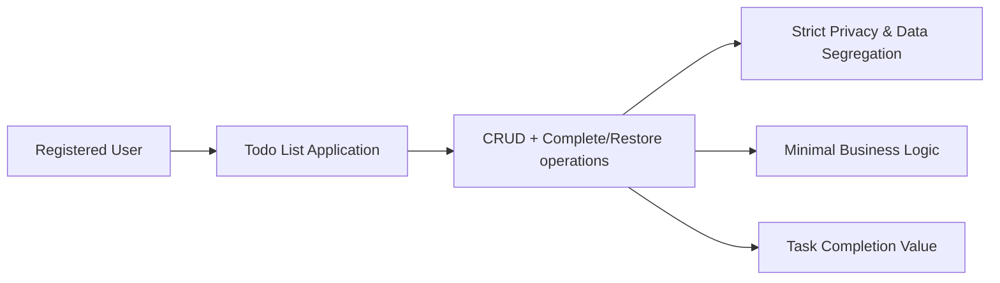

# Todo List Application: Requirements Analysis

## 1. Introduction and Purpose
The Todo List application empowers individual users to capture, organize, and manage their own task lists with unparalleled simplicity and privacy. The service is engineered with a philosophy of "no bloat, no fuss"—delivering only the task management essentials for personal productivity. This requirements analysis specifies all minimal business requirements to guide backend implementation of a clean, secure, user-centric Todo list.

## 2. Business Model Synopsis
The service delivers value by offering each user a personal space to manage tasks quickly and securely with zero distractions. Initial usage is free and ad-free; minimal backend design controls infrastructure and privacy costs. Future premium options may exist but do not influence MVP design or requirements.

### Value Proposition
- Immediate access: Users can start managing their tasks without onboarding friction.
- Focussed experience: No features beyond core CRUD and status marking.
- Private by default: No social sharing or group features.

## 3. User and Actor Profile
**Primary Actor:**
- _Registered User:_ An authenticated individual who manages their own tasks. Each user has an isolated data context; no other actors exist in the MVP.

### Actor Profile Table
| Actor           | Description                                             |
|-----------------|---------------------------------------------------------|
| Registered User | Authenticated person, sole manager of their todos       |

## 4. Core Functional Requirements

### EARS-Format Requirements
- THE todoList system SHALL allow each registered user to create a new todo specifying a required title and optional description.
- THE todoList system SHALL allow each user to view a complete list of all their own todos, sorted by creation date or completion status.
- THE todoList system SHALL allow each user to update the title or description of their existing todos at any time.
- THE todoList system SHALL allow each user to delete todos they own.
- THE todoList system SHALL allow each user to mark any todo as complete and record the timestamp of completion.
- WHEN a user marks a todo as complete, THE system SHALL update the todo's status and completion time immediately.
- THE todoList system SHALL enable each user to restore any previously deleted or completed todo to active state as long as they own it.
- THE todoList system SHALL never expose the todos of one user to another under any circumstance.

#### Resource Limits and Controls
- IF a user attempts to create more todos than a system-defined threshold per day, THEN THE system SHALL reject the request and notify the user of the limit.
- WHEN input validation fails on todo creation or update (e.g. missing title, title too long), THE system SHALL present a detailed, actionable error to the user.

## 5. Authentication and Data Security
- THE todoList system SHALL require all users to authenticate with a secure credential before accessing any feature.
- THE todoList system SHALL support secure session management and prevent unauthorized resource access.
- THE todoList system SHALL strictly isolate user data—users may only manage and see their own todos.
- THE todoList system SHALL not permit anonymous (unauthenticated) use for creating or managing todos.

## 6. Business Rules and Validation
- THE todoList system SHALL enforce a required, non-empty title on every todo upon creation or update.
- THE todoList system SHALL optionally allow a free-text description but may limit to a system-configured maximum length.
- THE todoList system SHALL assign a creation timestamp to every new todo upon storage.
- THE todoList system SHALL only allow CRUD and complete/restore operations for the authenticated user’s own todos.
- IF a user attempts to update or delete a todo that does not belong to them, THEN THE system SHALL deny the request and provide a clear error message.

## 7. Error Handling and Edge Cases
- WHEN a request fails, THE system SHALL return a human-readable error message within 2 seconds, indicating cause and next steps.
- IF a user submits malformed or invalid input, THEN THE system SHALL specify which field is problematic and why.
- IF a user attempts a forbidden action (accessing or modifying another user’s data), THEN THE system SHALL log the attempt for audit (without revealing other users’ identities to the requester).

## 8. Success Metrics and KPIs
| Metric                   | Description                                       |
|--------------------------|---------------------------------------------------|
| DAU (Daily Active Users) | Number of unique logins per day                   |
| Completion Rate          | % of todos completed within 1 day                 |
| Retention (7/30 days)    | % users returning after 1 week/1 month            |
| Avg Todos per User       | Engagement level—average todos managed per account |
| Avg Session Duration     | Indicates ease and speed of use                   |

## 9. Non-Functional Requirements
- THE todoList system SHALL process 95% of API requests in under 400ms.
- THE todoList system SHALL be available 99.9% of the time excluding scheduled maintenance.
- THE system SHALL store all datacenter data in compliance with applicable privacy regulations.
- THE todoList system SHALL have no known critical vulnerabilities at deployment time.

## 10. Visual Model (Business Context Mermaid Diagram)

