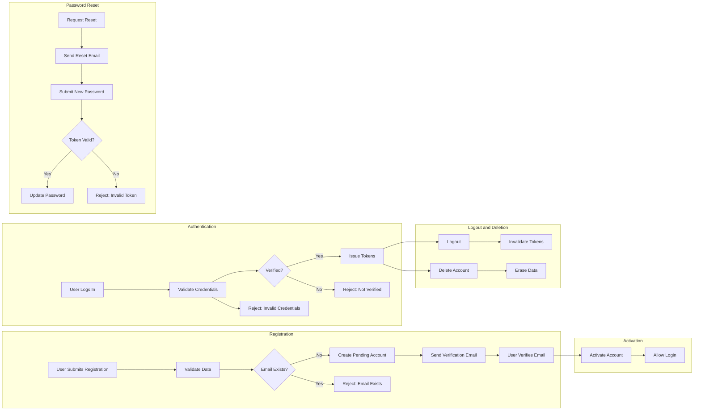

# User Actors and Authentication Requirements for Todo List Application

## User Actor Definition

Every individual user of the Todo List application is represented by a single actor: the "user." All users are required to be registered, authenticated, and responsible solely for their own todo items and profile. There are no administrative, guest, or privileged roles; no user can ever access, view, or act upon another user’s data. 

- **user**: An authenticated individual who is authorized exclusively to manage their own todos and account operations. Each user account is always uniquely mapped to one valid email address and can neither act on behalf of others nor delegate actions to anyone else.

## Authentication Flow

### Registration
- Users initiate registration by providing a unique, valid email and a password.
- WHEN registration is submitted, THE system SHALL verify email uniqueness and validity, then provision a new user account in a pending verification state.
- WHEN a registration attempt is made with a duplicate email, THE system SHALL reject the registration with a clear conflict error.
- WHEN registration succeeds, THE system SHALL immediately send a verification email to the user’s address and prohibit login before verification is complete.

### Email Verification
- WHEN the verification link is accessed, THE system SHALL activate the user account and enable login.
- IF an unverified user attempts to log in, THEN THE system SHALL block access and notify the user about unverified status.

### Login & Session Management
- Users log in with their valid, verified email and password.
- WHEN login credentials are correct and the account is verified, THE system SHALL issue a JWT access token (30 minutes expiry) and a JWT refresh token (14 days expiry).
- WHEN incorrect credentials are submitted, THE system SHALL deny authentication with a generic error message.
- WHEN the access token expires, users may request a new token using the valid refresh token, provided it’s not expired/revoked.
- WHEN the refresh token is absent, invalid, or expired, THE system SHALL require re-authentication.

### Logout
- WHEN a user logs out, THE system SHALL immediately revoke current access and refresh tokens.
- WHEN a user requests to revoke all sessions, THE system SHALL invalidate all active tokens for that user.

### Password Reset
- WHEN a user requests a password reset, THE system SHALL send a password reset email with a secure, time-limited link.
- WHEN the reset link is used to submit a new password, THE system SHALL validate the link, update the password if valid, or display an error if the link is invalid or expired.

### Account Deletion
- WHEN a user requests permanent deletion, THE system SHALL irreversibly delete the user account and all related data.
- AFTER deletion, THE system SHALL never permit future logins or restoration of deleted credentials.

## Account Management

### Profile Management
- Users may view and update their own profile fields (such as display name), with the exception of their email (immutable for account uniqueness).
- WHEN a user submits valid profile updates, THE system SHALL apply them after passing all business validations.
- IF a profile update fails validation, THEN THE system SHALL reject it and specify the cause.

### Password Change
- WHEN authenticated users request a password change, THE system SHALL require the current password for authentication and validate the new password according to policy before applying the update.

## Permissions Matrix

| Action                        | user |
|-------------------------------|------|
| Register                      | ✅   |
| Verify Email                  | ✅   |
| Log In                        | ✅   |
| Log Out                       | ✅   |
| View Own Todos                | ✅   |
| Add New Todo                  | ✅   |
| Edit Own Todos                | ✅   |
| Mark Own Todo Complete        | ✅   |
| Delete Own Todos              | ✅   |
| Manage Other Users            | ❌   |
| View Other Users' Todos       | ❌   |
| Reset Password                | ✅   |
| Change Own Password           | ✅   |
| Delete Account                | ✅   |
| Revoke All Sessions           | ✅   |

## EARS Format Requirements

- WHEN registration data is submitted, THE system SHALL create a user account in a pending state, send a verification email, and prohibit login until verification is complete.
- WHEN the user clicks the verification link, THE system SHALL activate their account and enable login.
- WHEN a verified user logs in with valid credentials, THE system SHALL issue new JWT access and refresh tokens.
- IF login credentials are incorrect or the account is not verified, THEN THE system SHALL block login and display a specific error message.
- WHEN a user requests a password reset, THE system SHALL send a secured reset email with a time-limited token.
- WHEN a password reset submission is valid, THE system SHALL update the password and confirm success to the user.
- WHEN a user logs out, THE system SHALL immediately invalidate current access and refresh tokens.
- WHEN a user requests account deletion, THE system SHALL remove their account and all associated data permanently and irrevocably.
- THE system SHALL never allow any user to read, update, delete, or access any data or resources belonging to another user.
- IF a user attempts access or modification of another user's data, THEN THE system SHALL always reject the attempt with a clear authorization error.
- IF any authentication token is expired, invalid, or revoked, THEN THE system SHALL block access and return an error indicating authentication failure.

## User Registration and Authentication Flow Diagram

## Edge Cases and Error Handling

- WHEN authentication or permissions validation fails, THE system SHALL always respond with an explicit error, clearly communicating the reason (e.g., invalid credentials, unverified account, unauthorized access attempt).
- WHEN any action attempts to operate on another user’s data, THE system SHALL block the action and return a forbidden error message.
- WHEN a password reset link is invalid or expired, THE system SHALL reject the request and display an appropriate error message.
- WHEN a user is deleted, THE system SHALL ensure no residual data or credentials remain and block any attempt at future access.
- WHEN JWT tokens are expired, revoked, or malformatted, THE system SHALL deny all protected requests and require re-authentication.