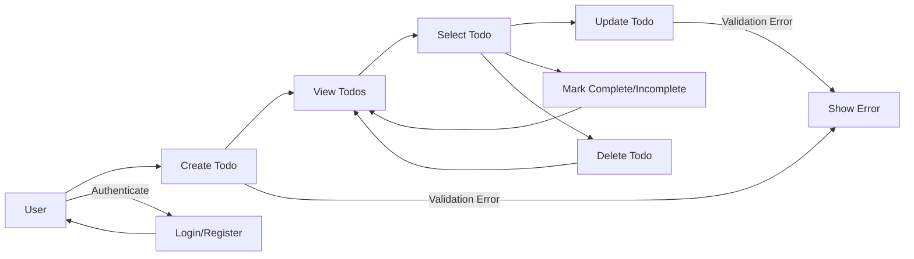

# Functional Requirements for Minimal Todo List Application

## Use Case Overview
The Minimal Todo List Application provides individual users with a reliable, intuitive platform for managing their personal tasks. The application strictly serves the simplest form of todo management and excludes all advanced or collaborative features. Each user operates their own private todo list, and all access is isolated per user account. All described processes, permissions, and workflows are focused on ensuring secure, robust, and clear handling of an individual's todos.

## Feature Requirements (EARS Format)

### Todo Creation
- WHEN a registered user submits information for a new todo, THE system SHALL create a todo item assigned only to that user.
- WHEN creating a todo, THE system SHALL require a non-empty string as the title.
- WHERE a description is provided, THE system SHALL store it as an optional field linked to the todo item and visible only to its owner.
- WHERE a due date is provided, THE system SHALL validate the format as ISO 8601 date and store it if valid; OTHERWISE, the due date SHALL be empty.
- WHEN required fields are missing or invalid, THE system SHALL return a validation error with a clear message.

### Todo Listing and Retrieval
- WHEN a user requests their todo list, THE system SHALL return only todos owned by that user. Access to todo items from other users is strictly prohibited at all times.
- WHERE filters are provided (completed/incomplete, due date), THE system SHALL apply the specified filters to return only the matching todos.
- WHEN requesting details for any specific todo by ID, THE system SHALL verify the todo belongs to the requesting user; IF not, THEN the system SHALL deny access and present an appropriate error.
- THE system SHALL return todos ordered by most recent creation date unless the user requests a different order, such as by due date or completion status.

### Todo Update
- WHEN a user submits valid modifications for a todo they own, THE system SHALL update only the fields specified (title, description, due date) after validating input.
- WHERE the title is updated, THE system SHALL require the new value to be a non-empty string.
- WHERE description or due date are updated, THE system SHALL validate and persist only valid data.
- IF an update request is made for a todo not owned by the user, THEN THE system SHALL deny access and present an appropriate error.

### Marking Todos as Complete/Incomplete
- WHEN a user marks their own todo as complete, THE system SHALL record the exact time the action occurred and set the completion status.
- WHEN a user marks their completed todo as incomplete, THE system SHALL clear the completion timestamp and reset the status.
- IF a completion/incompletion operation is attempted on a todo not owned by the user, THEN THE system SHALL deny access and return an error code.

### Todo Deletion
- WHEN a user requests deletion of their own todo, THE system SHALL permanently remove the record and confirm the deletion to the user.
- IF a requester attempts to delete another user's todo, THEN THE system SHALL refuse and present a denial error.

### Validation and Business Rules
- THE system SHALL enforce that the title for any todo is required and cannot be empty for both creation and updates; failure triggers a validation error message.
- WHERE a due date is submitted, THE system SHALL check it matches ISO 8601 format; IF NOT, THE system SHALL reject the input with descriptive error feedback.
- THE system SHALL ensure description is handled as optional text and does not permit content injection or invalid formatting (e.g., trim whitespace, encode as necessary).
- THE system SHALL guarantee that all todos and their operations (creation, retrieval, update, delete, complete, incomplete) are tied only to their authenticated user, with strict data isolation enforced at all layers.
- WHEN a user attempts to access or manipulate data outside their scope, THE system SHALL respond with an 'access denied' message and proper error code.

### Filtering, Search, and Performance
- WHEN users request a list or filtered list of todos, THE system SHALL support filtering by completion status and due date (if provided).
- THE system SHALL return no more than 100 todos per single list response, ordered by creation date by default, unless otherwise specified.
- WHEN a user requests a list of todos (with or without filters), THE system SHALL return the response within 1 second for up to 100 items in the normal case.
- THE system SHALL support any number of todos per user for storage, but only guarantees optimal speed for the most recent 100 todos per request.

### Permissions, Security, and Error Scenarios
- THE system SHALL strictly tie all todo operations to the authenticated user and never allow one user to access, modify, or delete another user's data.
- IF a user attempts any forbidden action (such as updating, viewing, or deleting another user's todo), THEN THE system SHALL return a clear access denied response and the correct business error code.
- All error messages MUST be actionable, clear, and explain why the input or action was rejected in user-facing terms.
- Repeated access denial or validation violations SHALL NOT reveal any details about the existence or nature of other users' data.
- THE system SHALL log security-related events and access violation attempts for audit and monitoring.

### Non-Functional and Performance
- THE system SHALL respond to all standard CRUD and list queries for up to 100 todos within 1 second backend time for standard usage scenarios.
- Security, privacy, reliability, and error handling are managed as described in referenced project documents.
- Bulk operations and export features are omitted from the minimal specification and must not be implemented.

## Acceptance Criteria: Explicit Business Rules Table

| Feature            | Acceptance Criteria                                                                                      |
|--------------------|--------------------------------------------------------------------------------------------------------|
| Todo Creation      | Allowed for authenticated users only. Title must be present and not empty. Description/due date optional but must be valid if present. Errors reported clearly for any invalid field.     |
| Retrieval/List     | Only user's own todos shown. Filtering by status and due date supported. Sorted by most recent. No cross-user visibility.              |
| Update             | Only owner may update a todo. Title required for update. Inputs validated. Others' todos cannot be changed.                            |
| Completion         | Only owner can mark complete/incomplete; timestamps managed. Attempts on others' todos always denied.                                    |
| Delete             | Only owner can delete. System confirms on success. Others' delete requests always result in access denied.                             |
| Validation         | Prompt, descriptive error if title is missing/empty or due date invalid.                                                              |
| Performance        | Up to 100 items per list response, max 1 second processing for normal scenarios.                                                     |

## Minimal Todo Workflow Diagram

## Additional Notes
- The system is rigidly single-user per account; no sharing, groups, or collaborative access.
- Features such as tags, categorization, reminders, notifications, prioritization, or group operations are out of scope and must not appear in minimum implementation.
- All security, validation, and business rules highlighted above must be considered strict boundaries, not suggestions or examples.
- All non-specified edge cases (e.g., malicious input, extreme data volumes) defer to common best practices of secure backend engineering as referenced in project-wide error and security documentation.
