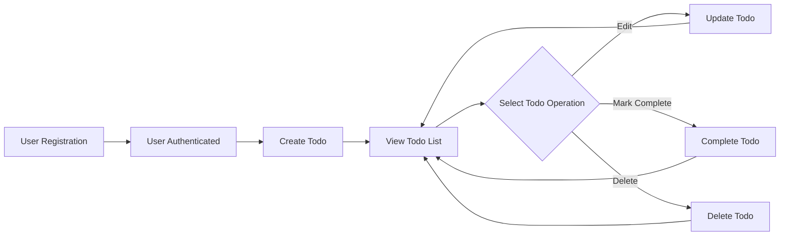

# Todo List Application Minimum Requirement Specification

## 1. Introduction

A Todo List application is designed to enable users to create, manage, and track their personal tasks with minimal complexity. The system SHALL provide just enough functionality to allow users to securely manage their todos without any extraneous features. This application prioritizes simple, secure, and intuitive operation suitable for both novice and experienced users, and strictly implements only the minimum set of features required for a usable Todo application.

## 2. Actors and Authentication Requirements

### 2.1 User Actor
- Users are individuals who create accounts, authenticate, and perform all todo-related actions on their personal data.

### 2.2 Authentication and Authorization
- WHEN a new user provides a valid, unique email address and password, THE system SHALL register the user, persist credentials securely, and grant access.
- IF attempted registration uses an email already in use, THEN THE system SHALL reject the attempt and inform the user clearly.
- WHEN a registered user logs in with correct credentials, THE system SHALL authenticate and issue an access session (e.g., token) allowing todo management.
- IF user credentials are incorrect, THEN THE system SHALL refuse authentication and inform the user.
- WHEN a user logs out, THE system SHALL terminate the session and prevent further operations until re-authentication.
- WHEN a user requests a password reset for a valid email, THE system SHALL dispatch a secure reset process. IF the email is not in use, THE system SHALL display only a generic message, never revealing if the email exists.
- Authentication is REQUIRED for any todo CRUD operation or access to personal data.

## 3. Main Use Cases and Functional Requirements

### 3.1 Create Todo
- WHEN an authenticated user submits valid details for a new todo, THE system SHALL create the todo strictly for that user and confirm the creation.
- IF the submission lacks required fields or includes invalid data, THEN THE system SHALL reject the creation and inform the user of specific requirements.

### 3.2 Read/View Todos
- WHEN a user requests to view their todos, THE system SHALL retrieve ONLY their own todos, sorted by most recent first, with statuses clearly shown.
- IF the user has no todos, THE system SHALL display an explicit empty state message.

### 3.3 Update Todo
- WHEN a user chooses to edit a todo, THE system SHALL display the current values and accept valid updates to title, description, or completion status.
- WHEN changes are submitted, THE system SHALL only allow changes if the todo strictly belongs to the user.
- IF user tries to update a todo not their own, THEN THE system SHALL deny action and inform them.
- WHEN updating a completed todo, THE system SHALL allow changes to non-status fields but NOT revert completion status without explicit confirmation.

### 3.4 Complete/Incomplete Toggle
- WHEN a user marks a todo as complete, THE system SHALL update completion status and record the completion date.
- IF a completed todo is re-marked complete, THE system SHALL inform that no change is necessary.
- WHEN a user reverts a complete todo to incomplete, THE system SHALL update status and clear completion date.
- IF a user attempts to toggle another user’s todo, THE system SHALL block and notify the user.

### 3.5 Delete Todo
- WHEN a user requests deletion, THE system SHALL ask for confirmation and then permanently remove the todo if confirmed.
- IF the todo is not found or already deleted, THE system SHALL inform the user.
- Only the owner user may delete their own todos.

## 4. Step-by-Step Workflows

### 4.1 Todo Creation
- User logs in successfully → User selects "Add Todo" → System prompts required/optional fields → User submits → System validates → IF valid, create and link to user; ELSE, display actionable feedback.
- WHEN a valid todo is created, THE user SHALL see immediate confirmation and the new item appears in their list.

### 4.2 Viewing Todos
- User logs in → Accesses dashboard → System retrieves all user's todos → System displays todos (completed, incomplete marked distinctly) → User sees results or empty state if none.

### 4.3 Editing a Todo
- User selects a todo → System pre-fills form with current details → User edits → System validates → IF user owns the todo, update; ELSE, deny and notify.

### 4.4 Completion Toggle
- User selects "Complete” on a todo → System updates completion, logs completion date/time → User sees status change immediately.
- IF user attempts to change another user’s todo, action is denied.

### 4.5 Deletion
- User selects "Delete” → System asks for confirmation → IF confirmed, deletes and updates user list instantly.
- IF deletion fails (already deleted/not found), shows error message.

## 5. Business Rules, Validation, and Edge Cases

- Title is mandatory for every todo. Description is optional but subject to length limits.
- Maximum of 100 todos per user can be retrieved at a time.
- Todos are strictly private to the user. Cross-user access is forbidden under all circumstances.
- Input validation applies on all CRUD (empty/whitespace/overlength fields are rejected).
- Attempting actions while unauthenticated prompts user to log in first.
- IF a request fails due to temporary error (e.g., connectivity), system SHALL suggest retry/give feedback.
- System SHALL never display whether an email is registered in password reset flows.
- All error messages are user-understandable and never expose sensitive system internals.

## 6. Mermaid Flow Diagram: Minimal Todo User Lifecycle

## 7. Completion Criteria & Success Metrics

- All user actions execute within 2 seconds under typical load (for up to 100 todos per user).
- No user shall ever access, edit, or delete todos owned by another user under any circumstance.
- User receives explicit, actionable feedback on all errors.
- All workflow steps above SHALL be possible only after secure authentication.
- System is considered complete when users can register, authenticate, create, view, update (including toggle completion), and delete todos fully and securely; every workflow produces clear result or actionable error for every possible valid operation.