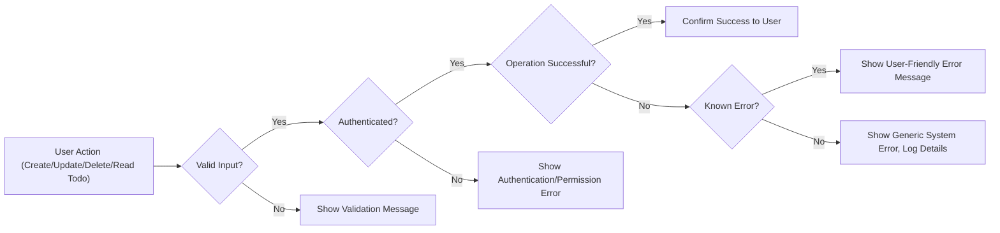

# Error Handling Requirements for Todo List Backend Service

## Introduction

Robust error handling is essential for the reliability and user trust of the Todo List backend service. The system SHALL ensure every failure, unexpected input, or system error is managed in a manner that preserves user data integrity and provides clear, actionable guidance. All user-facing error responses must be designed with clarity, politeness, and practicality, never exposing technical internals and always helping users move forward or recover.

## Error Scenarios

### 1. Input Validation Errors
- WHEN a user submits a todo item without all required fields (such as an empty title), THE system SHALL block the creation or update and display an explicit message indicating the missing field(s).
- WHEN a user enters data that exceeds allowed limits (such as a title longer than 255 characters), THE system SHALL reject the change and state exactly which limit was violated.
- WHEN a user input does not match the required format (such as a due date in a non-date format), THE system SHALL display a message explaining the correct format and highlight the erroneous entry.

### 2. Authentication and Authorization Errors
- WHEN an unauthenticated user attempts to perform any action involving reading, creating, updating, or deleting todos, THE system SHALL refuse the action and present a clear message that login is required.
- WHEN a user tries to change or remove a todo they do not own, THE system SHALL prevent this action and inform them that they lack permission for that todo item.
- WHEN a logged-in session or authentication token has expired or becomes invalid, THE system SHALL demand re-authentication and explain that login must be renewed.

### 3. Data Operation Errors (CRUD)
- WHEN the backend fails to persist changes (creating, updating, or deleting a todo item) due to any network or server-side error, THE system SHALL show a non-technical, reassuring message asking the user to retry later.
- WHEN an attempt is made to access, update, or delete a todo that no longer exists, THE system SHALL inform the user that the item cannot be found or might already have been deleted.
- WHEN the system receives any unexpected or unclassified backend error, THE system SHALL provide a generic, polite message assuring the user that the issue is recognized and being addressed.

### 4. System and Service-Level Failures
- WHEN any unexpected internal error is encountered, THE system SHALL log necessary diagnostic information (never exposing details to the user) and display a generic apologetic message with next steps.
- WHEN the service experiences downtime or is unreachable, THE system SHALL inform users of the outage, provide information on expected resolution if available, and suggest contact options for support.

## User-Facing Error Messages

### Principles for Error Messaging
- THE system SHALL always use clear, plain, and courteous language in every error message.
- THE system SHALL avoid all technical jargon, error codes, or stack traces in user displays.
- THE system SHALL ensure every error prompt includes guidance on corrective action or what to do next.

### Example Error Messages
| Scenario                                      | User Message Example                                |
|-----------------------------------------------|-----------------------------------------------------|
| Missing title                                 | "Please enter a title for your todo item."          |
| Title too long                                | "The title must be 255 characters or fewer."        |
| Bad due date format                           | "The due date must be a valid date."                |
| Not logged in                                 | "You need to log in to perform this action."        |
| Permission denied                             | "You do not have permission to modify this todo."   |
| Session expired                               | "Your session has expired. Please log in again."    |
| Save failed                                   | "Could not complete your request. Try again later." |
| Todo deleted/not found                        | "This todo could not be found or may have been removed."|
| Unhandled error                               | "Something went wrong. We're working on the issue." |
| Service unavailable                           | "The service is temporarily unavailable. Please try again soon."|

## Recovery Actions and User Guidance

### Automated Recovery
- WHEN a temporary error (such as a network failure) is detected, THE system SHALL enable the user to retry the most recent action from where they left off.
- WHEN a validation error occurs, THE system SHALL visually indicate the specific field in error and permit prompt correction.

### User Guidance Steps
- WHEN authentication or permission failures happen, THE system SHALL direct the user either to log in or contact support, as applicable.
- WHEN a todo cannot be found during update or deletion, THE system SHALL instruct the user to refresh their list or review recent changes to their data.
- FOR persistent or unfamiliar errors, THE system SHALL supply direct access to help resources, documentation, or contact info for technical support.

### Support and Escalation
- WHEN a user experiences repeated, unresolved errors, THE system SHALL offer an option to contact support (such as email or a support form) directly from the error display.
- THE system SHALL display an error reference code or unique ID for severe or generic faults to facilitate faster support response.

## Mermaid Diagram: Error Handling Flow

## Success Criteria for Error Handling

- All error cases and scenarios are explicitly handled such that no operation leaves the user without feedback or corrective guidance.
- All error messages are written in courteous, jargon-free, and direct language and include information about next steps for the user.
- No internal error codes, stack traces, or technical data are ever visible to the user.
- The system provides a clear path for recovery, including retry actions or correction guidance as soon as possible after any failure.
- All error conditions are logged internally with sufficient detail for diagnostics but with no leakage of user or system security data.
- Each requirement follows EARS format or natural language statement and is directly actionable for backend implementation.
- All requirements, diagrams, and guidance meet production-level quality, providing backend developers with a complete, ambiguity-free specification for every aspect of error handling in the Todo List backend service.