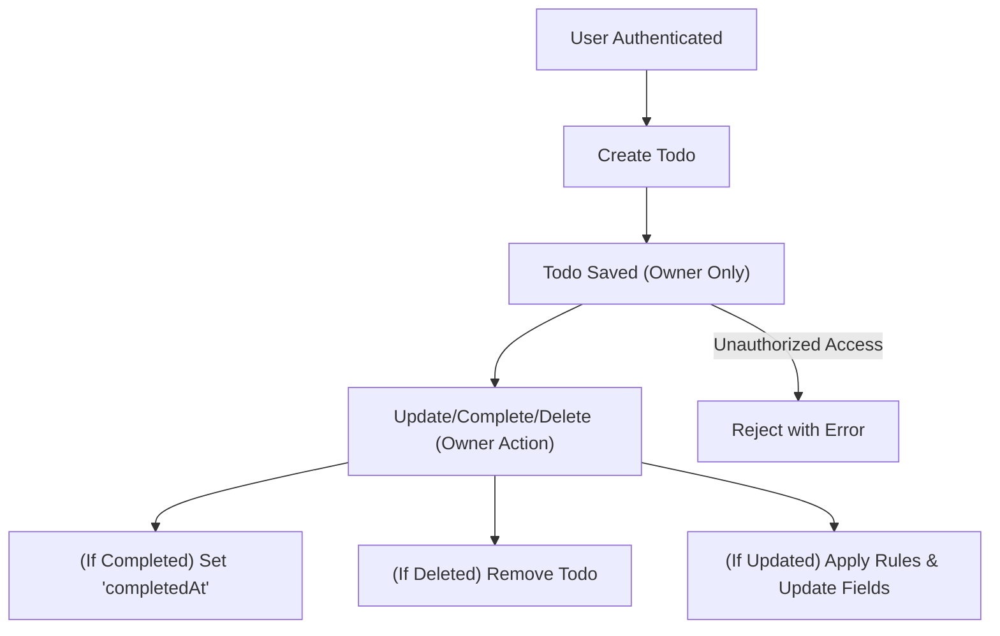

# Minimal Todo List Application Requirements Analysis

## Introduction & Purpose
The Minimal Todo List is a software service that allows individual users to manage a private, personal list of actionable tasks called "todos." This document describes, in precise business language, every requirement, rule, and process flow for creating, updating, completing, and deleting todos. The purpose is to define the minimum necessary requirements for a classic todo app, ensuring zero ambiguity and providing backend developers with a blueprint for compliant implementation—without any unnecessary features or technical design detail.

## Business Requirements & User Interactions
- WHEN a registered user signs in, THE system SHALL allow creation, update, completion status change, and deletion of their own todos.
- WHEN the user is not authenticated, THE system SHALL deny access to all todo operations.
- WHEN the user attempts to access, update, or delete a todo not belonging to them, THE system SHALL deny the action and provide a clear error message.
- THE user SHALL NOT access or interact with any other user's todos.
- WHEN a registered user requests their list of todos, THE system SHALL deliver only their own items.

## Business Rules & Validation
All requirements below follow EARS (Easy Approach to Requirements Syntax):

### Core Principles
- WHEN a user creates a todo, THE system SHALL assign ownership to the creator and restrict access to that user only.
- IF a user attempts to access, modify, or delete a todo not owned by them, THEN THE system SHALL deny with "You do not have permission to perform this action."
- Each todo SHALL represent a single actionable task (avoid compound actions).
- WHEN a todo is deleted, THE system SHALL ensure it cannot be retrieved later.

### Field Constraints (applies to all input and update actions)
- WHEN a user submits a new todo, THE system SHALL require a non-empty `title` (1–100 chars, trimmed, no leading/trailing spaces).
- WHEN a user submits a new todo, THE system SHALL require `isCompleted` (boolean).
- WHERE `description` is provided, THE system SHALL accept up to 1,000 characters.
- WHERE `dueDate` is provided, THE system SHALL require it is on or after creation date and not before current date.
- IF `dueDate` provided is in the past, THEN THE system SHALL reject with "Due date must not be in the past."
- IF required fields are missing, THEN THE system SHALL reject the request, indicating all missing fields.

### Field Rules on Update
- WHEN a user updates a todo, THE system SHALL validate user ownership.
- WHERE `title` is updated, THE system SHALL require non-empty string ≤100 chars.
- WHERE `description` is updated, THE system SHALL allow up to 1,000 chars.
- WHERE `dueDate` is updated, THE system SHALL allow only ISO8601 dates not earlier than the todo's creation date.
- WHERE `isCompleted` is updated to true, THE system SHALL auto-set `completedAt` (readonly by user) to the current datetime.
- WHEN reverting from completed to incomplete, THE system SHALL clear `completedAt`.
- IF update request contains no changes, THE system SHALL reject the update.

### Integrity and Lifecycle Constraints
- WHEN a user deletes a todo, THE system SHALL remove only that item and NOT any others.
- Once deleted, THE todo SHALL not be recoverable by any means.
- System-managed fields (`completedAt`, `createdAt`, `updatedAt`, `id`, `userId`) SHALL be readonly to users, always set or updated only by the system.

### Completion Status Handling
- WHEN a user marks a todo as completed, THE system SHALL set `completedAt` to UTC now.
- IF already completed and marked again, THE system SHALL treat as idempotent and return success.
- IF reverted to incomplete, THE system SHALL set `completedAt` to null.
- WHEN a non-owner attempts to update `isCompleted`, THE system SHALL deny the operation.

### General Validation Logic
- THE system SHALL trim whitespace from `title` and `description` before storing.
- THE system SHALL reject non-boolean `isCompleted` values, or empty/whitespace titles.
- THE system SHALL respond to all rule violations with user-friendly error messages as above.

## Authentication & Authorization Model
- All users must REGISTER and AUTHENTICATE prior to any todo operations.
- Only the AUTHENTICATED user may create, see, complete, update, or delete their own todos.
- THE system SHALL deny unauthenticated requests.
- Each todo is strictly PRIVATE to its creator—no sharing or delegation.
- No user or role other than the owner may see or operate on a todo.

### Session Management
- WHEN a user is authenticated, a session SHALL be created and remain valid for a secure, pre-defined period or until manual logout.
- WHEN the session expires or is logged out, all todo operations are denied.

## Minimal User Flows
### Todo Creation
1. User logs in.
2. User submits `title` (required), `description` (optional), `dueDate` (optional), `isCompleted` (required, default false).
3. System validates all fields and business rules as above.
4. System persists the todo and returns all data, including readonly fields populated and ownership enforced.
5. If any validation fails, system returns precise reason(s).

### Todo Update
1. User selects their todo and submits changes for allowed fields (`title`, `description`, `dueDate`, `isCompleted`).
2. System validates user ownership, applies field- and lifecycle-level rules.
3. System updates todo and updates `updatedAt` and, if applicable, `completedAt`.
4. If unauthorized or any rule fails, system returns specific error.

### Todo Deletion
1. User selects their own todo for deletion.
2. System confirms ownership and deletes the item.
3. System confirms deletion and returns updated list.
4. If user does not own todo, system denies with error.

### Completion Toggle
1. User sets `isCompleted` true; system sets `completedAt`.
2. User unsets `isCompleted`; system clears `completedAt`.

### Error Flows
- Unauthorized attempts SHALL always be denied.
- Missing or invalid field values lead to error with specific field-focused messages.

## Permission Matrix
| Action      | Owner      | Non-Owner/Anonymous |
|-------------|:----------:|:------------------:|
| Create      |   Yes      | No                 |
| Read/List   |   Yes      | No                 |
| Update      |   Yes      | No                 |
| Delete      |   Yes      | No                 |
| Complete    |   Yes      | No                 |

## Mermaid Diagram: Todo Lifecycle

## Summary & Acceptance Criteria
- All requirements above SHALL be implemented fully
- All fields and flows SHALL use the constraints/rules expressed above
- System SHALL provide only the minimal viable features with no extras
- No access by non-owners is permitted
- All business rules, validations, and user message expectations are covered here
- Backend developers can implement logic solely from this document, without further clarification or supplemental material
