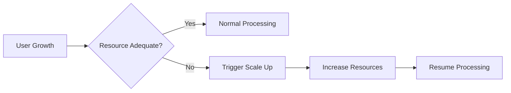

# Future Considerations and Roadmap

## Scalability

The todo list service is designed for sustainable growth and robust user experience as the user base and data requirements increase.

- WHEN user registration rate grows, THE system SHALL handle at least 10,000 monthly active users without noticeable delay in normal usage.
- WHEN up to 5,000 users interact with the service concurrently, THE system SHALL maintain high availability with no degradation of responsiveness in any core feature (adding, deleting, completing todos, or viewing lists).
- WHEN an individual user’s todo list exceeds 1,000 items, THE system SHALL guarantee that all CRUD (Create, Read, Update, Delete) operations remain responsive and complete within 2 seconds under normal workload.
- WHEN back-end server resource utilization reaches 80%, THE system SHALL immediately notify system operators with infrastructure scaling recommendations and provide automated guidance or triggers for scale-up procedures.
- WHEN spikes in usage occur (e.g., traffic doubles within a short window), THE system SHALL apply rate limiting transparently to burst requests while prioritizing UI stability and user satisfaction—users SHALL always receive feedback if any limit is applied.
- WHEN additional storage or compute power is needed, THE architecture SHALL support horizontal scaling and future distributed deployment.
- WHEN a global user base emerges, THE technical roadmap SHALL include phased plans for regional deployments and data sharding to optimize latency and regulatory compliance.

### Mermaid Diagram - Scalability Handling

## Possible Integrations

- WHEN the system integrates with a calendar service (e.g., Google Calendar, Outlook, or Apple Calendar), THE user SHALL be able to sync individual todo items with external calendar events, including one-way and bi-directional sync modes.
- WHEN notifications for todo deadlines are supported, THE system SHALL provide push, email, and/or SMS reminders for upcoming or overdue tasks, with user-manageable preferences and opt-in controls.
- WHEN collaboration needs arise, THE system SHALL implement workspace or team environments, and users SHALL be able to invite members, assign todos, and share status updates, subject to permission management.
- WHEN more advanced workflows are required, THE system SHALL support third-party automation (such as Zapier or IFTTT) to allow custom triggers and actions tied to todo item creation, completion, or reminder events.
- WHEN users need external reporting or archiving, THE system SHALL permit exports of all personal todo data in CSV or JSON format, with secure authentication before allowing any extract or download process.
- WHEN business analytics partnerships are made, THE system SHALL permit optional, anonymized event tracking to analyze user activity trends, feature adoption, and churn, ensuring compliance with relevant data privacy regulations.

| Integration Area        | Description                                                      |
|------------------------|------------------------------------------------------------------|
| Calendar Services      | Sync todos with Google/Outlook/Apple calendars                   |
| Notification Services  | Push/email/SMS reminders for due todos                           |
| Collaboration Tools    | Team task sharing via platforms like Slack or MS Teams            |
| File/Data Export       | Download user todo data in CSV/JSON                              |
| Usage Analytics        | Tracking for feature adoption, churn, and usage trends           |

## Known Constraints

- THE system SHALL be launched for individual users only, with every account being personal and private—no shared or collaborative lists or admin roles are available in the MVP.
- WHEN commercial or regulated use is attempted, THE application SHALL clearly state that it is not fit for such scenarios and is intended for personal productivity only.
- WHEN content is created within a todo item, THE input SHALL be limited to text only, with no attachments, sub-tasks, priorities, deadlines, or checklists in the initial release. Each todo SHALL have a simple text title and a completion status.
- WHEN password reset, sign-up, or notification features are used, THE system SHALL depend on availability of external transactional email services. Service interruptions at these providers MAY temporarily delay or prevent critical account operations.
- WHEN an unexpected increase in system load exceeds planned capacity, THE system SHALL enforce rate limiting and, in rare cases, temporarily deny service to new sessions until resource usage returns to acceptable levels, always returning user-friendly status information.
- THE system AND all user-facing content SHALL support English language only; multi-language support is deferred to post-MVP releases.

## Future Feature Ideas

- WHEN collaborative lists become a frequently requested feature, THE system SHALL implement multi-user capability with shareable lists, invitations, and role-based or permission-based access control, all with clear audit trails.
- WHEN feedback indicates user demand for organization, THE system SHALL introduce labels, colored tags, prioritization, and custom filtering for todos.
- WHEN reminders and notifications require more sophistication, THE system SHALL introduce configurable recurring reminders, snoozing, and multiple notification channels per task.
- WHEN users ask for alternative visualizations, THE system SHALL offer calendar and Kanban board views and allow toggling between visualization types for different workflow styles.
- WHEN non-English speaking users reach 10% of the user base or business opportunity is identified, THE system SHALL phase in multi-language/localization support, prioritizing languages based on user adoption.
- WHEN the need for integrations with enterprise collaboration software or file attachments emerges, THE system SHALL evaluate and roll out these features according to a prioritized product roadmap.
- WHEN automation or productivity integration demonstrates clear user value, THE system SHALL add API endpoints for third-party workflow automation.

| Feature                 | Priority   | Trigger for Release                               |
|-------------------------|------------|--------------------------------------------------|
| Shared/Collaborative Lists | Medium     | User requests/collaboration needs                |
| Custom Labels/Categories   | Medium     | User feedback on task organization               |
| Recurring Reminders       | Medium     | Users require routine scheduling                 |
| Visual Task Management    | Low        | Demand for alternate views of todos              |
| Third-Party Automation    | Low        | Integration value with external platforms        |
| Multi-language Support    | Low        | Substantial non-English user adoption            |

## Summary

The Todo List service is built for robust personal productivity, with scalability at its core and a product roadmap designed for incremental enhancement based on clear business needs and user demand. All MVP constraints, such as single-user operation, English-only support, and text-only todos, shall be strictly observed at launch. As the user base grows and requirements diversify, the system is engineered to anticipate and respond rapidly to new business opportunities, strategic integration requests, and changing compliance or operational needs. Product ownership and development teams should regularly review user feedback and analytics, ensuring ongoing prioritization of scalable, high-value features while preserving simplicity, privacy, and personal utility at every stage of the service evolution.