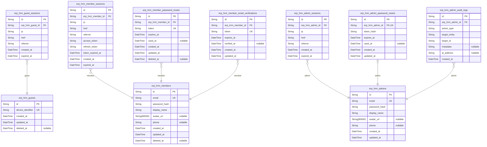
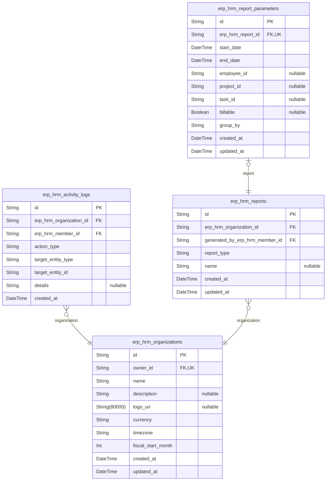
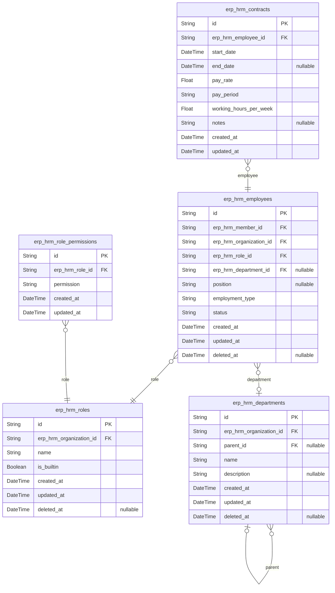
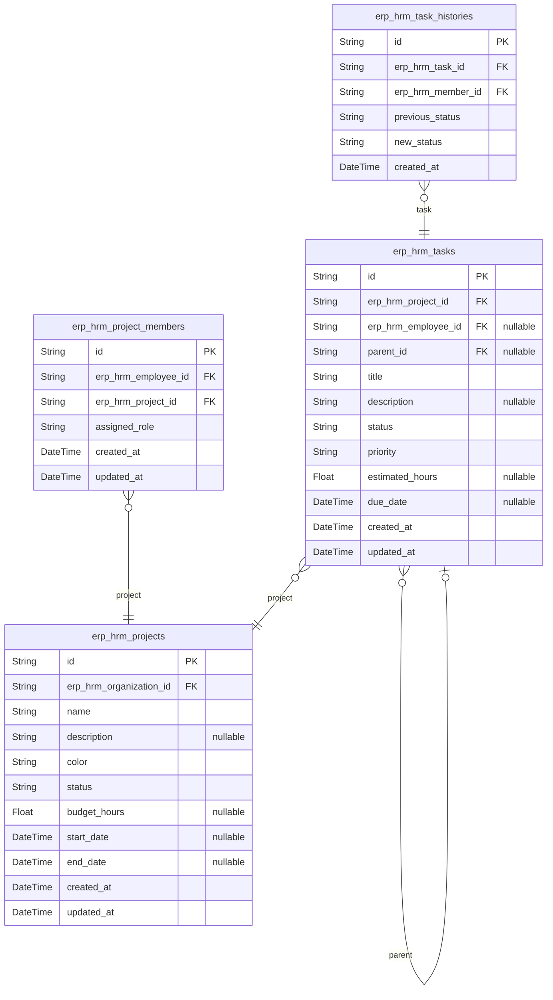
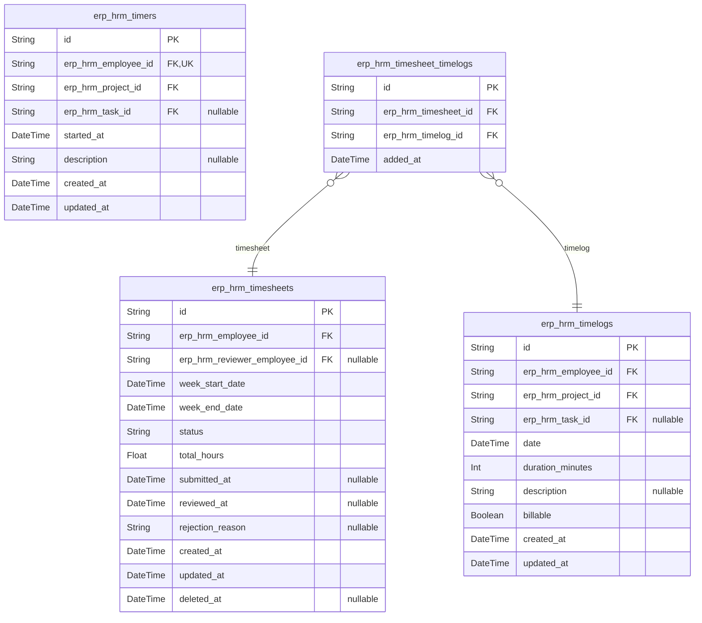
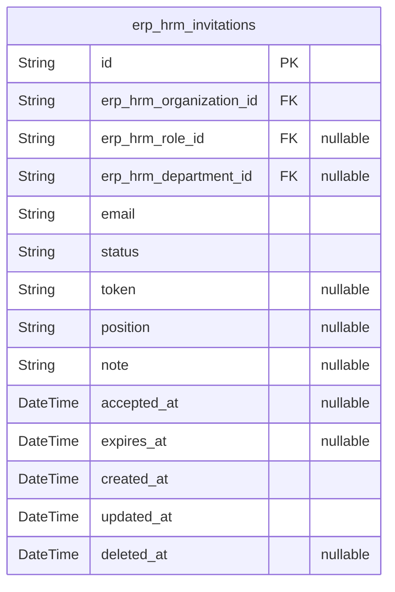

# Prisma Markdown

> Generated by [`prisma-markdown`](https://github.com/samchon/prisma-markdown)

- [Actors](#actors)
- [Systematic](#systematic)
- [HRM](#hrm)
- [Projects](#projects)
- [TimeTracking](#timetracking)
- [System](#system)

## Actors

### `erp_hrm_guests`

Temporary guest accounts identified by device for anonymous access before
registration or login.

This table stores guest user sessions identified by device identifier.
Guest accounts are lightweight, anonymous identities that allow users to
browse or perform limited actions before registering or logging in. Guest
accounts may be converted to full member accounts or discarded. The soft
delete pattern with deleted_at allows cleanup of stale guest records.

Properties as follows:

- `id`: Primary Key.
- `device_identifier`
  > Unique device identifier used for anonymous guest identification and
  > session binding.
- `created_at`: Timestamp when the guest account was created.
- `updated_at`: Timestamp when the guest account was last updated.
- `deleted_at`: Timestamp when the guest account was soft deleted. Null if active.

### `erp_hrm_guest_sessions`

Temporary session tokens for guest access with expiration. Stores
connection metadata (IP address, requested URL, referrer) for audit trail
and session management. Each session belongs to one guest and
automatically expires based on the configured session duration.

Properties as follows:

- `id`: Primary Key.
- `erp_hrm_guest_id`: Belonged guest's [erp_hrm_guests.id](#erp_hrm_guests).
- `ip`
  > Client IP address from the request for security audit and geographic
  > tracking.
- `href`: Requested URL path for session activity tracking.
- `referrer`: HTTP referrer header indicating the previous page URL.
- `created_at`: Session creation timestamp.
- `expired_at`: Session expiration timestamp when the session becomes invalid.

### `erp_hrm_members`

Registered user accounts with email and password credentials for
authentication. Users can belong to multiple organizations via Employee
records (erp_hrm_employees), with a shared global profile across all
organizations they belong to. This is the canonical identity record for
authenticated member actors in the system.

Properties as follows:

- `id`: Primary Key.
- `email`: Unique email address used for login and account identification.
- `password_hash`: Bcrypt hashed password for secure authentication.
- `display_name`: User's display name shown across all organizations.
- `avatar_uri`: URI to user's avatar image file.
- `phone`: User's phone number for contact purposes.
- `created_at`: Timestamp when the account was created.
- `updated_at`: Timestamp when the account was last updated.
- `deleted_at`: Timestamp for soft deletion. Null if account is active.

### `erp_hrm_member_sessions`

JWT session tokens for member authentication with access and refresh
token support. Tracks member login sessions including client metadata,
token validity, and session lifecycle. Each session belongs to one member
via erp_hrm_member_id. Sessions are created on login and invalidated on
logout or expiration.

Properties as follows:

- `id`: Primary Key.
- `erp_hrm_member_id`: Belonged member's [erp_hrm_members.id](#erp_hrm_members).
- `ip`: Client IP address from the login request.
- `href`: Current request URL when session was created.
- `referrer`: HTTP referrer header from the login request.
- `access_token`: JWT access token string for authenticated API requests.
- `refresh_token`: JWT refresh token string for obtaining new access tokens.
- `token_expired_at`: Expiration timestamp of the access token.
- `created_at`: Session creation timestamp.
- `expired_at`: Session expiration timestamp.

### `erp_hrm_member_password_resets`

Password reset tokens for member accounts with expiration and usage
tracking. Each token is linked to a specific member and can only be used
once to reset their password. Supports soft deletion for audit trail
compliance.

Properties as follows:

- `id`: Primary Key.
- `erp_hrm_member_id`: Member who requested the password reset. [erp_hrm_members.id](#erp_hrm_members).
- `token`
  > Hashed reset token string for security. Tokens should be hashed before
  > storage.
- `expires_at`: Expiration timestamp after which the token becomes invalid.
- `used_at`
  > Timestamp when the token was successfully used to reset password. Null if
  > unused.
- `created_at`: Timestamp when the password reset was requested.
- `updated_at`: Timestamp of last update to this record.
- `deleted_at`: Soft delete timestamp for audit trail. Null if not deleted.

### `erp_hrm_member_email_verifications`

Email verification tokens for member registration email verification.
Stores temporary tokens sent to new members during registration to
confirm email ownership. Tokens have expiration timestamps and are marked
as verified once the member completes the verification process.

Properties as follows:

- `id`: Primary Key.
- `erp_hrm_member_id`: Member whose email is being verified. [erp_hrm_members.id](#erp_hrm_members)
- `token`
  > Unique verification token string sent to the member's email for
  > verification.
- `expires_at`: Timestamp when this verification token expires and becomes invalid.
- `verified_at`
  > Timestamp when this verification token was successfully verified by the
  > member. Null if not yet verified.
- `created_at`: Timestamp when this verification record was created.
- `updated_at`: Timestamp when this verification record was last updated.

### `erp_hrm_admins`

Administrator accounts with elevated privileges for organization
management. Admin users have full access to organization settings,
employee management, project oversight, and time tracking approvals. Each
admin has their own authentication credentials separate from regular
member accounts.

Properties as follows:

- `id`: Primary Key.
- `email`
  > Email address used for authentication. Must be unique across all admin
  > accounts.
- `password_hash`: Bcrypt hashed password for secure authentication.
- `display_name`: Admin's display name shown in the interface and activity logs.
- `avatar_uri`: URL to the admin's profile avatar image.
- `phone`: Contact phone number for the admin.
- `created_at`: Timestamp when the admin account was created.
- `updated_at`: Timestamp when the admin account was last updated.

### `erp_hrm_admin_sessions`

JWT session tokens for administrator authentication with access and
refresh token support. Each session records the admin's login context
including IP address, navigation history, and expiration time. Sessions
are created upon admin login and invalidated upon logout or expiration.

Properties as follows:

- `id`: Primary Key.
- `erp_hrm_admin_id`: Belonged administrator's [erp_hrm_admins.id](#erp_hrm_admins).
- `ip`: Client IP address from which the session was created.
- `href`: Current request URL path for session tracking.
- `referrer`: HTTP referrer header indicating the previous page URL.
- `created_at`: Timestamp when the session was created.
- `expired_at`: Timestamp when the session expires and becomes invalid.

### `erp_hrm_admin_password_resets`

Password reset tokens for administrator password recovery. Stores hashed
reset tokens with expiration timestamps, supporting single-use token
semantics. Each admin can have only one active password reset request at
a time.

Properties as follows:

- `id`: Primary Key.
- `erp_hrm_admin_id`: The administrator requesting password reset. [erp_hrm_admins.id](#erp_hrm_admins)
- `token_hash`: Hashed password reset token for security.
- `expires_at`
  > Expiration timestamp of the reset token. After this time, the token is
  > invalid.
- `used_at`
  > Timestamp when the token was used to reset the password. Null if not yet
  > used.
- `created_at`: Timestamp when the password reset request was created.
- `updated_at`: Timestamp when the record was last updated.

### `erp_hrm_admin_audit_logs`

Immutable audit trail recording administrative actions performed by
administrators within the system for security compliance and
accountability purposes. Each record captures the admin who performed the
action, the action type, the target entity that was affected, and
additional metadata in JSON format. Action types include: employee
invited/deactivated/reactived, contract created/edited, project
created/archived/completed/deleted, task status changed, timesheet
submitted/approved/rejected, and role assigned/changed.

Properties as follows:

- `id`: Primary Key.
- `erp_hrm_admin_id`
  > Reference to the administrator who performed this action. {@link
  > erp_hrm_admins.id}.
- `action_type`
  > Type of administrative action performed (e.g., employee_invited,
  > employee_deactivated, contract_created, project_archived,
  > timesheet_approved).
- `target_entity`
  > Type of entity that was affected by this action (e.g., employee,
  > contract, project, task, timesheet, role).
- `target_id`: UUID of the entity that was affected by this action.
- `metadata`
  > JSON-formatted additional context about the action such as old/new
  > values, reason for rejection, or other relevant details.
- `ip_address`
  > IP address from which the admin performed this action for security
  > auditing.
- `created_at`: Timestamp when this action was performed. Audit records are immutable.

## Systematic

### `erp_hrm_organizations`

Main tenant container entity representing an organization with its
identity and configuration settings. This is the fundamental isolation
boundary in the multi-tenant erp_hrm system. All employees, projects,
departments, roles, and time tracking data belong to an organization.
Each organization has one owner (a member) who has full administrative
control including editing settings and deleting the organization.

Properties as follows:

- `id`: Primary Key.
- `owner_id`
  > Organization owner who has full administrative control. {@link
  > erp_hrm_members.id}.
- `name`: Organization display name shown throughout the application.
- `description`: Optional description of the organization.
- `logo_uri`: URL to the organization's logo image.
- `currency`
  > Organization's primary currency code for billing and reports (e.g., USD,
  > EUR, KRW).
- `timezone`
  > Organization's timezone for time tracking and scheduling (e.g.,
  > Asia/Seoul, America/New_York).
- `fiscal_start_month`: Month (1-12) when the organization's fiscal year starts.
- `created_at`: Timestamp when the organization was created.
- `updated_at`: Timestamp when the organization was last modified.

### `erp_hrm_activity_logs`

Organization-level activity audit trail recording significant actions
performed by users within the organization. Each log entry creates a
permanent record of what happened, who performed it, when it occurred,
and what was affected. Activity logs support historical review of
organizational changes and help administrators trace entity history back
to source actions. Logs are append-only; once recorded, an activity log
entry cannot be modified or deleted. All logs are strictly scoped to
their organization ensuring complete data isolation between tenants.
Logged actions include employee management events (invited, deactivated,
reactivated), contract lifecycle (created, edited), project lifecycle
(created, archived, completed, deleted), task status changes, timesheet
workflow (submitted, approved, rejected), and role assignments.

Properties as follows:

- `id`: Primary Key.
- `erp_hrm_organization_id`
  > Organization to which this activity log belongs. {@link
  > erp_hrm_organizations.id}.
- `erp_hrm_member_id`: Member who performed this action. [erp_hrm_members.id](#erp_hrm_members).
- `action_type`
  > Category of the action performed. Values: employee_invited,
  > employee_deactivated, employee_reactivated, contract_created,
  > contract_edited, project_created, project_archived, project_completed,
  > project_deleted, task_status_changed, timesheet_submitted,
  > timesheet_approved, timesheet_rejected, role_assigned, role_changed.
- `target_entity_type`
  > Type of the entity that was affected by this action. Examples: employee,
  > contract, project, task, timesheet, role.
- `target_entity_id`: UUID of the entity that was affected by this action.
- `details`
  > Additional context about the action in JSON format. Contains specific
  > change information such as old/new values, affected fields, or
  > supplementary notes.
- `created_at`: Timestamp when the action occurred.

### `erp_hrm_reports`

Stored reports generated for the organization including time reports,
project budget reports, and weekly summary reports with their filter
criteria and metadata.

Each report is scoped to a single organization and contains the
parameters used to generate it (date range, filtering criteria, grouping
preferences). Reports are generated on-demand by authorized users and
stored for later reference. The report_type field determines the type of
analysis: time reports show hours logged with billable breakdown, project
budget reports compare estimated vs actual hours, and weekly summary
reports provide rolling week-by-week metrics.

This table references [erp_hrm_organizations](#erp_hrm_organizations) for the tenant
context and [erp_hrm_members](#erp_hrm_members) for the user who generated the
report.

Properties as follows:

- `id`: Primary Key.
- `erp_hrm_organization_id`: The organization this report belongs to. [erp_hrm_organizations.id](#erp_hrm_organizations).
- `generated_by_erp_hrm_member_id`: The member who generated this report. [erp_hrm_members.id](#erp_hrm_members).
- `report_type`
  > Type of report determining the analysis format. Values: time_report,
  > project_budget_report, weekly_summary_report.
- `name`: Optional display name for the report.
- `created_at`: Timestamp when the report was generated.
- `updated_at`: Timestamp when the report was last updated.

### `erp_hrm_report_parameters`

Normalized filter parameters for reports, replacing JSON parameters field
with proper columns for date range, employee/project/task filters,
grouping preferences, and billable status. Each report has exactly one
set of parameters in a 1:1 relationship with erp_hrm_reports.

Properties as follows:

- `id`: Primary Key.
- `erp_hrm_report_id`
  > Associated report's [erp_hrm_reports.id](#erp_hrm_reports). Each report has exactly
  > one set of parameters in a 1:1 relationship.
- `start_date`: Start date of the report date range filter.
- `end_date`: End date of the report date range filter.
- `employee_id`
  > Optional filter for specific employee. When null, report includes all
  > employees.
- `project_id`
  > Optional filter for specific project. When null, report includes all
  > projects.
- `task_id`: Optional filter for specific task. When null, report includes all tasks.
- `billable`
  > Filter for billable status. True = billable only, False = non-billable
  > only, Null = include all.
- `group_by`: Grouping preference for the report: 'employee', 'project', or 'task'.
- `created_at`: Timestamp when the parameters were created.
- `updated_at`: Timestamp when the parameters were last updated.

## HRM

### `erp_hrm_employees`

Employee records linking users to organizations with role assignments and
employment details.

Each employee record represents the association between a user account
(member) and an organization. Employees are assigned a role that
determines their permissions within the organization. Each employee can
optionally belong to a department and can have multiple employment
contracts (though only one can be active at a time).

An employee must have an active status to log time or submit timesheets.
Deactivated employees preserve their historical data but cannot perform
time tracking operations.

Properties as follows:

- `id`: Primary Key.
- `erp_hrm_member_id`
  > User account associated with this employee record. {@link
  > erp_hrm_members.id}.
- `erp_hrm_organization_id`: Organization this employee belongs to. [erp_hrm_organizations.id](#erp_hrm_organizations).
- `erp_hrm_role_id`
  > Role assigned to this employee determining their permissions. {@link
  > erp_hrm_roles.id}.
- `erp_hrm_department_id`
  > Optional department this employee belongs to. {@link
  > erp_hrm_departments.id}.
- `position`: Job title or position of the employee within the organization.
- `employment_type`
  > Type of employment classification. Valid values: full-time, part-time,
  > contractor, intern.
- `status`
  > Employment status. Valid values: active (can log time and submit
  > timesheets), deactivated (historical data preserved but cannot perform
  > time tracking).
- `created_at`: Timestamp when the employee record was created.
- `updated_at`: Timestamp when the employee record was last updated.
- `deleted_at`: Timestamp when the employee record was soft deleted. Null if not deleted.

### `erp_hrm_roles`

Organization-scoped roles defining permission sets for employees. Each
role contains a name and a collection of permissions that determine what
actions assigned employees can perform. Three built-in roles (Owner,
Manager, Employee) cannot be deleted, while custom roles can be created
and managed by organization owners with org:manage permission. All role
names must be unique within an organization scope. Links to employees via
[erp_hrm_employees.role_id](#erp_hrm_employees) and to permissions via {@link
erp_hrm_role_permissions}.

Properties as follows:

- `id`: Primary Key.
- `erp_hrm_organization_id`: Organization this role belongs to. [erp_hrm_organizations.id](#erp_hrm_organizations).
- `name`
  > Role name unique within the organization. Examples: Owner, Manager,
  > Employee, or custom role names.
- `is_builtin`
  > Whether this is a built-in role that cannot be deleted. Built-in roles
  > are Owner, Manager, and Employee.
- `created_at`: Timestamp when the role was created.
- `updated_at`: Timestamp when the role was last updated.
- `deleted_at`: Soft delete timestamp. Null if not deleted.

### `erp_hrm_role_permissions`

Junction table linking roles to their assigned permissions. Each role can
have multiple permissions, and each permission can be assigned to
multiple roles. Permissions are string codes (e.g., 'org:manage',
'employee:manage', 'project:view'). This table enforces that the same
permission cannot be assigned twice to the same role.

Properties as follows:

- `id`: Primary Key.
- `erp_hrm_role_id`: Belonged role's [erp_hrm_roles.id](#erp_hrm_roles).
- `permission`
  > Permission code string such as 'org:manage', 'employee:manage',
  > 'employee:view', 'project:manage', 'project:view', 'time:manage',
  > 'time:approve', 'time:view_all', or 'report:view'.
- `created_at`: Record creation timestamp.
- `updated_at`: Record last update timestamp.

### `erp_hrm_departments`

Organization departments supporting optional one-level parent hierarchy
for organizational structure.

Each department belongs to exactly one organization and can optionally
have a parent department for hierarchical categorization. The one-level
parent constraint ensures simple organizational structures without deep
nesting. Departments provide a way to group employees within an
organization for reporting and management purposes.

Related entities:
- Belongs to [erp_hrm_organizations](#erp_hrm_organizations) as the tenant container
- Employees in [erp_hrm_employees](#erp_hrm_employees) reference this for department
assignment
- Parent department creates self-referential hierarchy via {@link
erp_hrm_departments.parent_id}

Properties as follows:

- `id`: Primary Key.
- `erp_hrm_organization_id`
  > Belonged organization's [erp_hrm_organizations.id](#erp_hrm_organizations). Each department
  > must belong to an organization for multi-tenant isolation.
- `parent_id`
  > Optional parent department's [erp_hrm_departments.id](#erp_hrm_departments) for one-level
  > hierarchical categorization. Null indicates a root-level department.
- `name`: Department name used for identification within the organization.
- `description`
  > Optional description providing details about the department's purpose or
  > responsibilities.
- `created_at`: Timestamp when the department was created.
- `updated_at`: Timestamp when the department was last modified.
- `deleted_at`: Soft delete timestamp. Null means active, non-null means deleted.

### `erp_hrm_contracts`

Employee contracts storing employment terms with temporal constraints.
Each contract defines pay rate, pay period, working hours, and validity
dates for an employment relationship. Only one contract can be active at
a time per employee. Contracts are immutable historical records - past
contracts cannot be edited once superseded.

This table is always managed through its parent [erp_hrm_employees](#erp_hrm_employees)
entity. Users cannot create, search, or manage contracts independently
from employees.

Properties as follows:

- `id`: Primary Key.
- `erp_hrm_employee_id`: Belonged employee this contract belongs to. [erp_hrm_employees.id](#erp_hrm_employees)
- `start_date`: Contract start date. Required. Marks when this contract term begins.
- `end_date`
  > Contract end date. Optional - null indicates an ongoing contract with no
  > end date.
- `pay_rate`
  > Pay rate amount for this contract. Numeric value representing
  > compensation.
- `pay_period`
  > Pay period type. One of: hourly, daily, weekly, monthly. Determines how
  > pay rate is applied.
- `working_hours_per_week`: Contracted working hours per week. Required numeric value.
- `notes`: Optional notes or comments about this contract.
- `created_at`: Timestamp when this contract was created.
- `updated_at`: Timestamp when this contract was last updated.

## Projects

### `erp_hrm_projects`

Work containers that organize time tracking and task management within an
organization.

Each project serves as a central hub for grouping related work items and
time entries. Projects support lifecycle management through status
transitions (active, archived, completed) and can optionally include
budget tracking and date boundaries. All project data is strictly
isolated within the owning organization.

Projects have relationships with project members (employee assignments
with roles), tasks (work items that can be assigned to members), and
timelogs (time entries logged against the project). The color code
enables visual differentiation in UI displays.

Properties as follows:

- `id`: Primary Key.
- `erp_hrm_organization_id`: Organization that owns this project. [erp_hrm_organizations.id](#erp_hrm_organizations)
- `name`: Project name displayed in the UI and used for identification.
- `description`: Optional detailed description explaining the project's purpose and scope.
- `color`: Hex color code for UI visual differentiation (e.g., #FF5733).
- `status`
  > Project lifecycle status. Values: active (receiving timelogs), archived
  > (no new timelogs), completed (no new timelogs).
- `budget_hours`: Total estimated hours for the project. Used for budget tracking reports.
- `start_date`: Optional planned start date for the project.
- `end_date`: Optional planned end date for the project.
- `created_at`: Timestamp when the project was created.
- `updated_at`: Timestamp when the project was last modified.

### `erp_hrm_project_members`

Links employees to projects with assigned roles, enabling employee
participation in multiple projects. Each record represents an employee's
membership in a project with a specific role (member or project-lead)
that determines their permissions within that project.

Properties as follows:

- `id`: Primary Key.
- `erp_hrm_employee_id`
  > Linked employee who is assigned to the project. {@link
  > erp_hrm_employees.id}.
- `erp_hrm_project_id`
  > Linked project that the employee is assigned to. {@link
  > erp_hrm_projects.id}.
- `assigned_role`
  > Role assigned to the employee in this project. Values: 'member' (regular
  > project member) or 'project_lead' (manages tasks in the project).
- `created_at`: Timestamp when the employee was assigned to the project.
- `updated_at`: Timestamp when the project membership was last updated.

### `erp_hrm_tasks`

Work items within a project for task assignment and tracking. Tasks
support one level of subtasking via optional parent task reference. Each
task has status (open, in-progress, completed, closed) and priority (low,
medium, high, urgent) for workflow management. Task status changes are
recorded in [erp_hrm_task_histories](#erp_hrm_task_histories) for audit trail.

Properties as follows:

- `id`: Primary Key.
- `erp_hrm_project_id`: Project this task belongs to. [erp_hrm_projects.id](#erp_hrm_projects).
- `erp_hrm_employee_id`
  > Employee assigned to this task. [erp_hrm_employees.id](#erp_hrm_employees). Optional -
  > must be a project member.
- `parent_id`
  > Parent task for subtasking. [erp_hrm_tasks.id](#erp_hrm_tasks). Optional - one
  > level of nesting only.
- `title`: Task title describing the work to be done.
- `description`: Detailed description of the task.
- `status`: Task workflow status. Values: open, in-progress, completed, closed.
- `priority`: Task priority level. Values: low, medium, high, urgent.
- `estimated_hours`: Estimated hours to complete the task.
- `due_date`: Task due date for deadline tracking.
- `created_at`: Timestamp when the task was created.
- `updated_at`: Timestamp when the task was last modified.

### `erp_hrm_task_histories`

Immutable audit trail that records each status transition made to a task
throughout its lifecycle. Every time a task changes from one status to
another, a new history entry is automatically created to document that
change. The history serves as an immutable record that tracks the
complete progression of a task from its initial status through all
subsequent changes until completion. This record cannot be modified,
deleted, or reordered once created. Users can review this history to
understand the progression of work on a task, identify when specific
status transitions occurred, and determine who was responsible for each
change. [erp_hrm_tasks](#erp_hrm_tasks) owns this audit trail through the task_id
foreign key.

Properties as follows:

- `id`: Primary Key.
- `erp_hrm_task_id`: The task whose status was changed. [erp_hrm_tasks.id](#erp_hrm_tasks)
- `erp_hrm_member_id`: The member who initiated the status change. [erp_hrm_members.id](#erp_hrm_members)
- `previous_status`: The status value the task held before the change was initiated.
- `new_status`: The status value the task now holds after the change was completed.
- `created_at`: Timestamp when the status change occurred.

## TimeTracking

### `erp_hrm_timelogs`

Individual time entries logged by employees with date, duration,
project/task associations, and billable flag. Each timelog records a
discrete time tracking entry that employees can create, edit, and delete
subject to timesheet workflow constraints. Timelogs not yet included in
submitted/approved timesheets can be freely modified, while those in
approved timesheets are locked from editing.

Properties as follows:

- `id`: Primary Key.
- `erp_hrm_employee_id`: Employee who logged this time entry. [erp_hrm_employees.id](#erp_hrm_employees)
- `erp_hrm_project_id`
  > Project to which this time entry is associated. {@link
  > erp_hrm_projects.id}
- `erp_hrm_task_id`
  > Optional task within the project that this time entry is logged against.
  > [erp_hrm_tasks.id](#erp_hrm_tasks)
- `date`: Date when the time was logged (date portion only, time portion ignored).
- `duration_minutes`: Duration of the time entry in minutes.
- `description`: Optional description explaining what work was done during this time entry.
- `billable`
  > Flag indicating whether this time entry is billable to the client.
  > Default is true.
- `created_at`: Timestamp when this timelog record was created.
- `updated_at`: Timestamp when this timelog record was last updated.

### `erp_hrm_timesheets`

Weekly timesheet container grouping timelogs for submission and approval
workflow with status tracking.

Each timesheet represents a work week (Monday to Sunday) belonging to an
employee. The employee creates a draft timesheet, adds/removes timelogs,
and submits for approval. Users with time:approve permission can approve
or reject submitted timesheets. Approved timesheets lock all included
timelogs. Rejected timesheets return to draft status for resubmission.

Workflow status transitions: draft → submitted → approved | rejected
(back to draft). The total_hours field is calculated from included
timelogs for reporting efficiency. The reviewer_employee field is
populated when a timesheet is approved or rejected.

Properties as follows:

- `id`: Primary Key.
- `erp_hrm_employee_id`
  > Employee who owns this timesheet and whose timelogs are aggregated.
  > [erp_hrm_employees.id](#erp_hrm_employees).
- `erp_hrm_reviewer_employee_id`
  > Employee who reviewed (approved or rejected) this timesheet. {@link
  > erp_hrm_employees.id}. Null until timesheet is approved or rejected.
- `week_start_date`
  > Start date of the timesheet week, always a Monday. Used with
  > week_end_date to define the billing period.
- `week_end_date`
  > End date of the timesheet week, always a Sunday. Used with
  > week_start_date to define the billing period.
- `status`
  > Current workflow status of the timesheet. Values: draft (editable, not
  > submitted), submitted (awaiting approval), approved (locked), rejected
  > (returned to draft with reason).
- `total_hours`
  > Total hours calculated from all timelogs included in this timesheet. Used
  > for quick reporting without recalculating.
- `submitted_at`
  > Timestamp when the employee submitted this timesheet for approval. Null
  > until submitted.
- `reviewed_at`
  > Timestamp when a reviewer approved or rejected this timesheet. Null until
  > reviewed.
- `rejection_reason`
  > Reason provided when rejecting a submitted timesheet. Required when
  > status changes to rejected.
- `created_at`: Timestamp when this timesheet was created as a draft.
- `updated_at`: Timestamp when this timesheet was last modified.
- `deleted_at`: Timestamp for soft deletion. Null when active, set when deleted.

### `erp_hrm_timers`

Live timer sessions for real-time time tracking that convert to timelogs
when stopped.

Each timer is owned by an employee and tracks time against a specific
project. The timer records when it was started, which project and
optional task are being timed, and an optional description of the work.

Business rules:
- Each employee can have at most one active timer at a time (enforced by
unique employee_id)
- Stopping a timer creates a corresponding timelog entry
- Discarding a timer removes it without creating any timelog
- Timers can be edited while running (description, project, task)

Referenced by erp_hrm_employees for timer ownership and erp_hrm_timelogs
for the conversion relationship.

Properties as follows:

- `id`: Primary Key.
- `erp_hrm_employee_id`: Employee who owns and controls this timer. [erp_hrm_employees.id](#erp_hrm_employees)
- `erp_hrm_project_id`: Project being timed. [erp_hrm_projects.id](#erp_hrm_projects)
- `erp_hrm_task_id`: Task being timed, optional. [erp_hrm_tasks.id](#erp_hrm_tasks)
- `started_at`: Timestamp when the timer was started.
- `description`: Optional description of the work being timed.
- `created_at`: Record creation timestamp.
- `updated_at`: Record last update timestamp.

### `erp_hrm_timesheet_timelogs`

Junction table linking timesheets to their contained timelogs, supporting
the workflow of adding or removing entries from draft timesheets. Each
record represents an association between a timesheet and a timelog,
enabling employees to include or exclude specific time entries when
preparing timesheets for submission.

Properties as follows:

- `id`: Primary Key.
- `erp_hrm_timesheet_id`
  > Reference to the timesheet this timelog is associated with. {@link
  > erp_hrm_timesheets.id}
- `erp_hrm_timelog_id`
  > Reference to the timelog being associated with the timesheet. {@link
  > erp_hrm_timelogs.id}
- `added_at`: Timestamp when the timelog was added to the timesheet.

## System

### `erp_hrm_invitations`

Email invitations sent to potential employees to join an organization as
team members. Each invitation belongs to one organization and targets a
specific email address. Invitations track their lifecycle from creation
through acceptance or expiration. When inviting an existing user, the
employee record is created immediately. When inviting a new user, a
pending invitation is created and automatically linked when the user
registers with that email. [erp_hrm_organizations](#erp_hrm_organizations) is the owning
organization. Optional role and department assignments can be
pre-specified for streamlined onboarding.

Properties as follows:

- `id`: Primary Key.
- `erp_hrm_organization_id`: Organization that sent this invitation. [erp_hrm_organizations.id](#erp_hrm_organizations)
- `erp_hrm_role_id`
  > Pre-assigned role for the invited employee. Optional - can be changed
  > after onboarding. [erp_hrm_roles.id](#erp_hrm_roles)
- `erp_hrm_department_id`
  > Pre-assigned department for the invited employee. Optional. {@link
  > erp_hrm_departments.id}
- `email`
  > Email address of the person being invited. Serves as the unique
  > identifier for matching invitations to users during registration.
- `status`
  > Current state of the invitation. Values: pending (awaiting user
  > registration), accepted (user joined organization), expired (no longer
  > valid).
- `token`
  > Secure token for invitation link. Used to verify invitation authenticity
  > when accessed.
- `position`: Pre-specified position or job title for the invited employee.
- `note`: Optional message from the organization to the invited person.
- `accepted_at`
  > Timestamp when the invitation was accepted and employee record was
  > created.
- `expires_at`: Timestamp when this invitation expires and becomes invalid.
- `created_at`: Timestamp when the invitation was created.
- `updated_at`: Timestamp when the invitation was last modified.
- `deleted_at`: Timestamp for soft deletion. Null if not deleted.
