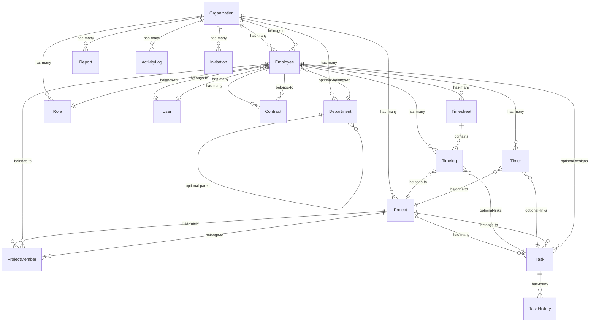
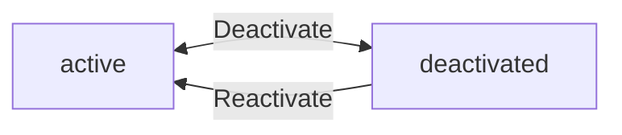
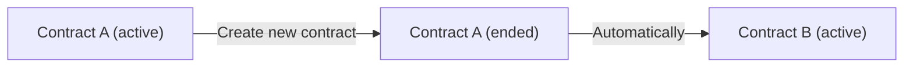
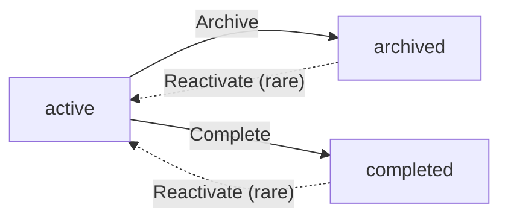
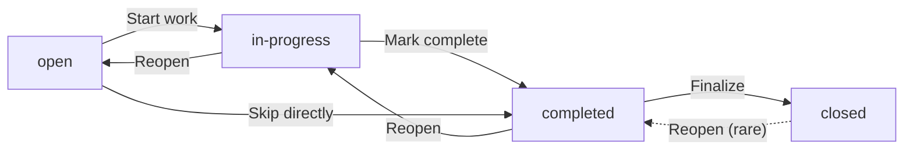
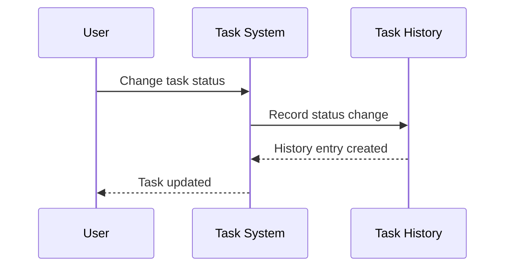
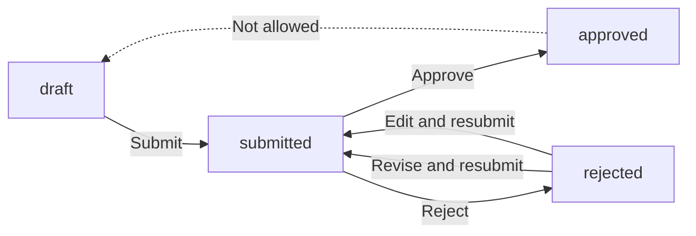
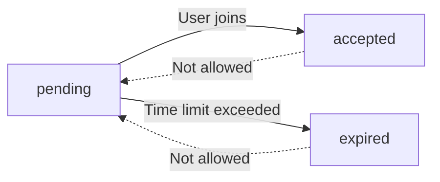
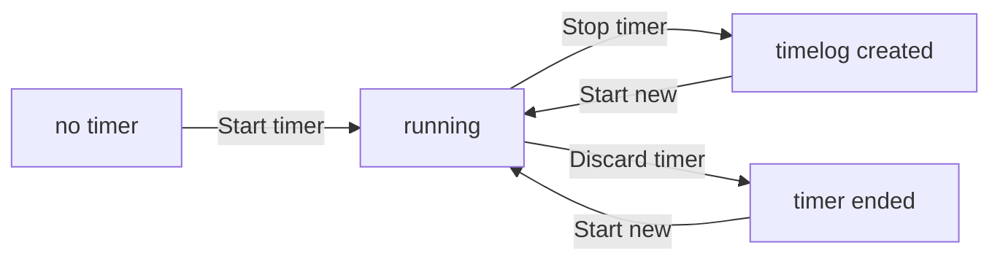

**erpHrm — Business concepts, relationships, and states from user perspective**

Business concepts, relationships, and states from user perspective

# Domain Concepts

Describe what each concept means in the business domain and its key attributes.

## Organization Concept

An Organization represents a tenant in the multi-tenant platform, serving as the top-level container for all business operations. Each organization has a name that identifies the business entity and an optional description explaining its purpose. The organization stores a logo image for visual identification in the user interface. The currency setting determines the monetary format for displaying pay rates and financial reports across the organization. The timezone configuration controls how dates and times are displayed for all users within the organization. The fiscal start month defines which month begins the organization's fiscal year for financial reporting purposes. Organizations operate completely independently from one another, with strict data isolation ensuring no cross-organization visibility.

### Organization as Tenant Container

An Organization represents the primary tenant container in the multi-tenant platform. Each organization functions as a completely self-contained business unit with its own workforce, projects, and operational data. Organizations enable multiple unrelated businesses to share the same platform while maintaining strict data separation. When a user registers on the platform, they must create their first organization, which becomes their organizational home. Users may subsequently join additional organizations through invitations, but their primary association begins with the organization they created during sign-up. The organizational context determines which data users can access at any given time, ensuring that employees of one company never encounter information belonging to another.

### Organization Identity Attributes

Each organization is identified by a unique name that represents the business entity. The name appears throughout the platform wherever the organization is referenced, including in reports, notifications, and user interface elements. Organizations may optionally provide a description explaining their purpose, industry, or other relevant context that helps users understand the business scope. A visual logo image may be associated with the organization to aid in visual identification within the interface. These identity attributes help users quickly recognize and distinguish between multiple organizations when they have access to more than one.

### Organization Regional and Fiscal Settings

Organizations configure regional settings that affect how financial and temporal data is displayed throughout the platform. The currency setting determines the monetary format used for displaying pay rates, financial reports, and budget figures. Organizations select their primary currency from a predefined list of international currency codes. The timezone configuration controls how dates and times are presented to all users within the organization, ensuring consistency with the business location. The fiscal start month defines which month initiates the organization's fiscal year for financial reporting purposes, allowing budget reports and summaries to align with the organization's accounting cycle rather than the calendar year.

### Data Isolation Between Organizations

Strict data isolation ensures that organizations operate as independent business entities with no visibility into each other's data. Employees working within one organization cannot access projects, employees, timelogs, or any other information belonging to another organization, even if they hold user accounts in both. This isolation is enforced at the platform level on every request, with the currently selected organization context determining the scope of available data. When users who belong to multiple organizations switch between them, the platform presents entirely separate datasets appropriate to each organizational context. Historical records such as timelogs, timesheets, and project data remain permanently associated with their originating organization and are never shared or transferable across organizational boundaries.

### Organization Lifecycle and Deletion

Organization owners possess the ability to modify their organization's settings, including the name, description, logo, currency, timezone, and fiscal start month. These settings can be updated at any time to reflect changes in the business. However, an organization can only be deleted when specific conditions are met: all pending timesheets must be resolved through approval or rejection, and no active employee contracts may remain. Upon deletion, all associated data including employees, projects, tasks, timelogs, and timesheets are permanently removed. The owner's user account persists but becomes unassociated with any organization, allowing the individual to create a new organization or join an existing one.

## User Concept

A User represents a person who can access the platform using their email address and password. The email address serves as the unique identifier for the user account and is used for login authentication. The password is stored securely and allows the user to authenticate into the system. Users maintain a global profile that spans across all organizations they belong to, including a display name for identification, an avatar image for visual representation, and a phone number for contact purposes. A single user account can be associated with multiple organizations, allowing the same person to work in different companies or contexts. The user's profile information remains consistent regardless of which organization they are currently operating within.

### User Account

A User Account represents an individual who can access the ERP platform. The account serves as the primary identity mechanism and is required for any interaction with the system. Each user account must be associated with a valid email address and a secure password. The email address acts as the unique identifier for the account, meaning no two accounts can share the same email address within the system.

### Email as Unique Identifier

The email address serves as both the login credential and the unique identifier for a user account. When a user registers, they must provide a valid email address that is not already in use by another account. This email address is used to log into the platform and to receive communications from the system, including organization invitations. The system enforces uniqueness at the account level, ensuring that each email maps to exactly one user account across all organizations in the platform.

### Password Security

Users must create a password when registering their account. The password is stored securely within the system and is never displayed in plain text after initial creation. When logging in, the user must provide the correct password associated with their email address. Users have the ability to change their password at any time through their account settings. The password must meet minimum security standards to ensure account protection.

### User Profile

Each user maintains a user profile that stores personal information visible to other users across the platform. The profile includes a display name that identifies the user in the interface and in communications. The display name is shown in employee records, activity logs, timesheets, and other areas where the user's identity needs to be shown. Users can update their display name at any time through their profile settings.

### Avatar Image

Users can optionally upload an avatar image to represent themselves visually within the platform. The avatar appears next to the user's name in employee lists, timesheets, activity logs, and other relevant areas. If no avatar is uploaded, a default representation is shown. Users can change or remove their avatar at any time through their profile settings.

### Phone Number Contact

Users can optionally provide a phone number as part of their profile. This contact field allows other members of the organization to reach the user for work-related communications. The phone number is stored with the user's profile and is visible to other users within the same organization based on their role permissions.

### Multi-Organization Membership

A single user account can belong to multiple organizations simultaneously, allowing the same person to work in different companies or organizational contexts. When a user belongs to multiple organizations, they must select which organization to work in when logging in or switching contexts. All actions performed within the platform are scoped to the currently selected organization. Users can switch between their organizations without needing to log out and log back in, providing a seamless experience for those working across multiple organizations.

### Shared Profile Across Organizations

The user's profile information, including display name, avatar, and phone number, is shared across all organizations the user belongs to. When a user updates their profile in one organization context, the changes are immediately reflected in all other organizations they belong to. This ensures consistency in how the user is represented throughout the platform regardless of which organization they are currently working within.

## Employee Concept

An Employee represents a user's role and employment details within a specific organization. Each employee record is linked to a user account, establishing who the employee is in the system. The employee is assigned a role that determines their permissions within the organization context. An optional department field categorizes the employee within the organization's structure, while an optional position or title field records their job title. The employment type classifies the nature of the working arrangement, which can be full-time, part-time, contractor, or intern. The status field indicates whether the employee is currently active and able to perform work activities or has been deactivated. A user can have multiple employee records if they belong to different organizations, with each record specific to its organization.

### Employee Definition and Identity

An Employee is a business concept that represents a person's role and employment relationship within a specific organization. Unlike a User account which is global and can span multiple organizations, an Employee record is always tied to exactly one organization. This separation allows the same person to work for multiple organizations while maintaining separate employment records, permissions, and data in each.

Each Employee record establishes a link to a User account, which provides the employee's identity credentials and global profile information. This linkage means the employee can log in using their user account and their actions are attributed to them across the system.

### Role Assignment

Every Employee is assigned a Role within the organization they belong to. The role determines what permissions the employee has for performing actions within that organization's context. An employee can only have one role at a time within a given organization, though the same user may have different roles in different organizations if they are employed by multiple.

Role assignment establishes the employee's authority level and access scope. For example, one user might be an Owner in one organization they co-founded, a Manager in another company they consult for, and an Employee in a third organization where they are a contractor. The role assignment can be changed by users with appropriate permissions when an employee's responsibilities change.

### Department Categorization

An Employee may optionally be assigned to a Department within the organization. The department categorizes the employee within the organization's structural hierarchy, helping organize reporting lines, project assignments, and reporting views. Employees without a department assignment are not categorized and appear as uncategorized within the organization's structure.

The department assignment is optional because not all organizations use departments, or an employee may span multiple departments without being formally assigned to one. Department information helps with filtering employee lists and generating reports by organizational unit.

### Position and Title

An Employee may optionally hold a Position or Title within the organization. This field records the employee's job title such as "Software Engineer", "Marketing Manager", or "Sales Representative". The position is purely informational and does not affect permissions or system behavior.

A user can have the same or different positions across different organizations if they hold multiple employee records. The position field supports free-form text to accommodate various naming conventions across different organizations.

### Employment Type Classification

Employment Type classifies the nature of the working arrangement between the employee and the organization. This classification affects how work hours are tracked and reported, and helps with workforce analytics.

**Full-time Employment**: A standard employment arrangement with regular working hours, typically 40 hours per week. Full-time employees are eligible for benefits and have ongoing employment until separated.

**Part-time Employment**: An arrangement with reduced working hours, typically less than 40 hours per week. Part-time employees work fewer hours but may have the same duties as full-time employees.

**Contractor Employment**: A non-employee worker engaged for specific projects or time periods. Contractors are typically paid at higher rates and are not employees of the organization. Their work arrangement is defined by a contract rather than ongoing employment.

**Intern Employment**: A temporary position for individuals gaining work experience, often students or recent graduates. Internships are typically fixed-duration and may be paid or unpaid.

### Employee Status

Status indicates whether an Employee is currently active and able to perform work within the organization.

**Active Status**: The employee is currently employed and can log time, submit timesheets, be assigned to projects, and participate in organizational workflows. Active employees appear in employee lists by default.

**Deactivated Status**: The employee has been removed from active duty but their historical records are preserved. Deactivated employees cannot log new time entries or submit timesheets. Their existing timelogs, timesheets, and project memberships remain unchanged and visible in historical reports. A deactivated employee can be reactivated if they return to work.

### Employee Record per Organization

The same User can have multiple Employee records, with one record for each organization they belong to. This design supports multi-tenancy where individuals work across different companies using a single login credential.

Each Employee record is independent and stores its own role, department, position, employment type, and status specific to that organization. Actions taken in one organization context do not affect the employee's status or data in other organizations.

When a user switches organizations after logging in, they work within the context of whichever employee record corresponds to their selected organization. All subsequent actions are scoped to that specific organization, ensuring strict data isolation between organizations.

## Role Concept

A Role represents a named set of permissions that determines what actions a user can perform within an organization. Each role has a name that identifies it and a collection of permissions that define its capabilities. The platform provides three built-in roles that cannot be deleted: Owner, which grants full access to all features; Manager, which allows managing employees, projects, and approving timesheets; and Employee, which permits time tracking and submitting timesheets. Organization owners can create custom roles with specific permission combinations tailored to their needs. Each role belongs to a specific organization, ensuring that permissions are scoped appropriately. The built-in roles provide standard access patterns while custom roles offer flexibility for organizations with unique requirements.

### Role and Permission Set

A Role represents a named set of permissions that determines what actions a user can perform within an organization. Each role contains a permission set, which is a collection of specific capabilities that grant access to particular features and operations. The permission set acts as the definitive list of what a user assigned to that role is allowed to do. When a user is assigned a role, they inherit all permissions included in that role's permission set.

### Role Name Identification

Each role is identified by its name within an organization. The name serves as the primary identifier that users and administrators see when managing role assignments. Role names must be unique within an organization, though different organizations may have roles with the same name. The name should clearly indicate the purpose or level of access the role provides.

### Built-in Roles Overview

The platform provides three built-in roles that serve as the foundation for access control in every organization. These roles cannot be modified in their core definition or deleted from the system. Built-in roles ensure that essential capabilities are always available and that certain administrative functions remain protected. The three built-in roles are Owner, Manager, and Employee.

### Owner Role Capabilities

The Owner role grants full access to all features and capabilities within the organization. Owners can manage organization settings, create and delete roles, invite and manage employees, create and manage projects, and approve or reject timesheets. This role is automatically assigned to the user who creates the organization and cannot be revoked as long as they remain a member. Owners have the ability to transfer ownership to another employee.

### Manager Role Capabilities

The Manager role provides elevated permissions for day-to-day operations without granting full administrative control. Managers can add, edit, and deactivate employees, create and manage projects and tasks, view reports, and approve or reject timesheets. However, Managers cannot modify organization settings or delete the organization. This role is suitable for team leads or department supervisors who need operational control.

### Employee Role Capabilities

The Employee role provides the baseline permissions for regular users who need to track time and manage their own work. Employees can log time entries, create and submit timesheets, view tasks assigned to them, and access their personal dashboard. Employees cannot view other employees' data, manage projects, or approve timesheets. This role is the default assignment for newly invited team members.

### Custom Role Creation

Organization owners can create custom roles to address specific organizational needs. Custom roles allow organizations to define precisely scoped permission sets that match their unique workflows. Each custom role requires a unique name within the organization and an explicit set of permissions selected from the available options. Custom roles can be created, edited, and deleted as the organization's needs evolve.

### Organization-Specific Roles

Every role belongs to a specific organization and is not shared across organizations. This ensures that role definitions and permissions are scoped appropriately and that employees in one organization cannot accidentally gain access to another organization's data through shared roles. When an organization is deleted, all its custom roles are permanently removed along with it.

### Permission-Based Access Control

Access to system features is controlled through permissions assigned to roles. Each permission represents a specific capability such as managing employees, viewing reports, or approving timesheets. When a user attempts to perform an action, the system checks whether their role includes the required permission. If the permission is present, the action is allowed; if not, the action is denied. This model ensures granular and consistent access control across all features.

### Role Deletion Constraints

Built-in roles cannot be deleted from the system. This constraint exists because built-in roles represent fundamental access levels that every organization requires to function properly. Removing the Owner, Manager, or Employee role could leave organizations without essential capabilities such as administrative control or basic time tracking. Custom roles can be deleted, but only when no employees are currently assigned to them.

## Department Concept

A Department represents an organizational unit that groups employees together for structural and reporting purposes. Each department has a name that identifies it within the organization and an optional description explaining its function or responsibilities. Departments can be arranged in a hierarchical structure with one level of nesting through an optional parent department reference, allowing organizations to represent divisions and subdivisions. The department belongs to a specific organization and is used to categorize employees within the company's structure. Employees may be assigned to a department or have no department assignment depending on their position.

### Department as Organizational Unit

A department is an organizational unit that represents a functional area, team, or division within an organization. Departments group employees together for structural, reporting, and administrative purposes.

Each department belongs to exactly one organization and serves as a way to organize the company's workforce into logical groupings. The organization can create as many departments as needed to reflect its structure, such as Engineering, Sales, Human Resources, or Marketing.

Departments are distinct from roles in that they represent organizational structure rather than permissions. An employee's department indicates where they work within the organization, while their role determines what actions they can perform.

### Department Name

Every department must have a name that uniquely identifies it within the organization. The department name is a required attribute used to reference the department in lists, reports, and employee records.

Department names should be descriptive enough to clearly indicate the department's purpose or function. Examples include "Engineering", "Customer Support", or "Finance and Accounting".

The department name appears when filtering the employee list by department and when viewing the organization's department structure.

### Department Description

A department may have a description that provides additional context about its function, responsibilities, or scope within the organization. The description is optional and can be used to clarify the department's purpose.

For example, an Engineering department might have a description explaining that it handles software development, system architecture, and technical infrastructure. This helps other employees understand what each department does without needing to ask.

The description is visible when viewing department details and can be edited by users with the appropriate permissions.

### Department Hierarchy

Departments can be arranged in a hierarchical structure to reflect the organization's reporting lines or divisions. This hierarchy allows organizations to represent high-level divisions that contain specific departments.

The hierarchy supports one level of nesting, meaning a department can optionally have a parent department. A department with a parent is considered a subdivision of that parent department. For example, a "Frontend Engineering" department might have "Engineering" as its parent, while "Backend Engineering" also has "Engineering" as its parent.

A department cannot have another department as its parent if that parent already has a parent (no multi-level nesting). This ensures the organizational structure remains flat and manageable. Departments without a parent are considered top-level departments within the organization.

### Parent Department Relationship

The parent department relationship links a department to a parent department, establishing the organizational hierarchy. This relationship is optional and represents the chain of command or functional grouping within the organization.

When a department has a parent, it is considered a child department belonging to that parent. The parent department must exist within the same organization as the child department. A department can be the parent of multiple child departments, but each child department can have only one parent.

The parent-child relationship affects how departments are displayed in organizational charts and reports. It helps visualize the company's structure from broad divisions down to specific teams.

When a department is deleted, its child departments become top-level departments with no parent assignment. This prevents orphaned hierarchies.

### Employee Grouping by Department

Employees are associated with departments to reflect their placement within the organization's structure. An employee can belong to exactly one department at any given time, though this assignment can be changed as the employee moves within the organization.

Grouping employees by department enables various organizational features:
- Viewing all employees within a specific department
- Filtering reports by department to see time logged or tasks assigned
- Organizing the employee directory by functional area
- Assigning work or projects based on departmental expertise

Deactivated employees retain their historical department assignment even after deactivation. This preserves the accuracy of reports and historical records.

### Department Assignment

Each employee can be assigned to at most one department, though assignment is not mandatory. Employees without a department assignment are considered unassigned and appear in the employee list with a null department value.

Department assignment for an employee is managed as part of the employee record. When an employee's department changes, their record is updated to reflect the new assignment. The previous assignment remains in historical records for audit and reporting purposes.

When a department is deleted, all employees assigned to that department have their department field cleared. Their employee records remain intact, and the employees themselves are not deleted. This allows the organization to retain the employees while removing the department from the structure.

Users with appropriate permissions can view the full list of departments and see which employees belong to each one.

## Contract Concept

A Contract represents the formal employment terms and compensation agreement for an employee. Each contract has a required start date indicating when employment terms begin and an optional end date that, when null, signifies the contract is ongoing. The pay rate is a required numeric value specifying the employee's compensation amount. The pay period defines how frequently payment occurs, which can be hourly, daily, weekly, or monthly. Working hours per week is a required field specifying the expected commitment, such as forty hours for a standard full-time arrangement. An optional notes field allows recording additional terms or comments about the contract. Each employee can have multiple contracts representing their employment history, though only one contract can be active at any given time.

### Contract Overview

A Contract represents the formal employment terms and compensation agreement between an organization and an employee. It defines the financial and temporal parameters of the employment relationship, including how the employee will be compensated, the expected time commitment, and the duration of employment.

Contracts serve as the authoritative source for employment terms within an organization. All compensation calculations, hour tracking expectations, and employment duration records derive from the active contract on file for each employee.

### Contract Start Date

Every contract must have a start date, which marks the official beginning of the employment terms defined within that contract. The start date is a required field and cannot be left empty.

The start date establishes when the employee's compensation terms take effect and when the expected working hours commitment begins. This date is used as the reference point for calculating employment tenure and determining which contract applies during any given period of the employee's tenure with the organization.

### Contract End Date and Ongoing Contracts

A contract may have an end date, which marks the final day of the employment terms defined within that contract. When the end date field is empty or not specified, the contract is considered ongoing, meaning it represents current and continuing employment terms with no predetermined end.

An ongoing contract does not expire automatically. It remains the active contract until a new contract is created with a specified start date, at which point the ongoing contract is considered to have ended the day before the new contract begins.

When an end date is specified, it must fall on or after the start date to maintain logical consistency in the employment timeline.

### Pay Rate Value

The pay rate is a required numeric value that specifies the amount of compensation the employee will receive. This figure represents the monetary payment corresponding to the chosen pay period frequency.

The pay rate is used for compensation calculations, budget tracking, and payroll purposes. It must be a positive number greater than zero. The value is stored with sufficient precision to accommodate various compensation structures, including hourly rates and salaried amounts.

### Pay Period Frequency

The pay period defines the frequency with which the employee receives compensation. This attribute determines how the pay rate amount is applied over time.

The pay period must be one of four allowed values:

- **Hourly**: The pay rate represents compensation for each hour worked. This is typical for part-time employees, contractors, and hourly workers.

- **Daily**: The pay rate represents compensation for each workday. This applies when employees are paid a fixed amount per day regardless of hours worked.

- **Weekly**: The pay rate represents compensation for each full work week. This applies when employees receive a set weekly salary.

- **Monthly**: The pay rate represents compensation for each calendar month. This is common for full-time salaried employees and represents the standard monthly installment of annual compensation.

The pay period directly influences how compensation is calculated and reported, particularly when comparing costs across employees with different pay structures.

### Working Hours Per Week

Working hours per week is a required field that specifies the expected number of hours the employee will work under this contract. This figure establishes the standard full-time or part-time commitment for the position.

For example, a standard full-time position typically has a working hours value of forty hours per week, while a part-time position might specify twenty hours per week. This attribute is used as the baseline for calculating expected labor costs against actual time logged.

The working hours per week value must be a positive number. It serves as the reference point for comparing actual time tracked against expected commitment and for identifying discrepancies that may require attention.

### Contract Notes

The notes field is optional and allows recording additional terms, conditions, or comments about the contract that do not fit into the standard attributes. This free-form text area can capture special arrangements, union agreements, probationary terms, or any other supplementary information relevant to the employment terms.

Contract notes provide context that may be important for HR decisions, audits, or dispute resolution. Since the notes field is optional, it can be left empty when no additional information needs to be recorded.

### Employment History Through Contracts

An employee can have multiple contracts over the course of their employment with an organization. These contracts together form a complete employment history, documenting how the employee's terms of employment may have changed over time.

Each contract represents a distinct period with potentially different compensation rates, working hour expectations, or employment terms. The collection of all contracts for an employee tells the story of their career progression within the organization, including promotions, role changes, compensation adjustments, and transitions between employment types.

Past contracts serve as immutable historical records and cannot be modified once created. This ensures the integrity of employment history documentation for compliance and auditing purposes.

### Single Active Contract Rule

At any given point in time, an employee can have only one active contract with an organization. This single active contract rule ensures clarity in employment terms and prevents conflicting compensation or hour expectations.

When a new contract is created with a start date, the system automatically ends any previously active contract by setting its end date to the day before the new contract's start date. This automatic closure maintains a continuous employment timeline with no gaps or overlaps.

The single active contract rule applies regardless of employment type, pay period, or role within the organization. It is fundamental to maintaining accurate employment records and compensation calculations.

## Project Concept

A Project represents a body of work that employees can track time against and organize tasks within. Each project has a required name and an optional description explaining its purpose and scope. A color code is required for visual identification in the user interface, helping users quickly distinguish between projects. The status field indicates whether the project is currently active for new work, has been archived for historical reference, or has been completed. Optional budget hours can be set to establish the total estimated effort for the project. Optional start and end dates define the project's timeline and help with planning. Projects belong to a specific organization and serve as the primary container for organizing time tracking and task management activities.

### Project as Work Container

A Project represents a body of work that employees can track time against and organize tasks within. Projects serve as the primary organizational unit for time tracking activities, allowing work to be categorized, budgeted, and reported on separately. Each project belongs to a single organization and contains timelogs that record time spent by employees, as well as tasks that break down the work into manageable units. Projects can have members assigned to them, who are the employees authorized to log time and work on the project. The project acts as a container that isolates work and time data within organizational boundaries.

### Project Identity and Naming

Every project requires a name that identifies it within the organization. The name should clearly communicate the purpose or subject of the project. A project may optionally have a description that provides additional context about the project's goals, scope, and deliverables. Both the name and description help employees understand what work the project encompasses when selecting a project for time logging or viewing project reports.

### Project Visual Identification

Each project must have a color code assigned to it for visual identification in the user interface. This color is used to visually distinguish the project across various views such as lists, charts, and reports. The color code enables quick visual scanning and helps users rapidly identify which project they are working with or viewing.

### Project Status Lifecycle

Projects exist in one of three status states that govern their lifecycle and availability for new work.

**Active Status**: When a project is in active status, it is available for new timelogs and task work. Employees assigned to the project can log time and create new tasks. Active projects appear in project selection lists and are included in open reports.

**Archived Status**: When a project is archived, it is retained for historical reference but cannot receive new timelogs or task assignments. Existing timelogs and tasks remain accessible and unchanged. Archived projects are typically used to close out projects that are no longer active but still need to be preserved for record-keeping or reporting purposes.

**Completed Status**: When a project is completed, it follows the same rules as archived projects—existing data is preserved but no new timelogs or tasks can be created. Completion typically indicates that all planned work has been finished, whereas archiving might occur for projects that are simply no longer active.

### Project Budget and Effort Planning

A project may optionally have budget hours defined, which represent the total estimated effort expected to complete the project. Budget hours serve as a planning target that can be compared against actual hours logged to the project. This comparison helps the organization understand how much of the planned effort has been consumed and whether the project is on track. Projects without budget hours are excluded from budget utilization reports since there is no baseline for comparison.

### Project Timeline and Dates

A project may optionally have a start date and an end date that define its planned timeline. The start date indicates when project work is expected to begin, while the end date indicates when project work is expected to be finished. These dates are used for planning purposes and help employees and managers understand the project's schedule. Neither date is required, allowing projects to be created before their timeline is finalized or to exist without fixed boundaries. When both dates are provided, the end date should not precede the start date, as this would represent an invalid timeline.

## ProjectMember Concept

A ProjectMember represents the association between an employee and a project along with their role on that project. Each project member links a specific employee to a specific project, establishing that the employee is authorized to work on and track time against that project. The assigned role determines the employee's level of responsibility on the project, with options being member for general participation or project-lead for leadership and task management authority. An employee can be a member of multiple projects simultaneously, allowing them to distribute their time across different initiatives. The project membership enables employees to log time entries and be assigned tasks within the project's scope.

### Project Member Association

A project member represents the formal association between an employee and a project within an organization. This association establishes that the employee is authorized to work on and track time against the project. The project member record links a specific employee to a specific project, creating a bridge that enables the employee to contribute to the project's work. Each project member belongs to exactly one employee and exactly one project. The association persists until the employee is explicitly removed from the project by a user with appropriate permissions. Historical timelogs associated with a project remain preserved even after an employee is removed from the project membership.

### Employee Project Assignment

Employees are assigned to projects by users with project management permissions. An employee can be assigned to multiple projects, allowing them to work across different initiatives simultaneously. When assigning an employee to a project, the assigning user must specify the employee's role on that project. The assignment takes effect immediately, granting the employee the ability to log time against the project and view tasks within the project. Users with project management permissions can remove employees from projects, which revokes their ability to log new time entries against that project. Removing an employee from a project does not delete their historical timelogs recorded while they were a project member.

### Project Membership Role

Each project member has an assigned role that determines their level of responsibility and authority within the project. There are two possible roles for a project member:

- **Member**: The default role for project participants. Members can log time, view tasks, and work on assignments within the project.
- **Project-lead**: A leadership role that grants additional management capabilities. Project leads can create, edit, and manage tasks within their project. They have oversight responsibilities for the project's progress and can assign tasks to other project members.

The project membership role is independent of the employee's organizational role. An employee with the "Employee" organizational role can still be a project-lead on a specific project. The project-level role only affects their authority within that particular project.

### Project-Lead Assignment

When an employee is assigned to a project with the project-lead role, they gain task management capabilities for that specific project. Project leads can create new tasks within their project, edit existing tasks, and manage task assignments to other project members. The project-lead role enables employees to have leadership responsibilities without requiring them to hold a manager organizational role. A project can have multiple project leads if needed. The project-lead assignment is made during initial project membership creation and can be changed by users with project management permissions.

### Multiple Project Membership

Employees can be members of multiple projects simultaneously. This allows employees to work across different initiatives and distribute their tracked time across multiple projects. Each project membership is tracked independently, with its own role assignment. An employee may be a project-lead on one project while being a regular member on another. When viewing their assignments, employees can see a list of all projects they are currently assigned to. Users with appropriate permissions can view all project memberships for any employee within the organization. Having multiple project memberships does not impose any limit on how much time an employee can track against each project.

### Project Authorization

Project membership serves as the authorization mechanism for project-related activities. An employee must be a project member to perform certain actions within a project. Project membership authorizes employees to log time entries against the project's tasks and activities. Employees can only select projects they are assigned to when creating time entries or starting timers. This authorization ensures that time tracking remains controlled and that only relevant team members can contribute to a project's work. Project membership authorization is scoped to the specific project; being a member of one project does not grant access to another project.

### Time Tracking Eligibility

Project membership directly determines an employee's time tracking eligibility for a project. Only employees who are project members can create timelogs against that project. When an employee creates a timelog, the system requires the employee to select from among the projects they are assigned to as a project member. This eligibility check ensures accurate time allocation and prevents unauthorized time tracking. If an employee is removed from a project, they can no longer create new timelogs for that project, though their historical timelogs remain intact for reporting and billing purposes.

## Task Concept

A Task represents a unit of work that can be assigned to employees and tracked within a project. Each task has a required title describing what needs to be accomplished and an optional description providing additional details. The status field tracks the task's progress through states of open, in-progress, completed, and closed. Priority indicates the urgency of the task with options for low, medium, high, and urgent levels. Optional estimated hours provide the expected duration for completing the task. An optional due date establishes a deadline for task completion. Tasks can be assigned to a specific employee who must be a member of the project. Tasks support one level of subtasking through an optional parent task reference, allowing work to be broken down into manageable pieces.

### Task Definition

A Task represents a unit of work that employees can accomplish within the context of a project. Tasks serve as the fundamental building blocks for tracking and managing work items across the organization. Each task belongs to exactly one project and can be assigned to a specific employee who is a member of that project. Tasks enable work to be broken down into manageable pieces that can be tracked, prioritized, and completed independently or as part of a larger effort through subtasking.

### Task Attributes

Every task has a required title that describes what needs to be accomplished. The title serves as the primary identifier and summary of the work item.

An optional description field allows users to provide additional context, instructions, or details about the task that help assigned employees understand the scope and requirements of the work.

An optional due date establishes a deadline by which the task should be completed. The due date provides a target for planning and helps employees and managers track whether work is on schedule.

An optional estimated hours field indicates the expected duration required to complete the task. This estimate helps with project planning and allows comparison between planned and actual effort.

### Task Status Tracking

Tasks progress through a series of statuses that reflect the current state of the work:

The Open status indicates that a task has been created but work has not yet begun. Open tasks are ready for assignment and execution but are not currently being worked on.

The In-Progress status indicates that work on the task has started and is actively being performed. This status signals that an employee has begun working on the task.

The Completed status indicates that all required work on the task has been finished. The task deliverables have been met and are awaiting final review or closure.

The Closed status indicates that the task is finalized and no further work is expected. Closed tasks represent completed work that has been accepted and documented.

### Task Priority Levels

Tasks can be assigned a priority level to indicate their urgency and importance relative to other work items. The priority levels are:

Low priority indicates that the task can be addressed when time permits and does not have immediate urgency.

Medium priority indicates a normal level of urgency where the task should be completed in the regular workflow.

High priority indicates that the task requires attention soon and should be prioritized over lower-priority work.

Urgent priority indicates that the task requires immediate attention and should be addressed as quickly as possible. Urgent tasks typically represent time-sensitive or critical work.

### Task Assignment

Tasks can be assigned to a specific employee who is responsible for completing the work. The assigned employee must be a member of the project that contains the task. Assignment is optional, allowing tasks to exist without a specific assignee while still being tracked within the project. When a task is assigned, the assigned employee becomes the primary person responsible for progressing the task through its lifecycle. Project managers and project leads can reassign tasks as workload and priorities change.

### Task Subtasking

Tasks support a single level of subtasking, allowing a parent task to be broken down into smaller work items. Each task can have optional child tasks that represent component pieces of the larger effort. Child tasks inherit their association with the same project as the parent task. The parent task relationship is limited to one level of nesting, meaning subtasks cannot have their own subtasks. This constraint keeps task hierarchies manageable and prevents overly complex structures. Subtasks can be assigned to different employees than the parent task, enabling parallel work on different components of the larger task. Progress on subtasks contributes to understanding the overall progress of the parent task.

## TaskHistory Concept

A TaskHistory represents a record of changes made to a task's status over time. Each history entry captures the timestamp when the change occurred, recording exactly when the status transition happened. The entry documents the old status value before the change and the new status value after the change. The history also records which user performed the change, establishing accountability and traceability for task progress. TaskHistory entries are immutable records that create an audit trail of all status transitions throughout the task's lifecycle.

### TaskHistory Definition

A TaskHistory entry is a record that captures each status change made to a task throughout its lifecycle. Every time a task transitions from one status to another, a new history entry is automatically created to document that change. The history serves as an immutable audit trail that tracks the complete progression of a task from its initial status through all subsequent changes until completion. This record cannot be modified, deleted, or reordered once created.

### TaskHistory Timestamp

Each TaskHistory entry records the exact date and time when the status change occurred. This timestamp is automatically generated by the system at the moment the status change is made. The timestamp establishes a chronological record of when each transition happened, allowing users to determine the exact moment a task moved from one status to another. Historical timestamps are never altered after creation.

### TaskHistory Status Values

A TaskHistory entry captures both the previous status and the new status of the task at the time of transition. The previous status represents the status value the task held before the change was initiated. The new status represents the status value the task now holds after the change was completed. These two values together document the exact nature of each status transition, such as from open to in-progress, or from in-progress to completed.

### TaskHistory User Attribution

Each TaskHistory entry records the identity of the user who initiated the status change. This attribution establishes accountability by linking every status transition to the specific person who performed it. The recorded user reference comes from the user account that was active in the system at the time the status change was made. User attribution cannot be changed after the history entry is created.

### TaskHistory Audit Trail

TaskHistory entries collectively form an audit trail that provides complete visibility into all status changes a task has undergone. Users can review this history to understand the progression of work on a task, identify when specific status transitions occurred, and determine who was responsible for each change. The audit trail preserves the complete chain of custody for task status changes, enabling transparency and traceability throughout the task lifecycle.

### TaskHistory Immutability

TaskHistory entries are permanent, immutable records that cannot be edited, updated, or deleted after creation. This immutability ensures the integrity of the audit trail and prevents manipulation of historical status change records. Once a status change is recorded in the history, it becomes a fixed point in the task's timeline. The system does not allow any modifications to existing TaskHistory entries, including corrections of timestamps, status values, or user attributions.

## Timelog Concept

A Timelog represents a single time entry recording work performed by an employee. Each timelog has a required date indicating when the work occurred and a required duration measured in minutes. The timelog must be associated with a project that the employee is a member of, ensuring time is tracked against authorized work. An optional task reference can link the time entry to a specific task within the selected project, providing more detailed tracking. An optional description field allows employees to explain what work was accomplished during that time. The billable flag indicates whether the time can be billed to a client, defaulting to true for billable work. Timelogs belong to a specific employee and form the fundamental building blocks for timesheets and reports.

### Timelog Definition

A timelog represents a single time entry recording work performed by an employee. Each timelog captures discrete, attributable work time that can be organized into timesheets, analyzed in reports, and billed to clients. Timelogs are the fundamental building blocks of time tracking in the organization, providing a detailed record of how employees spend their working hours.

Each timelog belongs to exactly one employee who created it. An employee can create multiple timelogs over time, each representing a separate period of work. Timelogs cannot be shared or attributed to other employees—they are personal records of time spent.

Timelogs are immutable once approved as part of a submitted or approved timesheet, preserving the integrity of historical billing and payroll records.

### Timelog Date

Every timelog has a required date field indicating when the work was performed. The date represents the calendar day on which the tracked time occurred, not the day it was recorded. This allows employees to log time retroactively for work completed in the past.

The date field enables timesheet generation by collecting all timelogs within a given week, organizing them into Monday-through-Sunday periods for submission and approval. Reports can also analyze time distribution across specific date ranges using this field.

### Timelog Duration

Duration measures the length of time worked, recorded in minutes. This is a required field that represents the total time spent on the work described in the timelog. Employees determine the duration based on actual time spent, with the system calculating hours from the minute value for display and reporting purposes.

The duration must be a positive value, representing actual working time. When a timer is stopped, the elapsed time between start and stop is converted to minutes and rounded to the nearest whole minute to create the timelog duration.

### Project Association

A timelog must be associated with a project, which must be one the employee is a member of. This ensures all tracked time is attributed to authorized work within the organization. The project association allows the organization to analyze where time is being spent across different initiatives.

A timelog without a project association would be untrackable for reporting and billing purposes. When viewing timelogs, the project name and details are displayed alongside the timelog information. Projects can be active, archived, or completed, and timelogs can only be created against active projects.

### Task Association

An optional task reference can link the time entry to a specific task within the selected project. When a task is associated, the timelog provides granular tracking of time spent on individual pieces of work. The task must belong to the selected project—if a different project is chosen, any previously selected task is cleared.

When no task is specified, the timelog represents time worked on the project generally without targeting a specific deliverable. This is common for administrative work, meetings, or general project activities that do not map to discrete tasks.

### Timelog Description

An optional description field allows employees to explain what work was accomplished during the tracked time. The description provides context for the timelog, helping project leads and managers understand the nature of the work performed. For billing purposes, the description supports invoicing by detailing the services provided.

When reviewing timesheets, approvers use descriptions to verify that logged time aligns with project activities. Reports may include or summarize description content depending on the level of detail required.

### Billable Flag

The billable flag is a boolean attribute on every timelog, defaulting to true. When enabled, the timelog represents time that can be billed to clients or included in billable hours calculations. When disabled, the timelog represents internal or non-billable work such as administrative tasks, training, or internal meetings.

The billable flag supports the organization's revenue tracking by distinguishing between client-facing work and internal activities. Reports can filter and summarize timelogs based on billable status, showing the breakdown between billable and non-billable hours for any given period, employee, or project.

### Billable Time Tracking

Billable time tracking captures work that can be charged to clients or counted toward billable hour targets. All timelogs default to billable, reflecting the assumption that employee time is potentially billable unless explicitly marked otherwise. Billable timelogs aggregate into project budgets and client invoices.

Employees indicate their intent to bill by leaving the billable flag enabled. Project managers and organization owners can view billable time totals across projects to assess revenue-generating capacity and compare actual billable hours against targets or contracts.

### Non-Billable Time Tracking

Non-billable time tracking captures work that cannot be charged to clients or counted toward billable hour targets. Employees mark time as non-billable by disabling the billable flag on their timelog. Common examples include internal meetings, company training, administrative work, and time spent on proposals that were not won.

Non-billable timelogs still contribute to total hours worked and project time totals, but are excluded from billable hour calculations. Organizations track non-billable time to understand operational costs and ensure appropriate allocation of employee effort between revenue-generating and support activities.

### Employee Time Record

A timelog serves as an employee time record, documenting an individual employee's work hours for payroll, compliance, and performance assessment purposes. Each timelog is attributed to a specific employee, creating a personal log of all time tracked within the organization.

Employees can view their own timelogs to verify hours worked and monitor progress toward timesheet completion. Managers with appropriate permissions can view employee timelogs to oversee team activity, approve timesheets, and generate utilization reports. The time record supports historical analysis of employee productivity and project contribution over time.

## Timesheet Concept

A Timesheet represents a weekly collection of timelogs submitted by an employee for approval. Each timesheet covers a specific week defined by a Monday start date and a Sunday end date. The employee field identifies who owns the timesheet and whose timelogs it contains. The status field tracks the timesheet's lifecycle from draft through submitted, approved, or rejected states. The total hours field is automatically calculated from the sum of all included timelogs. When submitted, a timestamp records when the employee sent the timesheet for approval. When reviewed, timestamps record when approval or rejection occurred, who performed the review, and if rejected, the required reason explaining why. Timesheets provide the mechanism for formal time tracking approval workflows.

### Timesheet Overview

A timesheet is a business artifact that represents a weekly collection of time entries submitted by an employee for formal approval. The timesheet serves as the primary mechanism for employees to report their worked hours and for managers to review and approve those hours. Each timesheet belongs to exactly one employee and contains zero or more individual time logs that fall within the covered week. The timesheet provides a container for grouping related time entries into a single unit that can be tracked, reviewed, and approved as a whole. This grouping allows organizations to establish formal approval workflows where managers can verify time reported before it is considered finalized for payroll or billing purposes.

### Week Range Definition

Every timesheet covers a predefined week that begins on Monday and ends on the following Sunday. The week start date always corresponds to a Monday, establishing a consistent boundary for time reporting across the organization. The week end date is automatically calculated as the Sunday that follows the Monday start date, ensuring the timesheet always covers exactly seven days. This fixed week structure aligns with standard business reporting periods and allows for consistent comparison of time data across employees and time periods. The week range is established when the timesheet is created and does not change throughout the timesheet lifecycle.

### Timesheet Status States

A timesheet exists in one of four distinct status states that reflect its position in the approval workflow.

The draft status indicates that the timesheet is still being prepared by the employee. While in draft status, the employee can freely add or remove time logs, modify descriptions, and make corrections before formal submission.

The submitted status indicates that the employee has formally sent the timesheet for managerial review. Once submitted, the timesheet enters the approval queue where users with approval permission can review it. Submitted timesheets cannot be directly modified by the employee while awaiting review.

The approved status indicates that a manager or other authorized user has reviewed and accepted the timesheet. Upon approval, all time logs contained within the timesheet become locked and cannot be edited or deleted. This lock ensures the integrity of approved time data for payroll and billing purposes.

The rejected status indicates that a manager or authorized user has reviewed and declined the timesheet. When rejected, the timesheet returns to draft status allowing the employee to make corrections and resubmit for approval.

### Timesheet Total Hours

The timesheet maintains a calculated total hours field that represents the sum of all time logged within the covered week. This total is automatically computed by adding up the duration of every time log associated with the timesheet. When time logs are added or removed from a draft timesheet, the total updates immediately to reflect the current contents. The total hours field provides employees and reviewers with a quick view of how many hours have been reported without needing to manually count individual entries. For approved timesheets, the total hours represent the finalized figure that can be used for payroll processing.

### Submission and Review Tracking

The timesheet records key timestamps that track its progression through the approval workflow.

The submission timestamp captures the exact moment when the employee transitions the timesheet from draft to submitted status. This timestamp establishes when the timesheet entered the review queue and provides an audit trail of timely submission.

The review timestamp captures the exact moment when an authorized user makes a decision to approve or reject the timesheet. This timestamp indicates how long the timesheet remained in the submitted status awaiting review.

The reviewer field identifies which user performed the approval or rejection action. This reference allows organizations to track who reviewed each timesheet and supports accountability in the approval process.

The rejection reason is a required text field that must be provided when rejecting a timesheet. This reason explains to the employee why the timesheet was not approved and what corrections are needed. The rejection reason becomes part of the timesheet history and helps guide the employee when making corrections before resubmission.

### Timesheet and Timelog Relationship

A timesheet maintains a contains relationship with individual time logs that represent discrete time entries recorded by the employee. Each time log associated with a timesheet must fall within the timesheet week range, meaning the date of the time log must be on or between the Monday start date and the Sunday end date. When an employee creates a draft timesheet for a specific week, the system automatically includes all unassigned time logs that belong to the employee and fall within that week. The employee can then add additional time logs to the timesheet or remove time logs that should not be included in that week's submission. This relationship enables the approval workflow to lock entire sets of related time entries when a timesheet receives approval, ensuring consistent treatment of all time reported for a given period.

## Timer Concept

A Timer represents a live time tracking session that employees can start and stop in real-time. The timer captures a start timestamp marking when tracking began and is associated with a project that the employee is a member of. An optional task can be selected to track time against a specific work item. An optional description can record what the employee is working on. The timer runs continuously from the start timestamp until the employee stops it, allowing real-time tracking of ongoing work. Only one timer can be active at a time for any employee, preventing multiple simultaneous tracking sessions.

### Timer Overview

A Timer represents a live time tracking session that employees can initiate to capture time spent on work in real-time. Unlike a timelog which records completed work, a timer tracks ongoing work as it happens, providing continuous time capture from the moment an employee begins working until they stop. The timer serves as a bridge between intentional time tracking and actual work being performed, allowing employees to focus on their tasks without manually recording start and end times.

The timer concept is fundamentally about real-time tracking of active work sessions. When an employee starts a timer, the system begins capturing time immediately, recording the exact moment work commenced. This live time tracking approach differs from traditional timelog entry, where employees would need to remember and manually record time after completing work. The timer ensures accurate time capture by eliminating the memory burden from employees.

### Timer Start Timestamp

Every timer has a start timestamp that marks the precise moment when time tracking began. This timestamp serves as the reference point for calculating elapsed time and ultimately the duration recorded in a timelog when the timer is stopped. The start timestamp is automatically recorded by the system when the employee initiates the timer and cannot be manually set to a different time. This ensures the integrity of time records and prevents manipulation of tracking start times.

### Running Timer Session

A timer in running state continuously accumulates time from its start timestamp until the employee stops it. The running session is characterized by uninterrupted time capture that occurs in real-time, meaning the system records the passage of time as it happens rather than requiring the employee to remember when they started. The session persists until explicitly stopped by the employee or discarded, allowing employees to focus entirely on their work without needing to interact with the system during active tracking. A running timer does not automatically stop based on any time-based rules.

### Project Association

A timer must be associated with a project when it is started. This project association ensures that all time tracked through the timer is attributed to the correct work container. The employee starting the timer must be a member of the selected project, ensuring that time is only tracked against projects where the employee has been assigned. The project association is required at timer start and can be changed while the timer is running, allowing employees to redirect their time tracking if they switch between projects during a work session.

### Task Association

A timer may optionally be associated with a specific task within the selected project. This task association allows for more granular time tracking by linking tracked time to a particular work item. When a task is associated with the timer, the tracked time becomes attributable to that specific task rather than just the project overall. The task must belong to the same project that the timer is associated with. If no task is selected, the timer tracks time generally against the project without targeting a specific work item.

### Timer Description

A timer may include an optional description field where employees can record what they are working on during the tracking session. This description provides context for the time being captured, helping employees and managers understand the nature of work performed. The description can be set when starting the timer or edited while the timer is running, allowing employees to update their notes as work progresses. The description becomes part of the timelog record when the timer is stopped and converted to a time entry.

### Single Active Timer Constraint

An employee can have at most one timer running at any given time. This single active timer constraint prevents employees from accidentally tracking time against multiple projects or tasks simultaneously, which could lead to confusion and inaccurate time records. When an employee attempts to start a new timer while another is already running, the system requires the existing timer to be stopped or discarded first. This constraint simplifies time tracking by maintaining a clear one-to-one relationship between employees and running timers.

### Timer Lifecycle States

A timer exists in one of two states: running or stopped. In the running state, the timer is actively capturing time and can be edited for description and project or task associations. In the stopped state, the timer has ended and has been converted into a timelog entry with the calculated duration. Alternatively, a timer can be discarded, which ends the running session without creating any timelog record. Once stopped or discarded, the timer no longer represents an active tracking session but may remain in the system as a historical record of the tracking attempt.

## Report Concept

A Report represents a generated analysis of time and project data within an organization. Each report belongs to a specific organization and is associated with a report type that determines what kind of analysis it contains. The time report shows total hours logged per employee for a date range, with breakdowns by employee, project, or task, and can filter by billable status. The project budget report compares budget hours against actual hours logged for each project, showing budget utilization percentages. The weekly summary report provides week-by-week aggregates including total hours, number of timelogs, and number of employees who logged time. Reports enable data-driven insights into organizational performance and resource allocation.

### Report Concept

A Report represents a generated analysis of time and project data within an organization. Each report is scoped to a single organization, meaning all data within a report comes from that organization only. Reports enable users to gain data-driven insights into organizational performance, resource allocation, and employee productivity.

Each report has a report type that determines what kind of analysis it contains. The system supports three report types: time report, project budget report, and weekly summary report. Reports include parameters that specify the date range, filtering criteria, and grouping preferences used to generate the analysis. A timestamp records when the report was generated.

Reports are used by organization members with appropriate permissions to understand how time is being spent, how project budgets are being consumed, and how productivity trends change week by week.

### Time Report

A Time Report shows total hours logged by employees within a specified date range. This report helps organizations understand time allocation across their workforce and projects.

The time report can group data in three ways. When grouped by employee, the report displays each employee's total hours alongside their billable and non-billable breakdown. When grouped by project, the report shows hours accumulated per project with billable versus non-billable distinctions. When grouped by task, the report presents hours tracked to individual tasks within projects.

The report includes filtering capabilities to narrow results by a specific date range, by particular employees, by specific projects, or by billable status. This allows users to focus on exactly the data they need for their analysis.

For each grouping, the report calculates and displays total hours, billable hours, and non-billable hours separately, giving a complete picture of how time is being utilized.

### Project Budget Report

A Project Budget Report compares the estimated budget hours against actual hours logged for each project in the organization. This report helps managers track budget consumption and identify projects that may be exceeding their planned allocations.

For each project that has budget hours defined, the report displays the project name, the total budget hours that were estimated, and the actual hours that have been logged by employees. The report calculates the percentage of budget consumed by dividing actual hours by budget hours and expressing the result as a percentage.

Projects that do not have budget hours configured are excluded from this report, as there is no baseline against which to measure consumption. This ensures the report only contains meaningful comparisons.

The percentage figure helps stakeholders quickly identify which projects are approaching or exceeding their budgets, enabling proactive resource management decisions.

### Weekly Summary Report

A Weekly Summary Report provides week-by-week aggregate metrics for a specified date range, giving organizations a rolling view of their time tracking activity over time.

For each week in the reporting period, the report displays the total hours logged by all employees during that week. It also shows the number of individual timelog entries created during the week, providing insight into how frequently employees are tracking their time.

The report captures employee logging participation by counting how many distinct employees logged time during each week. This metric helps identify weeks with low participation or engagement.

An optional project filter allows users to focus the weekly summary on a specific project, showing only the hours, timelogs, and employee participation related to that project rather than the entire organization.

## ActivityLog Concept

An ActivityLog represents a record of significant actions performed within an organization, creating an audit trail for compliance and accountability. Each activity log entry captures the timestamp when the action occurred, identifying which user performed the action. The action type categorizes what kind of event took place, such as employee invitation, contract creation, project status changes, or timesheet reviews. The target entity identifies what object the action was performed upon, and additional details provide context about the specific change. Activity logs track events including employee invitations, deactivations, reactivations, contract modifications, project lifecycle changes, task status updates, timesheet submissions and reviews, and role assignments. Logs are scoped to their organization and support filtering by action type, user, and date range for investigation purposes.

### ActivityLog Overview

An ActivityLog serves as an audit trail within an organization, recording significant actions performed by users for compliance, accountability, and investigation purposes. Each log entry creates a permanent record of what happened, who performed it, when it occurred, and what was affected. The activity log supports historical review of organizational changes and helps administrators trace the history of specific entities back to the user actions that created or modified them. Logs are append-only; once recorded, an activity log entry cannot be modified or deleted.

### ActivityLog Attributes

Every activity log entry contains the following information: the timestamp records when the action occurred; the user who performed the action is identified so that all changes can be traced to their source; the action type categorizes the nature of the event such as invitation, deactivation, creation, status change, or approval; the target entity identifies what object the action was performed upon, such as a specific employee, project, or timesheet; additional details provide context about the specific change that occurred. These attributes together provide a complete picture of each significant action for later review and investigation.

### Logged Action Categories

The system records activity for employee management events including when employees are invited to the organization, when they are deactivated, and when they are reactivated. Contract-related actions are logged including when contracts are created and when existing contracts are edited. Project lifecycle actions are recorded including project creation, archiving, completion, and deletion. Task status changes are tracked whenever the status of a task transitions from one state to another. Timesheet workflow actions are logged including submissions for approval, approvals that lock associated timelogs, and rejections that return timesheets to draft status. Role assignment and role change actions are recorded when an employee's role within the organization is assigned or modified.

### Organization Scoping

Activity logs are strictly scoped to their organization and cannot be accessed by users from other organizations. This ensures complete data isolation while providing a complete audit trail within each organization's boundaries. Users with organization management permission can access the full activity log for their organization to review all actions taken by members. The organization scope enforces that employees in one organization never see activity logs from another organization, maintaining privacy and security across the multi-tenant platform.

### Activity Log Filtering

The activity log supports filtering to help users find specific records efficiently. Filtering by action type allows users to narrow down logs to a specific category such as all employee-related actions or all project-related actions. Filtering by user allows administrators to review all actions performed by a specific employee. Filtering by date range allows users to investigate actions that occurred within a specific time period. The activity log is presented in a paginated format to handle organizations with many recorded actions. These filtering capabilities enable administrators to efficiently investigate specific events or time periods without reviewing the entire log.

## Invitation Concept

An Invitation represents a request sent to a person to join an organization as an employee. Each invitation is associated with a specific organization and captures the email address of the person being invited. Invitations support two scenarios: if the email address already has an existing user account, that user can be directly added to the organization; if the email has no existing account, the invitation creates a pending association that automatically links the user when they subsequently create an account with that email. The invitation tracks the relationship between the organization and the prospective employee until the invitation is accepted and the employee record is created.

### Invitation Definition

An Invitation represents a formal request sent to a person to join an organization as an employee. It captures the relationship between a prospective team member and the organization that wishes to employ them. Invitations serve as the bridge between user account creation and employee onboarding, handling both scenarios where the invited person already has an account on the platform and where they are creating their account for the first time.

Each invitation belongs to exactly one organization and is scoped to a single email address. The invitation tracks its own lifecycle from creation through acceptance or expiration, maintaining a clear record of the organization's membership requests.

### Invitation Attributes

Every invitation contains the following key attributes:

- **Email Address**: The email address of the person being invited. This is the primary identifier for matching invitations to users, whether they already have an account or will create one. The email serves as the unique key for linking pending invitations to new user registrations.

- **Organization Association**: A reference to the organization that sent the invitation. This establishes which organization the invitee will join upon accepting. The invited person gains access only to this organization's data after acceptance.

- **Invitation Status**: Tracks the current state of the invitation. Status values include "pending" for invitations awaiting acceptance, "accepted" for invitations that have been claimed, and "expired" for invitations that are no longer valid.

- **Invitation Timestamp**: Records when the invitation was created. This timestamp is used to determine invitation validity and for audit purposes within the organization's activity log.

### Existing User Invitation Flow

When an organization sends an invitation to an email address that already has an existing user account, the system immediately links the user to the organization as an employee. The user gains access to the organization upon their next login or organization selection.

In this scenario, the invitation status is marked as accepted at the time of sending. An employee record is automatically created for the user within the organization, assigned the default Employee role. Organization administrators or those with employee management permissions can subsequently adjust the employee's role, department, or other attributes as needed.

The existing user can immediately access the organization's data, track time, submit timesheets, and participate in projects once they switch to or select that organization context.

### New User Invitation Flow

When an organization sends an invitation to an email address that does not yet have an existing user account, the invitation enters a pending state awaiting account creation. The pending invitation is associated with the invited email address but does not yet correspond to any user record.

When the invited person subsequently creates a new user account using the invited email address, the system automatically detects and links the pending invitations to the newly created account. This automatic account linking occurs during the registration process, ensuring the user is seamlessly connected to all organizations that invited them.

Upon account creation and automatic linking, an employee record is created for the user within each associated organization. The user gains immediate access to those organizations without requiring any additional invitation acceptance step.

### Invitation and Employee Onboarding

The invitation system is the primary mechanism for employee onboarding into an organization. Through invitations, organizations control who can access their data and become part of their workforce.

When an invitation is successfully processed (whether for existing or new users), the result is the creation of an Employee record. This employee record serves as the user's identity within that specific organization, complete with role assignment and optional department and position attributes.

The invitation-to-employee transition establishes the user's organizational membership, enabling them to participate in projects, track time, submit timesheets, and access organization-specific features based on their assigned role. The invitation history is preserved even after the employee record is created, providing an audit trail of when and how each employee joined the organization.

### Organization Membership Requests

Invitations represent formal membership requests from organizations to prospective employees. Each invitation constitutes a request for a specific person to join a specific organization in an employee capacity.

Organizations initiate membership requests by specifying the email address of the person they wish to invite. The system then determines whether the invitee is an existing user (enabling immediate association) or a new user (creating a pending invitation for future linking).

A user may receive invitations from multiple organizations over time. Each invitation is independent and represents a separate membership request. When a user accepts invitations from multiple organizations, they gain membership in all of them, enabling them to switch between organizations when logged in. The user's global profile remains consistent across all organizations, while their employee records within each organization may have different roles, departments, and positions.

# Domain Relationships

Describe how concepts relate to each other from a business perspective.

## Conceptual Relationships

Describe how concepts relate to each other in business terms.

### Organization Relationships

### Organization Relationships

An organization represents a tenant container that owns all business data within the platform. Every piece of data in the system belongs to exactly one organization, enforcing strict multi-tenancy isolation.

#### Ownership Hierarchy

The organization sits at the top of the ownership hierarchy. Each organization has one designated owner—a user account that bears ultimate responsibility for the organization's existence and deletion. The owner relationship is critical because:

- Only the organization owner can initiate organization deletion
- The owner relationship persists even when all other employees leave
- If an organization is deleted, its owner's account continues to exist but loses its organizational association

#### Organization-to-User Belongs-To Relationship

A user can belong to multiple organizations simultaneously through a many-to-many association. This association is materialized through the Employee entity, which acts as the junction between users and organizations. A single user account can hold Employee records in different organizations, allowing the same person to work across multiple tenants.

When a user selects an organization context after login, all subsequent actions operate within that organization's scope. The system enforces that users never see data from organizations they are not currently selected into.

#### Organization-to-Employee Has-Many Relationship

An organization has-many employees. Each employee record belongs to one organization and represents that person's role within that specific tenant. Employees cannot exist without an organization—they are always bound to exactly one organizational context. When employees are deactivated, their historical data remains intact but they lose the ability to perform active operations within the organization.

#### Organization-to-Department Belongs-To Relationship

Departments belong to an organization. Each department is created within and owned by a single organization. Departments can optionally reference a parent department, creating a one-level hierarchy within the organization's boundary. This parent-child relationship between departments does not cross organization boundaries—a department can only reference another department within the same organization as its parent.

#### Organization-to-Project Belongs-To Relationship

Projects belong to an organization. Every project is created under exactly one organization and cannot be shared across organizational boundaries. Projects contain tasks, project memberships, and receive timelogs—all of which are scoped to the parent organization through their relationship with the project.

#### Organization-to-Role Belongs-To Relationship

Roles belong to an organization. Each organization maintains its own independent set of roles, including three built-in roles (Owner, Manager, Employee) that cannot be deleted. Custom roles created by organization administrators are isolated to that organization and cannot be used by other tenants. This design ensures that role permissions are always evaluated within the correct organizational context.

#### Organization-to-Report Has-Many Relationship

An organization has-many reports. Reports are generated for the organization and contain analysis scoped to that tenant's data. Users with report viewing permissions can generate time reports, project budget reports, and weekly summary reports—all showing data exclusively from their current organization.

#### Organization-to-ActivityLog Has-Many Relationship

An organization has-many activity log entries. The system records significant actions performed within the organization as audit entries. Each entry captures who performed the action, what action occurred, and when it happened. Activity logs are never shared between organizations and are deleted along with the organization.

### User-to-Employee Association

### User-to-Employee Association

The relationship between users and employees represents the intersection of global identity and organization-specific participation.

#### User-to-Employee One-to-Many Relationship

A user account has-many employee records—one for each organization the user participates in. This means a single user might appear as "John Smith, Project Manager" in Organization A and "John Smith, Contractor" in Organization B, with potentially different roles and department assignments in each context.

The employee entity holds organization-specific information such as:

- Role assignment within that specific organization
- Department assignment within that organization
- Position or title within that organization
- Employment type (full-time, part-time, contractor, intern)
- Active or deactivated status within that organization

#### User Profile Independence

A user's global profile—including display name, avatar, and phone number—is shared across all organizations they belong to. Changing the display name in one organization changes it everywhere. However, the organization-specific employee attributes remain independent per organization.

#### Account Deletion Impact

When a user deletes their account, the system must handle their employee records across all organizations. In organizations where they are the sole owner, they must transfer ownership or delete the organization first. In other organizations, their employee records are marked as deactivated rather than deleted, preserving historical data while preventing future access.

#### Employee-to-User Belongs-To Relationship

Each employee record belongs to exactly one user account. An employee cannot exist without a corresponding user—this is a mandatory relationship. The employee serves as the user's projection into a specific organizational context.

### Employee-to-Contract Relationships

### Employee-to-Contract Relationships

Contracts represent employment terms and exist in a one-to-many relationship with employees.

#### Employee-to-Contract Has-Many Relationship

An employee can have multiple contracts over time, representing their employment history within an organization. Each contract captures different terms such as compensation, working hours, and duration. Contracts are immutable once they become historical records.

#### Active Contract Exclusivity

Among an employee's many contracts, only one can be active at any given time. When a new contract is created with a start date that overlaps with an existing active contract, the system automatically ends the previous contract by setting its end date to the day before the new contract begins. This ensures clean, non-overlapping contract periods.

#### Contract-to-Employee Belongs-To Relationship

Each contract belongs to exactly one employee. A contract cannot exist without being tied to a specific person's employment record. When viewing contracts, users with appropriate permissions can see any employee's contract history, while employees themselves can view their own contract details.

#### Contract Lifecycle Association

Contracts transition through a lifecycle:

- When created with a future start date, the contract is scheduled but not yet active
- When the start date arrives, the contract becomes the active contract (ending any previous active contract)
- When an end date is set, the contract becomes a historical record and cannot be edited
- Contracts with null end dates represent ongoing employment with no predetermined end

### Project-to-Member Association

### Project-to-Member Association

Projects and employees connect through project membership, enabling employees to work on project-specific tasks and log time.

#### Project-to-ProjectMember Has-Many Relationship

A project has-many project members. Each membership record links one employee to the project with an assigned role. Employees gain access to a project only through explicit membership—simply being employed by the organization does not grant project access.

#### ProjectMember-to-Employee Belongs-To Relationship

Each project membership belongs to exactly one employee. The membership record identifies who the employee is and their role within that specific project. An employee can hold different memberships in multiple projects simultaneously, allowing them to contribute to various initiatives in parallel.

#### ProjectMember-to-Project Belongs-To Relationship

Each project membership belongs to exactly one project. An employee assigned to three projects has three separate membership records—one for each project. This design allows fine-grained tracking of project participation and enables the system to validate that employees only log time to projects they are assigned to.

#### Project Membership Roles

Each project membership carries an assigned role determining the employee's capabilities within that project:

- **Member**: Can view tasks and log time assigned to them
- **Project Lead**: Can create, edit, and manage tasks within the project; can also assign tasks to other members

#### Employee-to-ProjectMember Has-Many Relationship

From the employee's perspective, they can have-many project memberships across different projects. An employee's project list shows all projects they are currently assigned to, enabling them to quickly select where to log time or view relevant tasks.

### Project-to-Task Relationships

### Project-to-Task Relationships

Tasks represent work units within a project and maintain strict ownership to their parent project.

#### Project-to-Task Has-Many Relationship

A project has-many tasks. Tasks cannot exist independently of a project—they are always created within a specific project context. All task attributes, including status and priority, are scoped to the project. When a project is archived or completed, its existing tasks remain but cannot receive new timelogs.

#### Task-to-Project Belongs-To Relationship

Each task belongs to exactly one project. A task cannot be moved between projects—it must be closed in one project and recreated in another if the work shifts. This design preserves accurate project-level time tracking and budget calculations.

#### Task-to-Employee Optional Association

A task optionally references an assigned employee who is responsible for completing it. The assigned employee must be a current member of the task's parent project. Tasks without an assigned employee are considered unassigned and can be picked up by any project member.

#### Task-to-TaskHistory Has-Many Relationship

A task has-many history records documenting status changes. Each history entry captures a timestamp, the previous status, the new status, and who made the change. This creates a complete audit trail of task progression through its lifecycle.

#### Task-to-Task One-Level Nesting

Tasks can optionally reference a parent task, creating a single level of subtasks. A subtask belongs to exactly one parent task. Parent tasks cannot have their own parent—nesting is limited to one level to keep task structures manageable. This allows breaking down larger work items into discrete subtasks without creating deeply nested hierarchies.

#### TaskHistory-to-Task Belongs-To Relationship

Each task history record belongs to exactly one task. History records cannot exist independently and are always tied to the task they document. History records are created automatically whenever task status changes and cannot be modified or deleted.

### Timelog-to-Timesheet Association

### Timelog-to-Timesheet Association

Timelogs represent individual time entries that can be collected into timesheets for approval workflows.

#### Timesheet-to-Timelog Has-Many Relationship

A timesheet has-many timelogs. The timesheet represents a collection of time entries for a specific week (Monday through Sunday). When a draft timesheet is created, the system automatically includes all timelogs for that employee within the week boundaries. Employees can manually add or remove timelogs from their draft timesheets before submission.

#### Timelog-to-Timesheet Optional Association

A timelog optionally belongs to a timesheet. Timelogs exist independently and can be created without being assigned to a timesheet. They become associated with a timesheet when the employee adds them to a draft. This optional relationship allows for flexible time tracking where individual entries can be logged first and grouped later.

#### Timelog-to-Timesheet Status Influence

The timesheet's status affects its timelogs:

- **Draft timesheet**: Associated timelogs can be freely added, removed, or edited
- **Submitted timesheet**: Associated timelogs are locked and cannot be modified
- **Approved timesheet**: All timelogs are permanently locked—no edits or deletions allowed
- **Rejected timesheet**: Timelogs return to editable state, allowing the employee to modify and resubmit

#### Timelog-to-Employee Belongs-To Relationship

Each timelog belongs to exactly one employee. Employees can only create timelogs for themselves—creating a timelog for another employee requires special permissions. The employee ownership of timelogs enables accurate timesheet aggregation and ensures timesheet totals reflect only the submitting employee's work.

#### Timesheet-to-Employee Belongs-To Relationship

Each timesheet belongs to exactly one employee. A timesheet represents an employee's time for a given week and cannot aggregate time from multiple employees. Each employee maintains their own timesheet per week, and only the timesheet owner or users with approval permissions can interact with it.

### Employee-to-Timer Relationship

### Employee-to-Timer Relationship

The timer enables real-time time tracking linked directly to the employee who started it.

#### Timer-to-Employee Belongs-To Relationship

Each timer belongs to exactly one employee. The system enforces that an employee can have at most one active timer at any time—starting a new timer while one is running requires stopping or discarding the existing one first. This prevents duplicate parallel tracking.

#### Timer-to-Project Belongs-To Relationship

Each timer belongs to exactly one project. Starting a timer requires selecting a project the employee is assigned to. The project association is mandatory because all time must be tracked against a specific project for billing and reporting purposes.

#### Timer-to-Task Optional Relationship

Each timer optionally references a task within the selected project. While the project is required, task assignment is flexible—employees can track time against the project generally or focus on a specific task if work is task-oriented.

#### Timer-to-Timelog Transition

When a timer is stopped, it creates a timelog. The resulting timelog inherits:

- The project from the timer
- The task from the timer (if any)
- The calculated duration from start timestamp to stop timestamp, rounded to the nearest minute
- The date when the timer was stopped

This transition transforms the running timer into a permanent time record. Alternatively, an employee can discard the timer, which deletes it without creating any timelog.

#### Timer Lifecycle States

The timer exists in distinct states:

- **Running**: Timer is actively tracking time, recording elapsed duration
- **Stopped**: Timer has been stopped and converted to a timelog
- **Discarded**: Timer was cancelled without creating any record

### Invitation-to-Organization Relationship

### Invitation-to-Organization Relationship

Invitations connect organizations to potential employees through email-based invitation flows.

#### Organization-to-Invitation Has-Many Relationship

An organization has-many invitations representing pending or historical invitations sent to prospective employees. Each invitation records the email address invited, the invitation status, and when it was sent. This allows organizations to track who has been invited and whether they have accepted.

#### Invitation-to-Organization Belongs-To Relationship

Each invitation belongs to exactly one organization. Invitations cannot be shared between organizations—a single invitation grants access to only the organization that sent it. If the same person is invited to multiple organizations, each organization creates a separate invitation record.

#### Invitation-to-User Conditional Association

The invitation's relationship to users depends on whether the invitee already has an account:

- **Existing user**: When an invitation is sent to an email that already has an account, the user is immediately added to the organization as an employee with the appropriate role
- **New user**: When sent to an email without an account, a pending invitation is created. When the user eventually signs up with that email, the system automatically associates them with the inviting organization

#### Invitation Status Transitions

Invitations move through status values:

- **Pending**: Invitation sent, awaiting user action
- **Accepted**: User has joined the organization (either immediately or after signing up)
- **Expired**: Invitation is no longer valid (time-based expiration)

### Role-to-Permission Relationship

### Role-to-Permission Relationship

Roles encapsulate sets of permissions that determine what actions employees can perform within an organization.

#### Role-to-Permission Has-Many Relationship

Each role has-many permissions. The permission set defines the boundaries of what an employee with that role can do. Permissions are discrete capabilities such as managing employees, approving timesheets, or viewing reports. When evaluating whether a user can perform an action, the system checks if their assigned role includes the required permission.

#### Built-in Role Permissions

Three roles are built into every organization with predefined permission sets:

- **Owner role**: Includes all permissions (org:manage, employee:manage, employee:view, project:manage, project:view, time:manage, time:approve, time:view_all, report:view)
- **Manager role**: Includes employee:manage, employee:view, project:manage, project:view, time:approve, time:view_all, report:view
- **Employee role**: Includes basic access to track time, submit timesheets, and view own data

#### Role-to-Employee Has-Many Relationship

A role has-many employees assigned to it. Each employee in an organization holds exactly one role—this is a mandatory, single-role assignment. When an employee's role changes, the system replaces their current role assignment with the new one.

#### Role-to-Organization Belongs-To Relationship

Each role belongs to exactly one organization. Roles are organizational assets and cannot be shared across tenants. This ensures that custom roles created by one organization do not affect other organizations and that permission boundaries align with organizational ownership.

### Relationship Cardinality Summary

### Relationship Cardinality Summary

The following summarizes the cardinality of key relationships in the domain model.

#### One-to-One Relationships

- User to global profile (implicit through the User entity)
- Employee to active contract at any moment (enforced by business rule)

#### One-to-Many Relationships

- Organization to employees
- Organization to departments
- Organization to projects
- Organization to roles
- Organization to reports
- Organization to activity logs
- User to employee records (one per organization)
- Employee to contracts
- Employee to timelogs
- Employee to timesheets
- Employee to timers
- Project to project members
- Project to tasks
- Task to task history entries

#### Optional-to-Mandatory Relationships

- Department to parent department (optional)
- Task to assigned employee (optional)
- Timelog to task (optional)
- Timer to task (optional)
- Employee to department (optional)

## Lifecycle and Retention

Describe concept lifecycle states and transitions only. Detailed retention/recovery policies belong in 05-non-functional. Operation details belong in 03-functional-requirements.

### Employee Lifecycle

Employees progress through defined lifecycle states within an organization.

An employee record begins in active status when the user accepts an invitation and joins the organization. While active, the employee can log time, submit timesheets, and participate in projects.

An employee transitions to deactivated status when an authorized user performs the deactivation action. Deactivated employees cannot log time or submit timesheets. However, their historical data including past timelogs, timesheets, and contracts is preserved as immutable records. Deactivated employees can be reactivated, restoring their ability to participate in the organization.

An employee record can be permanently deleted only when the associated user account is deleted. Before account deletion is permitted, the user must either transfer ownership of any organizations they own or delete those organizations. Employee records belonging to other organizations are marked as deactivated rather than deleted.

### Project Lifecycle

Projects follow a lifecycle from creation through completion or archival.

A project starts in active status upon creation. Active projects accept new timelogs and task assignments.

An authorized user can transition an active project to archived status or completed status. Once archived or completed, the project cannot receive new timelogs. All existing timelogs associated with the project are preserved and remain viewable. Tasks within the project retain their status but cannot accept new time entries.

A project can be deleted only when it has no timelogs associated with it. This ensures historical time data integrity is maintained. Projects with any recorded time entries must remain in the system indefinitely as part of the organization's records.

Archived and completed projects can be restored to active status if business needs require resuming work.

### Task Lifecycle

Tasks progress through status states reflecting their work progression.

A task begins in open status when created. As work progresses, the task status changes to in-progress. When the assigned work is completed, the status changes to completed. A task can be closed when no further work or changes are expected.

Each status transition is recorded in the task history with a timestamp, the previous status, the new status, and the user who made the change. This creates an audit trail of task evolution.

Closed tasks cannot be reopened. Completed tasks can be reopened if additional work is required.

### Timesheet Lifecycle

Timesheets transition through approval workflow states.

A timesheet begins in draft status. While in draft, the employee can add or remove timelogs, modify entries, and submit for approval. Draft timesheets can be saved and returned to later.

Upon submission, the timesheet transitions to submitted status. Submitted timesheets enter the approval queue. While submitted, the timesheet cannot be modified by the employee.

An authorized user can approve a submitted timesheet, transitioning it to approved status. Approved timesheets lock all included timelogs, preventing any edits or deletions.

Alternatively, an authorized user can reject a submitted timesheet with a required rejection reason. A rejected timesheet returns to draft status, allowing the employee to make corrections and resubmit.

### Data Retention

The organization retains all business records to support historical reporting and compliance.

Timelogs are retained indefinitely as they represent billable work records and support financial reporting. Timelogs on approved timesheets are locked and immutable.

Timesheets are retained indefinitely in their final state (approved or rejected) to provide a complete record of time submissions and approvals.

Task history records are retained indefinitely, preserving the complete audit trail of status changes.

Activity log entries are retained indefinitely to support organizational auditing and compliance tracking.

Contracts are retained indefinitely as legal employment records. Historical contract data cannot be modified once a subsequent contract becomes active.

### Deletion Policy

Deletion of business data is restricted to preserve historical integrity.

Organizations can be deleted only when all pending timesheets are resolved (approved or rejected) and no active employee contracts exist. When an organization is deleted, all associated employees, projects, tasks, timelogs, and timesheets are permanently deleted. The owner's user account remains but becomes unassociated with any organization.

Projects can be deleted only when they have no associated timelogs. Projects with any time records must be retained.

Timelogs cannot be deleted if they are part of a submitted or approved timesheet. Timelogs can only be deleted from draft timesheets.

Custom roles can be deleted only when no employees are assigned to that role. Built-in roles (owner, manager, employee) cannot be deleted.

Departments can be deleted. Deleting a department sets affected employees' department reference to null but does not delete the employee records.

Invitations expire after a defined period. Expired invitations can be removed from the system.

### Archival Behavior

When data is archived, specific behaviors ensure data integrity while freeing active workspaces.

Archiving a project prevents it from receiving new timelogs but preserves all existing time records. Tasks within archived projects retain their data and history. Project members retain their association and can view historical data.

Deactivating an employee prevents new time tracking and timesheet submissions. All historical timelogs, timesheets, and contracts remain accessible and unchanged. The employee's user account and profile data are preserved.

### Recovery Capabilities

Deleted and deactivated data has limited recovery options.

Deactivated employees can be reactivated, restoring their ability to participate in the organization. Upon reactivation, the employee regains the ability to log time and submit timesheets.

Archived projects can be restored to active status, allowing them to accept new timelogs and tasks.

Permanently deleted data (organization deletion, project deletion meeting criteria) cannot be recovered. All associated records are removed from the system.

Timelogs removed from draft timesheets are not deleted but remain available for future timesheet assignment.

# Business Categories and State Flows

Business category classifications and state flow definitions.

## Business Category Definitions

Define all business category classifications with their allowed values and descriptions.

### Employment Type Classification

Employment type classifies the nature of an employee's working arrangement with the organization.

The system supports four employment type classifications:

- **Full-time**: Indicates a standard permanent position with regular working hours
- **Part-time**: Indicates a position with reduced working hours below standard full-time hours
- **Contractor**: Indicates a temporary or freelance engagement based on a contract agreement
- **Intern**: Indicates a trainee or student position typically with limited duration

Each employee in an organization is assigned exactly one employment type at any given time. The employment type is recorded on the employee's record and may change when a new contract is created.

### Employee Status Classification

Employee status indicates whether an employee can actively participate in the organization.

The system defines two employee status values:

- **Active**: The employee can log time, submit timesheets, and participate in organization activities
- **Deactivated**: The employee cannot log time or submit timesheets. Historical data including timelogs and timesheets is preserved. A deactivated employee can be reactivated by users with appropriate permissions

The employee status is recorded on the employee's record and updated when an employee is deactivated or reactivated.

### Project Status Classification

Project status indicates the current state of a project's lifecycle.

The system supports three project status values:

- **Active**: The project is ongoing and can receive new timelogs from assigned employees
- **Archived**: The project has been archived and cannot receive new timelogs. Existing timelogs are preserved
- **Completed**: The project has finished and cannot receive new timelogs. Existing timelogs are preserved

Projects transition from active to archived or completed by users with project management permissions. Archived and completed projects retain their historical data but are no longer available for new time entries.

### Task Status Classification

Task status indicates the current state of work on a task.

The system defines four task status values:

- **Open**: The task has been created but work has not yet started
- **In-progress**: Work on the task has begun
- **Completed**: The task work is finished but the task may still be considered open for review
- **Closed**: The task is finalized and no further work is expected

Each status change is recorded in the task history with a timestamp, the previous status, the new status, and the user who made the change.

### Task Priority Classification

Task priority indicates the urgency or importance of a task relative to other tasks.

The system supports four priority levels:

- **Low**: Tasks that can be addressed when higher priority items are completed
- **Medium**: Standard priority tasks that should be completed in normal workflow
- **High**: Tasks requiring prompt attention and completion
- **Urgent**: Tasks requiring immediate action and completion

Priority is assigned when a task is created and can be updated by authorized users throughout the task lifecycle.

### Timesheet Status Classification

Timesheet status indicates the current state of a timesheet in the approval workflow.

The system defines four timesheet status values:

- **Draft**: The timesheet is being prepared. Timelogs can be added or removed freely. The employee can make changes before submission
- **Submitted**: The timesheet has been submitted for approval. No changes can be made to the timelogs within this timesheet while in submitted status
- **Approved**: The timesheet has been reviewed and approved. All included timelogs are locked and cannot be edited or deleted
- **Rejected**: The timesheet was reviewed but not approved. A rejection reason is required. The timesheet returns to draft status allowing the employee to make changes and resubmit

The status transitions follow a specific workflow from draft to submitted, then either approved or rejected back to draft.

### Pay Period Classification

Pay period classification defines how an employee's compensation is calculated and paid.

The system supports four pay period types:

- **Hourly**: Compensation calculated based on hours worked
- **Daily**: Compensation calculated on a per-day basis
- **Weekly**: Compensation calculated on a weekly basis
- **Monthly**: Compensation calculated on a monthly basis

The pay period is recorded on each employee contract along with the associated pay rate.

### Project Membership Role Classification

Project membership role defines an employee's participation level within a specific project.

The system supports two project membership role values:

- **Member**: The employee is assigned to the project and can log time and work on tasks
- **Project-lead**: The employee has leadership responsibilities for the project including managing tasks within the project

A project membership role is assigned when an employee is added to a project. Each project member has exactly one role within that project.

### Invitation Status Classification

Invitation status tracks the lifecycle of an organization invitation to join as an employee.

The system defines three invitation status values:

- **Pending**: The invitation has been sent but the user has not yet accepted or the account does not exist yet
- **Accepted**: The invited user has joined the organization as an employee
- **Expired**: The invitation is no longer valid (used for time-limited invitations)

Pending invitations are created when inviting a user who does not yet have an account. When a new user signs up with the invited email, the invitation is automatically accepted.

### Report Type Classification

Report type classifies the kind of analysis and data presented in a generated report.

The system supports three report type classifications:

- **Time Report**: Shows total hours logged per employee for a given date range with breakdowns by employee, project, or task. Includes billable and non-billable hour analysis
- **Project Budget Report**: Shows each project's budgeted hours compared to actual hours logged, including the percentage of budget consumed. Projects without budget hours are excluded
- **Weekly Summary Report**: Shows week-by-week summaries including total hours, number of timelogs, and number of employees who logged time during each week

Each report type has specific filtering and grouping options appropriate to the report's purpose.

### Billable Classification

Billable classification indicates whether time logged can be charged to a client or included in billing.

The system supports two billable values:

- **Billable**: The time entry can be charged to a client or included in billing calculations
- **Non-billable**: The time entry cannot be charged and is excluded from billable hour reports

Each timelog has a billable flag that defaults to true. The flag is set when the timelog is created and can be edited along with other timelog details while the timelog remains unlocked.

## State Transitions

Define valid state transition paths for stateful concepts.

### Employee Status Transitions

Employee records have a status that determines their ability to interact with the system.

### Status Values

An employee record can have one of two statuses:

- **Active**: The employee can log time, submit timesheets, and perform all actions allowed by their assigned role
- **Deactivated**: The employee cannot log time or submit timesheets. Historical data (timelogs, timesheets) is preserved but cannot be modified

### Valid Transitions

The transition from active to deactivated is initiated by a user with employee management permission. The transition from deactivated to active (reactivation) is also performed by a user with employee management permission.

### Transition Effects

When an employee is deactivated:
- The employee's ability to create new timelogs is immediately revoked
- The employee's ability to submit timesheets is immediately revoked
- All existing timelogs and timesheets remain accessible in read-only mode
- The employee can still view their historical data

When an employee is reactivated:
- Full access to time tracking features is restored
- The employee retains their previously assigned role and department

### Contract Lifecycle Transitions

Contracts track employment terms and have their own lifecycle based on start and end dates.

### Contract States

Contracts are characterized by their temporal relationship rather than explicit status flags:

- **Active**: The contract has started (start date is on or before today) and has no end date, or the end date is in the future
- **Ended**: The contract has an end date that is before today, or a new contract has replaced it

### Active Contract Rules

At any given time, an employee can have only one active contract. When a new contract is created for an employee, the system automatically ends the current active contract by setting its end date to the day before the new contract starts.

### Editable Period

Only the current active contract for an employee can be edited. Once a contract ends (either naturally or by being replaced), it becomes an immutable historical record and cannot be modified.

### Transition Effects

When a contract becomes ended:
- The contract record remains visible in historical context
- Start date, end date, pay rate, pay period, and working hours cannot be modified
- Notes may be viewable but not editable

When a new contract is created:
- Validation ensures the start date does not overlap with existing contracts
- The previous active contract's end date is automatically set

### Project Status Transitions

Projects track work containers and have defined status values that control their availability for time tracking.

### Status Values

A project can have one of three statuses:

- **Active**: The project is ongoing and can receive new timelogs and task assignments
- **Archived**: The project is no longer active but is preserved for historical reference
- **Completed**: The project has finished its intended work

### Valid Transitions

An active project can be transitioned to either archived or completed status by a user with project management permission. Both archived and completed projects are closed to new timelogs but retain all existing data.

### Transition Effects

When a project is archived or completed:
- Employees cannot create new timelogs associated with the project
- Existing timelogs remain intact and viewable
- Tasks can still be viewed but no new tasks can be created
- Project data remains accessible for reporting purposes

When a project is active:
- Timelogs can be created by project members
- Tasks can be created, edited, and assigned
- New project members can be added

### Task Status Transitions

Tasks represent work units within a project and follow a defined progression through status values.

### Status Values

A task can have one of four statuses:

- **Open**: The task has been created but work has not started
- **In-progress**: Work on the task has begun
- **Completed**: The assigned work is finished
- **Closed**: The task is finalized and no further changes are expected

### Valid Transitions

Tasks can progress forward through statuses and can also be reopened to a previous status when necessary. The status change must be performed by a project lead, a user with project management permission, or the assigned employee.

### Task History Recording

Every status change creates a permanent record in the task history. Each history entry captures:

- The timestamp when the change occurred
- The previous status value
- The new status value
- The user who initiated the change

### Transition Effects

When a task transitions between statuses:
- The new status is immediately reflected in the task record
- A corresponding history entry is created for audit purposes
- Assigned employees receive notification of significant status changes
- Reports reflect the updated status for filtering and grouping

### Timesheet Status Transitions

Timesheets follow a approval workflow that controls whether timelogs within them can be modified.

### Status Values

A timesheet can have one of four statuses:

- **Draft**: The timesheet is being prepared and timelogs can be added or removed
- **Submitted**: The timesheet has been sent for approval and is awaiting review
- **Approved**: The timesheet has been reviewed and accepted
- **Rejected**: The timesheet was reviewed and returned to the employee with feedback

### Approval Workflow

### Workflow Rules

**Submission Requirements**:
- A timesheet cannot be submitted if it contains no timelogs
- A timesheet cannot be submitted if another timesheet for the same employee covering the same week already exists with status submitted or approved

**Approval Effects**:
- When approved, all timelogs within the timesheet become locked
- Locked timelogs cannot be edited or deleted by the employee
- A timestamp and reviewer reference are recorded

**Rejection Effects**:
- When rejected, the timesheet returns to draft status
- A rejection reason is required and stored with the timesheet
- The employee can modify timelogs and resubmit
- The rejection reason is visible to the employee

### Transition Effects

When a timesheet transitions to submitted:
- The submission timestamp is recorded
- The timesheet becomes visible to users with approval permission
- The employee can no longer add or remove timelogs until the review is complete

When a timesheet transitions to approved:
- All contained timelogs are locked against editing and deletion
- The reviewer and review timestamp are recorded
- The employee receives confirmation of approval

When a timesheet transitions to rejected:
- The timesheet returns to draft status
- The employee regains ability to modify timelogs
- The rejection reason is displayed to the employee

### Invitation Status Transitions

Invitations track the process of adding employees to an organization.

### Status Values

An invitation can have one of three statuses:

- **Pending**: The invitation has been sent but not yet acted upon
- **Accepted**: The invited user has joined the organization
- **Expired**: The invitation is no longer valid

### Valid Transitions

### Transition Effects

**Pending to Accepted**:
- Occurs when a user with the invited email signs up or, if already a user, accepts the invitation
- An employee record is created linking the user to the organization
- The invitation status changes to accepted
- If multiple pending invitations exist for the same email, all are marked accepted

**Pending to Expired**:
- Invitations may expire after a defined time period
- Expired invitations cannot be accepted
- A new invitation must be sent if the user still wishes to join

### Expiration Handling

When an invitation expires:
- The pending invitation is marked as expired
- The invited user cannot use the expired invitation to join
- Organization administrators can send a new invitation to the same email address

### Timer State Transitions

The timer tracks live time sessions and transitions between running, stopped, and discarded states.

### State Values

A timer can exist in one of these states:

- **Running**: The timer is actively tracking time with a start timestamp recorded
- **Stopped**: The timer was manually stopped, creating a timelog entry
- **Discarded**: The timer was abandoned without creating a timelog

### Valid Transitions

### Timer Constraints

Each employee can have at most one running timer at any time. Attempting to start a second timer while one is running will either replace the existing timer or require the user to stop or discard the current one first.

### Transition Effects

**Starting a Timer**:
- A start timestamp is recorded
- The selected project is associated with the timer
- An optional task and description can be linked
- The timer begins accumulating time immediately

**Stopping a Timer**:
- The running timer is stopped and a timelog is automatically created
- The duration is calculated as the difference between stop time and start time
- Duration is rounded to the nearest minute
- The timelog includes all timer associations (project, task, description)
- The timelog is billable by default
- The timer record is cleared, allowing a new timer to be started

**Discarding a Timer**:
- The running timer is ended without creating a timelog
- No time record is created
- The timer record is cleared, allowing a new timer to be started

### Abandoned Timer Handling

If an employee forgets to stop their timer, the timer continues running indefinitely. There is no automatic timeout or stop mechanism. The running timer will persist until manually stopped or discarded.