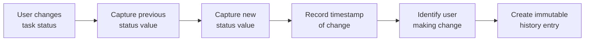

**erpHrm — What operations users can perform, use cases, business workflows**

What operations users can perform, use cases, business workflows

# Core Business Operations

What the system must do for each business concept.

## Organization Operations

The platform enables users to create organizations during the initial sign-up process, establishing a multi-tenant environment where each organization operates independently with its own data. Organization owners can configure essential settings including the organization name, description, logo, preferred currency, timezone, and fiscal start month. Users can view their organization's current settings at any time. Organization owners can update these settings as business needs change. Organizations can be deleted by their owners, but only when all pending timesheets have been resolved and no active employee contracts exist. When an organization is deleted, all associated employees, projects, tasks, timelogs, and timesheets are permanently removed while preserving the owner's user account.

### Organization Creation

Users can create an organization during the initial sign-up process.

The system SHALL require users to provide the organization name (required) and may optionally accept a description.

The organization creator automatically becomes the organization owner with full access to all organization features.

Each organization operates as an independent tenant with its own set of employees, projects, departments, roles, contracts, reports, and activity logs.

The system SHALL associate the creating user account with the new organization as the owner.

When the organization is created, the system SHALL initialize the organization with the three built-in roles: Owner, Manager, and Employee.

Users cannot create multiple organizations in a single sign-up process; each organization creation requires a separate sign-up or organization creation flow.

The organization name must be unique across the platform to prevent confusion when users belong to multiple organizations.

### Multi-Tenancy Setup

The platform supports multiple organizations operating simultaneously as independent tenants.

Each organization maintains strict isolation of all its data, including employees, projects, tasks, timelogs, timesheets, contracts, departments, roles, and activity logs.

Users can belong to one or more organizations and can work within any organization they have membership in.

When a user selects an organization to work in, all subsequent actions are scoped exclusively to that organization.

Users can switch between their organizations without logging out; the system SHALL present an organization selection interface upon login or when initiating a switch.

Data from one organization is never visible or accessible to users of another organization, even if they share the same user account.

API endpoints enforce organization context on every request to ensure data isolation is maintained at all times.

### Organization Settings Management

Organization owners can view and update their organization's settings at any time.

The system SHALL allow owners to modify the organization name and description.

Owners can update the currency setting to select the appropriate currency for the organization's financial operations (for example, USD, EUR, KRW).

The timezone setting controls how dates and times are displayed and interpreted within the organization.

The fiscal start month defines which month the organization's fiscal year begins, affecting financial and budget reporting.

All settings changes take effect immediately upon save.

Users with the organization manage permission can access the settings interface to view current configuration.

The organization settings page displays the current values for all configurable attributes including name, description, logo, currency, timezone, and fiscal start month.

### Currency Selection

Organization owners can select the currency for their organization from a predefined list of supported currencies.

The currency setting applies to all financial calculations and reports within the organization.

Currency options include commonly used currencies such as USD, EUR, KRW, and others as supported by the platform.

The currency can be changed at any time by organization owners; historical data retains the currency value that was active when transactions occurred.

Pay rates defined in employee contracts are denominated in the organization's selected currency.

Reports and summaries display monetary values using the organization's currency setting.

### Timezone Configuration

Organization owners can configure the timezone for their organization to match their business location.

The timezone setting affects how dates and times are displayed for all organization data including timelogs, timesheets, tasks, and reports.

Users within the organization see all timestamps and dates interpreted according to the organization's timezone.

The timezone can be changed by organization owners at any time without affecting historical data.

Time-based calculations such as timesheet week boundaries (Monday to Sunday) are determined using the organization's configured timezone.

The system SHALL accept standard timezone identifiers for configuration.

### Fiscal Year Settings

Organization owners can configure the fiscal start month for their organization.

The fiscal start month determines the beginning of the organization's fiscal year for financial and reporting purposes.

Budget reports and financial summaries reference the fiscal year based on this setting.

The fiscal start month can be any month of the year (January through December).

Changing the fiscal start month does not affect historical reports; reports continue to reference the fiscal year that was active when they were generated.

Project and budget reports use the fiscal year settings to calculate and display budget utilization across fiscal periods.

### Organization Deletion

Organization owners can delete their organization from the platform.

Before deletion can proceed, the system SHALL verify that all pending timesheets have been resolved (either approved or rejected).

The system SHALL verify that no active employee contracts exist before allowing deletion.

If pending timesheets exist, the deletion request is rejected with a message indicating that pending timesheets must be resolved first.

If active contracts exist, the deletion request is rejected with a message indicating that all contracts must be ended before deletion.

When an organization is deleted, the system SHALL permanently remove all employees, projects, tasks, timelogs, and timesheets associated with that organization.

Departments and roles specific to the deleted organization are also removed.

Activity logs and reports for the deleted organization are permanently removed.

The owner's user account remains intact and is preserved; the account is no longer associated with the deleted organization.

The owner can still access other organizations they belong to, if any.

Deletion is irreversible; there is no mechanism to recover deleted organization data.

### Data Isolation Between Organizations

The system SHALL enforce strict data isolation between organizations at all times.

Employees, projects, tasks, timelogs, timesheets, contracts, departments, roles, and all other data are scoped exclusively to their parent organization.

Users who belong to multiple organizations can only access data for their currently selected organization context.

When viewing lists or performing searches, results are filtered to include only data from the user's current organization.

Employees in one organization cannot view, modify, or access data from another organization.

Project memberships are limited to employees within the same organization.

Task assignments can only reference employees who belong to the same organization as the task's project.

Timesheet approval workflows are confined to employees within the same organization.

Reports are generated exclusively from data within the user's current organization context.

The activity log displays only actions performed within the current organization.

### Logo Customization

Organization owners can upload a logo image for their organization.

The logo appears in the organization header and throughout the platform interface when users are working within that organization.

The logo upload is optional; organizations can choose to use a default representation when no logo is uploaded.

Owners can replace the existing logo by uploading a new image.

Owners can remove the logo, reverting to the default representation.

The logo image supports common image formats as supported by the platform.

Logo images are associated with the organization and display consistently across all sessions and devices.

### Owner Account Preservation

When an organization is deleted, the owner's user account is preserved and remains active.

The owner's credentials (email and password) remain valid for logging into the platform.

The owner's global profile information (display name, avatar, phone number) is retained.

Membership records linking the owner to the deleted organization are removed.

The owner retains access to any other organizations they belong to.

The owner loses access to all data that was specific to the deleted organization.

If the owner had employee records in other organizations, those records remain intact and accessible.

The owner can create a new organization after deleting the previous one, which would establish a fresh tenant environment.

## User Operations

Users register for the platform by providing their email address and creating a password, which establishes their account. Existing users authenticate by entering their email and password to access the system. Authenticated users can change their password to maintain account security. Users who belong to multiple organizations must select which organization to work in upon login, and all subsequent actions are scoped to that organization context. Users can switch between their organizations without logging out and re-authenticating. Users can delete their own account, but if they are the sole owner of an organization, they must first transfer ownership or delete that organization. When a user account is deleted, the user's employee records in other organizations are marked as deactivated rather than permanently removed.

### User Registration

### Session Management

THE system SHALL maintain an authenticated session for users after successful login.

THE system SHALL associate the active session with the currently selected organization context.

WHEN a user's employee record is deactivated in an organization, THE system SHALL prevent that user from accessing that organization's data even if the session is still active.

WHEN a user switches organizations, THE system SHALL verify the user still has an active employee record in the newly selected organization.

THE system SHALL expire the session when the user explicitly logs out.

WHEN a session expires, THE system SHALL require the user to re-authenticate and select an organization before performing any operations.

## Employee Operations

Employees are records that link user accounts to a specific organization, each having a role within that organization. Users with the appropriate permission can invite new employees by providing their email address. If the invited email already has an associated user account, that user is immediately added to the organization as an employee. If the invited email has no existing account, a pending invitation is created and the user is automatically added when they subsequently sign up. Each employee record includes their department assignment, position or title, employment type such as full-time or contractor, and status. Users with management permission can edit employee details including department, position, and employment type. Employees can be deactivated, which prevents them from logging time or submitting timesheets while preserving their historical data. Deactivated employees can be reactivated to restore their access. The employee list can be viewed with filtering options for department, employment type, and status, and supports search by employee name.

### Employee Invitation

### Employee Invitation by Email

WHEN a user with `employee:manage` permission initiates an employee invitation,
THE system SHALL send an invitation to the specified email address.

WHEN the invited email address already has an existing user account,
THE system SHALL immediately create an employee record linking that user to the organization.

WHEN the invited email address has no existing user account,
THE system SHALL create a pending invitation record with status "pending".

### Pending Invitation Handling

WHEN a new user signs up with an email address that matches a pending invitation,
THE system SHALL automatically create an employee record linking that user to the organization.

THE system SHALL mark the pending invitation status as "accepted" upon successful employee creation.

### Invitation Constraints

THE system SHALL prevent duplicate invitations for the same email address in the same organization.

THE system SHALL reject invitations with improperly formatted email addresses.

### Role Assignment During Invitation

WHEN creating an employee record through invitation,
THE system SHALL assign the invited employee the default Employee role.

USERS with `employee:manage` permission MAY specify a different initial role during the invitation process.

### Employee Record Management

### Employee Record Creation

WHEN an employee record is created,
THE system SHALL link the record to an existing user account.

THE system SHALL associate the employee record with the current organization context.

THE employee record SHALL include: department assignment (optional), position or title (optional), and employment type classification.

### Employee Record Attributes

THE system SHALL record the department assigned to the employee.

THE system SHALL record the employee's position or title.

THE system SHALL record the employee's employment type, which MUST be one of: full-time, part-time, contractor, or intern.

### Department Assignment

USERS with `employee:manage` permission CAN assign an employee to a department.

USERS with `employee:manage` permission CAN change an employee's department assignment.

USERS with `employee:manage` permission CAN remove an employee's department assignment, setting it to null.

### Employment Type Classification

USERS with `employee:manage` permission CAN update an employee's employment type.

THE system SHALL validate that employment type is one of the allowed values.

### Position and Title Management

USERS with `employee:manage` permission CAN set the employee's position or title.

USERS with `employee:manage` permission CAN update the employee's position or title.

USERS with `employee:manage` permission CAN remove the employee's position or title, setting it to null.

### Employee Status Management

### Employee Deactivation

USERS with `employee:manage` permission CAN deactivate an active employee.

WHEN an employee is deactivated:
- THE system SHALL set the employee status to "deactivated"
- THE employee SHALL be prevented from creating new timelogs
- THE employee SHALL be prevented from submitting timesheets
- THE employee's existing timelogs SHALL be preserved
- THE employee's existing timesheets SHALL be preserved

### Employee Reactivation

USERS with `employee:manage` permission CAN reactivate a deactivated employee.

WHEN an employee is reactivated:
- THE system SHALL set the employee status to "active"
- THE employee SHALL regain the ability to create timelogs
- THE employee SHALL regain the ability to submit timesheets
- THE employee's historical data SHALL remain accessible

### Historical Data Preservation

THE system SHALL preserve all timelogs created by an employee regardless of their current status.

THE system SHALL preserve all timesheets created by an employee regardless of their current status.

THE system SHALL preserve all contracts associated with an employee regardless of their current status.

DEACTIVATED employees' historical timelogs, timesheets, and contracts SHALL remain viewable by users with appropriate permissions.

### Employee List and Search

### Employee List View

USERS with `employee:view` permission CAN view the employee list for the current organization.

THE system SHALL return employee records in a paginated format.

### Employee List Filtering

USERS viewing the employee list CAN filter by department.

USERS viewing the employee list CAN filter by employment type.

USERS viewing the employee list CAN filter by status (active, deactivated).

THE system SHALL apply multiple filters in combination when specified.

### Employee Search

USERS viewing the employee list CAN search for employees by name.

THE system SHALL match search queries against employee display names.

THE system SHALL return employees whose names contain the search query as a partial match.

### List Response

THE system SHALL return the following information for each employee in the list: display name, department, position, employment type, and status.

THE system SHALL support pagination controls including page number and page size selection.

### Role Assignment

### Role Assignment

USERS with `employee:manage` permission CAN assign a role to an employee.

THE system SHALL require that each employee in an organization has exactly one role assigned.

WHEN assigning a role:
- THE system SHALL validate that the selected role belongs to the current organization
- THE system SHALL immediately apply the new role to the employee

### Role Change

USERS with `employee:manage` permission CAN change an employee's assigned role.

WHEN an employee's role is changed:
- THE system SHALL revoke permissions associated with the previous role
- THE system SHALL grant permissions associated with the new role
- THE change SHALL take effect immediately

### Role Assignment Constraints

THE system SHALL prevent assignment of roles that belong to a different organization.

THE system SHALL require a valid, existing role when assigning to an employee.

THE system SHALL allow assignment of the Owner, Manager, or Employee built-in roles.

THE system SHALL allow assignment of custom roles created within the organization.

## Role Operations

Each organization has its own set of roles that define what actions employees can perform within that organization. Three built-in roles are provided by default and cannot be deleted: Owner with full access, Manager for employee and project oversight with approval capabilities, and Employee for basic time tracking. Organization owners can create custom roles with a chosen name and a defined set of permissions. Available permissions include organization management, employee management, employee viewing, project management, project viewing, time management across employees, timesheet approval, viewing all time records, and report access. Custom roles can be edited by organization owners to modify their name or associated permissions. Custom roles can only be deleted if no employees are currently assigned to them. Every employee must have exactly one role assigned, and users with management permission can change an employee's role assignment.

### Built-in Role Types

Each organization is provisioned with three built-in roles upon creation. These roles cannot be modified in their core structure or deleted from the organization.

The Owner role grants full access to all features and capabilities within the organization, including the ability to manage roles and membership, edit organization settings, and perform all administrative functions.

The Manager role enables employees to manage other employees and projects, approve timesheets submitted by team members, and view organizational reports. Managers cannot modify organization settings or manage roles and membership.

The Employee role provides basic access for time tracking activities, including creating and submitting timesheets, logging time entries, and viewing their own data. Employees cannot view other employees' data, approve timesheets, or access reports.

### Custom Role Creation

Organization owners can create custom roles to define specific access levels for their workforce. When creating a custom role, the owner must specify a name that identifies the role within the organization. The owner must also select at least one permission from the available set of organization permissions.

Custom roles are scoped to the organization in which they are created and cannot be shared across organizations. Each organization maintains its own independent set of custom roles.

Upon creation, the custom role is immediately available for assignment to employees within that organization.

### Permission Assignment to Roles

When creating or editing a custom role, the organization owner selects which permissions the role should possess. Available permissions include: organization management for editing organization settings, employee management for adding and editing employees, employee viewing for accessing employee information, project management for creating and modifying projects, project viewing for accessing project details, time management for editing or removing any employee's time records, time approval for approving or rejecting timesheets, viewing all time records across the organization, and report viewing for accessing organizational reports.

A custom role may contain any combination of these permissions. Permissions take effect immediately upon saving the role. Roles without any permissions can be created but will restrict the employee to no actions beyond basic profile access.

### Role Editing Capabilities

Organization owners can edit custom roles to modify their characteristics after creation. Editing a custom role allows the owner to change the role name and to add or remove permissions from the role's permission set.

Changes to a custom role take effect immediately for all employees currently assigned to that role. There is no grace period or staged rollout for permission changes.

Built-in roles cannot be edited in terms of their base permissions or role type. The names of built-in roles can be changed by organization owners to better reflect the organization's terminology, but their underlying permission sets remain fixed.

### Role Deletion Restrictions

Custom roles can be deleted by organization owners, subject to an important restriction. A custom role cannot be deleted if any employees are currently assigned to that role. The system prevents deletion to ensure employees always have a valid role assignment.

Before deleting a custom role, the organization owner must reassign all affected employees to a different role. Once no employees are assigned to the custom role, deletion is permitted.

Built-in roles cannot be deleted under any circumstances. This protection ensures the organization always maintains at least the three fundamental access levels required for operation.

### Employee Role Assignment

Every employee within an organization must have exactly one role assigned to them. When an employee joins the organization, they are assigned a role as part of the onboarding or invitation acceptance process.

Users with the employee management permission can change the role assigned to any employee. The role change takes effect immediately, updating the employee's access rights within the organization.

When an employee's role is changed, the system records this action in the activity log for audit purposes. The previous role assignment is not retained unless specifically needed for historical reporting.

### Role Hierarchy and Levels

The three built-in roles establish an implicit hierarchy of access levels. The Owner role sits at the highest level with unrestricted access to all features and settings. The Manager role occupies an intermediate level with oversight capabilities but limited administrative functions. The Employee role provides the most restricted access, limited to personal time tracking and submission activities.

Custom roles do not have an explicit hierarchy level. Their effective hierarchy is determined by the specific permissions assigned to them. A custom role with many permissions may have access similar to or exceeding a Manager, while a custom role with few permissions may be more restrictive than the standard Employee role.

Role hierarchy does not automatically grant permissions across levels. A Manager does not gain Owner permissions simply by hierarchy, nor does a custom role with project management permissions automatically gain time approval capabilities.

### Permission Scope Definition

Each permission defines a specific scope of action within the organization. The employee management permission scope covers viewing the employee list and details, inviting new employees, editing employee attributes such as department and position, and deactivating or reactivating employees.

The project management permission scope covers creating projects, editing project details, setting project status, archiving or completing projects, deleting projects that have no associated time records, and assigning or removing employees from projects.

The time management permission scope covers editing or deleting time records for any employee within the organization, regardless of who created them. This permission does not include the ability to approve timesheets, which requires the separate time approval permission.

### Organization-Specific Role Isolation

Roles belong to their parent organization and are isolated from other organizations. Each organization maintains its own complete set of roles, including the three built-in roles and any custom roles created within that organization.

When a user belongs to multiple organizations, their role in each organization is independent. A user may be an Owner in one organization while simultaneously being an Employee in another. Role assignments in one organization have no bearing on roles in other organizations.

This isolation ensures that organizational boundaries are respected, and users can only exercise permissions within the context of the organization they are currently working in.

### Role-Based Access Control Enforcement

The system enforces access control based on the user's assigned role within the current organization context. Before any action is performed, the system verifies that the user's role includes the required permission for that action.

When a user attempts an action without the required permission, the request is rejected. The user receives feedback indicating insufficient permissions for the requested operation.

Permission checks occur at the organization level, ensuring that a user's permissions are always evaluated within the context of their current organization selection. Users cannot perform actions in an organization where they have no role assignment.

## Department Operations

Organizations can create departments to organize their workforce, with each department having a name and optional description. Departments support one level of hierarchy through an optional parent department reference, allowing organizations to establish reporting structures. Users with organization management permission can create new departments. Users with organization management permission can edit department names, descriptions, and parent assignments. Users with organization management permission can delete departments, which sets affected employees' department reference to empty rather than removing the employees themselves. All employees within an organization can view the list of departments to understand the organizational structure.

### Department Creation

Users with organization management permission can create departments within their organization.

Creating a department requires providing a name (required) and may include a description (optional).

When a department is created, the system assigns it a unique identifier and associates it with the current organization.

The system prevents creation of departments with duplicate names within the same organization.

### Department Naming

Every department must have a name that is unique within its organization.

The department name is a required field when creating or editing a department.

The system validates that the name length falls within acceptable limits and rejects names that are too long or empty.

### Parent Department Assignment

When creating or editing a department, users can optionally assign a parent department to establish hierarchical relationships.

A department can have at most one parent department.

The parent department must belong to the same organization as the department being created or edited.

The system prevents circular references where a department is set as its own ancestor.

### Department Hierarchy

Departments support one level of hierarchy through parent department references.

This means a department may have a parent, and that parent may have its own parent, but the system enforces that hierarchy depth does not exceed one level of parent assignment.

The hierarchy enables organizations to establish clear reporting structures between departments.

### Department Editing

Users with organization management permission can edit existing departments.

Editable department attributes include the name, description, and parent department assignment.

Changes to department information take effect immediately upon saving.

Users without organization management permission are prevented from modifying department records.

### Department Deletion

Users with organization management permission can delete departments from their organization.

When a department is deleted, the system does not remove employee records.

Instead, the system sets the department reference of all employees assigned to that department to empty (null), effectively unassigning them from the deleted department.

The system preserves the historical existence of the department in activity logs and any other relevant records.

### Employee Department Reassignment

When a department is deleted, all employees previously assigned to that department lose their department assignment.

The system automatically clears the department field for affected employees without requiring manual intervention.

Employees retain their other attributes including role, employment type, and status.

Managers can subsequently reassign employees to other departments through employee record editing.

### Department List Viewing

All employees within an organization can view the complete list of departments.

The department list displays department names, descriptions, and parent department relationships.

The list helps employees understand the organizational structure and identify reporting relationships.

The department list is available to all organization members regardless of their role or permissions.

### Organizational Structure

Departments serve as the primary mechanism for organizing an organization's workforce.

Each employee can be assigned to exactly one department, enabling clear organizational groupings.

The departmental structure supports business units, teams, or functional areas within the organization.

Employees can identify their colleagues and managers based on departmental assignments.

### Reporting Line Management

The parent department relationship establishes reporting lines within the organization.

Departments with parent assignments indicate subordinate reporting relationships to superior departments.

This structure enables organizations to model hierarchical reporting such as divisions containing multiple teams.

The reporting line information is visible when viewing department details and the overall organizational structure.

## Contract Operations

Employee contracts establish the formal employment terms for each employee, with support for multiple contracts to maintain historical records. Each contract specifies a start date, optional end date for fixed-term arrangements, pay rate as a numeric value, pay period frequency such as hourly or monthly, and required weekly working hours. Users with employee management permission can create new contracts for any employee. When a new contract is created for an employee who has an existing active contract, the previous contract is automatically ended with its end date set to the day before the new contract begins. Users with management permission can edit only the currently active contract, while past contracts remain immutable historical records. Employees can view their own contract history, and users with employee viewing permission can view any employee's contracts.

### Contract Creation

Users with employee management permission can create contracts for employees in their organization.

When creating a contract, the following information must be provided:

- The employee for whom the contract is being created
- A start date (required)
- A pay rate as a numeric value (required)
- A pay period type (required)
- Working hours per week (required, representing the standard weekly commitment)

The following information may optionally be provided:

- An end date for fixed-term contracts; if not provided, the contract is considered ongoing
- Notes containing additional terms or special arrangements

Upon successful creation, the contract becomes either active (if no other active contract exists for that employee) or future-dated (if the start date is in the future relative to any existing active contract).

THE system SHALL reject any contract creation request that does not include the required fields.

THE system SHALL reject contract creation requests from users who do not have employee management permission.

### Contract Date Management

Each contract must have a valid start date specified at creation time. The start date defines when the employment terms begin taking effect.

An end date may be specified for fixed-term contracts. When no end date is provided, the contract is considered ongoing with no predetermined termination.

THE system SHALL ensure the end date of any contract is not earlier than the start date.

THE system SHALL allow the end date to be null, representing an ongoing contract with no fixed termination date.

### Pay Rate and Pay Period Specification

The pay rate is a required numeric value that specifies the compensation amount for the employee.

THE system SHALL store the pay rate as a precise numeric value without formatting assumptions.

THE system SHALL require a pay period type to be specified alongside the pay rate. The available pay period types are:

- Hourly: pay rate applies per hour worked
- Daily: pay rate applies per day
- Weekly: pay rate applies per week
- Monthly: pay rate applies per month

THE system SHALL reject any contract creation or editing request that does not include both a pay rate and a pay period type.

When displaying pay information, THE system SHALL present the pay rate in the context of the selected pay period.

### Working Hours Specification

Each contract must specify the required working hours per week as a numeric value. This represents the standard weekly commitment expected from the employee under this contract.

THE system SHALL require working hours per week to be provided when creating a contract.

THE system SHALL store working hours per week as a numeric value representing the weekly commitment.

THE system SHALL allow the working hours per week to be updated only for active contracts.

THE system SHALL reject any contract where working hours per week is zero or negative.

### Automatic Contract Termination

When a new contract is created for an employee who currently has an active contract, THE system SHALL automatically end the previous active contract.

THE system SHALL set the end date of the automatically terminated contract to the day immediately before the start date of the new contract.

This automatic termination ensures only one contract is active at any given time while preserving the complete employment history.

THE system SHALL NOT automatically terminate contracts when the new contract's start date matches or follows the end date of an already-terminated contract.

THE system SHALL record the automatic termination in the activity log with the action type indicating contract change.

### Active Contract Editing

Users with employee management permission can edit the currently active contract for any employee in their organization.

The following fields can be modified on an active contract:

- Pay rate (numeric value)
- Pay period type
- Working hours per week
- End date (can be set, cleared, or changed)
- Notes

THE system SHALL NOT allow modification of the start date on any contract.

THE system SHALL NOT allow editing of contracts that are not currently active.

THE system SHALL reject editing requests from users who do not have employee management permission.

Upon editing an active contract, THE system SHALL record the change in the activity log.

### Past Contract Immutability

Once a contract has ended (either by reaching its end date or through automatic termination when a new contract began), THE system SHALL treat that contract as an immutable historical record.

THE system SHALL reject any attempt to edit the following fields on a past contract:

- Pay rate
- Pay period type
- Working hours per week
- End date
- Notes

THE system SHALL reject any attempt to delete a past contract.

THE system SHALL preserve past contracts as-is, allowing them to be viewed but not modified.

This immutability ensures the integrity of employment history and compensation records.

### Contract History Viewing

Employees can view their own contract history, including all past and present contracts they hold.

Users with employee viewing permission can view the contract history of any employee in their organization.

THE system SHALL display contracts in reverse chronological order by start date, with the most recent contract appearing first.

Each contract in the history SHALL display:

- Start date and end date
- Pay rate and pay period
- Working hours per week
- Status indicating whether the contract is active, ended, or ongoing
- Notes if present

THE system SHALL reject requests to view contracts from users who do not have appropriate viewing permission.

THE system SHALL only display contracts belonging to the user's current organization context.

### Contract Notes

Notes are an optional field on contracts that allows recording additional terms, special arrangements, or supplementary information about the employment.

THE system SHALL allow notes to be specified when creating a new contract.

THE system SHALL allow notes to be edited only on active contracts.

THE system SHALL preserve notes on past contracts as part of the immutable historical record.

THE system SHALL allow notes to be left blank if no additional information needs to be recorded.

Notes are visible to users with contract viewing permission and to the employee themselves.

## Project Operations

Projects are created within an organization to organize work, requiring a name and color code for visual identification, with optional description and budget hours. Projects have a status of active, archived, or completed, and can optionally have start and end dates to define their timeline. Users with project management permission can create new projects with the required and optional attributes. Users with project management permission can edit project details while the project is active. Users with project management permission can archive or complete projects, after which no new timelogs can be recorded against them, though existing timelogs are preserved. Projects can only be deleted by users with management permission if they have no associated timelogs. Users with project viewing permission can access a paginated list of projects, filtered by status to show active, archived, or completed work.

### Project Creation

### Project Creation

Users with project management permission can create new projects within their organization.

When creating a project, the following information is required:

- The project must have a name that is between 1 and 200 characters
- The project must have a color code that will be used for visual identification in the user interface

When creating a project, the following information is optional:

- A description explaining the project's purpose or scope
- Budget hours indicating the total estimated hours for the project
- A start date to define when the project begins
- An end date to define when the project is expected to finish

The project is automatically assigned an active status upon creation.

The project is associated with the organization of the user who created it.

### Project Naming

The project name is a required field and must be unique within the organization.

Users cannot create two projects with the same name in the same organization.

The project name appears in lists, reports, and when employees select a project for time logging.

### Color Coding

Each project must have a color code specified during creation.

The color code is used to visually distinguish projects in the user interface, including in timelog entries, reports, and project lists.

The color code must be in a valid format that the system can render.

### Project Status Management

Projects can exist in one of three statuses: active, archived, or completed.

A newly created project has an active status by default.

Users with project management permission can change the status of a project.

When a project is active, employees can log time against it.

When a project is archived or completed, employees cannot record new timelogs against it.

Existing timelogs on archived or completed projects are preserved and remain accessible in reports.

### Project Archiving

Users with project management permission can archive active projects.

Archiving a project changes its status from active to archived.

When a project is archived, the system prevents any new timelogs from being recorded against that project.

Archived projects retain all their existing data including timelogs, tasks, and project members.

Archived projects can be viewed in reports and project lists when filtering by archived status.

### Project Completion

Users with project management permission can mark active projects as completed.

Completing a project changes its status from active to completed.

When a project is completed, the system prevents any new timelogs from being recorded against that project.

Completed projects retain all their existing data including timelogs, tasks, and project members.

Completed projects can be viewed in reports and project lists when filtering by completed status.

### Project Deletion Restrictions

Users with project management permission can delete projects.

A project cannot be deleted if it has any timelogs associated with it.

If a project has timelogs, users must archive or complete the project instead of deleting it.

Deleting a project removes the project and all its tasks from the system.

Deleting a project does not affect timelogs that have already been recorded and associated with other projects.

### Budget Hours Tracking

Projects can optionally have budget hours specified during creation or editing.

Budget hours represent the total estimated hours allocated for the project.

Budget hours can be set when creating a new project or when editing an existing active project.

Budget hours are displayed in project reports to show how much of the budget has been consumed.

Projects without budget hours specified are excluded from budget utilization calculations in reports.

### Project Timeline

Projects can optionally have a start date and an end date to define their expected timeline.

The start date indicates when the project is scheduled to begin.

The end date indicates when the project is expected to finish.

Both dates are optional and can be set during project creation or while editing an active project.

The start date and end date are informational and do not automatically affect project status or functionality.

### Project List Filtering

Users with project viewing permission can access a paginated list of all projects in their organization.

The project list can be filtered by status to show only active projects, only archived projects, or only completed projects.

By default, the project list shows active projects.

The project list supports pagination when the number of projects exceeds the page size.

Users can navigate between pages to view all projects matching their filter criteria.

## ProjectMember Operations

Project members are employees assigned to work on specific projects, with each membership specifying the employee, project, and their assigned role of either member or project-lead. Users with project management permission can assign employees to projects, allowing the same employee to be assigned to multiple projects simultaneously. Project leads are granted the ability to manage tasks within their assigned projects. Users with project management permission can remove employees from projects, ending their membership. Employees can view the list of projects they are assigned to, seeing their role on each project.

### Employee Project Assignment

Project membership links an employee to a project and defines their role within that project. Users with project management permission can assign employees to projects. An employee can be assigned to multiple projects simultaneously, allowing them to work across different initiatives. Each project membership specifies the employee, the project, and whether the employee serves as a regular member or a project lead on that project. Project assignments enable employees to log time against the project and, for leads, to manage project tasks.

### Project Membership Creation

Users with project management permission can assign an employee to a project by selecting the employee and the project. The system requires specification of the assigned role as either member or project-lead. The system shall prevent creating a duplicate membership where the same employee is already assigned to the same project. When an employee is assigned to a project, they gain the ability to create timelogs against that project and, if designated as project-lead, to manage tasks within that project.

### Project Role Types

Each project membership must have one of two assigned roles: member or project-lead. The member role provides basic project access for creating timelogs and viewing tasks. The project-lead role grants elevated permissions including the ability to create, edit, and manage tasks within the project. An employee can hold different roles across different projects; being a member on one project does not affect their role on another.

### Project-Lead Designation

When assigning an employee to a project with the project-lead role, the employee receives task management capabilities for that specific project. Project leads can create tasks within their assigned projects, edit existing tasks they created or that are assigned to them, and update task status. Project leads cannot assign new members to the project or remove members from the project; only users with project management permission can perform those operations. A project may have multiple project leads or none, depending on organizational needs.

### Multiple Project Assignment

An employee can be assigned to multiple projects at the same time. The system allows an employee to hold different roles on different projects. When an employee is assigned to multiple projects, they can create timelogs against any of those projects. The employee's workload is not automatically balanced or restricted; project managers determine appropriate assignments. Each assignment is independent and managed separately.

### Membership Role Changes

Users with project management permission can change an employee's role on a project. This includes changing from member to project-lead or from project-lead to member. Role changes take effect immediately upon saving. Changing an employee's role does not affect their existing timelogs or tasks. Users with project management permission can perform role changes at any time without restrictions.

### Project Member Removal

Users with project management permission can remove an employee from a project, ending their project membership. When a member is removed from a project, they can no longer create new timelogs against that project. Existing timelogs created by that employee on that project are preserved and remain accessible in reports. Removing a member does not delete the employee's overall employee record or affect their membership in other projects. The removed employee can be reassigned to the project later if needed.

### Project Assignment Viewing

Employees can view the list of projects they are assigned to. The view shows each project along with the employee's role on that project. Employees can see which projects they are a member of and which projects they lead. This view does not show other employees' project assignments or roles. Project membership information is scoped to the currently selected organization.

## Task Operations

Tasks represent work items within a project, each requiring a title and optionally including description, estimated hours, and a due date. Tasks have a status of open, in-progress, completed, or closed, and a priority level of low, medium, high, or urgent. Tasks can optionally be assigned to a specific employee who must be a member of the project, and can have one level of subtask nesting through an optional parent task. Project leads and users with project management permission can create tasks within their projects. Project leads can edit any task in their projects, while users with project management permission can edit any task across all projects. When task status changes occur, the system records a history entry capturing the timestamp, previous status, new status, and who made the change. Employees assigned to a project can view all tasks in that project. Tasks support filtering by status, priority, and assigned employee, and can be sorted by due date, priority, or creation date.

### Task Creation

Tasks can optionally have a due date indicating the expected completion deadline.

WHEN creating or editing a task, THE user MAY specify a due date.

The due date is informational and helps employees prioritize their work. Tasks without due dates have no deadline.

Due dates can be set, modified, or cleared while the task is open or in-progress.

Once a task is completed or closed, the due date cannot be modified.

The system does not automatically send notifications for approaching due dates unless the organization has configured such features separately.

## TaskHistory Operations

Task history tracks every status change made to a task, creating an immutable audit trail of work progress. Each history entry records the timestamp when the change occurred, the previous status value, the new status value, and the identity of the user who made the change. History entries are created automatically whenever a task's status field is modified. Users with appropriate permissions can view task history to understand how work has progressed over time. History records cannot be edited or deleted once created, preserving the integrity of the audit trail.

### Task Status Change Recording

THE system SHALL automatically create a task history entry whenever a task's status field is modified.

WHEN a user changes a task status, THE system SHALL record the timestamp of the change.

THE system SHALL capture the previous status value before the change was applied.

THE system SHALL capture the new status value that was set.

THE system SHALL identify the user who initiated the status change.

### Automatic History Creation Flow

Each status change generates exactly one history entry containing all four pieces of information.

### History Entry Components

EACH task history entry SHALL contain:

- A timestamp indicating when the status change occurred
- The previous status value before the change
- The new status value after the change
- The identity of the user who made the change

THE timestamp SHALL represent the exact moment the status change was applied.

THE user identity SHALL reference the person who performed the action, enabling full attribution of who changed what status and when.

### History Entry Structure

| Field | Purpose |
|-------|---------|
| Timestamp | When the change occurred |
| Previous Status | Status value before the change |
| New Status | Status value after the change |
| Changed By | User who initiated the change |

These components together form a complete audit trail for task progress tracking.

### Viewing Task History

USERS with permission to view tasks SHALL be able to view the complete status change history for each task.

THE system SHALL display task history entries in chronological order, from oldest to newest.

THE system SHALL show the full history chain from task creation through all status transitions to the current state.

USERS viewing task history SHALL see:
- The sequence of all status changes
- When each change occurred
- Who made each change
- What the status changed from and to

THE task history SHALL be accessible from the task detail view.

### History Immutability

TASK history entries SHALL be immutable once created.

THE system SHALL prevent any user from editing a task history entry.

THE system SHALL prevent any user from deleting a task history entry.

THE immutability of history records SHALL preserve the integrity of the audit trail, ensuring that all status change records remain accurate and tamper-proof.

This immutability applies regardless of the user's permissions, including organization owners and users with project management privileges.

### Task Deletion and History Preservation

WHEN a task is deleted, THE system SHALL preserve all associated task history entries.

THE preserved history entries SHALL remain accessible for organizational audit purposes even after the task itself is removed.

THE system SHALL link deleted task history entries to the original task through a reference, allowing users to identify which task the history belonged to.

Historical status change records SHALL persist independently of the task's active lifecycle, supporting long-term audit trail requirements.

## Timelog Operations

Employees can create timelog entries to record time spent on work, each requiring a date, duration measured in minutes, and an associated project where the employee must be a member. Timelogs can optionally reference a specific task that belongs to the selected project, include a description of work performed, and be marked as billable or non-billable with a default of billable. Employees can only create and edit timelogs for their own time records, and can only edit timelogs that are not part of an approved timesheet. Employees can only delete their own timelogs if they are not part of any submitted or approved timesheet. Users with time management permission can edit or delete any employee's timelogs regardless of timesheet status. Employees can view their own timelogs, and users with viewing-all permission can see all employees' timelogs. Timelogs support pagination and can be filtered by date range, project, task, and billable status.

### Timelog Creation

Employees can create timelog entries to record time spent on work.

WHEN an employee creates a timelog, THE system SHALL require the following information:
- Date of the work performed (required)
- Duration of the work measured in minutes (required)
- Project the work was performed on (required, must be a project the employee is assigned to as a member)

WHEN an employee creates a timelog, THE system SHALL accept the following optional information:
- Task the work was performed on (must belong to the selected project if provided)
- Description of what was accomplished (free text)
- Billable flag indicating whether the time is billable (defaults to true if not specified)

WHEN an employee submits a timelog without a required field, THE system SHALL reject the request.

WHEN an employee submits a timelog for a project they are not assigned to, THE system SHALL reject the request.

WHEN an employee submits a timelog with a task that does not belong to the selected project, THE system SHALL reject the request.

Timelogs are automatically associated with the employee who created them.

### Project and Task Linking

Every timelog must be linked to a project where the employee is a member.

WHEN creating a timelog, THE system SHALL require the employee to select from their assigned projects only.

WHEN an employee selects a project, THE system SHALL display tasks from that project as an optional selection.

WHEN a task is selected, THE system SHALL automatically associate it with the already selected project.

Tasks are optional and may be left unspecified. When unspecified, the timelog is linked only to the project.

### Billable Time Marking

Each timelog has a billable flag that indicates whether the recorded time is billable to a client.

WHEN a timelog is created, THE system SHALL set the billable flag to true by default.

WHEN an employee creates a timelog, THE system SHALL allow them to mark the time as non-billable by explicitly setting the billable flag to false.

The billable status can be changed when editing a timelog, subject to timesheet restrictions.

### Timelog Editing

Employees can edit their own timelogs to correct errors or update information.

WHEN an employee edits a timelog, THE system SHALL allow changes to: date, duration, project, task, description, and billable flag.

WHEN an employee attempts to edit a timelog that is part of an approved timesheet, THE system SHALL reject the request.

WHEN a user with time management permission edits any employee's timelog, THE system SHALL allow the edit regardless of timesheet status.

Editing a timelog does not affect its association with any draft or submitted timesheet.

### Timelog Deletion

Employees can delete their own timelogs to remove incorrect entries.

WHEN an employee attempts to delete a timelog that is part of a submitted timesheet, THE system SHALL reject the request.

WHEN an employee attempts to delete a timelog that is part of an approved timesheet, THE system SHALL reject the request.

WHEN a user with time management permission deletes any employee's timelog, THE system SHALL allow the deletion regardless of timesheet status.

WHEN a timelog is deleted, THE system SHALL remove it from any timesheet it was associated with.

### Approved Timesheet Locking

Timelogs that are part of an approved timesheet become locked and cannot be modified.

WHEN a timesheet is approved, THE system SHALL lock all timelogs included in that timesheet.

WHILE a timelog is locked, THE system SHALL prevent any edits to: date, duration, project, task, description, or billable flag.

WHILE a timelog is locked, THE system SHALL prevent deletion of the timelog.

Timelogs that are only in draft or rejected timesheets remain unlocked and editable.

### Timelog Viewing

Employees can view their own timelog history to track their recorded time.

WHEN an employee views timelogs, THE system SHALL display timelogs belonging only to that employee.

WHEN a user with viewing-all permission views timelogs, THE system SHALL display all timelogs across all employees in the organization.

The timelog display SHALL include: date, duration, project name, task title (if assigned), description, billable status, and the associated timesheet status (if any).

### Timelog Filtering and Pagination

Employees and authorized users can filter timelogs to find specific entries.

WHEN a user requests timelogs, THE system SHALL allow filtering by:
- Date range (specific start and end dates)
- Project (specific project or projects)
- Task (specific task or tasks)
- Billable status (billable only, non-billable only, or both)

WHEN a user requests a list of timelogs, THE system SHALL return paginated results.

Each page of results SHALL contain a consistent number of timelogs.

The paginated response SHALL include information about the total number of timelogs and the current page position.

Users can navigate between pages to access all timelogs matching their filter criteria.

## Timesheet Operations

Timesheets aggregate timelogs for a specific week running from Monday through Sunday for approval and reporting purposes. Employees can create a draft timesheet for any week, which automatically includes all their timelogs for that period. Employees can add or remove timelogs from their draft timesheet to finalize what will be submitted. Submitted timesheets cannot be empty and cannot be created if another timesheet for the same employee and week already exists with submitted or approved status. Employees submit draft timesheets for manager approval. Users with approval permission can view all submitted timesheets awaiting review. Approvers can approve submitted timesheets, which locks all included timelogs from further editing. Approvers can reject timesheets with a mandatory reason, returning the timesheet to draft status so the employee can make corrections and resubmit. Employees can view their own timesheets, which support pagination and filtering by status and date range.

### Weekly Timesheet Creation

### Weekly Timesheet Creation

Employees can create a draft timesheet for any specific week in the system.

WHEN an employee requests to create a timesheet, THE system SHALL create a draft timesheet with the specified week start date set to Monday and week end date set to Sunday of that same week.

WHEN a draft timesheet is created for a specific week, THE system SHALL automatically include all timelogs belonging to that employee that fall within the Monday through Sunday date range.

Each timesheet stores a reference to the owning employee, the week start date, the week end date, the current status, the total hours calculated from included timelogs, and timestamps for submission and review.

The week start date must always be a Monday and the week end date must always be the following Sunday.

### Draft Timesheet Management

Employees can manage their draft timesheets before submission.

WHEN an employee has a draft timesheet, THE system SHALL allow the employee to add timelogs to the timesheet from their available timelogs for that week.

WHEN an employee adds a timelog to a draft timesheet, THE system SHALL verify that the timelog belongs to the employee and falls within the timesheet week date range.

WHEN an employee requests to remove a timelog from a draft timesheet, THE system SHALL remove the association between the timelog and the timesheet.

WHEN a timelog is removed from a draft timesheet, THE system SHALL preserve the original timelog data in the system.

THE system SHALL calculate and display the total hours on a draft timesheet based on the currently included timelogs.

Employees can edit their draft timesheets at any time before submission.

### Timesheet Submission

Employees can submit their draft timesheets for manager approval.

WHEN an employee submits a draft timesheet, THE system SHALL validate that the timesheet contains at least one timelog.

IF the timesheet contains no timelogs, THE system SHALL reject the submission and inform the employee that timesheets cannot be submitted when empty.

WHEN an employee submits a draft timesheet, THE system SHALL verify that no other timesheet for the same employee and week already exists with submitted or approved status.

IF a timesheet for the same employee and week already exists with submitted or approved status, THE system SHALL reject the submission and inform the employee of the conflict.

WHEN a timesheet is successfully submitted, THE system SHALL update the timesheet status to submitted and record the submission timestamp.

THE system SHALL prevent any modifications to a submitted timesheet until it has been reviewed.

### Timesheet Approval Workflow

Users with time approval permission can review and act on submitted timesheets.

WHEN a user with time approval permission views submitted timesheets, THE system SHALL display all submitted timesheets awaiting review.

WHEN a user with time approval permission approves a submitted timesheet, THE system SHALL update the timesheet status to approved, record the review timestamp, and store a reference to the reviewing user.

WHEN a timesheet is approved, THE system SHALL lock all timelogs associated with the approved timesheet.

LOCKED timelogs cannot be edited or deleted by any user, including those with time manage permission.

WHEN a user with time approval permission views approved timesheets, THE system SHALL display the locked status of all included timelogs.

### Timesheet Rejection and Resubmission

Users with time approval permission can reject submitted timesheets that require changes.

WHEN a user with time approval permission rejects a submitted timesheet, THE system SHALL require a rejection reason to be provided.

IF no rejection reason is provided, THE system SHALL reject the rejection action and inform the reviewer that a reason is mandatory.

WHEN a timesheet is rejected, THE system SHALL update the timesheet status to rejected, record the review timestamp, store a reference to the reviewing user, and save the rejection reason.

WHEN a timesheet is rejected, THE system SHALL unlock all associated timelogs, allowing the employee to modify them.

WHEN a rejected timesheet exists, THE employee SHALL be able to modify the timesheet and resubmit it for approval.

WHEN an employee resubmits a rejected timesheet, THE system SHALL validate submission requirements as if it were a new submission.

### Timesheet Status Tracking and Viewing

The system tracks and displays the current state of each timesheet.

THE system SHALL support the following timesheet statuses: draft, submitted, approved, and rejected.

WHEN an employee views their own timesheets, THE system SHALL display all timesheets belonging to that employee.

Employees can view the current status, total hours, included timelogs, submission date, and review information for each of their timesheets.

WHEN a rejected timesheet is viewed by its owner, THE system SHALL display the rejection reason provided by the reviewer.

THE system SHALL support pagination for timesheet lists to handle large volumes of records.

WHEN filtering timesheets, THE system SHALL allow filtering by status and date range.

Users with time approval permission can view all employees' timesheets regardless of ownership.

## Timer Operations

Employees can start a real-time timer to track work as it happens, selecting a project and optionally a task before beginning. Each employee can have only one active timer at a time, preventing multiple simultaneous tracking sessions. When an employee stops their timer, the system automatically creates a timelog with the calculated duration rounded to the nearest minute, using the selected project and optional task. Employees can choose to discard their active timer without creating a timelog if the time should not be recorded. Employees can view their currently running timer to see elapsed time and project details. Employees can edit the description and project or task of an active timer while it is running. The system does not automatically stop timers, so running timers continue indefinitely if the employee forgets to stop them.

### Timer Start Action

### Timer Start Action

WHEN an employee requests to start a timer, THE system SHALL display a project selection interface and an optional task selection interface.

THE system SHALL require the employee to select a project before the timer can be started.

THE system SHALL record the start timestamp when the timer begins.

WHEN the timer starts successfully, THE system SHALL display the running timer with elapsed time updating in real-time.

WHEN an employee attempts to start a timer while another timer is already running, THE system SHALL reject the request and inform the employee that only one timer can be active at a time.

### Active Timer Limit

THE system SHALL allow each employee to have at most one active timer at any given time.

WHEN an employee has an active timer and attempts to start another, THE system SHALL prevent the new timer from starting.

WHEN an employee stops their active timer, THE system SHALL allow the employee to start a new timer immediately after.

### Timer Project Selection

WHEN an employee starts a timer, THE system SHALL present only the projects to which the employee is assigned as project members.

THE system SHALL require a project to be selected before the timer can be started.

THE selected project SHALL be stored with the timer and used when creating the resulting timelog.

### Timer Task Selection

WHEN an employee starts a timer, THE system SHALL present only the tasks belonging to the selected project that the employee can view.

THE task selection SHALL be optional and can be skipped.

IF a task is selected, THE system SHALL associate the task with the running timer and use it when creating the resulting timelog.

IF no task is selected, THE timer SHALL be associated only with the project.

### Timer Stop Action

WHEN an employee requests to stop their active timer, THE system SHALL calculate the duration between the start timestamp and the current time.

THE system SHALL prompt the employee to confirm whether they want to create a timelog or discard the timer.

WHEN the employee confirms timelog creation, THE system SHALL create a timelog entry containing the project, optional task, calculated duration, and the date derived from the start timestamp.

WHEN the timelog is created, THE system SHALL clear the active timer.

### Automatic Timelog Creation

WHEN a timer is stopped and the employee confirms timelog creation, THE system SHALL automatically create a timelog with the following information:

- The project that was selected when the timer started
- The task that was optionally selected when the timer started
- The description that was entered when the timer started or edited while running
- The calculated duration rounded to the nearest minute
- The date corresponding to when the timer started
- The billable flag set to true by default

THE system SHALL associate the new timelog with the employee who started the timer.

### Duration Rounding

THE system SHALL calculate duration by subtracting the start timestamp from the stop timestamp.

THE system SHALL round the calculated duration to the nearest whole minute.

IF the calculated duration is less than 30 seconds, THE duration SHALL be rounded down to zero minutes.

IF the calculated duration is 30 seconds or more, THE duration SHALL be rounded up to the next whole minute.

### Timer Discard Option

WHEN an employee chooses to discard their timer instead of creating a timelog, THE system SHALL not create any timelog entry.

THE system SHALL clear the active timer without preserving any record of the discarded time.

THE system SHALL display a confirmation message to the employee indicating the timer was discarded.

### Timer Elapsed Time Viewing

WHEN an employee has an active timer, THE system SHALL display the elapsed time updating in real-time.

THE system SHALL display the selected project and task with the running timer.

THE system SHALL display the description associated with the running timer if one was entered.

EMPLOYEES can view only their own active timer, not the timers of other employees.

### Running Timer Editing

WHEN an employee has an active timer, THE system SHALL allow the employee to edit the description.

WHEN an employee has an active timer, THE system SHALL allow the employee to change the selected project to another project they are assigned to.

WHEN an employee has an active timer with a task selected, THE system SHALL allow the employee to change the selected task to another task within the same project.

WHEN an employee changes the project, THE system SHALL clear any selected task that does not belong to the new project.

THE system SHALL not allow changes to the start timestamp while the timer is running.

### Indefinite Timer Behavior

THE system SHALL not automatically stop timers based on any time limit.

IF an employee forgets to stop their timer, THE system SHALL continue running the timer indefinitely until the employee manually stops or discards it.

THE system SHALL not send notifications or reminders about running timers.

WHEN the employee eventually stops an indefinite timer, THE system SHALL calculate the duration from the original start timestamp to the stop time.

## Report Operations

The platform provides reporting capabilities for users with appropriate permission to analyze time and project data. The time report shows total hours logged per employee for a selected date range, with options to group by employee, project, or task, and can be filtered by date range, employee, project, and billable status, displaying both total and billable versus non-billable breakdowns. The project budget report compares each project's estimated budget hours against actual hours logged, showing the percentage of budget consumed while excluding projects without budget hours set. The weekly summary report displays week-by-week data including total hours, number of timelogs, and count of employees who logged time, with optional filtering by project.

### Time Report Generation

### Time Report Overview

The time report provides users with permission to view organization reports a comprehensive view of time logged across the organization for a specified date range.

### Time Report Creation

WHEN a user with report:view permission requests a time report,
THE system SHALL generate a report showing total hours logged per employee for the selected date range.

WHEN generating the time report,
THE system SHALL include all timelogs where the log date falls within the specified date range.

### Hours Grouping Options

WHEN a user requests a time report,
THE system SHALL offer grouping options to organize the report data.

The user SHALL be able to group the time report by employee, project, or task.

WHEN grouping by employee is selected,
THE system SHALL display each employee as a separate row with their total hours.

WHEN grouping by project is selected,
THE system SHALL display each project as a separate row with the total hours logged to that project.

WHEN grouping by task is selected,
THE system SHALL display each task as a separate row with the total hours logged to that task.

### Billable Hours Breakdown

FOR each grouping in the time report,
THE system SHALL calculate and display the total hours.

FOR each grouping in the time report,
THE system SHALL calculate and display the billable hours subtotal.

FOR each grouping in the time report,
THE system SHALL calculate and display the non-billable hours subtotal.

THE system SHALL derive billable hours from timelogs where the billable flag is set to true.

THE system SHALL derive non-billable hours from timelogs where the billable flag is set to false.

### Employee Hours Analysis

FOR each employee included in the time report,
THE system SHALL display the employee's name and department.

WHEN grouping by employee,
THE system SHALL sort employees by total hours in descending order.

WHEN viewing employee details within the report,
THE system SHALL show the breakdown of hours by project for that employee.

### Project Budget Report

### Project Budget Report Overview

The project budget report compares estimated budget hours against actual hours logged for each project.

WHEN a user with report:view permission requests a project budget report,
THE system SHALL generate a report comparing budget hours to actual hours for all projects in the organization.

### Project Budget Comparison

FOR each project included in the report,
THE system SHALL display the project name and current status.

FOR each project with budget hours defined,
THE system SHALL display the budget hours value from the project record.

FOR each project with budget hours defined,
THE system SHALL calculate the total actual hours logged to that project.

THE system SHALL calculate actual hours by summing the duration of all timelogs associated with the project.

FOR each project with budget hours defined,
THE system SHALL display both the budget hours and the actual hours logged.

### Budget Utilization Percentage

FOR each project with budget hours defined,
THE system SHALL calculate the budget utilization percentage.

THE system SHALL calculate budget utilization as (actual hours divided by budget hours) multiplied by 100.

THE system SHALL round the budget utilization percentage to one decimal place.

FOR each project,
THE system SHALL display the calculated budget utilization percentage.

### Projects Without Budget Exclusion

WHEN generating the project budget report,
THE system SHALL exclude projects where budget hours have not been set.

Projects with null or zero budget hours SHALL NOT appear in the project budget report.

### Budget Status Indication

FOR each project in the report,
THE system SHALL indicate whether the project is within budget, approaching budget, or over budget.

THE system SHALL mark a project as over budget when actual hours exceed budget hours.

THE system SHALL mark a project as approaching budget when utilization is between 80% and 100%.

### Weekly Summary Report

### Weekly Summary Report Overview

The weekly summary report provides a week-by-week overview of time tracking activity across the organization.

WHEN a user with report:view permission requests a weekly summary report,
THE system SHALL generate a report showing aggregated data for each week within the specified date range.

### Week-by-Week Aggregation

FOR each week within the specified date range,
THE system SHALL calculate the total hours logged by all employees.

FOR each week within the specified date range,
THE system SHALL count the total number of timelogs submitted.

FOR each week within the specified date range,
THE system SHALL count the number of distinct employees who logged time.

THE system SHALL define a week as Monday through Sunday.

### Timelog Counting

FOR each week in the report,
THE system SHALL display the timelog count as the total number of individual time entries.

### Report Filtering by Project

WHEN a user specifies a project filter for the weekly summary report,
THE system SHALL only include timelogs associated with the selected project.

WHEN no project filter is applied,
THE system SHALL include timelogs from all projects in the organization.

### Weekly Report Output

FOR each week displayed in the report,
THE system SHALL show the week start date and end date.

FOR each week displayed in the report,
THE system SHALL display the total hours, timelog count, and employee count in a single row.

### Report Access and Filtering

### Report Permission Requirements

ONLY users with report:view permission SHALL be able to access organization reports.

USERS without report:view permission SHALL receive an access denied response when attempting to view reports.

### Date Range Filtering

WHEN requesting any report,
THE user SHALL specify a start date and end date for the report period.

THE system SHALL only include data where the relevant date falls within the specified range.

FOR time reports, the relevant date is the timelog date.

FOR weekly summary reports, the relevant date determines which week the timelog belongs to.

### Additional Report Filters

WHEN generating a time report,
THE system SHALL allow filtering by specific employees.

WHEN generating a time report,
THE system SHALL allow filtering by specific projects.

WHEN generating a time report,
THE system SHALL allow filtering by billable status (billable only, non-billable only, or all).

### Report Data Grouping

THE user SHALL be able to select how the time report data is grouped.

AVAILABLE grouping options for time reports include: by employee, by project, by task.

WHEN a grouping option is selected,
THE system SHALL organize all timelog data according to the selected grouping.

### Empty Report Handling

WHEN the specified date range contains no relevant data,
THE system SHALL generate an empty report with appropriate column headers.

THE system SHALL display a message indicating no data was found for the selected criteria.

## ActivityLog Operations

The system maintains an activity log that records significant actions performed within an organization, creating an audit trail for compliance and review. Each activity log entry captures the timestamp of the action, the user who performed it, the type of action that occurred, the target entity affected, and additional details describing what happened. Tracked actions include employee invitations, deactivations and reactivations, contract creation and edits, project creation, archiving, completion and deletion, task status changes, timesheet submissions, approvals, and rejections, as well as role assignments and changes. Users with organization management permission can access the complete activity log for their organization. The activity log supports pagination for large volumes of entries and can be filtered by action type, specific user, and date range to find relevant records.

### Activity Log Recording

THE system SHALL automatically create an activity log entry whenever a significant action occurs within an organization.

Each activity log entry SHALL contain the following information:
- Timestamp indicating when the action occurred
- Reference to the user who performed the action
- Type of action that was performed
- Target entity that was affected by the action
- Additional details describing the action performed

THE system SHALL record activity log entries for all significant business actions and SHALL NOT require manual initiation by users.

### Action Timestamp Capture

WHEN a significant action occurs, THE system SHALL automatically capture the exact timestamp of that action.

THE timestamp SHALL represent the precise moment when the action was completed in the system.

THE system SHALL include the captured timestamp in the corresponding activity log entry.

TIMESTAMPS SHALL be stored in a format that preserves the chronological ordering of all actions.

### User Action Attribution

WHEN an activity log entry is created, THE system SHALL record the identity of the user who performed the action.

THE system SHALL link the activity log entry to the user record to enable review of who performed specific actions.

WHEN a user performs an action that affects another entity, THE system SHALL attribute that action to the performing user in the activity log.

Actions performed by system processes SHALL be attributed to the system or designated system user.

### Action Type Categorization

THE system SHALL categorize all recorded actions into specific action types for filtering and reporting purposes.

AVAILABLE action types SHALL include:
- Employee invited
- Employee deactivated
- Employee reactivated
- Contract created
- Contract edited
- Project created
- Project archived
- Project completed
- Project deleted
- Task status changed
- Timesheet submitted
- Timesheet approved
- Timesheet rejected
- Role assigned
- Role changed

THE system SHALL assign exactly one action type to each activity log entry.

### Target Entity Tracking

WHEN an activity log entry is created, THE system SHALL record the specific entity that was affected by the action.

THE system SHALL identify the target entity using its type and unique identifier.

TARGET entities that SHALL be tracked include:
- Employees affected by invitation, deactivation, or reactivation
- Contracts affected by creation or editing
- Projects affected by creation, archiving, completion, or deletion
- Tasks affected by status changes
- Timesheets affected by submission, approval, or rejection
- Employees affected by role assignment or change

THE activity log entry SHALL contain sufficient information to identify the target entity unambiguously.

### Activity Log Filtering

USERS with organization management permission SHALL be able to filter the activity log by action type.

USERS with organization management permission SHALL be able to filter the activity log by specific user who performed the action.

USERS with organization management permission SHALL be able to filter the activity log by date range to view actions within a specific time period.

WHEN multiple filters are applied, THE system SHALL return entries that match ALL selected filter criteria.

Filtering options SHALL be available in combination to narrow down results to specific actions of interest.

### Activity Log Pagination

WHEN the activity log contains more entries than can be displayed on a single page, THE system SHALL present the results in multiple pages.

USERS viewing the activity log SHALL be able to navigate between pages to access older entries.

THE system SHALL provide page navigation controls including next page, previous page, and direct page selection.

EACH page of the activity log SHALL display a consistent number of entries for predictable browsing behavior.

### Employee Action Events

WHEN an employee is invited to join the organization, THE system SHALL create an activity log entry with action type "Employee invited" and the invited employee as the target entity.

WHEN an employee is deactivated, THE system SHALL create an activity log entry with action type "Employee deactivated" and the deactivated employee as the target entity.

WHEN a deactivated employee is reactivated, THE system SHALL create an activity log entry with action type "Employee reactivated" and the reactivated employee as the target entity.

THESE employee action events SHALL be recorded automatically upon the occurrence of each respective action.

### Project Action Events

WHEN a new project is created, THE system SHALL create an activity log entry with action type "Project created" and the newly created project as the target entity.

WHEN a project is archived, THE system SHALL create an activity log entry with action type "Project archived" and the archived project as the target entity.

WHEN a project is marked as completed, THE system SHALL create an activity log entry with action type "Project completed" and the completed project as the target entity.

WHEN a project is deleted, THE system SHALL create an activity log entry with action type "Project deleted" and the deleted project as the target entity.

THESE project action events SHALL be recorded automatically upon the occurrence of each respective action.

### Timesheet Action Events

WHEN an employee submits a timesheet for approval, THE system SHALL create an activity log entry with action type "Timesheet submitted" and the submitted timesheet as the target entity.

WHEN a user with approval permission approves a submitted timesheet, THE system SHALL create an activity log entry with action type "Timesheet approved" and the approved timesheet as the target entity.

WHEN a user with approval permission rejects a submitted timesheet, THE system SHALL create an activity log entry with action type "Timesheet rejected" and the rejected timesheet as the target entity.

THESE timesheet action events SHALL capture the review outcome and SHALL be recorded at the moment of each respective action.

### Role Change Events

WHEN an employee is assigned to a role within the organization, THE system SHALL create an activity log entry with action type "Role assigned" and the affected employee as the target entity.

WHEN an employee's role is changed to a different role, THE system SHALL create an activity log entry with action type "Role changed" and the affected employee as the target entity.

THESE role change events SHALL be recorded automatically whenever a role assignment or role change occurs.

Role change events SHALL capture both the previous role and the new role in the additional details field of the activity log entry.

### Contract Action Events

WHEN a new contract is created for an employee, THE system SHALL create an activity log entry with action type "Contract created" and the newly created contract as the target entity.

WHEN an active contract is edited, THE system SHALL create an activity log entry with action type "Contract edited" and the edited contract as the target entity.

THESE contract action events SHALL be recorded automatically upon contract creation or modification.

Contract action events SHALL include relevant contract details such as pay rate and employment type in the additional details field of the activity log entry.

Past contracts that cannot be edited SHALL NOT trigger contract edit events since no editing is permitted.

## Invitation Operations

The invitation system enables organizations to add employees by inviting them via email address. When an invitation is sent to an email address that already has an associated user account, that user is immediately added to the organization as an active employee with their assigned role. When an invitation is sent to an email address without an existing account, a pending invitation is created and stored until the user signs up with that email, at which point they are automatically added to the organization. Pending invitations can be tracked to see which invited users have not yet completed registration. Invitations may be cancelled or resent if needed before the user completes signup. The invitation system ensures smooth onboarding for both existing platform users and new registrations.

### Invitation Sending

### Invitation Sending

Users with `employee:manage` permission can send invitations to prospective employees by providing an email address. The system validates that the email address format is valid before creating or processing the invitation. Invitations are scoped to the currently selected organization.

When an invitation is sent, the system records the invited email address, the organization it was sent from, the timestamp of invitation, and the user who initiated the invitation. A unique invitation identifier is generated for tracking purposes.

### Existing User Invitation

When an invitation is sent to an email address that already has an associated user account in the system, the system immediately adds that user to the organization as an active employee. The newly added employee receives the default role assigned during invitation or the role specified by the inviter. The employee record is created automatically without requiring the existing user to take any additional action. The invitation status is marked as accepted in this scenario.

### Pending Invitation Creation

When an invitation is sent to an email address that does not have an existing user account, the system creates a pending invitation record. The pending invitation stores the email address, organization identifier, invitation timestamp, and inviter information. Pending invitations remain in the system until the invited user completes registration with that email address or the invitation is cancelled or expired.

The system prevents duplicate pending invitations for the same email address and organization combination. If a pending invitation already exists for the email and organization, the system rejects the new invitation request.

### Automatic Employee Addition on Registration

When a new user registers with an email address that matches a pending invitation, the system automatically adds the user to the corresponding organization as an active employee. The role assigned during invitation is applied to the newly created employee record. The pending invitation status is updated to accepted. The user gains immediate access to the organization upon completing registration.

If multiple pending invitations exist for the same email address across different organizations, the user is added to all organizations associated with those invitations upon registering.

### Invitation Tracking

Users with `employee:manage` permission can view a list of all invitations sent from their organization. The invitation list displays the invited email address, invitation status (pending, accepted, expired), invitation date, and the inviter name. The list is paginated for organizations with many invitations.

Users can filter the invitation list by status to view only pending, accepted, or expired invitations. Users can also search invitations by email address.

### Invitation Cancellation

Users with `employee:manage` permission can cancel a pending invitation. Cancelling a pending invitation removes it from the system and prevents the invited user from being automatically added to the organization upon registration. Cancelled invitations cannot be reinstated. Accepted invitations cannot be cancelled through this operation; instead, the employee must be deactivated.

### Invitation Resend

Users with `employee:manage` permission can resend a pending invitation. Resending updates the invitation timestamp and generates a new invitation notification to the invited email address. The original invitation record is updated rather than creating a duplicate entry. Resending is only available for pending invitations; accepted or expired invitations cannot be resent.

### Email-Based Onboarding Workflow

The invitation system supports a complete email-based onboarding workflow. Organization managers invite prospective employees by email, and the system handles both existing account holders and new users seamlessly. Existing users gain immediate access to the organization upon invitation acceptance. New users are guided through registration and automatically joined to the organization upon completing their account setup.

### New User Registration Integration

The new user registration flow checks for pending invitations associated with the provided email address. If pending invitations are found, the registration process includes a notification informing the user about the organizations they will be joining. Upon successful registration, the user is automatically associated with all organizations tied to their pending invitations.

### Organization Membership Activation

The transition from pending invitation to active organization membership is automatic upon user registration. The employee record is created with active status, allowing the user to immediately begin using organization features such as project access and time tracking. The membership activation is logged in the activity log for audit purposes.

# Error Scenarios and Edge Cases

Business-level error scenarios, edge case coverage, and expected system behaviors for exceptional conditions.

## Organization Error Scenarios

Organization owners cannot delete their organization if any pending timesheets exist that have not been approved or rejected. The system must prevent deletion and prompt the user to resolve all pending timesheets first. Organizations with active employee contracts cannot be deleted until those contracts are ended or the employees are deactivated. Attempting to delete an organization without resolving these conditions returns a business rule violation error. When editing organization settings, the system validates that required fields like name and currency are provided. If required fields are missing, the system displays a validation error message. Organization timezone and fiscal start month changes are accepted but may affect how reports calculate periods for existing data. The system does not allow duplicate organization names within the same tenant context.

### Organization Deletion Prerequisites

### Organization Deletion Prerequisites

THE system SHALL prevent organization owners from deleting their organization when pending timesheets exist.

WHEN an organization owner attempts to delete an organization that has timesheets with a status of "submitted", THEN the system SHALL reject the deletion request and return an error message indicating that pending timesheets must be resolved.

WHEN an organization owner attempts to delete an organization that has timesheets with a status of "draft", THEN the system SHALL allow deletion only if the owner first resolves or removes the draft timesheets.

### Active Contract Blocking

THE system SHALL prevent organization owners from deleting their organization when any employee has an active contract.

WHEN an organization owner attempts to delete an organization that has employees with contracts where the end date is null or the end date is in the future, THEN the system SHALL reject the deletion request and return an error message indicating that active employee contracts must be ended first.

An employee contract is considered active when the end date field is not set or the end date is after the current date.

### Resolution Requirements

Before an organization can be deleted, ALL of the following conditions MUST be met:
- All pending timesheets MUST be in a status of "approved" or "rejected"
- All employee contracts MUST have an end date that is in the past

THE system SHALL require users to resolve these conditions before deletion proceeds.

### Organization Settings Validation

### Required Field Validation

THE system SHALL validate that required organization fields are provided when creating or editing an organization.

WHEN a user attempts to create an organization without a name, THEN the system SHALL reject the request and display a validation error indicating that the organization name is required.

WHEN a user attempts to create an organization without a currency selection, THEN the system SHALL reject the request and display a validation error indicating that the currency is required.

WHEN a user attempts to edit organization settings and removes the required name or currency, THEN the system SHALL reject the update and display appropriate validation errors.

### Organization Name Uniqueness

THE system SHALL prevent duplicate organization names within the same tenant context.

WHEN a user attempts to create an organization with a name that already exists, THEN the system SHALL reject the request and display an error indicating that an organization with this name already exists.

THE system SHALL enforce this uniqueness constraint across all organizations in the system.

### Timezone and Fiscal Configuration

### Timezone Configuration Changes

WHEN an organization owner changes the organization timezone, THEN the system SHALL accept the change and update the organization's timezone setting.

THE system SHALL warn users that changing the timezone may affect how reports calculate periods for existing data.

Time-based reports generated after a timezone change SHALL use the new timezone for all calculations.

Historical reports MAY display inconsistent period boundaries if the timezone change affects previously calculated date ranges.

### Fiscal Year Start Month

THE system SHALL allow organizations to select a fiscal year start month from the available options.

WHEN an organization owner selects a fiscal year start month, THEN the system SHALL store this configuration and use it for fiscal period calculations in reports.

The fiscal year start month selection SHALL be one of the twelve months of the year.

### Date Range Report Implications

THE system SHALL apply the organization's configured timezone and fiscal start month when generating reports that involve date range calculations.

Reports that span timezone changes SHALL calculate hours and totals based on the organization's configured timezone boundaries.

### Organization Context Enforcement

### Context Isolation

THE system SHALL enforce strict data isolation between organizations.

WHEN a user who belongs to multiple organizations performs any action, THEN the system SHALL require an active organization context to be selected.

Actions performed without a selected organization context SHALL be rejected.

### Organization Selection Requirement

USERS with membership in multiple organizations MUST select which organization to work in before performing any organization-scoped operation.

WHEN a user switches organizations, THEN all subsequent actions SHALL be scoped to the newly selected organization.

The user's currently selected organization context SHALL be maintained throughout their session until explicitly changed.

### Data Access Boundaries

THE system SHALL ensure that users in one organization cannot view, modify, or delete data belonging to another organization.

WHEN a user attempts to access resources from an organization they do not belong to, THEN the system SHALL deny the request and return an access denied error.

All queries and operations SHALL be implicitly filtered by the user's currently selected organization context.

## User Error Scenarios

Users cannot log in with an email that is not registered in the system, receiving an authentication failure message. Password changes require the user to provide their current password correctly before setting a new one. Users who attempt to delete their account while being the sole owner of an organization must transfer ownership or delete the organization first, otherwise the system blocks the deletion. If a user is deactivated within an organization they own, they cannot access that organization's data until reactivation. Users selecting an organization context must have an active employee record in that organization to proceed. When a user belongs to multiple organizations, switching contexts may result in different permissions and visible data based on their role in each organization. Duplicate email registrations are rejected during sign-up.

### Authentication Failures

### Invalid Login Credentials

WHEN a user attempts to log in with an email address that is not registered in the system, THE system SHALL reject the login attempt and display a generic authentication failure message without revealing whether the email exists.

WHEN a user attempts to log in with an incorrect password, THE system SHALL reject the login attempt and display an authentication failure message.

WHEN a user exceeds five consecutive failed login attempts within a fifteen-minute window, THE system SHALL temporarily lock the account for thirty minutes and prompt the user to wait or reset their password.

### Duplicate Email Registration Rejection

WHEN a user attempts to register a new account using an email address that already exists in the system, THE system SHALL reject the registration and inform the user that an account with that email already exists.

WHEN a user attempts to change their email to one that is already in use by another account, THE system SHALL reject the request and notify the user of the conflict.

### Password Change Validation

WHEN a user requests to change their password, THE system SHALL require the user to provide their current password correctly before accepting the new password.

WHEN the user provides an incorrect current password during a password change request, THE system SHALL reject the request and display a message indicating that the current password is incorrect.

WHEN the user provides an incorrect current password three consecutive times, THE system SHALL require the user to wait fifteen minutes before attempting another password change.

### Organization Context Validation

WHEN a user selects an organization to work in, THE system SHALL verify that the user has an active employee record in that organization.

WHEN a user attempts to access data or perform actions in an organization where they do not have an employee record, THE system SHALL deny access and prompt the user to select a valid organization.

WHEN a user attempts to switch to an organization where their employee record has been deactivated, THE system SHALL prevent the switch and display a message indicating that their access to that organization has been deactivated.

### Deactivated Employee Access Denial

WHEN an employee record has been deactivated within an organization, THE system SHALL prevent that user from logging time or submitting timesheets in that organization.

WHEN a user who is deactivated in an organization attempts to access that organization's data, THE system SHALL deny access and require the user to select a different organization context.

WHEN a user who is the owner of an organization is deactivated as an employee within that organization, THE user SHALL retain owner-level access to organization settings but SHALL be blocked from employee-level operations such as time tracking until reactivated.

### Multi-Organization Permission Differences

WHEN a user belongs to multiple organizations, THE system SHALL apply the permissions associated with the user's role in the currently selected organization to all operations.

WHEN a user switches from one organization to another, THE system SHALL refresh the user's permission set to reflect their role in the newly selected organization.

WHEN a user performs an action that requires specific permissions, THE system SHALL evaluate those permissions based on the user's role in the active organization context only.

WHEN a user with different roles in different organizations attempts to perform an action, THE system SHALL deny the action if the user's role in the current organization lacks the required permission, even if the user has that permission in another organization.

### Sole Ownership Blocking Account Deletion

WHEN a user attempts to delete their account and the user is the sole owner of an organization, THE system SHALL block the deletion and inform the user that they must either transfer organization ownership to another member or delete the organization before proceeding.

WHEN a user attempts to delete their organization and there are pending timesheets that have not been approved or rejected, THE system SHALL block the deletion and inform the owner that all pending timesheets must be resolved first.

WHEN a user attempts to delete their organization and there are employees with active contracts, THE system SHALL block the deletion and inform the owner that all active contracts must be ended before proceeding.

WHEN a user transfers organization ownership to another member, THE system SHALL revoke the original owner's owner-level permissions and assign them the permissions of their employee role in that organization.

### Account Deletion with Multiple Organization Memberships

WHEN a user who belongs to multiple organizations deletes their account, THE system SHALL remove the user's employee records from all organizations and mark them as deactivated rather than permanently deleting them, preserving historical data.

WHEN a user who belongs to multiple organizations deletes their account, THE system SHALL permanently delete the user's global profile and authentication credentials.

WHEN a user who is the sole owner of an organization in their membership list attempts to delete their account, THE system SHALL require the user to transfer ownership or delete the organization as a prerequisite step.

## Employee Error Scenarios

Employee deactivation is blocked if the employee has submitted or approved timesheets that are still being processed, though historical data is preserved after deactivation. Users without employee manage permission cannot invite, edit, or deactivate employees, receiving an access denied response. Deactivated employees cannot log time entries or submit timesheets, and the system prevents such actions with an appropriate message. Reactivation of a deactivated employee restores their ability to log time and submit timesheets. Employees can be filtered by department, employment type, or status, but providing invalid filter values returns an empty result set rather than an error. Search by name returns partial matches but searches with special characters or empty strings may return validation errors. Pagination of the employee list ensures large organizations can navigate through results efficiently.

### Deactivated Employee Time Logging Prevention

When an employee has been deactivated, the system SHALL prevent the employee from creating new timelog entries. If a deactivated employee attempts to log time, the system SHALL return an access denied response indicating the employee account is inactive.

When a deactivated employee attempts to submit a timesheet, the system SHALL reject the submission and inform the user that their account is deactivated.

Deactivated employees who attempt to start a timer SHALL receive an error message stating that active employees may only track time.

All deactivated employee timelog attempts during the deactivation period SHALL be recorded as failed attempts in the activity log for security audit purposes.

### Insufficient Permissions for Employee Operations

Users without the employee manage permission SHALL be denied the ability to invite new employees to the organization. The system SHALL return an access denied response when such users attempt to send invitations.

Users without the employee manage permission SHALL be denied the ability to edit employee records including department, position, employment type, or role assignments. The system SHALL reject these requests with an appropriate permission error.

Users without the employee manage permission SHALL be denied the ability to deactivate or reactivate employees. Attempting these operations SHALL result in an access denied response.

Users without the employee view permission SHALL be denied the ability to view the employee list or individual employee details. The system SHALL return an access denied response for all employee visibility attempts.

### Employee List Filtering with Invalid Values

When filtering the employee list by department and the specified department does not exist, the system SHALL return an empty result set rather than an error.

When filtering by employment type with an invalid type value, the system SHALL return an empty result set.

When filtering by status (active, deactivated) with an invalid status value, the system SHALL return an empty result set.

Combining multiple invalid filters SHALL result in an empty result set. The response SHALL indicate successful query execution with zero results, not a validation error.

The system SHALL accept valid filter combinations and return only employees matching all specified criteria.

### Employee Name Search Behavior

When searching employees by name, the system SHALL match partial name strings, including names that start with, contain, or end with the search term.

Name searches SHALL be case-insensitive, matching regardless of uppercase or lowercase input.

When a search term contains special characters (such as quotes, brackets, or SQL-like patterns), the system SHALL treat them as literal characters and perform a standard text search.

Empty or blank search strings SHALL be handled according to validation rules. If blank searches are not permitted, the system SHALL return a validation error explaining that a search term is required.

Search results SHALL be limited to employees within the current organization context only.

### Employee List Pagination

The employee list SHALL support pagination to handle organizations with large numbers of employees. The system SHALL return results in manageable page sizes.

When requesting a page number beyond available results, the system SHALL return an empty result set for that page rather than an error.

The pagination response SHALL include information about total available pages and current page position to enable proper navigation.

Page size SHALL be consistent across all requests unless explicitly requested otherwise. Default page size SHALL apply when no size is specified.

Sorting and filtering options SHALL be preserved when navigating between pages of results.

### Employee Reactivation Restores Access

When an administrator reactivates a previously deactivated employee, the system SHALL immediately restore the employee's ability to log time entries.

Upon reactivation, the employee SHALL be able to start new timers and create timelog entries without restriction.

Reactivated employees SHALL be able to submit timesheets for current and future periods.

The reactivation action SHALL be recorded in the activity log with the administrator who performed it.

Historical data (timelogs, timesheets, contracts) from before deactivation SHALL remain associated with the employee record upon reactivation.

### Historical Data Preservation on Deactivation

When an employee is deactivated, all existing timelog entries belonging to that employee SHALL be preserved and remain accessible for historical reporting.

When an employee is deactivated, all timesheets associated with the employee SHALL be preserved and remain viewable in the system.

Contract records for a deactivated employee SHALL be preserved as immutable historical records and remain accessible for auditing purposes.

Employee assignments to projects SHALL be preserved when deactivated, maintaining the historical record of project participation.

Deactivated employees SHALL appear in historical reports and timesheet records with their complete data intact.

The employee's profile information SHALL be preserved and associated with all historical records even after deactivation.

### Empty Search Result Handling

When an employee search returns no matching results, the system SHALL return an empty result set with a successful response status, not an error.

Empty search results SHALL be communicated to the user with a message indicating no employees match the search criteria.

Empty search results SHALL still include pagination metadata if applicable, indicating zero total results and appropriate page information.

The system SHALL continue to function normally after returning empty search results, allowing users to modify search criteria and retry.

## Role Error Scenarios

Organization owners cannot delete the three built-in roles (Owner, Manager, Employee), as these are system-defined and immutable. Custom roles cannot be deleted if any employees are currently assigned to them, and the system returns a conflict error listing the affected employees. Attempting to assign permissions that do not exist in the available permission set is rejected with a validation error. Role assignments can only be changed by users with employee manage permission, and unauthorized attempts are denied. Changing an employee's role takes effect immediately for all subsequent operations. Built-in roles cannot have their names changed, though their permissions can be viewed. When reassigning a role to an employee, the system validates that the target role exists within the same organization.

### Built-in Role Deletion Prevention

THE system SHALL prevent deletion of the three built-in roles: Owner, Manager, and Employee.

WHEN an organization owner attempts to delete a built-in role, THEN the system SHALL reject the request with an error message indicating that built-in roles cannot be deleted.

THE system SHALL display built-in roles with a visual indicator distinguishing them from custom roles.

THE system SHALL allow built-in roles to be viewed but not modified in their fundamental structure.

### Role Deletion with Assigned Employees

WHEN an organization owner attempts to delete a custom role that has one or more employees assigned to it, THEN the system SHALL reject the deletion request.

THE system SHALL return a conflict error that lists the names or identifiers of all employees currently assigned to the role.

THE owner MUST reassign all affected employees to a different role before the custom role can be deleted.

THE system SHALL allow deletion of a custom role only when no employees are assigned to it.

WHEN the last employee is removed from a custom role, THEN the system SHALL immediately allow deletion of that role.

### Invalid Permission Assignment Rejection

THE system SHALL validate that each permission assigned to a role exists in the approved permission set.

THE system SHALL define the following valid permissions: org:manage, employee:manage, employee:view, project:manage, project:view, time:manage, time:approve, time:view_all, report:view.

WHEN an organization owner attempts to assign a permission that does not exist in the approved set, THEN the system SHALL reject the request with a validation error.

THE system SHALL present available permissions as a checklist or selection interface that only includes valid options.

THE system SHALL prevent custom roles from being saved if any invalid permission values are detected.

### Unauthorized Role Change Denial

THE system SHALL allow role assignment changes only for users with the employee:manage permission.

WHEN a user without the employee:manage permission attempts to change an employee's role, THEN the system SHALL deny the request and return an authorization error.

WHEN a user attempts to change their own role, THEN the system SHALL apply the same authorization rules and deny the request if they lack the employee:manage permission.

THE system SHALL log unauthorized role change attempts to the activity log with action type "role_change_denied".

### Immediate Role Change Effect

WHEN an employee's role is successfully changed to a different role, THEN the new permissions SHALL take effect immediately for all subsequent operations.

THE system SHALL NOT require the employee to re-authenticate or refresh their session for the new permissions to apply.

IF an employee's role is changed from Manager to Employee while they have an active session, THEN their subsequent actions SHALL be governed by the Employee permissions only.

IF an employee's role is changed to Owner while they have an active session, THEN the system SHALL grant Owner permissions immediately upon their next action.

THE system SHALL record the role change in the activity log with the previous role and new role identifiers.

### Built-in Role Name Immutability

THE system SHALL prevent modification of the names of the three built-in roles: Owner, Manager, and Employee.

WHEN an organization owner attempts to change the name of a built-in role, THEN the system SHALL reject the request with an error message indicating that built-in role names cannot be changed.

THE system SHALL allow viewing of built-in role names and their associated permissions.

THE system SHALL allow modification of permissions on built-in roles while preserving the original role names.

THE system SHALL display built-in roles with a locked or immutable indicator in the role management interface.

### Cross-Organization Role Validation

THE system SHALL validate that the target role exists within the same organization when assigning or changing an employee's role.

WHEN an attempt is made to assign an employee to a role from a different organization, THEN the system SHALL reject the request with an error message.

THE system SHALL only display roles belonging to the currently selected organization in role assignment dropdowns and selection interfaces.

IF a user belongs to multiple organizations and switches organization context, THEN the available roles SHALL update to reflect the newly selected organization.

THE system SHALL prevent direct reference to roles by identifier across organization boundaries.

## Department Error Scenarios

Departments cannot be created with duplicate names within the same organization, and the system returns a name conflict error. Deleting a department does not delete associated employees but sets their department reference to null. Parent department references cannot create circular dependencies exceeding one level of nesting. Users without organization manage permission cannot create, edit, or delete departments. Department names exceeding the maximum length are rejected with a validation message. When filtering employees by department, a deleted department reference returns null results for that department.

### Department Name Uniqueness

The system shall reject attempts to create a department when a department with the same name already exists within the same organization.

When a user attempts to create a new department or rename an existing department to a name that matches another department in the organization, the system shall reject the request and return a name conflict error message indicating that a department with this name already exists.

The uniqueness check is case-insensitive, meaning "Engineering" and "engineering" are considered duplicates within the same organization.

### Department Deletion Employee Handling

When a department is deleted, the system shall preserve all employee records associated with that department.

The department reference on all affected employee records shall be set to null rather than deleting the employee records.

All historical data including contracts, timelogs, timesheets, and project memberships for affected employees remains intact and accessible.

### Parent Department Circular Reference Prevention

The system shall prevent circular references in the department hierarchy.

A department shall not be able to reference itself as its own parent department.

When a user attempts to set a department as the parent of itself or create a circular chain of parent references, the system shall reject the request and return a validation error indicating that circular references are not allowed.

### Organization Management Permission Requirement

The system shall deny department creation, editing, and deletion operations to users without the organization management permission.

When a user without the organization management permission attempts to create, edit, or delete a department, the system shall reject the request and return an unauthorized error.

Users with the organization management permission can view the department list regardless of any other permissions they hold.

### Department Name Length Validation

The system shall validate department name length during creation and editing.

Department names must be between 1 and 100 characters in length.

When a user provides a department name that exceeds 100 characters, the system shall reject the request and return a validation error message indicating the maximum allowed length.

When a user provides an empty or blank department name, the system shall reject the request and return a validation error indicating that the name is required.

### Employee Filtering by Deleted Department

When filtering the employee list by a department that has been deleted, the system shall return an empty result set.

The system shall not throw an error when filtering by a deleted department identifier, but instead return zero employees matching that criteria.

Employees previously associated with a deleted department will still appear in filtered results if no department filter is applied or if they are filtered by other criteria such as employment type or status.

### Department Hierarchy Nesting Limit

The system shall enforce a maximum of one level of nesting for department hierarchies.

A department may optionally reference one parent department, but that parent department shall not have its own parent department.

When a user attempts to set a parent department that already has a parent, the system shall reject the request and return a validation error indicating that departments can only nest one level deep.

Departments without a parent are considered top-level departments and can be assigned as parents to other departments.

## Contract Error Scenarios

Contract creation requires a start date, pay rate, pay period, and working hours per week; missing any required field returns a validation error. When a new contract is created for an employee with an existing active contract, the system automatically ends the previous contract by setting its end date to the day before the new contract starts. Users cannot edit past contracts as they are immutable historical records. Only the current active contract can be edited, and attempts to modify historical contracts are rejected. Contract end dates must be after the contract start date, and invalid date ranges are rejected. Employees without employee manage permission cannot create or edit contracts for other employees. When viewing contracts, the system clearly distinguishes between active, ended, and pending contracts.

### Missing Required Contract Fields

When creating a contract, the system SHALL require the following fields: start date, pay rate, pay period, and working hours per week.

THE system SHALL reject contract creation and return a validation error when any required field is missing.

THE system SHALL display clear error messages indicating which specific required fields are missing.

If the start date is missing, THE system SHALL reject the request with a message indicating that a start date is required.

If the pay rate is missing, THE system SHALL reject the request with a message indicating that a pay rate is required.

If the pay period is missing, THE system SHALL reject the request with a message indicating that a pay period must be selected.

If the working hours per week is missing, THE system SHALL reject the request with a message indicating that working hours per week are required.

Optional fields including end date and notes can be omitted without causing validation errors.

### Automatic Previous Contract Ending

WHEN a new contract is created for an employee who has an existing active contract, THE system SHALL automatically end the previous contract by setting its end date to one day before the new contract start date.

THE system SHALL perform this automatic ending silently without requiring additional user confirmation.

THE system SHALL preserve the previous contract as an immutable historical record with the calculated end date.

THE system SHALL ensure that only one contract per employee can be active at any given time.

WHEN a new contract is created with a start date that overlaps with an existing active contract, THE system SHALL end the previous contract on the day immediately preceding the new contract start date.

IF the new contract start date equals the previous contract start date, THE system SHALL reject the new contract creation as invalid.

### Past Contract Immutability Enforcement

THE system SHALL prevent any modifications to contracts that have an end date in the past.

WHEN a user attempts to edit a past contract, THE system SHALL reject the request and display an error message stating that historical contracts cannot be modified.

Past contracts with an end date before the current date SHALL remain accessible for viewing but SHALL NOT be editable.

THE system SHALL treat past contracts as immutable historical records to maintain data integrity.

IF a user attempts to change any field of a past contract including notes, THE system SHALL reject the modification.

### Editing Restricted to Active Contracts

THE system SHALL only allow editing of contracts that have no end date set or have an end date in the future.

Contracts without an end date are considered active and SHALL be editable.

Contracts with a future end date that has not yet been reached SHALL be editable.

WHEN a user attempts to edit a contract that has ended, THE system SHALL reject the request with a message indicating that only the current active contract can be edited.

Users SHALL be able to view all contracts including past ones but SHALL only modify contracts that are currently active.

### Contract Date Range Validation

WHEN a contract is created or edited, THE system SHALL validate that the end date is after the start date.

IF the end date is set to a date that is the same as or earlier than the start date, THE system SHALL reject the request with a validation error.

THE system SHALL display an error message stating that the end date must be after the start date.

IF a user attempts to set the end date to a date before the current system date, THE system SHALL allow this for creating new contracts but SHALL treat the contract as ended.

Date range validation SHALL be performed before saving any contract to ensure data integrity.

### Unauthorized Contract Modification Denied

WHEN a user without the employee manage permission attempts to create a contract for another employee, THE system SHALL reject the request and display an error message indicating insufficient permissions.

WHEN a user without the employee manage permission attempts to edit any contract, THE system SHALL reject the modification request.

Employees SHALL only be able to view their own contracts regardless of permissions.

Users with the employee view permission SHALL be able to view any employee contracts within their organization.

Users with the employee manage permission SHALL be able to create, edit, and manage contracts for any employee in the organization.

### Contract Status Distinction Display

THE system SHALL clearly distinguish between active contracts, ended contracts, and pending contracts when displaying contract information.

Active contracts are those with no end date or with an end date in the future.

Ended contracts are those with an end date in the past.

The contract list view SHALL visually indicate the status of each contract using labels or status indicators.

THE system SHALL display the current active contract prominently when viewing an employee record.

Historical contracts SHALL be listed separately from active contracts in the employee view.

Users SHALL be able to easily identify which contract is currently in effect and which are historical records.

### Contract Employee Permission Check

BEFORE processing any contract creation request, THE system SHALL verify that the requesting user has the employee manage permission.

BEFORE processing any contract edit request, THE system SHALL verify that the requesting user has the employee manage permission.

IF the permission check fails, THE system SHALL reject the request with an authorization error and shall not modify any contract data.

The system SHALL perform permission checks on a per-organization basis using the currently selected organization context.

Employees viewing their own contracts SHALL bypass the permission check since they have inherent viewing rights to their own records.

Users with employee view permission but without employee manage permission SHALL only be able to view contracts and SHALL NOT be able to create or edit them.

## Project Error Scenarios

Projects cannot be deleted if they have any associated timelogs, and the system returns an error indicating the project has time entries. Archived or completed projects cannot receive new timelogs, and attempts to log time against such projects are rejected. Project names must be unique within an organization, and duplicate name attempts are blocked. Project budgets are optional, but when provided they must be positive numeric values. Color codes for project display are required and must follow a valid format. Users without project manage permission cannot create, edit, archive, or delete projects. When filtering projects by status, invalid status values return an empty result rather than an error. Projects without budget hours are excluded from budget reports.

### Project Deletion with Existing Timelogs

Users with project manage permission cannot delete a project that has any associated timelogs.

WHEN a user attempts to delete a project, THE system SHALL check whether the project has any timelogs recorded against it.

IF the project has one or more timelogs, THEN the system SHALL reject the deletion request and return an error message indicating that the project cannot be deleted because it contains time entries.

IF the project has no timelogs, THEN the system SHALL allow the deletion to proceed.

The error message shall identify that time entries exist on the project and suggest archiving as an alternative if the project should no longer receive new entries.

### Timelog Submission to Archived Projects

Employees cannot create timelogs against archived or completed projects.

WHEN an employee attempts to create a timelog for a project, THE system SHALL verify the current status of the project.

IF the project status is archived or completed, THEN the system SHALL reject the timelog creation and return an error message indicating that timelogs cannot be added to projects that are archived or completed.

IF the project status is active, THEN the system SHALL allow the timelog creation to proceed normally.

Existing timelogs on archived or completed projects remain visible but cannot be modified or deleted.

### Duplicate Project Name Prevention

Each project name must be unique within an organization.

WHEN a user attempts to create or rename a project, THE system SHALL verify that the proposed name does not already exist among active projects in the same organization.

IF the name is already in use by another project in the organization, THEN the system SHALL reject the request and return an error message indicating that a project with this name already exists.

The uniqueness check applies only to active projects. Archived or completed projects with the same name do not block creation of a new project with that name.

The comparison is case-insensitive to prevent confusion from minor spelling variations.

### Invalid Project Budget Value

Project budget hours must be either unset or contain a positive numeric value.

WHEN a user creates or updates a project with a budget hours field, THE system SHALL validate the value.

IF the budget hours field is provided and contains a value, THEN the value MUST be greater than zero.

IF the value is zero or negative, THEN the system SHALL reject the update and return an error message indicating that budget hours must be a positive number.

IF the budget hours field is left empty or null, THEN the system SHALL accept the project without a budget.

Projects without budget hours are treated as having no spending limit for reporting purposes.

### Project Color Code Validation

Projects must have a valid color code for UI display purposes.

WHEN a user creates or updates a project, THE system SHALL require a color code value.

IF the color code is missing or empty, THEN the system SHALL reject the request and return an error message indicating that a color code is required.

IF the color code is provided, THEN it must follow a valid color format recognized by the system.

IF the color code format is invalid, THEN the system SHALL reject the request and return an error message indicating that the color code format is not recognized.

The color code is used for visual identification of projects throughout the application interface.

### Unauthorized Project Operations

Only users with the project manage permission can perform project operations.

WHEN a user attempts to create, edit, archive, complete, or delete a project, THE system SHALL verify that the user holds the project manage permission in the current organization.

IF the user does not have the project manage permission, THEN the system SHALL reject the request and return an error message indicating that the user does not have permission to manage projects.

Users without this permission can only view projects and their associated tasks if they have project view permission.

Project lead status within a specific project does not grant permission to create, edit, or delete the project itself.

### Invalid Project Status Filter

When filtering the project list by status, invalid status values return an empty result.

WHEN a user applies a status filter to the project list, THE system SHALL validate the provided status value.

IF the status value is not one of the valid project statuses (active, archived, completed), THEN the system SHALL return an empty project list rather than an error.

The system does not expose which status values are valid through error messages when invalid values are provided.

Valid status filters return the appropriate subset of projects based on the selected status.

### Projects Without Budgets in Reports

Projects that do not have budget hours configured are excluded from budget utilization reports.

WHEN generating a project budget report, THE system SHALL filter the report to include only projects that have a budget hours value set.

IF a project has no budget hours configured, THEN the system SHALL exclude that project from the report entirely.

The report shows budget hours versus actual hours logged for each included project, along with the percentage of budget consumed.

Users running the report should not expect to see projects without budget configuration in the output.

## ProjectMember Error Scenarios

Project members cannot be assigned to a project they are already a member of, and duplicate assignments are rejected. Removing a project member does not delete their historical timelogs on that project. Users without project manage permission cannot assign or remove project members. The system validates that the employee being assigned has an active status in the organization. Project leads can only manage tasks within projects where they are assigned that role. Employees can view their own project assignments but cannot modify them. When an employee is deactivated, their project memberships remain but they cannot log new time against those projects.

### Duplicate Membership and Assignment Validation

### Duplicate Project Membership Prevention

THE system SHALL reject attempts to assign an employee to a project when the employee is already a member of that project.

WHEN a user with project manage permission attempts to assign an employee to a project, THE system SHALL check whether the employee already has a membership record for that project.

IF the employee is already assigned to the project, THE system SHALL reject the assignment request and return an error indicating the employee is already a member.

Duplicate membership attempts include scenarios where the employee was previously removed from the project and attempts to rejoin are made without explicit removal confirmation.

### Historical Timelog Preservation on Member Removal

THE system SHALL preserve all timelogs created by an employee on a project when the employee is removed from the project membership.

WHEN a project member is removed from a project, THE system SHALL retain all timelog records associated with that employee-project combination.

Removed members' historical timelogs remain accessible in reports and timesheets and SHALL NOT be deleted.

The removal action applies only to the membership relationship, not to any associated time records.

### Unauthorized Membership Changes Denied

THE system SHALL reject any attempt to assign or remove project members when the requesting user lacks the project manage permission.

WHEN a user without project manage permission attempts to add an employee to a project or remove an existing project member, THE system SHALL deny the request and return an authorization error.

Employees with project member or project lead roles cannot modify project memberships regardless of their project-level roles.

Only users with organization-level project manage permission can perform membership changes on any project within the organization.

### Inactive Employee Membership Validation

THE system SHALL prevent the assignment of deactivated employees to projects.

WHEN a user with project manage permission attempts to assign an employee to a project, THE system SHALL verify that the employee's status in the organization is active.

IF the employee has been deactivated, THE system SHALL reject the assignment request and return an error indicating that inactive employees cannot be assigned to projects.

Existing memberships for employees who are later deactivated are preserved but cannot receive new timelogs.

### Project Lead Task Management Scope

THE system SHALL limit project leads to managing tasks only within projects where they hold the project lead role.

WHEN a user with project lead assignment on a project attempts to create, edit, or update task status, THE system SHALL verify that the task belongs to a project where the user is designated as project lead.

IF the task belongs to a project where the user is only a member (not project lead), THE system SHALL deny the task modification request.

Users with organization-level project manage permission can manage tasks on any project regardless of project lead assignments.

Task management operations include creating new tasks, editing task details, changing task status, and assigning subtasks.

### Employee Viewing Own Project Assignments

THE system SHALL allow employees to view the projects they are assigned to.

WHEN an employee requests to view their project assignments, THE system SHALL return a list of all projects where the employee has an active membership.

The employee view of their assignments SHALL include the project name, the assigned role within the project, and the project status.

Employees cannot view details of other employees' project memberships unless they have project view permission at the organization level.

### Deactivated Employee Timelog Blocking

THE system SHALL prevent deactivated employees from creating new timelogs on any project.

WHEN a deactivated employee attempts to create a timelog, THE system SHALL reject the request and return an error indicating that inactive employees cannot log time.

The timelog blocking applies regardless of whether the employee has an existing project membership.

Historical timelogs created before deactivation remain intact and are viewable in reports and approved timesheets.

Deactivated employees who are later reactivated regain the ability to create timelogs on projects where they maintain membership.

### Project Membership Read-Only for Employees

THE system SHALL present project membership information as read-only for employees without project manage permission.

WHEN an employee views their project assignments, THE system SHALL NOT provide options to modify or remove their own memberships.

Employees can view which projects they are assigned to and their role within each project, but cannot initiate membership changes.

Requests to modify membership through direct data submission by users without project manage permission SHALL be rejected.

### Member Removal and Membership State Management

### Removal Scope and Data Preservation

WHEN a project member is removed from a project, THE system SHALL preserve all associated time records without modification.

The removal operation affects only the project membership relationship between the employee and the project.

All timelogs, timesheet entries, and historical data linked to the employee-project combination SHALL remain accessible and unchanged after membership removal.

The system SHALL NOT cascade the removal to any time records, reports, or financial data associated with the removed member.

### Membership State Transitions

An employee transitions from active project member to non-member through explicit removal by a user with project manage permission.

The removal action is immediate and takes effect without requiring confirmation.

Reassignment to the same project requires a new membership creation, which is subject to the same validation as initial assignment including active status check.

### Deactivated Employee Membership State

WHEN an employee's status changes from active to deactivated, THE system SHALL maintain their existing project memberships in a dormant state.

Dormant memberships do not allow the employee to perform time tracking activities but preserve the historical relationship for reporting purposes.

The employee remains associated with the project in system records, but cannot log new time against that project until reactivated.

Reactivation of the employee restores their ability to log time on projects where they maintain membership, without requiring re-assignment.

### Project Lead Authority and Task Management Scope

### Cross-Project Lead Authority Boundaries

THE system SHALL enforce strict boundaries on project lead authority across different projects.

A user designated as project lead on Project A cannot modify tasks on Project B, even if they hold project lead role on Project A.

Task management permissions are scoped to the specific project where the project lead role is assigned.

Users with organization-level project manage permission bypass project-level role restrictions and can manage tasks on any project.

### Authorization Verification on Task Operations

THE system SHALL verify project lead status before allowing any task modification operation.

BEFORE processing a task create, edit, status change, or assignment request, THE system SHALL confirm the requesting user has project manage permission at the organization level OR holds the project lead role on the specific project containing the task.

IF the user holds project lead role on a different project than the task belongs to, THE system SHALL deny the request.

### Task History and Lead Actions

WHEN a project lead changes a task status, THE system SHALL record the lead's identity in the task history entry alongside the status change details.

The task history captures who made each status transition, enabling audit trails even when organization-level administrators review project activity.

Project leads can view complete task history for all tasks within their assigned projects.

## Task Error Scenarios

Tasks must have a title, and attempts to create tasks without titles are rejected with a validation error. Task status changes are recorded in task history, and the system maintains an immutable record of each status transition. Subtasks can only be created for tasks that do not already have a parent task, limiting nesting to one level. Assigned employees on tasks must be members of the project containing the task, and invalid assignments are rejected. Users without appropriate permissions cannot create, edit, or close tasks. Filtering tasks by status, priority, or assigned employee returns results based on exact matches. Tasks with no estimated hours are excluded from time tracking calculations. Due dates in the past are accepted but displayed with visual indicators.

### Task Title Requirement Validation

When a user attempts to create a task without providing a title, the system must reject the request and return a validation error indicating that the title field is required. The task is not created. Similarly, when a user attempts to update a task to have a blank or empty title, the system must reject the update and preserve the existing title. Title length validation ensures the title is between 1 and 200 characters. If the title exceeds this limit, the system rejects the request with an appropriate error message.

## Task History Immutability on Status Change

Every task status change automatically creates a task history entry recording the old status, new status, timestamp of the change, and the user who made the change. Once a task history entry is created, it becomes immutable — the system does not allow any modification or deletion of existing history entries. Users cannot edit, update, or remove task history records. The chronological order of history entries is preserved based on timestamps. If a task is deleted, its associated history entries are retained for audit purposes.

### Task History Immutability on Status Change

Every task status change automatically creates a task history entry recording the old status, new status, timestamp of the change, and the user who made the change. Once a task history entry is created, it becomes immutable — the system does not allow any modification or deletion of existing history entries. Users cannot edit, update, or remove task history records. The chronological order of history entries is preserved based on timestamps. If a task is deleted, its associated history entries are retained for audit purposes.

## Subtask Nesting Depth Limit Enforcement

Tasks can have subtasks (child tasks) assigned to them, but nesting is strictly limited to one level. A task that already has a parent task cannot itself be assigned a child task. When a user attempts to create a subtask under a task that already has a parent, the system rejects the request with an error indicating that nesting beyond one level is not allowed. A task without a parent can have subtasks, but those subtasks cannot have their own subtasks.

### Subtask Nesting Depth Limit Enforcement

Tasks can have subtasks (child tasks) assigned to them, but nesting is strictly limited to one level. A task that already has a parent task cannot itself be assigned a child task. When a user attempts to create a subtask under a task that already has a parent, the system rejects the request with an error indicating that nesting beyond one level is not allowed. A task without a parent can have subtasks, but those subtasks cannot have their own subtasks.

## Task Assignment to Non-Project Member Rejected

When assigning an employee to a task, the system verifies that the employee is a member of the project containing the task. If the selected employee is not a project member, the system rejects the assignment request with an error message explaining that only project members can be assigned to tasks. The assignment is not saved. This validation applies when creating a new task with an assigned employee and when updating an existing task to assign a different employee or to assign an employee for the first time.

### Task Assignment to Non-Project Member Rejected

When assigning an employee to a task, the system verifies that the employee is a member of the project containing the task. If the selected employee is not a project member, the system rejects the assignment request with an error message explaining that only project members can be assigned to tasks. The assignment is not saved. This validation applies when creating a new task with an assigned employee and when updating an existing task to assign a different employee or to assign an employee for the first time.

## Unauthorized Task Operations Denied

Users without appropriate permissions cannot perform task operations. Employees who are not project members or project leads can only view tasks in their assigned projects but cannot create, edit, or modify them. Project leads can create and edit tasks within their project but cannot manage tasks in other projects. Users with the project manage permission can create, edit, and close any task across all projects in the organization. When a user attempts an operation they are not authorized to perform, the system rejects the request and returns a permission denied error. The operation is not executed, and no changes are made.

### Unauthorized Task Operations Denied

Users without appropriate permissions cannot perform task operations. Employees who are not project members or project leads can only view tasks in their assigned projects but cannot create, edit, or modify them. Project leads can create and edit tasks within their project but cannot manage tasks in other projects. Users with the project manage permission can create, edit, and close any task across all projects in the organization. When a user attempts an operation they are not authorized to perform, the system rejects the request and returns a permission denied error. The operation is not executed, and no changes are made.

## Task Filter Exact Match Behavior

When filtering tasks by status, priority, or assigned employee, the system applies exact match filtering. For status filters, only tasks with the exact specified status are returned. For priority filters, only tasks with the exact specified priority level are returned. For assigned employee filters, only tasks directly assigned to the specified employee are returned. Partial or approximate matches are not supported. If no tasks match the filter criteria, an empty list is returned without error. Multiple filters can be combined, and all conditions must be satisfied simultaneously.

### Task Filter Exact Match Behavior

When filtering tasks by status, priority, or assigned employee, the system applies exact match filtering. For status filters, only tasks with the exact specified status are returned. For priority filters, only tasks with the exact specified priority level are returned. For assigned employee filters, only tasks directly assigned to the specified employee are returned. Partial or approximate matches are not supported. If no tasks match the filter criteria, an empty list is returned without error. Multiple filters can be combined, and all conditions must be satisfied simultaneously.

## Tasks Without Estimates Excluded from Calculations

Tasks that do not have an estimated hours value set are excluded from time tracking and budget calculations. When generating reports that involve task estimates or comparing logged time against estimates, only tasks with estimated hours defined are included. Tasks with null or zero estimated hours do not appear in utilization calculations, progress metrics, or any analysis that compares actual time against estimates. This exclusion applies consistently across all reports and dashboard widgets that involve task-level analysis.

### Tasks Without Estimates Excluded from Calculations

Tasks that do not have an estimated hours value set are excluded from time tracking and budget calculations. When generating reports that involve task estimates or comparing logged time against estimates, only tasks with estimated hours defined are included. Tasks with null or zero estimated hours do not appear in utilization calculations, progress metrics, or any analysis that compares actual time against estimates. This exclusion applies consistently across all reports and dashboard widgets that involve task-level analysis.

## Past Due Date Visual Indication

When a task has a due date that is in the past relative to the current date, the system displays a visual indicator on the task. This indicator distinguishes overdue tasks from tasks with future or upcoming due dates. The visual indication is visible in task lists, task details, and dashboard views that show tasks. Past due date indication is applied regardless of task status — an overdue task that is marked completed will retain the past due indicator to show that the original deadline was missed.

## TaskHistory Error Scenarios

Task history entries are automatically created when task status changes and cannot be manually created, edited, or deleted. History entries capture the timestamp, old status, new status, and the user who made the change. If a task is deleted, its history remains associated with the organization for audit purposes. Attempting to access task history for a non-existent task returns a not found error. Task history cannot be filtered by arbitrary criteria and is returned in chronological order by default. Users must have project view or task-related permissions to access task history. When a task's project is archived, the task and its history remain accessible.

### Automatic History Creation on Status Change

When a user changes the status of a task, THE system SHALL automatically create a task history entry recording the change.

The automatically created task history entry SHALL include the timestamp of when the status change occurred.

The automatically created task history entry SHALL include the previous status value before the change.

The automatically created task history entry SHALL include the new status value after the change.

The automatically created task history entry SHALL include the identifier of the user who initiated the status change.

No user action is required to trigger task history creation; THE system SHALL create history entries solely in response to status transitions.

### Task History Immutability

Once created, THE task history entry SHALL be immutable and SHALL NOT be editable by any user.

THE system SHALL reject any request to modify an existing task history entry.

THE system SHALL reject any request to delete an existing task history entry.

No user, including those with administrative permissions, SHALL be able to alter or remove task history entries.

Task history entries persist as permanent audit records of status changes.

### Task Deletion Preserving History

When a task is deleted, THE system SHALL preserve all associated task history entries within the organization.

Deleted task history entries SHALL remain accessible for audit purposes after task deletion.

THE system SHALL retain the relationship between history entries and the original task for reference.

The preserved history SHALL continue to show the timestamp, old status, new status, and user who made each change.

### Non-existent Task History Access Error

When a user attempts to access task history for a task that does not exist, THE system SHALL return a not found error.

THE system SHALL reject the request with an appropriate error message indicating the task was not found.

THE system SHALL NOT create any task history entry for failed access attempts to non-existent tasks.

A user attempting to access history for a deleted task SHALL receive a not found error.

### Task History Chronological Ordering

Task history entries SHALL be returned in chronological order by default.

THE oldest history entry SHALL appear first in the list, progressing to the most recent entry last.

THE system SHALL order entries based on the timestamp recorded at the time of each status change.

Users SHALL NOT be able to change the default chronological ordering of task history.

### Task History Access Permission Requirements

Users MUST have appropriate permissions to access task history.

Users with project view permission SHALL be able to access task history for tasks within projects they can view.

Users with task-related permissions SHALL be able to access task history for tasks they are authorized to view.

Users without project view or task-related permissions SHALL be denied access to task history.

THE system SHALL enforce permission checks before returning any task history entries.

### Archived Project Task History Accessibility

When a project is archived, THE system SHALL continue to allow access to task history for tasks within that project.

Archived projects SHALL preserve all task history entries associated with their tasks.

Users with appropriate permissions SHALL be able to view task history for archived project tasks.

Archiving a project SHALL NOT affect the completeness or accessibility of existing task history records.

THE chronological ordering and immutability of task history entries SHALL remain unchanged after project archival.

## Timelog Error Scenarios

Timelogs must have a date, duration, and project; missing any required field returns a validation error. Employees can only edit their own timelogs if the timelog is not part of an approved timesheet, and attempts to edit locked timelogs are rejected. Timelogs linked to submitted or approved timesheets cannot be deleted by the employee. Users with time manage permission can edit or delete any employee's timelogs regardless of timesheet status. Deactivated employees cannot create, edit, or delete timelogs. Timelogs can only be created for projects the employee is assigned to, and invalid project assignments are rejected. The system prevents negative duration values and zero-duration timelogs.

### Required Timelog Field Validation

The system validates that all required fields are present when a timelog is created. If the date is missing, the request is rejected with an appropriate error message. If the duration is missing, the request is rejected. If no project is selected, the request is rejected. The system must ensure that all three required fields are provided before accepting a timelog.

### Editing Approved Timesheet Timelogs Blocked

Employees cannot edit a timelog that belongs to an approved timesheet. When an employee attempts to edit a timelog linked to an approved timesheet, the system rejects the request and returns an error indicating that the timelog is locked due to timesheet approval. The employee must contact a user with appropriate permissions if changes are necessary.

### Deleting Submitted Timesheet Timelogs Prevented

Timelogs that are part of a submitted or approved timesheet cannot be deleted by the owning employee. When an employee attempts to delete such a timelog, the system rejects the request with an error message explaining that the timelog cannot be removed because it is associated with a submitted or approved timesheet. The timesheet must first be rejected and returned to draft status before the employee can delete individual timelogs.

### Time Manage Permission Override Behavior

Users with the time manage permission can edit or delete any employee's timelogs regardless of the timesheet status. This permission allows bypassing the standard restrictions that prevent employees from modifying timelogs on approved or submitted timesheets. The system logs any edits or deletions performed by users with this permission for audit purposes.

### Deactivated Employee Timelog Operations Blocked

Deactivated employees cannot perform any timelog operations. When a deactivated employee attempts to create a new timelog, edit an existing timelog, or delete a timelog, the system rejects the request with an error message indicating that deactivated employees cannot modify timelog data. Historical timelogs belonging to deactivated employees remain accessible for viewing and reporting purposes.

### Timelog Project Assignment Validation

Timelogs can only be created for projects that the employee is assigned to. When an employee attempts to log time to a project they are not a member of, the system rejects the request with an error message. The employee must first be added to the project as a project member before they can create timelogs for that project.

### Negative Duration Value Rejection

The system rejects timelogs with negative duration values. When an employee enters a negative duration, the request is rejected with a validation error. Duration values must be positive numbers representing minutes worked.

### Zero Duration Timelog Prevention

The system prevents the creation of timelogs with zero duration. When an employee attempts to submit a timelog with zero or empty duration, the request is rejected with a validation error indicating that duration must be greater than zero.

## Timesheet Error Scenarios

Timesheets cannot be submitted if they contain no timelogs, and the system returns an error prompting the employee to add time entries. A timesheet cannot be submitted if another timesheet for the same employee and week already exists with submitted or approved status. Rejected timesheets return to draft status, allowing the employee to modify and resubmit. Approved timesheets lock all included timelogs, preventing any edits or deletions by the employee. Users without time approve permission cannot approve or reject timesheets, and unauthorized attempts are denied. Rejection requires a reason, and submissions without a reason are rejected. Timesheets can be filtered by status and date range, with invalid date ranges returning an empty result. Total hours are calculated automatically from included timelogs and cannot be manually edited.

### Empty Timesheet Submission Blocked

When an employee attempts to submit a timesheet that contains no timelogs, the system shall reject the submission and return an error message indicating that the timesheet must contain at least one timelog before submission.

The system shall display a prompt suggesting the employee add time entries to the timesheet before attempting to resubmit.

A timesheet with zero included timelogs cannot transition from draft status to submitted status under any circumstances.

If an employee removes all timelogs from a previously valid draft timesheet, the timesheet returns to an invalid submission state.

### Duplicate Week Timesheet Conflict Prevented

The system shall prevent an employee from having multiple timesheets with the same week start date in submitted or approved status.

When an employee attempts to create a new timesheet for a week that already has an existing timesheet with submitted or approved status, the system shall reject the creation request.

The error message shall indicate that another timesheet for the specified week already exists and is awaiting approval or has already been approved.

Employees may have multiple draft timesheets for different weeks simultaneously, but only one timesheet per employee per week can exist in the system.

The week is defined by its Monday start date and Sunday end date.

### Rejected Timesheet Returning to Draft

When a timesheet with rejected status is returned to the employee, the system shall set the timesheet status back to draft.

The rejected timesheet remains associated with the same employee, week, and timelogs as before the rejection.

The employee can modify the timelog contents, add new timelogs, or remove existing timelogs from the returned draft timesheet.

The rejection reason provided by the reviewer shall be visible to the employee on the timesheet.

The employee can resubmit the corrected draft timesheet for approval after making the necessary changes.

Each rejection and resubmission cycle creates a new activity log entry recording the action.

### Approved Timesheet Timelog Locking

When a timesheet transitions to approved status, all timelogs included in that timesheet shall become locked against editing and deletion by the employee.

The system shall prevent any modification to locked timelogs, including changes to date, duration, project, task, description, or billable status.

Locked timelogs remain visible to the employee but display as read-only with a visual indicator.

Users with time manage permission can still edit or delete locked timelogs if necessary for administrative corrections.

Unlocking timelogs does not occur automatically; once approved, the approval remains in effect unless the timesheet is reopened by a user with appropriate permissions.

If a timesheet is reopened after approval, all previously locked timelogs become unlocked and editable again.

### Unauthorized Timesheet Approval Denied

When a user without time approve permission attempts to approve or reject a timesheet, the system shall deny the request and return an error indicating insufficient permissions.

The system shall not allow any status changes to submitted timesheets by users lacking the time approve permission.

Only users who have been assigned the time approve permission within the current organization context can access the approval workflow for timesheets.

The system shall not reveal whether a timesheet exists to users without view permissions; unauthorized attempts to access timesheets return a generic access denied response.

Users with time approve permission can view all submitted timesheets within their organization regardless of which employee submitted them.

### Rejection Reason Requirement

When a user with time approve permission attempts to reject a submitted timesheet without providing a rejection reason, the system shall reject the rejection action.

The rejection reason field is mandatory and cannot be left blank or empty.

The system shall prompt the user to enter a reason before the rejection can be completed.

The rejection reason shall be recorded with the timesheet and made visible to the employee who submitted it.

Approval actions do not require a reason; only rejection actions require the mandatory reason field.

The minimum length requirement for a rejection reason shall be clearly communicated to the reviewer.

### Timesheet Filter Date Range Validation

When an employee or reviewer applies filters to the timesheet list, the system shall validate that the specified date range contains a valid start date and end date.

The system shall require that the start date precedes or equals the end date for the filter to be applied.

If an invalid date range is specified, such as an end date before a start date, the system shall return an empty result set with a message indicating the invalid date range.

The timesheet list can be filtered by status, including draft, submitted, approved, or rejected.

The timesheet list can be filtered by date range, showing only timesheets whose week falls within the specified range.

Combining multiple filters applies all specified criteria simultaneously.

### Automatic Timesheet Hours Calculation

The system shall automatically calculate the total hours for a timesheet based on the sum of duration from all included timelogs.

The total hours value shall be recalculated whenever timelogs are added to or removed from the timesheet.

The calculated total hours shall be displayed prominently on the timesheet for both the employee and reviewers.

Employees and reviewers shall not be able to manually override or edit the calculated total hours value.

The total hours calculation shall reflect the actual sum of timelog durations in the timesheet at the time of viewing.

When a timesheet is submitted, the total hours at submission time shall be recorded as part of the submission record.

## Timer Error Scenarios

Employees cannot start a new timer if they already have an active timer running, and the system prompts them to stop or discard the existing timer first. Stopping a timer creates a timelog with the calculated duration rounded to the nearest minute. Discarding a timer does not create a timelog entry. Employees can edit the description and project or task of a running timer, but duration calculations begin from the original start timestamp. Timers that run indefinitely without being stopped do not automatically close, and employees must manually stop or discard them. Deactivated employees cannot start or manage timers. Users cannot view or manage another employee's active timer.

### Multiple Active Timer Prevention

### Timer Start Prevention with Active Timer

When an employee attempts to start a new timer while already having an active timer running, the system SHALL reject the request and display an error message indicating that an active timer already exists.

The system SHALL prompt the employee to either stop the existing timer (which creates a timelog) or discard the existing timer before starting a new one.

An employee can have at most one active timer at any given time.

### Timer Duration Calculation

When an employee stops a running timer, the system SHALL calculate the duration based on the difference between the stop timestamp and the start timestamp.

The calculated duration SHALL be rounded to the nearest whole minute.

The rounded duration SHALL be used when creating the resulting timelog entry.

### Timer Discard Operation

When an employee discards an active timer, the system SHALL immediately terminate the timer without creating any timelog entry.

Discarded timers do not generate any historical record of the tracked time.

The employee receives confirmation that the timer has been discarded.

### Running Timer Editing

While a timer is active, the employee MAY edit the description field to update what work is being tracked.

While a timer is active, the employee MAY change the associated project, selecting from projects they are assigned to.

While a timer is active, the employee MAY change the associated task, selecting from tasks that belong to the selected project.

The system SHALL preserve the original start timestamp when any edits are made to a running timer.

Duration calculations SHALL always use the original start timestamp, regardless of subsequent edits to description, project, or task.

### Indefinite Timer Handling

Timers that are started but never stopped continue running indefinitely.

The system SHALL NOT automatically stop or close timers after any time threshold.

Employees are responsible for manually stopping their running timers when they are done tracking time.

Employees are responsible for manually discarding their running timers if they no longer wish to record the tracked time.

### Deactivated Employee Timer Operations

When an employee has been deactivated, they CANNOT start a new timer.

When an employee has been deactivated while having an active timer, the system SHALL prevent any further timer operations including stop, discard, or edit.

The system SHALL reject all timer-related requests from deactivated employees with an appropriate error message.

### Timer Privacy and Access Control

Employees CAN view the status and details of their own active timer, including start time, project, task, and description.

Employees CANNOT view the active timer status of other employees.

Users with time management permissions CANNOT view another employee's active timer through standard timer operations.

The existence of another employee's active timer is not visible to any other user in the organization.

### Timer Duration Rounding

### Rounding Behavior

When stopping a timer, the system calculates the elapsed time in seconds and converts it to minutes.

The system applies standard mathematical rounding: fractional minutes of 0.5 or greater round up to the next whole minute, while fractions less than 0.5 round down.

For example, a timer running for 45.3 minutes produces a timelog entry of 45 minutes, while 45.7 minutes produces 46 minutes.

The rounded value becomes the duration stored in the resulting timelog entry.

### Timer Discard Without Timelog

### Discard Requirements

When discarding a timer, the system SHALL require explicit confirmation from the employee before proceeding.

The confirmation prompt SHALL warn that the tracked time will not be recorded.

Upon confirmed discard, the timer record is permanently removed without creating any associated timelog.

No partial timelog is created from a discarded timer, regardless of how long the timer was running.

The employee is returned to a state with no active timer after discarding.

### Running Timer Field Editing

### Editable Timer Fields

Employees MAY modify the description field of their running timer at any time without affecting the tracked duration.

Employees MAY change the project assignment of their running timer, provided the new project is one they are assigned to.

Employees MAY change the task assignment of their running timer, provided the new task belongs to the currently selected project.

Employees MAY remove the task assignment while keeping the project assignment.

Changes to project or task do not reset or modify the timer start timestamp.

The system SHALL reject attempts to assign a project the employee is not a member of.

### Indefinite Timer Manual Management

### Timer Lifecycle Without Auto-Stop

Running timers persist in the active state until the employee explicitly stops or discards them.

The system provides no automated mechanism to close timers after any time period, including end of workday, end of week, or any other threshold.

Timers remain active even across calendar days, weeks, or months until manually managed.

Employees must remember to stop their timers when done working or when they wish to record time.

The system records the original start timestamp and does not modify it based on calendar boundaries.

### Deactivated Employee Timer Block

### Deactivated Employee Timer State

When an employee record is changed to deactivated status while a timer is running, the system marks the timer as orphaned.

Orphaned timers cannot be stopped or edited by the deactivated employee.

Orphaned timers do not automatically convert to timelogs.

Administrators with appropriate permissions may manually handle orphaned timers through administrative tools.

Deactivated employees who attempt to access timer functionality receive an error indicating their employee account is deactivated.

Reactivating a deactivated employee does not restore any orphaned timers.

### Employee Timer Privacy

### Timer Visibility Restrictions

Active timers are private to the employee who started them.

Other employees, including managers and project leads, cannot see whether another employee has a running timer.

The existence of an active timer is not displayed in employee profiles, dashboards, or any shared views.

Timer status does not appear in reports or activity logs visible to other users.

Only the employee who started a timer and organization administrators with system-level access can view timer information.

## Report Error Scenarios

Time reports require a date range; if not provided, the system returns a validation error. Projects without budget hours are excluded from project budget reports. Weekly summary reports calculate data only for complete weeks within the specified date range. Users without report view permission cannot access any reports, and unauthorized access attempts are denied. Reports return empty data for date ranges with no logged time. Grouping options for time reports are limited to employee, project, or task; invalid grouping requests return an error. Report data reflects the currently selected organization context and does not include data from other organizations.

### Report Error Scenarios

### Time Report Date Range Requirement

WHEN a user requests a time report without specifying a date range, THE system SHALL return a validation error indicating that the date range is required.

### Projects Without Budgets Excluded from Budget Report

WHEN generating a project budget report, THE system SHALL exclude any projects that do not have budget hours defined.

### Incomplete Week Handling in Weekly Summary

WHEN generating a weekly summary report, THE system SHALL calculate data only for complete weeks within the specified date range.

THE system SHALL NOT include incomplete weeks at the boundaries of the date range.

### Unauthorized Report Access Denied

WHEN a user without the report view permission attempts to access any report, THE system SHALL deny the request and return an access denied error.

### Empty Report for Date Range with No Data

WHEN a user requests a report for a date range that contains no logged time, THE system SHALL return a report with empty data while maintaining appropriate headers and structure.

### Invalid Report Grouping Option Rejected

WHEN a user requests a time report with a grouping option that is not employee, project, or task, THE system SHALL reject the request with a validation error indicating valid grouping options.

### Report Organization Context Isolation

WHEN generating any report, THE system SHALL include only data from the currently selected organization context.

THE system SHALL NOT include data from other organizations the user belongs to.

### Report Data Isolation

### Organization Context Enforcement

WHEN a user who belongs to multiple organizations requests a report, THE system SHALL generate the report using only data from the currently selected organization.

### Report Data Cross-Organization Prevention

THE system SHALL ensure that no report data from one organization is visible to employees of another organization.

### Time Report Constraints

### Time Report Validation

WHEN a user requests a time report, THE system SHALL validate that a date range is provided.

IF the date range is missing, THE system SHALL return a validation error.

### Time Report Grouping Options

THE system SHALL support grouping time reports by employee, project, or task.

IF a user requests a grouping option other than employee, project, or task, THE system SHALL return a validation error specifying the valid options.

### Report Data Filtering

### Project Budget Report Filtering

THE system SHALL exclude projects without budget hours from the project budget report.

### Weekly Summary Week Completeness

THE system SHALL only include complete weeks in the weekly summary report.

THE system SHALL exclude partial weeks at the start or end of the specified date range.

## ActivityLog Error Scenarios

Activity log entries are automatically created by the system and cannot be manually added, edited, or deleted. Log entries are filtered by action type, user, and date range; invalid filter combinations return an empty result. Users without organization manage permission cannot view the activity log. Pagination ensures large volumes of activity entries can be navigated efficiently. Activity log entries reference specific entities, and if the referenced entity is deleted, the log entry remains with a reference to the deleted item. The system records the exact timestamp for each logged action and entries are returned in reverse chronological order by default.

### Activity Log Automatic Creation Only

### Activity Log Automatic Creation

WHEN a user performs a significant action within the organization, THE system SHALL automatically create an activity log entry capturing the action.

THE system SHALL only allow automatic creation of activity log entries. Users SHALL NOT be permitted to manually add, edit, or delete activity log entries.

WHEN a user attempts to manually create an activity log entry, THE system SHALL reject the request and return an access denied error.

WHEN a user attempts to edit an existing activity log entry, THE system SHALL reject the request and return an access denied error.

WHEN a user attempts to delete an existing activity log entry, THE system SHALL reject the request and return an access denied error.

### Activity Log Filter with Invalid Criteria

WHEN a user requests activity log entries using a filter combination that yields no results, THE system SHALL return an empty list without error.

WHEN a user requests activity log entries using an invalid action type value, THE system SHALL return an empty list.

WHEN a user requests activity log entries for a non-existent user identifier, THE system SHALL return an empty list.

WHEN a user requests activity log entries with a date range that contains no logged actions, THE system SHALL return an empty list.

### Unauthorized Activity Log Access Denied

WHEN a user without the organization manage permission attempts to view the activity log, THE system SHALL deny the request and return an access denied error.

WHEN a user without the organization manage permission attempts to access activity log entries through any means, THE system SHALL reject the request and return an access denied error.

THE system SHALL only permit users with the organization manage permission to view, search, or filter activity log entries.

### Activity Log Pagination for Large Volumes

WHEN the activity log contains more entries than can be displayed on a single page, THE system SHALL return paginated results with a configurable page size.

WHEN a user requests a specific page of activity log entries, THE system SHALL return the requested page along with pagination metadata.

THE pagination metadata SHALL include the total number of entries, the current page number, and the total number of pages.

WHEN a user requests a page number that exceeds the total available pages, THE system SHALL return an empty list.

### Deleted Entity Reference in Activity Log

WHEN a referenced entity is deleted from the system, THE system SHALL preserve the activity log entry with a reference to the deleted entity.

THE activity log entry SHALL display that the referenced entity has been deleted without revealing any deleted entity details.

WHEN a user views an activity log entry for a deleted entity, THE system SHALL indicate that the target entity no longer exists.

### Activity Log Chronological Ordering

THE system SHALL return activity log entries in reverse chronological order by default, showing the most recent entries first.

WHEN a user requests activity log entries, THE system SHALL display them with the newest timestamp at the top of the list.

WHEN a user requests activity log entries with ascending order, THE system SHALL return entries from oldest to newest.

### Activity Log Timestamp Accuracy

THE system SHALL record the exact timestamp when each action occurs for every activity log entry.

THE timestamp SHALL reflect the precise moment the action was performed, not when the log entry was created.

WHEN displaying activity log entries, THE system SHALL show the timestamp in the organization's configured timezone.

IF a user is viewing activity log entries from a different timezone, THE system SHALL convert timestamps appropriately while maintaining accuracy.

### Activity Log Filter with Invalid Criteria

### Activity Log Filter Validation

WHEN a user applies multiple filters to the activity log simultaneously, THE system SHALL return entries matching all specified criteria.

IF any filter value does not correspond to existing data, THE system SHALL return an empty result set without raising an error.

IF a user provides an unrecognized action type, THE system SHALL treat it as a valid filter that produces no matches.

IF a user provides a user identifier that does not exist in the organization, THE system SHALL return an empty result set.

IF a user provides a date range that falls entirely outside the range of logged activities, THE system SHALL return an empty result set.

### Empty Filter Results Handling

WHEN a user requests activity log entries with filters that match no records, THE system SHALL display an empty list with no error message.

THE system SHALL still provide pagination metadata even when returning an empty result set.

### Filter Parameter Validation

IF a user provides an invalid date range format, THE system SHALL reject the request and return a validation error.

IF the end date of a filter range precedes the start date, THE system SHALL reject the request and return a validation error.

### Viewing Empty Activity Logs

IF an organization has no recorded activities, THE system SHALL return an empty list when the activity log is accessed.

IF the applied filters exclude all existing entries, THE system SHALL return an empty list with appropriate pagination metadata indicating zero total results.

### Unauthorized Activity Log Access Denied

### Activity Log Access Permission Requirement

THE system SHALL restrict activity log access to users who possess the organization manage permission within the current organization context.

WHEN a user without the organization manage permission attempts to retrieve activity log entries, THE system SHALL deny the request and return an access denied error.

WHEN a user without the organization manage permission attempts to access activity log endpoints, THE system SHALL reject the request and return an access denied error.

### Permission Check Enforcement

THE system SHALL verify the organization manage permission on every activity log access request.

IF a user belongs to multiple organizations, THE system SHALL only grant activity log access for organizations where the user possesses the organization manage permission.

WHEN a user switches to an organization where they do not have the organization manage permission, THE system SHALL deny access to that organization's activity log.

### Access Denial Response

WHEN access to the activity log is denied, THE system SHALL return a clear error message indicating insufficient permissions.

THE system SHALL NOT reveal any activity log content to users lacking the required permission.

### Cross-Organization Access Control

IF a user with the organization manage permission in one organization attempts to access the activity log of a different organization, THE system SHALL deny the request.

THE system SHALL enforce strict organization isolation for all activity log access attempts.

### Activity Log Pagination for Large Volumes

### Activity Log Pagination Mechanism

WHEN the activity log contains numerous entries, THE system SHALL implement pagination to enable efficient navigation through results.

EACH page of activity log results SHALL contain a consistent number of entries defined by the system.

### Pagination Metadata

THE system SHALL include pagination metadata with every activity log response, indicating the total number of entries, the current page number, and the total number of pages available.

### Page Navigation

WHEN a user requests activity log entries, THE system SHALL accept parameters specifying the desired page number and page size.

IF the requested page number is greater than the total number of available pages, THE system SHALL return an empty list.

IF the requested page number is less than one, THE system SHALL return the first page by default.

### Large Volume Handling

WHEN the activity log contains thousands of entries, THE system SHALL ensure response times remain acceptable through pagination.

THE system SHALL allow users to navigate through pages sequentially or jump to a specific page number.

### Pagination with Filters

WHEN filters are applied to the activity log and the filtered results exceed one page, THE system SHALL return paginated filtered results.

THE pagination metadata SHALL reflect the count of filtered entries only.

### Deleted Entity Reference in Activity Log

### Entity Deletion Preservation

WHEN a referenced entity is permanently deleted from the organization, THE system SHALL preserve all related activity log entries.

THE system SHALL retain activity log entries even when their target entities no longer exist in the database.

### Deleted Entity Reference Handling

AN activity log entry referencing a deleted entity SHALL display a clear indication that the target entity has been removed.

THE system SHALL show the original entity identifier and type while indicating that the entity itself has been deleted.

### Viewing Deleted Entity Logs

WHEN a user views an activity log entry for a deleted employee, THE system SHALL display the employee's name or identifier with a notation that the employee no longer exists.

WHEN a user views an activity log entry for a deleted project, THE system SHALL display the project name with a notation that the project has been removed.

### Cascading Deletion Impact

IF an organization is deleted, THE system SHALL permanently delete all associated activity log entries along with other organization data.

IF a project is deleted, THE system SHALL preserve activity log entries that reference the project while indicating the project no longer exists.

IF an employee is deactivated, THE system SHALL continue to display activity log entries referencing the employee with a notation of their deactivated status.

### Deleted Entity Summary Display

THE system SHALL maintain enough information in the activity log entry to identify what entity was affected, even after that entity is deleted.

Activity log entries SHALL contain the original action details and the name or identifier of the affected entity at the time of the action.

### Activity Log Chronological Ordering

### Default Chronological Ordering

THE system SHALL return activity log entries sorted in reverse chronological order by default, displaying the most recent entries first.

WHEN a user accesses the activity log without specifying an order preference, THE system SHALL show entries starting from the newest to the oldest.

### Timestamp-Based Ordering

EACH activity log entry SHALL include a timestamp indicating when the action occurred.

THE system SHALL use this timestamp as the primary basis for chronological ordering.

### Reverse Order Display

WHEN displaying activity log entries in reverse chronological order, THE system SHALL position entries with the most recent timestamp at the top of the list.

SUBSEQUENT entries SHALL appear in descending order of their timestamps.

### Ascending Order Option

IF a user requests activity log entries in ascending chronological order, THE system SHALL return entries from oldest to newest.

THE user SHALL be able to specify their preferred ordering direction through request parameters.

### Consistent Ordering Within Pages

WHEN paginating activity log results, THE system SHALL maintain consistent chronological ordering across all pages.

THE first page SHALL contain the most recent entries, and subsequent pages SHALL display progressively older entries.

### Activity Log Timestamp Accuracy

### Precise Timestamp Recording

THE system SHALL record the exact timestamp when each significant action occurs within the organization.

EACH activity log entry SHALL contain a timestamp field that captures the precise moment of the action, not the moment of log entry creation.

### Timestamp Source

TIMESTAMPS SHALL be derived from the system clock at the moment the action is performed.

IF an action involves multiple steps, THE timestamp SHALL reflect when the action was completed.

### Timezone Handling

EACH activity log entry SHALL store the timestamp in a consistent format that supports timezone conversion.

WHEN displaying activity log entries to users, THE system SHALL convert timestamps to the organization's configured timezone.

IF a user is accessing from a different timezone, THE timestamps SHALL still display in the organization's timezone for consistency.

### Timestamp Display Format

THE system SHALL display timestamps in a human-readable format that includes both date and time components.

TIMESTAMP display SHALL show the full date, time of day, and timezone identifier.

### Timestamp Precision

TIMESTAMPS SHALL include date, hour, minute, and second precision.

THE system SHALL NOT truncate or round timestamps to less than second precision.

## Invitation Error Scenarios

Invitation emails must be valid email addresses, and invalid formats are rejected with a validation error. If the invited email already has an account, the system adds the user to the organization as an employee. If the invited email has no account, a pending invitation is created. Pending invitations are automatically processed when the user signs up with that email, adding them to the pending organizations. Users without employee manage permission cannot send invitations. Duplicate invitations to the same email for the same organization are rejected. Invitations can be revoked before acceptance, and revoked invitations cannot be processed. When an employee is deactivated, their pending invitations from that organization remain valid for potential reactivation.

### Invalid Invitation Email Format Rejection

When a user with employee manage permission attempts to invite a new employee, the system validates that the provided email address follows a valid email format. If the email format is invalid, the system rejects the invitation and displays a validation error message indicating that a valid email address is required. The invitation is not created or stored in any state.

### Existing Account Invitation Processing

When a user with employee manage permission sends an invitation to an email address that already has an existing account in the system, the system immediately adds that user to the organization as an active employee with the specified role. No pending invitation is created. The user gains access to the organization upon their next login or organization context selection.

### Pending Invitation Automatic Processing on Signup

When a new user signs up with an email address that has a pending invitation to one or more organizations, the system automatically processes those pending invitations upon successful account creation. The user is added as an employee to each organization that issued a pending invitation. The invitation status changes from pending to accepted. The user can then access those organizations by selecting them as their organization context.

### Unauthorized Invitation Sending Denied

When a user attempts to send an invitation without the employee manage permission, the system denies the request and returns an error indicating that the user lacks permission to invite employees. Users without the employee manage permission cannot access invitation functionality or send invitations to any organization.

### Duplicate Invitation Prevention

When a user with employee manage permission attempts to send a duplicate invitation to the same email address for the same organization, the system detects the existing invitation and rejects the new invitation request. An error message informs the user that an invitation has already been sent to that email address. This prevents multiple pending invitations from being created for the same email and organization combination.

### Invitation Revocation Before Acceptance

When a user with employee manage permission revokes a pending invitation before it is accepted, the system marks the invitation as revoked. A revoked invitation cannot be processed even if the invited user later signs up with that email address. The system confirms the revocation and the invitation no longer appears in the pending invitations list.

### Deactivated Employee Pending Invitation Retention

When an employee is deactivated within an organization, any pending invitations issued by that organization to other users remain valid and are not automatically revoked. If a deactivated employee is later reactivated, their pending invitations from that organization continue to exist and can still be processed by the invited users. This ensures that pending invitation processing is not inadvertently blocked by employee status changes.

### Invitation Organization Context Validation

When an invitation is created or processed, the system validates that the invitation belongs to the currently selected organization context. Users cannot create invitations for organizations they are not members of, and invitations are isolated to the organization where they were created. All invitation operations are scoped to the selected organization and cannot affect invitations in other organizations.

# End-to-End User Scenarios

Cross-domain user scenarios that span multiple concepts, describing complete user journeys.

## Cross-Domain User Scenarios

Define end-to-end user scenarios that span multiple concepts, describing complete user journeys from start to finish.

### New Employee Onboarding Journey

### New Employee Onboarding Journey

This end-to-end scenario describes the complete process of onboarding a new employee into an organization, from user signup through their first time entry.

**WHEN** a new user signs up with email and password, **THE** system SHALL create the user account and prompt the user to create an organization.

**WHEN** the user creates an organization, **THE** system SHALL associate the user as the organization owner with full access.

**WHEN** the organization owner sends an invitation to a new employee by email, **THE** system SHALL check if the invited email has an existing account.

**IF** the invited email has an existing account, **THE** system SHALL create an employee record linking the existing user to the organization with the specified role.

**IF** the invited email has no existing account, **THE** system SHALL create a pending invitation associated with the organization.

**WHEN** a user signs up with an email that has a pending invitation, **THE** system SHALL automatically create an employee record linking the new user to the pending organization.

**WHEN** the employee record is created, **THE** system SHALL allow users with project management permission to assign the employee to projects.

**WHEN** the employee is assigned to a project, **THE** system SHALL allow the employee to log time against that project and create tasks if designated as project lead.

**WHEN** the employee logs time entries for the week, **THE** system SHALL automatically include those entries when the employee creates a draft timesheet for that week.

### Weekly Time Tracking and Approval Cycle

This multi-step scenario covers the complete weekly workflow from time logging to timesheet approval.

**WHEN** an employee starts a timer, **THE** system SHALL associate the timer with a selected project and optionally a task.

**WHEN** the employee stops the timer, **THE** system SHALL create a timelog with the calculated duration rounded to the nearest minute.

**WHEN** the employee creates a draft timesheet for a specific week, **THE** system SHALL automatically include all timelogs belonging to that employee for the Monday through Sunday date range.

**WHEN** the employee adds or removes timelogs from the draft timesheet, **THE** system SHALL update the timesheet contents accordingly.

**WHEN** the employee submits the draft timesheet, **THE** system SHALL change the timesheet status to submitted and record the submission timestamp.

**IF** the timesheet has no timelogs, **THE** system SHALL reject the submission and notify the employee.

**IF** another timesheet for the same week is already submitted or approved, **THE** system SHALL reject the duplicate submission and notify the employee.

**WHEN** a user with time approval permission views submitted timesheets, **THE** system SHALL display all pending timesheets across the organization.

**WHEN** the approver approves the timesheet, **THE** system SHALL lock all included timelogs preventing further editing or deletion.

**WHEN** the approver rejects the timesheet with a reason, **THE** system SHALL return the timesheet to draft status allowing the employee to modify and resubmit.

### Project Lifecycle from Creation to Completion

This end-to-end scenario describes the complete lifecycle of a project from initialization through completion and archiving.

**WHEN** a user with project management permission creates a project, **THE** system SHALL require a project name and color code, allowing optional description, budget hours, start date, and end date.

**WHEN** the project is created, **THE** system SHALL set the project status to active.

**WHEN** the project owner assigns employees to the project, **THE** system SHALL create project membership records with either member or project lead role.

**WHEN** a project lead or user with project management permission creates tasks, **THE** system SHALL associate tasks with the project and optionally assign them to project members.

**WHEN** a task status changes, **THE** system SHALL automatically create a task history entry recording the old status, new status, timestamp, and the user who made the change.

**WHEN** employees log time against the project, **THE** system SHALL track total hours against the project and optionally against specific tasks.

**WHEN** the project owner marks the project as completed or archived, **THE** system SHALL prevent new timelogs from being created against that project while preserving existing time records.

**WHEN** a user with project management permission attempts to delete a project, **THE** system SHALL allow the deletion only if the project has no associated timelogs.

### Employee Contract Management Journey

This multi-step scenario covers managing an employee's contractual relationship including historical record keeping.

**WHEN** a user with employee management permission creates a contract for an employee, **THE** system SHALL require start date, pay rate, pay period, and working hours per week.

**IF** the employee has an existing active contract, **THE** system SHALL automatically end the previous contract by setting its end date to the day before the new contract starts.

**WHEN** the user edits a contract, **THE** system SHALL allow changes only if the contract is the currently active contract.

**IF** the contract has an end date in the past, **THE** system SHALL prevent any edits and treat it as an immutable historical record.

**WHEN** an employee views their own contracts or a user with employee viewing permission views an employee's contracts, **THE** system SHALL display all contracts including past and current with their respective date ranges.

### Organization Account Creation and Setup Journey

This end-to-end scenario describes the complete process for a new user to set up their organization and begin using the platform.

**WHEN** a user registers with email and password, **THE** system SHALL create a user account and prompt the user to create their first organization.

**WHEN** creating an organization, **THE** system SHALL require organization name and allow optional description, logo, currency selection, timezone, and fiscal start month.

**WHEN** the organization is created, **THE** system SHALL automatically assign the creating user as the organization owner with the built-in owner role.

**WHEN** the owner sets the organization currency and timezone, **THE** system SHALL apply these settings to all subsequent time tracking and reporting for the organization.

**WHEN** the owner creates departments, **THE** system SHALL allow optional parent department assignment for organizational hierarchy.

**WHEN** the owner defines custom roles with specific permissions, **THE** system SHALL make these roles available for assignment when inviting employees.

**WHEN** the owner sends invitations to potential team members, **THE** system SHALL track invitation status and automatically link users who accept invitations to the organization as employees with their assigned roles.

### Multi-Project Time Allocation Scenario

### Multi-Project Time Allocation Scenario

This user-scenario describes how an employee manages time tracking across multiple projects simultaneously.

**WHEN** an employee is assigned to multiple projects, **THE** system SHALL allow the employee to log time against any of their assigned projects.

**WHEN** the employee starts a timer, **THE** system SHALL require the employee to select one project from their assigned projects.

**WHEN** the employee creates a draft timesheet, **THE** system SHALL aggregate all timelogs across all projects into a single weekly summary.

**WHEN** a manager views the time report grouped by project, **THE** system SHALL show the employee's hours distributed across their assigned projects.

**IF** the employee is removed from a project, **THE** system SHALL preserve all historical timelogs associated with that project while preventing new timelogs against it.

### Role-Based Access Control Journey

This end-to-end scenario describes how permissions control user capabilities across different organizational functions.

**WHEN** an employee with the built-in employee role logs in, **THE** system SHALL allow time tracking, timesheet submission, and viewing of their own data only.

**WHEN** a user with manager role logs in, **THE** system SHALL additionally allow employee list viewing, project management, timesheet approval, and report access.

**WHEN** a user with owner role logs in, **THE** system SHALL additionally allow organization settings management, role creation and editing, and full activity log access.

**WHEN** an organization owner creates a custom role with specific permissions, **THE** system SHALL allow employees assigned to that role to perform only the permitted actions.

**IF** an employee is assigned to a custom role, **THE** system SHALL deny any actions outside the assigned permissions and return an unauthorized error.

**WHEN** a user with employee management permission changes an employee's role, **THE** system SHALL immediately apply the new permissions to all subsequent actions.

### Department and Project Organization Scenario

This multi-step scenario shows how departments and projects interact for organizational structure.

**WHEN** an organization owner creates departments, **THE** system SHALL allow assignment of employees to departments for reporting purposes.

**WHEN** a manager creates projects, **THE** system SHALL allow filtering of employee lists by department to identify available team members.

**WHEN** a department is deleted, **THE** system SHALL set the department reference to null for all affected employees without deleting the employee records.

**WHEN** an employee is filtered by department in the employee list, **THE** system SHALL display only employees belonging to that department.

**IF** an employee belongs to a department that is subsequently deleted, **THE** system SHALL allow the employee to remain active and the employee can be reassigned to another department or remain unassigned.

### Timer and Timelog Conversion Journey

### Timer and Timelog Conversion Journey

This user-scenario describes the complete lifecycle of converting a running timer into a permanent timelog entry.

**WHEN** an employee starts a timer and selects a project, **THE** system SHALL begin recording the start timestamp and associate the timer with the selected project.

**WHEN** the employee is actively working on a task, **THE** system SHALL allow linking the running timer to a specific task belonging to the selected project.

**IF** the employee edits the description of a running timer, **THE** system SHALL update the description and maintain the original start timestamp.

**WHEN** the employee stops the timer, **THE** system SHALL calculate the duration from start to stop time and round to the nearest minute.

**WHEN** the timelog is created from the stopped timer, **THE** system SHALL associate the timelog with the same project and task, using the calculated duration and original start date.

**IF** the employee chooses to discard the timer instead of stopping it, **THE** system SHALL delete the timer without creating any timelog entry.

**IF** the employee leaves the timer running overnight, **THE** system SHALL continue tracking time indefinitely until the employee manually stops or discards the timer.

### Report Generation and Analysis Journey

This end-to-end scenario describes how users generate and interpret organizational reports.

**WHEN** a user with report viewing permission requests a time report, **THE** system SHALL require a date range and allow optional grouping by employee, project, or task.

**WHEN** the time report is generated, **THE** system SHALL calculate total hours, billable hours, and non-billable hours based on the timelog billable flag.

**WHEN** a user requests a project budget report, **THE** system SHALL display projects with budget hours configured, showing total logged hours and budget consumption percentage.

**IF** a project has no budget hours configured, **THE** system SHALL exclude that project from the budget report.

**WHEN** a user requests a weekly summary report, **THE** system SHALL display week-by-week totals including total hours, number of timelogs, and number of employees who logged time.

**IF** the selected date range includes a week with no logged time, **THE** system SHALL display zero values for that week in the summary.

### Activity Monitoring and Audit Journey

This multi-step scenario shows how organization owners track significant system events.

**WHEN** an employee is invited, deactivated, or reactivated, **THE** system SHALL create an activity log entry recording the action type, timestamp, user who performed the action, and affected employee.

**WHEN** a contract is created or edited, **THE** system SHALL create an activity log entry documenting the contract changes and responsible user.

**WHEN** a project is created, archived, completed, or deleted, **THE** system SHALL create an activity log entry with the action type and project details.

**WHEN** a task status changes, **THE** system SHALL create an activity log entry with the task identifier, old status, new status, and responsible user.

**WHEN** a timesheet is submitted, approved, or rejected, **THE** system SHALL create an activity log entry with the timesheet details and reviewer information.

**WHEN** a user with organization management permission views the activity log, **THE** system SHALL display all logged actions with filtering options by action type, user, and date range.

**IF** the activity log contains entries for a deleted entity, **THE** system SHALL preserve the log entry with available information and indicate the entity has been deleted.

### Employee Lifecycle Management Scenario

### Employee Lifecycle Management Scenario

This user-scenario describes the complete lifecycle of an employee from invitation through deactivation.

**WHEN** an employee is invited to an organization, **THE** system SHALL create an invitation record and send notification to the invited email address.

**WHEN** the invited user accepts the invitation, **THE** system SHALL create an employee record with the assigned role and default status of active.

**WHEN** a user with employee management permission deactivates an employee, **THE** system SHALL change the employee status to deactivated and prevent the employee from logging time or submitting timesheets.

**IF** the deactivated employee has pending timelogs or draft timesheets, **THE** system SHALL preserve the data and allow viewing by users with appropriate permissions.

**WHEN** a deactivated employee is reactivated, **THE** system SHALL restore their ability to log time and submit timesheets with their previously assigned role.

**WHEN** the sole owner of an organization attempts to delete their account, **THE** system SHALL require transfer of ownership to another user or deletion of the organization first.

**IF** an employee record exists in multiple organizations for a user who deletes their account, **THE** system SHALL mark only the local employee record as deactivated without affecting other organizations.

### Task Assignment and Tracking Scenario

This end-to-end scenario describes how tasks are created, assigned, and tracked through their lifecycle.

**WHEN** a project lead or user with project management permission creates a task, **THE** system SHALL require a task title and allow optional description, priority, estimated hours, due date, and parent task for subtasks.

**IF** a parent task is specified, **THE** system SHALL allow only one level of subtask nesting and prevent further depth.

**WHEN** a task is assigned to an employee, **THE** system SHALL verify the employee is a member of the task's project before accepting the assignment.

**WHEN** an assigned employee views their dashboard, **THE** system SHALL display tasks assigned to them with status open or in-progress.

**WHEN** a user changes a task status, **THE** system SHALL automatically create a task history entry preserving the old status, new status, timestamp, and responsible user.

**IF** the task history is accessed, **THE** system SHALL return entries in chronological order from oldest to newest.

**WHEN** a project is archived or completed, **THE** system SHALL preserve all associated tasks and their history while preventing status changes that would add new timelogs to the project.

### Timesheet Review and Revision Scenario

This multi-step scenario describes the complete process of timesheet submission, review, and potential revision.

**WHEN** an employee submits a draft timesheet, **THE** system SHALL validate that the timesheet contains at least one timelog and no duplicate timesheet exists for the same week.

**WHEN** a manager views submitted timesheets, **THE** system SHALL display all pending submissions with total hours and employee information.

**IF** the manager approves the timesheet, **THE** system SHALL lock all associated timelogs and prevent any further modifications.

**IF** the manager rejects the timesheet with a reason, **THE** system SHALL return the timesheet to draft status and notify the employee.

**WHEN** the employee receives a rejected timesheet, **THE** system SHALL allow the employee to modify the timelogs, add missing entries, and resubmit the timesheet.

**WHEN** the employee resubmits the revised timesheet, **THE** system SHALL treat the submission as a new request requiring approval.

**IF** the employee attempts to edit a timelog belonging to an approved timesheet, **THE** system SHALL deny the request and require the timesheet to be rejected first by a manager with approval permission.