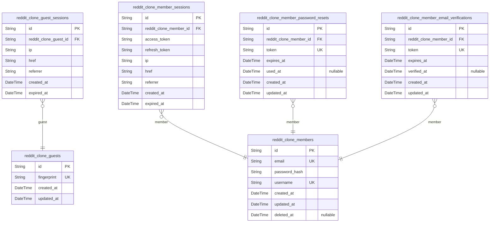
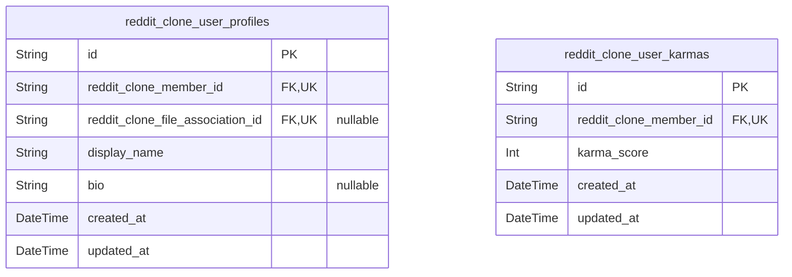
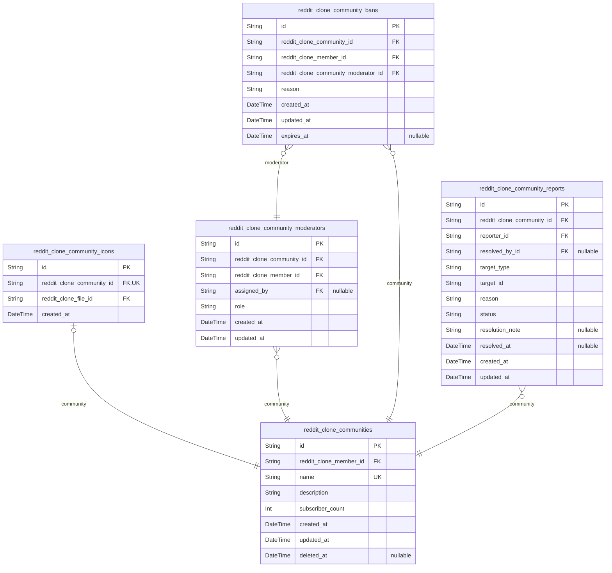
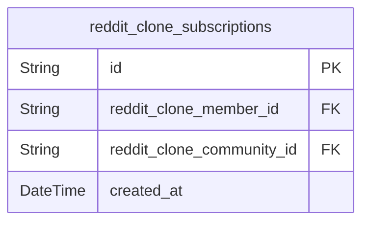
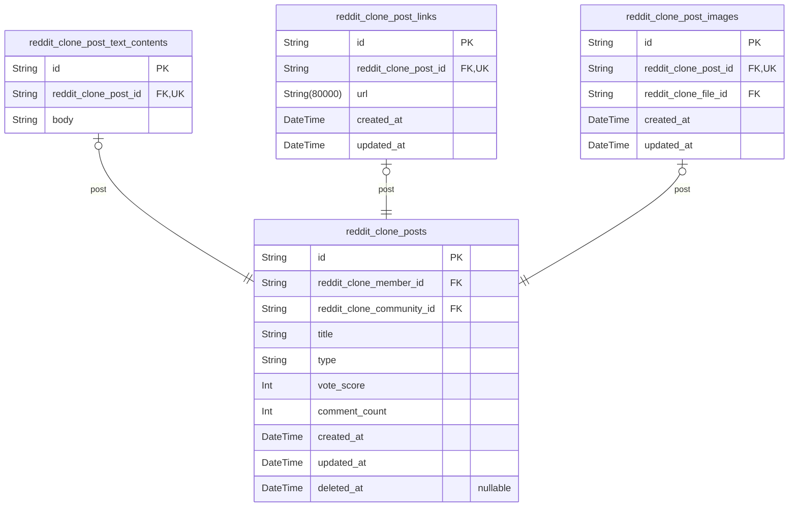
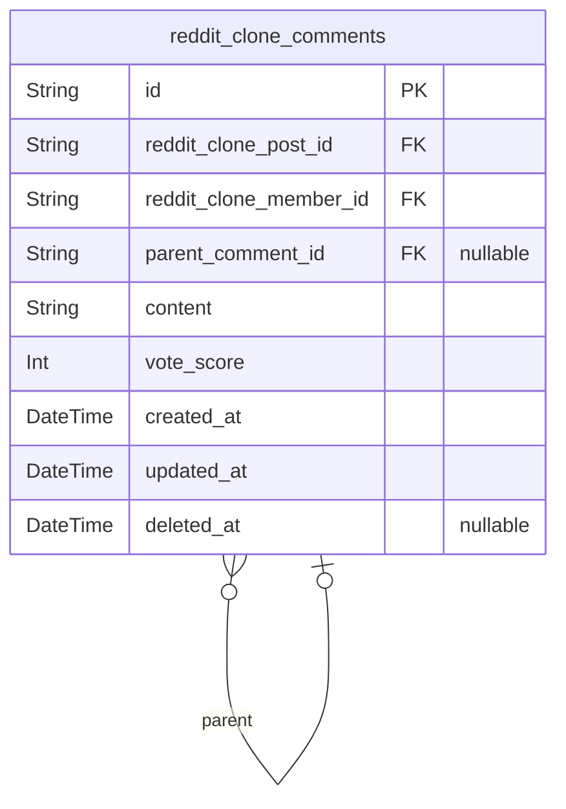
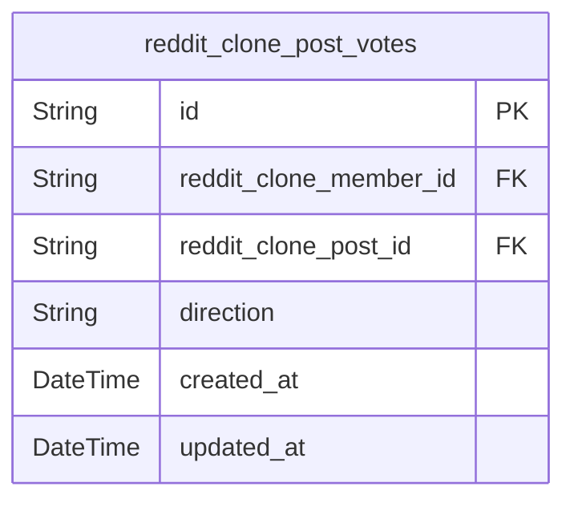
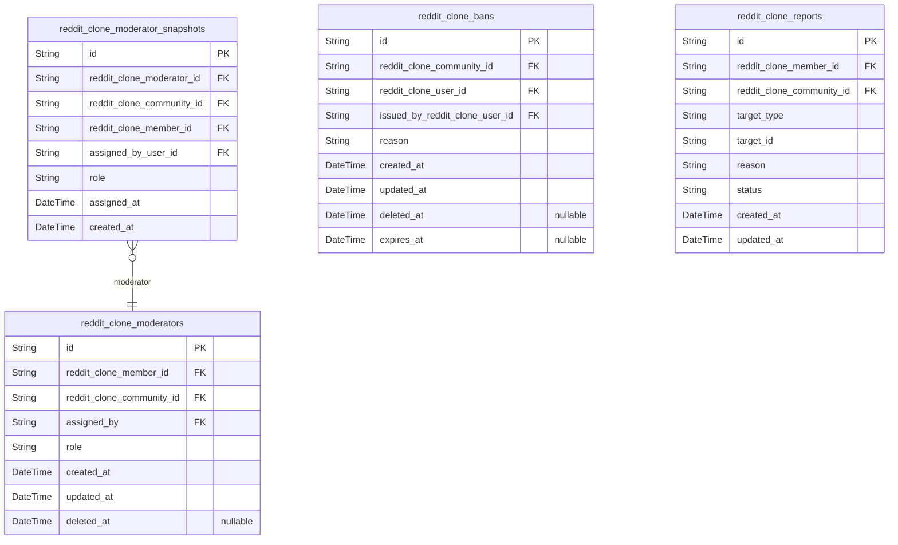
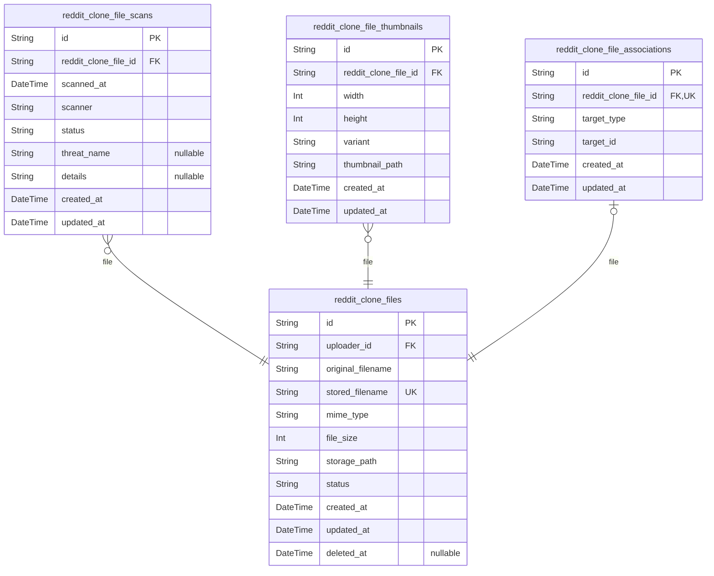

# Prisma Markdown

> Generated by [`prisma-markdown`](https://github.com/samchon/prisma-markdown)

- [Actors](#actors)
- [Users](#users)
- [Communities](#communities)
- [Subscriptions](#subscriptions)
- [Posts](#posts)
- [Comments](#comments)
- [Votes](#votes)
- [Moderation](#moderation)
- [Files](#files)

## Actors

### `reddit_clone_guests`

Temporary guest accounts identified by device fingerprint for
unauthenticated access to public content.

Guests represent anonymous visitors who can browse public content without
registration. Each guest is identified by a unique device fingerprint
that allows session persistence across page visits. Guest accounts are
lightweight and do not require email/password authentication.

Properties as follows:

- `id`: Primary Key.
- `fingerprint`
  > Unique device fingerprint string used to identify and track guest users
  > across sessions.
- `created_at`: Timestamp when the guest account was first created.
- `updated_at`: Timestamp when the guest account was last updated.

### `reddit_clone_guest_sessions`

Temporary session tokens for guest access with device binding and
expiration. Each session represents an unauthenticated visitor's browsing
session, tracking their IP address, current URL, and referrer for
analytics and session management purposes. Sessions expire after a
configurable TTL and are cleaned up or referenced during garbage
collection.

Properties as follows:

- `id`: Primary Key.
- `reddit_clone_guest_id`
  > Associated guest's device fingerprint session. {@link
  > reddit_clone_guests.id}
- `ip`
  > Client IP address captured at session creation for analytics and security
  > purposes.
- `href`
  > Current URL path the guest is accessing, used for session activity
  > tracking.
- `referrer`
  > HTTP referrer header indicating the previous page URL that linked to this
  > session.
- `created_at`: Timestamp when this guest session was created.
- `expired_at`: Timestamp when this guest session will expire and become invalid.

### `reddit_clone_members`

Registered member accounts with email/password authentication
credentials. This is the primary actor entity for authenticated users who
can create posts, comments, vote, subscribe to communities, and
participate in all interactive features. Each member has a unique email
for authentication, a hashed password, and a unique username for display
purposes. Account deletion is soft-delete to support data retention
policies.

Properties as follows:

- `id`: Primary Key.
- `email`
  > Email address used for authentication. Must be unique across all member
  > accounts.
- `password_hash`
  > Hashed password for secure authentication. Never store plain text
  > passwords.
- `username`
  > Unique display name chosen by the user for identification in posts,
  > comments, and profiles.
- `created_at`: Timestamp when the member account was created.
- `updated_at`: Timestamp when the member account was last modified.
- `deleted_at`
  > Timestamp for soft deletion. Null when account is active, set when
  > account is deleted.

### `reddit_clone_member_sessions`

JWT session tokens for member authentication. Each record represents a
login session with access and refresh token support, connection metadata
(IP, headers, referrer), and automatic expiration tracking. Many sessions
can exist per member, enabling multi-device login support.

Properties as follows:

- `id`: Primary Key.
- `reddit_clone_member_id`
  > The authenticated member who owns this session. {@link
  > reddit_clone_members.id}
- `access_token`: JWT access token string for authenticated API requests.
- `refresh_token`: JWT refresh token string for obtaining new access tokens.
- `ip`: Client IP address at session creation for security auditing.
- `href`: Request URL path at session creation for session context tracking.
- `referrer`: HTTP referrer header at session creation for traffic source tracking.
- `created_at`: Timestamp when the session was created.
- `expired_at`: Timestamp when the session expires and becomes invalid.

### `reddit_clone_member_password_resets`

Stores password reset tokens for member account recovery. Each token is
linked to a specific member and has an expiration time. Tokens can be
marked as used when the password reset is completed. This table supports
the password change and account recovery workflow for registered members.

Properties as follows:

- `id`: Primary Key.
- `reddit_clone_member_id`
  > The member who requested the password reset. {@link
  > reddit_clone_members.id}
- `token`: The unique reset token string used to verify the password reset request.
- `expires_at`: When this reset token expires. Tokens become invalid after this timestamp.
- `used_at`
  > When this reset token was used to reset the password. Null if not yet
  > used.
- `created_at`: When this reset token was created.
- `updated_at`: When this reset token was last updated.

### `reddit_clone_member_email_verifications`

Email verification tokens for member registration verification. Stores
temporary tokens sent to user email during registration. Token must be
verified within expiration window to activate the member account. Once
verified, the verified_at timestamp is set and token becomes invalid.

Properties as follows:

- `id`: Primary Key.
- `reddit_clone_member_id`
  > Member account associated with this verification token. {@link
  > reddit_clone_members.id}
- `token`
  > Unique verification token sent to the user's email address. Stored hashed
  > for security.
- `expires_at`
  > Timestamp when this verification token expires. User must verify before
  > this time.
- `verified_at`
  > Timestamp when the email was successfully verified. Null if not yet
  > verified.
- `created_at`: Timestamp when the verification token was created.
- `updated_at`: Timestamp when the verification record was last updated.

## Users

### `reddit_clone_user_profiles`

Stores user profile information for the Reddit-like platform. Each
registered member has exactly one profile containing their display name,
bio text, and avatar image. Profile data is publicly viewable by all
users to display author information on posts and comments. The profile is
directly owned by a member via a 1:1 relationship.

Properties as follows:

- `id`: Primary Key.
- `reddit_clone_member_id`: Owner's member account. [reddit_clone_members.id](#reddit_clone_members).
- `reddit_clone_file_association_id`: Avatar image file association. [reddit_clone_file_associations.id](#reddit_clone_file_associations).
- `display_name`: User's display name shown on posts, comments, and profile page.
- `bio`: User's biography or description text on their profile.
- `created_at`: Profile creation timestamp.
- `updated_at`: Last profile update timestamp.

### `reddit_clone_user_karmas`

Tracks the computed karma score for each user, denormalized for efficient
profile display.

Karma represents a user's reputation on the platform calculated from
votes on their content. When a user receives an upvote on a post or
comment, their karma increases by 1. When a downvote is received, karma
decreases by 1. Removing votes adjusts karma accordingly. Karma can be
negative.

This table is a denormalized aggregation maintained by the system (not
directly user-managed). It is updated automatically when votes are cast,
changed, or removed on the user's posts and comments. The denormalized
design enables efficient profile page queries without counting votes at
runtime.

References [reddit_clone_members](#reddit_clone_members) for user identity.

Properties as follows:

- `id`: Primary Key.
- `reddit_clone_member_id`
  > Reference to the member whose karma is being tracked. {@link
  > reddit_clone_members.id}.
- `karma_score`
  > Computed karma score for the user. Increases by 1 for each upvote on
  > user's content, decreases by 1 for each downvote. Can be negative.
- `created_at`: Timestamp when the karma record was initially created.
- `updated_at`: Timestamp when the karma score was last updated due to vote changes.

## Communities

### `reddit_clone_communities`

Main community entity representing a subreddit-like forum where users can
post and discuss content. Each community has a unique name, description
text, and an owner who created it. Communities track denormalized
subscriber_count for efficient listing without expensive joins. Users can
browse all communities, search by name, and subscribe to participate.

Properties as follows:

- `id`: Primary Key.
- `reddit_clone_member_id`
  > Owner/creator of the community. References the member who created this
  > community. [reddit_clone_members.id](#reddit_clone_members)
- `name`
  > Unique community name used for identification and URLs (e.g.,
  > 'askreddit', 'funny'). Must be unique across all communities.
- `description`
  > Community description text explaining the purpose and rules of the
  > community.
- `subscriber_count`
  > Denormalized count of subscribers for efficient display in community
  > listings. Updated when users subscribe/unsubscribe.
- `created_at`: Timestamp when the community was created.
- `updated_at`: Timestamp of the last update to community metadata.
- `deleted_at`: Soft delete timestamp. Null when active, set when community is deleted.

### `reddit_clone_community_icons`

Stores icon images for communities as separate file entities. Each
community can have one icon image, establishing a 1:1 relationship. The
icon references an uploaded file from the [reddit_clone_files](#reddit_clone_files)
entity, following the same file association pattern used across the
platform for avatars and post images.

Properties as follows:

- `id`: Primary Key.
- `reddit_clone_community_id`
  > Reference to the community this icon belongs to. {@link
  > reddit_clone_communities.id}
- `reddit_clone_file_id`
  > Reference to the uploaded file serving as the community icon. {@link
  > reddit_clone_files.id}
- `created_at`: Timestamp when this icon was uploaded or assigned to the community.

### `reddit_clone_community_moderators`

Junction table linking members to communities with moderator roles.
Establishes the community governance hierarchy where each community has
exactly one owner and can have multiple moderators. The owner is
automatically assigned when creating a community. Moderator role
assignments are reversible and tracked via the assigned_by field for
audit purposes.

Properties as follows:

- `id`: Primary Key.
- `reddit_clone_community_id`
  > The community where this moderator role applies. {@link
  > reddit_clone_communities.id}
- `reddit_clone_member_id`
  > The member who holds this moderator role in the community. {@link
  > reddit_clone_members.id}
- `assigned_by`
  > The member who assigned this moderator role. Null for owner
  > (self-assigned on community creation). [reddit_clone_members.id](#reddit_clone_members)
- `role`
  > The moderator role level. 'owner' is the highest authority who cannot be
  > removed. 'moderator' has delegated powers within the community.
- `created_at`: Timestamp when this moderator role was assigned.
- `updated_at`: Timestamp when this moderator role was last modified.

### `reddit_clone_community_bans`

Records user bans within communities. Each ban links a banned user to a
specific community, issued by a moderator with a reason and optional
expiration time. Banned users cannot create posts or comments in the
community but can still view content.

Properties as follows:

- `id`: Primary Key.
- `reddit_clone_community_id`
  > The community from which the user is banned. {@link
  > reddit_clone_communities.id}.
- `reddit_clone_member_id`
  > The member who is banned from the community. {@link
  > reddit_clone_members.id}.
- `reddit_clone_community_moderator_id`
  > The moderator who issued this ban. {@link
  > reddit_clone_community_moderators.id}.
- `reason`: Reason for the ban as provided by the moderator.
- `created_at`: Timestamp when the ban was issued.
- `updated_at`: Timestamp when the ban was last updated.
- `expires_at`: Optional timestamp when the ban expires. Null means permanent ban.

### `reddit_clone_community_reports`

User-submitted reports targeting posts or comments within a community,
with status for moderator review workflow.

This table stores content reports filed by users against posts or
comments that violate community rules. Reports are scoped to a specific
community so that moderators can access and review them. The polymorphic
target pattern (target_type + target_id) allows a single table to handle
reports for both posts and comments.

Workflow: Users submit reports with a reason. Moderators review pending
reports and either approve (deleting the content) or dismiss (keeping the
content) them. The resolution fields track who resolved the report and
when.

Properties as follows:

- `id`: Primary Key.
- `reddit_clone_community_id`
  > Community where the reported content exists and where moderators will
  > review this report. [reddit_clone_communities.id](#reddit_clone_communities).
- `reporter_id`: User who filed this report. [reddit_clone_members.id](#reddit_clone_members).
- `resolved_by_id`
  > Moderator who resolved this report. [reddit_clone_members.id](#reddit_clone_members). Null
  > until report is resolved.
- `target_type`: Type of reported content. Values: 'post' or 'comment'.
- `target_id`
  > ID of the reported post or comment. Combined with target_type to identify
  > the specific content.
- `reason`
  > User-provided reason for the report explaining why the content violates
  > community rules.
- `status`: Current status of the report. Values: 'pending', 'approved', 'dismissed'.
- `resolution_note`: Optional note from the moderator explaining the resolution decision.
- `resolved_at`
  > Timestamp when the report was resolved by a moderator. Null until
  > resolved.
- `created_at`: Timestamp when the report was submitted.
- `updated_at`: Timestamp when the report was last updated.

## Subscriptions

### `reddit_clone_subscriptions`

Junction table linking users to communities for subscriptions. Each
record represents a user's subscription to a community with timestamp for
ordering.

This table enables the many-to-many relationship between members and
communities. A subscription is required for creating posts in a
community. Users can subscribe and unsubscribe freely.

Properties as follows:

- `id`: Primary Key.
- `reddit_clone_member_id`: Subscribed member's [reddit_clone_members.id](#reddit_clone_members).
- `reddit_clone_community_id`: Subscribed community's [reddit_clone_communities.id](#reddit_clone_communities).
- `created_at`
  > Timestamp when the subscription was created. Used for chronological
  > ordering of subscriptions.

## Posts

### `reddit_clone_posts`

Main post entity storing common attributes for all post types with
polymorphic type discriminator. Each post belongs to a community and is
authored by a member. Posts support three content types (text, link,
image) via separate child tables following 1:1 relationship pattern.
Denormalized vote_score and comment_count fields enable efficient feed
queries without expensive aggregations at query time.

Properties as follows:

- `id`: Primary Key.
- `reddit_clone_member_id`: Author of the post. [reddit_clone_members.id](#reddit_clone_members).
- `reddit_clone_community_id`: Community where the post belongs. [reddit_clone_communities.id](#reddit_clone_communities).
- `title`: Title of the post. Required for all post types.
- `type`
  > Post type discriminator indicating content type: 'text' for text posts,
  > 'link' for URL posts, 'image' for image posts.
- `vote_score`
  > Denormalized vote score (upvotes minus downvotes) for efficient feed
  > sorting without aggregation at query time.
- `comment_count`
  > Denormalized comment count for efficient display without counting at
  > query time.
- `created_at`: Timestamp when the post was created.
- `updated_at`: Timestamp when the post was last updated.
- `deleted_at`: Soft delete timestamp. Null if not deleted.

### `reddit_clone_post_text_contents`

Stores the full body text content for text-type posts in the Reddit-like
platform. This table maintains a strict 1:1 relationship with the parent
post entity via a unique foreign key constraint, ensuring each post can
only have one text content record. The body field contains the main
textual content of text posts and supports full-text search through GIN
indexing.

Properties as follows:

- `id`: Primary Key.
- `reddit_clone_post_id`
  > Reference to the parent post this text content belongs to. {@link
  > reddit_clone_posts.id}
- `body`: The full textual body content of the text post.

### `reddit_clone_post_links`

Stores the external URL for link-type posts. This table maintains a
one-to-one relationship with the main posts table, where each link post
has exactly one URL record. When a post is deleted, the associated link
content is cascade deleted.

Properties as follows:

- `id`: Primary Key.
- `reddit_clone_post_id`: Associated post this link belongs to. [reddit_clone_posts.id](#reddit_clone_posts)
- `url`: External URL pointing to the linked resource.
- `created_at`: Timestamp when the link was created.
- `updated_at`: Timestamp when the link was last updated.

### `reddit_clone_post_images`

Stores image file references for image post type. Each image post has
exactly one image file associated with it through a 1:1 relationship. The
actual image file data is stored in [reddit_clone_files](#reddit_clone_files), while
this table links the image to the parent post. This design follows the
polymorphic content pattern used for different post types (text, link,
image).

Properties as follows:

- `id`: Primary Key.
- `reddit_clone_post_id`
  > Reference to the parent post this image belongs to. Enforces 1:1
  > relationship - each image post has exactly one image. {@link
  > reddit_clone_posts.id}.
- `reddit_clone_file_id`
  > Reference to the uploaded image file in the file storage. {@link
  > reddit_clone_files.id}.
- `created_at`: Timestamp when the image was associated with the post.
- `updated_at`: Timestamp when the image association was last modified.

## Comments

### `reddit_clone_comments`

Hierarchical comment threads attached to posts in communities.
Self-referential parent_comment_id enables unlimited nesting depth for
reply trees. Each comment belongs to a post and has an author member.
Denormalized vote_score enables efficient sorting without counting votes
at query time. Soft-delete preserves tree structure while hiding deleted
content from view.

Properties as follows:

- `id`: Primary Key.
- `reddit_clone_post_id`: The post this comment belongs to. [reddit_clone_posts.id](#reddit_clone_posts)
- `reddit_clone_member_id`: The author of this comment. [reddit_clone_members.id](#reddit_clone_members)
- `parent_comment_id`
  > Parent comment for nested replies. Null for top-level comments. {@link
  > reddit_clone_comments.id}
- `content`: The text content of the comment.
- `vote_score`
  > Denormalized vote score (upvotes minus downvotes) for efficient sorting
  > by best/controversial.
- `created_at`: Timestamp when the comment was created.
- `updated_at`: Timestamp when the comment was last updated.
- `deleted_at`: Soft-delete timestamp. Null if comment is active, non-null if deleted.

## Votes

### `reddit_clone_post_votes`

User votes on posts with one-vote-per-content constraint. Vote types are
upvote (+1) or downvote (-1). Vote direction adjusts author's karma. Each
user can only have one vote per post, and changing vote direction updates
the record.

Properties as follows:

- `id`: Primary Key.
- `reddit_clone_member_id`: The member who cast this vote. [reddit_clone_members.id](#reddit_clone_members)
- `reddit_clone_post_id`: The post being voted on. [reddit_clone_posts.id](#reddit_clone_posts)
- `direction`: Vote direction: 'upvote' (+1) or 'downvote' (-1).
- `created_at`: When the vote was cast.
- `updated_at`: When the vote was last changed (direction change).

## Moderation

### `reddit_clone_moderators`

Links users to communities with moderator roles, supporting owner and
moderator role hierarchy. The creator of a community becomes the owner
with highest authority. Moderators can add other moderators but cannot
remove the owner. Role assignments are immutable to preserve audit
history.

Properties as follows:

- `id`: Primary Key.
- `reddit_clone_member_id`
  > The user who has been granted moderator role. {@link
  > reddit_clone_members.id}.
- `reddit_clone_community_id`
  > The community where this moderator role applies. {@link
  > reddit_clone_communities.id}.
- `assigned_by`: The moderator who assigned this role. [reddit_clone_members.id](#reddit_clone_members).
- `role`
  > Moderator role type. Values: 'owner' (community creator with highest
  > authority) or 'moderator' (appointed moderator with content management
  > powers).
- `created_at`: Timestamp when the moderator role was assigned.
- `updated_at`: Timestamp when the moderator role was last updated.
- `deleted_at`
  > Timestamp when the moderator role was removed. Null if active. Used for
  > soft delete to preserve audit history.

### `reddit_clone_moderator_snapshots`

Point-in-time snapshots of moderator role assignments for historical
audit purposes.

This table captures the state of moderator assignments at specific
moments in time, providing an immutable audit trail. Each snapshot
records who held a moderator role in a community, their role level, who
assigned them, and when the assignment was made. This enables
reconstruction of historical moderation history and accountability for
role changes.

Properties as follows:

- `id`: Primary Key.
- `reddit_clone_moderator_id`
  > Reference to the original moderator assignment record being snapshotted.
  > [reddit_clone_moderators.id](#reddit_clone_moderators)
- `reddit_clone_community_id`
  > Denormalized reference to the community where the moderator assignment
  > exists. [reddit_clone_communities.id](#reddit_clone_communities)
- `reddit_clone_member_id`
  > Denormalized reference to the user holding the moderator role. {@link
  > reddit_clone_members.id}
- `assigned_by_user_id`
  > Denormalized reference to the user who assigned this moderator role.
  > [reddit_clone_members.id](#reddit_clone_members)
- `role`
  > The moderator role level at the time of snapshot. Values: 'owner' or
  > 'moderator'.
- `assigned_at`: Denormalized timestamp when the moderator role was originally assigned.
- `created_at`: Timestamp when this snapshot was created.

### `reddit_clone_bans`

User bans within specific communities, recording the reason, issuer, and
creation timestamp for accountability. When a moderator bans a user from
their community, the ban prevents that user from creating posts or
comments while still allowing them to view content. Bans can be temporary
with an optional expiration date. Unbanning is achieved through soft
deletion, preserving the ban history for audit purposes.

Properties as follows:

- `id`: Primary Key.
- `reddit_clone_community_id`: Community where the user was banned. [reddit_clone_communities.id](#reddit_clone_communities)
- `reddit_clone_user_id`: User who was banned from the community. [reddit_clone_members.id](#reddit_clone_members)
- `issued_by_reddit_clone_user_id`: Moderator who issued the ban. [reddit_clone_members.id](#reddit_clone_members)
- `reason`: Reason for the ban as specified by the moderator.
- `created_at`: Timestamp when the ban was issued.
- `updated_at`: Timestamp of last modification.
- `deleted_at`: Timestamp when the ban was lifted (unbanned). Null if ban is active.
- `expires_at`
  > Optional expiration timestamp for temporary bans. Null if ban is
  > permanent.

### `reddit_clone_reports`

Content reports filed by users against posts or comments within a
community. Each report contains the reporter, the reported content
(polymorphic via target_type and target_id), a reason, and a status
workflow (pending, approved, dismissed). Moderators review reports and
either approve (deleting the content) or dismiss them.

Properties as follows:

- `id`: Primary Key.
- `reddit_clone_member_id`: The member who filed the report. [reddit_clone_members.id](#reddit_clone_members)
- `reddit_clone_community_id`
  > The community where the reported content exists. {@link
  > reddit_clone_communities.id}
- `target_type`
  > Type of the reported content: 'post' or 'comment'. Serves as
  > discriminator for polymorphic relationship.
- `target_id`
  > UUID of the reported post or comment. Polymorphic reference determined by
  > target_type.
- `reason`
  > Textual reason provided by the reporter explaining why the content was
  > reported.
- `status`
  > Current status of the report: 'pending' (awaiting review), 'approved'
  > (content deleted), or 'dismissed' (content kept).
- `created_at`: Timestamp when the report was filed.
- `updated_at`: Timestamp when the report was last updated (status change).

## Files

### `reddit_clone_files`

Centralized file storage table for all uploaded content in the platform.
This table stores file metadata for user avatars, community icons, and
post images. Files are associated with entities through the {@link
reddit_clone_file_associations} table which provides polymorphic linking
to users, communities, and posts. Each file tracks its original name,
storage details, MIME type, size, and processing status.

Properties as follows:

- `id`: Primary Key.
- `uploader_id`: Member who uploaded the file. [reddit_clone_members.id](#reddit_clone_members).
- `original_filename`: Original filename as uploaded by the user.
- `stored_filename`: Generated unique filename used for storage, ensuring no collisions.
- `mime_type`: MIME type of the file (e.g., image/jpeg, image/png).
- `file_size`: File size in bytes.
- `storage_path`: Path in the storage system where the file is stored.
- `status`
  > Processing status: pending (awaiting virus scan), processed (safe),
  > failed (scan failed or processing error).
- `created_at`: Timestamp when the file was uploaded.
- `updated_at`: Timestamp when the file metadata was last updated.
- `deleted_at`: Timestamp for soft deletion. Null if not deleted.

### `reddit_clone_file_scans`

Audit records for virus scan results linked to uploaded files. Each
record captures the outcome of a virus/malware scan performed on a file,
including the scanner used, scan timestamp, status
(clean/infected/error), and any threat details if malicious content was
detected. This table is append-only for audit trail purposes.

Properties as follows:

- `id`: Primary Key.
- `reddit_clone_file_id`: The uploaded file that was scanned. [reddit_clone_files.id](#reddit_clone_files)
- `scanned_at`: Timestamp when the virus scan was performed.
- `scanner`: Name and version of the virus scanner used (e.g., 'ClamAV 0.103.0').
- `status`
  > Result status of the scan: 'clean' (no threats), 'infected' (malware
  > detected), or 'error' (scan failed).
- `threat_name`
  > Name of the detected threat if the file is infected (e.g.,
  > 'Eicar.Test.File', 'Trojan.Generic'). Null if status is not 'infected'.
- `details`
  > Additional details from the scanner output, such as signature matches or
  > remediation recommendations. May be null for clean scans.
- `created_at`: Timestamp when this scan record was created in the database.
- `updated_at`: Timestamp when this scan record was last updated.

### `reddit_clone_file_thumbnails`

Stores generated thumbnail variants for images with different sizes. Each
thumbnail is associated with a parent image from {@link
reddit_clone_files} and contains metadata about dimensions and variant
type. Multiple thumbnail sizes can be generated per image (e.g., 100x100,
300x300, 600x600) for different display contexts.

Properties as follows:

- `id`: Primary Key.
- `reddit_clone_file_id`
  > Reference to the original image this thumbnail was generated from. {@link
  > reddit_clone_files.id}
- `width`: Thumbnail width in pixels.
- `height`: Thumbnail height in pixels.
- `variant`
  > Thumbnail variant identifier such as 'small', 'medium', 'large', or
  > specific dimension labels like '100x100'.
- `thumbnail_path`: File path or storage reference where the thumbnail image is stored.
- `created_at`: Timestamp when the thumbnail was generated.
- `updated_at`: Timestamp when the thumbnail metadata was last updated.

### `reddit_clone_file_associations`

Polymorphic associations linking uploaded files to their owning entities.
This table enables the file storage system to track which files are used
as user avatars, community icons, or post images. Each file can be
associated with exactly one entity, and each entity can have one file per
association type. The polymorphic pattern with target_type discriminator
allows a single table to handle all file-to-entity relationships
efficiently.

Properties as follows:

- `id`: Primary Key.
- `reddit_clone_file_id`: Reference to the associated file. [reddit_clone_files.id](#reddit_clone_files)
- `target_type`
  > Type discriminator indicating the entity this file is associated with.
  > Values: 'user' for avatar, 'community' for icon, 'post' for image post.
- `target_id`: UUID of the owning entity (user, community, or post).
- `created_at`: Timestamp when the file association was created.
- `updated_at`: Timestamp when the file association was last modified.
