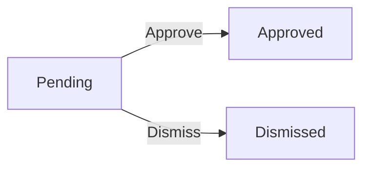
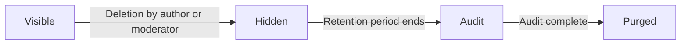

**redditClone — Business concepts, relationships, and states from user perspective**

Business concepts, relationships, and states from user perspective

# Domain Concepts

Describe what each concept means in the business domain and its key attributes.

## User Concept

User is the fundamental actor in the platform, representing a person who can create content and interact with others. Each user maintains a unique email address that serves as their primary identifier for authentication during login. Users choose a unique username during registration that others can use to reference them. Every user has a display name that appears on their profile and in content they author, allowing for a more personalized identity separate from the username. Users can optionally provide a bio text to describe themselves, giving other users insight into who they are. An avatar image allows users to personalize their visual identity on the platform. A critical metric associated with each user is their karma score, which reflects community approval of their contributions and increases when others upvote their content while decreasing when content receives downvotes.

### User Identity and Registration

## User Identity

A user is a person who participates in the platform by creating content, interacting with others, and building reputation through community feedback.

### User Account Registration

Users create an account by providing an email address, a password, and selecting a unique username. The email address serves as the primary identifier for logging into the platform. The username must be unique across the entire platform and is used by other users to mention or reference the account.

During registration, the system verifies that the provided email address is valid and that the username is not already in use. If the username is already taken, the user must choose a different one. The password is chosen by the user and is not visible to anyone else, including platform administrators.

### Profile Attributes

Each user maintains a public-facing profile that contains several attributes:

- **Display Name**: A name shown on the user's profile and alongside content they create. This differs from the username and can include spaces and special characters. The display name allows users to present themselves more personally than their username allows.

- **Bio Text**: An optional text field where users can write a description about themselves. This bio appears on the user's profile page and helps other users learn about who the person is.

- **Avatar Image**: An optional picture that represents the user visually across the platform. This image appears next to the user's name in comments, posts, and on their profile.

- **Karma Score**: A numerical value that reflects the user's standing in the community. The karma score increases by one when another user upvotes content the user created. The karma score decreases by one when another user downvotes content the user created. If a vote is removed, the karma score adjusts in the opposite direction accordingly. Karma can be a negative number if a user's content receives more downvotes than upvotes over time.

Users can update their display name, bio text, and avatar image at any time through their account settings. Changes take effect immediately on the user's profile and across all their existing content.

### User Profile and Public Display

## User Profile Display

When other users view a profile page, they see a complete summary of that user's activity and identity.

### Profile Page Contents

A user's profile page displays the following information:

- The user's display name, shown prominently at the top of the page
- The user's avatar image, if one has been set
- The user's bio text, showing whatever description they have written
- The user's total karma score, indicating their overall reputation based on votes received
- A list of all posts the user has created, showing each post's title, when it was posted, and its current vote score
- A list of all comments the user has written, showing each comment's content, when it was posted, and its current vote score

### Profile Visibility

Any user on the platform can view another user's profile by navigating to their profile page. Users do not need to be subscribed to a person to view their profile, unlike communities which may have restricted access for posting.

## Community Concept

Community represents a dedicated space where users with shared interests can gather and share content. Each community has a unique name that distinguishes it from all other communities on the platform. Communities maintain a description text that explains the purpose and rules of the community to potential subscribers. An icon image provides visual branding for the community, helping users identify it among the list of communities. Every community designates one user as its owner, who holds the highest authority within that community and is typically the creator. Communities track their subscriber count, which indicates popularity and helps users discover active communities. The combination of name, description, and icon creates the identity that users see when browsing or subscribing to communities.

### Community Identity

A community on the platform represents a dedicated space where users with shared interests can gather and share content. Each community has a unique name that distinguishes it from all other communities on the platform. The combination of name, description, and icon creates the visual and conceptual identity that users see when browsing or subscribing to communities.

### Community Naming and Identity Attributes

The community name serves as the primary identifier and must be unique across the entire platform. No two communities can share the same name. When users search for communities, they search by this name. The platform ensures uniqueness during the community creation process.

The description text provides an explanation of the community's purpose and topic. This helps users understand what kind of content they can expect to find and participate in before subscribing. The description is displayed when users browse the community list or view the community page.

The icon image serves as visual branding for the community. This small image appears alongside the community name throughout the platform, helping users quickly identify the community among the list of communities they browse or subscribe to.

### Community Owner Role

Every community designates one user as its owner. The owner is automatically assigned when the community is created, and this is always the user who created the community. The owner holds the highest authority within that community and cannot be removed or demoted by other moderators.

### Subscriber Count Tracking

Communities track how many users have subscribed to them. This number, known as the subscriber count, is displayed alongside the community name and icon throughout the platform. A higher subscriber count indicates greater popularity and can help users discover active and thriving communities.

### Shared Interest Grouping

Communities are designed as gathering spaces for users who share common interests. Each community focuses on a particular topic, theme, or purpose that brings like-minded people together. Users join communities by subscribing, which gives them access to view the community feed and create posts within that community.

## Subscription Concept

Subscription represents the relationship between a user and a community they have chosen to follow. This relationship enables users to receive content from that community in their personalized home feed. A subscription is established when a user decides to follow a community and is terminated when the user chooses to unsubscribe. The subscription concept connects the user entity to the community entity, creating a many-to-many relationship where one user can subscribe to many communities and each community can have many subscribers. Subscriptions are necessary for users to create posts within a specific community, serving as a gating mechanism for content creation. Users can view the complete list of communities they are currently subscribed to, allowing them to manage their subscriptions over time.

### Subscription Relationship Definition

A subscription represents the formal following relationship between a user and a community on the platform. When a user subscribes to a community, they establish a persistent connection that affects their content experience across the system. This relationship is directional, meaning a user can follow a community without the community needing to reciprocate. Subscriptions are stored as independent records that link individual users to specific communities, allowing the system to track which users have chosen to follow which communities at any point in time.

### Subscription Attributes

A subscription record contains the following attributes that define its state and context:

- The subscribed user, identified by their account
- The community being followed, identified by its unique name
- The date and time when the subscription was established

These attributes allow the system to determine both the existence of a subscription relationship and when that relationship began, which may be relevant for ranking or display purposes.

### Subscription Gate for Content Creation

Subscriptions serve as a gating mechanism for content creation within communities. A user must have an active subscription to a community before they can create posts in that community. This requirement applies regardless of the type of post being created, whether it is a text post, link post, or image post. Users who are not subscribed to a community cannot author posts in that community, though they can still view community content and subscribe at any time. This gating ensures that only users who have demonstrated interest in a community through subscription can contribute content to it.

### Subscriber Concept

Subscribers of a community are individuals who have established an active subscription to that community. The system tracks the total number of subscribers for each community, which serves as a measure of community popularity and interest. This subscriber count is displayed publicly on the community page and in community listings, allowing prospective subscribers to gauge the size and engagement level of a community before choosing to join it. The subscriber count reflects the current number of active subscriptions, not historical or cumulative figures.

### Subscription List Viewing

Users can view the complete list of communities they are currently subscribed to. This subscription management view allows users to review and manage their community connections over time. From this list, users can choose to unsubscribe from any community they no longer wish to follow. Unsubscribing removes the subscription relationship and immediately affects the user's experience, including removing that community's content from their home feed and preventing the user from creating new posts in that community unless they subscribe again.

### User-Community Connection Model

The subscription connects the user entity to the community entity in a many-to-many relationship. From the user perspective, a single user can subscribe to multiple communities simultaneously, and each subscription is independent of the others. From the community perspective, a single community can have any number of subscribers, limited only by the total user base of the platform. This bidirectional relationship means that when a subscription is created or deleted, it is reflected in both the user's subscription list and the community's subscriber count. The subscription serves as the join table that enables the system to answer questions about which users follow which communities and which communities a specific user follows.

## Post Concept

Post represents a piece of content created by a user that is shared within a community. Every post must have a title, which serves as the headline that appears in feeds and attracts user attention. Posts are categorized into three distinct types: text posts containing textual content, link posts containing a URL to external content, and image posts containing an uploaded image. The type of post determines what content attribute is relevant — text posts have text content, link posts have a URL reference, and image posts have an image attachment. Each post belongs to exactly one community where it was published and is authored by a single user. Posts display a vote score reflecting community sentiment and a comment count showing engagement. The post concept captures the primary content units that users create and consume on the platform.

### Post Title Requirement

The title is the required headline text that identifies and describes the post. It serves as the primary indicator of what the post contains and is the main element shown in post lists across feeds. Every post must have a title before it can be submitted. The title attracts user attention and helps readers decide whether to engage with the content. When a post appears in a feed, the title is displayed prominently as the clickable element that leads to the full post view.

### Text Post Type

A text post contains textual content written by the author. This type of post is used when the user wants to share thoughts, stories, questions, or any written expression directly on the platform. The text content is stored as part of the post and displayed in full when viewing the individual post page. Text posts allow users to express opinions, start discussions, or share information without linking to external sources.

### Link Post Type

A link post contains a URL reference to external content hosted outside the platform. When users share interesting articles, videos, websites, or any online resource, they use this post type. The link post stores the URL and displays the domain name of the linked site in post lists, helping users identify the source before clicking through. The actual content exists on the external website, not on this platform.

### Image Post Type

An image post contains an uploaded image that becomes the main content of the post. Users share photos, graphics, memes, or visual content through this post type. The image is displayed directly in the post view, allowing users to see the visual content without leaving the platform. Image posts are popular for sharing visual content that does not require external hosting.

### Post Content Variations

The type of post determines which content attribute is relevant and populated. Text posts contain text content, link posts contain a URL reference, and image posts contain an uploaded image. A post can only have content relevant to its type — a text post does not have a URL or image, a link post does not have text content or an image, and an image post does not have text content or a URL. The type classification ensures the post displays correctly in feeds and individual views.

### Post Author Attribution

Every post is authored by a single registered user who created it. The author information is attached to the post and displayed when viewing the post. This attribution allows other users to identify who created the content, view the author's profile, and understand the source of the post. The author retains ownership of their post and can perform actions like editing or deleting it.

### Post Community Placement

Every post belongs to exactly one community where it was published. When creating a post, the user selects which subscribed community to post in, and the post is permanently associated with that community afterward. The community placement determines which subscribers see the post in their home feed and which moderators have authority over the content. A post cannot exist without being tied to a specific community.

### Vote Score Display

Each post displays a vote score reflecting community sentiment. The score represents the total number of upvotes minus downvotes received from users who voted on the post. A positive score indicates more approvals than disapprovals, while a negative score indicates more disapprovals. The vote score is visible in both post lists and individual post views, giving users quick insight into how the community received the content.

### Comment Count Tracking

Each post tracks the total number of comments that have been written on it. The comment count includes both top-level comments directly on the post and all nested replies within those comments. This count is displayed prominently on the post, showing users the level of discussion and engagement the post has generated. A higher comment count indicates an active discussion thread.

## Comment Concept

Comment represents user-generated responses that can be attached to posts or other comments. Unlike posts, comments contain textual content that expresses the author's thoughts or reactions to the parent content. A comment is authored by a single user and can be placed either directly on a post or as a reply to another comment, enabling threaded discussions. The comment concept supports unlimited nesting depth, meaning a reply can have replies, creating hierarchical conversation trees. Comments display their author's identity, the textual content they wrote, a vote score, and the timestamp of when they were posted. The comment concept enables sustained engagement with posts and allows for detailed discussions to unfold over time through nested reply chains.

### Comment Text Content

Comment text content is the primary substance of a comment, expressing the author's thoughts, reactions, or contributions to a discussion. Unlike post content which can be text, a link, or an image, comment content is always textual. Users express their opinions, ask questions, provide clarifications, or engage in conversations through this text. The content is authored by a single user and can be edited by that user after initial creation. When a comment is deleted, its content is removed from the system entirely.

### Comment Author Attribution

Every comment is associated with its author, who is a registered user of the platform. The author is automatically recorded when the comment is created and cannot be changed afterward. Other users viewing the comment can see the author's username, which links to their profile. The author retains the ability to edit or delete their own comments but cannot modify comments created by others.

### Top-Level Comment on Post

A top-level comment is a comment that is placed directly on a post rather than as a reply to another comment. When a user adds a comment to a post without specifying a parent comment, it becomes a top-level comment. These comments appear at the root of the comment tree for that post and are sorted according to the selected comment sorting option.

### Comment Reply Nesting

Comment reply nesting allows users to respond directly to an existing comment, creating a chain of conversation. When replying to a comment, the new comment becomes a child of the parent comment it responds to. This creates a hierarchical structure where discussions can branch off from the main conversation. A reply inherits visibility based on its parent comment's visibility within the community.

### Unlimited Reply Depth

The platform imposes no limit on the depth of comment reply chains. Users can continue replying to replies indefinitely, creating arbitrarily deep conversation threads. This unlimited depth allows for extended discussions and detailed exchanges without artificial constraints. A reply to a reply to a reply remains a valid comment that can further receive replies.

### Nested Comment Trees

Comments are displayed in nested trees that visually represent the hierarchical relationship between parent comments and their replies. Each reply appears indented under its parent comment, with further nested replies indented further. The tree structure allows users to follow conversation branches and understand the context of any reply. Nested replies are loaded and displayed recursively to show the full depth of each conversation thread.

### Comment Vote Score

Like posts, comments accumulate votes from users that contribute to a vote score. The vote score represents the net approval of the comment, calculated as the total number of upvotes minus the total number of downvotes. A comment can receive an upvote, a downvote, or no vote from any given user. The vote score can be positive, zero, or negative depending on the balance of votes.

### Comment Timestamp

Every comment records when it was created, stored as a timestamp indicating the exact moment of posting. This timestamp is displayed to other users as a relative time reference such as "3 hours ago" or "2 days ago." The creation timestamp determines the chronological ordering when comments are sorted by newest. The timestamp is set automatically when the comment is first created and is never modified afterward, even if the comment is edited.

## Vote Concept

Vote represents a user's opinion signal on a piece of content, either approving or disapproving it. Each vote is cast by a single user on either a post or a comment, enabling the community to collectively determine content quality. A vote has two possible directions: an upvote indicates approval and adds one to the content's vote score, while a downvote indicates disapproval and subtracts one from the score. The vote concept ensures that each user can only have one vote per piece of content, preventing duplicate voting from inflating results. When a vote is removed, the karma adjustment for the content author is reversed accordingly. The aggregate of all votes on content produces a vote score that represents overall community sentiment.

### Vote Definition

A Vote represents a user's directional opinion signal on a piece of content, either a post or a comment. When a user casts a vote, they express approval or disapproval of the content, which contributes to the overall community assessment of that content's quality and relevance. Each vote is tied to a specific user and a specific piece of content, creating a direct link between the voter and the content author whose content receives the vote.

### Vote Direction Types

Every vote has a direction that indicates the user's opinion. There are two possible directions: an upvote signals approval or appreciation for the content, while a downvote signals disapproval or disagreement. The direction is the fundamental attribute that determines how the vote affects both the content's score and the author's karma. A user must choose one of these two directions when casting a vote.

### Vote Score Calculation

When a user upvotes content, the vote adds one point to the content's vote score. When a user downvotes content, the vote subtracts one point from the content's vote score. The vote score represents the net community sentiment, calculated as the total number of upvotes minus the total number of downvotes. A positive score indicates net approval, a negative score indicates net disapproval, and a score of zero indicates balanced opinions.

### Single Vote Per User Constraint

The system enforces that each user can only cast one vote on any single piece of content. This constraint prevents users from inflating vote scores through duplicate voting and ensures that each person's opinion is represented equally. When a user attempts to vote on content they have already voted on, the system treats this as a vote change rather than a new vote.

### Vote Change Behavior

When a user changes their vote, the system updates the content's vote score accordingly. If a user switches from an upvote to a downvote, the content's score decreases by two points (one for removing the upvote and one for adding the downvote). Conversely, switching from a downvote to an upvote increases the score by two points. This ensures the vote score always reflects the current state of all votes.

### Vote Removal and Karma Adjustment

Users have the option to remove their vote entirely from any content they have previously voted on. When a vote is removed, the vote score adjusts to reflect the removal. Additionally, the karma of the content author adjusts accordingly: removing an upvote reverses the karma increase, while removing a downvote reverses the karma decrease. This allows users to reconsider their opinions over time.

### Community Sentiment Aggregation

The aggregate of all votes on content produces a vote score that represents overall community sentiment. High positive scores indicate content the community approves of and wants to see elevated. Scores near zero with high vote volumes indicate controversial content where the community is divided. Negative scores indicate content the community largely disapproves of. This sentiment aggregation helps surface quality content and suppress low-quality content through collective community evaluation.

## Moderator Concept

Moderator represents a trusted user who has been granted administrative powers within a specific community. A moderator is associated with exactly one community where they exercise their moderation authority, separate from any moderation they may perform elsewhere. The moderator role includes the ability to remove inappropriate posts and comments, manage the list of banned users, and review reported content within their community. Moderators differ from regular users in that they can take action on content authored by others, while regular users can only manage their own contributions. The moderator concept establishes a hierarchy of authority within communities, with the community owner holding supreme power and appointed moderators sharing responsibility for maintaining community standards.

### Moderator Community Assignment

A moderator is always assigned to exactly one community where they exercise their moderation authority. When a user creates a community, they automatically become the owner of that community and receive the highest level of authority within it. Subsequently, moderators are appointed by the owner or existing moderators to assist with community management. A user may serve as a moderator in multiple different communities simultaneously, with each moderator role tracked independently for each community. The assignment of a moderator role grants the user the ability to perform moderation actions within that specific community only, and does not extend to other communities.

### Moderator Authority Scope

The scope of a moderator's authority is confined to the single community where they hold their moderator role. Within that community, moderators have elevated permissions that allow them to manage content and members. However, a moderator has no authority over content or users in communities where they do not hold a moderator role. The moderator's authority includes the ability to remove posts and comments created by any user within their community, manage the list of banned users, and review content that has been reported by community members. Moderators cannot exercise their authority outside their assigned community.

### Content Removal Powers

Moderators have the power to remove any post that exists within their community, regardless of who authored it. This includes text posts, link posts, and image posts. Similarly, moderators can remove any comment found within their community, including deeply nested replies. Removed content is no longer visible to other users in the community. This power extends to content created by the moderator themselves, other regular users, and even the community owner. The ability to remove content allows moderators to eliminate posts and comments that violate community guidelines or contain inappropriate material.

### User Ban Management

Moderators can ban any user from their community, preventing that user from creating new posts or comments within the community. Banned users retain the ability to view content in the community but cannot participate by posting or commenting. Moderators can also reverse a ban by unbanning a previously banned user, restoring that user's ability to post and comment in the community. Moderators can view a complete list of all users currently banned from their community, including the date each ban was issued. This ban management capability allows moderators to enforce community standards and prevent disruptive users from participating.

### Reported Content Review

Moderators have access to a queue of all reported content within their community. Each report displays the content that was reported, the reason provided by the reporter, and identifies who submitted the report. Moderators can review each report and choose to approve it, which removes the reported content from the community, or dismiss it, which keeps the content visible and removes the report from the queue. This reported content review process enables moderators to address violations of community guidelines while also preventing false or frivolous reports from removing legitimate content.

### Moderator Versus Regular User

Unlike regular users who can only manage their own contributions, moderators can take action on content authored by others. A regular user can edit or delete only the posts and comments they themselves created, while a moderator can remove any post or comment within their community regardless of authorship. Regular users can vote on content but cannot influence visibility or remove content. Moderators have the additional abilities to ban and unban users, and to review reported content. These expanded powers distinguish moderators from regular community members and enable them to maintain community standards.

### Community Authority Hierarchy

Communities operate with a clear hierarchy of authority. At the top stands the community owner, who is the user who created the community and holds ultimate control. The owner can appoint other users as moderators and can also remove any moderator from their role. Below moderators are regular community members who participate by posting, commenting, and voting. At the base are banned users who can view but not participate. The hierarchy ensures that the owner maintains control over their community while distributing moderation responsibilities to trusted members. This structure prevents any single moderator from having unchecked power within the community.

### Appointed Moderator Role

An appointed moderator is a regular community member who has been granted moderation powers by the community owner or by another moderator. The appointment process gives the user a formal role within the community distinct from their identity as a regular member. Once appointed, the moderator gains access to moderation tools and capabilities. Moderators can themselves appoint other moderators, allowing the moderation team to grow through collaborative decisions. However, appointed moderators cannot remove the community owner from their position of highest authority. Additionally, one appointed moderator cannot remove another appointed moderator; only the owner has the ability to remove moderators from their roles.

## Ban Concept

Ban represents a restriction placed on a user that prevents them from participating in a specific community. A ban is scoped to a particular community, meaning a user can be banned from one community while still having full access to others. The banned user remains able to view public content within that community but loses the ability to create new posts or write comments. Bans are issued by moderators or community owners as a consequence for rule violations or inappropriate behavior. The ban concept allows communities to protect themselves from users who repeatedly violate community standards while not affecting that user's activity in other communities. Communities maintain a list of currently banned users that moderators can review to track enforcement history.

### Ban Definition and Scope

A ban is a restriction placed on a user that prevents their participation within a specific community. This restriction is scoped individually to each community, meaning a user may be banned from one community while maintaining full access and privileges in other communities across the platform. The ban concept allows communities to enforce their standards and protect their member base from users who violate community guidelines, while not affecting that user's ability to participate elsewhere on the platform.

The scope of a ban is limited to the community where it was issued. When a user is banned from a community, the restriction applies only to interactions within that particular community. The user retains all their normal privileges in other communities they have not been banned from.

### Ban Consequences

When a user is banned from a community, the following consequences apply:

**Viewing Permission Preserved**: The banned user can still view all public content within the community, including posts and comments. They can see the community page, browse posts, and read discussions without restriction.

**Posting Restriction**: The banned user is prevented from creating new posts within the community. Any attempt to create a post while banned will be rejected.

**Commenting Restriction**: The banned user is prevented from writing comments on any post within the community. This includes both top-level comments and replies to existing comments. Any attempt to comment while banned will be rejected.

These restrictions do not affect the banned user's ability to vote on posts or comments within the community, nor do they affect their activity in other communities.

### Ban Authority

The authority to ban users from a community is granted to moderators and the community owner. Only users who hold moderation powers within a specific community can issue bans for that community. Moderators can ban users who violate community rules or guidelines, and community owners can ban users for any reason they deem appropriate.

When a moderator issues a ban, the system records which moderator performed the action and when it occurred. This creates an audit trail that allows communities to track enforcement activities and ensures accountability for moderator actions.

### Banned User List

Each community maintains a list of currently banned users. This list serves as the authoritative record of who is restricted from participating in that community. The banned user list includes the identity of each banned user and the timestamp when the ban was issued.

Moderators and community owners can view this list to track enforcement history and manage community safety. The list allows moderators to see all currently active bans and who issued them, enabling coordinated moderation efforts and preventing duplicate or conflicting moderation actions.

## Report Concept

Report represents a formal complaint submitted by a user about inappropriate content they have encountered. A report targets either a post or a comment that the reporter believes violates community guidelines or platform rules. When submitting a report, the reporter must provide a textual reason explaining why the content is problematic, giving moderators context for their review. The report concept captures the identity of the reporter, the content being reported, and the stated reason for the report. Reports create a queue of items for community moderators to review and take action upon. Moderators can either approve a report, which typically results in content removal, or dismiss a report, which preserves the content and removes it from the queue.

### Report Definition

A Report represents a formal complaint submitted by a user about content they believe violates community guidelines or platform rules. Reports create accountability for inappropriate behavior and enable community self-moderation. When a user encounters a post or comment that they consider harmful, misleading, or against community standards, they can file a report to bring it to the attention of moderators who manage that community.

### Report Attributes

A report contains the following identifying information:

- **Reported Content**: Every report targets exactly one piece of content—either a post or a comment. The system must track which specific content was reported.

- **Reporter Identity**: Each report records who submitted it. This allows moderators to assess the credibility of reports and prevents abuse of the reporting system.

- **Reason for Report**: The reporter must provide a textual explanation describing why the content is problematic. This gives moderators context for evaluating whether the content violates community standards.

- **Submission Timestamp**: The system records when the report was filed, enabling moderators to prioritize recent reports and track reporting patterns over time.

### Report States

A report exists in one of two states within the moderation workflow:

**Pending**: The report has been submitted and awaits moderator review. Pending reports appear in the community's moderation queue for authorized moderators to evaluate.

**Approved**: A moderator has reviewed the report and determined the content was inappropriate. Approving a report typically results in the removal of the reported content from public visibility.

**Dismissed**: A moderator has reviewed the report and determined the content does not violate community standards. The content remains visible, and the report is removed from the active moderation queue.

### Report Relationships

Reports form associations with several other business concepts:

- **Reporter**: A report is filed by a user (defined in User Concept). Each report records the identity of the user who submitted it.

- **Reported Content**: A report targets either a post or a comment (defined in Post Concept and Comment Concept respectively). A single piece of content may receive multiple reports from different users.

- **Community Context**: The community in which the reported content exists determines which moderators can review the report. Reports are routed to the moderation queue of the community that hosts the content.

- **Moderator Reviewer**: When a moderator acts on a report, their identity is associated with the resolution, providing an audit trail of who reviewed and decided upon each report.

### Report Business Purpose

The Report concept enables the following business outcomes:

- **User Accountability**: Users know their content can be flagged by peers, creating accountability for appropriate behavior.

- **Community Moderation**: Community owners and moderators have visibility into content their community members find concerning.

- **Content Governance**: Reports provide a structured mechanism for identifying and removing content that does not align with community standards.

- **Transparency**: Reporting reasons give moderators insight into community member concerns without requiring direct confrontation between users.

# Domain Relationships

Describe how concepts relate to each other from a business perspective.

## Conceptual Relationships

Describe how concepts relate to each other in business terms.

### User Relationships

Users are the central actors in the platform. Each user has the following relationships:

**Ownership**
- A user who creates a community becomes the owner of that community. The ownership relationship grants the user full authority over the community, including the ability to appoint and remove moderators.
- A user owns the posts they create. The author relationship allows the user to edit or delete their posts at any time.
- A user owns the comments they write. The author relationship allows the user to modify or remove their comments.

**Associations**
- A user can subscribe to multiple communities. The subscription relationship is tracked and enables the user to create posts in those communities.
- A user receives votes on their posts and comments. Each vote affects the user's karma score.
- A user can be banned from a community. When banned, the user cannot create posts or comments in that community but can still view content.
- A user can file reports on posts and comments. The report is associated with the reported content and a reason provided by the user.

### Community Relationships

Communities serve as containers for related posts and connect users with shared interests.

**Ownership**
- Each community has one owner, who is the user who created it. The owner retains authority over the community and cannot lose ownership.

**Belongs-to Relationships**
- A community belongs to its owner. The owner relationship is established at creation and persists.

**Has-many Relationships**
- A community has many posts. All posts in a community are created by subscribed users.
- A community has many subscribers. Users establish the subscription relationship by choosing to follow the community.
- A community has many moderators. Moderators are users granted authority to manage the community.
- A community has many banned users. Banned users are tracked for enforcement of posting restrictions.

### Subscription Relationship

Subscriptions create a many-to-many relationship between users and communities.

**Association**
- A user can subscribe to any number of communities. Each subscription is an independent relationship.
- A community can have any number of subscribers. Subscriber count is publicly visible.

**Rules**
- Subscription is required before a user can create posts in a community.
- Subscription does not affect viewing or commenting permissions.
- Users can unsubscribe at any time without restriction.

### Post Relationships

Posts are the primary content units within communities.

**Belongs-to Relationships**
- Every post belongs to exactly one community where it was created.
- Every post belongs to exactly one author who created it.

**Has-many Relationships**
- A post has many comments. Comments are top-level responses directly attached to the post.
- A post has many votes. Each vote is cast by a single user.
- A post can have many reports. Reports are filed by users who flag content for moderation.

**Voting Impact**
- Votes on a post affect the vote score displayed with the post.
- Votes on a post affect the author's karma score.

### Comment Relationships

Comments create nested discussions attached to posts.

**Belongs-to Relationships**
- Every comment belongs to exactly one post where it was written.
- Every comment belongs to exactly one author who created it.
- A reply comment belongs to exactly one parent comment (for nested discussions).

**Has-many Relationships**
- A comment has many replies. Replies are comments that reference this comment as their parent.
- A comment has many votes. Each vote is cast by a single user.
- A comment can have many reports. Reports are filed by users who flag content for moderation.

**Nesting Rules**
- Comments can be replied to with unlimited depth. There is no maximum nesting level.
- Replies form a tree structure where each comment can have multiple children but only one parent.

### Vote Relationships

Votes create a relationship between users and the content they rate.

**Association**
- Each vote is cast by exactly one user. A user cannot vote on their own content.
- Each vote applies to exactly one piece of content, either a post or a comment.

**Belongs-to Relationships**
- A vote belongs to a user (the voter).
- A vote belongs to either a post or a comment (never both).

**One-to-One Constraint**
- A user can only have one vote per piece of content. If a user votes again, it replaces the previous vote rather than creating a new one.

### Moderator Relationships

Moderators have a special relationship with communities that grants management authority.

**Belongs-to Relationships**
- Each moderator assignment belongs to exactly one user.
- Each moderator assignment belongs to exactly one community.

**Ownership Distinction**
- The community creator holds the owner role, which is the highest level of authority.
- Regular moderators have elevated permissions but cannot remove the owner.

**Authority Scope**
- Moderators have authority only within their assigned community.
- Moderators cannot manage content or users in other communities.

### Ban Relationships

Bans restrict users from participating in specific communities.

**Belongs-to Relationships**
- Each ban belongs to exactly one user who is restricted.
- Each ban belongs to exactly one community where the restriction applies.

**Moderator Association**
- Banned content tracking belongs to the moderator who issued the ban for audit purposes.

**Enforcement Scope**
- Banned users are restricted only within the community where they are banned.
- Banned users retain full access to other communities on the platform.

### Report Relationships

Reports create a relationship between users and content that violates community guidelines.

**Belongs-to Relationships**
- Each report belongs to exactly one user who filed it.
- Each report belongs to exactly one piece of content, either a post or a comment.

**Moderator Association**
- Reports belong to the community where the reported content exists. This determines which moderators can review the report.

**Resolution Outcomes**
- Approved reports result in the reported content being removed.
- Dismissed reports keep the content but remove the report from the queue.

## Lifecycle and Retention

Describe concept lifecycle states and transitions only. Detailed retention/recovery policies belong in 05-non-functional. Operation details belong in 03-functional-requirements.

### Entity State Transitions

### User Account Lifecycle

A user account transitions through the following states during its lifetime:

**Active State**
A newly registered user enters the active state. In this state, the user can create content, vote, subscribe to communities, and perform all platform actions.

**Deletion State**
When a user initiates account deletion, the account enters a deletion state before permanent removal. All content created by the user, including posts and comments, is removed from the platform. The user's subscription relationships are also removed.

**Deleted State**
After deletion completes, the user record no longer appears on the platform. Previously created content is no longer associated with the user and shows as removed. The username becomes available for new registrations after deletion is finalized.

### Community Lifecycle

**Active State**
A community begins in the active state upon creation by its owner. The community is visible in community listings and users can subscribe to it.

**Owner-Transferred State**
If the owner deletes their account, ownership of communities they created must be addressed. The platform does not automatically transfer ownership; instead, the community enters a state where it has no active owner. Moderators remain but cannot perform owner-level actions.

**Deletion State**
Communities do not have a self-service deletion mechanism. A community persists as long as the platform operates, preserving all historical content within it.

### Post Lifecycle

**Draft State (Implicit)**
A post exists in draft state only during its creation process. Once submitted, the post transitions to published.

**Published State**
A post becomes published when its author completes creation and submits it to a subscribed community. Published posts appear in feeds and can receive votes and comments.

**Edited State**
After a published post is modified by its author, it enters an edited state. The original content is replaced but the publication date remains unchanged.

**Removed State**
A published post can be removed through several pathways: author deletion, author self-removal, or moderator removal for rule violations. Removed posts no longer appear in feeds but may still be referenced in comments that quoted the content.

**Permanently Deleted State**
When a post's author deletes their account, the post transitions to permanently deleted. All author attribution is removed and the content is no longer accessible.

### Comment Lifecycle

**Active State**
A comment enters the active state immediately upon submission. It appears in its position within the comment tree and can receive votes and replies.

**Edited State**
When an author modifies their comment, it transitions to edited state. The edit timestamp is recorded separately from the original creation timestamp.

**Removed State**
A comment can be removed by its author, by a moderator, or through parent post deletion. Removed comments display a placeholder indicating removal while preserving the reply structure beneath them.

**Permanently Deleted State**
When a comment's author deletes their account, the comment enters permanently deleted state. The reply structure beneath it remains intact, but the comment content and author attribution are removed.

### Vote Lifecycle

**Active State**
A vote exists in active state once cast by a user on a post or comment. The vote influences the content's score and affects the content author's karma.

**Changed State**
When a user changes their vote direction (from upvote to downvote or vice versa), the vote transitions through a changed state before settling into active state with the new value.

**Removed State**
When a user removes their vote from content, the vote enters removed state. The karma adjustment is reversed accordingly.

**Cascaded Removal**
When the target post or comment is deleted, all associated votes transition to removed state. When the voting user deletes their account, all their votes transition to removed state.

### Moderator Assignment Lifecycle

**Assigned State**
A moderator enters assigned state when added to a community by the owner or another moderator. They gain community-level moderation privileges.

**Active State**
The moderator actively performs moderation actions within their community.

**Removed State**
A moderator can be removed by the owner or by deleting their account. Owner-level moderators cannot be removed except through account deletion.

### Ban Lifecycle

**Active State**
A ban enters active state when a moderator issues it against a user in their community. The banned user immediately loses posting and commenting privileges in that community.

**Expired State**
Bans do not automatically expire. A ban remains active until a moderator explicitly lifts it through the unban action.

**Removed State**
When a banned user deletes their account, the ban record transitions to removed state. If the user creates a new account, the new account is not automatically subject to the previous ban.

### Data Retention Policies

### User Account Retention

User accounts remain on the platform indefinitely from the moment of registration. There is no automatic expiration or archival of user accounts based on inactivity.

**Active Account Retention**
An active account retains all its associated data: profile information, karma score, created content, and community relationships. This data persists across all login sessions and platform usage periods.

**Deleted Account Retention**
Once a user initiates account deletion, the deletion process begins immediately. There is no grace period or recovery window for deleted accounts. All associated data is permanently removed from the platform.

### Community Retention

Communities are retained indefinitely once created. There is no automatic mechanism to delete or archive communities.

**Orphaned Community Handling**
If a community's owner deletes their account, the community persists without an active owner. The community remains visible and subscribers retain their subscriptions, but no one can perform owner-level administrative actions until a new owner is assigned.

### Post Retention

**Active Post Retention**
Published posts are retained on the platform indefinitely. There is no automatic expiration of post visibility based on age.

**Removed Post Handling**
Posts removed by moderators or self-deleted by authors are not physically deleted from storage but are marked as removed. These posts do not appear in feeds but may still be accessible through direct links if the system allows. Comment trees attached to removed posts remain visible with placeholders.

**Author-Deleted Post Handling**
When an author deletes their account, their posts are permanently disassociated from any user. The content remains visible but author attribution shows as [deleted].

### Comment Retention

**Active Comment Retention**
Comments remain visible indefinitely once posted. The nested reply structure is preserved regardless of the age of the conversation.

**Removed Comment Handling**
Comments removed by moderators or self-deleted by authors are marked as removed. A placeholder message appears in place of the content, but all nested replies beneath the removed comment remain visible and accessible.

**Author-Deleted Comment Handling**
When a comment's author deletes their account, the comment content and author attribution are replaced with [deleted] placeholders. The reply structure beneath the comment is fully preserved.

### Vote Retention

Votes are retained as long as both the voting user and the target content exist in active state. Votes are automatically removed when the voting user's account is deleted or when the target content is permanently deleted.

### Report Retention

**Active Report Retention**
Reports remain in the moderation queue until a moderator takes action on them. There is no automatic expiration of unresolved reports.

**Resolved Report Retention**
When a moderator approves a report (resulting in content deletion) or dismisses a report (keeping the content), the report is marked as resolved. Resolved reports are removed from the active queue and are not retained for historical reference.

### Content Archival

### Post Archival

The platform does not implement automatic archival of posts based on age or inactivity. All posts, regardless of when they were created, remain in their current state and are equally accessible.

**Manual Archival**
Users cannot manually archive their own posts. A post remains published and visible until explicitly removed through deletion or moderator action.

### Comment Archival

Comments are not subject to automatic archival. The complete conversation history, including very old comments, remains fully accessible in their nested structure.

### Feed Archival

Historical feeds are always accessible. Users can browse posts from any time period through the appropriate sorting filters. There is no concept of closing or archiving a community's historical content.

### Community Archival

Communities cannot be archived. A community remains active and accessible for browsing and participation unless explicitly removed from the platform through administrative action (not available to regular users or moderators).

### Deletion Policies

### User Account Deletion Policy

**Self-Initiated Deletion**
A user may delete their own account at any time through their account settings. This action is immediate and irreversible.

**Cascade Effects of Account Deletion**
When a user deletes their account, the following automated deletions occur:
- All posts created by the user are disassociated from the user. The content remains visible but author attribution shows as [deleted].
- All comments created by the user are disassociated from the user. The content remains visible but author attribution shows as [deleted].
- All votes cast by the user are removed, and karma scores of affected content authors are adjusted accordingly.
- All community subscriptions are removed.
- The user's moderator assignments are removed.
- Active bans issued by the user are resolved as [deleted].
- The user's reports are removed.

**Recovery After Deletion**
There is no recovery mechanism for deleted accounts. The user must register a new account if they wish to rejoin the platform. The deleted username becomes available for new registrations.

### Post Deletion Policy

**Self-Initiated Deletion**
A user may delete their own posts at any time. Deletion is immediate and permanent.

**Effect of Post Deletion**
When a post is deleted, it is removed from all feeds. The comment tree attached to the post remains visible but shows the post content as [removed]. Users can still navigate to the post to see the comment tree.

**Cascade Effects of Post Deletion**
Deleting a post does not automatically delete its comments. Comments remain visible with the post showing as [removed].

**Recovery After Deletion**
Deleted posts cannot be recovered. If a user wishes to restore the content, they must manually recreate the post.

### Comment Deletion Policy

**Self-Initiated Deletion**
A user may delete their own comments at any time. Deletion is immediate and permanent.

**Effect of Comment Deletion**
When a comment is deleted, the content and author attribution are replaced with [deleted]. All replies nested beneath the deleted comment remain visible and accessible.

**Cascade Effects of Comment Deletion**
Deleting a comment does not affect its replies. The reply structure is fully preserved.

**Recovery After Deletion**
Deleted comments cannot be recovered. The user must manually recreate the comment if desired.

### Moderator Deletion Policy

**Post Removal by Moderator**
Moderators can remove any post within their community regardless of who authored it. This action is immediate and shows the post as [removed] to all users.

**Comment Removal by Moderator**
Moderators can remove any comment within their community regardless of who authored it. This action is immediate and shows the comment as [removed] to all users.

**Content Restoration**
Moderators cannot restore content they have removed. Only the original author can restore content if the author re-posts it.

### Report Deletion Policy

**Report Resolution**
When a moderator approves a report, the reported content is deleted and the report is resolved. When a moderator dismisses a report, the content is preserved and the report is resolved.

**Dismissed Report Handling**
Dismissed reports are permanently removed from the system. They do not appear in any report queue and cannot be reviewed again.

### Recovery Mechanisms

### Account Recovery

**During Active Session**
Users can modify their account settings, including password changes, while their session is active. These changes take effect immediately.

**After Logout**
Users who have logged out can recover access to their account through the login process using their email and password. There is no account recovery mechanism based on temporary tokens or grace periods.

**Password Recovery**
Users who forget their password must use the account recovery process to reset it. The system verifies ownership of the registered email before allowing a password reset.

**After Account Deletion**
There is no recovery mechanism for deleted accounts. All user data is permanently removed and cannot be restored. The user must create a new account to rejoin the platform.

### Content Recovery

**Post Recovery**
Deleted posts cannot be recovered through any mechanism. The platform does not maintain a trash folder, recovery window, or backup system for deleted content. Authors who wish to restore deleted content must manually recreate it.

**Comment Recovery**
Deleted comments cannot be recovered. The platform does not maintain deleted comments in any recoverable state. Authors who wish to restore deleted comments must manually recreate them.

**Vote Recovery**
Votes are not recoverable once removed. When a user removes their vote, the vote record is deleted. The user may cast a new vote if they choose, but the original vote history is not preserved.

**Subscription Recovery**
When a user deletes their account, all their subscriptions are removed. If the user creates a new account, they must manually resubscribe to communities. The system does not preserve or transfer subscription history between accounts.

### Moderator Assignment Recovery

When a moderator deletes their account, their moderator assignments are automatically removed. There is no mechanism to restore these assignments. If needed, another moderator or the community owner must re-assign the moderator role to the user's new account.

### Banned User Recovery

Banned users can create new accounts. A ban is tied to a specific user account and does not automatically extend to new accounts created by the same person. Moderators may manually ban the new account if the ban circumvention is detected.

# Business Categories and State Flows

Business category classifications and state flow definitions.

## Business Category Definitions

Define all business category classifications with their allowed values and descriptions.

### Post Type Classification

Post type classification defines the format of content that users can create. Every post must be classified as exactly one type.

The allowed values for post type are:

| Value | Description |
|-------|-------------|
| text | A post containing written content in the form of paragraphs or text |
| link | A post that references an external URL to another website or resource |
| image | A post that contains an uploaded image file as its primary content |

A post cannot belong to multiple types simultaneously. The type determines which content fields are relevant and how the post displays in feeds.

### Vote Type Classification

Vote type classification defines the direction of user feedback on posts and comments.

The allowed values for vote type are:

| Value | Numeric Value | Description |
|-------|---------------|-------------|
| upvote | +1 | A positive vote that increases the target's score and benefits the author's karma |
| downvote | -1 | A negative vote that decreases the target's score and reduces the author's karma |

Each vote cast by a user must be either upvote or downvote. The vote score for any content equals the sum of all votes, where upvotes contribute +1 and downvotes contribute -1.

### Moderator Role Classification

Moderator role classification defines the authority level granted to users for community management.

The allowed values for moderator role are:

| Value | Description |
|-------|-------------|
| owner | The creator of a community with full authority including the ability to add and remove moderators |
| moderator | A user granted management powers by the owner to moderate content and manage bans |

Only one user can hold the owner role for any given community, and that role is assigned automatically upon community creation. The owner cannot be removed or demoted by any other user.

### Post Sorting Classification

Post sorting classification determines the order in which posts appear in feeds. All feeds support the same set of sorting options.

The allowed values for post sorting are:

| Value | Description |
|-------|-------------|
| hot | Posts with many recent upvotes appear first, balancing recency and popularity |
| new | Most recently created posts appear first |
| top | Posts with the highest vote score appear first, filtered by a selected time period |
| controversial | Posts with many votes but a score close to zero appear first |

When sorting by top or controversial, a time filter must be applied: today, this week, this month, this year, or all time.

### Comment Sorting Classification

Comment sorting classification determines the order in which comments and their replies display beneath a post.

The allowed values for comment sorting are:

| Value | Description |
|-------|-------------|
| best | Comments with the highest vote score appear first |
| new | Most recently posted comments appear first |
| controversial | Comments with many votes but a score close to zero appear first |

The sorting applies to top-level comments and their nested replies independently.

### Report Status Classification

Report status classification tracks the review state of user-submitted content reports.

The allowed values for report status are:

| Value | Description |
|-------|-------------|
| pending | A newly submitted report awaiting moderator review |
| approved | A report that the moderator has validated, resulting in content removal |
| dismissed | A report that the moderator has rejected, keeping the original content |

Reports start in pending status when submitted. Once a moderator takes action, the status changes to either approved or dismissed.

### User Account Status Classification

User account status classification tracks the lifecycle state of a user account.

The allowed values for user account status are:

| Value | Description |
|-------|-------------|
| active | A fully registered user who can log in and use all platform features |
| deleted | An account that has been removed by the user, resulting in deletion of all associated content |

When a user deletes their account, all their posts, comments, and votes are permanently removed from the system. Community ownership transfers are not applicable since deleted users cannot own communities.

## State Transitions

Define valid state transition paths for stateful concepts.

### Post Lifecycle

### Content Visibility States

Content (posts and comments) has visibility states that determine what users can see.

**Visible State**
Content is displayed to all users in appropriate feeds and detail views.

**Hidden State**
Content is not displayed in public feeds but remains accessible via direct links for moderators and the author. This state applies when content is:
- Deleted by author (visible only to author and moderators)
- Deleted by moderator (visible only to moderators)

**Audit State**
Deleted content may be retained in an internal audit state per data retention policies (defined in 05-non-functional) for compliance and moderation review purposes.

Guest users and banned users have restricted visibility access to content based on community rules (defined in 04-business-rules).