# Prisma Markdown

> Generated by [`prisma-markdown`](https://github.com/samchon/prisma-markdown)

- [Actors](#actors)
- [Customers](#customers)
- [Sellers](#sellers)
- [Categories](#categories)
- [Products](#products)
- [Inventory](#inventory)
- [Carts](#carts)
- [Wishlists](#wishlists)
- [Orders](#orders)
- [Requests](#requests)
- [Reviews](#reviews)
- [Admins](#admins)

## Actors

```mermaid
erDiagram
"ecommerce_mall_guests" {
  String id PK
  String fingerprint UK
  String ip_address "nullable"
  String user_agent "nullable"
  DateTime last_active_at "nullable"
  DateTime created_at
  DateTime updated_at
  DateTime deleted_at "nullable"
}
"ecommerce_mall_guest_sessions" {
  String id PK
  String ecommerce_mall_guest_id FK
  String ip
  String href
  String referrer
  DateTime created_at
  DateTime expired_at
}
"ecommerce_mall_customers" {
  String id PK
  String email UK
  String password_hash
  DateTime created_at
  DateTime updated_at
  DateTime deleted_at "nullable"
}
"ecommerce_mall_customer_sessions" {
  String id PK
  String ecommerce_mall_customer_id FK
  String access_token
  String refresh_token
  String ip
  String href
  String referrer
  DateTime created_at
  DateTime updated_at
  DateTime expired_at
}
"ecommerce_mall_customer_password_resets" {
  String id PK
  String ecommerce_mall_customer_id FK
  String token UK
  DateTime expires_at
  DateTime used_at "nullable"
}
"ecommerce_mall_customer_email_verifications" {
  String id PK
  String ecommerce_mall_customer_id FK
  String token UK
  DateTime expires_at
  DateTime verified_at "nullable"
}
"ecommerce_mall_sellers" {
  String id PK
  String email UK
  String password_hash
  String approval_status
  String rejection_reason "nullable"
  DateTime rejected_at "nullable"
  DateTime created_at
  DateTime updated_at
  DateTime deleted_at "nullable"
}
"ecommerce_mall_seller_sessions" {
  String id PK
  String ecommerce_mall_seller_id FK
  String ip
  String href
  String referrer
  String access_token "nullable"
  String refresh_token "nullable"
  DateTime created_at
  DateTime expired_at
}
"ecommerce_mall_seller_password_resets" {
  String id PK
  String ecommerce_mall_seller_id FK
  String token UK
  DateTime expires_at
  DateTime used_at "nullable"
  DateTime created_at
}
"ecommerce_mall_seller_email_verifications" {
  String id PK
  String ecommerce_mall_seller_id FK
  String token UK
  String email
  DateTime expires_at
  DateTime verified_at "nullable"
  DateTime created_at
  DateTime updated_at
}
"ecommerce_mall_admins" {
  String id PK
  String email UK
  String password_hash
  String name
  DateTime created_at
  DateTime updated_at
  DateTime deleted_at "nullable"
}
"ecommerce_mall_admin_sessions" {
  String id PK
  String ecommerce_mall_admin_id FK
  String ip
  String href
  String referrer
  DateTime created_at
  DateTime expired_at
}
"ecommerce_mall_admin_password_resets" {
  String id PK
  String ecommerce_mall_admin_id FK
  String token UK
  DateTime expires_at
  DateTime used_at "nullable"
  DateTime created_at
  DateTime updated_at
}
"ecommerce_mall_admin_audit_logs" {
  String id PK
  String ecommerce_mall_admin_id FK
  String action
  String resource_type
  String resource_id
  String details "nullable"
  String ip_address
  String user_agent "nullable"
  DateTime created_at
}
"ecommerce_mall_super_admins" {
  String id PK
  String email UK
  String password_hash
  DateTime created_at
  DateTime updated_at
  DateTime deleted_at "nullable"
}
"ecommerce_mall_super_admin_sessions" {
  String id PK
  String ecommerce_mall_super_admin_id FK
  String ip
  String href
  String referrer
  DateTime created_at
  DateTime expired_at
}
"ecommerce_mall_super_admin_password_resets" {
  String id PK
  String ecommerce_mall_super_admin_id FK
  String token
  DateTime expires_at
  DateTime used_at "nullable"
  DateTime created_at
  DateTime updated_at
}
"ecommerce_mall_super_admin_audit_logs" {
  String id PK
  String ecommerce_mall_super_admin_id FK
  String action
  String target_type "nullable"
  String target_id "nullable"
  String ip
  String user_agent
  DateTime created_at
  DateTime updated_at
}
"ecommerce_mall_admin_requests" {
  String id PK
  String reviewed_by_id FK "nullable"
  String actor_type
  String requested_grade
  String reason
  String status
  String reviewed_reason "nullable"
  DateTime created_at
  DateTime updated_at
  DateTime deleted_at "nullable"
}
"ecommerce_mall_admin_request_of_customers" {
  String id PK
  String ecommerce_mall_admin_request_id FK,UK
  String ecommerce_mall_customer_id FK,UK
  DateTime created_at
  DateTime updated_at
}
"ecommerce_mall_admin_request_of_sellers" {
  String id PK
  String ecommerce_mall_admin_request_id FK,UK
  String ecommerce_mall_seller_id FK,UK
  DateTime created_at
  DateTime updated_at
}
"ecommerce_mall_super_admin_audit_log_metadata" {
  String id PK
  String ecommerce_mall_super_admin_audit_log_id FK
  String key
  String value
  DateTime created_at
}
"ecommerce_mall_guest_sessions" }o--|| "ecommerce_mall_guests" : guest
"ecommerce_mall_customer_sessions" }o--|| "ecommerce_mall_customers" : customer
"ecommerce_mall_customer_password_resets" }o--|| "ecommerce_mall_customers" : customer
"ecommerce_mall_customer_email_verifications" }o--|| "ecommerce_mall_customers" : customer
"ecommerce_mall_seller_sessions" }o--|| "ecommerce_mall_sellers" : seller
"ecommerce_mall_seller_password_resets" }o--|| "ecommerce_mall_sellers" : seller
"ecommerce_mall_seller_email_verifications" }o--|| "ecommerce_mall_sellers" : seller
"ecommerce_mall_admin_sessions" }o--|| "ecommerce_mall_admins" : admin
"ecommerce_mall_admin_password_resets" }o--|| "ecommerce_mall_admins" : admin
"ecommerce_mall_admin_audit_logs" }o--|| "ecommerce_mall_admins" : admin
"ecommerce_mall_super_admin_sessions" }o--|| "ecommerce_mall_super_admins" : superAdmin
"ecommerce_mall_super_admin_password_resets" }o--|| "ecommerce_mall_super_admins" : superAdmin
"ecommerce_mall_super_admin_audit_logs" }o--|| "ecommerce_mall_super_admins" : superAdmin
"ecommerce_mall_admin_requests" }o--o| "ecommerce_mall_super_admins" : reviewer
"ecommerce_mall_admin_request_of_customers" |o--|| "ecommerce_mall_admin_requests" : adminRequest
"ecommerce_mall_admin_request_of_customers" |o--|| "ecommerce_mall_customers" : customer
"ecommerce_mall_admin_request_of_sellers" |o--|| "ecommerce_mall_admin_requests" : adminRequest
"ecommerce_mall_admin_request_of_sellers" |o--|| "ecommerce_mall_sellers" : seller
"ecommerce_mall_super_admin_audit_log_metadata" }o--|| "ecommerce_mall_super_admin_audit_logs" : auditLog
```

### `ecommerce_mall_guests`

Temporary guest accounts for unauthenticated visitors to the platform.
Guests are identified by device fingerprint and can browse public content
without authentication. Each guest can have multiple sessions tracking
their browsing activity. Guest accounts are lightweight and primarily
serve to associate session data with a device identifier.

Properties as follows:

- `id`: Primary Key.
- `fingerprint`
  > Device fingerprint string used to identify anonymous guest visitors
  > across sessions.
- `ip_address`
  > IP address of the guest's device for geographic tracking and security
  > purposes.
- `user_agent`
  > Browser or client user agent string for device identification and
  > analytics.
- `last_active_at`: Timestamp of the guest's last activity across any session.
- `created_at`: Timestamp when the guest account was first created.
- `updated_at`: Timestamp of the most recent update to guest account data.
- `deleted_at`: Soft delete timestamp for guest accounts. Null means active.

### `ecommerce_mall_guest_sessions`

Temporary session tokens for guest access with device tracking and
expiration. Guests are unauthenticated visitors identified by device
fingerprint. Sessions track navigation context (IP, href, referrer) for
anonymous browsing continuity. Sessions expire after configurable
duration and are invalidated on logout or expiration.

Properties as follows:

- `id`: Primary Key.
- `ecommerce_mall_guest_id`: Belonged guest's [ecommerce_mall_guests.id](#ecommerce_mall_guests).
- `ip`: Guest's IP address at session creation for security tracking.
- `href`: Current page URL being accessed by the guest.
- `referrer`: HTTP referrer header indicating the previous page URL.
- `created_at`: Timestamp when the session was created.
- `expired_at`: Timestamp when the session expires and becomes invalid.

### `ecommerce_mall_customers`

Registered customer accounts with email and password credentials for
authenticated shopping on the platform. Each customer has a unique email
address that serves as the login identifier and cannot be changed after
registration. Customers can soft-delete their accounts, which preserves
order history and reviews for legal and seller records while removing
profile information. The soft delete is implemented via the deleted_at
field - when set, the account is considered inactive but data remains for
historical reference.

This table represents the core customer identity in the system. Upon
successful registration (section 45), a new customer record is created
along with an empty wishlist and empty shopping cart. The email address
is case-sensitive during comparison while passwords are not
case-sensitive (section 49).

Related entities managed through separate tables: customer_sessions for
login tracking, customer_profiles for display name and phone,
customer_password_resets for recovery, customer_email_verifications for
registration confirmation, shipping_addresses for delivery locations,
carts and cart_items for shopping, wishlists and wishlist_items for
bookmarks, orders for transactions, reviews for product feedback,
cancellation_requests and refund_requests for disputes.

Properties as follows:

- `id`: Primary key.
- `email`
  > Unique email address serving as the login identifier for the customer
  > account. Case-sensitive during comparison. Cannot be changed after
  > registration.
- `password_hash`
  > Securely hashed password for authentication. Password comparison is not
  > case-sensitive.
- `created_at`: Timestamp when the customer account was created.
- `updated_at`: Timestamp when the customer account was last modified.
- `deleted_at`
  > Soft delete timestamp. When set, the account is inactive but order
  > history and reviews are preserved for seller records and legal
  > compliance. Null means the account is active.

### `ecommerce_mall_customer_sessions`

JWT session tokens for customer authentication with access and refresh
token support. Tracks login sessions with IP address, page navigation,
and referrer information for security auditing. Each session belongs to
one customer and has an expiration time for automatic session
invalidation.

Properties as follows:

- `id`: Primary Key.
- `ecommerce_mall_customer_id`: The customer who owns this session. [ecommerce_mall_customers.id](#ecommerce_mall_customers)
- `access_token`: JWT access token string for authenticated API requests.
- `refresh_token`: JWT refresh token string for obtaining new access tokens.
- `ip`: IP address of the client device at session creation.
- `href`: Current page URL or endpoint being accessed.
- `referrer`: HTTP referrer header indicating the previous page.
- `created_at`: Timestamp when the session was created.
- `updated_at`: Timestamp when the session was last updated.
- `expired_at`: Timestamp when the session expires and becomes invalid.

### `ecommerce_mall_customer_password_resets`

Password reset tokens for customer account recovery. Stores temporary
tokens with expiration timestamps that allow customers to reset their
passwords. Each token belongs to one customer and can only be used once.
Tokens expire after a set duration and are never soft deleted since they
are short-lived.

Properties as follows:

- `id`: Primary Key.
- `ecommerce_mall_customer_id`
  > Customer who requested the password reset. {@link
  > ecommerce_mall_customers.id}
- `token`: Unique password reset token string for security validation.
- `expires_at`: Expiration timestamp after which the token becomes invalid.
- `used_at`: Timestamp when the token was used to reset password. Null if unused.

### `ecommerce_mall_customer_email_verifications`

Email verification tokens for customer registration confirmation. Each
token is generated during customer sign-up and must be verified to
activate the account. Tokens expire after a set period and are single-use
- verification marks them as completed. Managed through registration
flow, not direct user CRUD operations.

Tokens are created when customers register and deleted or marked invalid
after successful verification or expiration.

Properties as follows:

- `id`: Primary Key.
- `ecommerce_mall_customer_id`
  > Belonged customer who initiated email verification. {@link
  > ecommerce_mall_customers.id}.
- `token`
  > Unique verification token string generated for email confirmation. Must
  > be cryptographically random and unique.
- `expires_at`
  > Expiration timestamp for the verification token. After this time, the
  > token becomes invalid and cannot be used.
- `verified_at`
  > Timestamp when email verification was completed. Null indicates token is
  > still pending verification.

### `ecommerce_mall_sellers`

Registered seller accounts with email/password authentication and
approval workflow for product selling. Sellers must be approved by
administrators before they can list products. Tracks approval status
(pending/approved/rejected), rejection reasons, and supports soft
deletion with conditional rules based on pending orders and requests.

Properties as follows:

- `id`: Primary Key.
- `email`: Unique email address used for seller login and communication.
- `password_hash`: Bcrypt hashed password for secure authentication.
- `approval_status`
  > Current approval status of the seller registration. Values: pending,
  > approved, rejected.
- `rejection_reason`
  > Reason for rejection provided by administrators when approval_status is
  > rejected.
- `rejected_at`: Timestamp when the seller registration was rejected.
- `created_at`: Timestamp when the seller account was created.
- `updated_at`: Timestamp when the seller account was last updated.
- `deleted_at`
  > Timestamp for soft deletion. Null if active, populated if deleted.
  > Deletion only allowed if no pending orders or requests.

### `ecommerce_mall_seller_sessions`

JWT session tokens for seller authentication with access and refresh
token support. Each login creates a session record tracking client
metadata (IP, browser info) and JWT token lifecycle. Sessions are
invalidated on logout or expiration. Belongs to {@link
ecommerce_mall_sellers.id} for authentication verification.

Properties as follows:

- `id`: Primary Key.
- `ecommerce_mall_seller_id`
  > Belonged seller's [ecommerce_mall_sellers.id](#ecommerce_mall_sellers). Establishes session
  > ownership to a specific seller account for authentication verification.
- `ip`
  > Client IP address from the request for security tracking and audit
  > purposes.
- `href`: Request URL path for session activity tracking and security monitoring.
- `referrer`
  > HTTP referrer header value indicating the previous page URL for session
  > origin tracking.
- `access_token`
  > JWT access token string for authenticated API requests. Null when session
  > uses only refresh token.
- `refresh_token`
  > JWT refresh token string for obtaining new access tokens. Null when
  > session is expired or invalidated.
- `created_at`: Session creation timestamp recording when the seller logged in.
- `expired_at`
  > Session expiration timestamp. After this time, the session and its tokens
  > become invalid for authentication.

### `ecommerce_mall_seller_password_resets`

Password reset tokens for seller account recovery. Stores secure reset
tokens with expiration timestamps. Sellers request password resets,
receive token via email, and use token to set new password. Each token
can only be used once (used_at tracks usage). Expired or used tokens are
rejected during password reset flow.

Properties as follows:

- `id`: Primary Key.
- `ecommerce_mall_seller_id`: Seller who requested the password reset. [ecommerce_mall_sellers.id](#ecommerce_mall_sellers)
- `token`
  > Secure random token sent to seller's email for password reset
  > verification.
- `expires_at`
  > Expiration timestamp for the reset token. Token becomes invalid after
  > this time.
- `used_at`
  > Timestamp when the reset token was used to change password. Null
  > indicates unused token.
- `created_at`: Timestamp when the password reset was requested.

### `ecommerce_mall_seller_email_verifications`

Email verification tokens for seller registration confirmation. Stores
temporary verification tokens sent to seller email addresses during
registration. Tokens are single-use and expire after a set duration.
Links to [ecommerce_mall_sellers.id](#ecommerce_mall_sellers) for verification confirmation.

Properties as follows:

- `id`: Primary Key.
- `ecommerce_mall_seller_id`: Reference to the seller being verified. [ecommerce_mall_sellers.id](#ecommerce_mall_sellers).
- `token`: Unique verification token string sent to the seller's email address.
- `email`: Email address being verified for the seller account.
- `expires_at`
  > Expiration timestamp for the verification token. After this time, the
  > token becomes invalid.
- `verified_at`
  > Timestamp when the email was successfully verified. Null if not yet
  > verified.
- `created_at`: Timestamp when the verification token was created.
- `updated_at`: Timestamp when the verification record was last updated.

### `ecommerce_mall_admins`

Administrator accounts with email/password authentication for elevated
platform management privileges. Administrators can manage seller
approvals, product oversight, order management, and user account
administration. Part of the authorization system with session-based
authentication tracked in ecommerce_mall_admin_sessions.

Properties as follows:

- `id`: Primary Key.
- `email`: Unique email address used for administrator login authentication.
- `password_hash`: Bcrypt hashed password for secure authentication.
- `name`: Display name of the administrator shown in admin dashboard and audit logs.
- `created_at`: Timestamp when the administrator account was created.
- `updated_at`: Timestamp when the administrator account was last modified.
- `deleted_at`: Timestamp for soft deletion. Null when active, set when deleted.

### `ecommerce_mall_admin_sessions`

JWT session tokens for administrator authentication with access and
refresh token support. Each session records the admin's login context
including IP address and HTTP referrer for security auditing. Sessions
expire based on configured JWT token lifetime and are cleaned up based on
retention policies.

Properties as follows:

- `id`: Primary Key.
- `ecommerce_mall_admin_id`
  > Authenticated administrator who owns this session. {@link
  > ecommerce_mall_admins.id}.
- `ip`: IP address of the client connecting to the session.
- `href`: Current URL path the administrator is accessing.
- `referrer`: HTTP referrer header indicating the previous page.
- `created_at`: Timestamp when the session was created.
- `expired_at`: Timestamp when the session expires and becomes invalid.

### `ecommerce_mall_admin_password_resets`

Password reset tokens for administrator account recovery. Stores secure
one-time tokens with expiration timestamps. Used when administrators need
to reset their password after forgetting it. Tokens are hashed for
security and marked as used once the password is successfully changed.

Properties as follows:

- `id`: Primary Key.
- `ecommerce_mall_admin_id`
  > Administrator who requested the password reset. {@link
  > ecommerce_mall_admins.id}.
- `token`
  > Hashed password reset token. Token is generated when reset is requested
  > and validated during password change.
- `expires_at`: Token expiration timestamp. Token becomes invalid after this time.
- `used_at`
  > Timestamp when token was used to reset password. Null until token is
  > consumed.
- `created_at`: Token creation timestamp.
- `updated_at`: Last update timestamp.

### `ecommerce_mall_admin_audit_logs`

Immutable audit trail recording all administrative actions performed on
the platform. Tracks which admin performed what action on which resource,
when, and from where. Essential for security accountability, compliance
auditing, and investigating suspicious activities. This table is
append-only - audit records cannot be modified or deleted.

Properties as follows:

- `id`: Primary Key.
- `ecommerce_mall_admin_id`
  > The administrator who performed the audited action. {@link
  > ecommerce_mall_admins.id}
- `action`
  > The type of action performed by the administrator (e.g.,
  > 'approve_seller', 'delete_product', 'suspend_user').
- `resource_type`
  > The type of resource that was affected by the action (e.g., 'seller',
  > 'product', 'order', 'customer').
- `resource_id`: The unique identifier of the resource that was affected by the action.
- `details`
  > Additional JSON or text details about the action including before/after
  > values, reasons, or context.
- `ip_address`: The IP address from which the administrator performed the action.
- `user_agent`: The user agent string of the browser or client used by the administrator.
- `created_at`: Timestamp when the action was performed. Immutable for audit integrity.

### `ecommerce_mall_super_admins`

Senior administrator accounts with highest platform privileges including
admin management. Super administrators have exclusive capabilities to
approve/reject administrator requests, promote regular administrators to
super administrator status, and demote other super administrators. This
table stores authentication credentials while session management,
password resets, and audit logging are handled by separate child tables
following the actor pattern.

Properties as follows:

- `id`: Primary Key.
- `email`
  > Email address used for super administrator login authentication. Must be
  > unique across all super admin accounts.
- `password_hash`
  > Bcrypt hash of the super administrator's password for secure
  > authentication.
- `created_at`: Timestamp when the super administrator account was created.
- `updated_at`: Timestamp when the super administrator account was last updated.
- `deleted_at`
  > Timestamp when the super administrator account was soft deleted. Null if
  > active.

### `ecommerce_mall_super_admin_sessions`

JWT session tokens for super administrator authentication with access and
refresh token support. Stores login session metadata including client IP
address, request path, referrer, creation timestamp, and expiration time.
Each session belongs to exactly one super administrator and enables
secure session management with automatic expiration.

Properties as follows:

- `id`: Primary Key.
- `ecommerce_mall_super_admin_id`: Belonged super administrator's [ecommerce_mall_super_admins.id](#ecommerce_mall_super_admins).
- `ip`: Client IP address at session creation for security tracking and audit.
- `href`: Current page URL or request path at session creation.
- `referrer`: HTTP referrer header value indicating the previous page.
- `created_at`: Timestamp when the session was created.
- `expired_at`: Timestamp when the session expires for automatic session invalidation.

### `ecommerce_mall_super_admin_password_resets`

Password reset tokens for super administrator accounts enabling account
recovery when credentials are forgotten. Each super admin can have
multiple password reset tokens over time, with tokens expiring after a
configurable duration and being marked as used upon successful password
change.

Properties as follows:

- `id`: Primary Key.
- `ecommerce_mall_super_admin_id`: Belonged super administrator's [ecommerce_mall_super_admins.id](#ecommerce_mall_super_admins).
- `token`: Secure token string used for password reset verification.
- `expires_at`: Expiration timestamp after which the token becomes invalid.
- `used_at`: Timestamp when the token was used for password reset, null if unused.
- `created_at`: Creation timestamp of the password reset token.
- `updated_at`: Last update timestamp of the password reset token record.

### `ecommerce_mall_super_admin_audit_logs`

Immutable audit trail records capturing all super administrator actions
for platform accountability and security review. Each record tracks who
performed what action, on which target, when, and from where. Super
administrators can promote or demote other administrators, manage
platform settings, and perform other privileged operations - all of which
are logged here. Audit logs cannot be deleted to ensure compliance and
enable security investigations.

Properties as follows:

- `id`: Primary Key.
- `ecommerce_mall_super_admin_id`
  > Reference to the super administrator who performed the action. {@link
  > ecommerce_mall_super_admins.id}
- `action`
  > Type of action performed by the super administrator. Examples:
  > 'promote_to_super_admin', 'demote_to_admin', 'login', 'logout',
  > 'delete_admin', 'view_platform_settings'.
- `target_type`
  > Type of entity that was affected by the action. Examples: 'admin',
  > 'super_admin', 'seller', 'customer', 'product', 'order'.
- `target_id`: Unique identifier of the entity that was affected by the action.
- `ip`: IP address from which the super administrator performed the action.
- `user_agent`
  > User agent string of the browser or client used by the super
  > administrator.
- `created_at`: Timestamp when the audit log record was created.
- `updated_at`: Timestamp when the audit log record was last updated.

### `ecommerce_mall_admin_requests`

Administrator role requests submitted by users (customers or sellers) to
gain administrative privileges on the platform. Supports polymorphic
ownership where requests can originate from either customers or sellers.
Super administrators review and approve or reject these requests with
optional rejection reasons. The request tracks the requested privilege
grade and complete review workflow status.

Properties as follows:

- `id`: Primary Key.
- `reviewed_by_id`
  > Super administrator who reviewed this request. {@link
  > ecommerce_mall_super_admins.id}.
- `actor_type`
  > Type of actor submitting the request: 'customer' or 'seller'.
  > Discriminator field for polymorphic ownership.
- `requested_grade`
  > Requested administrator grade: 'admin' for regular administrator or
  > 'super_admin' for super administrator privileges.
- `reason`: Text explaining the reason for requesting administrative privileges.
- `status`
  > Current review status of the request: 'pending', 'approved', or
  > 'rejected'.
- `reviewed_reason`
  > Optional reason provided by super administrator when rejecting the
  > request.
- `created_at`: Timestamp when the request was submitted.
- `updated_at`: Timestamp when the request was last modified.
- `deleted_at`
  > Timestamp for soft deletion. Requests are soft-deleted rather than
  > permanently removed.

### `ecommerce_mall_admin_request_of_customers`

Links admin requests to the customer who submitted them. Implements the
subtype pattern for polymorphic ownership where admin requests can belong
to either customers or sellers. Each customer can have only one admin
request at a time, enforced by unique constraint on customer_id. This
table ensures referential integrity and enables direct querying of
customer-admin request relationships.

Properties as follows:

- `id`: Primary Key.
- `ecommerce_mall_admin_request_id`: Linked admin request. [ecommerce_mall_admin_requests.id](#ecommerce_mall_admin_requests)
- `ecommerce_mall_customer_id`
  > Customer who submitted this admin request. {@link
  > ecommerce_mall_customers.id}
- `created_at`: Timestamp when the link was created.
- `updated_at`: Timestamp when the link was last updated.

### `ecommerce_mall_admin_request_of_sellers`

Links admin requests to the seller who submitted them. Each seller can
have only one admin request at a time. This table implements the subtype
pattern for polymorphic ownership where admin requests can be submitted
by either customers or sellers.

The unique constraint on seller_id ensures business rule enforcement:
each seller may only have one pending or historical admin request.
References [ecommerce_mall_admin_requests.id](#ecommerce_mall_admin_requests) and {@link
ecommerce_mall_sellers.id}.

Properties as follows:

- `id`: Primary Key.
- `ecommerce_mall_admin_request_id`
  > Reference to the admin request this seller submission belongs to. {@link
  > ecommerce_mall_admin_requests.id}.
- `ecommerce_mall_seller_id`
  > Reference to the seller who submitted this admin request. {@link
  > ecommerce_mall_sellers.id}.
- `created_at`: Timestamp when this link was created.
- `updated_at`: Timestamp when this link was last updated.

### `ecommerce_mall_super_admin_audit_log_metadata`

Key-value metadata entries for super admin audit logs. Stores atomic
metadata properties like previous_state, new_state, reason, or other
contextual audit data in normalized format for 1NF compliance. Each row
represents a single metadata property associated with a super admin audit
log entry.

Properties as follows:

- `id`: Primary Key.
- `ecommerce_mall_super_admin_audit_log_id`
  > Reference to the parent super admin audit log entry. {@link
  > ecommerce_mall_super_admin_audit_logs.id}
- `key`
  > Metadata property name identifying the type of metadata (e.g.,
  > previous_state, new_state, reason, target_entity_type).
- `value`
  > Metadata property value containing the actual data for this metadata
  > entry.
- `created_at`: Timestamp when this metadata entry was created.

## Customers

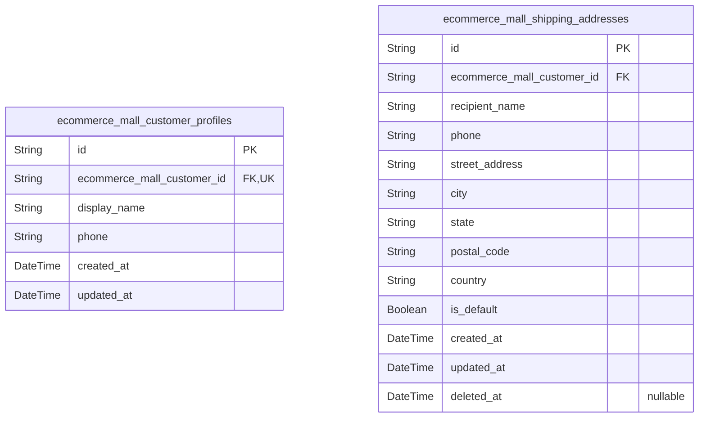

### `ecommerce_mall_customer_profiles`

Stores customer profile information including display name and phone
number. Each customer has exactly one profile linked via 1:1 relationship
with the customer account table. Profile data is editable by the customer
and deleted when the customer account is deleted.

Properties as follows:

- `id`: Primary Key.
- `ecommerce_mall_customer_id`: Reference to the owning customer's [ecommerce_mall_customers.id](#ecommerce_mall_customers).
- `display_name`
  > Customer's display name shown on the platform. Used for public-facing
  > identification.
- `phone`
  > Customer's contact phone number for order notifications and delivery
  > coordination.
- `created_at`: Timestamp when the profile was created.
- `updated_at`: Timestamp when the profile was last updated.

### `ecommerce_mall_shipping_addresses`

Stores multiple shipping addresses for customers with default address
designation for checkout convenience. Each address represents a delivery
destination where packages will be delivered after purchase. Customers
maintain multiple addresses for different delivery scenarios such as home
delivery, workplace delivery, or gifts to friends and family. The default
address is pre-selected during checkout for user convenience.
Soft-deleted addresses are preserved but hidden from selection. Belongs
to [ecommerce_mall_customers.id](#ecommerce_mall_customers).

Properties as follows:

- `id`: Primary Key.
- `ecommerce_mall_customer_id`
  > Belonged customer's [ecommerce_mall_customers.id](#ecommerce_mall_customers). Each address
  > must belong to exactly one customer.
- `recipient_name`: Recipient's full name for delivery. Required for shipping purposes.
- `phone`
  > Recipient's phone number for delivery coordination. Required for shipping
  > purposes.
- `street_address`
  > Street address including house/building number and street name. Required
  > for physical delivery.
- `city`: City name for the delivery address. Required for shipping routing.
- `state`
  > State or province name for the delivery address. Required for regional
  > shipping routing.
- `postal_code`
  > Postal code or ZIP code for delivery routing. Used by carriers for
  > accurate package routing.
- `country`
  > Country name for international shipping. Required for cross-border
  > delivery processing.
- `is_default`
  > Whether this is the customer's default shipping address. Only one address
  > can be default per customer. Pre-selected during checkout.
- `created_at`: Timestamp when the address was first added to the customer's account.
- `updated_at`: Timestamp when the address was last modified.
- `deleted_at`: Timestamp when the address was soft-deleted. Null if active.

## Sellers

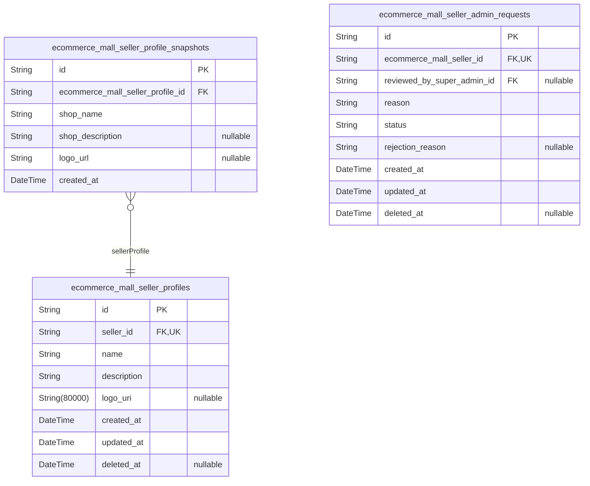

### `ecommerce_mall_seller_profiles`

Public shop profiles containing shop name, business description, and logo
image for sellers. One profile per seller, editable with automatic
snapshot creation on changes.

Each seller has exactly one shop profile that customers can view when
browsing products or visiting seller pages. The profile stores the
public-facing shop information including the shop name displayed in
product listings, a business description explaining the shop's background
and offerings, and a logo image for brand identification. All profile
edits are automatically captured as immutable snapshots in {@link
ecommerce_mall_seller_profile_snapshots} for historical tracking and
dispute resolution. Profiles support soft deletion for account cleanup
while preserving audit trails.

Properties as follows:

- `id`: Primary Key.
- `seller_id`
  > Belonged seller's [ecommerce_mall_sellers.id](#ecommerce_mall_sellers). Enforces one-to-one
  > relationship ensuring each seller has exactly one profile.
- `name`
  > Shop name displayed to customers in product listings and seller pages.
  > Should be a recognizable brand or store name.
- `description`
  > Business description of the shop explaining its background, specialties,
  > and offerings. Visible to customers on seller profile pages.
- `logo_uri`
  > URI reference to the shop's logo image stored in file storage. Displayed
  > on product listings and seller pages.
- `created_at`
  > Timestamp when the shop profile was created. Set automatically on record
  > creation.
- `updated_at`
  > Timestamp when the shop profile was last modified. Updated automatically
  > on any field change.
- `deleted_at`
  > Soft delete timestamp. When set, the profile is considered deleted but
  > data is preserved for historical records.

### `ecommerce_mall_seller_profile_snapshots`

Immutable point-in-time snapshots of seller shop profiles captured during
order creation and profile edits. Preserves shop name, description, and
logo state for historical reference and dispute resolution. Each snapshot
is created automatically when orders are placed or when sellers edit
their shop profile, providing an audit trail of how shop information
appeared at specific moments in time.

Properties as follows:

- `id`: Primary Key.
- `ecommerce_mall_seller_profile_id`
  > Reference to the parent seller profile this snapshot was created from.
  > [ecommerce_mall_seller_profiles.id](#ecommerce_mall_seller_profiles)
- `shop_name`: Shop name at the time of snapshot creation.
- `shop_description`: Shop business description at the time of snapshot creation.
- `logo_url`: Shop logo image URL at the time of snapshot creation.
- `created_at`: Timestamp when this snapshot was created.

### `ecommerce_mall_seller_admin_requests`

Tracks administrative privilege requests submitted by sellers. Each
seller can submit a request explaining their reason for wanting admin
access. Requests are reviewed by super administrators who can approve or
reject with reasons. Supports soft deletion for audit trail preservation.

Properties as follows:

- `id`: Primary Key.
- `ecommerce_mall_seller_id`
  > The seller who submitted this admin privilege request. {@link
  > ecommerce_mall_sellers.id}
- `reviewed_by_super_admin_id`
  > The super administrator who reviewed this request. Null until reviewed.
  > [ecommerce_mall_super_admins.id](#ecommerce_mall_super_admins)
- `reason`
  > The reason text provided by the seller explaining why they want
  > administrative privileges.
- `status`
  > Current status of the admin request. Values: 'pending', 'approved',
  > 'rejected'.
- `rejection_reason`
  > Reason provided by super administrator when rejecting the request. Only
  > populated when status is 'rejected'.
- `created_at`: Timestamp when the request was submitted.
- `updated_at`: Timestamp when the request was last modified.
- `deleted_at`: Timestamp for soft deletion. Null if not deleted.

## Categories

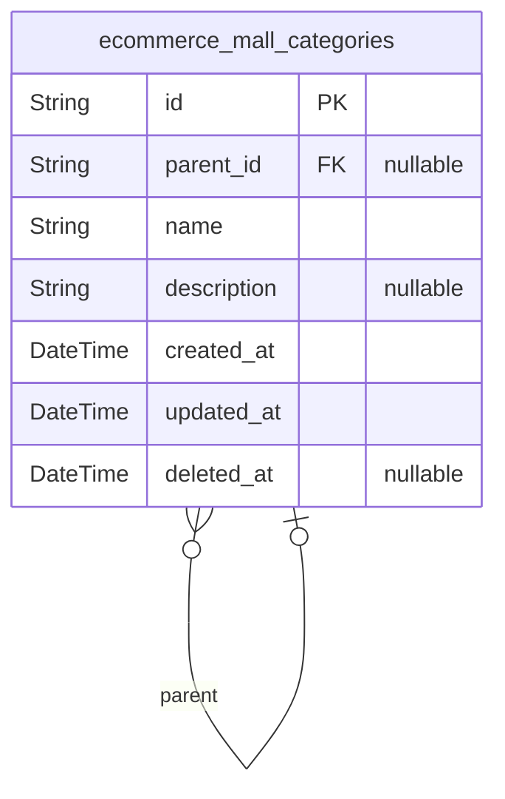

### `ecommerce_mall_categories`

Product category taxonomy with hierarchical structure supporting one
level of parent-child nesting. Categories are created and managed by
administrators only. Each category can have an optional parent category
to create subcategories (one level deep). Products belonging to deleted
categories become uncategorized. Soft delete preserves category data
while hiding from listings.

Properties as follows:

- `id`: Primary Key.
- `parent_id`
  > Reference to parent category for hierarchical taxonomy. Null for
  > top-level categories. [ecommerce_mall_categories.id](#ecommerce_mall_categories).
- `name`
  > Category name displayed to users. Must be unique within the same parent
  > scope.
- `description`
  > Optional category description providing additional context about the
  > category.
- `created_at`: Timestamp when the category was created.
- `updated_at`: Timestamp when the category was last modified.
- `deleted_at`
  > Soft delete timestamp. Null when active, set when deleted. Deleted
  > categories are hidden but products remain with null category reference.

## Products

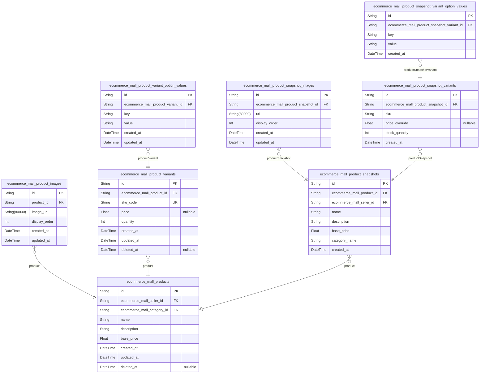

### `ecommerce_mall_products`

Main product listings owned by sellers with category assignment, base
price, and soft delete support.

Each product represents a sale item created by a seller. Products belong
to exactly one category and have a base price that serves as the default
price for variants. Sellers can edit products, which creates immutable
snapshots in the ProductSnapshot table for audit trail and dispute
resolution.

Products are soft-deleted (hidden from search/listings) when sellers
delete them, but order history preserves the product information through
snapshots. Products without any variants are visible in search but shown
as unavailable.

Properties as follows:

- `id`: Primary Key.
- `ecommerce_mall_seller_id`: Owning seller's [ecommerce_mall_sellers.id](#ecommerce_mall_sellers).
- `ecommerce_mall_category_id`
  > Assigned category's [ecommerce_mall_categories.id](#ecommerce_mall_categories). Products become
  > uncategorized when category is deleted.
- `name`: Product name displayed in listings and search results.
- `description`: Detailed product description shown on product detail page.
- `base_price`: Default price used when variants do not override pricing.
- `created_at`: Timestamp when the product was created.
- `updated_at`: Timestamp when the product was last updated.
- `deleted_at`: Soft delete timestamp. Null when active, set when seller deletes product.

### `ecommerce_mall_product_images`

Product image gallery supporting multiple images per product with display
order for carousel/thumbnail functionality. Images are reorderable by
sellers and automatically included in product snapshots to preserve
historical product state.

Properties as follows:

- `id`: Primary Key.
- `product_id`: Associated product's [ecommerce_mall_products.id](#ecommerce_mall_products).
- `image_url`: URL of the product image file stored in file storage.
- `display_order`
  > Sort order index for image display in product gallery. Lower values
  > appear first. First image (order=0) is used as main thumbnail.
- `created_at`: Timestamp when the image was added to the product.
- `updated_at`: Timestamp when the image was last updated or reordered.

### `ecommerce_mall_product_variants`

Product variants (SKUs) representing specific option combinations for
products. Each variant has a unique SKU code, optional price override
from base price, and current stock quantity. Variants belong to exactly
one product and are the purchasable units in orders. Stock is tracked via
inventory records, and all edits create immutable snapshots for audit
purposes.

Properties as follows:

- `id`: Primary Key.
- `ecommerce_mall_product_id`
  > Belonged product's [ecommerce_mall_products.id](#ecommerce_mall_products). Each variant must
  > belong to exactly one product.
- `sku_code`
  > Unique SKU (Stock Keeping Unit) code identifying this variant across the
  > platform. Used in order items for display and inventory tracking. Must be
  > unique globally.
- `price`
  > Optional price override for this variant. When null, the product's base
  > price applies. Allows variants with different prices (e.g., larger size
  > costs more).
- `quantity`
  > Current available stock quantity for this variant. Represents the
  > calculated stock from all inventory records. Starts at 0 when variant is
  > created.
- `created_at`: Timestamp when the variant was created.
- `updated_at`: Timestamp when the variant was last updated.
- `deleted_at`
  > Timestamp for soft deletion. Null when active, set when seller deletes
  > the variant.

### `ecommerce_mall_product_snapshots`

Immutable point-in-time snapshots of product state captured during
product edits and order placements. Each snapshot preserves the complete
product data including name, description, base price, category name, and
references to seller. Snapshots are created automatically whenever a
seller edits their product and serve as authoritative historical records
for dispute resolution. Once created, snapshots cannot be modified or
deleted.

Properties as follows:

- `id`: Primary Key.
- `ecommerce_mall_product_id`
  > Reference to the product being snapshotted. {@link
  > ecommerce_mall_products.id}
- `ecommerce_mall_seller_id`
  > Reference to the seller who owns this product snapshot. {@link
  > ecommerce_mall_sellers.id}
- `name`: Product name as it appeared at the time of snapshot creation.
- `description`: Product description as it appeared at the time of snapshot creation.
- `base_price`: Base price of the product as it appeared at the time of snapshot creation.
- `category_name`: Category name the product belonged to at the time of snapshot creation.
- `created_at`: Timestamp when this snapshot was created.

### `ecommerce_mall_product_variant_option_values`

Normalized table storing individual option key-value pairs for product
variants. Each row represents one option (e.g., color=Red, size=Large).
This table replaces the JSON option_values field from the parent
product_variants table to comply with First Normal Form (1NF)
requirements. Every product variant can have multiple options, and each
option key must be unique per variant.

Properties as follows:

- `id`: Primary Key.
- `ecommerce_mall_product_variant_id`: Belonged product variant's [ecommerce_mall_product_variants.id](#ecommerce_mall_product_variants).
- `key`: Option key name such as 'color', 'size', or any attribute identifier.
- `value`: Option value such as 'Red', 'Large', or corresponding attribute value.
- `created_at`: Timestamp when this option was created.
- `updated_at`: Timestamp when this option was last updated.

### `ecommerce_mall_product_snapshot_images`

Individual product snapshot image records storing URL and display order
for each image in a product snapshot. Decomposed from JSON array to
comply with 1NF. Each image belongs to exactly one product snapshot and
cannot exist independently.

Properties as follows:

- `id`: Primary Key.
- `ecommerce_mall_product_snapshot_id`: Belonged product snapshot's [ecommerce_mall_product_snapshots.id](#ecommerce_mall_product_snapshots).
- `url`: URL of the image in the product snapshot.
- `display_order`: Display order of the image for sorting. Lower values appear first.
- `created_at`: Timestamp when the image record was created.
- `updated_at`: Timestamp when the image record was last updated.

### `ecommerce_mall_product_snapshot_variants`

Individual product snapshot variant records storing SKU, option key-value
pairs, price override, and stock quantity for each variant in a product
snapshot. Decomposed from JSON array to comply with 1NF.

This table captures the immutable state of a product variant at the time
a product snapshot is created. Each record represents one variant option
(e.g., color=red, size=large) with its SKU code, price override, and
stock quantity at snapshot time. Option key-value pairs are stored in the
related ecommerce_mall_product_snapshot_variant_option_values table.

This table is always accessed through its parent product_snapshot and
cannot exist independently.

Properties as follows:

- `id`: Primary Key.
- `ecommerce_mall_product_snapshot_id`
  > Parent product snapshot that captured this variant state. {@link
  > ecommerce_mall_product_snapshots.id}.
- `sku`: Unique SKU code of the product variant at snapshot time.
- `price_override`: Variant-specific price override. Null if using product base price.
- `stock_quantity`: Stock quantity of the variant at snapshot time.
- `created_at`: Timestamp when this variant snapshot was created.

### `ecommerce_mall_product_snapshot_variant_option_values`

Individual option key-value pairs for product snapshot variants. Each row
stores one option attribute (e.g., color=Red, size=Large). Decomposed
from JSON array to comply with 1NF normalization. Part of the product
snapshot system that preserves variant option state at purchase/edit time
for dispute resolution.

Properties as follows:

- `id`: Primary Key.
- `ecommerce_mall_product_snapshot_variant_id`
  > Belonged product snapshot variant's {@link
  > ecommerce_mall_product_snapshot_variants.id}.
- `key`: Option name identifying the attribute type such as color, size, or style.
- `value`: Option value for the specified attribute such as Red, Large, or Cotton.
- `created_at`: Timestamp when this option value was captured in the snapshot.

## Inventory

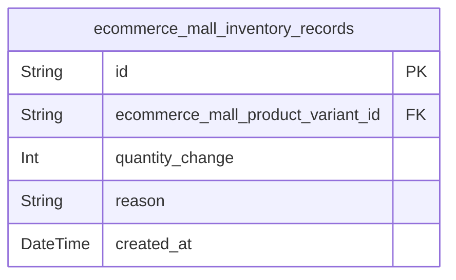

### `ecommerce_mall_inventory_records`

Immutable inventory records tracking all stock changes for product
variants including restocking, order deductions, adjustments,
cancellations, and refunds. Each record captures quantity change
(positive for restocking, negative for consumption), the business reason,
and timestamp. Current stock is derived from sum of all records for a
variant. Records are never updated or deleted to maintain complete audit
trail.

Properties as follows:

- `id`: Primary Key.
- `ecommerce_mall_product_variant_id`
  > The product variant this inventory record applies to. {@link
  > ecommerce_mall_product_variants.id}.
- `quantity_change`
  > Stock quantity change value. Positive values indicate restocking or
  > refunds, negative values indicate order deductions, cancellations, or
  > adjustments.
- `reason`
  > Business reason for the inventory change such as 'restock',
  > 'order_placement', 'order_cancellation', 'refund', or 'adjustment'.
- `created_at`: Timestamp when the inventory change occurred.

## Carts

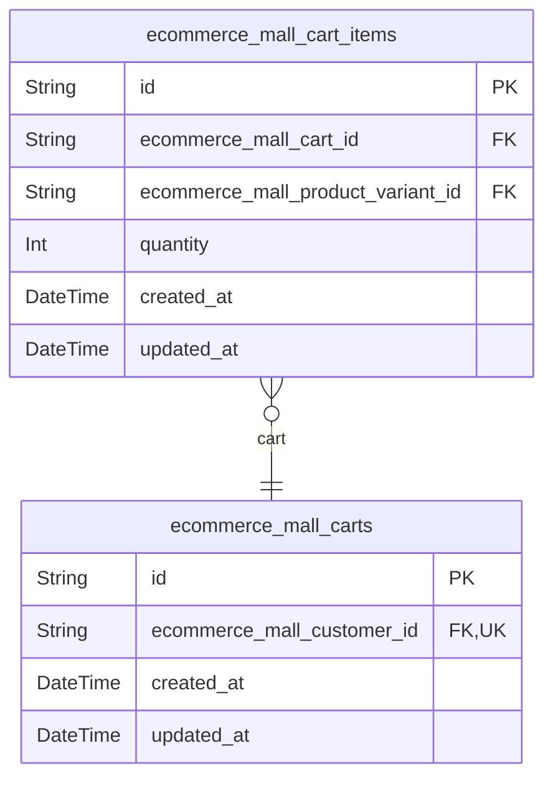

### `ecommerce_mall_carts`

Shopping carts belonging to customers. Each customer has exactly one cart
enforced by unique constraint on customer_id. Cart items are stored
separately in ecommerce_mall_cart_items table. Carts are created when a
customer adds their first item and are cleared upon successful checkout.

Properties as follows:

- `id`: Primary Key.
- `ecommerce_mall_customer_id`
  > Owner customer who owns this shopping cart. {@link
  > ecommerce_mall_customers.id}.
- `created_at`: Timestamp when the cart was created.
- `updated_at`: Timestamp when the cart was last modified.

### `ecommerce_mall_cart_items`

Individual line items within a customer's shopping cart, each
representing a specific product variant and quantity. The same variant
can only appear once per cart - adding the same variant again increases
quantity instead of creating a new line item. Price is derived from the
referenced variant at display or checkout time.

Properties as follows:

- `id`: Primary Key.
- `ecommerce_mall_cart_id`: The shopping cart this item belongs to. [ecommerce_mall_carts.id](#ecommerce_mall_carts).
- `ecommerce_mall_product_variant_id`
  > The specific product variant added to cart. {@link
  > ecommerce_mall_product_variants.id}.
- `quantity`
  > Number of units of this variant in the cart. When user adds same variant
  > again, quantity increases instead of creating new line item.
- `created_at`: Timestamp when the item was added to the cart.
- `updated_at`: Timestamp when the item quantity was last modified.

## Wishlists

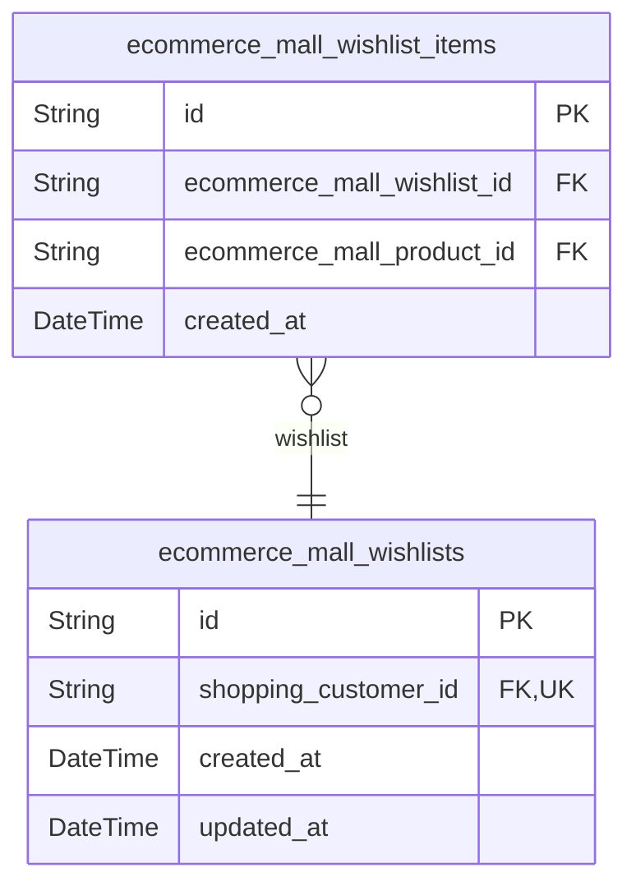

### `ecommerce_mall_wishlists`

Customer wishlist entity representing the collection of product bookmarks
for each customer. Each customer has exactly one wishlist created at
registration time. The wishlist serves as a container for wishlist items
that link customers to products they want to save for later purchase.
[ecommerce_mall_wishlist_items](#ecommerce_mall_wishlist_items) stores individual product links
while this table represents the customer's wishlist collection.

Properties as follows:

- `id`: Primary Key.
- `shopping_customer_id`: Owner customer who owns this wishlist. [ecommerce_mall_customers.id](#ecommerce_mall_customers)
- `created_at`: Timestamp when the wishlist was created.
- `updated_at`: Timestamp when the wishlist was last modified.

### `ecommerce_mall_wishlist_items`

Individual wishlist items linking customers to products they want to save
for future purchase. Each item represents a product bookmark within a
customer's wishlist. Products can only appear once per wishlist, enforced
by unique constraint. Items are automatically removed when the linked
product is deleted by the seller.

Properties as follows:

- `id`: Primary Key.
- `ecommerce_mall_wishlist_id`
  > Reference to the parent wishlist this item belongs to. {@link
  > ecommerce_mall_wishlists.id}
- `ecommerce_mall_product_id`
  > Reference to the product this item bookmarks. {@link
  > ecommerce_mall_products.id}
- `created_at`: Timestamp when the item was added to the wishlist.

## Orders

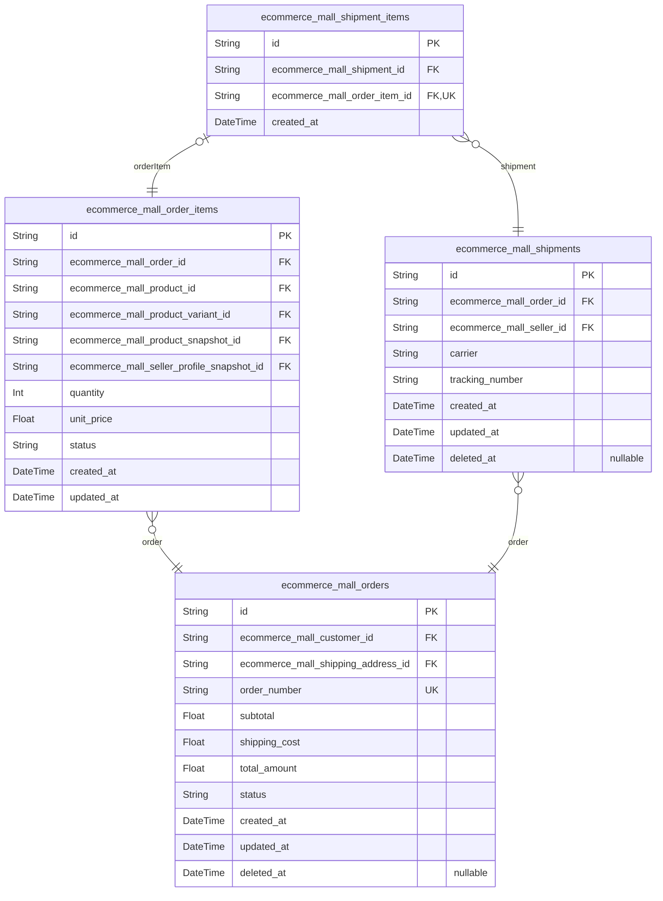

### `ecommerce_mall_orders`

Main order records capturing completed purchase transactions with unique
order numbers, customer reference, shipping address, and computed totals.

This table stores the primary order entity representing customer
purchases. Each order belongs to exactly one customer and references a
specific shipping address for delivery. Orders contain multiple order
items capturing the purchased products at their prices at time of
purchase.

Order status is derived from item statuses: 'paid' (all items paid),
'shipped' (any item shipped), 'delivered' (all items delivered),
'cancelled' (all items cancelled), 'refunded' (all items refunded), or
'partially_completed' (mixed states).

Relationships:
- Belongs to [ecommerce_mall_customers](#ecommerce_mall_customers) via customer_id
- References [ecommerce_mall_shipping_addresses](#ecommerce_mall_shipping_addresses) for delivery
destination
- Has many [ecommerce_mall_order_items](#ecommerce_mall_order_items) representing purchased
products
- Order items reference [ecommerce_mall_product_snapshots](#ecommerce_mall_product_snapshots) and
[ecommerce_mall_seller_profile_snapshots](#ecommerce_mall_seller_profile_snapshots) for historical data

Soft delete via deleted_at preserves order history for legal compliance
and seller records.

Properties as follows:

- `id`: Primary Key.
- `ecommerce_mall_customer_id`
  > Reference to the customer who placed this order. {@link
  > ecommerce_mall_customers.id}.
- `ecommerce_mall_shipping_address_id`
  > Reference to the shipping address for this order. {@link
  > ecommerce_mall_shipping_addresses.id}. Locked at order placement time.
- `order_number`
  > Unique order number for customer reference. Generated at order creation
  > time.
- `subtotal`
  > Sum of all order item prices before shipping costs. Calculated at
  > checkout.
- `shipping_cost`: Total shipping fee for this order. Zero if free shipping applies.
- `total_amount`
  > Final order total including subtotal and shipping. subtotal +
  > shipping_cost.
- `status`
  > Computed order status derived from order items: 'paid', 'shipped',
  > 'delivered', 'cancelled', 'refunded', or 'partially_completed'.
- `created_at`: Timestamp when the order was created (payment completed).
- `updated_at`: Timestamp when the order was last modified.
- `deleted_at`
  > Soft delete timestamp. Null when active, set when order is cancelled or
  > archived.

### `ecommerce_mall_order_items`

Individual line items within an order capturing purchased product variant
at transaction time. Each order item preserves the product state (name,
description, variant options, price) via product snapshots and seller
profile state via seller profile snapshots. Item-level status enables
partial order handling where individual items can be cancelled, refunded,
or shipped independently while maintaining order integrity. The quantity
and unit price are frozen at purchase time for dispute resolution.

Properties as follows:

- `id`: Primary Key.
- `ecommerce_mall_order_id`: Parent order this item belongs to. [ecommerce_mall_orders.id](#ecommerce_mall_orders)
- `ecommerce_mall_product_id`: Product purchased in this order item. [ecommerce_mall_products.id](#ecommerce_mall_products)
- `ecommerce_mall_product_variant_id`
  > Specific product variant (SKU) purchased. {@link
  > ecommerce_mall_product_variants.id}
- `ecommerce_mall_product_snapshot_id`
  > Frozen product state at purchase time for dispute resolution. {@link
  > ecommerce_mall_product_snapshots.id}
- `ecommerce_mall_seller_profile_snapshot_id`
  > Frozen seller profile state at purchase time for dispute resolution.
  > [ecommerce_mall_seller_profile_snapshots.id](#ecommerce_mall_seller_profile_snapshots)
- `quantity`: Quantity of the product variant purchased.
- `unit_price`
  > Unit price of the product variant at the time of purchase. Frozen at
  > transaction time.
- `status`
  > Current status of this order item. Valid values: paid (payment completed,
  > waiting to ship), shipped (item has been shipped), delivered (item
  > delivered to customer), cancelled (item cancelled by seller), refunded
  > (item refunded to customer).
- `created_at`: Timestamp when this order item was created.
- `updated_at`: Timestamp when this order item was last updated.

### `ecommerce_mall_shipments`

Seller-bundled shipments containing one or more order items from the same
seller, with tracking information for delivery tracking. Each shipment is
created by a seller for their order items within a single order. Sellers
can ship items individually or bundle multiple items together. Tracking
information includes carrier name and tracking number for customer
delivery tracking.

Properties as follows:

- `id`: Primary Key.
- `ecommerce_mall_order_id`
  > Reference to the parent order this shipment belongs to. {@link
  > ecommerce_mall_orders.id}
- `ecommerce_mall_seller_id`
  > Reference to the seller who created and owns this shipment. {@link
  > ecommerce_mall_sellers.id}
- `carrier`: Name of the shipping carrier (e.g., DHL, FedEx, UPS, USPS).
- `tracking_number`: Tracking number provided by the carrier for shipment tracking.
- `created_at`: Timestamp when the shipment was created.
- `updated_at`: Timestamp when the shipment was last updated.
- `deleted_at`: Timestamp for soft deletion. Null when not deleted.

### `ecommerce_mall_shipment_items`

Junction table establishing the many-to-many relationship between
shipments and order items. Each shipment bundles one or more order items
from the same seller, and each order item can belong to at most one
shipment once shipped. This table enforces referential integrity and
enables querying which items are included in each shipment package.

Properties as follows:

- `id`: Primary Key.
- `ecommerce_mall_shipment_id`
  > Reference to the shipment this item belongs to. {@link
  > ecommerce_mall_shipments.id}.
- `ecommerce_mall_order_item_id`
  > Reference to the order item included in this shipment. {@link
  > ecommerce_mall_order_items.id}. Each order item can only belong to one
  > shipment.
- `created_at`: Timestamp when the order item was added to the shipment.

## Requests

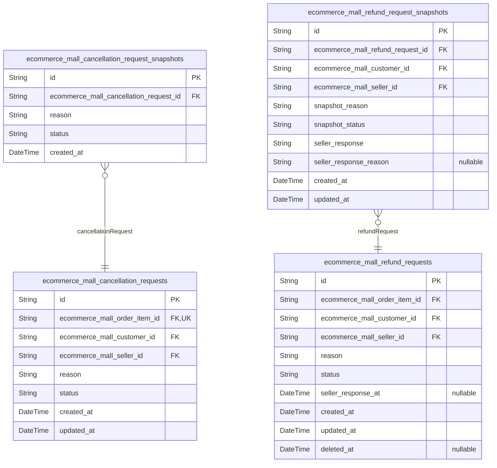

### `ecommerce_mall_cancellation_requests`

Customer-initiated requests to cancel order items with 'paid' status.
Contains reason text for cancellation and seller approval workflow. When
seller approves, item is cancelled and refund processed. Immutable audit
trail preserved via snapshots.

Properties as follows:

- `id`: Primary Key.
- `ecommerce_mall_order_item_id`
  > Order item being requested for cancellation. {@link
  > ecommerce_mall_order_items.id}
- `ecommerce_mall_customer_id`
  > Customer who initiated the cancellation request. {@link
  > ecommerce_mall_customers.id}
- `ecommerce_mall_seller_id`
  > Seller who owns the order item and will approve/reject the cancellation
  > request. [ecommerce_mall_sellers.id](#ecommerce_mall_sellers)
- `reason`: Text reason provided by customer for requesting cancellation.
- `status`
  > Current status of the cancellation request. Values: 'pending',
  > 'approved', 'rejected'.
- `created_at`: Timestamp when the cancellation request was created.
- `updated_at`: Timestamp when the cancellation request was last updated.

### `ecommerce_mall_refund_requests`

Customer-initiated refund requests for delivered order items within 7
days of delivery, containing reason text and seller approval workflow.
Each request belongs to an order item, the requesting customer, and the
seller. Sellers can approve or reject requests with responses captured in
snapshots for audit trail.

Properties as follows:

- `id`: Primary Key.
- `ecommerce_mall_order_item_id`
  > The order item being requested for refund. {@link
  > ecommerce_mall_order_items.id}
- `ecommerce_mall_customer_id`
  > The customer who initiated the refund request. {@link
  > ecommerce_mall_customers.id}
- `ecommerce_mall_seller_id`
  > The seller who owns the product and will respond to the refund request.
  > [ecommerce_mall_sellers.id](#ecommerce_mall_sellers)
- `reason`: Customer-provided reason for the refund request.
- `status`: Current status of the refund request. Values: pending, approved, rejected.
- `seller_response_at`: Timestamp when the seller approved or rejected the refund request.
- `created_at`: Timestamp when the refund request was created.
- `updated_at`: Timestamp when the refund request was last updated.
- `deleted_at`: Timestamp for soft deletion. Null when not deleted.

### `ecommerce_mall_cancellation_request_snapshots`

Immutable snapshots of cancellation request state captured when seller
approves or rejects, preserving reason and status for audit and dispute
resolution.

Each snapshot is created automatically when a seller responds to a
cancellation request, capturing the reason text and response status at
that moment. These records are immutable and cannot be modified or
deleted, serving as permanent audit trail for order dispute resolution.

Properties as follows:

- `id`: Primary Key.
- `ecommerce_mall_cancellation_request_id`
  > The cancellation request this snapshot preserves. {@link
  > ecommerce_mall_cancellation_requests.id}.
- `reason`
  > Reason text from the original cancellation request captured at snapshot
  > time.
- `status`
  > Status of the cancellation request at snapshot time. Values: 'approved',
  > 'rejected'.
- `created_at`: Timestamp when this snapshot was created (when seller responded).

### `ecommerce_mall_refund_request_snapshots`

Immutable snapshots of refund request state captured when seller approves
or rejects, preserving reason and status for audit and dispute
resolution.

Each snapshot records the complete state of a refund request at the
moment of seller response. This includes the reason text submitted by the
customer, the status of the refund request at snapshot time, and the
seller's response decision with optional rejection reason. These
snapshots cannot be modified or deleted and serve as the authoritative
audit trail for all refund request disputes.

Properties as follows:

- `id`: Primary Key.
- `ecommerce_mall_refund_request_id`
  > Reference to the original refund request this snapshot captures. {@link
  > ecommerce_mall_refund_requests.id}
- `ecommerce_mall_customer_id`
  > Reference to the customer who initiated the refund request. {@link
  > ecommerce_mall_customers.id}
- `ecommerce_mall_seller_id`
  > Reference to the seller who responded to the refund request. {@link
  > ecommerce_mall_sellers.id}
- `snapshot_reason`
  > The reason text submitted by the customer for the refund request at the
  > time of snapshot creation.
- `snapshot_status`
  > The status of the refund request at the time of snapshot creation (e.g.,
  > pending, approved, rejected).
- `seller_response`: The seller's response decision: approved or rejected.
- `seller_response_reason`: Optional reason provided by the seller when rejecting the refund request.
- `created_at`
  > Timestamp when the snapshot was created, marking when the seller
  > responded.
- `updated_at`: Timestamp when the snapshot was last updated.

## Reviews

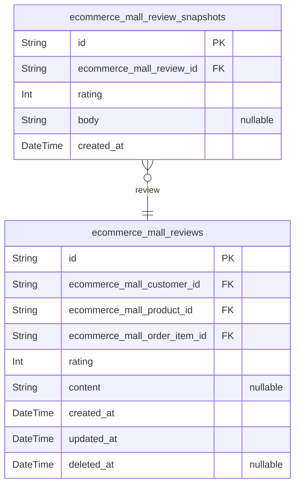

### `ecommerce_mall_reviews`

Customer reviews for products with star ratings. Each review links to the
customer who wrote it, the product being reviewed, and the order item
that verifies the purchase. Soft-deleted reviews are hidden from display
but preserved with snapshots for audit trail. Customers can only review
products they have purchased and received.

Properties as follows:

- `id`: Primary Key.
- `ecommerce_mall_customer_id`: Customer who wrote the review. [ecommerce_mall_customers.id](#ecommerce_mall_customers)
- `ecommerce_mall_product_id`: Product being reviewed. [ecommerce_mall_products.id](#ecommerce_mall_products)
- `ecommerce_mall_order_item_id`
  > Order item that verifies this purchase. Only delivered items can be
  > reviewed. [ecommerce_mall_order_items.id](#ecommerce_mall_order_items)
- `rating`: Star rating from 1 to 5. Required field for all reviews.
- `content`
  > Optional text content of the review. Customers can write detailed
  > feedback about the product.
- `created_at`: Timestamp when the review was created.
- `updated_at`: Timestamp when the review was last updated.
- `deleted_at`
  > Soft delete timestamp. Null means active, non-null means deleted and
  > hidden from display.

### `ecommerce_mall_review_snapshots`

Immutable historical snapshots of review edits capturing previous rating
and text content for dispute resolution.

Stores point-in-time records of review modifications including the rating
value and text content before each edit. These snapshots are created
automatically when customers edit their reviews, providing an immutable
audit trail for dispute resolution. Each snapshot belongs to exactly one
review via foreign key reference. Snapshots cannot be deleted and are
retained indefinitely per the platform's data retention policy.

Properties as follows:

- `id`: Primary Key.
- `ecommerce_mall_review_id`
  > Reference to the parent review this snapshot captures. {@link
  > ecommerce_mall_reviews.id}.
- `rating`: Star rating value (1-5) of the review before this edit was made.
- `body`
  > Text content of the review before this edit was made. Null for reviews
  > that had no text content.
- `created_at`
  > Timestamp when this snapshot was created, representing when the review
  > edit occurred.

## Admins

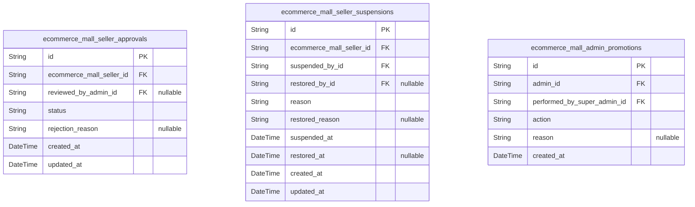

### `ecommerce_mall_seller_approvals`

Tracks the approval or rejection workflow for seller registration
requests by administrators. When a seller submits registration, an
approval record is created with pending status. Administrators review and
either approve or reject with optional reason. Sellers can resubmit after
rejection, creating new approval records.

Properties as follows:

- `id`: Primary Key.
- `ecommerce_mall_seller_id`
  > The seller registration request being reviewed. {@link
  > ecommerce_mall_sellers.id}
- `reviewed_by_admin_id`
  > The administrator who reviewed this approval request. {@link
  > ecommerce_mall_admins.id}
- `status`: Current approval status: 'pending', 'approved', or 'rejected'.
- `rejection_reason`
  > Reason for rejection provided by the reviewing administrator when status
  > is 'rejected'.
- `created_at`: Timestamp when the approval request was created.
- `updated_at`: Timestamp when the approval status was last updated.

### `ecommerce_mall_seller_suspensions`

Immutable audit trail recording seller account suspensions and
restorations by administrators. Each record captures the suspension
reason, timestamp, and optionally the restoration details. Active
suspensions are identified by NULL restored_at, while restored
suspensions indicate when and by whom the account was reactivated.

Properties as follows:

- `id`: Primary Key.
- `ecommerce_mall_seller_id`: Suspended seller's [ecommerce_mall_sellers.id](#ecommerce_mall_sellers).
- `suspended_by_id`: Administrator who suspended the seller [ecommerce_mall_admins.id](#ecommerce_mall_admins).
- `restored_by_id`
  > Administrator who restored the seller account {@link
  > ecommerce_mall_admins.id}. NULL if seller is still suspended.
- `reason`: Reason for suspension provided by the administrator.
- `restored_reason`: Optional reason for restoring the seller account.
- `suspended_at`: Timestamp when the seller account was suspended.
- `restored_at`
  > Timestamp when the seller account was restored. NULL indicates the seller
  > is still suspended.
- `created_at`: Record creation timestamp.
- `updated_at`: Record last update timestamp.

### `ecommerce_mall_admin_promotions`

Immutable audit log tracking promotions of administrators to super
administrator and demotions to regular administrator by super
administrators. This table follows the snapshot principle - records are
append-only and cannot be modified or deleted. Each record captures who
was affected, who performed the action, what action was taken, and any
associated reason.

Properties as follows:

- `id`: Primary Key.
- `admin_id`
  > The administrator who was promoted or demoted. {@link
  > ecommerce_mall_admins.id}
- `performed_by_super_admin_id`
  > The super administrator who performed the promotion or demotion action.
  > [ecommerce_mall_super_admins.id](#ecommerce_mall_super_admins)
- `action`
  > The type of role change action performed. Values: 'promotion' (admin
  > promoted to super admin) or 'demotion' (super admin demoted to regular
  > admin).
- `reason`
  > Optional reason provided by the super administrator for the promotion or
  > demotion action.
- `created_at`: Timestamp when the promotion or demotion action was performed.
