**ecommerceMall — Business concepts, relationships, and states from user perspective**

Business concepts, relationships, and states from user perspective

# Domain Concepts

Describe what each concept means in the business domain and its key attributes.

## Customer Concept

Customer is the primary buyer actor in the e-commerce platform who must register and authenticate before accessing any shopping features. Each customer account is uniquely identified by an email address, which serves as the login credential alongside a password. Customer accounts are designed to be persistent even after account deletion requests, preserving order history for business records and legal compliance. When a customer initiates account deletion, their personal profile information is removed while their order records remain intact for seller reference. Reviews written by deleted customers are preserved in the system but displayed with an anonymized "deleted user" label instead of the original author name.

### Customer Definition

The Customer is the primary buyer actor in the e-commerce platform. All shopping features on the platform require the user to be a registered customer. The platform does not support guest browsing or purchasing. A customer accesses the platform by signing up with their email address and creating a password. Once registered, customers can browse products, manage their profile, maintain shipping addresses, add items to wishlists and shopping carts, place orders, and write reviews.

### Customer Authentication

Customers identify themselves on the platform using their email address. The email address must be unique across all customer accounts on the platform. Each customer creates a password during registration, which is stored securely and used for subsequent logins. Both email and password are required to authenticate into the platform.

### Customer Account Persistence

Customer accounts are designed to persist indefinitely once created. The platform preserves order history and related records for seller business needs and legal compliance purposes. When a customer deletes their account, the system removes their personal information while retaining transactional data. This ensures sellers can reference order records and customers maintain a documented purchase history even after account closure.

### Profile Deletion Behavior

When a customer initiates account deletion, the system performs a selective data removal. The customer's profile information, including their display name and phone number, is permanently deleted. Shipping addresses associated with the account are also removed. However, the customer's orders and order history remain in the system. Reviews written by the customer are anonymized but displayed with a "deleted user" label instead of the original author information. This approach protects the customer's privacy while maintaining the integrity of historical business records.

### Order History Preservation

Order records created by a customer are preserved indefinitely after account deletion. The platform maintains these records so sellers can reference order details for fulfillment, dispute resolution, and business analytics. Customers who later delete their accounts can no longer access their order history, but the data remains available to the sellers who fulfilled those orders.

### Review Anonymization After Deletion

Product reviews authored by a customer remain visible on the platform after the customer deletes their account. However, the review authorship is anonymized. Instead of displaying the customer's display name, the review shows a "deleted user" label. This ensures other customers can still benefit from review content while respecting the deleted customer's privacy preference.

## CustomerProfile Concept

CustomerProfile extends the basic Customer account with personal information used for communication and identification purposes during transactions. The profile contains a display name that represents how the customer appears to others, particularly when writing reviews for products. The profile also stores a phone number that may be used for shipping coordination or order-related communications. Display names are limited in length to ensure proper display across the platform interface. Phone numbers are optional and can be updated as the customer's contact information changes over time.

### CustomerProfile Definition

The CustomerProfile extends the basic customer account with personal information used for communication and identification purposes during transactions. While the customer account handles authentication and security, the profile holds the personal details that represent the buyer identity information visible to sellers and other users of the platform. This separation ensures that authentication credentials remain distinct from personal information that may be shared during business interactions.

The profile serves as the buyer's public-facing identity when writing reviews, communicating with sellers, or providing shipping coordination details. It captures the human element of the e-commerce transaction, allowing customers to present themselves with a chosen identity rather than just an email address.

### Display Name Attribute

Every customer profile includes a display name that represents how the customer appears to others on the platform. This display name is shown when the customer writes product reviews, making it the identity that sellers and other shoppers see.

The display name attribute is a required field that must be provided when creating or updating a profile. This ensures that every customer has a recognizable identity for their interactions on the platform.

### Display Name Length Constraints

The display name has a length constraint to ensure proper display across the platform interface and reasonable readability. The display name must be between 1 and 100 characters long. This range accommodates most common names while preventing excessively long entries that could disrupt layout consistency.

### Contact Phone Number

The customer profile includes a contact phone number that serves as an optional contact field for order-related communications. This phone number may be used by sellers for shipping coordination, delivery confirmation, or addressing issues with orders.

The phone number is optional, meaning customers can choose whether to provide this information. This respects customer privacy while providing a channel for important order communications when the customer decides to share it.

### Phone Number Format

The phone number field accepts text input between 10 and 20 characters in length. This range accommodates various international phone number formats while ensuring the field is not left empty or excessively long.

### Profile Update Capability

The CustomerProfile is designed to be updated as the customer's personal information changes over time. Customers have the capability to modify both their display name and phone number to reflect their current information.

The profile update capability allows customers to correct typos in their display name, change their name after life events, update their phone number when changing carriers, or remove their phone number if they no longer wish to provide it. These updates do not affect the customer's account authentication or order history.

### Relationship to Customer Account

The CustomerProfile belongs to exactly one customer account, forming a one-to-one relationship. A customer account cannot exist without a corresponding profile, and each profile is tied to its owner's account. This tight coupling ensures that personal information is always associated with the correct account holder.

The profile does not have an independent lifecycle separate from its customer account. When a customer deletes their account, the profile information is deleted as part of that process. Order history and reviews are retained and displayed with an anonymous "deleted user" label, preserving them for historical reference while removing personal identification.

## ShippingAddress Concept

ShippingAddress represents a delivery destination where orders can be shipped, allowing customers to maintain multiple locations for flexibility. Each address contains a recipient name identifying who should receive the package, along with a contact phone number for delivery coordination. The street address field captures the detailed location information including building number, street name, and apartment or suite details. Geographic information is captured through separate city, state or province, postal code, and country fields to ensure accurate routing and delivery. Customers can designate one address as their default shipping destination for faster checkout. All address fields except country are required to ensure complete delivery information.

### Delivery Destination Role

A shipping address represents a delivery destination where orders can be shipped. Each address serves as a physical location where packages will be delivered after purchase. Customers maintain multiple addresses to support different delivery scenarios such as home delivery, workplace delivery, or gifts to friends and family. When placing an order, customers select from their stored addresses or add a new one. The selected address determines where the seller's shipment will be routed and delivered.

### Recipient Identification

Every shipping address includes a recipient name that identifies the person who should receive the package at that location. The recipient name appears on shipping labels and is used by delivery personnel to verify the correct person receives the package. This field helps distinguish between addresses that may be shared, such as apartments or office buildings, where multiple people may receive deliveries at the same location.

### Delivery Contact Phone

Shipping addresses include a phone number that delivery services can use to contact the recipient during delivery. This contact phone number enables delivery personnel to coordinate delivery timing, confirm location details, or notify the recipient when a package arrives. The phone number is essential for successful delivery, especially when the delivery location may be difficult to find or when the recipient needs to be available to receive the package.

### Street Address Details

The street address field captures the detailed physical location where delivery should occur. This includes the building number, street name, and any additional details such as apartment numbers, suite numbers, floor information, or building names. This detailed address information ensures delivery personnel can locate the exact delivery point. The street address must be specific enough to distinguish it from neighboring locations on the same street.

### Geographic Location Fields

Shipping addresses include separate fields for city, state or province, postal code, and country. These geographic location fields work together to route the package through delivery networks from the seller to the final destination. The country field identifies the nation for international shipments, while the state or province narrows the delivery region. The city identifies the municipality, and together these fields enable accurate sorting and routing through delivery service networks.

### Default Address Selection

Customers can designate one of their shipping addresses as the default destination for orders. The default address is automatically pre-selected during checkout, allowing customers to complete purchases faster without manually selecting their preferred delivery location. Customers can change the default address at any time, and the new default will apply to subsequent orders. Only one address can be the default at any given time.

### Multiple Address Storage

Customers can store multiple shipping addresses in their account for different purposes. This allows customers to maintain separate addresses for home, work, or other locations without re-entering address information each time. When ordering, customers can select from their stored addresses or add new ones. Each stored address is independent and can be edited or removed without affecting other addresses in the customer's collection.

### Postal Code for Routing

The postal code field serves as a routing identifier that helps delivery services accurately sort and route packages to the correct geographic area. Postal codes represent specific regions, districts, or neighborhoods within a city or municipality. Delivery services use postal codes to determine the most efficient path for transporting packages from sorting facilities to local delivery units. Accurate postal codes ensure packages reach the intended destination without delays caused by routing errors.

## Seller Concept

Seller represents a shop operator who lists and sells products on the platform, requiring a distinct registration process from customers. Each seller account is identified by a unique email address and authenticated with a password, similar to customer accounts. Unlike customers, seller accounts operate under an approval workflow where new registrations require administrator authorization before the seller can conduct business. Sellers have an approval status that progresses through pending, approved, or rejected states, with rejected sellers able to resubmit their registration. Banned sellers lose the ability to log in while their existing order records and historical data remain preserved for business continuity.

### Seller Definition

A seller is a shop operator who lists and sells products on the platform. Each seller account is identified by a unique email address and authenticated with a password. The seller account requires a distinct registration and approval process from customer accounts. Sellers manage their public shop identity through a seller profile, which includes their shop name, description, and logo for display to customers.

### Seller Identity and Authentication

A seller account requires an email address that must be unique across the platform. This email serves as the primary identifier for login and communication purposes. The email address must be valid and accessible by the seller for verification and notification purposes.

Each seller also maintains a password for authentication. The password is stored securely and used in conjunction with the email address to verify the seller's identity during login.

### Seller Approval Workflow

New seller registrations require administrator approval before the seller can conduct business on the platform. When a seller submits their registration, their account enters a pending approval state.

Administrators review pending registrations and can approve or reject them. When rejecting a registration, administrators must provide a reason explaining why the application was denied. Rejected sellers can view the rejection reason and may submit a new registration request at a later time.

### Seller Status States

A seller account progresses through distinct states based on administrative actions and platform policies.

**Pending**: The seller has submitted a registration request and is awaiting administrator review. Sellers in this state cannot list products or conduct sales.

**Approved**: The administrator has accepted the registration. Approved sellers can create products, manage their shop, and process orders.

**Rejected**: The administrator has denied the registration. Rejected sellers can view the rejection reason and may submit a new registration request.

**Suspended**: An administrator has temporarily suspended the seller account. When suspended, the seller's products are hidden from search and category listings and cannot be purchased. However, suspended sellers can still process existing orders, including shipping items and responding to cancellation or refund requests. Suspended sellers cannot create new products or edit existing ones.

**Banned**: A seller who has been banned cannot log in to their account. Existing order records and historical data remain preserved for business continuity.

### Seller Relationships

A seller is associated with several other business concepts on the platform.

Each seller has exactly one seller profile that contains their public shop information, including shop name, description, and logo. This profile is visible to customers browsing products.

Sellers create and manage multiple products. Each product belongs to a single seller who has full control over its creation, editing, and deletion.

Sellers can submit admin requests if they wish to request administrative privileges on the platform.

Sellers respond to cancellation and refund requests for order items involving their products.

Reviews are associated with products rather than directly with sellers. When a customer deletes their account, their reviews on seller products remain visible but are attributed to a deleted user, preserving the review content and ratings for the benefit of other customers.

### Seller Account Deletion

A seller can only delete their account when specific conditions are met. The seller must have no pending orders with paid or shipped status, and no pending cancellation or refund requests associated with their account.

When a seller deletes their account, the following data preservation rules apply: their products are deleted from listings, but order history and product snapshots are preserved so customers can still view what they purchased. The seller's shop name is preserved in past order records so customers can recognize their purchase history.

## SellerProfile Concept

SellerProfile represents the public-facing identity of a seller shop that customers see when browsing and purchasing products. The profile includes a shop name that appears on product listings and in search results, serving as the primary brand identifier for the seller. A shop description field allows sellers to provide detailed information about their business, products, and policies. An optional logo image provides visual branding for the shop profile page. The seller profile is editable by the seller owner, with each modification creating an immutable snapshot that preserves the previous state for historical reference and dispute resolution.

### Shop Public Identity Overview

The shop public identity represents the visible storefront that customers encounter when browsing products, viewing product listings, or visiting the seller's dedicated shop page. This public identity is distinct from the internal seller account and serves as the brand representation seen throughout the marketplace. The public identity consists of a shop name displayed on all product cards and search results, a shop description that provides context about the seller's business and offerings, and an optional visual logo that establishes brand recognition. The shop name appears prominently alongside the product thumbnail, base price, and rating information in all product listing contexts. When customers click on a seller's shop name from any product page, they are directed to the seller's public profile page where they can learn more about the business before making a purchase decision.

### Brand Name Attribute

The brand name attribute is the shop name field that serves as the primary identifier for the seller's storefront throughout the platform. This field is required when creating a seller profile and must be between 1 and 100 characters in length. The shop name appears on all product listings as the seller's identifier, allowing customers to quickly recognize which shop they are purchasing from. The shop name is preserved as a snapshot in every order item, ensuring that past orders retain the shop name as it existed at the time of purchase even if the seller later changes their shop name. This preservation ensures customers can always reference which shop fulfilled their historical orders.

### Business Description

The business description is an optional field that allows sellers to provide detailed information about their shop, products, business policies, shipping information, and other relevant details. This field supports up to 2000 characters of text, enabling sellers to communicate their value proposition, specializations, return policies, and customer service commitments. The description is visible on the seller's public profile page and helps customers make informed purchasing decisions by understanding more about the shop before buying. Like the shop name, the business description is included in snapshots to preserve the historical state at the time of each order.

### Visual Logo Image

The visual logo image is an optional visual asset that sellers can upload to personalize their shop profile and enhance brand recognition. When provided, the logo appears on the seller's public profile page as part of the shop's visual identity. The logo image is included in seller profile snapshots to preserve the shop's visual state at the time of each purchase. If no logo is provided, the shop profile displays without a visual logo, and past order items that were recorded with no logo will show no logo in historical records.

### Shop Profile Visibility to Customers

The shop profile visibility extends to all customers browsing the platform. Customers can view any seller's public profile by clicking on the shop name that appears on product listings or product detail pages. The public profile displays the current shop name, description, logo, and other relevant information about the seller. This visibility is important for building customer trust and enabling informed purchasing decisions. Customers can use the shop profile information to evaluate sellers before committing to a purchase, particularly for first-time purchases from unfamiliar shops.

### Profile Edit Tracking

Profile edit tracking captures every modification made to the seller profile through immutable snapshots. When a seller updates their shop name, description, or logo image, the system creates a snapshot that preserves the previous state before the change is applied. Each snapshot records what information was changed, what the values were before the change, and when the change occurred. This creates a complete audit trail of all profile modifications over time. The snapshot mechanism ensures that the platform maintains accurate historical records for dispute resolution and order history accuracy.

### Snapshot Preservation for Profiles

Snapshot preservation for seller profiles ensures that historical order records remain accurate even when sellers change their profile information. Every time a seller profile is modified, a snapshot is created that preserves the complete state of the profile at that moment. These snapshots are immutable and cannot be deleted or altered. When an order is placed, the order item captures a snapshot of the seller's profile as it existed at that time, preserving the shop name, description, and logo that were current during the purchase. This allows both customers and sellers to reference exactly what profile information was visible when a transaction occurred.

### Customer-Facing Shop Information

Customer-facing shop information encompasses all elements of the seller profile that are visible to customers throughout their shopping experience. This includes the shop name displayed on product cards and listings, the shop description available on the seller's profile page, and the optional logo image that may accompany the shop name. The customer-facing information is designed to help buyers identify sellers, learn about their businesses, and build confidence in their purchasing decisions. All customer-facing shop information is subject to snapshot preservation when orders are placed, ensuring that the historical record matches what customers saw during their shopping experience.

## Category Concept

Category represents an organizational grouping mechanism for products that helps customers discover items within specific areas of interest. Each category has a name that describes the type of products it contains and an optional description providing additional context about the category. Categories support a single level of nesting through a parent category reference, allowing main categories to contain subcategories for finer organization. Products assigned to a deleted category become uncategorized rather than being automatically removed. Categories are primarily managed by administrators who create, edit, and organize the category structure for the entire platform.

### Product Grouping Mechanism

Categories serve as the primary organizational mechanism for grouping products on the platform. Each product belongs to exactly one category, which determines where it appears in the platform's browsing structure. This grouping helps sellers classify their offerings and enables customers to navigate to products matching their interests. The grouping is hierarchical, allowing broad topic areas to contain more specific topic areas through subcategory relationships.

### Category Naming

Every category has a name that describes the types of products it contains. The name appears in category listings and helps customers understand what items they will find within that category. Category names are unique across the platform to prevent confusion when customers browse or search for specific product areas.

### Subcategory Hierarchy

Categories support a single level of nesting, allowing main categories to contain subcategories for more specific product organization. For example, an "Electronics" main category might contain subcategories like "Smartphones" and "Laptops." This one-level limitation keeps the navigation structure simple and easy for customers to understand. Subcategories inherit the broad topic of their parent while allowing finer product classification.

### Parent-Child Relationship

The parent-child relationship connects subcategories to their containing main categories. A category with no parent category is a top-level main category. A category with a parent category reference is a subcategory. Each parent category can have multiple subcategories. This relationship enables customers to browse from broad categories down to specific product areas. The relationship is defined when a category is created by specifying whether it has a parent category.

### Category Description

Categories may include an optional description that provides additional context about the category's contents and purpose. The description helps customers understand what types of products fall within the category and can guide their browsing decisions. When present, the description appears alongside the category name in listings and navigation views.

### Administrator Management

Category management is restricted to administrators who have authority over the platform's organizational structure. Administrators create new categories when product areas expand, edit category names and descriptions to reflect changes in offerings, establish parent-child relationships to build the category hierarchy, and remove categories that are no longer needed. Regular sellers and customers cannot create, modify, or delete categories.

### Uncategorized Fallback

When an administrator deletes a category, the products previously assigned to that category do not remain tied to a non-existent category. Instead, these products become uncategorized, meaning they no longer appear in category-based browsing or filters. The products remain accessible through direct search but are not grouped under any category. Sellers whose products become uncategorized should reassign them to appropriate categories when available.

### Product Discovery Navigation

Categories enable customers to discover products by browsing the category hierarchy rather than relying solely on search. Customers can view all top-level categories, explore subcategories within each area of interest, and see all products within a selected category or subcategory. This navigation-driven discovery helps customers find products they were not specifically searching for but may be interested in based on browsing behavior.

## Product Concept

Product represents an item listed for sale by a seller, serving as the core commercial entity in the marketplace. Each product has a required name that identifies it to customers and appears prominently in search results and listings. A detailed description field allows sellers to provide comprehensive information about the product including features, specifications, and usage instructions. Products must be assigned to a category for organization and discoverability, with sellers able to select from available categories and subcategories. A base price establishes the default pricing that applies unless individual variants specify different prices. Products are always associated with the seller who created them, establishing ownership and responsibility for fulfillment.

### Product as Sale Item Listing

A product is a sale item listing that represents an offering available for purchase in the marketplace. Each product must be listed with complete information including a name, description, category, and base price before it can be presented to customers. Products that lack required information are not shown as available for purchase but may still exist in the system for record-keeping purposes. The product listing serves as the primary means through which customers discover and evaluate items they may wish to purchase.

Products that have been deleted by their sellers are no longer visible in search results or category listings. However, any orders already placed for those products remain intact with their historical snapshots preserved.

### Product Naming

Every product requires a product naming that clearly identifies what is being sold. The name appears prominently in search results, category listings, and the product detail page. Customers use the product name as the primary identifier when searching for items they wish to purchase. The name should be descriptive enough to distinguish the product from similar offerings by other sellers in the marketplace.

### Product Description

Products include a detailed description field where sellers provide comprehensive information about their offering. The description allows sellers to communicate features, specifications, usage instructions, materials, dimensions, and any other relevant information that helps customers make informed purchasing decisions. A complete and accurate description reduces the likelihood of customer disputes and returns.

### Category Assignment

Each product must have a category assignment that organizes it within the marketplace structure. Products belong to exactly one category, which may be a top-level category or a subcategory. The category assignment determines where the product appears in browse navigation and enables customers to filter search results by category. Products assigned to subcategories are also logically associated with their parent category.

### Base Price Setting

Products have a base price setting that establishes the default cost to customers. The base price applies when no variant-specific pricing override is specified. This pricing foundation allows for straightforward products that have a single price, as well as more complex products where different variants may have different prices. The base price is displayed in search results and listings, and variant-specific prices are shown when customers view the product detail page.

### Seller Ownership

Every product has exactly one seller ownership that identifies who created and manages the listing. The seller is responsible for maintaining accurate product information, managing inventory, fulfilling orders, and responding to customer inquiries. Seller ownership establishes accountability in the marketplace and determines who receives payment when products are sold. Products cannot exist without an associated seller.

### Product Discoverability

Products are the primary vehicle for product discoverability in the marketplace. Customers find products through search by name, browsing categories, viewing related items, and accessing seller profiles. The product listing displays essential information such as the main image, name, price, seller name, and average rating to help customers evaluate items during their discovery process. Only products with complete required information and available stock appear as purchasable items.

### Pricing Foundation

The base price serves as the pricing foundation for the product and its variants. When a product has no variants, the base price is the sole price shown to customers. When variants exist, the base price represents the default starting point, and individual variants may specify price overrides. The displayed price in listings may show either the base price or a price range when variants have different prices. This structure allows sellers flexibility in how they price their offerings while maintaining clear pricing information for customers.

## ProductImage Concept

ProductImage represents a visual asset attached to a product that helps customers evaluate items before purchasing. Multiple images can be uploaded for each product to showcase different angles, details, or usage scenarios. Each image has a display order attribute that determines its position in the image gallery, with the first image serving as the thumbnail that appears in search results and product listings. Images are stored using a URL reference and can be reordered to highlight different views or seasonal photography. Image changes are captured as part of product snapshots to preserve the visual state at any point in time.

### ProductImage Definition

A ProductImage is a visual asset that represents a photograph or illustration attached to a product listing. Images help customers evaluate items before purchasing by showcasing different angles, details, or usage scenarios. Each image is associated with exactly one product and stores a reference to where the image file is hosted.

### Multiple Image Support

Products can have multiple images attached to them. There is no fixed maximum number of images per product, allowing sellers to provide comprehensive visual coverage of their items. Each image in the collection is treated as equally valid content for the product's gallery, regardless of when it was uploaded.

### Image Display Order

Each image has a display order attribute that determines its position when customers view the product's image gallery. Display order is represented as a sequence number where lower numbers appear first. Sellers can reorder images to prioritize certain views, highlight new angles, or feature seasonal photography.

### Thumbnail Image

The image with the lowest display order number (appearing first) serves as the thumbnail for the product. This thumbnail image appears in search results, category listings, wishlist previews, and any other context where the product is displayed in a compact format. Sellers can change the thumbnail by reordering their images.

### Image URL Storage

Images are stored using a URL reference that points to the location where the image file is hosted. The URL allows the system to retrieve and display images from an external storage service. When a product is displayed, the system uses these stored URLs to load and render the images in the browser.

### Visual State Preservation in Snapshots

When a product is modified, all its current images are included in the product snapshot at that moment. This preserves the complete visual state of the product including which images were present and their display order. Snapshots capture the image URLs and ordering as they existed at the time of the change, allowing historical reconstruction of how a product appeared.

### Product Presentation Role

Images play a critical role in how products are presented to customers. The collection of images forms a visual gallery that accompanies the product's name, description, and price. Customers rely on these images to understand the appearance, quality, and features of products before adding them to their cart or placing an order.

## ProductVariant Concept

ProductVariant represents a specific configuration of a product that customers can select and purchase, enabling sellers to offer product options like colors and sizes. Each variant is identified by a unique SKU code that serves as an internal identifier for inventory tracking and order processing. Variants store option values as structured data capturing the specific combination of choices, such as color red and size large. An optional price override allows individual variants to have different prices from the product's base price, supporting premium or discounted options. Each variant maintains its own stock quantity independent of other variants of the same product. A product must have at least one variant to be purchasable, and products without variants display as unavailable to customers.

### Variant as Product Configuration Option

A product variant represents a specific, purchasable configuration of a product. While the product defines the overall item being sold, variants allow sellers to offer different options within that product. For example, a t-shirt product might have multiple variants representing different color and size combinations such as "Red / Small", "Blue / Large", or "Black / Medium". Each variant is a distinct inventory unit that customers can add to their cart and purchase.

---

### Section 2: SKU Code Identification

Every product variant is assigned a unique SKU code during creation. The SKU code serves as the internal identifier that sellers use for inventory management, order processing, and tracking. The SKU code must be unique across the entire platform, ensuring no two variants share the same identifier. This uniqueness allows sellers and the system to precisely identify and track specific product configurations throughout the order lifecycle.

---

### Section 3: Variant Option Values Structure

Variants store their specific options as structured data capturing the combination of choices selected. For instance, a variant might represent a combination of color "Red" and size "Large", stored as a set of key-value pairs. This structured format allows the system to display the exact specifications of each variant to customers and enables accurate filtering and selection. The option values are defined when the variant is created and can be modified later, with each modification creating a snapshot to preserve the previous state.

---

### Section 4: Price Override Capability

While each product has a base price that applies by default, sellers can set an optional price override for individual variants. This price override allows variants to be priced differently from the product's base price, supporting scenarios such as premium materials costing more, discounted clearances priced lower, or size-based pricing differences. When no price override is set for a variant, the product's base price applies. The price override is stored as part of the variant data and is included in snapshots when changes occur.

---

### Section 5: Individual Stock Tracking

Each product variant maintains its own independent stock quantity. This individual stock tracking allows sellers to know exactly how many units of each specific configuration are available. For example, if a t-shirt product has three colors and three sizes, each of the nine variants maintains its own stock count. Stock is managed through inventory records that track quantity changes over time, with the current available stock being calculated from the sum of all inventory records for that variant.

---

### Section 6: Variant Availability

A product variant's availability for purchase depends on its current stock quantity. When stock quantity is greater than zero, the variant is available for customers to add to their cart. When stock reaches zero, the variant is shown as out of stock and cannot be added to the cart. A product must have at least one variant to be considered purchasable. Products without any variants are visible in search results and category listings but are displayed as unavailable to customers.

---

### Section 7: Color and Size Combinations

The most common use case for product variants is representing different combinations of attributes such as color and size. A single product can have multiple variants, each representing a unique combination of these attributes. For instance, a dress product might offer colors red, blue, and black, with sizes small, medium, and large, resulting in nine possible variants. Customers select their desired combination when adding items to their cart, and each combination maintains its own stock level and optional price override.

---

### Section 8: Variant as Inventory Unit

The product variant serves as the fundamental inventory tracking unit in the system. When customers place orders, they purchase specific variants, and stock is deducted at the variant level. Inventory records are attached to variants, tracking restocks, order deductions, adjustments, and returns. This variant-level granularity ensures that sellers can accurately track availability for each specific product configuration rather than at the product level alone.

## InventoryRecord Concept

InventoryRecord represents a discrete stock change event for a product variant, maintaining a complete audit trail of all inventory movements. Each record captures a quantity change value where positive numbers represent restocking and negative numbers represent removals through orders or adjustments. A required reason field documents why the inventory changed, such as receiving new stock, processing an order, or recording damaged goods. The timestamp records when each inventory change occurred, enabling precise tracking of stock movements over time. Current stock levels are calculated by summing all inventory records rather than storing a single balance figure, ensuring every change is traceable. This time-series approach supports accurate reporting and dispute resolution regarding stock levels.

### Stock Change Event Structure

An inventory record represents a discrete event where the stock level of a product variant changes. Each record captures a single atomic change to inventory, whether stock increases from receiving new shipments or decreases from fulfilling customer orders. This event-based approach means that inventory history is never overwritten—instead, new records are added to document each change. The complete stock history of a variant is constructed by examining all its inventory records in chronological order.

### Quantity Movement Tracking

Every inventory record contains a quantity change value that indicates the magnitude and direction of the stock movement. Positive values represent additions to stock, such as when new inventory arrives from a supplier or when returned items are added back. Negative values represent removals from stock, such as when items are allocated to fulfill orders or when damaged goods are written off. The system never stores a running balance directly—instead, the current stock is always derived by summing all quantity changes across all inventory records.

### Restocking Record

A restocking record is created whenever new units are added to a variant's available inventory. Sellers manually initiate restocking by specifying how many units to add and providing a reason for the addition. Acceptable reasons for restocking include receiving a new shipment from a supplier, returning items that were previously cancelled or refunded, or correcting an earlier counting error. Restocking records always carry positive quantity values to distinguish them from deductions.

### Order Deduction

When a customer places an order containing a specific variant, the system automatically generates an inventory record with a negative quantity value to reflect the stock deduction. This automatic deduction ensures that inventory levels accurately reflect committed but not yet shipped items. The reason field for order deductions identifies the source order, enabling sellers to trace which orders affected their stock levels. Similarly, when a cancellation or refund is approved and the item is returned to inventory, a positive inventory record is created to restore the available stock.

### Inventory Adjustment Reason

Each inventory record requires a reason that explains why the stock changed. The reason provides business context for the movement and serves as documentation for auditing and dispute resolution. Sellers must select or enter a reason when manually adjusting inventory. Common reasons include receiving new stock from suppliers, processing customer orders, recording damaged or expired goods, correcting inventory count errors, and handling returned items from cancellations or refunds. Reasons are recorded verbatim and cannot be changed after the record is created.

### Timestamp Logging

Every inventory record is automatically timestamped at the moment it is created. The timestamp records the exact date and time when the stock change occurred, allowing sellers to reconstruct the precise timeline of inventory movements for any variant. This timestamp is set by the system and cannot be modified by users, ensuring the integrity of the audit trail. Sellers can review inventory history filtered by date ranges to analyze stock patterns over specific periods.

### Cumulative Stock Calculation

The current stock quantity of any product variant is determined by calculating the sum of all its inventory records. This cumulative approach means that the system always has a complete, unbroken chain of every stock movement from the variant's creation to the present. There is no separate "current stock" field that could become out of sync with historical records. This design supports accurate financial reconciliation, enables sellers to verify stock levels by tracing individual changes, and provides irrefutable evidence during disputes about inventory quantities.

### Stock Movement Audit

Inventory records form an immutable audit trail of all stock movements for each product variant. Because records are never deleted or modified after creation, sellers and administrators can trace the complete history of any item from the moment it entered inventory to the moment it was sold or adjusted. The audit trail captures who initiated each change (whether system-generated for orders or manually entered by sellers) and when each movement occurred. This complete traceability is essential for resolving customer disputes about stock availability, investigating discrepancies in inventory counts, and maintaining accurate financial records for business reporting.

## Review Concept

Review represents customer feedback on a purchased product, providing social proof that helps other customers make informed purchasing decisions. Each review includes a rating value from one to five stars that quantifies the customer's satisfaction level with the product. An optional text content field allows customers to share detailed experiences, opinions, and practical information about the product. Reviews are tied to specific products and orders, ensuring each customer can write only one review per product per order. When deleted, reviews are soft-deleted to preserve the rating data for product calculations while removing personal information. Product average ratings are recalculated whenever reviews are added, edited, or deleted to maintain accuracy.

### Review Definition and Purpose

A review is customer feedback submitted after purchasing and receiving a product. Reviews serve as a primary mechanism for customers to share their experiences, satisfaction levels, and practical insights about products they have purchased. Each review is uniquely tied to both the customer who writes it and the product being reviewed. A customer can write only one review per product per order, ensuring that each purchase generates a single voice rather than multiple competing reviews. Reviews appear on the product detail page where they help prospective buyers understand real-world product quality and suitability before making purchasing decisions.

### Star Rating Scale

Reviews use a star rating scale from one to five stars. One star indicates the lowest level of satisfaction, representing a poor or disappointing experience with the product. Five stars indicate the highest level of satisfaction, representing an excellent experience that exceeded expectations. The star rating is a required component of every review, meaning customers must select a rating value when submitting their feedback. The star rating provides an at-a-glance summary of customer sentiment that complements the more detailed text content.

### Review Text Content

Review text content allows customers to provide detailed written feedback about their product experience. The text content field is optional, meaning customers may submit a star rating alone without explanatory text. When provided, text content enables customers to describe specific aspects of the product, share how the product performed in real-world use, offer practical tips for other buyers, or explain any issues they encountered. Text content helps prospective customers understand nuanced information that star ratings alone cannot convey.

### Purchase Verification Requirement

Reviews can only be written for products that have been purchased and delivered. A review becomes available only after the order item status changes to delivered. This verification ensures that reviews come from customers who have actual hands-on experience with the product. The system links each review to the specific order and order item where the product was purchased, creating a traceable connection between the feedback and the transaction that generated it.

### Rating Calculation

The product's average rating is calculated from all reviews that have not been deleted. When a new review is added, the average rating is recalculated to include the new rating value. When a review is edited, the average rating is recalculated to reflect the updated rating value. When a review is deleted, the average rating is recalculated to exclude the deleted review's rating value. This ensures that the displayed average rating always accurately represents the current set of non-deleted reviews for the product.

### Soft Deletion Preservation

When a customer deletes their review, the review is soft-deleted rather than permanently removed. Soft deletion means the review's rating value is no longer included in the product's average rating calculation, but the review record itself is preserved in the system. The text content of a soft-deleted review is no longer displayed to other users. Soft deletion preserves the integrity of historical rating calculations while respecting customer privacy preferences regarding their written feedback.

When a customer deletes their account, their reviews are anonymized rather than removed. The customer identifier on affected reviews is replaced with a "deleted user" label. This anonymization ensures that helpful review content and ratings remain visible to other customers while protecting the former customer's personal information. The anonymized reviews continue to contribute to the product's average rating calculation.

### Review Edit Tracking

When a customer edits their review, a snapshot of the previous state is created before the changes are saved. The snapshot preserves the rating and text content as they existed before the edit. These snapshots are immutable and cannot be modified or deleted after creation. Snapshots serve as an authoritative record of what the review contained at each point in time, enabling dispute resolution and maintaining trust in review authenticity.

### Social Proof Mechanism

Reviews function as a social proof mechanism that helps customers make informed purchasing decisions. By reading about other customers' experiences, prospective buyers gain realistic expectations about product quality, functionality, and value. The combination of the numerical star rating and detailed text content provides both quick assessment and deep insight. Products with many positive reviews signal widespread customer satisfaction, while products with mixed reviews provide balanced perspectives that help customers weigh tradeoffs.

## Wishlist Concept

Wishlist represents a customer's collection of saved products they intend to purchase in the future, serving as a bookmarking mechanism for the shopping experience. Each customer can maintain exactly one wishlist that aggregates all their saved products regardless of seller or category. The wishlist concept itself serves as the container that groups individual saved items together. Products are added to the wishlist as whole items rather than specific variants, allowing customers to save a product and decide on options later. When a seller deletes a product, the system automatically removes corresponding wishlist entries to prevent references to unavailable items.

### Wishlist Definition and Purpose

A wishlist represents a customer's personal collection of products they have saved for future consideration. It functions as a product bookmarking mechanism that allows customers to mark items of interest while browsing and return to them later when ready to purchase. The wishlist supports future purchase planning by providing a centralized view of all saved products across different sellers and categories. Each customer maintains exactly one wishlist that aggregates all their saved items regardless of the product's origin or classification.

### Customer-Wishlist Association

The wishlist is directly associated with a single customer and serves as a shopping intent tracking tool. A customer can access their wishlist at any time to view the products they have saved. The wishlist persists over time, allowing customers to build their collection of desired items. Since the wishlist belongs to the customer account, it remains accessible as long as the customer account exists. When a customer deletes their account, the associated wishlist and all its contents are removed.

### Wishlist as Product Bookmarking Mechanism

Products are added to the wishlist as whole items rather than specific variants, allowing customers to save a product and select options later during checkout. This bookmarking approach captures a product reference without requiring the customer to commit to a particular variant configuration at the time of saving. The wishlist preserves the link to the original product, enabling customers to view current information such as updated prices and available options when they revisit their saved items.

### Wishlist Content and Automatic Cleanup

The wishlist contains references to products that the customer has saved. When a seller deletes a product from the platform, the system automatically performs cleanup by removing the corresponding entries from all wishlists that contain that product. This automatic cleanup ensures that the wishlist never contains references to unavailable or deleted products. Customers do not need to manually remove wishlist entries when products are deleted; the system handles this association cleanup transparently. The wishlist can hold products from multiple sellers and categories, providing a unified view of all the customer's saved items across the entire marketplace.

## WishlistItem Concept

WishlistItem represents an individual product entry within a customer's wishlist, linking a specific product to the customer's saved collection. Each wishlist item records when the product was added through a timestamp, enabling sorting by date added or identifying recently saved items. The same product can appear in a customer's wishlist only once, preventing duplicate entries when customers add the same item multiple times. When a product is permanently removed from the platform by the seller, associated wishlist items are automatically deleted to maintain referential integrity. Wishlist items maintain a reference to the overall wishlist container rather than storing the wishlist directly.

### WishlistItem Definition

A WishlistItem is an individual saved product entry within a customer's wishlist collection. Each wishlist item serves as a saved item reference that links a specific product to that customer's saved items for future purchase consideration. The wishlist item does not store the product details directly; instead, it maintains a reference to the product so that when the product information changes, the wishlist item reflects the current state. A customer can have many wishlist items in their wishlist, with each representing one product they have chosen to save. The wishlist item exists as a standalone concept distinct from the product itself, allowing the customer to maintain a personal collection of products they are interested in without directly purchasing them.

### WishlistItem Attributes

Each wishlist item contains an addition timestamp that records when the product was added to the wishlist. This addition timestamp enables the system to track when each item was saved, supporting features such as sorting wishlist items by date added or identifying recently saved products. The timestamp is automatically recorded at the moment the customer adds the product to their wishlist and cannot be manually modified by the customer. The wishlist item also carries a reference identifier linking it to the associated wishlist container and another reference identifier linking it to the saved product.

### Duplicate Prevention Rules

The same product can appear in a customer's wishlist only once at any given time. When a customer attempts to add a product that already exists in their wishlist, the system prevents the creation of a duplicate wishlist item. This duplicate prevention rule ensures that customers maintain a clean, non-redundant list of saved products. If a customer removes a product from their wishlist and later decides to save it again, a new wishlist item is created with a fresh addition timestamp reflecting the new save date. The duplicate prevention applies per customer, meaning the same product can exist in different customers' wishlists independently.

### Product Removal Cascade

When a product is permanently removed from the platform by the seller, all associated wishlist items are automatically deleted through a product removal cascade process. This automatic deletion ensures referential integrity is maintained across the system and prevents customers from viewing saved references to products that no longer exist. The cascade deletion occurs immediately when a product is deleted, affecting all customers who had saved that product in their wishlists. Customers are not notified when their wishlist items are automatically removed due to product deletion. This product removal cascade preserves the accuracy of the wishlist by only displaying items that correspond to products still available on the platform.

## Cart Concept

Cart represents a customer's active shopping session where they accumulate items before completing a purchase, serving as a temporary holding area for selected products. Each customer maintains exactly one cart that persists across browsing sessions, allowing them to add items over time and return to complete checkout later. The cart concept serves as the container that groups all items the customer intends to purchase in a single transaction. Items in the cart are not reserved or deducted from inventory until the customer completes checkout and payment. The cart calculates a total price based on the quantities and prices of included items.

### Cart Definition

The shopping cart is a customer's active purchasing session that persists across multiple browsing visits. It serves as a pre-purchase holding area where customers accumulate items they intend to buy before completing checkout. Each customer owns exactly one cart that exists for their entire account lifetime, allowing them to add items over time and return to complete the purchase later. The cart is separate from inventory—items placed in the cart are not reserved or deducted from available stock until the customer successfully completes payment.

### Cart Contents

A cart contains one or more cart items, where each item represents a specific product variant that the customer has selected. The customer must choose a concrete variant (such as a particular color and size combination) rather than just the general product. Each cart item stores the quantity the customer wants to purchase. When a customer adds the same variant that already exists in their cart, the quantities are combined into a single line item rather than creating duplicate entries. The cart displays each item with its product name, selected variant options, individual unit price, chosen quantity, and line subtotal calculated by multiplying quantity by price.

### Cart Total Calculation

The cart automatically calculates a grand total price by summing the subtotals of all items. The subtotal for each item equals the quantity multiplied by that variant's price. The total reflects all items currently in the cart, including those that may later become unavailable. Price changes made by sellers after items are added to the cart do not automatically update the cart prices—the prices are locked at the time they were added.

### Cart Item Availability

The system monitors the availability status of each item in the cart. If a variant's available stock falls below the quantity in the cart, the system displays a warning to alert the customer. If a variant becomes out of stock or is deleted by the seller, the item is marked as unavailable in the cart. Unavailable items cannot proceed through checkout. The cart remains viewable even with unavailable items, allowing the customer to adjust quantities or remove those items before attempting to complete the purchase.

### Cart Lifecycle

The cart exists from the moment a customer account is created and persists indefinitely. Items remain in the cart until one of three events occurs: the customer removes them manually, the customer successfully completes checkout and payment, or the ordered variant is deleted by the seller (at which point it becomes unavailable). The cart is preserved even if the customer logs out and returns later, enabling session persistence across multiple visits. When checkout is completed, all items in the cart are removed as part of order creation.

### Cart and Checkout Relationship

The cart serves as the primary source of information for checkout. When a customer proceeds to checkout, the system validates that all items in the cart are available. The customer must then select a shipping address for delivery. Once the order is placed and payment is confirmed, the cart contents are converted into order items and removed from the cart. The checkout preparation phase allows the customer to review the order summary including itemized list, individual prices, shipping address, and calculated total before finalizing the transaction.

## CartItem Concept

CartItem represents a specific product variant added to the cart with a chosen quantity, capturing what the customer intends to purchase. Each cart item records the quantity of units the customer has selected, constrained within a valid range to ensure reasonable order sizes. When the same variant is added to the cart again, the quantities are combined rather than creating duplicate cart entries. Cart items reference specific variants rather than products, ensuring customers select precise options like color and size before purchase. The added timestamp records when each item was placed in the cart, useful for identifying recently added items or cart aging.

### Cart Variant Entry

A cart item represents a specific product variant that a customer intends to purchase. When browsing products, customers view available variants with their options such as color and size. To add an item to the cart, the customer must first select a specific variant — the cart entry captures exactly which combination of options the customer chose. This ensures clarity about what will be delivered and prevents ambiguity about product specifications at checkout time.

### Quantity Selection

Each cart item records how many units of the selected variant the customer wishes to purchase. The quantity must fall within a valid range to ensure reasonable order sizes. Customers specify the quantity when adding an item to the cart and can adjust it later before completing checkout. The selected quantity directly affects the total price calculation shown in the cart summary.

### Variant Combination

The cart tracks which variant was selected for each item. Since products can have multiple variants representing different option combinations, each cart entry is tied to one specific variant. The cart displays the variant options alongside the product name so customers can verify they selected the correct combination. For example, if a customer selects a red shirt in large size, the cart shows both the product name and these specific option values.

### Duplicate Merging

When a customer attempts to add a variant to the cart that already exists as a cart item, the system combines the quantities rather than creating a separate entry. This prevents the cart from becoming cluttered with duplicate lines for the same product option. The combined quantity reflects the total number of units the customer wants of that specific variant. If the customer wants different option combinations, such as both red and blue variants, these remain as separate cart items since they represent distinct variants.

### Specific Option Selection

Customers cannot add a product to the cart without first selecting a specific variant. This design ensures customers consciously choose their preferred option combination before proceeding. The system presents variant selection before the add-to-cart action, requiring customers to specify options like size, color, or any other product-specific attributes. This prevents confusion at checkout about which variant the customer intended to purchase.

### Item Addition Time

Each cart item records when it was added to the cart. This timestamp captures the moment the customer decided to purchase that specific variant. The addition time serves as a reference point for understanding cart aging and can help identify items that have been sitting in the cart for extended periods. It provides useful context for customers reviewing their cart contents and for the system when managing cart lifecycles.

### Cart Composition

The shopping cart is composed of multiple cart items, each representing a different variant or product the customer has selected. Items from the same product but with different variants appear as separate entries. The cart aggregates information from all items including product names, selected variant options, individual prices, quantities, and line-item subtotals. A cart can contain items from multiple sellers since different products may come from different shops. The overall cart total is calculated by summing all line-item subtotals.

### Purchase Quantity

The quantity recorded in each cart item determines how many units will be ordered when the customer proceeds to checkout. Before finalizing the purchase, customers can review and modify quantities directly from their cart view. The system validates that the requested quantity does not exceed available stock for each variant. If stock is insufficient, a warning is displayed to alert the customer before they complete checkout.

## Order Concept

Order represents a completed purchase transaction initiated by a customer, capturing the entire details of what was bought and where it should be delivered. Each order is assigned a unique order number that customers and sellers use to reference the transaction in communications and support requests. Orders contain a complete shipping address at the time of purchase, which becomes immutable once the order is created to ensure accurate delivery records. The total price reflects the sum of all items in the order at the time of purchase, providing a complete record of the transaction value. An order contains multiple order items representing products from potentially different sellers, allowing a single purchase to span multiple shops.

### Order Definition

An Order represents a completed purchase transaction initiated by a customer. It serves as the customer's permanent purchase record, capturing everything that was bought in a single checkout session. Every order is created only after successful payment confirmation, ensuring that the order history reflects actual transactions rather than abandoned carts or failed attempts. The order becomes the authoritative record of what products were purchased, at what prices, and where they were sent.

Orders are customer-centric records, meaning each order belongs to exactly one customer who initiated the purchase. The customer can reference this order by its unique order number when communicating with sellers or seeking support.

### Order Identification

Each order is assigned a unique order number that identifies it within the platform. This order number is generated at the time of order creation and remains fixed for the lifetime of the order. The order number is designed to be human-readable and usable in customer communications and support requests.

The order number must be unique across the entire platform, ensuring no two orders share the same identifier. This uniqueness allows any customer, seller, or administrator to reference a specific order without ambiguity.

### Order Items and Product Variants

An order contains one or more order items, each representing a purchased product variant with a specific quantity. When a customer purchases multiple quantities of the same variant, they are combined into a single order item with the quantity recorded. For example, purchasing three units of the same red large t-shirt results in one order item with quantity three, not three separate order items.

Each order item captures the specific variant that was purchased, including the exact option values such as color and size. This ensures the customer has a clear record of what was ordered, even if the product later changes.

### Multiple Seller Support

A single order can contain items from different sellers. When a customer adds products from multiple sellers to their cart and completes checkout, all items are grouped into one order. This allows customers to make purchases from multiple shops in a single transaction rather than placing separate orders for each seller.

Each order item within a multi-seller order is associated with its respective seller. Sellers can view and manage only the order items that belong to their shop, while the customer sees the complete order as a unified record. The platform groups items by seller for shipping purposes, with each seller handling their own portion of the order.

### Shipping Address Capture

At the time of order creation, the customer must select a shipping address where the physical products will be delivered. The selected address is stored with the order as the shipping destination. This address becomes immutable once the order is created—the shipping address cannot be changed after checkout is complete.

The shipping address captures all necessary delivery information including the recipient's name, phone number, street address, city, state or province, postal code, and country. This ensures sellers have complete information for fulfilling the delivery.

### Order Pricing

The order records the total transaction value, which represents the sum of all items in the order at the time of purchase. This total price is calculated from the unit prices of each order item multiplied by their respective quantities, and it reflects exactly what the customer paid at checkout.

Each order item also stores its own unit price, which captures the price of that specific item at the moment of purchase. This allows the customer to see exactly what was paid for each product variant, independent of the order total.

### Order Status

The order has an overall status that reflects the combined state of all items within it. The status is derived from the individual statuses of each order item rather than being set independently. When all items share the same status, the order takes that status. When items are in mixed states, the order shows a partially completed status.

The possible order statuses are: paid (all items paid and waiting to be shipped), shipped (some items have been shipped), delivered (all items have been delivered), cancelled (all items have been cancelled), refunded (all items have been refunded), and partially completed (items are in mixed states such as some delivered and some cancelled).

## OrderItem Concept

OrderItem represents a specific product variant purchased within an order, capturing the exact details of that line item at the time of purchase. Each order item records the quantity purchased and the unit price paid, which may differ from current prices due to future changes. Order items maintain their own independent status that progresses through paid, shipped, delivered, cancelled, or refunded states as fulfillment progresses. Items within the same order can have different statuses when some are shipped while others remain pending, or when cancellation requests affect individual items. Each order item captures a snapshot of the product and variant data at purchase time, preserving what was actually bought for historical reference. Order items are grouped into shipments by seller when items are shipped, but cancellation and refund handling operates at the individual item level.

### OrderItem Definition

An OrderItem represents a single line item within an order, corresponding to a specific product variant purchased by the customer. It serves as the fundamental unit of tracking for fulfillment, shipping, cancellation, and refund operations. Each order contains one or more order items, and these items may belong to different sellers. The order item maintains all details of what was purchased at the time of the transaction, including frozen copies of product and variant information that cannot change even if the source data is later modified.

### Quantity and Unit Price

Each order item records the quantity purchased, representing how many units of the specific variant were bought in a single line item. The quantity must be at least one and at most ninety-nine units per line item.

The order item also records the unit price, which captures the price per individual item at the exact moment of purchase. This unit price may differ from the current price shown on the product if the seller has made changes since the order was placed. The recorded unit price is used to calculate the line item subtotal and is preserved for historical accuracy and dispute resolution.

### Independent Item Status

Each order item maintains its own status that operates independently from other items in the same order. This independence allows different variants or items from different sellers to progress through fulfillment at their own pace. For example, one item can be delivered while another from the same order remains waiting for the seller to ship. The independent status system enables granular handling where one item might be cancelled while others continue normal processing, or where individual items can be refunded separately after delivery.

### Status Progression

The order item follows a defined progression through its lifecycle.

When payment is successfully processed, the order item enters paid status, indicating the seller should prepare the item for shipment. Once the seller creates a shipment containing the item, the status changes to shipped. Upon delivery confirmation, which can be initiated by the customer or occur automatically after fourteen days from shipping, the status changes to delivered.

Beyond this forward progression, an order item can exit the normal path through cancellation if the customer cancels before shipment, or through refund if the customer requests a refund after delivery. Both cancellation and refund are independent events that do not affect other items in the same order.

### Product Snapshot Capture

When an order is placed, each order item captures a complete snapshot of the product data at that moment. This snapshot includes the product name, description, category, and base price. The snapshot preserves the exact product details as they existed when the customer made the purchase, regardless of any subsequent changes made by the seller.

This snapshot mechanism ensures the order record contains accurate historical information about what was actually purchased. If a seller later edits their product name or description, the order item still shows the original values from the time of purchase. The product snapshot is immutable and serves as the authoritative record for dispute resolution and order history.

### Variant Snapshot Preservation

Alongside the product snapshot, each order item captures a snapshot of the specific variant that was purchased. This variant snapshot includes the SKU code that uniquely identifies the variant, the option values representing the specific combination such as color and size, and the price at the time of purchase.

This preservation ensures the exact variant purchased is permanently recorded even if the variant is later modified, has its price changed, or is deleted by the seller. The variant snapshot works in conjunction with the product snapshot to provide a complete record of what the customer ordered. The snapshot captures the variant state at the moment of purchase and forms part of the immutable order record.

### Seller Association

Order items are associated with sellers through the products they represent. Each order item knows which seller provided the product, enabling proper assignment of fulfillment responsibilities. This seller association allows sellers to view and manage only the order items that contain their own products.

When sellers ship items, they select from order items belonging to their products. A shipment always contains items from a single seller since different sellers fulfill independently. The seller association also supports the review system, where customers can only leave reviews for products they have purchased, and it enables the cancellation and refund workflows where the relevant seller must approve or reject customer requests. Reviews written by customers are retained with an anonymous label if the customer account is later deleted.

### Item-Level Cancellation

Cancellation requests operate at the individual order item level rather than affecting the entire order. A customer can request cancellation for a specific item that remains in paid status, before the seller ships it. The cancellation request must include a reason explaining why the customer wants to cancel that particular item.

The seller responsible for that item reviews the cancellation request and can approve or reject it. When a seller responds, a snapshot of the request state is created. If the seller approves the cancellation, only that specific item is cancelled while all other items in the order continue normal processing. The cancelled item restores its stock quantity through an inventory record. If all items in an order are cancelled, the overall order status becomes cancelled.

### Item-Level Refund

After delivery, a customer can request a refund for a specific order item that has reached delivered status. The refund request must include a reason explaining the issue. A customer can only request a refund within seven days of that item being delivered.

The seller responsible for the delivered item reviews the refund request and can approve or reject it. When the seller responds, a snapshot of the request state is created. If the seller approves the refund, only that specific item is refunded while all other items in the order remain completed. The refunded item restores its stock quantity through an inventory record. If all items in an order are refunded, the overall order status becomes refunded.

## Shipment Concept

Shipment represents a physical package sent by a seller containing one or more order items, serving as the unit of tracking and delivery confirmation. Each shipment is associated with a single seller and contains only items from that seller, as different sellers ship their items independently. Shipments carry tracking information including the carrier name and tracking number that customers use to monitor delivery progress. A timestamp records when the shipment was sent, enabling delivery time calculations and automatic delivery confirmation after a period of time. All items within a shipment share the same tracking information and are marked as shipped together when the shipment is created.

### Shipment Definition

A shipment represents a physical package sent by a seller to fulfill one or more order items. The shipment serves as the atomic unit of shipping and delivery tracking on the platform. Each shipment is tied to a single seller and contains only items belonging to that seller, since different sellers ship their items independently. When a seller bundles multiple order items into a single package, those items travel together as one shipment. A shipment cannot contain items from multiple sellers.

The shipment concept captures the complete shipping event, including the carrier used, tracking details, and timestamps that enable both sellers and customers to monitor delivery progress. Once a shipment is created, the tracking information applies uniformly to all items within that shipment.

### Tracking Information

Every shipment carries tracking information that enables customers and sellers to monitor the delivery progress of the physical package. This tracking information consists of the carrier name and a tracking number assigned by the carrier.

The carrier name identifies which shipping company handles the delivery, such as a national postal service or a private courier. The tracking number is a unique identifier issued by the carrier that corresponds to the specific package throughout its journey. These two pieces of information together allow customers to check delivery status on the carrier's website or platform.

The shipping timestamp records when the seller handed the package to the carrier or when the seller marked the shipment as sent. This timestamp serves as the starting point for delivery time calculations and triggers the automatic delivery confirmation window. All items included in the shipment share the same tracking information, since they travel together as one physical package.

## CancellationRequest Concept

CancellationRequest represents a formal petition from a customer to cancel an order item before it ships, initiating a review process by the seller. The request captures the customer's reason for cancellation, providing context that helps sellers make decisions and improve their service. Each request has a status that progresses from pending through approved or rejected, determining whether the cancellation proceeds. A timestamp records when the customer submitted the request, establishing the timeline for seller response and processing. When the seller responds to a cancellation request, a snapshot is created preserving the complete state of the request including its history of status changes. Cancellation requests operate at the individual order item level rather than affecting entire orders.

### Cancellation Petition Purpose

A cancellation request is a formal petition submitted by a customer to halt the processing of an order item before it ships. This petition initiates a review process by the seller, who evaluates whether to approve or reject the cancellation. The petition exists because customers may change their mind, discover they no longer need the item, find better prices elsewhere, or encounter unexpected circumstances requiring order modification. By formalizing this process, both customers and sellers have clear documentation of the cancellation intent and outcome.

### Cancellation Reason

Every cancellation request must include a reason provided by the customer explaining why they want to cancel the order item. The reason is a text field that captures the customer's explanation in their own words. This reason serves multiple purposes: it helps sellers understand customer concerns and potentially address them in future service, it provides context that sellers consider when reviewing requests, and it creates a record for dispute resolution if needed. Sellers can see the reason when reviewing cancellation requests, and the reason is preserved in the request snapshot when the seller responds.

### Seller Approval Workflow

The cancellation request follows an approval workflow where the seller of the order item reviews the request and decides whether to approve or reject it. When a customer submits a cancellation request, the seller receives notification and can view the request details including the reason for cancellation and the associated order item information. The seller can choose to approve the cancellation, which allows the order item to be cancelled and initiates a refund for that item only, or reject the cancellation, which keeps the order item in its current paid status and allows processing to continue. The seller's response marks the completion of the cancellation request workflow.

### Request Status Tracking

Each cancellation request has a status that indicates its current state in the workflow. The status begins as pending when the customer submits the request, indicating that the seller has not yet responded. When the seller approves the request, the status changes to approved, allowing the cancellation to proceed. When the seller rejects the request, the status changes to rejected, preserving the rejection record. The status is visible to both the customer who submitted the request and the seller who must process it, allowing both parties to track the progress of the cancellation petition.

### Submission Timestamp

A timestamp records when the customer submitted the cancellation request. This timestamp establishes the official submission time, which is important for tracking request age and response times. The timestamp also helps establish the timeline when a seller responds to the request, showing how long the request remained in pending status. This timing information is preserved as part of the request record and becomes part of the snapshot when the seller responds.

### Request Snapshot Preservation

When the seller responds to a cancellation request, the system creates an immutable snapshot preserving the complete state of the request at that moment. The snapshot includes the cancellation reason provided by the customer, the current status of the request, the submission timestamp, and the response timestamp when the seller acted. This snapshot serves as an authoritative historical record that cannot be modified or deleted. The snapshot is available to relevant parties including the customer, seller, and administrators for dispute resolution and audit purposes.

### Item-Level Cancellation Scope

Cancellation requests operate at the individual order item level rather than affecting entire orders. This means a customer can request cancellation for one specific item in an order while other items continue processing normally. Each order item maintains its own independent status and can have its own cancellation request. This granularity allows partial order management where customers can keep items they still want while cancelling items they no longer need. The seller approval workflow also operates at this item level, with the seller of each item reviewing cancellation requests for their specific products.

### Cancellation State History

The state history of a cancellation request progresses through distinct stages from creation to resolution. Initially, the request exists in a pending state after customer submission. The request remains pending until the seller takes action to respond. Upon seller response, the status transitions to either approved or rejected, and a snapshot is created that preserves the complete request state including all previous statuses and changes. This state history is immutable once created and provides a complete audit trail of how the cancellation request evolved from submission through resolution. The preserved history allows reconstruction of the exact circumstances of any cancellation request for dispute resolution or service improvement analysis.

## RefundRequest Concept

RefundRequest represents a formal petition from a customer to receive a refund for a delivered order item, addressing post-delivery disputes. The request captures the customer's reason for seeking a refund, providing sellers with context about product dissatisfaction or service issues. Each request has a status that progresses from pending through approved or rejected, determining whether the refund is processed. A timestamp records when the customer submitted the request, establishing the timeline for eligibility verification and seller response. Refund requests are only valid within a seven-day window after the related item is delivered, encouraging timely resolution of issues. When the seller responds, a snapshot preserves the complete state of the request for record-keeping and dispute resolution.

### Refund Petition Purpose

A refund request is a formal petition submitted by a customer to receive monetary compensation for a delivered order item. This mechanism addresses situations where the customer is dissatisfied with a product they have received, such as receiving damaged goods, incorrect items, or products that do not match their expectations. The refund petition serves as the official channel for post-delivery dispute resolution, allowing customers to seek remedies without direct confrontation with sellers. Each refund petition is tied to a specific order item and represents a distinct request for financial reimbursement.

### Customer Refund Reason

When submitting a refund request, the customer must provide a textual explanation describing why they are seeking a refund. This reason field captures the customer's perspective on the issue they encountered with the delivered product. The reason provides sellers with context about the customer's dissatisfaction, enabling them to understand the nature of the problem and make an informed decision regarding the petition. Common reasons may include receiving a defective product, the item being significantly different from its description, late delivery that rendered the purchase unnecessary, or accidental duplicate purchases. The reason must be provided when submitting the request and cannot be empty.

### Delivery-Based Eligibility

A refund request can only be initiated for order items that have reached the "delivered" status. This eligibility constraint ensures that refunds are tied to actual receipt of products rather than speculative concerns. Customers cannot request refunds for items that are still in transit, awaiting shipment, or still being processed. The delivery-based eligibility requirement prevents premature refund claims and ensures that customers have had the opportunity to inspect the physical goods before initiating a dispute. This requirement aligns the refund process with actual product possession and serves as a prerequisite for entering the seven-day refund window.

### Seven-Day Refund Window

Refund requests must be submitted within seven days of the related order item being marked as delivered. This time-limited window encourages customers to inspect products promptly and raise concerns while the transaction details remain fresh. The seven-day countdown begins from the moment the customer confirms delivery or when the system automatically marks the item as delivered after fourteen days of shipping. Requests submitted after this window expires are not accepted by the system. This policy protects sellers from open-ended liability while still providing customers with adequate time to identify and report issues with their purchases.

### Seller Approval Workflow

When a customer submits a refund request, the responsible seller receives notification and must evaluate the petition. The seller reviews the customer's stated reason, the order details, and any supporting evidence to determine whether the refund claim is valid. Based on this evaluation, the seller has two possible responses: approve or reject the refund request. If the seller approves, the refund is processed for that specific order item and the customer's payment is returned. If the seller rejects the request, the refund is not issued and the customer is notified of the decision. This approval workflow ensures that refunds are granted only for legitimate claims while giving sellers the opportunity to assess each situation individually.

### Request Status Tracking

Each refund request progresses through distinct status values that reflect its current state in the workflow. The initial status upon submission is "pending," indicating that the request is awaiting seller review. Once the seller responds, the status transitions to either "approved" or "rejected" depending on the seller's decision. A timestamp records when the customer submitted the request, establishing the official start of the seven-day eligibility window. Another timestamp is recorded when the seller responds, documenting the completion of the review process. This status tracking enables both customers and administrators to monitor the progress of refund requests throughout their lifecycle.

### Snapshot Preservation

When the seller responds to a refund request, the system creates an immutable snapshot that preserves the complete state of the request at that moment. This snapshot captures the request reason, the status at the time of response, the timestamps of submission and response, and the identities of the customer and seller involved. The snapshot is permanently stored and cannot be modified or deleted. This preservation mechanism ensures that a complete record exists for dispute resolution, auditing purposes, and historical reference. Even if the related product, seller, or customer account undergoes changes in the future, the snapshot maintains the request context as it existed at the time of resolution.

### Item-Level Refund Handling

Refunds are processed at the individual order item level rather than affecting the entire order. Each order item maintains its own independent status and can be the subject of a separate refund request. This granularity allows customers to seek refunds for specific problematic items while keeping other valid items in the same order intact. When an item is approved for refund, only that particular item's payment is returned to the customer. The refund amount corresponds to the unit price paid for that item multiplied by the quantity being refunded. Other items in the same order remain unaffected by the refund processing of any individual item.

## Snapshot Concept

Snapshot represents an immutable historical record of data at a specific point in time, serving as the platform's mechanism for preserving change history. Each snapshot captures what type of entity it records through a content type identifier and references the specific entity instance through a content identifier. The snapshot stores the complete previous state of the data including field values before the modification occurred. Snapshots are created automatically whenever editable entities are modified, ensuring no change goes unrecorded. Once created, snapshots cannot be deleted or modified, providing a permanent audit trail for dispute resolution and business records. Relevant parties including entity owners and administrators can access snapshots to investigate historical states of data.

### Snapshot Overview

A snapshot is a historical data record that preserves the exact state of an entity at the moment it was captured. Because this platform involves financial transactions, every modification to editable data must be permanently recorded. Each snapshot serves as an immutable archive that cannot be changed or deleted after creation, providing a reliable audit trail for business records and dispute resolution.

Snapshots enable relevant parties to review what data looked like before and after a change occurred. When questions arise about pricing, product details, or seller information at a specific point in time, snapshots provide definitive answers.

### Snapshot Identification

Each snapshot contains a content type reference that identifies what category of entity it records, such as product, seller profile, review, or order item. This allows the system to categorize and organize snapshots by their source entity type.

The snapshot also contains a content identifier that references the specific entity instance it records. Together, these two fields establish exactly which entity the snapshot belongs to and what type of change it captures. When combined with a timestamp, these identifiers enable precise retrieval of historical states for any tracked entity.

### Previous State Preservation

When a snapshot is created, it stores the complete previous state of the data before the modification occurred. This includes all field values that existed in the entity prior to the change. For example, when a product is edited, the snapshot captures its previous name, description, pricing, and images exactly as they appeared.

The snapshot records both what was changed and the values before and after the modification. This dual record allows observers to understand not only the current state but also how the entity evolved over time. The previous state data remains permanently accessible even after subsequent changes.

### Automatic Snapshot Creation

Snapshots are created automatically whenever editable entities on the platform are modified. This automatic process ensures that no change goes unrecorded, regardless of who makes the modification or when it occurs. The system captures snapshots for product changes, product variant modifications, seller profile updates, review edits, cancellation request status changes, and refund request status changes.

Each order item also triggers snapshot creation at the time of purchase, capturing the product, variant, and seller profile states that existed at that moment. This preserves what the customer actually purchased and who they purchased from, even if the product or seller profile changes later.

### Snapshot Access and Audit Trail

Snapshots create a permanent audit trail that supports both business operations and dispute resolution. Entity owners can view snapshots of their own data to track changes or recover previous information. Sellers can review snapshots of their products and profiles to understand modification history.

Administrators have access to view snapshots across the entire platform, enabling them to investigate disputes, verify compliance, and audit seller or customer activities. This comprehensive access ensures that historical records remain available to those who need them while maintaining the immutability principle that makes snapshots reliable evidence.

## ProductSnapshot Concept

ProductSnapshot captures the complete state of a product and all its associated data at a specific point in time for historical preservation. The snapshot stores all product fields including the name, description, category assignment, base price, and images as they existed at the moment of capture. Beyond the product itself, the snapshot includes a comprehensive record of all product variants with their SKU codes, option values, and prices at that moment. This nested structure ensures that even if variants are later modified or deleted, their historical states remain accessible. Product snapshots are created whenever a seller edits their product, preserving what customers would have seen and what orders would have referenced at that time.

### Product State Archive

A product snapshot serves as an immutable archive that preserves the complete state of a product at a specific moment in time. This archive is created to protect both sellers and customers in transactions where the product details may change over time. When a customer places an order, the snapshot ensures that the order item always references what was purchased, regardless of future modifications to the product listing. The snapshot is a complete historical record that cannot be altered or deleted once created, ensuring data integrity for dispute resolution and order accuracy.

### Complete Product Data Capture

The product snapshot captures every meaningful field that describes the product at the time of capture. This includes the product name, full description text, assigned category, and the base price. All of these fields are stored exactly as they existed at the snapshot moment, allowing any authorized party to view precisely what the product looked like when the snapshot was taken. The captured data represents a complete standalone record that does not depend on the current product state.

### Variant State Preservation

Each product snapshot includes preservation of all product variants that existed at the time of capture. For every variant, the snapshot records the unique SKU code, all option values (such as color, size, or any other configurable options), and any price override applied to that variant. This preservation ensures that variant-specific information seen by customers during purchase is permanently recorded. Even if variants are later modified, renamed, or deleted, their historical states remain accessible through the snapshots taken at various points in time.

### Nested Snapshot Structure

The product snapshot employs a nested structure where the parent product snapshot contains child records for each variant. This hierarchical design mirrors the actual relationship between products and their variants. The parent record holds the overall product information while child records hold the variant-specific details. When a product snapshot is retrieved, all variant states from that moment are available as part of the same record structure, ensuring completeness and consistency.

### Historical Product View

Authorized parties can view any product snapshot to see exactly how a product appeared at a particular point in time. Sellers can review their own product snapshots to understand how their products have changed over time. Customers involved in disputes can view snapshots associated with their orders. Administrators can access any snapshot on the platform for oversight purposes. The historical view presents all captured fields in their original state, providing an accurate representation without any ambiguity about what data existed then.

### Edit-Triggered Capture

A new product snapshot is automatically created whenever a seller modifies their product. This capture occurs on every edit operation, whether the change affects the product name, description, category, base price, images, or any variant details. The trigger-based approach ensures that no change goes unrecorded. Each snapshot is timestamped to indicate when the change was made, creating a chronological sequence of product states that can be traced back through the product's history.

### Product Image Preservation

The product snapshot includes all product images as they existed at the time of capture. This includes the main thumbnail image and any additional gallery images, along with their display order. Image URLs and the ordering information are preserved exactly as shown to customers browsing the product. This ensures that the visual representation of the product at purchase time is permanently recorded, protecting both parties when disputes arise about what was advertised or purchased.

## SellerProfileSnapshot Concept

SellerProfileSnapshot captures the complete state of a seller's profile information at a specific point in time for historical reference. The snapshot preserves the shop name, shop description, and logo image URL as they existed when the snapshot was created. This historical record is attached to order items so that even if a seller later changes their shop name or logo, the purchase record retains the original seller information. Customers viewing their order history will see the seller profile as it was at the time of purchase, maintaining accurate historical records. Seller profile snapshots are created automatically whenever the seller edits their profile information.

### Definition and Purpose

A seller profile snapshot is a historical record that preserves the complete state of a seller's profile information at the moment the snapshot is created. This archived record serves as a permanent reference point that captures how the seller's shop appeared at a specific point in time, allowing the platform to maintain accurate historical records even after the original data changes.

The snapshot system ensures that whenever money changes hands on the platform, all relevant contextual information is preserved for dispute resolution and audit purposes. When customers view their past orders or administrators investigate issues, they can see exactly what information was displayed to the customer at the time of purchase.

Seller profile snapshots handle only the preservation of seller profile data. Customer account handling, including anonymization of customer data when customer accounts are deleted, follows separate rules documented in the platform's customer data management policies.

### Captured Profile Data

A seller profile snapshot contains the three core attributes that define a seller's public identity on the platform:

- The shop name at the time of capture, serving as the primary identifier for the seller's brand
- The shop description at the time of capture, providing the business context that was shown to customers
- The logo image URL at the time of capture, preserving the visual brand representation that appeared on product pages and in order records

These three elements together form the complete shop identity that customers interact with when browsing products and that appears in their order history.

### Order-Time Seller Record

When a customer places an order, the system automatically creates a seller profile snapshot and attaches it to each order item. This ensures that the order record contains a complete and immutable representation of the seller's identity as it appeared at the time of purchase.

This attachment serves several important business purposes. Customers can always see which shop fulfilled their order, even if the seller has since changed their name or logo. If a customer needs to reference their order history months or years later, the original seller information remains intact. Sellers themselves benefit from having their order records reflect their shop name and branding as it existed when each sale was made, not as it exists today.

The snapshot becomes part of the permanent order record and cannot be modified after creation.

### Shop Identity History

Seller profile snapshots create an immutable history of how a seller's shop identity has evolved over time. Each time a seller updates their shop name, description, or logo, the previous state is preserved in a snapshot before the change takes effect.

This historical record serves the shop identity history function by allowing administrators and authorized parties to trace the evolution of any seller's brand presentation. If questions arise about what a seller was advertising at a particular time, the snapshot records provide authoritative answers. The snapshot content includes what was changed and the exact values before and after, enabling complete transparency in seller profile modifications.

Multiple snapshots can exist for the same seller, each representing a distinct moment in the shop's evolution.

### Automatic Profile Snapshot Creation

Seller profile snapshots are created automatically by the system whenever a seller modifies their profile information. The snapshot creation is triggered by any edit to the shop name, shop description, or logo image, ensuring that every change is documented before it takes effect.

This automatic creation means sellers do not need to manually request snapshots or remember to preserve their data before making changes. The system handles the archival process transparently. Once created, snapshots are immutable and cannot be deleted, guaranteeing that historical records remain intact regardless of subsequent changes to the seller's current profile.

The automatic nature of snapshot creation also ensures consistency across the platform, as every relevant data modification triggers the same archival workflow.

### Relationship to Order Items

Each order item on the platform is associated with exactly one seller profile snapshot. This snapshot is created at the moment the order is placed and reflects the seller's profile state at that precise time. The snapshot exists independently within the order item record and maintains its connection even if the original seller profile is later modified or deleted.

When customers view their order history, the system retrieves the snapshot attached to each order item to display the seller information exactly as it appeared when the purchase was made. This creates a complete and trustworthy historical record that accurately represents the transaction environment at the time of purchase.

The snapshot relationship is permanent and read-only once established, ensuring the integrity of order records throughout their retention period.

## AdminRequest Concept

AdminRequest represents a petition from any platform user to obtain administrator privileges, initiating an approval workflow managed by existing super administrators. The request captures the applicant's reason for seeking administrator access, providing context for the approval decision. Each request specifies a desired administrator grade of either regular or super, with super requests receiving heightened scrutiny due to expanded capabilities. The request progresses through pending, approved, or rejected states, determining whether the user receives administrator privileges. Super administrators have the authority to promote regular administrators to super status or demote other super administrators, with the constraint that no one can demote themselves. The administrator grade system establishes a hierarchy of permissions for platform management tasks.

### Administrator Application Overview

An administrator application is a formal request submitted by any registered user of the platform—whether a customer or a seller—to acquire administrator privileges. The application serves as the entry point for users who wish to participate in platform governance and management activities. When submitting an administrator application, the user must provide a written reason explaining their interest in becoming an administrator and what qualifications or experience they bring to the role. This reason provides context for existing administrators to evaluate the legitimacy and suitability of the request. The application process ensures that only trusted users gain access to administrative capabilities that affect other users and platform operations.

Each administrator application is tied to the user who submitted it and records the specific administrator grade being requested. Applications remain in a pending state until an existing super administrator reviews and acts upon them. If approved, the applicant gains the requested administrative privileges. If rejected, the applicant may resubmit a new application at a later time with updated justification.

### Privilege Escalation Request

A privilege escalation request refers to any administrator application where a user seeks to elevate their platform permissions beyond those of a regular member. For sellers and customers who currently hold no administrative powers, submitting an application represents the maximum level of privilege escalation available—requesting regular or super administrator status. The escalation is significant because it grants the ability to manage other users, approve or reject content, and access platform-wide operational data.

When a regular administrator wishes to obtain additional capabilities, this also constitutes a privilege escalation request. Specifically, a regular administrator may submit a request to become a super administrator, seeking the highest level of platform access. Super administrators have authority over all platform functions including user management, content oversight, and the ability to grant or revoke administrative privileges from others. The platform maintains a clear distinction between these escalation levels to enforce the principle of least privilege and ensure users only receive the minimum permissions necessary for their intended role.

### Grade Classification System

The platform implements a two-tier grade classification system for administrators that defines the scope of authority available to each role. The classification exists to separate routine administrative tasks from sensitive platform control functions, ensuring that critical capabilities are limited to a smaller group of trusted users.

The two grades are defined as follows:

**Regular Administrator**: This grade grants users the ability to perform day-to-day platform management tasks such as approving seller registrations, managing product listings, handling customer disputes, and moderating content. Regular administrators can view orders, manage categories, and suspend seller accounts for policy violations.

**Super Administrator**: This grade encompasses all regular administrator capabilities plus exclusive functions such as approving new administrator applications, promoting regular administrators to super status, demoting other super administrators, and accessing system-wide user management functions. Super administrators serve as the highest authority on the platform and are responsible for maintaining the integrity of the administrative team itself.

### Regular Administrator Role

A regular administrator is a user who has been granted standard administrative privileges through an approved administrator application. This role exists within the platform's administrative hierarchy and provides a bridge between regular platform users and the super administrators who hold ultimate platform authority.

Regular administrators are responsible for operational management tasks that keep the marketplace running smoothly. Their duties include reviewing and deciding on seller registration requests, monitoring product listings for policy compliance, managing product categories, handling customer service escalations, and processing cancellation and refund requests when disputes arise. Regular administrators can also view order details across the platform and take corrective actions such as force-cancelling or force-refunding items when necessary for customer satisfaction.

When a regular administrator suspends a seller account, the seller's products become hidden from public view and cannot be purchased, though the seller retains the ability to fulfill existing orders. Regular administrators help maintain marketplace quality but cannot delegate their authority or modify the administrative structure of the platform.

### Super Administrator Role

A super administrator is the highest authority grade on the platform, holding exclusive control over administrative governance and platform security functions. Super administrators possess all capabilities available to regular administrators plus additional privileges reserved for platform leadership.

The defining characteristic of a super administrator is their authority over the administrative hierarchy itself. Only super administrators can approve or reject new administrator applications, converting qualified users into regular administrators. Additionally, super administrators have the unique ability to promote trusted regular administrators to super status, expanding the circle of users who can perform critical platform management functions. Conversely, super administrators can demote other super administrators to regular status, reducing their access level if circumstances warrant such action.

Super administrators are responsible for maintaining the security and integrity of the platform's administrative team. They review administrator applications to prevent unauthorized access, evaluate the performance and trustworthiness of existing administrators, and take corrective action when administrators abuse their privileges. The super administrator role carries significant responsibility as these users can fundamentally alter who has power on the platform.

### Promotion Authority

Promotion authority refers to the exclusive power held by super administrators to elevate regular administrators to the super grade. This authority is a defining feature of the administrative hierarchy and ensures that only trusted individuals can reach the highest level of platform access.

When a regular administrator demonstrates competence, trustworthiness, and a commitment to platform policies over time, a super administrator may choose to promote them. The promotion process is an internal administrative action that does not require the regular administrator to submit a new application. Instead, an existing super administrator directly elevates the regular administrator's grade through an administrative function.

Promotion is a significant event because it grants the promoted user the ability to approve administrator applications, promote other regular administrators, and demote other super administrators. Due to the sensitivity of these capabilities, super administrators are expected to exercise promotion authority judiciously and only when confident that the candidate will uphold platform integrity.

### Demotion Constraint

The demotion constraint is a security rule built into the platform's administrative hierarchy that prevents any administrator from demoting themselves. This constraint exists as a safeguard against administrative instability and ensures that at least one super administrator always retains authority over the platform.

When a super administrator attempts to demote another super administrator to regular status, the action proceeds normally. However, when a super administrator attempts to demote themselves, the system rejects the request. This prevents situations where all super administrators could potentially remove each other from elevated status, leaving the platform without its highest authority tier. The constraint also encourages super administrators to seek peer agreement before reducing their own status, promoting collaborative decision-making among platform leadership.

This constraint applies equally to demotion actions initiated by the demoting super administrator on themselves. No mechanism exists within the platform that allows a user with super administrator status to voluntarily reduce their own grade without the involvement of another super administrator.

### Administrative Hierarchy

The administrative hierarchy defines the structured levels of authority within the platform's governance system, establishing clear chains of command and escalation paths for administrative decisions. The hierarchy ensures orderly platform management while preventing any single user from wielding unchecked power.

The hierarchy consists of three distinct tiers arranged in order of increasing authority:

1. **Platform Users**: Regular customers and sellers who use the platform for commerce without administrative privileges. These users can submit administrator applications to enter the administrative hierarchy.

2. **Regular Administrators**: Users who have been approved for administrative privileges through the application process. They perform day-to-day platform management but cannot modify the administrative structure itself.

3. **Super Administrators**: The top tier of the hierarchy with complete platform authority, including the ability to manage the administrative team. Super administrators sit at the apex of the hierarchy and are responsible for its maintenance.

Movement between tiers follows clear rules: users enter the hierarchy through application approval by a super administrator, promotion from regular to super requires super administrator action, and demotion follows similar constraints. This structured approach ensures that administrative authority is granted deliberately and can be adjusted as circumstances change, while the demotion constraint ensures continuity of top-level governance.

### Administrative Audit Trail

When an administrator reviews user-submitted content or activities—such as product listings, seller registration requests, or dispute cases—the administrator's actions are recorded within the system. These audit records preserve a history of administrative decisions for accountability and platform governance purposes. The system maintains the administrator's identity in these records regardless of any subsequent changes to their administrative status, ensuring that past decisions can be traced to the individuals who made them.

# Domain Relationships

Describe how concepts relate to each other from a business perspective.

## Conceptual Relationships

Describe how concepts relate to each other in business terms.

### Customer Relationships

A customer is the primary actor who initiates purchases on the platform. Each customer account is associated with one customer profile that holds their display name and phone number. A customer can own multiple shipping addresses, and one of these addresses may be designated as the default shipping address. The customer relationship to addresses is an ownership association where the customer can add, edit, delete, and set defaults for their own addresses.

### Seller Relationships

A seller operates a shop on the platform and has a unique relationship with their seller profile. The seller profile captures the shop name, description, and logo that customers see. Sellers own the products they create, and each product belongs to exactly one seller. The seller relationship to products is an ownership association where the seller has full control over creating, editing, and deleting their products and their variants.

### Product and Variant Relationships

A product belongs to a single category and is owned by one seller. Each product can have multiple images, and these images have a display order relationship where the first image serves as the main thumbnail. Products can have one or more variants, and each variant represents a specific combination of options such as color and size. The variant belongs to its parent product, and each variant maintains its own stock quantity through inventory records. When a product is deleted, all its variants and associated images are deleted as well.

### Inventory Tracking Relationships

Each product variant has a stock quantity that changes over time through inventory records. A variant has a has-many relationship with inventory records, where each record tracks a quantity change and the reason for that change. Current stock is derived by summing all inventory records for a variant. This tracking relationship allows sellers to see the complete history of stock movements including restocking, order deductions, and adjustments.

### Order Item Relationships

An order can contain items from multiple sellers, reflecting a shared-order relationship. Each order item belongs to one order, references one product, and references one specific variant. At the time of purchase, a snapshot of the product and variant data is captured and associated with the order item. Additionally, a snapshot of the seller's profile at that moment is associated with the order item. This ensures the order item retains complete information about what was purchased regardless of future changes.

### Shipment Relationships

A shipment groups one or more order items from the same seller for shipping purposes. The shipment belongs to an order and has a one-to-many relationship with order items. All items in a shipment share the same tracking information including carrier name and tracking number. When a shipment is created, all included items transition to the shipped status together.

### Wishlist and Cart Relationships

A customer has one wishlist that holds references to products they want to save. Each wishlist item belongs to the wishlist and references a specific product. A product can appear in multiple wishlists from different customers. Similarly, a customer has one shopping cart that holds cart items. Each cart item belongs to the cart and references a specific product variant. The same variant can only appear once in a customer's cart, with quantities combined rather than creating duplicate entries.

### Review Relationships

A review belongs to a customer who wrote it and to the product being reviewed. A customer can write one review per product per order, creating a unique purchase-verification relationship. The review captures the rating and optional text content. Reviews have a one-to-many relationship with their product, where multiple customers can review the same product. When a customer deletes their account, their reviews are anonymized to protect privacy while preserving the review content.

### Snapshot Relationships

Snapshots capture historical states of editable entities and have a belongs-to relationship with the user who made the change. Product snapshots include the complete product data and a nested collection of all variant snapshots at that moment. Seller profile snapshots capture the shop name, description, and logo. Order items have a belongs-to relationship with both a product snapshot and a seller profile snapshot. All snapshots are immutable once created and cannot be deleted.

### Request Relationships

Cancellation requests and refund requests belong to the order item they relate to, the customer who submitted them, and the seller who must respond. Each request captures the reason text and maintains a status tracking the approval workflow. Cancellation requests apply to items with paid status, while refund requests apply to delivered items within seven days of delivery. Both request types create a snapshot when the seller responds to preserve the complete state at that moment.

### Administrative Relationships

Administrators have oversight relationships with multiple entity types on the platform. Administrators can view and manage pending seller approvals, suspended seller accounts, and all products including those from any seller. Super administrators have additional relationships allowing them to promote or demote other administrators. Admin requests belong to the user who submitted them and track the requested grade and approval status.

## Lifecycle and Retention

Describe concept lifecycle states and transitions only. Detailed retention/recovery policies belong in 05-non-functional. Operation details belong in 03-functional-requirements.

### Customer Account Lifecycle

Customers move through a defined lifecycle from registration through account deletion.

**Registration State**: A new customer provides email and password to create an account. The account begins in an active state and can immediately access all customer features.

**Active State**: Active customers can browse products, manage their profile, maintain shipping addresses, use the wishlist and cart, place orders, and write reviews.

**Deletion Transition**: When a customer requests account deletion, the system performs a selective deletion:

- The customer's profile information (display name, phone number) is permanently removed
- All shipping addresses are permanently removed
- The customer account credential (email and password) is removed
- Shopping cart contents are removed
- Wishlist items are removed

**Preserved After Deletion**: The following data is retained after customer deletion:

- All order records and order history remain intact to support seller operations and legal compliance
- All reviews remain in the system but display the author as "deleted user" instead of the original name
- Wishlist references to deleted customers are cleared

**Recovery**: Deleted customer accounts cannot be recovered. Orders and reviews created by the deleted account remain accessible but disassociated from the original customer identity.

### Seller Account Lifecycle

Sellers progress through distinct lifecycle states from registration to approval and potential suspension.

**Registration State**: A seller registers with email and password. The account enters a "pending approval" state and cannot perform selling activities until approved.

**Approval Decision**: Administrators review pending seller registrations and make an approval decision:

- **Approved**: The seller account becomes active and can list products, manage inventory, and process orders
- **Rejected**: The account is marked rejected with a reason. The seller can view the rejection reason and submit a new registration request

**Active State**: Approved sellers can create products, manage variants, handle inventory, view orders for their products, respond to cancellation and refund requests, and ship order items.

**Suspension State**: Administrators can suspend seller accounts. When suspended:

- All products by the seller are hidden from search results and category listings
- Products cannot be purchased even if previously visible
- Existing orders continue processing normally (sellers can ship items, respond to cancellation/refund requests)
- Sellers cannot create new products or edit existing ones

**Unsuspension**: Administrators can unsuspend a seller account, which restores visibility of all products.

**Deletion Transition**: Sellers can only delete their account when specific conditions are met:

- No pending order items with paid or shipped status exist for any of their products
- No pending cancellation requests are awaiting their response
- No pending refund requests are awaiting their response

When deletion occurs:
- All products are removed from listings
- Order history records are preserved with the seller's shop name intact
- Product snapshots are preserved for historical reference

### Product Lifecycle

Products transition through creation, modification, and deletion states throughout their existence.

**Creation State**: A seller creates a product by providing a name, description, category, and base price. The product begins in an active state and is visible in category listings and search results.

**Modification State**: When a seller edits a product, the system creates a snapshot before applying changes. The snapshot preserves the complete previous state including:

- All product fields (name, description, category, base price)
- All product images in their display order
- All variant data including SKU codes, option values, and prices

**Variants Lifecycle**: Products contain one or more variants representing specific option combinations. Each variant has its own lifecycle:

- Variants can be added, edited (creating snapshots), or deleted
- Editing a variant creates a snapshot capturing the variant's state
- Deletion is only permitted when no pending order items or cancellation/refund requests exist for that variant
- Deleting a product removes all associated variants and inventory records

**Availability States**: A product's purchasability depends on its variants:

- Products with at least one variant are purchasable (subject to stock availability)
- Products with no variants appear in search results but show as unavailable
- Products marked as out of stock cannot be added to cart

**Deletion State (Soft Delete)**: When a seller deletes a product:

- The product is hidden from search results and category listings
- Associated variants and inventory records are removed
- All product snapshots are preserved and remain accessible
- Reviews for the product remain visible
- The product is removed from all customer wishlists

Deleted products cannot be recovered, but their historical snapshots provide a record of the product's state at any point in time.

### Order Lifecycle

Orders progress through distinct states from placement through fulfillment.

**Order Creation**: A customer places an order by confirming the cart contents and selecting a shipping address. Payment is processed, and if successful, the order enters the paid state.

**Order Item States**: Each item in an order has an independent status that progresses separately:

- **Paid**: Payment completed, awaiting seller shipment
- **Shipped**: Seller has shipped the item, tracking information available
- **Delivered**: Customer has confirmed delivery or 14 days have passed since shipping
- **Cancelled**: Customer requested cancellation and seller approved
- **Refunded**: Customer requested refund and seller approved

**Order Status Derivation**: The overall order status is derived from its items:

- All items paid → order status is paid
- Any item shipped (and none delivered) → order status is shipped
- All items delivered → order status is delivered
- All items cancelled → order status is cancelled
- All items refunded → order status is refunded
- Mixed states (some delivered, some refunded) → order status is partially completed

**Shipment Lifecycle**: Sellers create shipments to ship items. A shipment:

- Contains one or more order items from the same seller
- Includes tracking information (carrier name and tracking number)
- All items in a shipment transition to shipped status when the shipment is created
- Customers can confirm delivery per shipment, transitioning items to delivered status
- Items automatically become delivered if not confirmed within 14 days of shipping

**Order Preservation**: Once created, order records are immutable and preserved indefinitely for legal and business purposes.

### Review Lifecycle

Reviews transition through creation, modification, and deletion states.

**Creation State**: A customer can write a review after purchasing a product. The review becomes visible when the purchased item's status reaches delivered.

**Modification State**: Customers can edit their own reviews at any time. Each edit creates a snapshot recording:

- The previous review content and rating
- The new review content and rating
- The timestamp of the change

**Deletion State**: When a customer deletes a review:

- The review content is removed from the product page
- All snapshots of that review are preserved for dispute resolution
- The review no longer contributes to the product's average rating

**Author Display**: If a customer deletes their account:
- Their reviews remain visible on products
- The author name displays as "deleted user" instead of the original customer name

**Snapshot Preservation**: Review snapshots are immutable and cannot be deleted. They serve as the historical record for dispute resolution when customers contest product conditions at time of purchase.

### Snapshot Preservation and Archival

Snapshots serve as the historical record of all modifications made to platform data.

**Snapshot Creation Triggers**: A snapshot is automatically created when editable data is modified:

- Product fields (name, description, category, base price, images)
- Product variant data (SKU code, option values, price)
- Seller profile information (shop name, description, logo)
- Review content and ratings
- Cancellation request status changes
- Refund request status changes
- Order items capture product and seller profile state at time of purchase

**Snapshot Content**: Each snapshot records:

- The timestamp when the change occurred
- The type of content changed (product, variant, seller profile, review, request)
- The unique identifier of the changed item
- The complete data state before the change
- The complete data state after the change

**Product Snapshot Structure**: When a product is edited, the snapshot includes:

- All product fields at the time of the snapshot
- All variant data at the time of the snapshot
- This preserves a complete point-in-time view of the product and all its options

**Immutability**: Once created, snapshots cannot be modified or deleted. This ensures:

- Complete audit trail of all changes
- Historical evidence for dispute resolution
- Accurate representation of what customers purchased at order time

**Access Control**: Snapshots are viewable by:

- The owner of the item (seller for products, customer for reviews)
- Administrators for oversight purposes

**Retention**: Snapshots are retained indefinitely to support ongoing dispute resolution and business record requirements.

### Deletion Policies and Data Retention

The platform implements specific deletion policies that balance data preservation with privacy.

**Soft Delete Pattern**: Certain entities use soft deletion to preserve historical records:

- Products marked as deleted are hidden from listings but snapshots remain
- Reviews marked as deleted preserve snapshots and remain visible with author attribution removed
- Product variants marked as deleted prevent further purchases

**Hard Delete Pattern**: Some data is permanently removed:

- Customer profiles, addresses, and credentials are permanently deleted
- Shipping addresses are removed and cannot be retrieved
- Cart contents are cleared upon order completion or account deletion

**Cascade Deletion**: When a parent entity is deleted, associated data is handled as follows:

- Deleting a product removes all its variants and inventory records
- Deleting a seller removes all their products from listings
- Deleting a customer removes wishlist items and cart contents

**Preserved Independently**: The following data survives deletion of related entities:

- Orders remain after customer deletion (preserved for seller records and legal compliance)
- Reviews remain after customer deletion (displayed as from "deleted user")
- Order items remain after product deletion (snapshot preserves product details)
- Product snapshots remain after product deletion
- Seller shop name in order records remains after seller deletion

**Cancellation and Refund Request Handling**: These requests create snapshots when status changes and are retained as part of the order record for dispute purposes.

**Inventory Records**: Unlike snapshots, inventory records are not immutable. They track ongoing stock changes and are used to calculate current stock levels. Inventory records for deleted variants are removed along with the variant.

### Data Recovery and Dispute Resolution

The platform supports data recovery through historical snapshots and maintains records for dispute resolution.

**Snapshot-Based Recovery View**: While deleted items cannot be restored, snapshots provide complete historical views:

- Administrators can view any product's state at any point in time using snapshots
- Sellers can view snapshots of their own products to understand historical changes
- Order items contain embedded snapshots of products and seller profiles at purchase time

**Dispute Resolution Support**: Snapshots serve as authoritative evidence:

- When a customer disputes a product's condition, the product snapshot shows what existed at time of purchase
- When a customer disputes a seller's information, the seller profile snapshot shows what was displayed
- Cancellation and refund request snapshots show the complete history of status changes and reasons

**Order-Time Preservation**: At the moment of order creation, the system captures:

- A snapshot of each purchased product and its variants
- A snapshot of each seller's profile (shop name, description, logo)
- These embedded snapshots cannot be modified and represent the transaction record

**Administrative Oversight**: Administrators can access all snapshots across the platform to:

- Investigate disputes between customers and sellers
- Verify product or service representations at time of sale
- Review the history of any cancellation or refund request

**Recovery Limitations**: Direct recovery of deleted items is not supported. The snapshot system provides evidentiary value rather than restoration capability. Customers wishing to repurchase deleted products must contact the seller or wait for relisting.

# Business Categories and State Flows

Business category classifications and state flow definitions.

## Business Category Definitions

Define all business category classifications with their allowed values and descriptions.

### Product Availability Classification

Products are classified by their availability for purchase based on their current state.

**Active**: The product is visible in search and category listings and can be added to cart and purchased, provided it has at least one variant with stock.

**Unavailable**: The product exists and is visible in search and category listings, but cannot be purchased because it has no variants or all variants are out of stock. Unavailable products display a notice to customers.

**Deleted**: The product has been removed by its seller. Deleted products no longer appear in search results or category listings. However, product snapshots are preserved for order records. When a product is deleted, all its variants and associated inventory records are also removed from active listings.

A product transitions to deleted status when its owner removes it, subject to business rules regarding pending orders and requests.

### Order Status Classification

Orders carry a status that reflects the overall state of all items within the order. The order status is derived from the statuses of its individual items and cannot be set independently.

**Paid**: All items in the order have status paid. The seller has received payment and is preparing to ship the items.

**Shipped**: At least one item in the order has been shipped, and no items have been delivered yet. This indicates the order is in transit.

**Delivered**: All items in the order have been delivered to the customer.

**Cancelled**: All items in the order have been cancelled. This occurs when every item either was cancelled by the customer or was force-cancelled by an administrator.

**Refunded**: All items in the order have been refunded. This occurs when every item was refunded after delivery.

**Partially Completed**: The order contains a mix of item statuses, such as some items delivered while others are refunded, or some shipped while others are cancelled. This status indicates the order has reached a mixed final state.

### Order Item Status Classification

Each item within an order maintains its own independent status throughout its lifecycle. The status progresses from payment through delivery, and can branch into cancellation or refund paths.

**Paid**: The customer has completed payment for this item, and the seller has not yet acted. The item is waiting to be shipped.

**Shipped**: The seller has packed and dispatched this item. A tracking number has been recorded. The item is in transit to the customer.

**Delivered**: The item has reached the customer. Delivery is confirmed either when the customer explicitly confirms receipt or automatically after fourteen days from the shipping date.

**Cancelled**: The item was cancelled before shipping. This occurs when a cancellation request is approved by the seller or force-cancelled by an administrator. The customer receives a refund for this item.

**Refunded**: The item was refunded after delivery. This occurs when a refund request is approved by the seller or force-refunded by an administrator. The customer receives money back for this item.

Item status progression follows a linear path from paid to shipped to delivered, with cancellation available only from paid status and refund available only from delivered status.

### Seller Approval Status Classification

Sellers must receive approval from administrators before they can conduct business on the platform. This classification determines whether a seller account can operate.

**Pending**: The seller has submitted a registration request and is awaiting administrator review. Pending sellers cannot list products or process orders until approved.

**Approved**: The seller has passed administrator review and can now create products, manage inventory, and fulfill orders. Approved status is the normal operating state for active sellers.

**Rejected**: The seller registration was denied by an administrator. The rejection includes a reason explaining why the application was denied. Rejected sellers may submit a new registration request at a later time.

### Account Suspension Status Classification

Seller accounts can be suspended by administrators for policy violations or other reasons. Suspension restricts the seller's ability to operate while preserving existing order data.

**Active**: The seller account operates normally. Products are visible, purchases can be made, and the seller can create and edit products.

**Suspended**: The seller account has been restricted by an administrator. While suspended, the seller's products are hidden from search and category listings and cannot be purchased. However, the seller can still view and process existing orders, including shipping items and responding to cancellation or refund requests. The seller cannot create new products or edit existing ones during suspension.

### Customer Account Status Classification

Customer accounts can be banned by administrators for violations of platform terms.

**Active**: The customer account operates normally. The customer can browse products, manage their cart, place orders, and write reviews.

**Banned**: The customer account has been restricted by an administrator. Banned customers cannot log into the platform. Existing orders remain in the system for seller records, but the banned customer cannot access or modify them. Reviews written by banned customers are anonymized to preserve the platform's review history while protecting the identity of the banned user.

### Request Status Classification

Cancellation requests, refund requests, and administrator requests all follow the same three-status classification pattern. This consistent structure applies across all request types on the platform.

**Pending**: The request has been submitted and is awaiting review. For cancellation and refund requests, the relevant seller must review and respond. For administrator requests, a super administrator must review and respond.

**Approved**: The request has been accepted. For cancellation requests, the item is cancelled and refund is initiated. For refund requests, the refund is processed. For administrator requests, the requester's permissions are updated.

**Rejected**: The request has been denied. The reviewer may provide a reason for rejection. For seller approval requests, rejected applicants can submit a new request. For cancellation and refund requests, the item continues in its normal order flow.

### Administrator Grade Classification

The administrator system supports two distinct privilege levels that control what actions an administrator can perform.

**Regular Administrator**: Administrators with this grade can perform standard platform management tasks. They can approve or reject seller registrations, suspend and unsuspend seller accounts, manage categories, view products and orders, and manage customer accounts by banning or unbanning users. Regular administrators cannot promote other administrators or perform system-level administrative actions.

**Super Administrator**: Administrators with this grade hold the highest privilege level. In addition to all regular administrator capabilities, super administrators can view pending administrator requests and approve or reject them. Super administrators can promote regular administrators to super administrator status or demote other super administrators to regular administrator. Super administrators cannot demote their own account, ensuring at least one super administrator always exists.

## State Transitions

Define valid state transition paths for stateful concepts.

### Seller Approval State Transition

Sellers transition through approval states to gain selling privileges on the platform.

### Approval State Flow

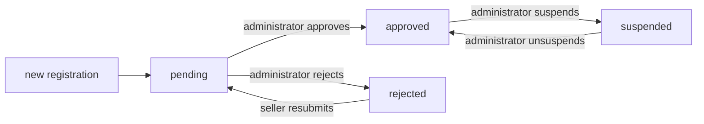

### State Definitions

- **Pending**: Initial state after seller registration. Seller cannot create products or access selling features but can view their approval status.
- **Approved**: Seller has full access to selling features including product creation, inventory management, and order processing.
- **Rejected**: Seller cannot access selling features. The rejection reason is displayed to the seller. Seller may submit a new registration request to return to pending state.
- **Suspended**: Approved seller loses access to product creation and editing. Existing orders remain processable. Products are hidden from customers.

### Transition Triggers

| From State | To State | Trigger | Actor |
|------------|----------|---------|-------|
| (new) | Pending | Registration submitted | System |
| Pending | Approved | Administrator approves | Administrator |
| Pending | Rejected | Administrator rejects with reason | Administrator |
| Rejected | Pending | Seller submits new registration | Seller |
| Approved | Suspended | Administrator suspends account | Administrator |
| Suspended | Approved | Administrator removes suspension | Administrator |

### Customer Account State Transition

Customer accounts can be banned by administrators for policy violations.

### Account State Flow

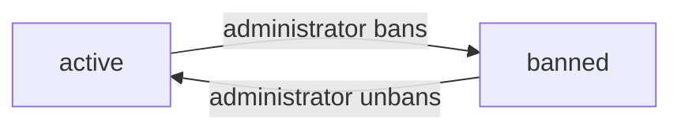

### State Definitions

- **Active**: Customer has full access to browsing, purchasing, and account management features.
- **Banned**: Customer cannot log in to the platform. Existing orders remain in the system for seller records.

### Transition Triggers

| From State | To State | Trigger | Actor |
|------------|----------|---------|-------|
| Active | Banned | Administrator bans account | Administrator |
| Banned | Active | Administrator removes ban | Administrator |

### Product Lifecycle State Transition

Products transition between available and deleted states based on seller actions and business rules.

### Product State Flow

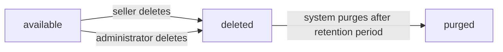

### State Definitions

- **Available**: Product appears in search results and category listings. Customers can view and purchase the product.
- **Deleted**: Product no longer appears in search or category listings. All variants are also marked deleted. Product snapshots are preserved for historical records. Wishlist entries referencing this product are automatically removed.

### Transition Triggers

| From State | To State | Trigger | Condition |
|------------|----------|---------|----------|
| Available | Deleted | Seller deletes product | No pending order items or cancellation/refund requests exist for any variant |
| Available | Deleted | Administrator deletes | Policy violation or request |
| Deleted | Purged | System purge | Retention period expires |

### Deletion Prevention

A product cannot be deleted by the seller when:
- Any variant has pending order items (paid or shipped status)
- Any variant has pending cancellation requests
- Any variant has pending refund requests

### Product Variant State Transition

Product variants track their availability and stock status independently.

### Variant State Flow

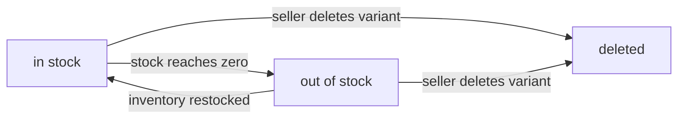

### State Definitions

- **In Stock**: Variant has positive stock quantity. Customers can add this variant to their cart.
- **Out of Stock**: Variant stock quantity is zero. Customers cannot add this variant to cart. The product remains visible but is shown as unavailable.
- **Deleted**: Variant is removed from the product listing. Historical order records are preserved.

### Transition Triggers

| From State | To State | Trigger |
|------------|----------|---------|
| In Stock | Out of Stock | All inventory records sum to zero or below |
| Out of Stock | In Stock | Inventory record adds positive quantity |
| In Stock | Deleted | Seller deletes variant (when allowed) |
| Out of Stock | Deleted | Seller deletes variant (when allowed) |

### Deletion Prevention

A variant cannot be deleted when:
- It has pending order items (paid or shipped status)
- It has pending cancellation requests
- It has pending refund requests

### Order Status Derivation

The overall order status is derived from the statuses of its individual items rather than managed independently.

### Order Status Derivation Rules

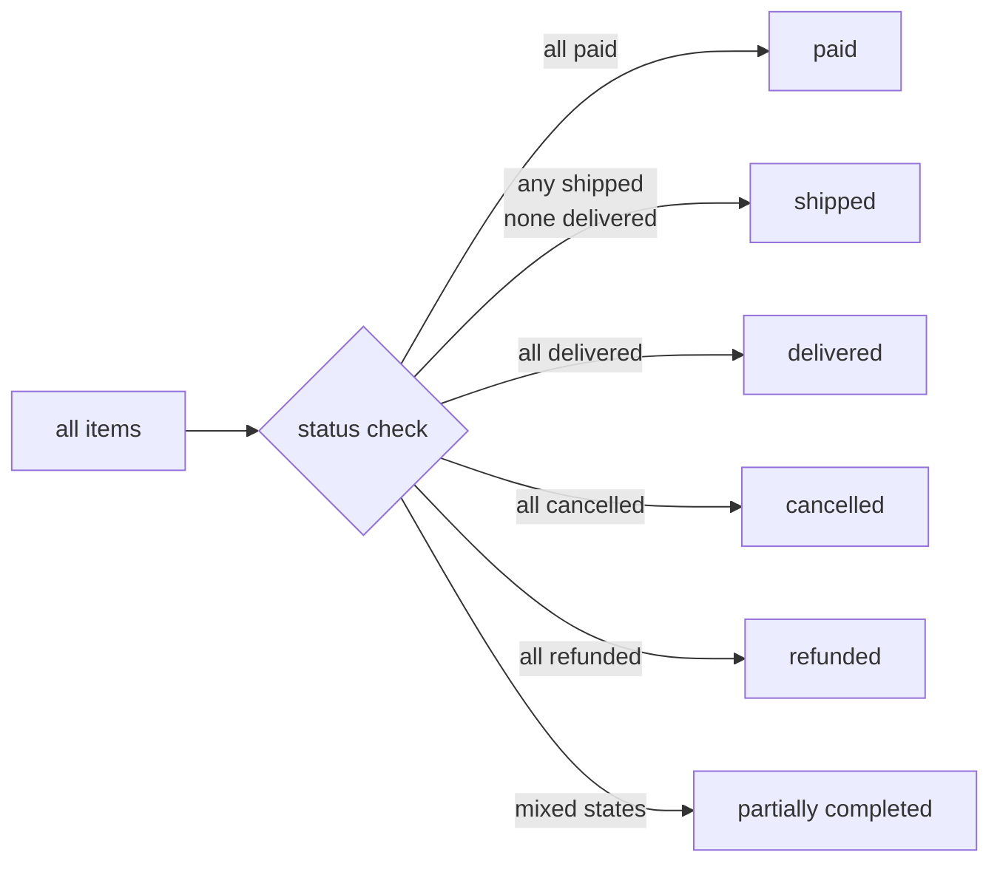

### Derived Status Rules

| Condition | Order Status |
|-----------|---------------|
| All items are paid | Paid |
| Any item is shipped and none are delivered yet | Shipped |
| All items are delivered | Delivered |
| All items are cancelled | Cancelled |
| All items are refunded | Refunded |
| Mixed item statuses (some delivered, some refunded, etc.) | Partially Completed |

### Status Calculation

The system recalculates the order status whenever:
- An order item status changes
- A new shipment is created
- A cancellation or refund is processed

### Order Item Status Progression

Order items follow a linear progression through fulfillment states, with branching paths for cancellation and refund.

### Order Item State Flow

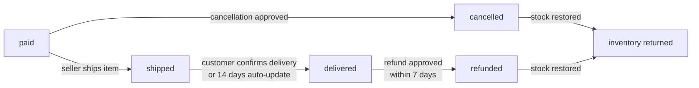

### State Definitions

- **Paid**: Payment completed successfully. Item is waiting for seller to ship.
- **Shipped**: Seller has shipped the item. Tracking information is available.
- **Delivered**: Customer has confirmed delivery or 14 days have passed since shipping.
- **Cancelled**: Cancellation request was approved. Refund is processed.
- **Refunded**: Refund request was approved after delivery.

### Transition Triggers

| From State | To State | Trigger | Actor |
|------------|----------|---------|-------|
| Paid | Shipped | Seller creates shipment | Seller |
| Shipped | Delivered | Customer confirms delivery | Customer |
| Shipped | Delivered | 14 days pass after shipping | System |
| Paid | Cancelled | Cancellation approved | Seller |
| Delivered | Refunded | Refund approved within 7 days | Seller |

### Automatic State Updates

- Items automatically transition from shipped to delivered after 14 days from the shipping date if the customer has not confirmed delivery
- Stock quantities are restored when items are cancelled or refunded

### Shipment State Transition

Shipments track the physical delivery progress of grouped order items.

### Shipment State Flow

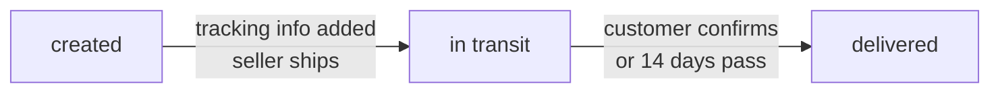

### State Definitions

- **Created**: Shipment record exists with selected items but tracking information not yet entered.
- **In Transit**: Tracking information has been added. Package is with carrier.
- **Delivered**: Customer has confirmed receipt or automatic update occurred.

### Transition Triggers

| From State | To State | Trigger | Actor |
|------------|----------|---------|-------|
| Created | In Transit | Seller adds tracking information | Seller |
| In Transit | Delivered | Customer confirms delivery | Customer |
| In Transit | Delivered | 14 days pass after shipping date | System |

### Item Status Synchronization

When a shipment transitions to delivered, all order items within that shipment also transition to delivered status. This maintains consistency between shipment tracking and item status.

### Cancellation Request State Transition

Cancellation requests move through review states before resulting in item cancellation.

### Cancellation Request State Flow

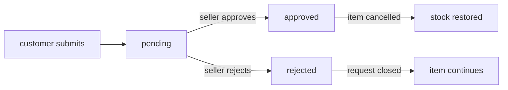

### State Definitions

- **Pending**: Request submitted and awaiting seller review.
- **Approved**: Seller granted the cancellation. Item transitions to cancelled status. Refund is processed.
- **Rejected**: Seller denied the cancellation. Item continues with normal fulfillment.

### Transition Triggers

| From State | To State | Trigger | Actor |
|------------|----------|---------|-------|
| (new) | Pending | Customer submits cancellation request | System |
| Pending | Approved | Seller approves request | Seller |
| Pending | Rejected | Seller rejects request | Seller |

### Side Effects

When a cancellation request is approved:
- The associated order item transitions to cancelled status
- Stock quantity is restored via an inventory record
- Refund is processed for the item

When a cancellation request is rejected:
- The order item continues with normal status progression

### Refund Request State Transition

Refund requests follow a review workflow with eligibility time constraints.

### Refund Request State Flow

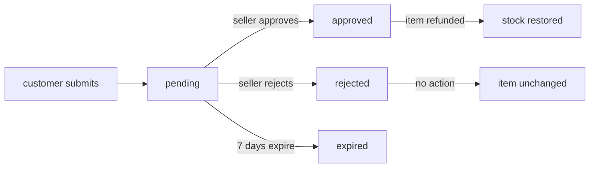

### State Definitions

- **Pending**: Request submitted and awaiting seller review.
- **Approved**: Seller granted the refund. Item transitions to refunded status.
- **Rejected**: Seller denied the refund. No further action taken.
- **Expired**: Request exceeded the 7-day eligibility window without resolution.

### Transition Triggers

| From State | To State | Trigger | Actor |
|------------|----------|---------|-------|
| (new) | Pending | Customer submits refund request | System |
| Pending | Approved | Seller approves request | Seller |
| Pending | Rejected | Seller rejects request | Seller |
| Pending | Expired | 7 days pass from item delivery | System |

### Eligibility Constraint

Refund requests can only be submitted within 7 days of the item's delivery date. The 7-day window is calculated from the delivery confirmation timestamp.

### Side Effects

When a refund request is approved:
- The associated order item transitions to refunded status
- Stock quantity is restored via an inventory record
- Refund is processed for the item amount

### Review Lifecycle State Transition

Product reviews transition between active and deleted states.

### Review State Flow

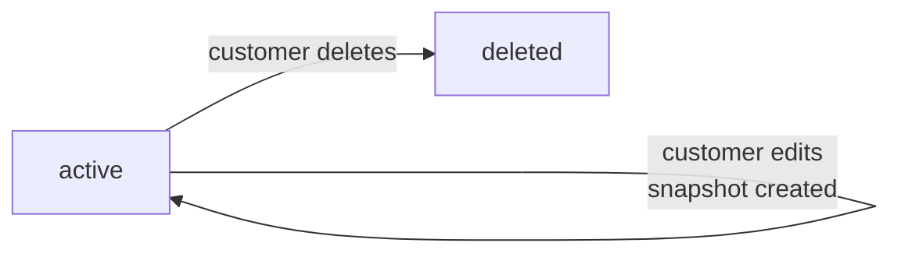

### State Definitions

- **Active**: Review is visible on the product detail page and contributes to the product's average rating calculation.
- **Deleted**: Review is no longer displayed to customers. The review content and snapshot are preserved for historical records. The review does not contribute to rating calculations. If the original author has been deleted from the platform, the author name is displayed as "deleted user".

### Transition Triggers

| From State | To State | Trigger | Actor |
|------------|----------|---------|-------|
| (new) | Active | Customer submits review | System |
| Active | Deleted | Customer deletes review | Customer |

### Snapshot Creation

Every time a customer edits their review, a snapshot is created that preserves:
- The rating value before the edit
- The text content before the edit
- The timestamp of the edit

The updated review becomes the new active state.

### Rating Recalculation

When a review is deleted or edited, the product's average rating is recalculated based on all remaining active reviews.

### Administrator Request State Transition

Administrator requests transition through approval states to grant platform management privileges.

### Admin Request State Flow

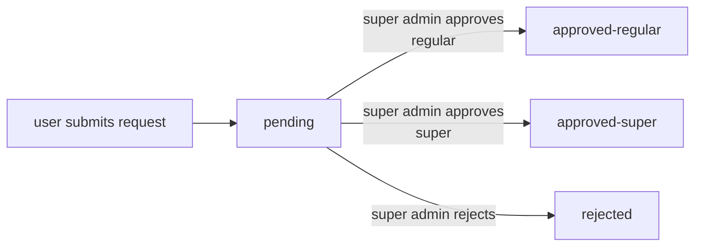

### State Definitions

- **Pending**: Request submitted and awaiting super administrator review.
- **Approved (Regular)**: User becomes a regular administrator with standard administrative privileges.
- **Approved (Super)**: User becomes a super administrator with elevated privileges including promotion and demotion capabilities.
- **Rejected**: Request denied. User can submit a new request after addressing concerns.

### Transition Triggers

| From State | To State | Trigger | Actor |
|------------|----------|---------|-------|
| (new) | Pending | User submits admin request | System |
| Pending | Approved-Regular | Super admin approves for regular grade | Super Administrator |
| Pending | Approved-Super | Super admin approves for super grade | Super Administrator |
| Pending | Rejected | Super admin rejects request | Super Administrator |

### Administrator Grade State Transition

Administrator grades can be changed through promotion and demotion actions.

### Grade State Flow

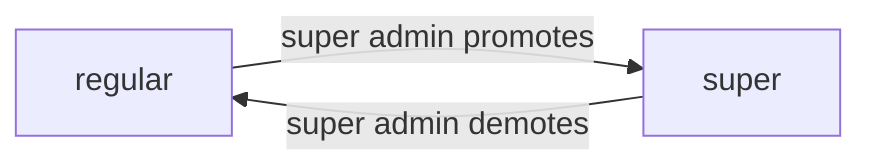

### State Definitions

- **Regular Administrator**: Can perform standard administrative tasks including seller approval, product oversight, and user management.
- **Super Administrator**: Has all regular administrator privileges plus the ability to promote regular administrators to super administrator and demote other super administrators.

### Transition Triggers

| From State | To State | Trigger | Actor |
|------------|----------|---------|-------|
| Regular | Super | Super administrator promotes user | Super Administrator |
| Super | Regular | Super administrator demotes user | Super Administrator |

### Self-Protection Constraint

A super administrator cannot demote themselves. The system prevents this action to ensure at least one super administrator remains active.