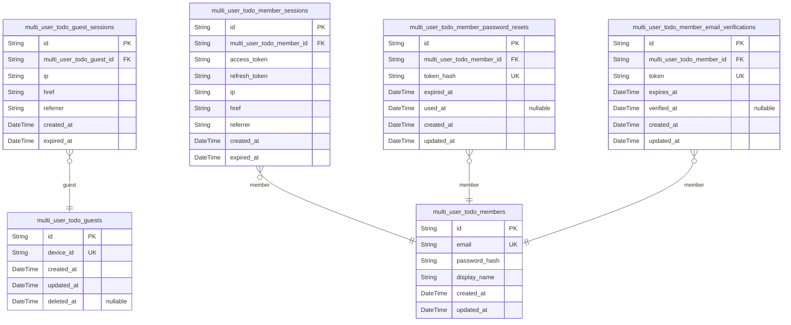
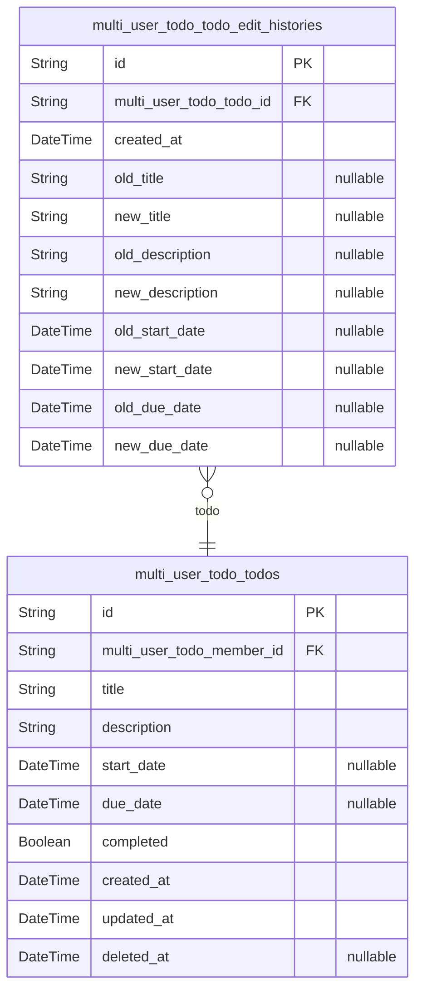

# Prisma Markdown

> Generated by [`prisma-markdown`](https://github.com/samchon/prisma-markdown)

- [Actors](#actors)
- [Todos](#todos)

## Actors

### `multi_user_todo_guests`

Temporary guest accounts for unauthenticated visitors identified by
device ID before registration or login. Guests are anonymous users
tracked by their device identifier, allowing the system to maintain
context for unauthenticated users until they choose to register or log
in.

Properties as follows:

- `id`: Primary Key.
- `device_id`
  > Unique device identifier used to track anonymous guest users. This allows
  > the system to maintain session continuity for unauthenticated visitors
  > identified by their device.
- `created_at`
  > Timestamp when the guest account was first created. Records when this
  > device was first seen by the system.
- `updated_at`
  > Timestamp when the guest account was last updated. Tracks the last
  > activity or modification time for this guest record.
- `deleted_at`
  > Timestamp when the guest account was soft deleted. Null means the guest
  > account is active. Used for cleanup of stale or converted guest records.

### `multi_user_todo_guest_sessions`

Temporary session tokens for guest access, tracking anonymous user sessions.

This table stores session information for unauthenticated visitors
(guests) before they register or log in. Each session is linked to a
guest via the multi_user_todo_guest_id foreign key. The table tracks
connection metadata including IP address, request URL (href), and
referrer for analytics and security purposes. Sessions expire based on
the expired_at timestamp and are not soft-deleted since they naturally
expire.

Properties as follows:

- `id`: Primary Key.
- `multi_user_todo_guest_id`
  > Associated guest's [multi_user_todo_guests.id](#multi_user_todo_guests). This links the
  > session to the guest who owns it.
- `ip`: IP address of the client making the request.
- `href`: Requested URL path for this session.
- `referrer`: HTTP referrer header value indicating the previous page.
- `created_at`: Timestamp when the session was created.
- `expired_at`: Timestamp when the session expires and becomes invalid.

### `multi_user_todo_members`

Registered user accounts with email and password authentication
credentials for authenticated access. This is the primary actor table
representing authenticated members who can create, manage, and delete
their own todos. Each member has a profile with display name that can be
edited. Account deletion is permanent and cascades to all associated
todos.

Properties as follows:

- `id`: Primary Key.
- `email`
  > Unique email address used for login authentication and account
  > identification.
- `password_hash`: Bcrypt hashed password for secure authentication.
- `display_name`
  > Public display name shown in the member's profile and around the
  > application.
- `created_at`: When the member account was created.
- `updated_at`: When the member account was last updated.

### `multi_user_todo_member_sessions`

JWT session tokens for maintaining authenticated member sessions with
access and refresh token support. Each session records the member's login
event including connection metadata (IP address, URL, referrer) and JWT
token pair. Sessions are created upon successful login and tracked until
expiration. Multiple concurrent sessions per member are supported.

Properties as follows:

- `id`: Primary Key.
- `multi_user_todo_member_id`
  > Authenticated member who owns this session. {@link
  > multi_user_todo_members.id}.
- `access_token`: JWT access token for authenticated API requests.
- `refresh_token`: JWT refresh token for obtaining new access tokens.
- `ip`: Client IP address at session creation.
- `href`: Current request URL path.
- `referrer`: HTTP referrer header value.
- `created_at`: Session creation timestamp.
- `expired_at`: Session expiration timestamp. NOT NULL to enforce mandatory expiration.

### `multi_user_todo_member_password_resets`

Password reset tokens for member account recovery and password change
flows. Each token has an expiration time and can be marked as used.
Managed through authentication processes, not direct user operations.
[multi_user_todo_members](#multi_user_todo_members) owns many password reset tokens.

Properties as follows:

- `id`: Primary Key.
- `multi_user_todo_member_id`
  > The member who requested this password reset. {@link
  > multi_user_todo_members.id}.
- `token_hash`: Hashed password reset token for security. Never store plaintext tokens.
- `expired_at`
  > Expiration timestamp for this reset token. Token is invalid after this
  > time.
- `used_at`: Timestamp when this reset token was used. Null if not yet used.
- `created_at`: Timestamp when this password reset was requested.
- `updated_at`: Timestamp of the last update to this record.

### `multi_user_todo_member_email_verifications`

Email verification tokens for member account registration verification.
Each record stores a unique verification token sent to the member's email
during registration. Tokens have expiration times and are marked as
verified when the member confirms their email address through the
verification link.

Properties as follows:

- `id`: Primary Key.
- `multi_user_todo_member_id`
  > Belonged member's [multi_user_todo_members.id](#multi_user_todo_members). This is the member
  > account this verification token belongs to.
- `token`
  > Unique verification token string sent to the member's email. Used as the
  > lookup key during email verification.
- `expires_at`
  > Expiration timestamp for the verification token. Tokens become invalid
  > after this time.
- `verified_at`: Timestamp when the verification was completed. Null if not yet verified.
- `created_at`: Timestamp when the verification token was created.
- `updated_at`: Timestamp when the verification token was last updated.

## Todos

### `multi_user_todo_todos`

Main todo items owned by users with title, description, dates, completion
status, and soft-delete support via deleted_at timestamp for trash
workflow.

Each todo belongs to exactly one member and captures task management data
including optional start/due dates and completion status. The soft-delete
pattern enables the trash workflow where users can view deleted todos,
restore them, or permanently delete them.

Relationships:
- Owned by [multi_user_todo_members](#multi_user_todo_members) via multi_user_todo_member_id
FK for privacy isolation
- Has many [multi_user_todo_todo_edit_histories](#multi_user_todo_todo_edit_histories) entries recording
all field mutations

Properties as follows:

- `id`: Primary Key.
- `multi_user_todo_member_id`
  > Owner's member ID. References [multi_user_todo_members.id](#multi_user_todo_members) for
  > privacy isolation - each user can only see their own todos.
- `title`: Todo title - the main task description. Required on creation.
- `description`: Optional detailed description of the todo. Can be empty string.
- `start_date`: Optional start date for the todo. Null if not set.
- `due_date`: Optional due date for the todo. Null if not set.
- `completed`: Completion status flag. False by default when todo is created.
- `created_at`: Timestamp when the todo was created.
- `updated_at`: Timestamp when the todo was last modified.
- `deleted_at`
  > Soft-delete timestamp. Null means not deleted. When set, todo is in trash
  > and excluded from normal list.

### `multi_user_todo_todo_edit_histories`

Edit history entries recording field-level mutations for todo items. Each
entry captures old and new values for title, description, start_date, and
due_date when a todo is edited, with a timestamp. History entries are
created automatically when todos are edited and cannot be modified or
deleted independently by users.

Properties as follows:

- `id`: Primary Key.
- `multi_user_todo_todo_id`
  > The todo item this edit history entry belongs to. {@link
  > multi_user_todo_todos.id}
- `created_at`: Timestamp when this edit was made.
- `old_title`
  > Previous title value before this edit. Null if title was not changed in
  > this edit.
- `new_title`
  > New title value after this edit. Null if title was not changed in this
  > edit.
- `old_description`
  > Previous description value before this edit. Null if description was not
  > changed in this edit.
- `new_description`
  > New description value after this edit. Null if description was not
  > changed in this edit.
- `old_start_date`
  > Previous start date value before this edit. Null if start date was not
  > changed in this edit.
- `new_start_date`
  > New start date value after this edit. Null if start date was not changed
  > in this edit.
- `old_due_date`
  > Previous due date value before this edit. Null if due date was not
  > changed in this edit.
- `new_due_date`
  > New due date value after this edit. Null if due date was not changed in
  > this edit.
