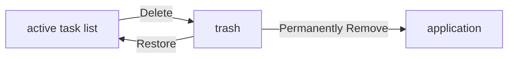
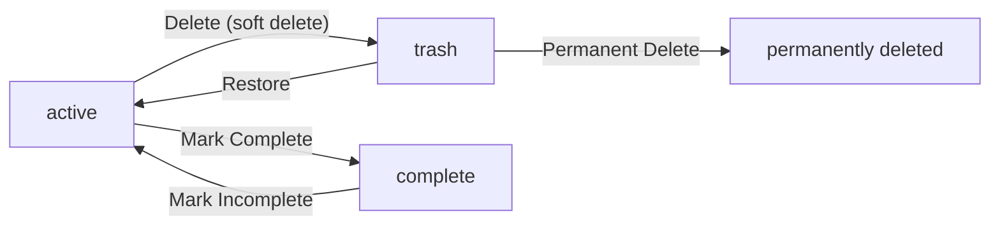
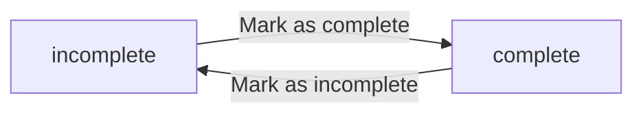
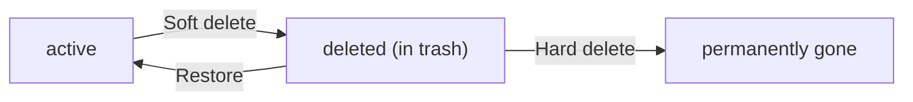

**multiUserTodo — Business concepts, relationships, and states from user perspective**

Business concepts, relationships, and states from user perspective

# Domain Concepts

Describe what each concept means in the business domain and its key attributes.

## User Concept

User represents an individual who can sign up and log in to manage their personal todos. Each user must provide an email address and a password during registration, which together serve as their credentials for authentication. The email address must be unique across all users, ensuring no two accounts share the same identifier. The password is stored securely and can be changed by the user at any time. Every user has a display name that appears in their profile and can be edited to reflect how they wish to be identified. Users have full control over their account, including the ability to permanently delete it, which removes all associated data. This concept forms the foundation of privacy in the application, as each user's data is completely isolated from others.

### User as Individual Account Holder

A user represents an individual account holder within the system. Each user operates in complete isolation from other users, maintaining sole ownership over all data associated with their account. The system distinguishes between registered members and unauthenticated guests, with the user concept specifically describing those who have completed the registration process and hold active accounts. Users exist as distinct entities with their own set of todos, edit histories, and profile information that cannot be accessed or viewed by any other user in the system.

### Email and Password Authentication

Authentication in this system relies on two components that work together: an email address that uniquely identifies the user, and a password that serves as the secret credential for access. The email address must be provided in a valid format and must not already be registered to another user, ensuring each person has exactly one account. The password is chosen by the user during registration and must meet any applicable security requirements. Together, these two pieces of information form the login credentials that allow a user to access their private todo data. The system verifies these credentials each time a user attempts to log in, rejecting any attempt where the email or password does not match an existing account.

### User Profile Information

Every user maintains a profile that stores their chosen display name. This display name is the identifier shown to represent the user within the application and can be changed at any time to reflect a new preference. The profile is private to each user and is not visible to other users of the system. Profile information consists solely of the display name, keeping the user experience focused and straightforward. Users can update their display name as frequently as desired without affecting their account's security or their existing todos.

### Account Deletion and Data Ownership

Users have complete control over the lifecycle of their account, including the ability to permanently delete it. When a user chooses to delete their account, the action is irreversible. All todos created by the user are moved to the trash, where they remain for a defined retention period before being permanently removed. Edit history records associated with those todos are also removed during this process. Account deletion is an individual action performed by the user on their own account and cannot be initiated by anyone else. Once an account is deleted, no trace of the user's data remains accessible.

### Privacy and Data Isolation

The system enforces strict privacy isolation between users. Each user's data is completely private and inaccessible to other users. There is no mechanism to view, share, or transfer todos between accounts. A user can only see and manage their own todos, their own trash, and their own edit history. This isolation is fundamental to the application's design and ensures that personal task information remains confidential. The system does not provide any way to discover other users' accounts or access their data, making this a private todo management solution where each person's information is siloed and protected.

## Todo Concept

Todo represents a task or item that a user creates and manages within their personal list. Every todo must have a title that describes what needs to be done, making it the essential identifier of the task. A description field allows users to provide additional context or details about the task, though this is optional. The start date field can be set when the user plans to begin working on the task, allowing for future-oriented planning. The due date field can be set to establish a deadline or target completion date for the task. By default, newly created todos are in an incomplete state, indicating the task has not yet been done. Todos can exist in an active state where they appear in the normal list, or in a deleted state where they are moved to trash. Each todo maintains its own edit history to track all changes made to its attributes over time.

### Todo Definition and Core Attributes

A todo represents a single task item that a user creates and maintains within their personal collection. Each todo serves as a distinct unit of work or action that the owner wishes to track, plan, or complete. Todos are the fundamental building blocks of the application, enabling users to organize and manage their responsibilities systematically.

A todo must have a task title that identifies what needs to be done. This title is the primary way users recognize and reference their tasks. The title is required when creating a todo and should clearly describe the intended action or goal.

A todo may include a task description that provides additional context, instructions, or details about the task. This description field is optional and can be left empty. When provided, it gives the owner richer information about the task beyond what fits in the title.

A todo may have a start date that indicates when the owner plans to begin working on the task. This date is optional and supports future-oriented planning, allowing users to schedule when they will start working on a task item.

A todo may have a due date that establishes a deadline or target completion date for the task. This date is optional and helps users prioritize their work by knowing when something needs to be finished. The due date can be set independently of the start date, or together with it to define a work period.

### Todo Completion Status

Each todo has a completion status that indicates whether the task item has been finished. The completion status operates as a toggle between two states: complete and incomplete.

By default, newly created todos are in an incomplete state, indicating the task has not yet been done. This means every task item starts as an unfinished item that the owner needs to work on.

When a todo is marked as complete, it signals that the associated task item has been finished. The owner can later change it back to incomplete if needed, such as when work on the task resumes or when the completion was marked in error.

The completion status is independent of other todo attributes and does not affect the start date, due date, or other fields. A completed task item retains all its original information including dates and description.

### Todo States

A todo can exist in one of two states that determine where it appears and how it can be accessed.

An active task exists in the normal active task list where it is visible and manageable. Active tasks represent the owner's current workload and appear in the primary view where todos can be created, edited, completed, or deleted.

A deleted task moves to the trash and no longer appears in the active task list. Deleted tasks retain all their information including the task title, description, dates, and edit history. Tasks in trash can be restored to the active task list or permanently removed from the application.

The state of a todo affects its visibility in the application but does not change its core attributes or edit history.

### Todo Ownership

Every todo belongs to a single owner who created it. The task ownership is established at the time of creation and does not change throughout the todo's lifecycle. Each user maintains their own personal task collection that is completely separate from other users' collections.

The owner has full control over their task items, including the ability to view, edit, complete, delete, and permanently remove todos. No other user can access, view, or modify todos they do not own.

The relationship between owner and todo is one-to-many: a single user can own many todos, but each todo belongs to exactly one user. This forms the basis of the personal task collection where all a user's todos are stored together and managed as a group.

When a user's account is deleted, all their todos—including those in trash—are permanently removed along with the account.

## TodoEditHistory Concept

TodoEditHistory represents a record of changes made to a todo item at a specific point in time. Each history entry captures exactly what was modified during one editing session, including the new values for any attributes that were changed. If a particular attribute such as title, description, start date, or due date was not modified during that edit, its value is recorded as not changed rather than storing a duplicate value. The history entry automatically records the timestamp when the edit occurred, establishing a chronological sequence of all modifications. Each todo maintains its own collection of history entries, allowing users to review how their task evolved over time. History entries within a todo are always ordered from the most recent change to the oldest, so users can quickly see the latest state first. When a todo is permanently deleted, its entire edit history is also permanently removed.

### Edit Record Structure

Each edit record represents a single editing session on a todo item. When a user modifies any attribute of a todo—whether the title, description, start date, or due date—a new edit record is created to capture that change. The edit record is not a snapshot of the entire todo; it only records the values of attributes that were actually changed during that session. Attributes that remained unchanged are not stored in the edit record, as the current state of the todo always represents the authoritative value for unchanged attributes.

### Change History Entry Composition

A change history entry contains the values that were set during a specific editing session. For each attribute that was modified, the entry records what the new value became after the edit. For attributes that were not touched during that session, the entry indicates the attribute was not changed. This selective recording approach ensures the history is a meaningful audit trail rather than redundant duplication of unchanged data.

### Modification Timestamp

Every edit record is automatically stamped with the exact moment when the edit was made. This modification timestamp is set by the system and cannot be modified by users. The timestamp establishes a precise chronological record of when each change occurred, allowing users to understand the timeline of modifications to their todo items.

### Title Change Tracking

When a user changes a todo's title, the new title value is captured in the edit history entry. The history entry indicates that the title was changed and records the new value. If the title is not modified during an edit session, the history entry indicates the title was not changed.

### Description Change Tracking

When a user changes a todo's description, the new description value is captured in the edit history entry. The history entry indicates that the description was changed and records the new value. If the description is not modified during an edit session, the history entry indicates the description was not changed.

### Start Date Change Tracking

When a user changes a todo's start date, the new start date value is captured in the edit history entry. The history entry indicates that the start date was changed and records the new value. If the start date is not modified during an edit session, the history entry indicates the start date was not changed.

### Due Date Change Tracking

When a user changes a todo's due date, the new due date value is captured in the edit history entry. The history entry indicates that the due date was changed and records the new value. If the due date is not modified during an edit session, the history entry indicates the due date was not changed.

### Chronological Modification Order

Edit history entries are organized chronologically based on their modification timestamps. Each todo maintains its own independent collection of history entries. When a user views the edit history of a todo, the entries are presented in order from the most recent change to the oldest, allowing users to trace the evolution of the todo starting from the latest modification.

### Most Recent Changes First

Edit history entries are always presented with the most recent changes first. This ordering ensures that when users review their todo's edit history, they immediately see the latest modifications without needing to scroll through older entries. The most recent changes appear at the top of the history list, progressing downward to older changes.

### History Permanence Lifecycle

The lifecycle of edit history is tied to the lifecycle of its associated todo. Edit history is created automatically whenever a todo is edited. When a todo is moved to the trash, the edit history remains accessible as long as the todo remains in the trash. When the todo is permanently deleted from the trash, the entire edit history for that todo is also permanently deleted at the same time. There is no separate mechanism for restoring or recovering edit history apart from its todo; the history and the todo share the same deletion fate.

# Domain Relationships

Describe how concepts relate to each other from a business perspective.

## Conceptual Relationships

Describe how concepts relate to each other in business terms.

### Entity Relationship Overview

The system contains three primary business concepts: users, todos, and edit history entries. These concepts are interconnected through ownership and association patterns.

Users serve as the primary actors who create and manage todos. Every todo belongs to exactly one user, and every edit history entry traces back to a user through the todo it belongs to.

Todos represent actionable items that users create to track tasks. Each todo maintains a record of all changes made to it through its associated edit history entries.

Edit history entries capture individual modifications to a todo, forming a chronological record of how the todo evolved over time.

### User-Todo Ownership

The ownership relationship between users and todos is fundamental to the application.

Every todo must have exactly one owner. The owner is always the user who created the todo. A todo cannot exist without an owner, and ownership cannot be transferred to another user.

When a user creates a todo, they become the permanent owner of that todo. The owner retains ownership regardless of any modifications made to the todo's content.

A user can own any number of todos. There is no upper limit on how many todos a single user can own.

### Todo-EditHistory Association

A todo maintains a one-to-many association with its edit history entries.

Each todo can have zero or more edit history entries. A newly created todo has no history entries until its first edit occurs.

Every edit history entry belongs to exactly one todo. An edit history entry cannot exist independently of a todo.

The association between a todo and its edit history entries is ordered by time. Entries are stored in chronological sequence, with the most recent edit appearing as the latest entry.

When a todo is removed, all of its associated edit history entries are also removed.

### Ownership Chain

Edit history entries participate in an ownership chain through their associated todo.

Each edit history entry belongs to a todo, and that todo belongs to a user. This creates an indirect ownership relationship where edit history entries are owned by the user who owns the containing todo.

A user who owns a todo automatically has access to view all edit history entries for that todo. Users cannot directly own edit history entries.

The ownership chain ensures that edit history entries are always accessible to the user who owns the todo, and are removed when the todo or user is removed.

## Lifecycle and Retention

Describe concept lifecycle states and transitions only. Detailed retention/recovery policies belong in 05-non-functional. Operation details belong in 03-functional-requirements.

### Section 1: User Account Lifecycle

A user account progresses through distinct lifecycle states from creation to permanent removal.

**Registration State**: When a user successfully signs up, their account enters the active state. The account stores their email, password credential, and display name.

**Active State**: While active, the user can create todos, edit them, complete them, and delete them. All operations are available to the account owner.

**Deletion State**: When a user deletes their account, the system permanently removes the account and all associated data. This includes all todos the user created and all edit history entries. There is no recovery option for a deleted account. This action is irreversible.

---

### Section 2: Todo Lifecycle States

### Todo Lifecycle States

A todo item exists in one of several lifecycle states that determine its visibility and available operations.

**Active State**: A todo that has not been deleted exists in the active state. Active todos appear in the user's normal todo list and can be viewed, edited, completed, or deleted.

**Trash State**: When a user deletes a todo, it transitions to the trash state using soft delete. Deleted todos no longer appear in the normal todo list. While in trash, the todo can be restored to the active state or permanently deleted.

**Permanently Deleted State**: When a user permanently deletes a todo from the trash, it reaches the permanently deleted state. All associated edit history is also removed. This state cannot be reversed.

---

### Section 3: Todo Lifecycle State Transitions

### Todo Lifecycle State Transitions

**Active to Trash Transition**: When a user deletes an active todo, it moves to the trash using soft delete. The todo remains in the trash until the user restores it or permanently deletes it.

**Trash to Active Transition**: When a user restores a deleted todo from the trash, it returns to the active state and reappears in the normal todo list. The todo retains all its original content.

**Trash to Permanent Deletion Transition**: When a user permanently deletes a todo from the trash, both the todo and its entire edit history are removed from the system forever.

**Completion State Toggle**: A todo can be marked complete or incomplete at any time while in the active state. This is a separate property from the deletion lifecycle.

---

### Section 4: Edit History Lifecycle

### Edit History Lifecycle

Edit history entries follow the lifecycle of their parent todo.

**Associated Lifecycle**: Each edit history entry is created when a user edits a todo. The entry records what changed, when the change occurred, and which user made the change.

**Inheritance Rule**: Edit history entries do not exist independently. They are bound to their parent todo. When a todo is permanently deleted, all its edit history entries are permanently deleted at the same time.

**Restoration Behavior**: If a todo is restored from trash, its edit history remains intact with all previously recorded entries.

---

### Section 5: Deletion Policy

### Deletion Policy

The system implements a two-tier deletion policy that provides data recovery options while ensuring complete removal when requested.

**Soft Delete Policy**: When a user deletes a todo, the system performs a soft delete. The todo is moved to the trash but remains recoverable. Soft deleted items do not appear in the normal todo list but remain in the system.

**Permanent Delete Policy**: When a user permanently deletes a todo from the trash, both the todo and its edit history are permanently and irreversibly removed from the system. This action cannot be undone.

**Account Deletion Policy**: When a user deletes their account, all user data including todos and edit history is permanently and irreversibly deleted immediately. There is no trash or recovery period for account deletion.

---

### Section 6: Recovery Capabilities

### Recovery Capabilities

The system provides specific recovery options for different types of data removal.

**Todo Recovery**: A todo in the trash can be recovered by the user who deleted it. When recovered, the todo returns to the active state with all its original content and edit history intact.

**Edit History Recovery**: Edit history is automatically preserved when a todo is recovered from the trash. All historical entries remain attached to the todo.

**No Recovery After Permanent Deletion**: Once a todo has been permanently deleted from the trash, neither the todo nor its edit history can be recovered. The data is gone permanently.

**No Account Recovery**: Deleted user accounts cannot be recovered. All associated todos and edit history are permanently removed at the time of account deletion.

### Section 5: Deletion Policy

The system implements a two-tier deletion policy that provides data recovery options while ensuring complete removal when requested.

**Soft Delete Policy**: When a user deletes a todo, the system performs a soft delete. The todo is moved to the trash but remains recoverable. Soft deleted items do not appear in the normal todo list but remain in the system.

**Permanent Delete Policy**: When a user permanently deletes a todo from the trash, both the todo and its edit history are permanently and irreversibly removed from the system. This action cannot be undone.

**Account Deletion Policy**: When a user deletes their account, all user data including todos and edit history is permanently and irreversibly deleted immediately. There is no trash or recovery period for account deletion.

### Section 6: Recovery Capabilities

The system provides specific recovery options for different types of data removal.

**Todo Recovery**: A todo in the trash can be recovered by the user who deleted it. When recovered, the todo returns to the active state with all its original content and edit history intact.

**Edit History Recovery**: Edit history is automatically preserved when a todo is recovered from the trash. All historical entries remain attached to the todo.

**No Recovery After Permanent Deletion**: Once a todo has been permanently deleted from the trash, neither the todo nor its edit history can be recovered. The data is gone permanently.

**No Account Recovery**: Deleted user accounts cannot be recovered. All associated todos and edit history are permanently removed at the time of account deletion.

# Business Categories and State Flows

Business category classifications and state flow definitions.

## Business Category Definitions

Define all business category classifications with their allowed values and descriptions.

### Todo Completion Status Classification

Every todo has a completion status that indicates whether the task has been finished.

**Completion Status Types:**

- **Incomplete**: The todo represents a task that has not yet been done. This is the default status when a todo is created.
- **Complete**: The todo represents a task that has been finished.

**Allowed Values:** A todo's completion status is either incomplete or complete. There are no other possible values.

**Classification Rules:**

- When a todo is first created, its completion status is automatically set to incomplete.
- Users can toggle a todo's completion status between complete and incomplete at any time.
- A todo's completion status is independent of its deletion status.

### Todo Deletion Status Classification

Every todo has a deletion status that indicates its lifecycle stage. The system uses soft delete, meaning todos are moved to an intermediate state before permanent removal.

**Deletion Status Types:**

- **Active**: The todo exists in the user's normal todo list and can be viewed, edited, and managed.
- **Trashed**: The todo has been soft-deleted by the user but remains recoverable. It no longer appears in the normal todo list.
- **Permanently Deleted**: The todo has been removed from the system and cannot be recovered. All associated edit history is also deleted.

**Allowed Values:** A todo's deletion status is one of these three values: active, trashed, or permanently deleted.

**Classification Rules:**

- When a todo is first created, its deletion status is automatically set to active.
- Moving a todo to trash changes its status from active to trashed.
- Restoring a todo from trash changes its status from trashed back to active.
- Permanently deleting a todo removes all data including edit history and cannot be undone.

### User Authentication Status Classification

The system recognizes two types of users based on their authentication state.

**User Status Types:**

- **Guest**: A person who has not logged in. Guests cannot create todos, view any user's todos, or access any functionality.
- **Member**: A person who has successfully logged in with valid credentials. Members can create, view, edit, and delete their own todos.

**Allowed Values:** A user's authentication status is either guest or member.

**Classification Rules:**

- The system must verify credentials before granting member status.
- A guest becomes a member upon successful login.
- A member becomes a guest upon logging out.
- Member status is required to access any todo-related functionality.

### Edit History Record Status

Each edit made to a todo creates a history record. These records track what changes were made and when.

**Recordable Change Types:**

- **Title Change**: The todo's title was modified.
- **Description Change**: The todo's description was modified.
- **Start Date Change**: The todo's start date was modified.
- **Due Date Change**: The todo's due date was modified.

**Allowed Values:** A history record stores the new value for each field that was changed. Fields that were not changed are not recorded in that history entry.

**Classification Rules:**

- Each history record captures the timestamp when the edit occurred.
- A single edit operation may change one or more fields, and all changed fields are recorded in a single history entry.
- History records are immutable once created and cannot be modified or deleted except when their parent todo is permanently deleted.

## State Transitions

Define valid state transition paths for stateful concepts.

### Todo Completion Status States

A todo exists in one of two completion states: incomplete or complete. These states represent whether the task has been finished.

An incomplete todo indicates the task has not yet been done. A complete todo indicates the task has been finished.

Users can change the completion state of their todo at any time. There are no restrictions on when a user can mark a todo as complete or mark a completed todo as incomplete. The state is simply a toggle between two values.

The completion state does not affect other attributes of the todo. A user can edit a todo regardless of whether it is complete or incomplete.

### Todo Completion State Transitions

A todo transitions from incomplete to complete when the owner marks it as complete.

A todo transitions from complete to incomplete when the owner marks it as incomplete.

These transitions are independent of other todo attributes. A user can mark a todo as complete even if it has no due date, or even if the due date has passed.

There is no automatic transition between these states. The system does not mark todos as complete based on the due date passing.

### Todo Lifecycle States

A todo exists in one of two lifecycle states: active or deleted.

An active todo appears in the normal todo list and can be viewed, edited, and managed by its owner.

A deleted todo does not appear in the normal todo list. It exists in the trash and can be viewed there, restored, or permanently deleted.

This soft delete approach preserves the todo and its edit history while it resides in the trash.

### Todo Lifecycle State Transitions

A todo transitions from active to deleted when the owner deletes it. This is a soft delete that preserves the todo and its edit history while it resides in the trash.

A deleted todo transitions back to active when the owner restores it from the trash. The restored todo reappears in the normal todo list with all its attributes intact.

A deleted todo transitions from deleted to permanently gone when the owner permanently deletes it from the trash. This hard delete action removes the todo and its edit history from the system. This transition is one-way and cannot be undone.

### State Transition Diagrams

