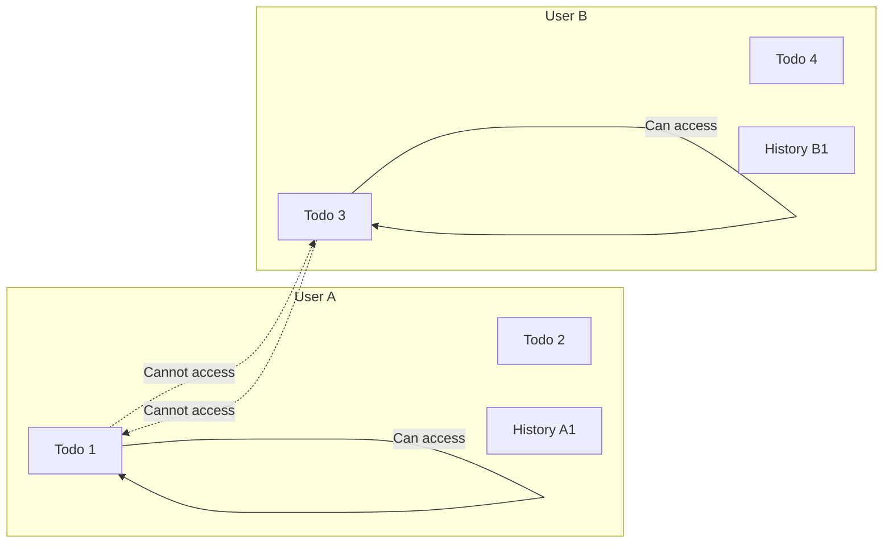

**multiUserTodo — Data ownership, privacy, retention, and recovery policies**

Data ownership, privacy, retention, and recovery policies

# Data Policies

Data ownership, privacy, retention, and recovery policies from a business perspective.

## Data Ownership and Privacy

Define who owns what data, who can access it, and privacy boundaries between users.

### Data Ownership Principles

Every user owns the data they create within the application. When a user creates a todo, that todo belongs exclusively to that user. The user who creates a todo is its sole owner and retains full control over it throughout its lifecycle.

Ownership extends to all associated data, including edit history entries. Each edit history entry belongs to the todo it records changes for, and indirectly to the user who owns that todo.

A user cannot acquire ownership of todos created by another user under any circumstances. Ownership is permanent and cannot be transferred, shared, or assigned to another user.

### Data Isolation Between Users

Each user's data is completely isolated from all other users. A user can only access their own data and has no ability to view, retrieve, or interact with any data belonging to another user.

This isolation applies to all data types including todos, edit history entries, and user profile information.

The system enforces isolation at the data level, ensuring that no user can bypass boundaries through any available operation.

### Access Control Boundaries

Access to data is strictly limited to the user who owns it. There are no exceptions, no shared access modes, and no administrative overrides that allow one user to view another user's data.

The system enforces access control through the following principles:

- **Self-only access**: Users can only access their own todos, their own edit history entries, and their own profile
- **No cross-user queries**: The system does not provide any mechanism to list, search, or retrieve todos belonging to other users
- **No sharing**: There is no sharing functionality that allows users to grant access to their todos to any other user
- **Private by default**: All todos are private and hidden from all other users by default

These access controls apply regardless of the data's state. A todo in trash remains private and inaccessible to other users.

### Privacy Guarantees

Privacy is a fundamental property of the application. Each user's todos, including their titles, descriptions, dates, and completion status, are completely private.

The application does not expose any user data to other users. This means:

- Users cannot discover that another user exists through the application
- Users cannot see the number of todos owned by another user
- Users cannot view, preview, or reference another user's todos through any interface or API
- User profile information, including display name, is not visible to other users

The privacy boundary is absolute and cannot be crossed through normal application usage or through any administrative function provided to users.

### Data Privacy Upon Account Deletion

When a user deletes their account, all associated data is permanently removed from the system. This includes:

- All todos created by the user, including those in the trash
- All edit history entries associated with those todos
- The user's profile information

This deletion is irreversible. Once an account is deleted, no portion of the user's data remains accessible to anyone, including the deleted user themselves.

### User Control Over Their Data

Users have full control over the lifecycle of their own data. Users can:

- Create todos that belong to them
- Delete todos, moving them to trash
- Restore deleted todos from trash
- Permanently delete todos from trash
- Edit their profile information
- Delete their account and all associated data

The system does not retain, archive, or backup user data beyond what is necessary for the application to function. When data is permanently deleted, it is removed from all storage locations.

## Data Retention and Recovery

Define what happens to deleted data, how long it is retained, and how users can recover it.

### Soft Delete Policy

When a user deletes a todo, the system performs a soft_delete. Soft delete means the todo is marked as deleted but the data remains in the system.

Deleted todos are removed from the user's normal todo list and are no longer visible among active todos. The system retains all todo data including title, description, start date, due date, completion status, and creation date.

The soft_delete operation preserves the entire edit history associated with the todo. This allows users to review what changes were made to a todo even after it has been deleted.

Soft deleted todos remain recoverable until the user permanently deletes them.

### Trash Retention

Deleted todos are stored in the trash. The trash serves as an intermediate holding area between active use and permanent deletion.

Users can view all their deleted todos in the trash list. The trash list is paginated, matching the pagination behavior of the normal todo list.

There is no automatic cleanup of the trash. Todos remain in the trash indefinitely until the user takes action to either restore or permanently delete them.

When a todo is in the trash, users can still view its full details including all edit history entries.

### Todo Recovery

Users can restore a deleted todo from the trash. When restored, the todo returns to the normal todo list with all its data intact.

The restored todo maintains its original title, description, start date, due date, and completion status. The edit history is preserved and remains accessible.

Restoring a todo does not modify any existing edit history entries. The restoration itself is not recorded as an edit in the history.

After restoration, the todo no longer appears in the trash.

### Permanent Deletion

Users can permanently delete a todo from the trash. Permanent deletion removes all data associated with the todo from the system.

When a todo is permanently deleted, the system deletes the todo itself and all associated edit history entries. This action cannot be undone.

The permanent deletion operation is irreversible. There is no recovery mechanism for permanently deleted todos.

After permanent deletion, the todo no longer appears in the trash and is not accessible through any system view.

### Account Deletion and Data Removal

When a user deletes their account, all associated data is permanently removed from the system. This includes all active todos, all todos in the trash, and all edit history entries.

Account deletion is an irreversible action. There is no recovery mechanism for deleted accounts or their associated data.

The system does not retain any data belonging to a deleted user account.