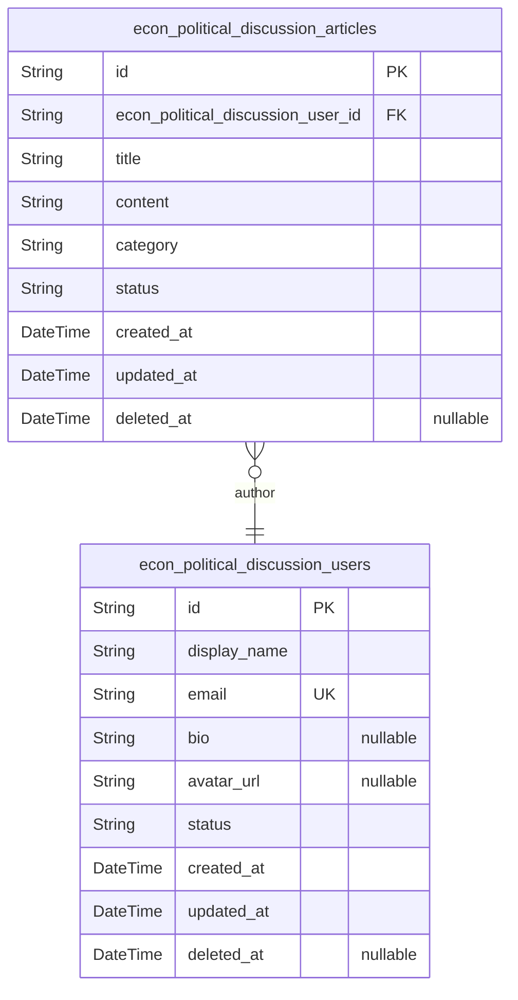
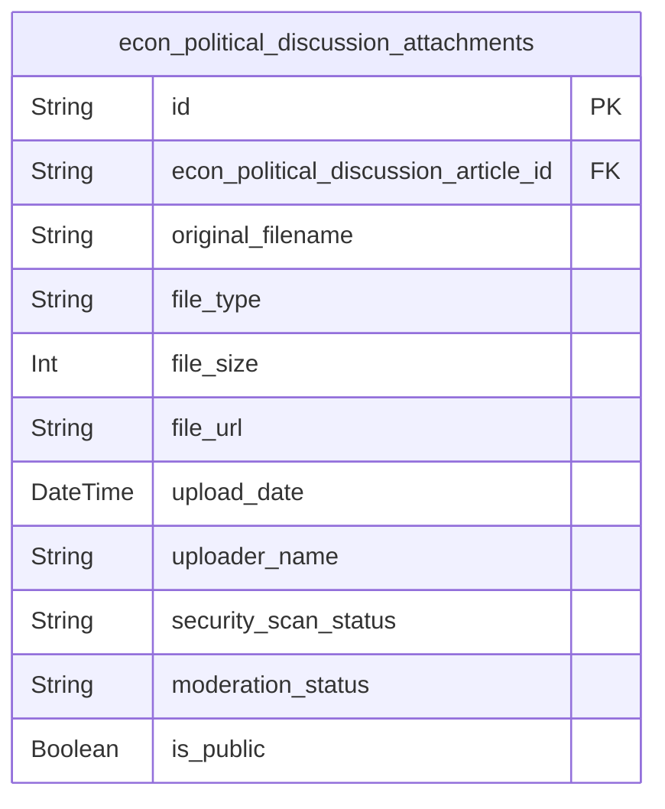

# Prisma Markdown

> Generated by [`prisma-markdown`](https://github.com/samchon/prisma-markdown)

- [CoreDiscussion](#corediscussion)
- [FileManagement](#filemanagement)

## CoreDiscussion

### `econ_political_discussion_articles`

Core discussion articles for economic and political topics.

Stores user-generated discussion posts focused on economic policies,
political developments, market analysis, and related topics. Each article
represents a primary discussion thread that users can create, edit, and
engage with independently.

Articles support rich content including title, detailed content, and
optional category classification for economic/political topics. The
system maintains full temporal tracking and supports soft deletion for
content management.

Each article links to a user author and can have multiple file
attachments through the established relationship with the attachment
system.

Properties as follows:

- `id`: Primary Key.
- `econ_political_discussion_user_id`
  > Author who created this article discussion. {@link
  > econ_political_discussion_users.id}.
- `title`: Article title for the discussion post. Descriptive topic heading.
- `content`
  > Full article content for the economic/political discussion. Rich text
  > content body.
- `category`
  > Topic category for economic/political classification (e.g., 'Economic
  > Policy', 'Political Analysis', 'Market Discussion').
- `status`: Article publication status. Default 'published' for active discussions.
- `created_at`: When this discussion article was originally created.
- `updated_at`: When this discussion article was last modified.
- `deleted_at`: Soft delete timestamp for archived or removed discussions.

### `econ_political_discussion_users`

Simple user profiles for discussion board participants.

Provides basic user identification and profile management for discussion
participants. Maintains minimal user concepts as requested for the simple
economic and political discussion board.

Users can create articles, build discussion profiles, and maintain basic
account information. The design focuses on simple author identification
rather than complex user management systems.

Supports standard profile fields including display name and optional bio,
with complete temporal tracking for account lifecycle management.

Properties as follows:

- `id`: Primary Key.
- `display_name`: User's display name for article authorship and community identification.
- `email`: User email address for account management and notifications.
- `bio`
  > Optional user biography describing interests or background in
  > economics/politics.
- `avatar_url`: Optional profile picture URL for user identification in discussions.
- `status`: User account status (active, suspended, etc.).
- `created_at`: When this user account was originally created.
- `updated_at`: When this user profile was last updated.
- `deleted_at`: Soft delete timestamp for deactivated user accounts.

## FileManagement

### `econ_political_discussion_attachments`

File and image attachments for economic and political discussion articles.

Stores uploaded files and images that users attach to their discussion
posts, supporting rich media content in economic and political discourse.
Each attachment includes comprehensive metadata for file management,
security scanning, and content moderation.

Supports multiple file types including images (JPG, PNG, GIF, WebP up to
5MB) and documents (PDF, DOC, DOCX, TXT up to 10MB). Files are associated
with specific discussion articles and include security scanning status
and access controls.

The table maintains file metadata including original filename, MIME type,
file size, and storage URL. All attachments are subject to content
moderation and security scanning before becoming publicly accessible.

Attachments remain associated with articles even if original content is
modified, providing historical context and supporting comprehensive
discussion threads with multimedia content.

Properties as follows:

- `id`: Primary Key.
- `econ_political_discussion_article_id`
  > Reference to the discussion article this attachment belongs to. {@link
  > econ_political_discussion_articles.id}.
- `original_filename`: Original filename as uploaded by the user.
- `file_type`
  > MIME type or file extension indicating the type of file (e.g.,
  > 'image/jpeg', 'application/pdf').
- `file_size`: File size in bytes for storage and bandwidth management.
- `file_url`: URL or path where the file is stored in the cloud storage system.
- `upload_date`: Timestamp when the file was uploaded to the system.
- `uploader_name`
  > Name of the user who uploaded the file for attribution and contact
  > purposes.
- `security_scan_status`
  > Status of security scanning: 'pending', 'clean', 'flagged', or
  > 'quarantined'.
- `moderation_status`
  > Content moderation status: 'pending', 'approved', 'rejected', or
  > 'requires_review'.
- `is_public`
  > Whether this file is publicly accessible or restricted to authorized
  > users only.
