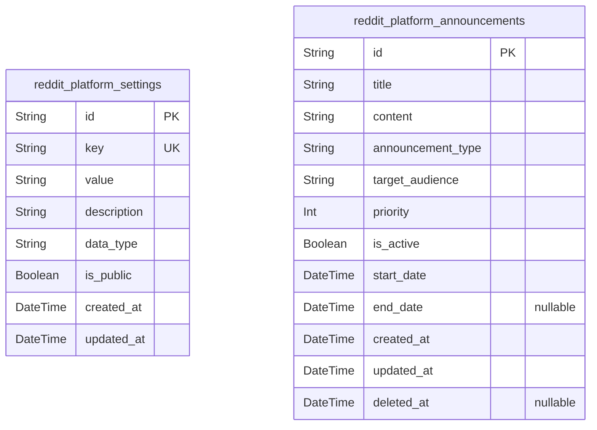
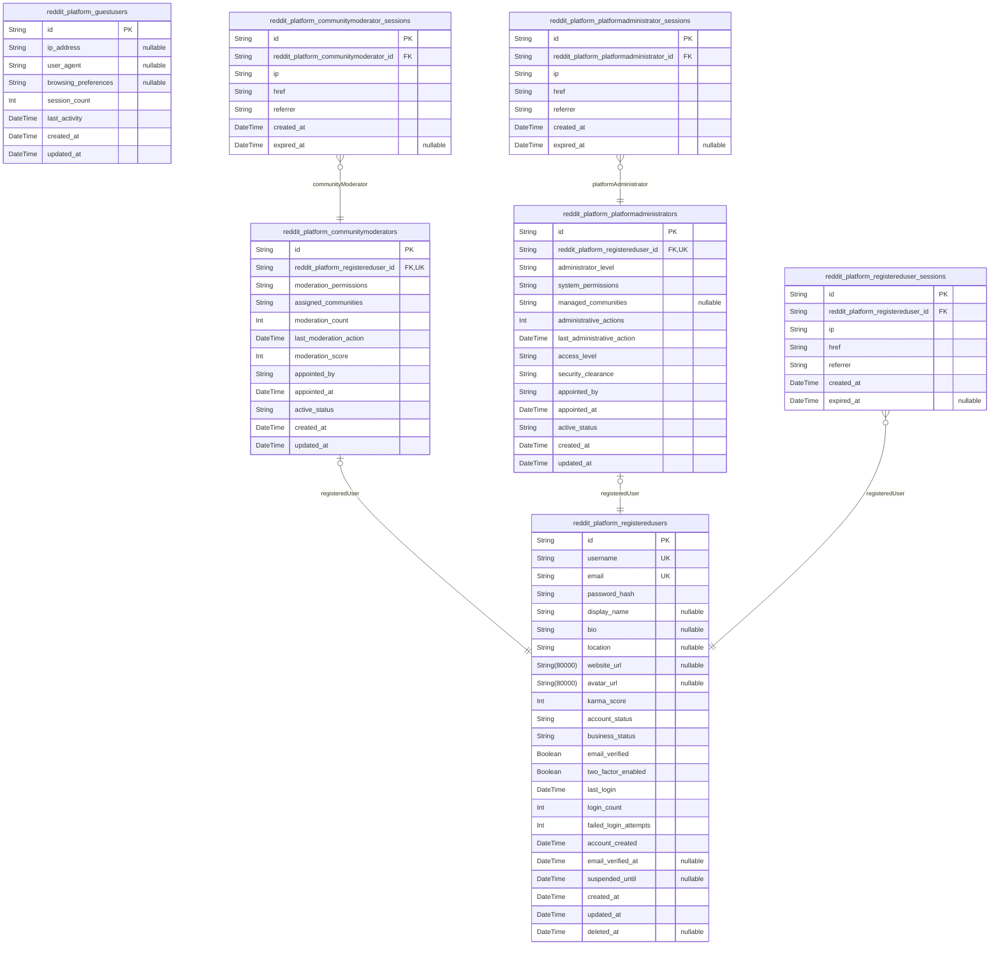
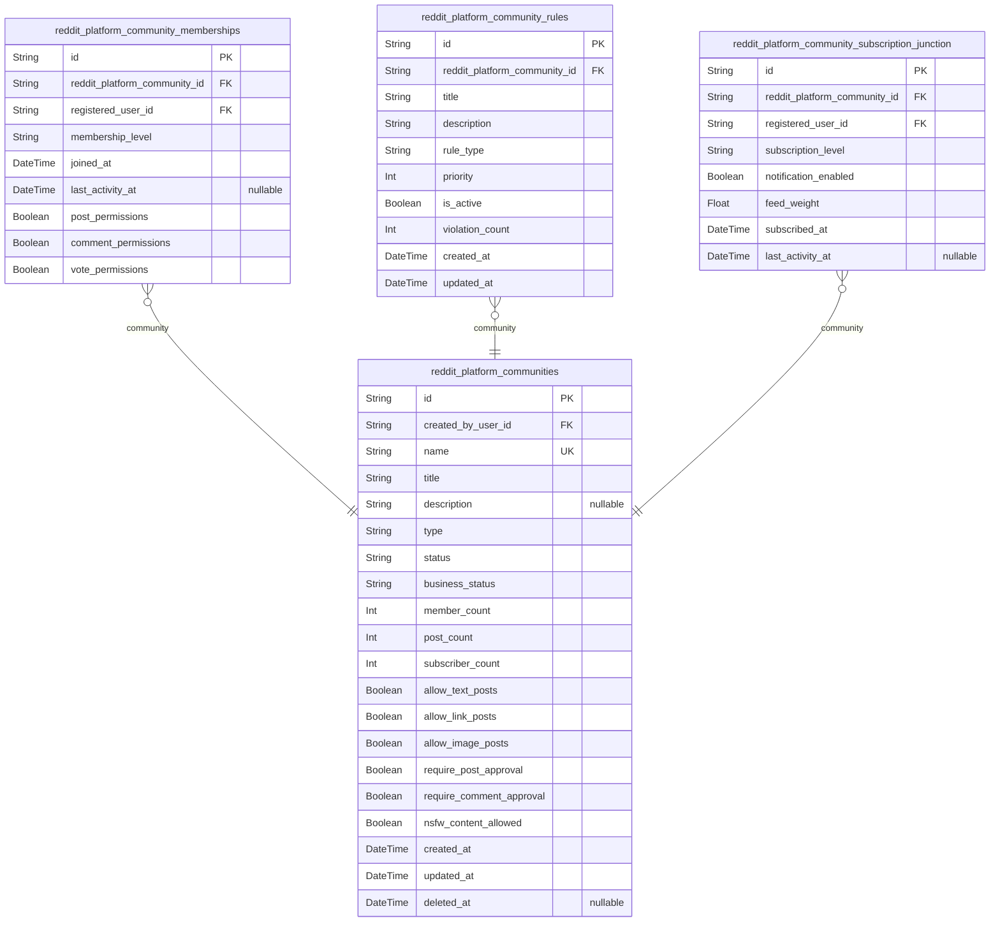
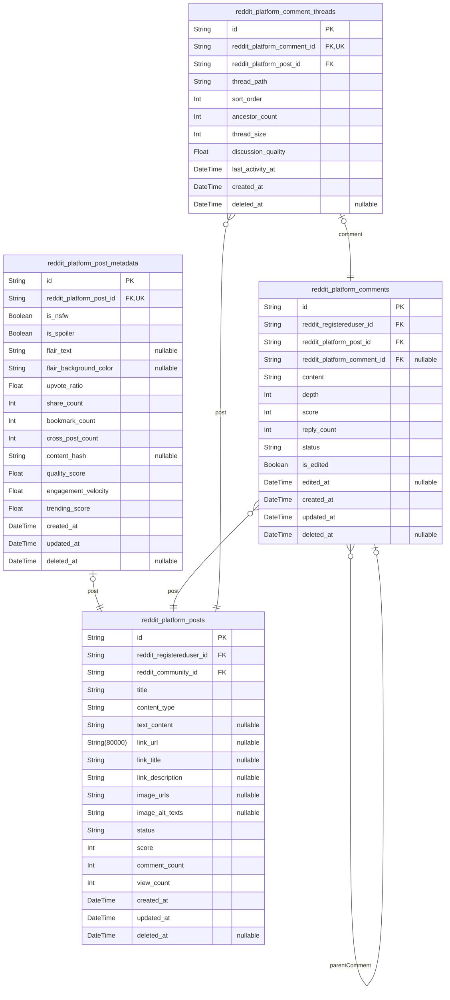
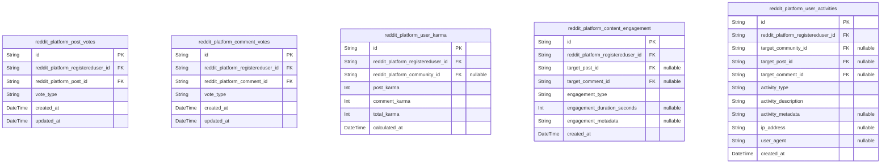
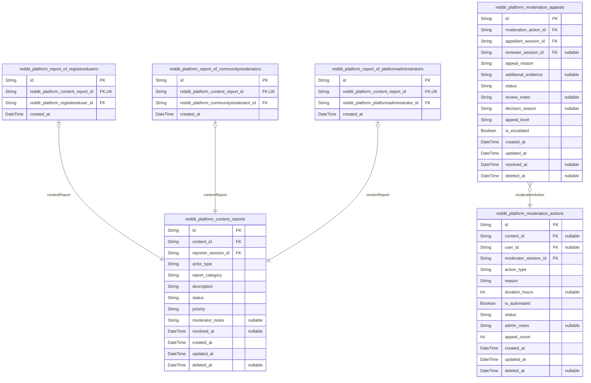
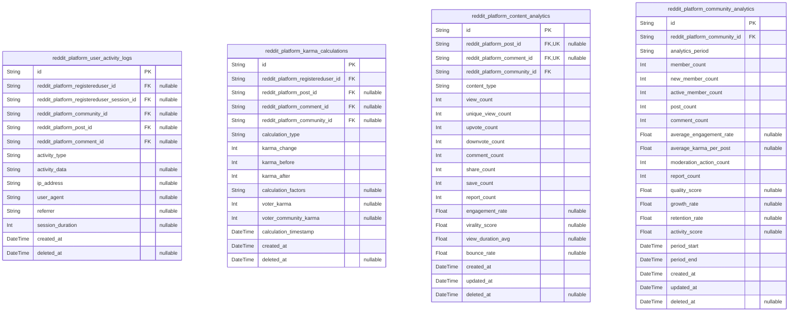

# Prisma Markdown

> Generated by [`prisma-markdown`](https://github.com/samchon/prisma-markdown)

- [Systematic](#systematic)
- [Actors](#actors)
- [Communities](#communities)
- [Content](#content)
- [Interactions](#interactions)
- [Moderation](#moderation)
- [Analytics](#analytics)

## Systematic

### `reddit_platform_settings`

Global platform configuration settings that control system-wide behavior
and features. Stores key-value pairs for configuration management
including feature flags, system limits, and platform-wide parameters.
Referenced by authentication services and content systems throughout the
platform.

Properties as follows:

- `id`: Primary Key.
- `key`
  > Unique configuration key identifier for platform settings (e.g.,
  > 'max_upload_size', 'default_timezone').
- `value`
  > Configuration value stored as string, can be parsed based on data_type
  > field.
- `description`
  > Human-readable description explaining what this setting controls and its
  > impact on the platform.
- `data_type`
  > Data type of the configuration value (string, number, boolean, json,
  > etc.) for proper validation and parsing.
- `is_public`
  > Whether this setting is visible to regular users in the interface or only
  > accessible to administrators.
- `created_at`: Timestamp when the setting was initially created.
- `updated_at`: Timestamp when the setting was last modified.

### `reddit_platform_announcements`

System-wide announcements and communications displayed to users across
the platform. Manages scheduled announcements, maintenance notices,
feature updates, and important notifications with targeting and timing
controls for different user audiences.

Removed the orphaned foreign key reference to
reddit_platform_registeredusers and changed stance from subsidiary to
primary, as announcements require independent user management
capabilities.

Properties as follows:

- `id`: Primary Key.
- `title`
  > Announcement title displayed prominently to users with maximum 200
  > characters.
- `content`
  > Full announcement content with detailed information, supporting up to
  > 10,000 characters.
- `announcement_type`
  > Type of announcement for categorization and display styling (info,
  > warning, maintenance, feature_update, etc.).
- `target_audience`
  > Target audience specification (all_users, registered_users,
  > community_moderators, platform_administrators).
- `priority`
  > Priority level for ordering announcements, higher numbers display first
  > (1-10 scale).
- `is_active`
  > Whether this announcement is currently active and should be displayed to
  > users.
- `start_date`: When this announcement should start being displayed to users.
- `end_date`: When this announcement should stop being displayed (null for indefinite).
- `created_at`: Timestamp when the announcement was initially created.
- `updated_at`: Timestamp when the announcement was last modified.
- `deleted_at`: Soft deletion timestamp for announcement management and audit trails.

## Actors

### `reddit_platform_guestusers`

Unauthenticated visitors who can browse public communities and content
without registration.

Represents individuals who access the platform without creating accounts.
Guest users have limited read-only access to public communities, posts,
and comments. They can browse trending content, discover communities, and
view public user information without authentication. Guest users are
encouraged to register for full platform participation including content
creation, voting, and commenting capabilities.

Guest browsing is essential for user acquisition and platform discovery.
These users contribute to public community visibility and can convert to
registered users through the platform's content quality and community
engagement features.

Properties as follows:

- `id`: Primary Key.
- `ip_address`: Guest user's IP address for session tracking and analytics.
- `user_agent`: Browser or device information for guest session identification.
- `browsing_preferences`: JSON field storing guest user's browsing preferences and interests.
- `session_count`: Number of guest sessions for analytics and engagement tracking.
- `last_activity`: Timestamp of last guest session activity for engagement tracking.
- `created_at`: Guest user creation timestamp for analytics and retention tracking.
- `updated_at`: Last update timestamp for guest user activity tracking.

### `reddit_platform_registeredusers`

Authenticated community members who can create content, vote, comment,
and participate in platform communities.

Core platform participants who have completed registration and email
verification. Registered users gain full platform access including
content creation (text, links, images), community participation through
voting and commenting, subscription management for personalized feeds,
and karma building through positive community engagement. They can create
communities, participate in discussions, and build reputation through
quality contributions.

This entity represents the primary user base and drives platform
engagement through active participation in communities, content
consumption, and social interactions that create value for the entire
platform ecosystem.

Properties as follows:

- `id`: Primary Key.
- `username`: Unique username for platform identification and @mention functionality.
- `email`: Email address for authentication, notifications, and password recovery.
- `password_hash`
  > Securely hashed password for authentication using industry-standard
  > algorithms.
- `display_name`: Public display name different from username for user recognition.
- `bio`
  > Personal description and interests for community connection and social
  > features.
- `location`: Optional geographic location for community discovery and local content.
- `website_url`
  > Personal or professional website link for profile enrichment and
  > verification.
- `avatar_url`: Profile picture URL for user identification and social features.
- `karma_score`
  > Total karma points earned through quality contributions and community
  > engagement.
- `account_status`: Account lifecycle status: active, suspended, banned, or restricted.
- `business_status`: Business workflow status for account management and activation processes.
- `email_verified`: Email verification status required for full platform access and features.
- `two_factor_enabled`: Two-factor authentication status for enhanced account security.
- `last_login`
  > Last successful login timestamp for activity tracking and engagement
  > analytics.
- `login_count`: Total number of successful logins for engagement and activity analytics.
- `failed_login_attempts`: Failed login attempt count for security monitoring and account protection.
- `account_created`
  > Original account creation timestamp for reputation and community standing
  > calculation.
- `email_verified_at`: Email verification completion timestamp for account activation tracking.
- `suspended_until`: Temporary suspension end date for account restriction management.
- `created_at`: Record creation timestamp for audit trails and compliance requirements.
- `updated_at`: Last update timestamp for change tracking and audit trail maintenance.
- `deleted_at`: Soft deletion timestamp for account recovery and compliance requirements.

### `reddit_platform_communitymoderators`

Trusted community members who help maintain community standards and
facilitate discussions within their assigned communities.

Registered users who have demonstrated consistent quality participation
and received community appointment as moderators. They inherit all
registered user capabilities plus enhanced community management tools
including content moderation (post and comment removal), user management
(warnings and temporary bans), community rule enforcement, and post
pinning capabilities. Moderators maintain community health, enforce
guidelines, and help resolve conflicts while building positive community
environments.

Community moderators serve as bridges between community members and
platform administrators, providing localized governance while maintaining
platform-wide standards and policies.

Properties as follows:

- `id`: Primary Key.
- `reddit_platform_registereduser_id`
  > Reference to base registered user account for authentication and profile
  > information. [reddit_platform_registeredusers.id](#reddit_platform_registeredusers)
- `moderation_permissions`
  > JSON field containing specific moderation capabilities and community
  > access levels.
- `assigned_communities`: JSON array of community IDs where user has moderation privileges.
- `moderation_count`
  > Total moderation actions performed for performance tracking and
  > accountability.
- `last_moderation_action`: Timestamp of most recent moderation activity for engagement tracking.
- `moderation_score`
  > Quality score based on moderation effectiveness and community
  > satisfaction.
- `appointed_by`: Identifier of user or system who appointed this moderator.
- `appointed_at`: Moderator appointment timestamp for authority tracking and accountability.
- `active_status`: Moderator status: active, inactive, suspended, or resigned.
- `created_at`: Record creation timestamp for audit trails and moderation history.
- `updated_at`: Last update timestamp for change tracking and permission updates.

### `reddit_platform_platformadministrators`

System operators with comprehensive oversight capabilities to ensure
platform integrity and policy enforcement across all communities.

Users with highest level of platform access and control. They inherit all
registered user and community moderator capabilities plus complete
platform management including user account management (suspensions and
bans), community oversight (creation, modification, suspension), content
removal across all communities, platform-wide policy enforcement, and
system configuration. Administrators handle escalations, compliance
matters, and ensure platform health while coordinating with community
moderators.

Platform administrators maintain platform integrity, enforce terms of
service, handle legal and compliance requirements, and serve as the final
authority for platform governance and user disputes.

Properties as follows:

- `id`: Primary Key.
- `reddit_platform_registereduser_id`
  > Reference to base registered user account for authentication and profile
  > information. [reddit_platform_registeredusers.id](#reddit_platform_registeredusers)
- `administrator_level`
  > Administrator privilege level: super_admin, admin, or moderator_admin for
  > permission hierarchy.
- `system_permissions`: JSON field containing system-level permissions and access capabilities.
- `managed_communities`: JSON array of community IDs with special administrative oversight.
- `administrative_actions`: Total administrative actions performed for audit and performance tracking.
- `last_administrative_action`: Timestamp of most recent administrative activity for audit trails.
- `access_level`
  > System access scope: global, regional, or community-specific
  > administrative access.
- `security_clearance`: Security clearance level for sensitive operations and compliance access.
- `appointed_by`: Identifier of higher-level administrator who granted these privileges.
- `appointed_at`
  > Administrator appointment timestamp for authority verification and
  > accountability.
- `active_status`: Administrator status: active, inactive, suspended, or terminated.
- `created_at`: Record creation timestamp for audit trails and compliance documentation.
- `updated_at`: Last update timestamp for change tracking and permission modifications.

### `reddit_platform_registereduser_sessions`

Session management for authenticated registered users to track login
activities and maintain secure access across the platform.

Tracks authenticated user sessions for registered users, providing secure
session management, activity logging, and user behavior analytics. Each
session records connection context including IP address, connection URL,
and referrer information for security monitoring and analytics. Sessions
have creation timestamps for audit trails and optional expiration
timestamps for automatic logout and security enforcement.

Sessions are subsidiary entities managed through identity flows and
provide essential audit tracing capabilities for security monitoring,
compliance requirements, and user activity analysis without requiring
independent API operations.

Properties as follows:

- `id`: Primary Key.
- `reddit_platform_registereduser_id`
  > Reference to authenticated registered user for session ownership and user
  > activity tracking. [reddit_platform_registeredusers.id](#reddit_platform_registeredusers)
- `ip`
  > User's IP address at session creation for security monitoring and
  > geographic analytics.
- `href`
  > Connection URL showing where user accessed the platform from for
  > analytics.
- `referrer`
  > Referrer URL indicating how user arrived at the platform for traffic
  > analysis.
- `created_at`: Session creation timestamp for audit trails and user activity tracking.
- `expired_at`: Session expiration timestamp for automatic logout and security management.

### `reddit_platform_communitymoderator_sessions`

Session management for authenticated community moderators to track
administrative activities and maintain secure access for moderation
tools.

Tracks authenticated user sessions specifically for community moderators,
providing enhanced security monitoring for users with elevated
privileges. Each session records detailed connection context including IP
address, connection URL, and referrer information for security monitoring
of moderator activities. Sessions include creation and expiration
timestamps for proper session lifecycle management and automatic logout
procedures.

Sessions are subsidiary entities managed through identity flows and
support audit tracing of moderation activities and administrative access
without requiring independent API operations, maintaining security and
accountability for privileged user actions.

Properties as follows:

- `id`: Primary Key.
- `reddit_platform_communitymoderator_id`
  > Reference to authenticated community moderator for session ownership and
  > moderation activity tracking. {@link
  > reddit_platform_communitymoderators.id}
- `ip`
  > Moderator's IP address for enhanced security monitoring and access
  > control.
- `href`
  > Connection URL showing moderator access point for security analytics and
  > monitoring.
- `referrer`
  > Referrer URL indicating how moderator accessed administrative interface
  > for security tracking.
- `created_at`
  > Session creation timestamp for audit trails and moderator activity
  > monitoring.
- `expired_at`
  > Session expiration timestamp for automatic logout and enhanced security
  > management.

### `reddit_platform_platformadministrator_sessions`

Session management for authenticated platform administrators to track
system access and maintain secure administrative operations.

Tracks authenticated user sessions for platform administrators with
highest security monitoring requirements. Each session records
comprehensive connection context including IP address, connection URL,
and referrer information for enhanced security monitoring and compliance
requirements. Sessions include creation and expiration timestamps for
strict session lifecycle management and automatic logout procedures to
maintain system security.

Sessions are subsidiary entities managed through identity flows and
provide critical audit tracing for administrative access and system
operations without requiring independent API operations, ensuring
accountability and security for platform management activities.

Properties as follows:

- `id`: Primary Key.
- `reddit_platform_platformadministrator_id`
  > Reference to authenticated platform administrator for session ownership
  > and administrative activity tracking. {@link
  > reddit_platform_platformadministrators.id}
- `ip`
  > Administrator's IP address for maximum security monitoring and compliance
  > tracking.
- `href`
  > Connection URL showing administrative access point for security analysis
  > and compliance.
- `referrer`
  > Referrer URL indicating administrative interface access source for
  > security monitoring.
- `created_at`
  > Session creation timestamp for comprehensive audit trails and
  > administrative activity monitoring.
- `expired_at`
  > Session expiration timestamp for automatic logout and maximum security
  > enforcement.

## Communities

### `reddit_platform_communities`

Main community entities (subreddits) where users create and engage with
content.

Stores the fundamental information for each community including name,
description, type, and settings. Communities can be public (anyone can
view and participate), restricted (anyone can view but participation
requires approval), or private (approval required for both viewing and
participation).

Each community has a creator who automatically becomes the initial
moderator with full management rights. Communities maintain subscriber
counts for feed personalization and community discovery algorithms.

Supports community rules management, member moderation capabilities, and
various community settings that control posting permissions, content
types, and user interactions.

Soft deletion is supported to maintain audit trails while allowing
community archiving when appropriate.

Properties as follows:

- `id`: Primary Key.
- `created_by_user_id`
  > User who created the community and becomes the initial moderator. {@link
  > reddit_platform_registeredusers.id}.
- `name`
  > Community name (2-25 characters, alphanumeric and underscores only,
  > unique platform-wide).
- `title`: Community title/display name (up to 100 characters).
- `description`: Community description explaining purpose and focus (up to 500 characters).
- `type`
  > Community access type: 'public' (open access), 'restricted' (view-only,
  > approval for participation), 'private' (approval required for all
  > access).
- `status`
  > Community operational status: 'active', 'restricted', 'archived',
  > 'banned'.
- `business_status`
  > Business workflow status for community management and moderation
  > workflows.
- `member_count`
  > Current number of members/users subscribed to this community (cached for
  > performance).
- `post_count`: Total number of posts created in this community (cached for performance).
- `subscriber_count`
  > Current number of users subscribed to this community (cached for feed
  > generation).
- `allow_text_posts`: Whether text posts are allowed in this community.
- `allow_link_posts`: Whether link posts are allowed in this community.
- `allow_image_posts`: Whether image posts are allowed in this community.
- `require_post_approval`: Whether new posts require moderator approval before appearing.
- `require_comment_approval`: Whether new comments require moderator approval before appearing.
- `nsfw_content_allowed`: Whether NSFW (not safe for work) content is allowed in this community.
- `created_at`: Timestamp when the community was created.
- `updated_at`: Timestamp when the community was last modified.
- `deleted_at`: Soft delete timestamp for community archival (null if active).

### `reddit_platform_community_memberships`

Tracks user membership and participation rights within communities.

Manages the relationship between users and communities for actual
membership/participation rather than just subscription for feeds.
Membership determines what users can do in a community (post, comment,
vote) while subscription only affects what appears in their personalized
feeds.

Supports different membership levels including approved members,
moderators, and banned users. Membership status affects user capabilities
within the community context.

Used for access control, community management, and determining user
privileges when interacting with community content. Essential for
implementing community-specific permissions and moderation workflows.

Properties as follows:

- `id`: Primary Key.
- `reddit_platform_community_id`
  > Community the user is associated with. {@link
  > reddit_platform_communities.id}.
- `registered_user_id`
  > User who is a member of the community. {@link
  > reddit_platform_registeredusers.id}.
- `membership_level`
  > User's membership level: 'subscriber' (basic subscription), 'member'
  > (approved participation), 'moderator' (moderation rights), 'banned' (no
  > access).
- `joined_at`: Timestamp when user joined or was granted membership in the community.
- `last_activity_at`: Timestamp of user's most recent activity in this community.
- `post_permissions`: Whether user can create posts in this community.
- `comment_permissions`: Whether user can comment on posts in this community.
- `vote_permissions`: Whether user can vote on content in this community.

### `reddit_platform_community_rules`

Community-specific rules and guidelines that govern user behavior and
content.

Stores the rules, guidelines, and policies that apply to each community.
These rules are enforced by community moderators and affect content
approval, user behavior standards, and community culture.

Rules can cover content requirements, posting guidelines, behavior
expectations, and community-specific policies. Each rule is tracked with
creation and modification timestamps for accountability and history.

Supports multiple rules per community with proper ordering and
categorization. Rules are displayed to users when they visit the
community and are referenced during content moderation decisions.

Properties as follows:

- `id`: Primary Key.
- `reddit_platform_community_id`: Community this rule belongs to. [reddit_platform_communities.id](#reddit_platform_communities).
- `title`: Rule title/summary (up to 100 characters).
- `description`: Detailed rule description and requirements (up to 1000 characters).
- `rule_type`
  > Type of rule: 'content' (what content is allowed), 'behavior' (user
  > conduct), 'posting' (posting requirements), 'moderation' (enforcement
  > policies).
- `priority`
  > Rule priority for display and enforcement order (higher numbers = higher
  > priority).
- `is_active`: Whether this rule is currently active and being enforced.
- `violation_count`
  > Number of times this rule has been cited in moderation actions (for
  > tracking effectiveness).
- `created_at`: Timestamp when this rule was created.
- `updated_at`: Timestamp when this rule was last modified.

### `reddit_platform_community_subscription_junction`

Many-to-many junction table managing user subscriptions to communities
for personalized feed generation.

Handles the relationship between users and communities for feed
personalization purposes. When users subscribe to a community, content
from that community appears in their personalized homepage feed based on
their subscription preferences.

Subscription is distinct from membership - subscription controls what
content appears in feeds while membership determines what users can
actually do in the community (post, comment, vote).

Supports subscription preferences including notification settings,
content filtering, and feed weighting. Essential for implementing
personalized content discovery and community-based content aggregation
algorithms.

Properties as follows:

- `id`: Primary Key.
- `reddit_platform_community_id`
  > Community the user is subscribed to. {@link
  > reddit_platform_communities.id}.
- `registered_user_id`
  > User who is subscribed to the community. {@link
  > reddit_platform_registeredusers.id}.
- `subscription_level`
  > Subscription level: 'full' (all content), 'digest' (periodic summaries),
  > 'mute' (hidden from feed).
- `notification_enabled`: Whether user receives notifications for new posts in this community.
- `feed_weight`: Relative weight of this community's content in user's feed (0.1-2.0).
- `subscribed_at`: Timestamp when user subscribed to the community.
- `last_activity_at`
  > Timestamp of user's most recent interaction with content from this
  > community.

## Content

### `reddit_platform_posts`

Core post content table storing user-generated content in communities.
Supports multiple content types (text, links, images) with comprehensive
metadata tracking. Posts are the primary content units that users create
to share information, start discussions, or contribute to communities.
Each post belongs to a specific community and has an author. Posts
support voting, commenting, and moderation workflows with status tracking
for content lifecycle management.

Properties as follows:

- `id`: Primary Key.
- `reddit_registereduser_id`: Author who created the post. References reddit_platform_registeredusers.id
- `reddit_community_id`
  > Community where post is published. References
  > reddit_platform_communities.id
- `title`
  > Post title (5-300 characters). Required for all post types to provide
  > content overview.
- `content_type`
  > Content type: 'text', 'link', 'image'. Determines how content is
  > processed and displayed.
- `text_content`
  > Text content for text posts (up to 40,000 characters). Null for non-text
  > posts.
- `link_url`: External URL for link posts. Null for non-link posts.
- `link_title`: Title extracted from linked URL for link posts. Null for non-link posts.
- `link_description`
  > Description extracted from linked URL for link posts. Null for non-link
  > posts.
- `image_urls`: JSON array of image URLs for image posts. Null for non-image posts.
- `image_alt_texts`: JSON array of alt-text for accessibility. Null for non-image posts.
- `status`
  > Post status: 'active', 'removed', 'locked', 'hidden'. Controls post
  > visibility and moderation workflow.
- `score`
  > Vote score (upvotes - downvotes). Updated in real-time through voting
  > system.
- `comment_count`
  > Total number of comments on this post. Updated as comments are
  > added/removed.
- `view_count`: Number of times post has been viewed. Tracked for engagement analytics.
- `created_at`: Timestamp when post was created.
- `updated_at`: Timestamp when post was last updated (edited).
- `deleted_at`: Timestamp when post was soft-deleted. Null for active posts.

### `reddit_platform_post_metadata`

Additional metadata and tracking information for posts. Stores secondary
data that supports post functionality but isn't part of core content.
Includes engagement metrics, content analysis, and platform-specific
features. Supports complete audit trails with soft deletion capabilities
and temporal tracking.

Properties as follows:

- `id`: Primary Key.
- `reddit_platform_post_id`: Associated post. One-to-one relationship with reddit_platform_posts.id
- `is_nsfw`
  > Whether post contains Not Safe For Work content. Used for content
  > filtering and warnings.
- `is_spoiler`
  > Whether post contains spoiler content. Used for spoiler warnings and
  > hiding.
- `flair_text`
  > Community-specific flair text for post categorization. Optional community
  > feature.
- `flair_background_color`: Background color for post flair. Null if no flair or no custom color.
- `upvote_ratio`
  > Ratio of upvotes to total votes (0.0-1.0). Shows community sentiment
  > toward post.
- `share_count`: Number of times post has been shared externally. Tracks content virality.
- `bookmark_count`: Number of users who bookmarked/saved post. Indicates post value for users.
- `cross_post_count`: Number of times this post has been cross-posted to other communities.
- `content_hash`
  > SHA-256 hash of post content for duplicate detection. Null for external
  > links.
- `quality_score`
  > Automated content quality score (0.0-1.0) based on engagement and
  > community feedback.
- `engagement_velocity`: Rate of engagement (votes + comments per hour) for algorithm calculations.
- `trending_score`: Calculated trending score for hot algorithm and discovery features.
- `created_at`: Timestamp when metadata was created.
- `updated_at`: Timestamp when metadata was last updated.
- `deleted_at`: Timestamp when metadata was soft-deleted. Null for active metadata.

### `reddit_platform_comments`

User-generated discussion content attached to posts. Comments enable
threaded conversations and community interaction. Support nested replies
up to 10 levels deep with voting, editing, and moderation. Comments have
shorter lifecycle than posts and are primarily used for direct
interaction and discussion rather than standalone content sharing.

Properties as follows:

- `id`: Primary Key.
- `reddit_registereduser_id`
  > User who created the comment. References
  > reddit_platform_registeredusers.id
- `reddit_platform_post_id`: Post this comment is attached to. References reddit_platform_posts.id
- `reddit_platform_comment_id`
  > Parent comment for replies. Null for top-level comments. References
  > reddit_platform_comments.id
- `content`
  > Comment text content (up to 10,000 characters). Rich text support with
  > basic formatting.
- `depth`
  > Nesting depth level (0 for top-level, increases for replies). Used for
  > visual indentation.
- `score`
  > Vote score (upvotes - downvotes). Updated in real-time through voting
  > system.
- `reply_count`: Number of direct replies to this comment. Used for comment tree expansion.
- `status`
  > Comment status: 'active', 'removed', 'hidden', 'collapsed'. Controls
  > visibility and moderation.
- `is_edited`
  > Whether comment has been edited after original creation. Used for edit
  > indicators.
- `edited_at`: Timestamp when comment was last edited. Null if never edited.
- `created_at`: Timestamp when comment was created.
- `updated_at`: Timestamp when comment was last updated.
- `deleted_at`: Timestamp when comment was soft-deleted. Null for active comments.

### `reddit_platform_comment_threads`

Comment threading and relationship management table. Optimizes nested
comment retrieval and display by pre-computing thread hierarchies. Stores
comment tree structures for efficient traversal and display with complete
audit trail support. Managed through comment operations to maintain
thread integrity and performance.

Properties as follows:

- `id`: Primary Key.
- `reddit_platform_comment_id`
  > Comment this thread record represents. One-to-one with
  > reddit_platform_comments.id
- `reddit_platform_post_id`: Post this comment thread belongs to. References reddit_platform_posts.id
- `thread_path`
  > Path string representing comment hierarchy (e.g., "1.2.3.1") for
  > efficient tree traversal.
- `sort_order`
  > Display order within same level, calculated based on score and time for
  > optimal conversation flow.
- `ancestor_count`
  > Number of ancestor comments in thread path (depth). Used for display
  > optimization.
- `thread_size`
  > Total number of comments in this thread subtree. Used for collapsed
  > display decisions.
- `discussion_quality`
  > Thread discussion quality score based on engagement patterns and
  > community feedback.
- `last_activity_at`
  > Timestamp of most recent activity in this thread subtree. Used for
  > activity-based sorting.
- `created_at`: Timestamp when thread record was created.
- `deleted_at`
  > Timestamp when thread record was soft-deleted. Null for active thread
  > records.

## Interactions

### `reddit_platform_post_votes`

User voting records for posts enabling democratic content curation and
user engagement tracking. Stores individual user votes (upvote/downvote)
on posts with timestamp tracking to support karma calculation, content
ranking algorithms, and vote history analysis. Users can change their
votes which updates both the vote record and content scores in real-time.

Properties as follows:

- `id`: Primary Key.
- `reddit_platform_registereduser_id`
  > Registered user who cast the vote. {@link
  > reddit_platform_registeredusers.id}
- `reddit_platform_post_id`: Post being voted on. [reddit_platform_posts.id](#reddit_platform_posts)
- `vote_type`
  > Type of vote cast: 'upvote' or 'downvote'. Determines impact on content
  > score and user karma.
- `created_at`
  > Timestamp when the vote was cast. Used for vote history and time-based
  > analytics.
- `updated_at`: Timestamp when the vote was last modified (for vote changes).

### `reddit_platform_comment_votes`

User voting records for comments supporting nested discussion quality
control and user reputation systems. Captures individual user votes on
comments with relationship tracking to parent posts and communities.
Enables comment ranking within threads and contributes to overall user
karma scores through comment engagement metrics.

Properties as follows:

- `id`: Primary Key.
- `reddit_platform_registereduser_id`
  > Registered user who cast the vote. {@link
  > reddit_platform_registeredusers.id}
- `reddit_platform_comment_id`: Comment being voted on. [reddit_platform_comments.id](#reddit_platform_comments)
- `vote_type`
  > Type of vote cast: 'upvote' or 'downvote'. Affects comment visibility and
  > user karma calculation.
- `created_at`
  > Timestamp when the vote was cast. Used for comment ranking algorithms and
  > engagement analysis.
- `updated_at`: Timestamp when the vote was last modified for vote changes.

### `reddit_platform_user_karma`

Time-series karma tracking for users across posts and comments with
optional community-specific breakdown. Stores calculated karma scores
that reflect user reputation and community contribution quality. Supports
historical karma analysis, community-specific reputation tracking, and
karma-based platform privileges and content visibility algorithms.

Properties as follows:

- `id`: Primary Key.
- `reddit_platform_registereduser_id`
  > User whose karma is being tracked. {@link
  > reddit_platform_registeredusers.id}
- `reddit_platform_community_id`
  > Optional community-specific karma tracking. Null for overall platform
  > karma. [reddit_platform_communities.id](#reddit_platform_communities)
- `post_karma`
  > Karma earned from post upvotes/downvotes. Calculated as sum of post vote
  > scores.
- `comment_karma`
  > Karma earned from comment upvotes/downvotes. Calculated as sum of comment
  > vote scores.
- `total_karma`
  > Total karma score (post_karma + comment_karma). Primary reputation metric
  > displayed on profiles.
- `calculated_at`
  > Timestamp when karma was last calculated/updated. Enables historical
  > karma tracking.

### `reddit_platform_content_engagement`

Comprehensive engagement metrics tracking for posts and comments
including views, time spent, and interaction patterns. Supports content
discovery algorithms, engagement-based content ranking, and platform
analytics. Tracks how users interact with content beyond voting to
understand engagement quality and content performance for recommendation
systems.

Properties as follows:

- `id`: Primary Key.
- `reddit_platform_registereduser_id`: User engaging with the content. [reddit_platform_registeredusers.id](#reddit_platform_registeredusers)
- `target_post_id`
  > Post being engaged with. Null if engaging with comment. {@link
  > reddit_platform_posts.id}
- `target_comment_id`
  > Comment being engaged with. Null if engaging with post. {@link
  > reddit_platform_comments.id}
- `engagement_type`
  > Type of engagement: 'view', 'scroll', 'share', 'save',
  > 'click_external_link'. Categorizes different interaction types.
- `engagement_duration_seconds`
  > Time spent engaging with content in seconds. Used for engagement quality
  > scoring.
- `engagement_metadata`
  > JSON metadata for engagement-specific data (scroll depth, click
  > coordinates, etc.).
- `created_at`: Timestamp of engagement occurrence. Used for engagement pattern analysis.

### `reddit_platform_user_activities`

Comprehensive user activity tracking for platform analytics, behavior
analysis, and personalized recommendations. Logs all significant user
actions including content creation, community participation, social
interactions, and platform usage patterns. Enables understanding of user
engagement patterns, content consumption behavior, and platform usage
optimization for enhanced user experience.

Properties as follows:

- `id`: Primary Key.
- `reddit_platform_registereduser_id`: User performing the activity. [reddit_platform_registeredusers.id](#reddit_platform_registeredusers)
- `target_community_id`
  > Community involved in the activity. Null for platform-wide activities.
  > [reddit_platform_communities.id](#reddit_platform_communities)
- `target_post_id`
  > Post involved in the activity. Null if activity doesn't target specific
  > post. [reddit_platform_posts.id](#reddit_platform_posts)
- `target_comment_id`
  > Comment involved in the activity. Null if activity doesn't target
  > specific comment. [reddit_platform_comments.id](#reddit_platform_comments)
- `activity_type`
  > Type of activity: 'post_created', 'comment_created', 'post_voted',
  > 'comment_voted', 'community_subscribed', 'community_unsubscribed',
  > 'profile_viewed', 'content_shared', 'session_started', 'session_ended'.
  > Categorizes user actions.
- `activity_description`: Human-readable description of the activity for analytics and debugging.
- `activity_metadata`
  > JSON metadata containing activity-specific details (vote type, content
  > title, etc.).
- `ip_address`
  > IP address of user when activity occurred. Used for security and
  > geographic analysis.
- `user_agent`
  > User agent string for device and browser tracking. Used for analytics and
  > optimization.
- `created_at`
  > Timestamp when the activity occurred. Primary temporal reference for
  > activity analysis.

## Moderation

### `reddit_platform_content_reports`

Content reports submitted by users for policy violations and community
guidelines.

Serves as the main entity for the polymorphic reporting system, storing
shared report attributes and actor type information. Reports can be
submitted by registered users, community moderators, or platform
administrators, with each actor type having specific contextual data
stored in corresponding subtype entities.

Reports track content violations including spam, harassment,
misinformation, NSFW content, and community rule violations. Each report
includes detailed information about the violation, evidence, and
processing status through the moderation workflow.

Soft deletion support maintains audit trails while allowing content
moderation. Reports are critical for maintaining community standards and
platform safety through user-driven content oversight.

Properties as follows:

- `id`: Primary Key.
- `content_id`: Reported post content. [reddit_platform_posts.id](#reddit_platform_posts)
- `reporter_session_id`
  > Session that submitted the report. {@link
  > reddit_platform_registereduser_sessions.id}
- `actor_type`
  > Type of actor submitting report: 'registered_user',
  > 'community_moderator', 'platform_administrator'
- `report_category`
  > Category of violation: spam, harassment, hate_speech, misinformation,
  > nsfw, copyright, community_rule_violation, other
- `description`: Detailed description of the violation and evidence
- `status`
  > Report processing status: pending, under_review, resolved, dismissed,
  > escalated
- `priority`: Report priority level: low, medium, high, critical
- `moderator_notes`: Internal notes from moderators reviewing the report
- `resolved_at`: Timestamp when report was resolved
- `created_at`: Timestamp when report was submitted
- `updated_at`: Timestamp when report was last modified
- `deleted_at`: Soft deletion timestamp for audit trail

### `reddit_platform_report_of_registeredusers`

Registered user submitted content reports with user-specific context.

Subtype entity storing additional contextual information for reports
submitted by registered platform users. Contains user identification and
session details specific to registered users, maintaining 1:1
relationship with the main content_reports entity.

Registered user reports are the most common type, representing
community-driven content oversight. These reports include user
authentication details and session context for tracking and
accountability purposes.

Managed through content reporting APIs and interfaces, not independently
created. Supports the platform's community-driven moderation approach by
enabling regular users to report violations.

Properties as follows:

- `id`: Primary Key.
- `reddit_platform_content_report_id`: Associated content report. [reddit_platform_content_reports.id](#reddit_platform_content_reports)
- `reddit_platform_registereduser_id`
  > Registered user submitting the report. {@link
  > reddit_platform_registeredusers.id}
- `created_at`: Timestamp when report was submitted by registered user

### `reddit_platform_report_of_communitymoderators`

Community moderator submitted content reports with moderator-specific
context.

Subtype entity storing additional contextual information for reports
submitted by community moderators. Contains moderator identification and
session details specific to moderator users, maintaining 1:1 relationship
with the main content_reports entity.

Community moderator reports carry higher authority and priority in the
moderation workflow, representing professional content oversight within
specific communities. These reports include both user identification and
community context for proper routing and escalation.

Managed through moderator interfaces and APIs, not independently created.
Supports the platform's hierarchical moderation approach by enabling
community representatives to escalate issues.

Properties as follows:

- `id`: Primary Key.
- `reddit_platform_content_report_id`: Associated content report. [reddit_platform_content_reports.id](#reddit_platform_content_reports)
- `reddit_platform_communitymoderator_id`
  > Community moderator submitting the report. {@link
  > reddit_platform_communitymoderators.id}
- `created_at`: Timestamp when report was submitted by community moderator

### `reddit_platform_report_of_platformadministrators`

Platform administrator submitted content reports with admin-specific
context.

Subtype entity storing additional contextual information for reports
submitted by platform administrators. Contains administrator
identification and session details specific to admin users, maintaining
1:1 relationship with the main content_reports entity.

Platform administrator reports represent the highest authority level in
the moderation system, typically used for platform-wide policy
violations, legal compliance issues, or emergency content removal. These
reports include full administrative context and override community-level
moderation decisions.

Managed through administrative interfaces and APIs, not independently
created. Supports the platform's ultimate oversight authority and
emergency response capabilities.

Properties as follows:

- `id`: Primary Key.
- `reddit_platform_content_report_id`: Associated content report. [reddit_platform_content_reports.id](#reddit_platform_content_reports)
- `reddit_platform_platformadministrator_id`
  > Platform administrator submitting the report. {@link
  > reddit_platform_platformadministrators.id}
- `created_at`: Timestamp when report was submitted by platform administrator

### `reddit_platform_moderation_actions`

Moderation actions taken on content and users for policy violations.

Tracks enforcement actions including content removal, user warnings,
suspensions, and bans. Records details about the violation, action taken,
duration, and administrative notes for transparency and accountability.

Actions support graduated response system from warnings to permanent
bans, with proper documentation and appeal processes. Each action
includes moderator identification and reasoning for consistency and
oversight.

Critical for maintaining community standards and platform safety through
documented enforcement mechanisms. Supports both automated and manual
moderation workflows with proper audit trails.

Properties as follows:

- `id`: Primary Key.
- `content_id`
  > Content affected by action (null for user-only actions). {@link
  > reddit_platform_posts.id}
- `user_id`
  > User affected by action (null for content-only actions). {@link
  > reddit_platform_registeredusers.id}
- `moderator_session_id`
  > Moderator session taking the action. {@link
  > reddit_platform_communitymoderator_sessions.id}
- `action_type`
  > Type of moderation action: content_removal, user_warning, content_lock,
  > user_suspension, user_ban, community_quarantine
- `reason`: Detailed reason for the action taken
- `duration_hours`: Duration for temporary actions in hours (null for permanent actions)
- `is_automated`: Whether action was taken automatically by system
- `status`: Action status: active, expired, overturned, pending_appeal
- `admin_notes`: Internal administrative notes and context
- `appeal_count`: Number of appeals filed against this action
- `created_at`: Timestamp when action was taken
- `updated_at`: Timestamp when action was last modified
- `deleted_at`: Soft deletion timestamp for audit trail

### `reddit_platform_moderation_appeals`

Appeals filed against moderation decisions for fairness and transparency.

Provides formal process for users to contest moderation actions including
content removals, user warnings, suspensions, and bans. Each appeal
includes detailed reasoning, evidence, and review status through the
appeal workflow.

Appeals support the platform's commitment to fair moderation and user
rights, with structured review processes and clear resolution
communication. Multiple appeal levels allow for thorough review and
escalation when necessary.

Critical for maintaining user trust and platform fairness through
documented appeal processes and transparency in moderation decisions.
Supports both content-related and user-related moderation appeals.

Properties as follows:

- `id`: Primary Key.
- `moderation_action_id`
  > Moderation action being appealed. {@link
  > reddit_platform_moderation_actions.id}
- `appellant_session_id`
  > User session filing the appeal. {@link
  > reddit_platform_registereduser_sessions.id}
- `reviewer_session_id`
  > Administrator session reviewing the appeal (null until assigned). {@link
  > reddit_platform_platformadministrator_sessions.id}
- `appeal_reason`: Detailed reason for appealing the moderation action
- `additional_evidence`: Additional evidence or context provided with appeal
- `status`
  > Appeal status: pending, under_review, approved, denied, withdrawn,
  > escalated
- `review_notes`: Review notes and decision rationale from administrators
- `decision_reason`: Final decision and reasoning for appeal resolution
- `appeal_level`: Appeal level: initial, secondary, final
- `is_escalated`: Whether appeal was escalated to higher level review
- `created_at`: Timestamp when appeal was filed
- `updated_at`: Timestamp when appeal was last modified
- `resolved_at`: Timestamp when appeal was resolved
- `deleted_at`: Soft deletion timestamp for audit trail

## Analytics

### `reddit_platform_user_activity_logs`

Comprehensive user behavior tracking and activity analytics for platform
optimization.

Stores detailed logs of user interactions, session data, page views, and
behavioral patterns to enable platform optimization and user experience
improvements. Each log entry captures specific user actions, timestamps,
contextual information, and session details for comprehensive behavioral
analysis.

This analytics table supports understanding user engagement patterns,
identifying popular features, detecting usage trends, and optimizing
platform performance based on actual user behavior rather than
assumptions.

Links to user accounts and sessions through foreign key relationships for
comprehensive user activity tracking.

Properties as follows:

- `id`: Primary Key.
- `reddit_platform_registereduser_id`: Associated registered user's [reddit_platform_registeredusers.id](#reddit_platform_registeredusers).
- `reddit_platform_registereduser_session_id`
  > Associated user session's {@link
  > reddit_platform_registereduser_sessions.id}.
- `reddit_platform_community_id`
  > Associated community's [reddit_platform_communities.id](#reddit_platform_communities) if activity
  > is community-specific.
- `reddit_platform_post_id`
  > Associated post's [reddit_platform_posts.id](#reddit_platform_posts) if activity is
  > post-specific.
- `reddit_platform_comment_id`
  > Associated comment's [reddit_platform_comments.id](#reddit_platform_comments) if activity is
  > comment-specific.
- `activity_type`
  > Type of user activity: page_view, post_view, comment_view, vote,
  > post_create, comment_create, subscription, unsubscribe, search,
  > profile_view, community_browse.
- `activity_data`
  > JSON data containing detailed activity information, metadata, and context
  > specific to the activity type.
- `ip_address`
  > User's IP address at time of activity for geographic and security
  > analytics.
- `user_agent`: User agent string for device and browser analytics.
- `referrer`: Referrer URL showing how user arrived at the page or action.
- `session_duration`
  > Session duration in seconds for session analytics and engagement
  > measurement.
- `created_at`: Activity timestamp for time-series analytics and trend analysis.
- `deleted_at`: Soft delete timestamp for data retention compliance and cleanup.

### `reddit_platform_karma_calculations`

Historical karma calculation tracking and reputation system analytics.

Maintains comprehensive records of karma calculations, changes, and
reputation system analytics to support user reputation management, karma
algorithm optimization, and community trust metrics. Each calculation
record captures the factors, source data, and reasoning behind karma
score changes.

This analytics table enables tracking user reputation trends, analyzing
karma algorithm effectiveness, understanding community trust patterns,
and providing transparency into reputation systems for both users and
administrators.

Supports reputation analysis, karma algorithm validation, and trust
metric calculations through detailed calculation tracking.

Properties as follows:

- `id`: Primary Key.
- `reddit_platform_registereduser_id`
  > User whose karma was calculated in {@link
  > reddit_platform_registeredusers.id}.
- `reddit_platform_post_id`
  > Associated post if karma change was from [reddit_platform_posts.id](#reddit_platform_posts)
  > votes.
- `reddit_platform_comment_id`
  > Associated comment if karma change was from {@link
  > reddit_platform_comments.id} votes.
- `reddit_platform_community_id`
  > Community context for community-specific karma changes in {@link
  > reddit_platform_communities.id}.
- `calculation_type`
  > Type of karma calculation: vote_received, vote_cast, moderation_bonus,
  > penalty, community_karma, total_update.
- `karma_change`: Karma point change (positive or negative) resulting from this calculation.
- `karma_before`: User's karma score before this calculation.
- `karma_after`: User's karma score after this calculation.
- `calculation_factors`
  > JSON data containing calculation factors, weights, and algorithm
  > parameters used.
- `voter_karma`: Karma of the user who cast the vote (if applicable) for vote weighting.
- `voter_community_karma`
  > Voter's karma specifically in the relevant community for community
  > weighting.
- `calculation_timestamp`: Precise timestamp when the karma calculation was performed.
- `created_at`: Record creation timestamp for analytics and audit purposes.
- `deleted_at`: Soft delete timestamp for data retention policies.

### `reddit_platform_content_analytics`

Content performance tracking and engagement analytics for optimization.

Comprehensive content analytics tracking engagement metrics, performance
indicators, and user interaction patterns to support content
optimization, recommendation algorithms, and creator insights. Each
record captures detailed performance metrics and engagement data for
posts and comments.

This analytics table enables understanding content performance trends,
optimizing recommendation algorithms, providing creator analytics,
identifying high-performing content patterns, and supporting data-driven
content strategy decisions.

Supports content performance analysis, creator feedback systems, and
algorithm optimization through detailed engagement tracking.

Properties as follows:

- `id`: Primary Key.
- `reddit_platform_post_id`: Associated post's [reddit_platform_posts.id](#reddit_platform_posts) for post analytics.
- `reddit_platform_comment_id`
  > Associated comment's [reddit_platform_comments.id](#reddit_platform_comments) for comment
  > analytics.
- `reddit_platform_community_id`
  > Associated community's [reddit_platform_communities.id](#reddit_platform_communities) for
  > community context.
- `content_type`: Type of content: post_text, post_link, post_image, post_video, comment.
- `view_count`: Total number of content views and impressions.
- `unique_view_count`: Number of unique users who viewed the content.
- `upvote_count`: Current upvote count for engagement measurement.
- `downvote_count`: Current downvote count for engagement measurement.
- `comment_count`: Total number of comments on this content.
- `share_count`: Number of times content was shared or cross-posted.
- `save_count`: Number of users who saved/bookmarked this content.
- `report_count`: Number of user reports filed against this content.
- `engagement_rate`
  > Calculated engagement rate (interactions / views) for performance
  > analysis.
- `virality_score`: Virality coefficient based on sharing and cross-community spread.
- `view_duration_avg`: Average time users spent viewing this content.
- `bounce_rate`: Percentage of users who viewed and immediately left.
- `created_at`: Content creation timestamp for time-series analysis.
- `updated_at`: Last analytics update timestamp for tracking data freshness.
- `deleted_at`: Soft delete timestamp when content is removed.

### `reddit_platform_community_analytics`

Community health metrics and growth analytics for community management.

Tracks comprehensive community performance metrics, health indicators,
growth statistics, and engagement patterns to support community
management, growth strategies, and health monitoring. Each record
provides detailed analytics for specific time periods and community
activities.

This analytics table enables monitoring community health trends,
identifying growth opportunities, optimizing community management
strategies, understanding member engagement patterns, and supporting
data-driven community governance decisions.

Supports community performance analysis, growth tracking, health
monitoring, and management optimization through comprehensive metrics.

Properties as follows:

- `id`: Primary Key.
- `reddit_platform_community_id`
  > Associated community's [reddit_platform_communities.id](#reddit_platform_communities) for
  > community-specific analytics.
- `analytics_period`: Time period for analytics: daily, weekly, monthly, quarterly, yearly.
- `member_count`: Total number of community members at period end.
- `new_member_count`: Number of new members added during this period.
- `active_member_count`: Number of members with meaningful activity during this period.
- `post_count`: Total number of posts created during this period.
- `comment_count`: Total number of comments created during this period.
- `average_engagement_rate`: Average engagement rate across all community content.
- `average_karma_per_post`: Average karma earned per post for content quality assessment.
- `moderation_action_count`: Number of moderation actions taken during this period.
- `report_count`: Number of content reports filed during this period.
- `quality_score`: Calculated community quality score based on engagement and moderation.
- `growth_rate`: Member growth rate percentage during this period.
- `retention_rate`: Member retention rate for this period.
- `activity_score`: Overall community activity score combining multiple metrics.
- `period_start`: Start timestamp of the analytics period.
- `period_end`: End timestamp of the analytics period.
- `created_at`: Analytics record creation timestamp.
- `updated_at`: Last update timestamp for analytics data freshness.
- `deleted_at`: Soft delete timestamp for data retention compliance.
