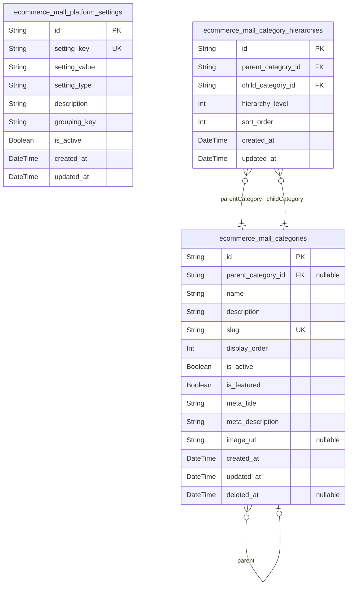
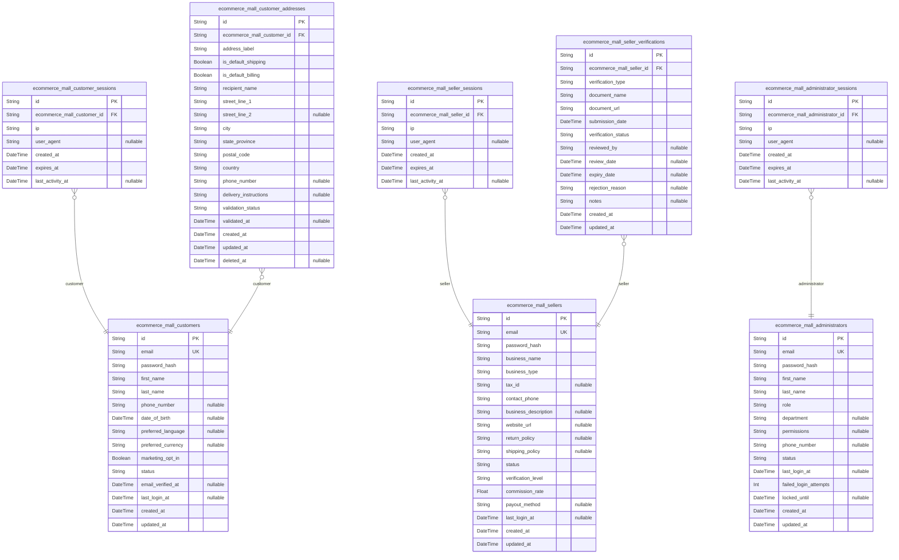
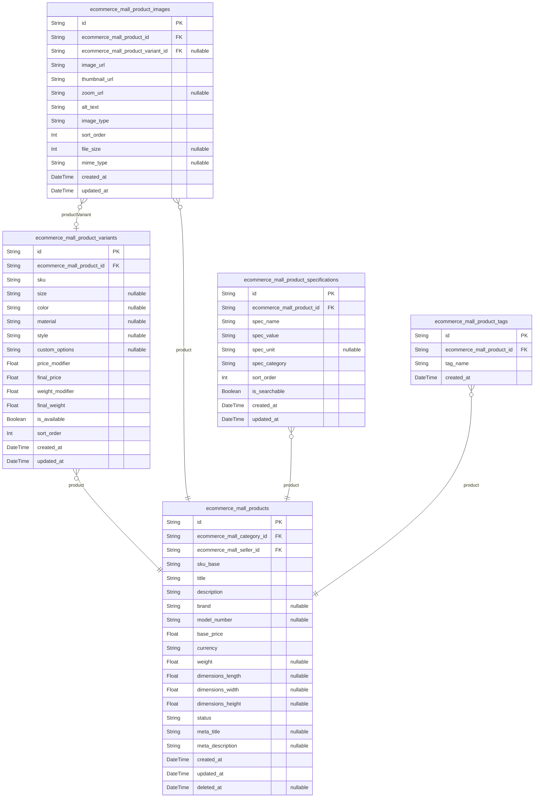
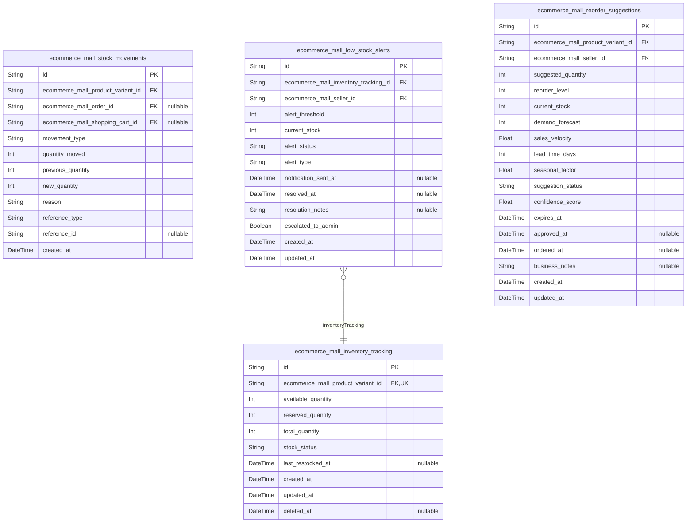
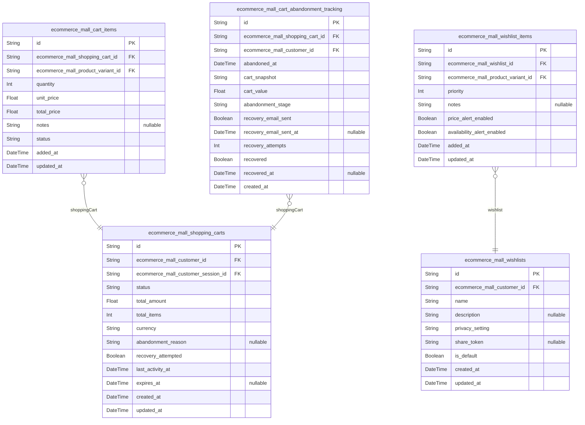
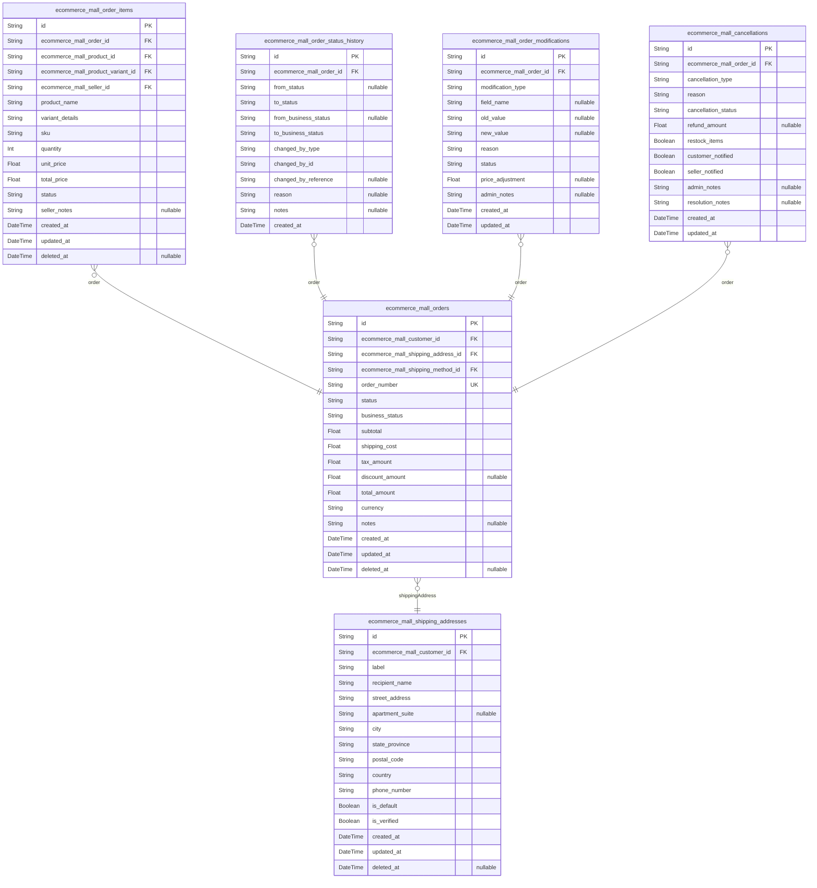
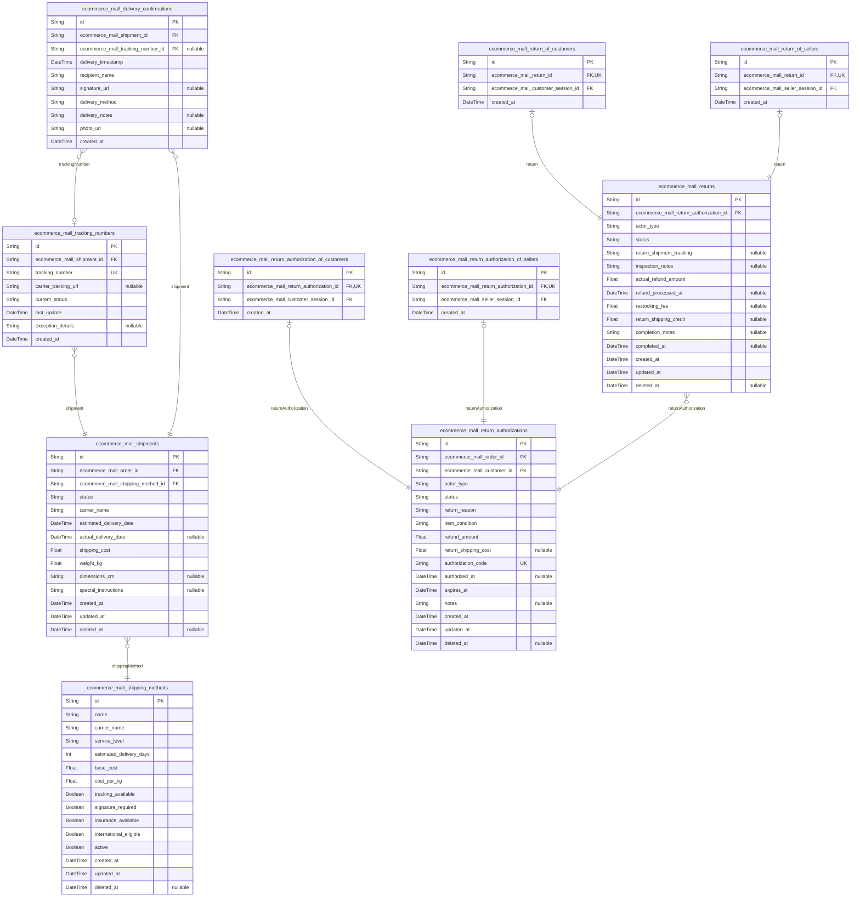
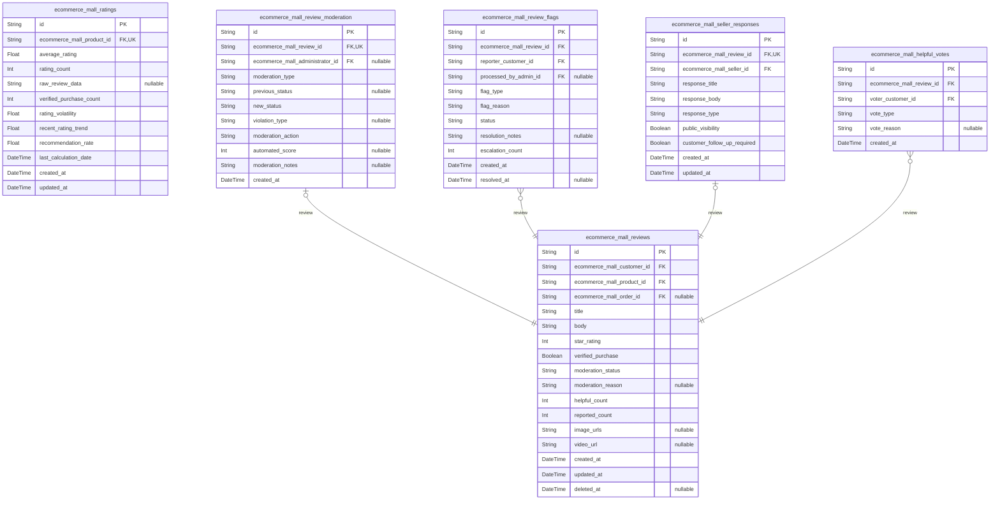
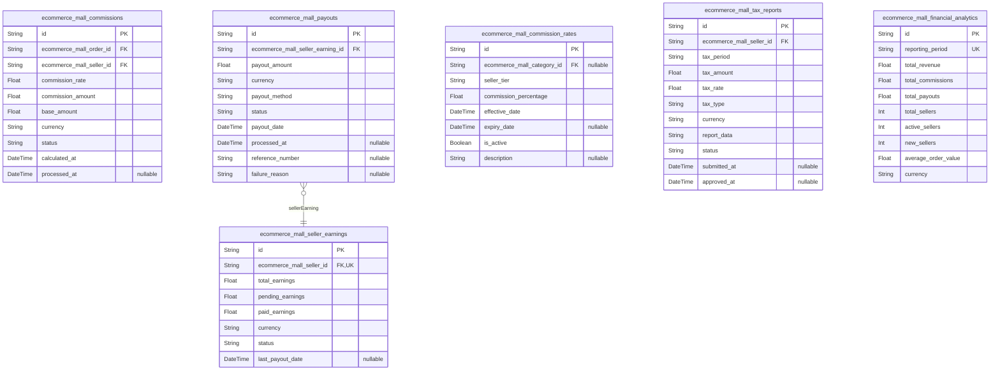

# Prisma Markdown

> Generated by [`prisma-markdown`](https://github.com/samchon/prisma-markdown)

- [Systematic](#systematic)
- [Actors](#actors)
- [Sales](#sales)
- [Inventory](#inventory)
- [Carts](#carts)
- [Orders](#orders)
- [Payments](#payments)
- [Fulfillment](#fulfillment)
- [Reviews](#reviews)
- [Financial](#financial)

## Systematic

### `ecommerce_mall_platform_settings`

Global platform configuration settings that control system-wide
parameters and behavior.

Stores essential platform-wide configuration values including business
rules, feature toggles, tax rates, shipping settings, and other
operational parameters that affect all users and transactions. This
foundational table enables centralized platform management without
requiring code changes for configuration modifications.

The settings are referenced throughout the system for commission
calculations, tax processing, shipping configurations, and other core
platform functions. Administrators can modify these values to adjust
platform behavior, implement policy changes, and manage operational
parameters.

Soft deletion is not applicable as configuration settings are permanent
platform data with full audit trail through updated_at timestamps.

Properties as follows:

- `id`: Primary Key.
- `setting_key`
  > Unique identifier key for the configuration setting (e.g.,
  > 'default_commission_rate', 'tax_rate_us', 'max_file_upload_size'). Used
  > for programmatic access and validation.
- `setting_value`
  > Configuration value stored as text string. Supports numeric values, JSON
  > objects, and text content. Values should be validated based on
  > setting_key requirements.
- `setting_type`
  > Data type classification for the setting value (e.g., 'number',
  > 'boolean', 'json', 'string'). Used for validation and proper value
  > handling.
- `description`
  > Human-readable description explaining the purpose and usage of this
  > configuration setting. Provides context for administrators managing
  > platform settings.
- `grouping_key`
  > Logical grouping identifier for organizing configuration settings (e.g.,
  > 'payment', 'shipping', 'tax', 'general'). Used for administrative
  > interface organization and bulk operations.
- `is_active`
  > Whether this configuration setting is currently active and being applied
  > by the system. Inactive settings are preserved but not used in system
  > operations.
- `created_at`: Timestamp when this configuration setting was initially created.
- `updated_at`
  > Timestamp when this configuration setting was last modified. Used for
  > audit trail and change tracking.

### `ecommerce_mall_categories`

Product category system providing hierarchical organization for
marketplace products.

Stores the complete category taxonomy for organizing products within the
marketplace. Categories support hierarchical parent-child relationships
enabling multi-level navigation and filtering. Each category includes
SEO-friendly slugs, display ordering, and activation status for flexible
content management.

Categories are the primary organizational structure for product
discovery, search filtering, and navigation. They support unlimited
nesting depth while maintaining performance through efficient indexing
and caching. Categories are referenced by products across the platform
and serve as the foundation for customer browsing experiences.

Soft deletion support allows categories to be disabled without losing
historical product associations and maintaining data integrity for
existing products.

Properties as follows:

- `id`: Primary Key.
- `parent_category_id`
  > Reference to parent category for hierarchical organization. Null for
  > top-level categories. [ecommerce_mall_categories.id](#ecommerce_mall_categories)
- `name`
  > Category display name shown to customers (e.g., 'Electronics', 'Clothing
  > & Fashion', 'Home & Garden'). Should be descriptive and
  > customer-friendly.
- `description`
  > Detailed description of the category explaining its scope and product
  > types. Used for SEO and customer understanding of category contents.
- `slug`
  > URL-friendly identifier for category pages (e.g., 'electronics',
  > 'clothing-fashion'). Must be unique across all categories and used in
  > SEO-friendly URLs.
- `display_order`
  > Numerical order for category display in lists and navigation. Lower
  > numbers appear first. Used for consistent category ordering across the
  > platform.
- `is_active`
  > Whether this category is active and visible to customers. Inactive
  > categories are hidden from browsing but preserved for existing product
  > associations.
- `is_featured`
  > Whether this category should be featured prominently in homepage displays
  > and promotional areas. Used for highlighting important categories.
- `meta_title`
  > SEO-optimized title for category pages used by search engines and social
  > media. Should be compelling and keyword-rich for better search
  > visibility.
- `meta_description`
  > SEO meta description providing category summary for search engine
  > results. Should be concise, informative, and encourage clicks.
- `image_url`
  > Optional category banner or featured image URL for visual category
  > representation in navigation and promotional displays.
- `created_at`: Timestamp when this category was initially created.
- `updated_at`
  > Timestamp when this category was last modified. Used for tracking
  > category evolution and change history.
- `deleted_at`
  > Soft deletion timestamp. Categories are not physically deleted but marked
  > as deleted to preserve product associations and maintain referential
  > integrity.

### `ecommerce_mall_category_hierarchies`

Parent-child relationship mappings supporting complex category hierarchy
structures.

Manages explicit parent-child relationships between categories to support
complex hierarchical structures beyond simple parent references. This
table enables many-to-many relationships allowing categories to appear in
multiple hierarchy paths and supports complex organizational structures.

The hierarchy system enables categories to have multiple parents,
creating flexible organizational structures where products can be
discovered through multiple navigation paths. This design supports
advanced filtering, cross-category product placement, and sophisticated
search capabilities.

This subsidiary table is managed automatically by the system and provides
the relationship mapping needed for efficient hierarchy traversal and
category organization. It supports the recursive relationships defined in
the parent category references.

Properties as follows:

- `id`: Primary Key.
- `parent_category_id`
  > Reference to parent category in the hierarchy relationship. {@link
  > ecommerce_mall_categories.id}
- `child_category_id`
  > Reference to child category in the hierarchy relationship. {@link
  > ecommerce_mall_categories.id}
- `hierarchy_level`
  > Numerical depth level in the hierarchy (0 for immediate parent-child, 1
  > for grandparent-grandchild, etc.). Used for efficient hierarchy traversal
  > and level-based operations.
- `sort_order`
  > Ordering sequence for sibling categories at the same hierarchy level.
  > Used for consistent display ordering within parent categories.
- `created_at`: Timestamp when this hierarchy relationship was initially established.
- `updated_at`
  > timestamp when this hierarchy relationship was last modified. Used for
  > tracking relationship changes and maintaining consistency.

## Actors

### `ecommerce_mall_customers`

Customer user accounts for the e-commerce marketplace platform.

Represents individual shoppers who browse products, place orders, and
manage their shopping experience. Each customer has authentication
credentials, personal profile information, and shopping preferences.
Customers can manage multiple shipping addresses, maintain shopping carts
and wishlists, write product reviews, and track order history.

Customer accounts support secure authentication with email verification,
password management, account status tracking, and privacy controls. The
account maintains shopping preferences and integrates with platform
features including orders, reviews, and customer service.

Properties as follows:

- `id`: Primary Key.
- `email`
  > Customer email address for authentication, order notifications, and
  > platform communication. Must be unique across all customers.
- `password_hash`
  > Encrypted password hash for secure customer authentication. Never stores
  > plain text passwords.
- `first_name`
  > Customer first name for personalization, order processing, and
  > communication.
- `last_name`
  > Customer last name for personalization, order processing, and
  > communication.
- `phone_number`
  > Customer phone number for order delivery coordination and customer
  > service.
- `date_of_birth`: Customer date of birth for age verification and personalized experiences.
- `preferred_language`
  > Customer preferred language for platform communication and content
  > display.
- `preferred_currency`: Customer preferred currency for pricing display and transactions.
- `marketing_opt_in`: Customer consent for marketing communications and promotional emails.
- `status`: Customer account status: active, suspended, banned, pending_verification.
- `email_verified_at`: Timestamp when customer email was verified through confirmation link.
- `last_login_at`: Timestamp of customer's most recent successful login.
- `created_at`: Customer account creation timestamp for audit tracking.
- `updated_at`: Last modification timestamp for customer profile and preferences.

### `ecommerce_mall_customer_sessions`

Customer session management for authentication and activity tracking.

Tracks individual customer login sessions for security monitoring,
activity analysis, and session management. Each session represents
authenticated customer activity with connection details, timestamps, and
expiration tracking.

Sessions provide audit trails for customer account security, help
identify suspicious activity, support session timeout policies, and
enable customers to review login history while maintaining security
through IP tracking and suspicious activity detection.

Properties as follows:

- `id`: Primary Key.
- `ecommerce_mall_customer_id`: Associated customer account. [ecommerce_mall_customers.id](#ecommerce_mall_customers)
- `ip`: Customer IP address for session tracking and security monitoring.
- `user_agent`: Customer browser and device information for session tracking.
- `created_at`: Session creation timestamp when customer authenticated.
- `expires_at`: Session expiration timestamp for automatic logout.
- `last_activity_at`: Timestamp of last user activity in this session.

### `ecommerce_mall_sellers`

Seller business accounts for marketplace vendors and product providers.

Represents business entities that sell products on the marketplace.
Sellers manage product catalogs, process orders, handle customer
communications, and access business analytics and reporting tools.

Each seller account includes business verification, tax information,
payment processing setup, shipping policies, and customer service
configurations. Seller accounts support complete business lifecycle from
application through verification and ongoing business management.

Properties as follows:

- `id`: Primary Key.
- `email`
  > Seller business email address for authentication and communication. Must
  > be unique.
- `password_hash`: Encrypted password hash for secure seller authentication.
- `business_name`
  > Official registered business name for seller profile and legal
  > identification.
- `business_type`: Business entity type: individual, partnership, corporation, llc.
- `tax_id`: Business tax identification number for tax reporting and compliance.
- `contact_phone`: Business contact phone number for customer service and communication.
- `business_description`
  > Detailed business description including products sold and services
  > offered.
- `website_url`: Seller business website URL for additional business information.
- `return_policy`: Seller return and refund policy for customer reference.
- `shipping_policy`
  > Seller shipping and delivery policy including processing times and
  > methods.
- `status`
  > Seller account status: pending_verification, verified, active, suspended,
  > banned.
- `verification_level`: Seller verification level: basic, verified, premium.
- `commission_rate`
  > Platform commission rate for seller transactions as decimal (e.g., 0.15
  > for 15%).
- `payout_method`: Seller preferred payout method: bank_transfer, paypal, check.
- `last_login_at`: Timestamp of seller's most recent successful login.
- `created_at`: Seller account creation timestamp for audit tracking.
- `updated_at`: Last modification timestamp for seller business information.

### `ecommerce_mall_seller_sessions`

Seller session management for business dashboard access and security
monitoring.

Tracks individual seller login sessions for business account security,
activity monitoring, and compliance auditing. Each session represents
authenticated seller access to seller dashboard, product management
tools, and order processing systems.

Seller sessions provide enhanced security including IP validation, device
tracking, and suspicious activity detection to protect business accounts
while supporting business continuity through automatic session management
and login history tracking.

Properties as follows:

- `id`: Primary Key.
- `ecommerce_mall_seller_id`: Associated seller business account. [ecommerce_mall_sellers.id](#ecommerce_mall_sellers)
- `ip`: Seller IP address for session tracking and security monitoring.
- `user_agent`: Seller browser and device information for session tracking.
- `created_at`: Session creation timestamp when seller authenticated to dashboard.
- `expires_at`: Session expiration timestamp for automatic logout.
- `last_activity_at`: Timestamp of last seller activity in this session.

### `ecommerce_mall_administrators`

Platform administrator accounts for system management and marketplace
oversight.

Represents platform administrators who manage the entire marketplace
including user management, seller oversight, content moderation,
financial processing, and system configuration. Administrators have
elevated permissions for platform-wide control.

Each admin account includes enhanced security requirements, audit
logging, role-based permissions, and access controls. Admin accounts
support complete platform management lifecycle from system monitoring
through user support and policy enforcement.

Properties as follows:

- `id`: Primary Key.
- `email`: Administrator email address for authentication and emergency contact.
- `password_hash`: Encrypted password hash for secure administrator authentication.
- `first_name`: Administrator first name for internal identification.
- `last_name`: Administrator last name for internal identification.
- `role`: Administrator role: super_admin, admin, moderator, support, finance.
- `department`
  > Administrator department: operations, support, finance, compliance,
  > technical.
- `permissions`: Granular permissions array in JSON format for specific functions.
- `phone_number`: Administrator phone number for emergency contact.
- `status`: Administrator account status: active, suspended, on_leave, disabled.
- `last_login_at`: Timestamp of administrator's most recent successful login.
- `failed_login_attempts`: Number of consecutive failed login attempts for security monitoring.
- `locked_until`: Account lockout expiration timestamp for security lockouts.
- `created_at`: Administrator account creation timestamp for audit tracking.
- `updated_at`: Last modification timestamp for administrator account settings.

### `ecommerce_mall_administrator_sessions`

Administrator session management for secure platform access and audit
tracking.

Tracks individual administrator login sessions for security monitoring,
access auditing, and compliance management. Each session represents
authenticated administrative access to platform management tools and
configuration interfaces.

Administrator sessions implement enhanced security including multi-factor
authentication, IP validation, session monitoring, and comprehensive
audit logging to protect sensitive platform management capabilities.

Properties as follows:

- `id`: Primary Key.
- `ecommerce_mall_administrator_id`: Associated administrator account. [ecommerce_mall_administrators.id](#ecommerce_mall_administrators)
- `ip`: Administrator IP address for session tracking and security monitoring.
- `user_agent`: Administrator browser and device information for session tracking.
- `created_at`: Session creation timestamp when administrator authenticated.
- `expires_at`: Session expiration timestamp for automatic logout.
- `last_activity_at`: Timestamp of last administrator activity in this session.

### `ecommerce_mall_customer_addresses`

Customer shipping and billing address book for order fulfillment.

Manages multiple delivery addresses for customer accounts supporting
complex shipping requirements and gift delivery scenarios. Each address
includes complete information, validation status, and usage preferences
for efficient order processing.

Customer addresses support complete delivery lifecycle from address entry
through shipping coordination. They integrate with order management and
shipping systems to ensure accurate and reliable order fulfillment while
maintaining data privacy.

Properties as follows:

- `id`: Primary Key.
- `ecommerce_mall_customer_id`: Associated customer account. [ecommerce_mall_customers.id](#ecommerce_mall_customers)
- `address_label`
  > Customer-defined label for address identification (e.g., 'Home',
  > 'Office').
- `is_default_shipping`: Whether this address is the default shipping address for orders.
- `is_default_billing`: Whether this address is the default billing address for payments.
- `recipient_name`: Name of person receiving deliveries at this address.
- `street_line_1`: Primary street address line including house number and street name.
- `street_line_2`: Optional secondary street address line for apartment numbers, suites.
- `city`: City name for the address location.
- `state_province`: State or province name/code depending on country requirements.
- `postal_code`: Postal code or ZIP code for address validation and shipping.
- `country`: Country name or ISO country code for international shipping.
- `phone_number`: Phone number at address for delivery coordination.
- `delivery_instructions`: Special delivery instructions for shipping carriers.
- `validation_status`: Address validation status: validated, pending, invalid.
- `validated_at`: Timestamp when address validation was completed.
- `created_at`: Address creation timestamp for audit tracking.
- `updated_at`: Last modification timestamp for address information.
- `deleted_at`: Soft delete timestamp for address removal while preserving history.

### `ecommerce_mall_seller_verifications`

Seller business verification documentation and approval workflow management.

Tracks seller business verification requirements including document
submissions, verification status, and approval workflows. Supports
complete seller onboarding from initial application through final
approval and ongoing compliance monitoring.

Seller verification ensures marketplace quality standards and customer
trust through thorough business validation. The system maintains audit
trails of verification activities and supports compliance with financial
regulations.

Properties as follows:

- `id`: Primary Key.
- `ecommerce_mall_seller_id`: Associated seller business account. [ecommerce_mall_sellers.id](#ecommerce_mall_sellers)
- `verification_type`
  > Type of verification: business_license, tax_certificate, bank_account,
  > identity_document.
- `document_name`: Name or description of the verification document provided.
- `document_url`: Secure URL path to the stored verification document.
- `submission_date`: Timestamp when seller submitted the verification document.
- `verification_status`: Document status: submitted, under_review, approved, rejected, expired.
- `reviewed_by`: Administrator ID who reviewed and made verification decision.
- `review_date`: Timestamp when administrator completed verification review.
- `expiry_date`: Document expiry date for time-limited certifications.
- `rejection_reason`: Detailed reason for document rejection and resubmission requirements.
- `notes`: Internal notes from verification review and compliance observations.
- `created_at`: Verification record creation timestamp for audit tracking.
- `updated_at`: Last modification timestamp for verification status changes.

## Sales

### `ecommerce_mall_products`

Main product catalog entity representing individual products in the
marketplace. Each product is created and managed by verified sellers and
represents a distinct offering in the marketplace. Products include basic
information, descriptions, category assignments, and serve as the
foundation for variant management and inventory tracking.

Products support the complete product lifecycle from creation through
variants, pricing, and inventory management. They are independent
business entities that require their own management interfaces and API
endpoints for CRUD operations, search, and filtering.

Products link to categories for organization, sellers for ownership
verification, inventory systems for stock tracking, and review systems
for customer feedback integration.

Properties as follows:

- `id`: Primary Key.
- `ecommerce_mall_category_id`: Product category classification. [ecommerce_mall_categories.id](#ecommerce_mall_categories)
- `ecommerce_mall_seller_id`: Product owner and manager. [ecommerce_mall_sellers.id](#ecommerce_mall_sellers)
- `sku_base`
  > Base SKU prefix for variant generation (seller-specific product
  > identifier)
- `title`: Product title/name for display and search
- `description`: Detailed product description with features and specifications
- `brand`: Product brand or manufacturer name
- `model_number`: Product model number or identifier
- `base_price`: Base product price before variants and discounts
- `currency`: Currency code for pricing (ISO 4217)
- `weight`: Product weight in grams for shipping calculations
- `dimensions_length`: Product length in centimeters
- `dimensions_width`: Product width in centimeters
- `dimensions_height`: Product height in centimeters
- `status`: Product status: draft, active, inactive, discontinued
- `meta_title`: SEO-optimized page title
- `meta_description`: SEO meta description
- `created_at`: Product creation timestamp
- `updated_at`: Product last modification timestamp
- `deleted_at`: Soft deletion timestamp for audit trails

### `ecommerce_mall_product_variants`

Product variant combinations representing specific purchasable products
with unique SKUs. Each variant represents a specific combination of
product options (size, color, material, etc.) and maintains independent
inventory tracking and pricing.

Variants are supporting entities that depend on their parent products for
context and are managed through product management interfaces rather than
independent operations. Each variant has unique inventory tracking,
pricing modifications, and availability status.

Variants link to their parent products for product information, inventory
tracking systems for stock management, and order systems for fulfillment
coordination.

Properties as follows:

- `id`: Primary Key.
- `ecommerce_mall_product_id`: Parent product reference. [ecommerce_mall_products.id](#ecommerce_mall_products)
- `sku`: Unique SKU identifier for this variant combination
- `size`: Size variant option (XS, S, M, L, XL, etc.)
- `color`: Color variant option with hex code support
- `material`: Material variant option (cotton, leather, etc.)
- `style`: Style variant option (classic, modern, etc.)
- `custom_options`: JSON string for custom variant attributes
- `price_modifier`: Price adjustment from base product price (+/- amount)
- `final_price`: Calculated final price including modifier
- `weight_modifier`: Weight adjustment from base product weight (+/- grams)
- `final_weight`: Calculated final weight including modifier
- `is_available`: Current availability status for customer purchase
- `sort_order`: Display order for variant selection interface
- `created_at`: Variant creation timestamp
- `updated_at`: Variant last modification timestamp

### `ecommerce_mall_product_images`

Product image assets supporting product presentation and marketing.
Images are associated with both main products and specific variants to
provide comprehensive visual representation for customer decision-making.

Images are supporting media assets that are managed through product
management interfaces rather than independent operations. They provide
visual context for products and variants, supporting customer engagement
and conversion.

Images link to products and variants for visual context, support SEO and
marketing through proper optimization, and integrate with the broader
media management system.

Properties as follows:

- `id`: Primary Key.
- `ecommerce_mall_product_id`: Associated product. [ecommerce_mall_products.id](#ecommerce_mall_products)
- `ecommerce_mall_product_variant_id`
  > Associated variant (optional for variant-specific images). {@link
  > ecommerce_mall_product_variants.id}
- `image_url`: Primary image URL for display
- `thumbnail_url`: Optimized thumbnail URL for listings
- `zoom_url`: High-resolution image URL for zoom functionality
- `alt_text`: Alt text for accessibility and SEO
- `image_type`: Image type: main, gallery, lifestyle, detail
- `sort_order`: Display order within product image gallery
- `file_size`: Image file size in bytes
- `mime_type`: Image MIME type for format validation
- `created_at`: Image upload timestamp
- `updated_at`: Image last modification timestamp

### `ecommerce_mall_product_specifications`

Technical specifications and detailed product information supporting
comprehensive product understanding. Specifications provide structured
data about product features, technical details, and compliance
information for customer decision-making and regulatory requirements.

Specifications are supporting data that enhance product understanding and
are managed through product management interfaces. They provide detailed
technical context that complements basic product descriptions.

Specifications link to products for technical context, support compliance
and regulatory requirements through structured data, and enable advanced
filtering and search capabilities based on technical attributes.

Properties as follows:

- `id`: Primary Key.
- `ecommerce_mall_product_id`: Associated product. [ecommerce_mall_products.id](#ecommerce_mall_products)
- `spec_name`: Specification name (e.g., 'Material', 'Warranty', 'Dimensions')
- `spec_value`: Specification value (e.g., '100% Cotton', '2 years', '10x15x5 cm')
- `spec_unit`: Unit of measurement (e.g., 'cm', 'kg', 'months')
- `spec_category`: Specification category (general, technical, compliance, warranty)
- `sort_order`: Display order for specification presentation
- `is_searchable`: Whether specification should be included in search indexing
- `created_at`: Specification creation timestamp
- `updated_at`: Specification last modification timestamp

### `ecommerce_mall_product_tags`

Product tagging system enabling flexible categorization and enhanced
discoverability beyond formal category hierarchy. Tags provide additional
search and filtering capabilities for products based on themes, features,
occasions, and other business-relevant criteria.

Tags are supporting metadata that enhance product discoverability and are
managed through product and tag management interfaces. They enable
flexible categorization without modifying the formal category structure.

Tags link to products for enhanced categorization, support flexible
search and filtering through tag-based queries, and integrate with
recommendation systems for improved product discovery.

Properties as follows:

- `id`: Primary Key.
- `ecommerce_mall_product_id`: Tagged product. [ecommerce_mall_products.id](#ecommerce_mall_products)
- `tag_name`: Tag name for categorization and search functionality.
- `created_at`: Tag assignment timestamp

## Inventory

### `ecommerce_mall_inventory_tracking`

Real-time inventory tracking for each product variant SKU with available
stock, reserved quantities, and current status. Provides immediate stock
visibility to prevent overselling and enables accurate availability
calculations for customer shopping experiences. This table is the single
source of truth for current inventory positions across the marketplace.

Properties as follows:

- `id`: Primary Key.
- `ecommerce_mall_product_variant_id`
  > Product variant SKU being tracked. {@link
  > ecommerce_mall_product_variants.id}
- `available_quantity`: Current quantity available for immediate purchase by customers
- `reserved_quantity`
  > Quantity temporarily reserved for pending orders and shopping carts to
  > prevent overselling
- `total_quantity`: Total physical inventory including available and reserved quantities
- `stock_status`
  > Current stock status: in_stock, low_stock, or out_of_stock based on
  > thresholds
- `last_restocked_at`: Timestamp of last inventory restock for trending analysis
- `created_at`: Initial inventory tracking record creation timestamp
- `updated_at`: Last update timestamp for inventory changes
- `deleted_at`: Soft delete timestamp for discontinued products

### `ecommerce_mall_stock_movements`

Historical audit trail of all inventory movements including incoming
stock, outgoing sales, cart reservations, order releases, and manual
adjustments. Provides complete inventory change history for business
intelligence, demand planning, and compliance reporting. Essential for
understanding inventory flow patterns and identifying potential issues.

Properties as follows:

- `id`: Primary Key.
- `ecommerce_mall_product_variant_id`
  > Product variant SKU involved in the inventory movement. {@link
  > ecommerce_mall_product_variants.id}
- `ecommerce_mall_order_id`
  > Associated order if movement is related to order processing. {@link
  > ecommerce_mall_orders.id}
- `ecommerce_mall_shopping_cart_id`
  > Associated shopping cart if movement is related to cart operations.
  > [ecommerce_mall_shopping_carts.id](#ecommerce_mall_shopping_carts)
- `movement_type`
  > Type of inventory movement: incoming, outgoing, reserved, released,
  > adjusted, returned, damaged
- `quantity_moved`: Absolute quantity change (positive for incoming, negative for outgoing)
- `previous_quantity`: Inventory quantity before this movement occurred
- `new_quantity`: Inventory quantity after this movement was applied
- `reason`: Business reason for inventory movement for audit purposes
- `reference_type`
  > Type of reference causing movement: order, cart, adjustment, restock,
  > return
- `reference_id`: Reference identifier for tracking related business events
- `created_at`: Timestamp when inventory movement was recorded

### `ecommerce_mall_low_stock_alerts`

Automated alert system for inventory reaching low stock thresholds,
enabling proactive restocking and preventing stockouts. Each alert tracks
resolution status and provides escalation capabilities. Critical for
maintaining product availability and customer satisfaction by preventing
out-of-stock situations that impact sales and customer experience.

Properties as follows:

- `id`: Primary Key.
- `ecommerce_mall_inventory_tracking_id`
  > Inventory tracking record that triggered the low stock alert. {@link
  > ecommerce_mall_inventory_tracking.id}
- `ecommerce_mall_seller_id`
  > Seller who owns the product and should receive the alert. {@link
  > ecommerce_mall_sellers.id}
- `alert_threshold`: Stock quantity threshold that triggered this low stock alert
- `current_stock`: Stock level when alert was triggered
- `alert_status`: Current alert status: active, resolved, ignored, escalated
- `alert_type`: Alert type for categorization: low_stock, critical_stock, zero_stock
- `notification_sent_at`: Timestamp when notification was sent to seller
- `resolved_at`: Timestamp when low stock condition was resolved
- `resolution_notes`: Notes about how the alert was resolved for audit purposes
- `escalated_to_admin`: Whether this alert was escalated to platform administrators
- `created_at`: Initial alert creation timestamp
- `updated_at`: Last alert status update timestamp

### `ecommerce_mall_reorder_suggestions`

AI-driven intelligent reorder suggestions based on sales velocity,
seasonal trends, lead times, and inventory turnover patterns. Provides
data-driven recommendations to optimize inventory levels and prevent
stockouts while minimizing carrying costs. Includes demand forecasting
algorithms and supplier lead time tracking to support strategic inventory
planning and supplier relationship management.

Properties as follows:

- `id`: Primary Key.
- `ecommerce_mall_product_variant_id`
  > Product variant SKU for which reorder suggestion is generated. {@link
  > ecommerce_mall_product_variants.id}
- `ecommerce_mall_seller_id`
  > Seller who owns the product and receives the reorder suggestion. {@link
  > ecommerce_mall_sellers.id}
- `suggested_quantity`: AI-calculated optimal reorder quantity based on demand forecasting
- `reorder_level`: Stock level threshold that triggers reorder recommendation
- `current_stock`: Current inventory level when suggestion was generated
- `demand_forecast`: Predicted demand quantity for the lead time period
- `sales_velocity`: Average daily sales rate for demand forecasting calculations
- `lead_time_days`: Supplier lead time in days for delivery planning
- `seasonal_factor`: Seasonal adjustment factor for demand forecasting
- `suggestion_status`: Current status: pending, approved, ordered, rejected, expired
- `confidence_score`: AI confidence score (0-1) for the accuracy of this recommendation
- `expires_at`: Suggestion validity expiration timestamp
- `approved_at`: Timestamp when seller approved this suggestion
- `ordered_at`: Timestamp when corresponding purchase order was placed
- `business_notes`: Additional business context and justification for the reorder suggestion
- `created_at`: Initial suggestion generation timestamp
- `updated_at`: Last suggestion status update timestamp

## Carts

### `ecommerce_mall_shopping_carts`

Customer shopping cart storage with persistent cross-session state
management.

Stores individual customer shopping carts that persist across browser
sessions and devices. Each cart maintains its current state including
total amounts, item counts, and last activity timestamps. Cart lifecycle
is managed from creation through abandonment or conversion to orders.

Carts are automatically created when customers add their first item and
persist until explicitly cleared or converted to orders. Cross-device
synchronization ensures cart consistency across all customer touchpoints.

Properties as follows:

- `id`: Primary Key.
- `ecommerce_mall_customer_id`: Customer who owns this shopping cart. [ecommerce_mall_customers.id](#ecommerce_mall_customers).
- `ecommerce_mall_customer_session_id`
  > Customer session that created this cart for session tracking. {@link
  > ecommerce_mall_customer_sessions.id}.
- `status`
  > Current cart status: active, abandoned, converted_to_order, expired.
  > Drives cart lifecycle management and cleanup operations.
- `total_amount`
  > Total cart value including items, taxes, and shipping estimates.
  > Calculated in real-time based on current item prices.
- `total_items`
  > Total number of individual items in cart. Used for cart summary displays
  > and abandonment analysis.
- `currency`
  > Currency code for cart totals (USD, EUR, etc.). Ensures consistent
  > pricing across multi-currency sessions.
- `abandonment_reason`
  > Optional reason for cart abandonment captured through customer feedback
  > or behavioral analysis.
- `recovery_attempted`
  > Whether recovery email or notification has been sent for this abandoned
  > cart.
- `last_activity_at`
  > Timestamp of last cart activity (add, remove, modify items). Used for
  > cart expiration and abandonment tracking.
- `expires_at`
  > Cart expiration timestamp for automatic cleanup of stale carts. Null for
  > active carts.
- `created_at`: Cart creation timestamp. Used for analytics and cart lifecycle tracking.
- `updated_at`: Last update timestamp for cart modifications and activity tracking.

### `ecommerce_mall_cart_items`

Individual items within customer shopping carts with variant-specific
tracking.

Stores detailed information for each item added to customer shopping
carts, including specific product variant selections, quantities, and
pricing at time of addition. Maintains referential integrity with product
variants and shopping carts.

Cart items are automatically updated when product prices change and
validated against current inventory availability. Items remain in cart
until removed by customer or cart is converted to order.

Properties as follows:

- `id`: Primary Key.
- `ecommerce_mall_shopping_cart_id`
  > Shopping cart that contains this item. {@link
  > ecommerce_mall_shopping_carts.id}.
- `ecommerce_mall_product_variant_id`
  > Specific product variant selected for this cart item. {@link
  > ecommerce_mall_product_variants.id}.
- `quantity`
  > Number of units requested for this cart item. Validated against available
  > inventory and cart quantity limits.
- `unit_price`
  > Price per unit at time of addition to cart. Used for total calculation
  > and price change tracking.
- `total_price`
  > Total price for this item (quantity × unit_price). Calculated
  > automatically and used for cart totals.
- `notes`: Optional customer notes or special instructions for this cart item.
- `status`
  > Item status: active, removed, out_of_stock, price_changed. Drives item
  > availability and cart integrity.
- `added_at`
  > Timestamp when item was added to cart. Used for cart analytics and item
  > lifecycle tracking.
- `updated_at`
  > Last update timestamp for item modifications including quantity changes
  > and status updates.

### `ecommerce_mall_wishlists`

Customer wishlist collections for product preference management and gift
planning.

Stores customer-created wishlist collections that allow customers to save
products for future consideration, sharing, and purchase planning.
Supports multiple wishlists per customer for different occasions and
categories.

Wishlists provide long-term product preference storage with sharing
capabilities and price tracking notifications. Customers can create
unlimited wishlists with custom names and privacy settings.

Properties as follows:

- `id`: Primary Key.
- `ecommerce_mall_customer_id`: Customer who owns this wishlist. [ecommerce_mall_customers.id](#ecommerce_mall_customers).
- `name`
  > Custom name for this wishlist (e.g., 'Birthday Gifts', 'Home Office',
  > 'Wedding Registry'). Used for wishlist identification and organization.
- `description`: Optional description explaining the purpose or occasion for this wishlist.
- `privacy_setting`
  > Wishlist privacy level: private, public, shared_with_link. Controls who
  > can view and access this wishlist.
- `share_token`
  > Unique token for sharing wishlist via direct link. Generated when
  > privacy_setting allows sharing.
- `is_default`
  > Whether this is the customer's default wishlist. Default wishlist is used
  > for quick product saves.
- `created_at`
  > Wishlist creation timestamp. Used for analytics and wishlist lifecycle
  > tracking.
- `updated_at`: Last update timestamp for wishlist modifications and item changes.

### `ecommerce_mall_wishlist_items`

Individual products within customer wishlists with priority and tracking
information.

Stores detailed information for each product added to customer wishlists,
including specific variant selections, customer priorities, and
notification preferences. Maintains long-term product interest tracking
independent of inventory status.

Wishlist items persist indefinitely until manually removed and provide
price tracking, availability notifications, and easy conversion to cart
items. Items track customer interest across product lifecycle changes.

Properties as follows:

- `id`: Primary Key.
- `ecommerce_mall_wishlist_id`: Wishlist that contains this item. [ecommerce_mall_wishlists.id](#ecommerce_mall_wishlists).
- `ecommerce_mall_product_variant_id`
  > Specific product variant saved to this wishlist. {@link
  > ecommerce_mall_product_variants.id}.
- `priority`
  > Customer priority ranking for this item (1 = highest priority). Used for
  > wishlist sorting and organization.
- `notes`
  > Customer notes about this wishlist item including reasons for interest or
  > specific requirements.
- `price_alert_enabled`
  > Whether customer wants notifications when this item's price changes or
  > goes on sale.
- `availability_alert_enabled`
  > Whether customer wants notifications when this item becomes available
  > after being out of stock.
- `added_at`
  > Timestamp when item was added to wishlist. Used for analytics and
  > interest tracking over time.
- `updated_at`
  > Last update timestamp for item modifications including priority changes
  > and note updates.

### `ecommerce_mall_cart_abandonment_tracking`

Analytics and marketing data for abandoned shopping carts with recovery
information.

Stores comprehensive tracking data for abandoned shopping carts to
support recovery campaigns, customer behavior analysis, and conversion
optimization. Captures cart state snapshots and customer engagement
metrics for targeted marketing efforts.

Data supports automated email recovery campaigns, behavioral analysis,
and cart abandonment rate optimization. Maintains historical snapshots
for trend analysis and campaign performance measurement.

Properties as follows:

- `id`: Primary Key.
- `ecommerce_mall_shopping_cart_id`
  > Shopping cart that was abandoned. {@link
  > ecommerce_mall_shopping_carts.id}.
- `ecommerce_mall_customer_id`: Customer who abandoned the cart. [ecommerce_mall_customers.id](#ecommerce_mall_customers).
- `abandoned_at`
  > Timestamp when cart was determined to be abandoned (no activity for
  > extended period).
- `cart_snapshot`
  > JSON snapshot of cart contents at abandonment including items, prices,
  > and quantities for recovery campaigns.
- `cart_value`
  > Total cart value at time of abandonment. Used for recovery campaign
  > prioritization and analytics.
- `abandonment_stage`
  > Stage where abandonment occurred: browsing, cart_view, checkout_started,
  > payment_info, payment_failed. Used for funnel optimization.
- `recovery_email_sent`: Whether recovery email has been sent to customer for this abandoned cart.
- `recovery_email_sent_at`: Timestamp when recovery email was sent if applicable.
- `recovery_attempts`
  > Number of recovery attempts made for this abandoned cart (emails,
  > notifications, etc.).
- `recovered`
  > Whether this abandoned cart resulted in a completed order after recovery
  > efforts.
- `recovered_at`: Timestamp of successful recovery if cart was converted to order.
- `created_at`: Record creation timestamp for tracking and analytics purposes.

## Orders

### `ecommerce_mall_orders`

Main order entity representing complete customer purchase transactions.
Tracks all order-level information including customer, shipping details,
pricing breakdown, and current status. Orders may contain items from
multiple sellers and serve as primary business entity for order
management.

Properties as follows:

- `id`: Primary Key.
- `ecommerce_mall_customer_id`: Customer who placed this order. [ecommerce_mall_customers.id](#ecommerce_mall_customers)
- `ecommerce_mall_shipping_address_id`
  > Shipping address for this order. {@link
  > ecommerce_mall_shipping_addresses.id}
- `ecommerce_mall_shipping_method_id`
  > Shipping method selected for this order. {@link
  > ecommerce_mall_shipping_methods.id}
- `order_number`: Unique order number for customer reference and tracking.
- `status`
  > Current order status: pending_payment, confirmed, processing, shipped,
  > delivered, completed, cancelled.
- `business_status`
  > Business workflow status: awaiting_fulfillment, in_fulfillment,
  > awaiting_shipment, shipped, delivered, returned, disputed.
- `subtotal`: Sum of all item prices before taxes and shipping.
- `shipping_cost`: Shipping cost based on selected shipping method and order details.
- `tax_amount`: Tax amount calculated based on shipping address and applicable tax rates.
- `discount_amount`
  > Total discount amount applied from promotions, coupons, or other
  > reductions.
- `total_amount`: Final total amount: subtotal + shipping + tax - discount.
- `currency`: Currency code for all monetary values (ISO 4217 format).
- `notes`: Customer notes or special instructions for the order.
- `created_at`: Timestamp when order was initially created.
- `updated_at`: Timestamp when order was last modified.
- `deleted_at`: Soft delete timestamp for audit trail purposes.

### `ecommerce_mall_order_items`

Individual items within customer orders, tracking specific product
variants purchased. Each item represents a unique product variant with
quantity, pricing, and seller information. Items are independently
managed and can be fulfilled separately.

Properties as follows:

- `id`: Primary Key.
- `ecommerce_mall_order_id`: Parent order containing this item. [ecommerce_mall_orders.id](#ecommerce_mall_orders)
- `ecommerce_mall_product_id`: Product being ordered. [ecommerce_mall_products.id](#ecommerce_mall_products)
- `ecommerce_mall_product_variant_id`
  > Specific product variant being ordered (size, color, etc.). {@link
  > ecommerce_mall_product_variants.id}
- `ecommerce_mall_seller_id`: Seller providing this product. [ecommerce_mall_sellers.id](#ecommerce_mall_sellers)
- `product_name`: Product name at time of order for historical accuracy.
- `variant_details`: Human-readable variant description (e.g., 'Size: Medium, Color: Blue').
- `sku`: Stock Keeping Unit identifier for this variant at time of order.
- `quantity`: Number of units ordered.
- `unit_price`: Price per unit at time of order.
- `total_price`: Total price for this item: quantity * unit_price.
- `status`
  > Item fulfillment status: pending, confirmed, packed, shipped, delivered,
  > returned, cancelled.
- `seller_notes`: Seller notes or special handling instructions for this item.
- `created_at`: Timestamp when order item was created.
- `updated_at`: Timestamp when order item was last modified.
- `deleted_at`: Soft delete timestamp for audit trail purposes.

### `ecommerce_mall_order_status_history`

Historical tracking of order status changes providing complete audit
trail. Records every status transition with timestamps and responsible
party information for compliance, customer service, and analytics
purposes.

Properties as follows:

- `id`: Primary Key.
- `ecommerce_mall_order_id`: Order whose status is being tracked. [ecommerce_mall_orders.id](#ecommerce_mall_orders)
- `from_status`: Previous status before this change (null for initial status).
- `to_status`: New status after this change.
- `from_business_status`: Previous business status before this change.
- `to_business_status`: New business status after this change.
- `changed_by_type`: Type of entity that made the change: customer, seller, admin, system.
- `changed_by_id`: ID of entity that made the change (customer, seller, or admin ID).
- `changed_by_reference`: Reference to the entity that made change for display purposes.
- `reason`: Reason or explanation for the status change.
- `notes`: Additional notes or details about the status change.
- `created_at`: Timestamp when status change occurred.

### `ecommerce_mall_shipping_addresses`

Shipping addresses specifically created and managed for order
fulfillment. Contains complete address information optimized for shipping
carrier validation and delivery coordination. Addresses are managed
through orders but can be reused across multiple orders.

Properties as follows:

- `id`: Primary Key.
- `ecommerce_mall_customer_id`
  > Customer who owns this shipping address. {@link
  > ecommerce_mall_customers.id}
- `label`
  > Customer-defined label for this address (e.g., 'Home', 'Office', 'Parents
  > House').
- `recipient_name`: Full name of person receiving the shipment.
- `street_address`: Street address including house number and street name.
- `apartment_suite`: Apartment, suite, or unit number if applicable.
- `city`: City or municipality name.
- `state_province`: State, province, or region name.
- `postal_code`: Postal or ZIP code.
- `country`: Country name or code.
- `phone_number`: Contact phone number for delivery coordination.
- `is_default`: Whether this is the customer's default shipping address.
- `is_verified`: Whether this address has been verified for shipping accuracy.
- `created_at`: Timestamp when shipping address was created.
- `updated_at`: Timestamp when shipping address was last modified.
- `deleted_at`: Soft delete timestamp for audit trail purposes.

### `ecommerce_mall_order_modifications`

Track modifications made to orders after initial placement, including
quantity changes, address updates, shipping method changes, and other
adjustments. Provides transparency and audit trail for order changes with
approval workflows.

Properties as follows:

- `id`: Primary Key.
- `ecommerce_mall_order_id`: Order being modified. [ecommerce_mall_orders.id](#ecommerce_mall_orders)
- `modification_type`
  > Type of modification: quantity_change, address_change,
  > shipping_method_change, item_addition, item_removal, price_adjustment.
- `field_name`
  > Specific field being modified (e.g., 'shipping_address', 'quantity',
  > 'unit_price').
- `old_value`: Previous value before modification.
- `new_value`: New value after modification.
- `reason`: Reason for requesting the modification.
- `status`: Modification status: pending, approved, rejected, cancelled.
- `price_adjustment`: Price impact of this modification (positive or negative).
- `admin_notes`: Administrative notes about the modification decision.
- `created_at`: Timestamp when modification was requested.
- `updated_at`: Timestamp when modification status was last updated.

### `ecommerce_mall_cancellations`

Track order cancellations with detailed information about cancellation
reasons, refund processing, and resolution status. Handles various
cancellation scenarios including customer-initiated, seller-initiated,
and system-initiated cancellations.

Properties as follows:

- `id`: Primary Key.
- `ecommerce_mall_order_id`: Order being cancelled. [ecommerce_mall_orders.id](#ecommerce_mall_orders)
- `cancellation_type`
  > Type of cancellation: customer_request, seller_unavailable,
  > payment_failed, inventory_shortage, shipping_issue, policy_violation,
  > fraud_suspicion, system_error.
- `reason`: Detailed reason for cancellation.
- `cancellation_status`
  > Cancellation processing status: requested, pending_approval, approved,
  > processing, completed, failed.
- `refund_amount`: Total refund amount being processed.
- `restock_items`: Whether cancelled items should be restocked to inventory.
- `customer_notified`: Whether customer has been notified about cancellation.
- `seller_notified`: Whether seller(s) have been notified about cancellation.
- `admin_notes`: Administrative notes about cancellation handling.
- `resolution_notes`: Final resolution notes or customer service comments.
- `created_at`: Timestamp when cancellation was initiated.
- `updated_at`: Timestamp when cancellation status was last updated.

## Payments

```mermaid
erDiagram
"ecommerce_mall_payment_methods" {
  String id PK
  String ecommerce_mall_customer_id FK
  String ecommerce_mall_order_id FK "nullable"
  String payment_type
  String payment_token
  String payment_provider
  String last_four_digits "nullable"
  String brand "nullable"
  Int expiration_month "nullable"
  Int expiration_year "nullable"
  String billing_name "nullable"
  String billing_email "nullable"
  Boolean is_default
  Boolean is_verified
  String verification_status
  String status
  String fingerprint "nullable"
  String billing_address_line1 "nullable"
  String billing_address_line2 "nullable"
  String billing_city "nullable"
  String billing_state "nullable"
  String billing_postal_code "nullable"
  String billing_country "nullable"
  DateTime created_at
  DateTime updated_at
  DateTime deleted_at "nullable"
  String metadata "nullable"
}
"ecommerce_mall_transactions" {
  String id PK
  String ecommerce_mall_order_id FK
  String ecommerce_mall_customer_id FK
  String ecommerce_mall_seller_id FK
  String ecommerce_mall_payment_method_id FK "nullable"
  String transaction_type
  Float amount
  String currency
  Float exchange_rate "nullable"
  Float amount_in_currency "nullable"
  String status
  String business_status
  String payment_gateway
  String gateway_transaction_id "nullable"
  String gateway_response_code "nullable"
  String gateway_response_message "nullable"
  String authorization_code "nullable"
  String settlement_batch_id "nullable"
  String failure_reason "nullable"
  Float fraud_score "nullable"
  String fraud_indicators "nullable"
  String risk_level
  String ip_address "nullable"
  String user_agent "nullable"
  Boolean billing_address_verified
  Boolean cvv_verified
  String three_d_secure_status "nullable"
  String metadata "nullable"
  String notes "nullable"
  DateTime processed_at "nullable"
  DateTime settled_at "nullable"
  DateTime created_at
  DateTime updated_at
}
"ecommerce_mall_refunds" {
  String id PK
  String ecommerce_mall_transaction_id FK
  String ecommerce_mall_order_id FK
  String ecommerce_mall_customer_id FK
  String ecommerce_mall_seller_id FK
  String ecommerce_mall_administrator_id FK "nullable"
  String refund_type
  Float amount
  String currency
  Float amount_in_currency "nullable"
  String reason_code
  String reason_details "nullable"
  String status
  String business_status
  String refund_method
  Boolean is_automatic
  Boolean is_partial
  Float restocking_fee
  Float return_shipping_cost
  Float admin_fee
  String payment_gateway "nullable"
  String gateway_refund_id "nullable"
  String settlement_batch_id "nullable"
  String return_tracking_number "nullable"
  String return_carrier "nullable"
  DateTime return_delivered_at "nullable"
  String return_condition_notes "nullable"
  DateTime inspection_date "nullable"
  DateTime approval_date "nullable"
  DateTime processing_date "nullable"
  DateTime completed_date "nullable"
  String failure_reason "nullable"
  Boolean customer_notification_sent
  String metadata "nullable"
  DateTime created_at
  DateTime updated_at
}
"ecommerce_mall_disputes" {
  String id PK
  String ecommerce_mall_transaction_id FK
  String ecommerce_mall_order_id FK
  String ecommerce_mall_customer_id FK
  String ecommerce_mall_seller_id FK
  String ecommerce_mall_administrator_id FK "nullable"
  String dispute_type
  String dispute_source
  String reason_code
  String reason_details
  String status
  String business_status
  String priority
  Float dispute_amount
  String currency
  Boolean is_fraud_related
  Boolean is_external
  String payment_gateway "nullable"
  String gateway_dispute_id "nullable"
  String card_issuer "nullable"
  String cardholder_statement "nullable"
  DateTime evidence_deadline "nullable"
  Boolean evidence_required
  DateTime evidence_submitted_at "nullable"
  String resolution_type "nullable"
  Float resolution_amount "nullable"
  String resolution_notes "nullable"
  DateTime resolution_date "nullable"
  Boolean customer_contacted
  Boolean seller_contacted
  DateTime response_deadline "nullable"
  String seller_response "nullable"
  String internal_notes "nullable"
  String financial_impact
  String metadata "nullable"
  DateTime created_at
  DateTime updated_at
}
"ecommerce_mall_payment_audits" {
  String id PK
  String ecommerce_mall_administrator_id FK "nullable"
  String ecommerce_mall_transaction_id FK "nullable"
  String ecommerce_mall_payment_method_id FK "nullable"
  String ecommerce_mall_dispute_id FK "nullable"
  String audit_type
  String action
  String resource_type
  String resource_id
  String old_values "nullable"
  String new_values "nullable"
  String changes_summary "nullable"
  String ip_address "nullable"
  String user_agent "nullable"
  String session_id "nullable"
  String request_id "nullable"
  String api_endpoint "nullable"
  String http_method "nullable"
  Int http_status "nullable"
  Int execution_time_ms "nullable"
  String severity
  String category
  String tags "nullable"
  String description
  Boolean compliance_relevant
  String risk_level
  String metadata "nullable"
  DateTime created_at
}
"ecommerce_mall_transactions" }o--o| "ecommerce_mall_payment_methods" : paymentMethod
"ecommerce_mall_refunds" }o--|| "ecommerce_mall_transactions" : originalTransaction
"ecommerce_mall_disputes" }o--|| "ecommerce_mall_transactions" : transaction
"ecommerce_mall_payment_audits" }o--o| "ecommerce_mall_transactions" : transaction
"ecommerce_mall_payment_audits" }o--o| "ecommerce_mall_payment_methods" : paymentMethod
"ecommerce_mall_payment_audits" }o--o| "ecommerce_mall_disputes" : dispute
```

### `ecommerce_mall_payment_methods`

Customer payment method storage with secure tokenization for PCI
compliance. Stores encrypted payment tokens instead of sensitive card
data, supports multiple payment types, and provides audit capabilities
for financial compliance. Payment methods are linked to customer accounts
and can be set as default preferences for faster checkout.

Properties as follows:

- `id`: Primary Key.
- `ecommerce_mall_customer_id`: Customer who owns this payment method. [ecommerce_mall_customers.id](#ecommerce_mall_customers)
- `ecommerce_mall_order_id`
  > Optional order associated with this payment method (for one-time
  > payments). [ecommerce_mall_orders.id](#ecommerce_mall_orders)
- `payment_type`
  > Type of payment method: credit_card, debit_card, digital_wallet,
  > bank_transfer, cryptocurrency, etc.
- `payment_token`
  > Encrypted payment token or payment method identifier from payment
  > processor (never store actual card numbers).
- `payment_provider`: Payment processor provider: stripe, paypal, square, etc.
- `last_four_digits`: Last four digits of payment method for customer reference (if applicable).
- `brand`: Payment method brand: visa, mastercard, amex, paypal, etc.
- `expiration_month`: Expiration month for cards (1-12).
- `expiration_year`: Expiration year for cards (4-digit year).
- `billing_name`: Name on billing address for this payment method.
- `billing_email`: Email associated with billing address for this payment method.
- `is_default`: Whether this is the customer's default payment method for faster checkout.
- `is_verified`
  > Whether this payment method has been verified (e.g., through small charge
  > or verification process).
- `verification_status`: Status of payment method verification: pending, verified, failed, expired.
- `status`
  > Payment method status: active, inactive, expired, suspended,
  > failed_verification.
- `fingerprint`
  > Unique fingerprint of payment method for fraud detection and duplicate
  > prevention.
- `billing_address_line1`: First line of billing address for this payment method.
- `billing_address_line2`: Second line of billing address for this payment method.
- `billing_city`: City of billing address for this payment method.
- `billing_state`: State/province of billing address for this payment method.
- `billing_postal_code`: Postal code of billing address for this payment method.
- `billing_country`: Country code of billing address for this payment method.
- `created_at`: Timestamp when payment method was added to account.
- `updated_at`: Timestamp when payment method was last modified.
- `deleted_at`
  > Soft deletion timestamp for audit compliance (financial records
  > retention).
- `metadata`
  > JSON metadata for additional payment method information (payment
  > processor specific data).

### `ecommerce_mall_transactions`

Core transaction records for all financial activities including customer
payments, seller payouts, and platform fees. Contains comprehensive
payment processing details with status tracking, fraud detection, and
audit compliance. Each transaction represents a complete financial event
with detailed logging for dispute resolution and financial
reconciliation.

Properties as follows:

- `id`: Primary Key.
- `ecommerce_mall_order_id`
  > Order this transaction is associated with. {@link
  > ecommerce_mall_orders.id}
- `ecommerce_mall_customer_id`: Customer who made the payment. [ecommerce_mall_customers.id](#ecommerce_mall_customers)
- `ecommerce_mall_seller_id`
  > Seller receiving payment (for customer-to-seller transactions). {@link
  > ecommerce_mall_sellers.id}
- `ecommerce_mall_payment_method_id`
  > Payment method used for this transaction (if applicable). {@link
  > ecommerce_mall_payment_methods.id}
- `transaction_type`
  > Type of transaction: payment, refund, chargeback, payout, fee,
  > commission, etc.
- `amount`
  > Transaction amount in base currency (positive for credits, negative for
  > debits).
- `currency`: ISO currency code for transaction amount (USD, EUR, GBP, etc.).
- `exchange_rate`: Exchange rate used if transaction involves currency conversion.
- `amount_in_currency`: Transaction amount in user's currency (if different from base currency).
- `status`
  > Transaction status: pending, processing, completed, failed, cancelled,
  > disputed, refunded.
- `business_status`
  > Business workflow status: authorized, captured, settled, voided,
  > chargeback_pending, etc.
- `payment_gateway`
  > Payment processor or gateway used: stripe, paypal, square, authorize_net,
  > etc.
- `gateway_transaction_id`: Transaction ID from payment gateway (external reference).
- `gateway_response_code`: Response code from payment gateway indicating success/failure reason.
- `gateway_response_message`: Response message from payment gateway with detailed status.
- `authorization_code`: Authorization code from payment processor for approved transactions.
- `settlement_batch_id`: Batch ID for settlement processing in payment gateway.
- `failure_reason`: Detailed reason for transaction failure or cancellation.
- `fraud_score`
  > Fraud detection score (0.0 to 1.0) from payment processor or internal
  > systems.
- `fraud_indicators`: JSON array of fraud indicators detected during transaction processing.
- `risk_level`: Risk level assessment: low, medium, high, critical.
- `ip_address`: IP address used for transaction (for fraud analysis and audit).
- `user_agent`: User agent string from device used for transaction.
- `billing_address_verified`: Whether billing address was verified against payment processor records.
- `cvv_verified`: Whether CVV verification passed during transaction.
- `three_d_secure_status`
  > 3D Secure authentication status: not_required, successful, failed,
  > challenged.
- `metadata`
  > JSON metadata for additional transaction information (gateway-specific
  > data, custom fields, etc.).
- `notes`
  > Internal notes about transaction for customer service and dispute
  > resolution.
- `processed_at`: Timestamp when transaction was processed/settled by payment gateway.
- `settled_at`: Timestamp when transaction funds were settled to merchant account.
- `created_at`: Timestamp when transaction record was created.
- `updated_at`: Timestamp when transaction record was last updated.

### `ecommerce_mall_refunds`

Refund transaction records linked to original orders and payments. Tracks
refund processing with status workflows, approval chains, and settlement
tracking. Supports both automatic and manual refund processing with
detailed audit trails for compliance and customer service. Each refund
maintains reference to original transaction and provides complete
financial reconciliation.

Properties as follows:

- `id`: Primary Key.
- `ecommerce_mall_transaction_id`
  > Original transaction being refunded. {@link
  > ecommerce_mall_transactions.id}
- `ecommerce_mall_order_id`: Order associated with this refund. [ecommerce_mall_orders.id](#ecommerce_mall_orders)
- `ecommerce_mall_customer_id`: Customer receiving the refund. [ecommerce_mall_customers.id](#ecommerce_mall_customers)
- `ecommerce_mall_seller_id`
  > Seller responsible for processing the refund. {@link
  > ecommerce_mall_sellers.id}
- `ecommerce_mall_administrator_id`
  > Administrator who processed this refund (for manual refunds). {@link
  > ecommerce_mall_administrators.id}
- `refund_type`
  > Type of refund: full, partial, exchange, store_credit, warranty,
  > chargeback_response.
- `amount`: Refund amount in base currency.
- `currency`: ISO currency code for refund amount.
- `amount_in_currency`: Refund amount in customer's currency (if different from base currency).
- `reason_code`
  > Predefined reason code: changed_mind, damaged_product, wrong_item,
  > late_delivery, not_as_described, other.
- `reason_details`: Detailed description of refund reason provided by customer or seller.
- `status`
  > Refund status: pending_review, approved, rejected, processing, completed,
  > failed, cancelled.
- `business_status`
  > Business workflow status: initiated, under_review, approved, in_progress,
  > settled, rejected.
- `refund_method`
  > Method of refund: original_payment, store_credit, bank_transfer, check,
  > digital_wallet.
- `is_automatic`
  > Whether this refund was processed automatically by system or manually by
  > administrator/seller.
- `is_partial`
  > Whether this is a partial refund or full refund of the original
  > transaction.
- `restocking_fee`: Restocking fee deducted from refund amount (if applicable).
- `return_shipping_cost`
  > Return shipping cost deducted from refund amount (if customer
  > responsible).
- `admin_fee`: Administrative fee deducted from refund amount (if applicable).
- `payment_gateway`: Payment gateway handling the refund processing.
- `gateway_refund_id`: Refund transaction ID from payment gateway (external reference).
- `settlement_batch_id`: Batch ID for refund settlement in payment gateway.
- `return_tracking_number`: Tracking number for return shipment (if physical return required).
- `return_carrier`: Shipping carrier used for return shipment.
- `return_delivered_at`: Timestamp when return shipment was delivered to seller.
- `return_condition_notes`: Notes about condition of returned items from seller inspection.
- `inspection_date`: Date when returned items were inspected by seller.
- `approval_date`: Date when refund was approved for processing.
- `processing_date`: Date when refund was submitted to payment gateway for processing.
- `completed_date`: Date when refund was completed and funds were returned to customer.
- `failure_reason`: Reason for refund processing failure or rejection.
- `customer_notification_sent`: Whether customer has been notified about refund status changes.
- `metadata`
  > JSON metadata for additional refund information (images, documents,
  > custom fields).
- `created_at`: Timestamp when refund request was created.
- `updated_at`: Timestamp when refund record was last updated.

### `ecommerce_mall_disputes`

Payment dispute and chargeback records for transaction conflicts. Tracks
complete dispute lifecycle from customer complaint through resolution,
including evidence collection, communication logging, and financial
impact tracking. Supports both internal disputes and external chargebacks
with comprehensive audit trails for legal compliance and financial
reconciliation.

Properties as follows:

- `id`: Primary Key.
- `ecommerce_mall_transaction_id`: Transaction that is being disputed. [ecommerce_mall_transactions.id](#ecommerce_mall_transactions)
- `ecommerce_mall_order_id`
  > Order associated with disputed transaction. {@link
  > ecommerce_mall_orders.id}
- `ecommerce_mall_customer_id`: Customer who initiated the dispute. [ecommerce_mall_customers.id](#ecommerce_mall_customers)
- `ecommerce_mall_seller_id`: Seller involved in the dispute. [ecommerce_mall_sellers.id](#ecommerce_mall_sellers)
- `ecommerce_mall_administrator_id`
  > Administrator assigned to handle this dispute. {@link
  > ecommerce_mall_administrators.id}
- `dispute_type`
  > Type of dispute: chargeback, payment_dispute, refund_dispute,
  > fraud_dispute, billing_error, product_not_received,
  > product_not_as_described.
- `dispute_source`
  > Source of dispute: customer_service, payment_gateway,
  > credit_card_company, bank, internal_fraud_detection.
- `reason_code`
  > Reason code from dispute source: fraud, product_not_received,
  > product_not_as_described, duplicate_charge, incorrect_amount, other.
- `reason_details`: Detailed description of dispute reason from customer or card issuer.
- `status`
  > Dispute status: opened, under_review, evidence_required,
  > evidence_submitted, won, lost, withdrawn, settled, expired.
- `business_status`
  > Business workflow status: assigned, investigating, awaiting_response,
  > escalated, resolved.
- `priority`: Dispute priority level: low, medium, high, critical.
- `dispute_amount`: Amount being disputed in base currency.
- `currency`: ISO currency code for dispute amount.
- `is_fraud_related`: Whether this dispute is related to suspected fraud.
- `is_external`: Whether this is an external chargeback (true) or internal dispute (false).
- `payment_gateway`: Payment gateway managing the dispute process (for external disputes).
- `gateway_dispute_id`: Dispute ID from payment gateway or card issuer (external reference).
- `card_issuer`: Credit card issuer name (for external chargebacks).
- `cardholder_statement`: Cardholder's statement about the dispute from card issuer.
- `evidence_deadline`: Deadline for submitting evidence to dispute (for external disputes).
- `evidence_required`: Whether additional evidence is required to resolve the dispute.
- `evidence_submitted_at`: Timestamp when evidence was submitted to resolve the dispute.
- `resolution_type`
  > Type of resolution: full_refund, partial_refund, no_action,
  > evidence_accepted, evidence_rejected, settled.
- `resolution_amount`: Amount actually resolved/refunded in dispute.
- `resolution_notes`: Detailed notes about dispute resolution and outcome.
- `resolution_date`: Date when dispute was resolved.
- `customer_contacted`: Whether customer has been contacted about dispute status.
- `seller_contacted`: Whether seller has been contacted for evidence or response.
- `response_deadline`: Deadline for seller response to dispute inquiry.
- `seller_response`: Seller's response or explanation regarding the dispute.
- `internal_notes`: Internal notes for dispute handling team and legal review.
- `financial_impact`
  > Financial impact assessment: positive, negative, neutral (for platform
  > accounting).
- `metadata`
  > JSON metadata for additional dispute information (evidence files,
  > correspondence, etc.).
- `created_at`: Timestamp when dispute was created.
- `updated_at`: Timestamp when dispute record was last updated.

### `ecommerce_mall_payment_audits`

System audit log for all payment-related actions and administrative
changes. Records comprehensive audit trail for compliance, security
monitoring, and financial reconciliation. Tracks administrative actions,
system changes, security events, and regulatory compliance activities
with detailed logging for forensic analysis and audit requirements.

Properties as follows:

- `id`: Primary Key.
- `ecommerce_mall_administrator_id`
  > Administrator who performed the audited action (if applicable). {@link
  > ecommerce_mall_administrators.id}
- `ecommerce_mall_transaction_id`
  > Transaction related to this audit record (if applicable). {@link
  > ecommerce_mall_transactions.id}
- `ecommerce_mall_payment_method_id`
  > Payment method related to this audit record (if applicable). {@link
  > ecommerce_mall_payment_methods.id}
- `ecommerce_mall_dispute_id`
  > Dispute related to this audit record (if applicable). {@link
  > ecommerce_mall_disputes.id}
- `audit_type`
  > Type of audit event: payment_created, payment_updated, payment_deleted,
  > transaction_processed, refund_issued, dispute_opened, dispute_resolved,
  > admin_action, security_event, system_change, compliance_check.
- `action`
  > Specific action performed: create, update, delete, approve, reject,
  > process, refund, charge, investigate, etc.
- `resource_type`
  > Type of resource being audited: payment_method, transaction, refund,
  > dispute, commission, payout, system_config.
- `resource_id`: ID of the resource being audited (matches appropriate table ID).
- `old_values`
  > JSON object containing previous values before change (for update
  > operations).
- `new_values`
  > JSON object containing new values after change (for create/update
  > operations).
- `changes_summary`: Human-readable summary of changes made during this audit event.
- `ip_address`: IP address from which the audited action was performed.
- `user_agent`: User agent string from device used for the audited action.
- `session_id`: Session ID during which the audited action was performed.
- `request_id`: Unique request ID for tracing the audited action across systems.
- `api_endpoint`: API endpoint that was accessed during the audited action (if applicable).
- `http_method`: HTTP method used for the audited action (GET, POST, PUT, DELETE).
- `http_status`: HTTP response status code for the audited action.
- `execution_time_ms`: Execution time in milliseconds for the audited action.
- `severity`: Audit event severity: info, warning, error, critical, security.
- `category`
  > Audit category: security, compliance, financial, operational, system,
  > user_action.
- `tags`: JSON array of tags for categorization and filtering of audit events.
- `description`: Detailed description of the audited action and its context.
- `compliance_relevant`
  > Whether this audit event is relevant for regulatory compliance (PCI DSS,
  > SOX, etc.).
- `risk_level`: Risk level assessment for this audit event: low, medium, high, critical.
- `metadata`
  > Additional metadata for the audit event (system-specific data, additional
  > context).
- `created_at`: Timestamp when this audit record was created.

## Fulfillment

### `ecommerce_mall_shipments`

Order shipment records tracking package dispatch and delivery through
shipping carriers.

Stores detailed information about each shipment including order
association, shipping method, carrier details, and current delivery
status. Each shipment represents a physical package sent to fulfill
customer orders.

Shipments include tracking information, estimated delivery dates, actual
delivery confirmations, and shipping cost details. The system maintains
comprehensive audit trails of all shipment status changes.

Customers receive automated notifications at each shipment milestone from
dispatch through final delivery confirmation. Sellers use shipment
records to manage their fulfillment operations and customer
communications.

Properties as follows:

- `id`: Primary Key.
- `ecommerce_mall_order_id`: Associated order for this shipment. [ecommerce_mall_orders.id](#ecommerce_mall_orders)
- `ecommerce_mall_shipping_method_id`
  > Shipping method used for this shipment. {@link
  > ecommerce_mall_shipping_methods.id}
- `status`
  > Current shipment status (pending, processing, shipped, in_transit,
  > out_for_delivery, delivered, exception).
- `carrier_name`: Shipping carrier name (UPS, FedEx, USPS, DHL, etc.).
- `estimated_delivery_date`: Estimated delivery date based on shipping method and destination.
- `actual_delivery_date`: Actual delivery confirmation date and time.
- `shipping_cost`: Total shipping cost charged for this shipment.
- `weight_kg`: Package weight in kilograms for shipping calculations.
- `dimensions_cm`: Package dimensions in centimeters (LxWxH format).
- `special_instructions`: Special handling instructions for the carrier.
- `created_at`: Shipment creation timestamp.
- `updated_at`: Last shipment status update timestamp.
- `deleted_at`: Soft delete timestamp for audit purposes.

### `ecommerce_mall_shipping_methods`

Available shipping methods and carriers with pricing and delivery time
information.

Defines all shipping options available to customers including carrier
services, delivery timeframes, pricing structures, and geographic
coverage areas. Each shipping method represents a specific service level
offered by shipping carriers.

Shipping methods include detailed information about delivery speeds, cost
calculations, tracking capabilities, and any special handling
requirements. The system automatically calculates shipping costs based on
order details and selected shipping methods.

Customers select shipping methods during checkout based on their delivery
preferences and urgency. Sellers configure which shipping methods are
available for their products and locations.

Properties as follows:

- `id`: Primary Key.
- `name`
  > Shipping method name (Standard Ground, Express Overnight, Priority Mail,
  > etc.).
- `carrier_name`: Shipping carrier providing this service.
- `service_level`: Service level indicator (ground, express, overnight, international).
- `estimated_delivery_days`: Estimated delivery time in business days.
- `base_cost`: Base shipping cost for this method.
- `cost_per_kg`: Additional cost per kilogram of package weight.
- `tracking_available`: Whether this method provides tracking information.
- `signature_required`: Whether signature confirmation is required for delivery.
- `insurance_available`: Whether shipping insurance is available for this method.
- `international_eligible`: Whether this method supports international shipping.
- `active`: Whether this shipping method is currently available for orders.
- `created_at`: Shipping method creation timestamp.
- `updated_at`: Last update timestamp for shipping method details.
- `deleted_at`: Soft delete timestamp for audit purposes.

### `ecommerce_mall_tracking_numbers`

Tracking numbers associated with shipments for real-time delivery status
updates.

Stores individual tracking numbers for each shipment, enabling customers
and sellers to monitor package movement through carrier tracking systems.
Each tracking number links to a specific shipment and provides real-time
status updates.

Tracking numbers include carrier tracking details, current status
information, last update timestamps, and any delivery exceptions or
delays. The system automatically updates tracking information through
carrier APIs.

This entity supports multiple tracking numbers per shipment for complex
fulfillment scenarios and provides comprehensive delivery visibility for
customer service and order management.

Properties as follows:

- `id`: Primary Key.
- `ecommerce_mall_shipment_id`
  > Associated shipment for this tracking number. {@link
  > ecommerce_mall_shipments.id}
- `tracking_number`: Carrier tracking number for package identification.
- `carrier_tracking_url`: URL to track package on carrier's website.
- `current_status`: Current tracking status from carrier system.
- `last_update`: Last timestamp when tracking status was updated from carrier system.
- `exception_details`: Details about any delivery exceptions or delays.
- `created_at`: Tracking number creation timestamp.

### `ecommerce_mall_delivery_confirmations`

Delivery confirmation records proving successful package receipt by
recipients.

Tracks final delivery confirmations including recipient information,
delivery timestamp, signature details, and any delivery-related notes or
exceptions. Each confirmation links to a specific shipment and tracking
number.

Delivery confirmations provide definitive proof of package delivery for
dispute resolution, customer satisfaction tracking, and seller
performance monitoring. The system automatically captures delivery
confirmations through carrier integration.

This entity supports various confirmation methods including signature
capture, photo confirmation, and recipient acknowledgment, providing
comprehensive delivery verification for order completion.

Properties as follows:

- `id`: Primary Key.
- `ecommerce_mall_shipment_id`
  > Associated shipment for this delivery confirmation. {@link
  > ecommerce_mall_shipments.id}
- `ecommerce_mall_tracking_number_id`
  > Associated tracking number for this delivery. {@link
  > ecommerce_mall_tracking_numbers.id}
- `delivery_timestamp`: Exact timestamp when delivery was confirmed.
- `recipient_name`: Name of person who received the package.
- `signature_url`: URL to delivery signature image if available.
- `delivery_method`: Method of delivery confirmation (signature, photo, verbal, etc.).
- `delivery_notes`: Additional notes about the delivery process.
- `photo_url`: URL to delivery photo if available.
- `created_at`: Delivery confirmation record creation timestamp.

### `ecommerce_mall_return_authorizations`

Return authorization requests allowing customers to return products with
proper tracking and approval workflows.

Manages return authorization requests that enable customers to return
products for refunds or exchanges. Each authorization includes return
reason, item condition assessment, approval status, and shipping
instructions.

Return authorizations support both customer-initiated and
seller-initiated return processes with different workflows and approval
requirements. The system tracks authorization requests through approval,
shipping, and processing phases.

Customers receive return shipping labels and instructions after
authorization approval. Sellers review return requests, assess item
condition, and approve or reject returns based on platform policies and
item eligibility.

Properties as follows:

- `id`: Primary Key.
- `ecommerce_mall_order_id`
  > Associated order for this return authorization. {@link
  > ecommerce_mall_orders.id}
- `ecommerce_mall_customer_id`: Customer requesting the return. [ecommerce_mall_customers.id](#ecommerce_mall_customers)
- `actor_type`: Type of actor who created the return authorization (customer, seller).
- `status`: Return authorization status (pending, approved, rejected, expired).
- `return_reason`: Reason for return request (damaged, wrong_item, not_satisfied, etc.).
- `item_condition`: Reported condition of returned items (new, used, damaged, etc.).
- `refund_amount`: Expected refund amount if authorization is approved.
- `return_shipping_cost`: Cost of return shipping if applicable.
- `authorization_code`: Unique authorization code for return tracking.
- `authorized_at`: Timestamp when return was authorized.
- `expires_at`: Authorization expiration date.
- `notes`: Additional notes about the return request.
- `created_at`: Return authorization creation timestamp.
- `updated_at`: Last update timestamp for return authorization.
- `deleted_at`: Soft delete timestamp for audit purposes.

### `ecommerce_mall_return_authorization_of_customers`

Customer-initiated return authorization requests with customer-specific
details and session information.

Extends return authorization functionality for return requests created
directly by customers through their accounts. Includes customer session
tracking and customer-specific authorization metadata.

These authorizations follow the customer return workflow including
customer service review, automated approval for eligible returns, and
customer notification processes.

Properties as follows:

- `id`: Primary Key.
- `ecommerce_mall_return_authorization_id`
  > Associated return authorization. {@link
  > ecommerce_mall_return_authorizations.id}
- `ecommerce_mall_customer_session_id`
  > Customer session during return request. {@link
  > ecommerce_mall_customer_sessions.id}
- `created_at`: Customer return authorization creation timestamp.

### `ecommerce_mall_return_authorization_of_sellers`

Seller-initiated return authorization requests for seller-specific return
processing and quality control.

Extends return authorization functionality for return requests created by
sellers for quality control, damaged goods processing, or customer
service initiatives. Includes seller session tracking and
business-specific authorization metadata.

These authorizations follow the seller return workflow including seller
quality assessment, business rule evaluation, and automated or manual
approval processes.

Properties as follows:

- `id`: Primary Key.
- `ecommerce_mall_return_authorization_id`
  > Associated return authorization. {@link
  > ecommerce_mall_return_authorizations.id}
- `ecommerce_mall_seller_session_id`
  > Seller session during return authorization creation. {@link
  > ecommerce_mall_seller_sessions.id}
- `created_at`: Seller return authorization creation timestamp.

### `ecommerce_mall_returns`

Complete return processing records tracking returned items from customer
shipment through refund completion.

Manages the complete return lifecycle including return shipment tracking,
item inspection, refund processing, and return completion. Each return
record links to its authorization and tracks the entire return process.

Returns include detailed information about returned items, inspection
results, refund amounts, processing timelines, and completion status. The
system automatically processes eligible returns and calculates
appropriate refunds.

This entity supports both customer-initiated and seller-initiated returns
with comprehensive tracking for dispute resolution, customer satisfaction
monitoring, and seller performance analysis.

Properties as follows:

- `id`: Primary Key.
- `ecommerce_mall_return_authorization_id`
  > Associated return authorization for this return. {@link
  > ecommerce_mall_return_authorizations.id}
- `actor_type`: Type of actor who initiated the return process (customer, seller).
- `status`
  > Return processing status (pending, in_transit, received, inspected,
  > refunded, completed, rejected).
- `return_shipment_tracking`: Tracking number for return shipment.
- `inspection_notes`: Notes from item inspection process.
- `actual_refund_amount`: Actual refund amount processed after inspection.
- `refund_processed_at`: Timestamp when refund was processed.
- `restocking_fee`: Restocking fee deducted from refund if applicable.
- `return_shipping_credit`: Credit for return shipping costs if applicable.
- `completion_notes`: Final notes about return completion.
- `completed_at`: Timestamp when return processing was completed.
- `created_at`: Return record creation timestamp.
- `updated_at`: Last update timestamp for return processing.
- `deleted_at`: Soft delete timestamp for audit purposes.

### `ecommerce_mall_return_of_customers`

Customer-initiated return processing records with customer-specific
return details and session tracking.

Extends return processing for returns initiated by customers through
their account dashboard or customer service requests. Includes customer
session information and customer-specific return metadata.

These returns follow the customer return workflow including customer
service review, return shipment coordination, and customer refund
processing.

Properties as follows:

- `id`: Primary Key.
- `ecommerce_mall_return_id`: Associated return record. [ecommerce_mall_returns.id](#ecommerce_mall_returns)
- `ecommerce_mall_customer_session_id`
  > Customer session during return initiation. {@link
  > ecommerce_mall_customer_sessions.id}
- `created_at`: Customer return creation timestamp.

### `ecommerce_mall_return_of_sellers`

Seller-initiated return processing records for seller quality control and
business return operations.

Extends return processing for returns initiated by sellers for quality
control, damaged goods processing, or business operations. Includes
seller session information and seller-specific return metadata.

These returns follow the seller return workflow including quality
assessment, business rule evaluation, and seller refund processing with
detailed business tracking.

Properties as follows:

- `id`: Primary Key.
- `ecommerce_mall_return_id`: Associated return record. [ecommerce_mall_returns.id](#ecommerce_mall_returns)
- `ecommerce_mall_seller_session_id`
  > Seller session during return creation. {@link
  > ecommerce_mall_seller_sessions.id}
- `created_at`: Seller return creation timestamp.

## Reviews

### `ecommerce_mall_reviews`

Customer product reviews with integrated rating system and purchase
verification. Primary entity for review management requiring independent
CRUD operations. Supports text reviews with image/video attachments,
verified purchase badges, and comprehensive review lifecycle from
submission through moderation to publication. Enables customer community
feedback system while maintaining authenticity through order
verification.

Properties as follows:

- `id`: Primary Key.
- `ecommerce_mall_customer_id`: Customer who submitted the review. [ecommerce_mall_customers.id](#ecommerce_mall_customers).
- `ecommerce_mall_product_id`: Product being reviewed. [ecommerce_mall_products.id](#ecommerce_mall_products).
- `ecommerce_mall_order_id`
  > Optional order reference for verified purchase tracking. {@link
  > ecommerce_mall_orders.id}.
- `title`: Review title summarizing customer experience with product.
- `body`
  > Detailed review text describing product experience, pros, cons, and
  > recommendations.
- `star_rating`: Individual star rating from 1-5 for this review.
- `verified_purchase`: Whether review is from verified purchase confirmed through order history.
- `moderation_status`
  > Review moderation status: pending, approved, rejected, flagged, or
  > under_review.
- `moderation_reason`
  > Reason for moderation decision including policy violations or quality
  > issues.
- `helpful_count`: Number of customers who found this review helpful for purchase decisions.
- `reported_count`: Number of community reports received for this review requiring moderation.
- `image_urls`: JSON array of image URLs uploaded with review for visual product feedback.
- `video_url`: Optional video URL for comprehensive review with demonstration footage.
- `created_at`: Review submission timestamp for chronological ordering and analytics.
- `updated_at`: Last modification timestamp for review edits and moderation changes.
- `deleted_at`: Soft deletion timestamp for removed reviews while preserving audit trail.

### `ecommerce_mall_ratings`

Rating aggregation and analytics data for review-based scoring systems.
Contains comprehensive rating breakdowns by star levels, trend analysis,
volatility tracking, and customer satisfaction metrics. Essential for
rating-based product recommendations and marketplace trust building
through transparent scoring mechanisms.

Properties as follows:

- `id`: Primary Key.
- `ecommerce_mall_product_id`
  > Product being rated. [ecommerce_mall_products.id](#ecommerce_mall_products) - 1:1
  > relationship with product.
- `average_rating`
  > Overall average rating score calculated from all approved reviews using
  > weighted average.
- `rating_count`: Total number of approved reviews contributing to rating calculation.
- `raw_review_data`
  > JSON blob containing individual review star ratings for live calculation
  > - prevents stored calculation violations.
- `verified_purchase_count`
  > Number of verified purchase ratings for authenticity scoring and trust
  > metrics.
- `rating_volatility`
  > Rating standard deviation indicating rating consistency and reliability
  > over time.
- `recent_rating_trend`
  > Moving average of ratings over last 90 days showing recent satisfaction
  > trends.
- `recommendation_rate`
  > Percentage of customers who would recommend this product based on review
  > content analysis.
- `last_calculation_date`
  > Timestamp of last rating calculation and aggregation update for
  > performance optimization.
- `created_at`: Initial rating record creation timestamp for product lifecycle tracking.
- `updated_at`: Last rating calculation update timestamp for real-time rating accuracy.

### `ecommerce_mall_review_moderation`

Review moderation workflow tracking and admin decision logging.
Supporting entity for review content quality control and platform
compliance. Tracks complete moderation process including automated
screening results, manual review decisions, policy violations, and
resolution outcomes. Essential for maintaining platform integrity and
community standards.

Properties as follows:

- `id`: Primary Key.
- `ecommerce_mall_review_id`
  > Review being moderated. [ecommerce_mall_reviews.id](#ecommerce_mall_reviews) - 1:1
  > relationship.
- `ecommerce_mall_administrator_id`
  > Administrator who processed moderation decision. {@link
  > ecommerce_mall_administrators.id}.
- `moderation_type`
  > Type of moderation: automated_screening, manual_review, community_report,
  > or quality_check.
- `previous_status`: Review status before moderation action (pending, approved, rejected).
- `new_status`: Resulting review status after moderation action.
- `violation_type`
  > Specific policy violation detected: inappropriate_content, fake_review,
  > spam, or commercial_promotion.
- `moderation_action`: Action taken: approve, reject, edit, or escalate for further review.
- `automated_score`: Automated content moderation score from 0-100 indicating content quality.
- `moderation_notes`: Administrator notes explaining moderation decision and rationale.
- `created_at`: Moderation processing timestamp for audit trail and timeline tracking.

### `ecommerce_mall_review_flags`

Community reporting system for inappropriate or suspicious reviews.
Supporting entity enabling customer community to flag reviews requiring
moderation attention. Tracks flag submission details, reporter
information, flag categories, and resolution status. Essential for
community-driven quality control and fraud prevention.

Properties as follows:

- `id`: Primary Key.
- `ecommerce_mall_review_id`
  > Review being flagged by community members. {@link
  > ecommerce_mall_reviews.id}.
- `reporter_customer_id`: Customer who reported the review. [ecommerce_mall_customers.id](#ecommerce_mall_customers).
- `processed_by_admin_id`
  > Administrator who processed the flag resolution. {@link
  > ecommerce_mall_administrators.id}.
- `flag_type`
  > Category of concern: inappropriate_content, fake_review, spam, off_topic,
  > or harassment.
- `flag_reason`: Detailed explanation of why review was flagged for moderator attention.
- `status`: Flag processing status: pending, under_review, resolved, or dismissed.
- `resolution_notes`: Administrator notes documenting flag resolution outcome and reasoning.
- `escalation_count`: Number of times this flag has been escalated for higher-level review.
- `created_at`
  > Flag submission timestamp for processing timeline and community
  > accountability.
- `resolved_at`: Flag resolution completion timestamp for performance tracking.

### `ecommerce_mall_seller_responses`

Seller responses to customer reviews for customer service and reputation
management. Supporting entity allowing sellers to address customer
feedback, resolve issues, and demonstrate commitment to customer
satisfaction. Contains response content, timestamp tracking, and public
visibility controls. Essential for seller-customer communication and
review credibility.

Properties as follows:

- `id`: Primary Key.
- `ecommerce_mall_review_id`
  > Review being responded to by seller. [ecommerce_mall_reviews.id](#ecommerce_mall_reviews) -
  > 1:1 relationship.
- `ecommerce_mall_seller_id`
  > Seller providing response to customer review. {@link
  > ecommerce_mall_sellers.id}.
- `response_title`: Seller response title summarizing their response or follow-up action.
- `response_body`
  > Detailed seller response addressing customer feedback, explaining issues,
  > or offering solutions.
- `response_type`
  > Type of seller response: appreciation, explanation, resolution, apology,
  > or follow_up.
- `public_visibility`
  > Whether seller response is publicly visible to all customers reading the
  > review.
- `customer_follow_up_required`
  > Whether seller response requires additional customer action or follow-up
  > communication.
- `created_at`
  > Seller response submission timestamp for response time tracking and
  > accountability.
- `updated_at`: Last modification timestamp for response edits or clarifications.

### `ecommerce_mall_helpful_votes`

Community voting system for review helpfulness and quality assessment.
Supporting entity tracking customer voting on review usefulness for
purchase decisions. Enables democratic quality control where community
determines most helpful reviews. Contains vote direction (helpful/not
helpful), voter authentication, and vote aggregation for review ranking.

Properties as follows:

- `id`: Primary Key.
- `ecommerce_mall_review_id`
  > Review being voted on for helpfulness assessment. {@link
  > ecommerce_mall_reviews.id}.
- `voter_customer_id`
  > Customer casting helpful vote on review. {@link
  > ecommerce_mall_customers.id}.
- `vote_type`
  > Vote direction: helpful or not_helpful indicating review usefulness
  > assessment.
- `vote_reason`
  > Optional voter explanation for helpful/not helpful assessment providing
  > quality feedback.
- `created_at`: Vote casting timestamp for vote timeline and customer engagement tracking.

## Financial

### `ecommerce_mall_seller_earnings`

Tracks comprehensive earnings information for each seller including total
earnings, pending amounts, and paid amounts with currency support and
financial audit trails.

This entity serves as the central financial record for each seller,
aggregating earnings from all transactions while maintaining detailed
breakdowns for payout processing and financial reporting. The model
tracks three key financial states: total accumulated earnings across all
time, pending earnings awaiting payout processing, and paid earnings that
have been distributed to the seller.

The earnings tracking supports multiple currencies for international
sellers and includes comprehensive audit fields for financial compliance
and dispute resolution. Status tracking enables proper financial workflow
management from earnings accumulation through payout completion.

Related to seller account management through ecommerce_mall_sellers and
forms the foundation for payout processing workflows.

Properties as follows:

- `id`: Primary Key.
- `ecommerce_mall_seller_id`: Associated seller's earnings record. [ecommerce_mall_sellers.id](#ecommerce_mall_sellers)
- `total_earnings`
  > Total accumulated earnings from all transactions for this seller in base
  > currency.
- `pending_earnings`: Earnings accumulated but not yet paid out to the seller.
- `paid_earnings`: Total amount already paid out to the seller through payout processing.
- `currency`
  > Three-letter ISO currency code (e.g., USD, EUR, KRW) for earnings
  > tracking.
- `status`
  > Current earnings status: active, suspended, closed, under_review for
  > financial compliance.
- `last_payout_date`: Date when the last payout was processed for this seller.

### `ecommerce_mall_commissions`

Records commission calculations for individual transactions with detailed
breakdowns of commission rates, base amounts, and processing status for
audit and reporting purposes.

This entity captures the detailed commission information for each
transaction processed through the marketplace. Every order generates
commission records that track the applicable commission rate, calculated
commission amount, and the base transaction amount from which the
commission was derived.

The commission records support comprehensive audit trails and financial
reporting by maintaining detailed information about commission
calculations, processing status, and associated transaction details.
Status tracking enables proper workflow management from commission
calculation through settlement.

Commission records are automatically generated during order processing
and serve as the foundation for both seller earnings calculations and
platform revenue tracking.

Properties as follows:

- `id`: Primary Key.
- `ecommerce_mall_order_id`
  > Order for which this commission was calculated. {@link
  > ecommerce_mall_orders.id}
- `ecommerce_mall_seller_id`: Seller who earned this commission. [ecommerce_mall_sellers.id](#ecommerce_mall_sellers)
- `commission_rate`
  > Applied commission rate as percentage (e.g., 8.5 for 8.5% commission
  > rate).
- `commission_amount`: Calculated commission amount in base currency.
- `base_amount`: Base transaction amount from which commission was calculated.
- `currency`: Three-letter ISO currency code for this commission transaction.
- `status`
  > Commission processing status: pending, processed, settled, reversed for
  > audit tracking.
- `calculated_at`: Timestamp when commission was calculated during order processing.
- `processed_at`: Timestamp when commission was processed and included in seller earnings.

### `ecommerce_mall_payouts`

Manages seller payout processing with detailed tracking of payout
amounts, methods, status workflows, and audit information for financial
compliance and transparency.

This entity handles the complete payout processing workflow for
marketplace sellers, tracking each individual payout transaction from
initiation through completion. The model captures payout amounts,
processing methods, status changes, and comprehensive audit information
to ensure financial transparency and regulatory compliance.

Payout records support multiple payout methods and currencies while
maintaining detailed audit trails for financial reconciliation and
dispute resolution. Status tracking enables proper workflow management
from payout initiation through completion and settlement.

Each payout is linked to seller earnings records and includes
comprehensive processing metadata for audit purposes and operational
oversight.

Properties as follows:

- `id`: Primary Key.
- `ecommerce_mall_seller_earning_id`
  > Seller earnings record from which this payout was processed. {@link
  > ecommerce_mall_seller_earnings.id}
- `payout_amount`: Amount being paid out to the seller in payout currency.
- `currency`: Three-letter ISO currency code for this payout transaction.
- `payout_method`
  > Method used for payout: bank_transfer, paypal, check, wire_transfer,
  > cryptocurrency.
- `status`
  > Payout processing status: pending, processing, completed, failed,
  > cancelled.
- `payout_date`: Scheduled date for this payout to be processed.
- `processed_at`: Actual timestamp when payout was processed and completed.
- `reference_number`: External reference number from payment processor or bank for tracking.
- `failure_reason`: Detailed reason for payout failure when status is failed.

### `ecommerce_mall_commission_rates`

Defines flexible commission rate structures for different product
categories, seller performance tiers, and promotional periods with
effective date management and audit tracking.

This configuration entity manages the marketplace's commission rate
structure, enabling flexible pricing models based on product categories,
seller performance tiers, and promotional periods. The model supports
time-based commission rate changes and category-specific pricing
strategies.

Commission rates are applied during order processing to calculate
appropriate commission amounts for each transaction. The system supports
different commission rates for different categories and seller
performance levels, enabling sophisticated revenue optimization
strategies.

Effective date management ensures proper commission rate application and
historical tracking for audit purposes and financial reporting
compliance.

Properties as follows:

- `id`: Primary Key.
- `ecommerce_mall_category_id`
  > Product category for this commission rate (null for platform-wide rates).
  > [ecommerce_mall_categories.id](#ecommerce_mall_categories)
- `seller_tier`
  > Seller performance tier: bronze, silver, gold, platinum for tiered
  > commission rates.
- `commission_percentage`: Commission rate as percentage (e.g., 8.5 for 8.5% commission rate).
- `effective_date`: Date when this commission rate becomes effective.
- `expiry_date`: Date when this commission rate expires (null for permanent rates).
- `is_active`: Whether this commission rate is currently active and applicable.
- `description`: Optional description explaining the rationale for this commission rate.

### `ecommerce_mall_tax_reports`

Generates comprehensive tax reporting records for sellers and platform
operations with detailed tax calculations, period tracking, and
compliance status management.

This entity manages tax reporting requirements for both marketplace
sellers and platform operations, generating detailed tax reports for
specified reporting periods. The model captures tax calculations,
applicable tax rates, tax types, and comprehensive reporting data for
regulatory compliance.

Tax reports support various tax types including sales tax, income tax,
VAT, and other applicable taxes based on jurisdiction and business
requirements. The system tracks report generation, submission, approval,
and compliance status throughout the tax reporting workflow.

Comprehensive reporting data includes detailed breakdowns of taxable
transactions, tax calculations, applicable rates, and supporting
documentation for audit and compliance purposes.

Properties as follows:

- `id`: Primary Key.
- `ecommerce_mall_seller_id`
  > Seller for whom this tax report is generated. {@link
  > ecommerce_mall_sellers.id}
- `tax_period`: Tax reporting period identifier (e.g., '2024-Q1', '2024-03', '2024').
- `tax_amount`: Total tax amount calculated for this reporting period.
- `tax_rate`: Applied tax rate as percentage for this reporting period.
- `tax_type`
  > Type of tax: sales_tax, income_tax, vat, gst, other for compliance
  > tracking.
- `currency`: Three-letter ISO currency code for this tax report.
- `report_data`: JSON string containing detailed tax report data for audit and compliance.
- `status`
  > Tax report status: generated, submitted, approved, rejected, amended for
  > workflow tracking.
- `submitted_at`: Timestamp when tax report was submitted to tax authorities.
- `approved_at`: Timestamp when tax report was approved by tax authorities.

### `ecommerce_mall_financial_analytics`

Stores comprehensive financial analytics and business intelligence data
including revenue metrics, commission tracking, payout summaries, and
seller performance indicators for reporting periods.

This analytics entity captures key financial metrics and business
intelligence data for marketplace operations, providing aggregated
insights into platform financial performance, seller activity, and growth
metrics. The model stores calculated analytics data for specific
reporting periods to support business intelligence and strategic
decision-making.

Financial analytics include platform-wide revenue metrics, commission
tracking, payout summaries, seller activity indicators, and growth
metrics. This data supports executive reporting, financial planning, and
marketplace optimization strategies.

The analytics model enables trend analysis, performance benchmarking, and
strategic planning through comprehensive historical financial data
storage and query capabilities.

Properties as follows:

- `id`: Primary Key.
- `reporting_period`
  > Analytics reporting period identifier (e.g., '2024-Q1', '2024-03',
  > '2024-01-15').
- `total_revenue`
  > Total platform revenue (gross merchandise value) for this reporting
  > period.
- `total_commissions`: Total commission revenue earned by platform during this reporting period.
- `total_payouts`: Total amount paid out to sellers during this reporting period.
- `total_sellers`: Total number of active sellers on the platform during this period.
- `active_sellers`: Number of sellers who processed at least one order during this period.
- `new_sellers`
  > Number of new sellers who joined the platform during this reporting
  > period.
- `average_order_value`: Average order value across all transactions during this reporting period.
- `currency`
  > Three-letter ISO currency code for all financial metrics in this
  > analytics record.
