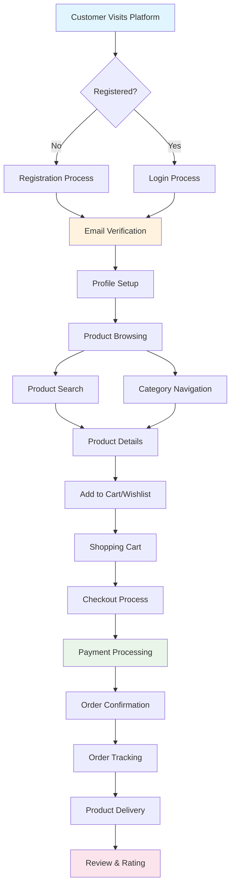
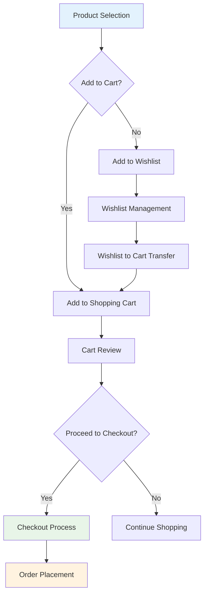
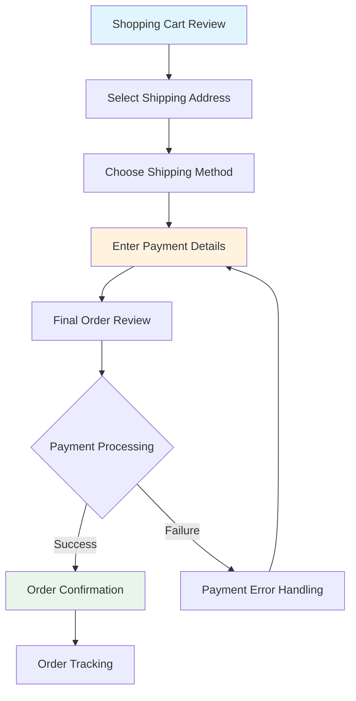
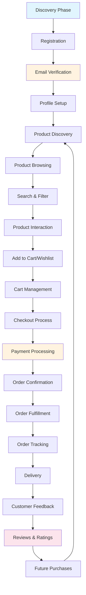

# E-commerce Customer Requirements Specification

## Overview

This document defines comprehensive customer requirements for the ecommerceMall platform, establishing the complete shopping experience from initial registration through order completion and ongoing engagement. The requirements focus on creating an intuitive, efficient, and secure environment where customers can discover products, manage their accounts, and complete purchases with confidence.

## Business Context

The ecommerceMall platform serves as a comprehensive marketplace connecting customers with multiple sellers through a unified interface. Customers require seamless access to product catalogs, personalized shopping experiences, secure payment processing, and transparent order management. The platform must balance ease of use with robust functionality while maintaining high security standards for sensitive customer data including personal information, addresses, payment details, and order history.

The customer experience prioritizes convenience, reliability, and transparency throughout the entire shopping journey. From initial product discovery through post-purchase support, every interaction should reinforce customer confidence in the platform while providing efficient tools for managing their shopping activities.

## User Journey Overview

## Customer Registration and Profile Management

### Account Creation Process

WHEN a customer visits the platform for the first time, THE system SHALL provide a streamlined registration process that minimizes friction while ensuring data integrity and security compliance.

WHEN a customer submits registration information, THE system SHALL validate all input fields for format compliance, uniqueness verification, and business rule adherence.

#### Registration Requirements

**WHEN a customer creates a new account, THE system SHALL require:**
- Valid email address that serves as the primary account identifier
- Strong password meeting security complexity requirements (minimum 8 characters, mixed case, numbers, and special characters)
- First name and last name for personalization and order processing
- Agreement to terms of service and privacy policy

**WHEN registration validation succeeds, THE system SHALL:**
- Automatically log the customer into their newly created account
- Send a verification email to the provided email address with a secure verification link
- Set account status to "email_pending_verification"
- Create a basic customer profile with default preferences
- Provide welcome messaging and next steps guidance

**WHEN registration validation fails, THE system SHALL:**
- Display specific error messages indicating which fields failed validation
- Maintain all valid input data while highlighting problematic fields
- Provide helpful guidance for resolving validation issues
- Implement rate limiting to prevent abuse of registration functionality

#### Email Verification Process

**WHEN a customer clicks the verification link in their email, THE system SHALL:**
- Validate the token authenticity and expiration status
- Update account status to "verified" upon successful validation
- Log the customer into their verified account
- Record verification timestamp for audit purposes
- Redirect to a welcome confirmation page with platform navigation

**WHEN a verification link expires or becomes invalid, THE system SHALL:**
- Display clear explanation of the expiration
- Provide option to request a new verification email
- Maintain account status as "email_pending_verification"
- Ensure security by invalidating the expired token

### Customer Profile Management

**WHEN a customer accesses their profile settings, THE system SHALL display all account information in an organized interface that allows complete profile management.**

**WHILE a customer is logged in, THE system SHALL allow modification of:**
- Personal information (name, preferred display name, phone number)
- Email address (with verification requirement for changes)
- Password (requiring current password verification)
- Communication preferences (marketing emails, order notifications, SMS alerts)
- Privacy settings and data sharing preferences

**WHEN a customer updates their profile information, THE system SHALL:**
- Validate all modified fields according to business rules
- Update the customer record with new information
- Send confirmation emails for sensitive changes (email address)
- Maintain audit trail of all profile modifications
- Provide immediate feedback on successful updates

**WHEN profile updates fail validation, THE system SHALL:**
- Prevent the update from taking effect
- Display specific error messages for each validation failure
- Maintain previous valid profile information
- Provide guidance for correcting validation errors

### Account Security Features

**WHEN a customer experiences login issues, THE system SHALL provide secure account recovery options:**

**FOR PASSWORD RECOVERY:**
- WHEN a customer requests password reset, THE system SHALL send secure reset link to verified email
- WHEN password reset link is used, THE system SHALL validate token and allow password change
- WHEN password reset link expires, THE system SHALL require new reset request

**FOR ACCOUNT SECURITY:**
- WHEN multiple failed login attempts occur, THE system SHALL implement temporary account lockout
- WHEN account shows suspicious activity, THE system SHALL require additional verification
- WHEN customer logs in from new device/location, THE system MAY require email verification

**WHEN customer account security is compromised, THE system SHALL:**
- Immediately lock the account to prevent unauthorized access
- Send security alert to registered email address
- Require identity verification before account reactivation
- Maintain detailed security audit logs

## Address Management System

### Address Book Functionality

**WHEN a customer accesses address management, THE system SHALL provide a comprehensive address book that supports multiple addresses for shipping and billing purposes.**

**WHEN a customer adds a new address, THE system SHALL require:**
- Address label (e.g., "Home", "Office", "Parents' House") for easy identification
- Complete street address including house number, street name, and apartment/suite information
- City name and state/province selection from validated lists
- Postal code with format validation for the selected country
- Country selection affecting address field requirements
- Phone number for delivery coordination (if required for the selected country)

**WHEN address validation succeeds, THE system SHALL:**
- Save the address to the customer's address book
- Associate address with appropriate address type (shipping, billing, both)
- Make the address available for selection during checkout process
- Provide confirmation of successful address addition

**WHEN address validation fails, THE system SHALL:**
- Display specific validation errors for each problematic field
- Maintain previously entered valid information
- Provide helpful formatting guidance for address components
- Prevent address saving until all validation requirements are met

### Address Management Operations

**WHEN a customer manages existing addresses, THE system SHALL allow:**
- Editing any previously saved address information
- Deleting unwanted addresses with confirmation requirement
- Setting default shipping and billing addresses
- Organizing addresses with custom labels and notes

**WHEN a customer edits an address, THE system SHALL:**
- Pre-populate all address fields with current information
- Validate all modified fields according to address validation rules
- Update the address record upon successful validation
- Maintain address history for audit and recovery purposes

**WHEN a customer deletes an address, THE system SHALL:**
- Require explicit confirmation to prevent accidental deletion
- Remove address from active use in orders and shipments
- Preserve address data in historical records if referenced by existing orders
- Update any default address selections if the deleted address was set as default

**WHEN a customer sets default addresses, THE system SHALL:**
- Automatically select default addresses during checkout
- Allow easy switching between saved addresses
- Provide visual indication of current default selections
- Maintain separate defaults for shipping and billing addresses

### Address Integration with Orders

**WHEN a customer proceeds to checkout, THE system SHALL:**
- Display all saved addresses in organized selection interface
- Allow selection of existing address or creation of new address
- Show address details clearly for verification before order submission
- Apply shipping restrictions and availability based on selected address

**WHEN address-based restrictions apply, THE system SHALL:**
- Display clear messaging about shipping limitations
- Suggest alternative addresses if available
- Provide guidance for addressing shipping restriction issues
- Prevent order completion until valid shipping address is selected

## Product Browsing and Search

### Product Discovery System

**WHEN a customer begins product browsing, THE system SHALL provide multiple discovery paths including category navigation, featured products, search functionality, and personalized recommendations.**

**WHEN a customer navigates categories, THE system SHALL display:**
- Hierarchical category structure with clear organization
- Product count for each category to manage customer expectations
- Category descriptions and filtering options at each level
- Breadcrumb navigation showing current position in category tree

**WHEN a customer views a category page, THE system SHALL display:**
- Grid or list view of products with essential information (image, name, price, rating)
- Sorting options (price low-to-high, price high-to-low, newest, most popular, rating)
- Filtering sidebar with category-specific options
- Pagination controls for large product sets
- Option to view products per page (25, 50, 100)

### Advanced Search Functionality

**WHEN a customer enters search terms, THE system SHALL provide real-time search suggestions and comprehensive result filtering.**

**WHEN a customer performs a text search, THE system SHALL:**
- Search across product names, descriptions, brands, and tags
- Provide spelling correction suggestions for misspelled terms
- Display auto-complete suggestions based on product database
- Show search results ranked by relevance and popularity
- Include count of total results and pagination for large result sets

**WHEN search results are displayed, THE system SHALL provide filtering options including:**
- Price range sliders with min/max selectors
- Brand names with product counts
- Customer rating ranges (4+ stars, 3+ stars, etc.)
- Product availability status (in stock, pre-order, out of stock)
- Shipping options (free shipping, express delivery, etc.)
- Product attributes specific to the category (size, color, material, etc.)

**WHEN filters are applied, THE system SHALL:**
- Update product listing immediately to reflect filter selections
- Maintain all active filter selections during navigation
- Show product count that would result from current filter combination
- Provide option to clear individual filters or reset all filters

### Product Detail Management

**WHEN a customer views a product detail page, THE system SHALL display comprehensive information including:**

**BASIC PRODUCT INFORMATION:**
- High-quality product images with zoom functionality
- Product name, brand, and model information
- Current price and any applicable discounts or promotions
- Customer rating summary and review count
- Stock availability status with estimated delivery information
- Product description with key features and specifications

**PRODUCT VARIANTS AND SELECTION:**
- Available variants (colors, sizes, styles) with visual selection interface
- Current selection state with clear indication of chosen options
- Price variations if different variants have different prices
- Availability status for each variant combination
- Size guides or measurement information for applicable products

**SOCIAL PROOF AND REVIEWS:**
- Display average customer rating with star visualization
- Show total number of customer reviews
- Highlight most helpful reviews and recent reviews
- Display review distribution (how many 5-star, 4-star, etc.)
- Provide quick preview of recent customer feedback

**PURCHASE INTEGRATION:**
- Add to cart and add to wishlist buttons in prominent positions
- Quantity selector with reasonable minimum and maximum limits
- Recently viewed products section
- Related product recommendations
- Social sharing options for the product

**WHEN a customer selects product variants, THE system SHALL:**
- Update product images to show selected variant
- Adjust pricing information if variant prices differ
- Check availability of selected variant combination
- Update add-to-cart button state based on availability
- Display appropriate messaging for out-of-stock variants

## Shopping Cart and Wishlist Management

### Shopping Cart Functionality

**WHEN a customer adds items to their cart, THE system SHALL provide immediate feedback and maintain cart state across browsing sessions.**

**WHEN a customer adds a product to cart, THE system SHALL:**
- Display success confirmation with cart item count update
- Add product with selected variants, quantities, and pricing
- Update cart total including any applicable taxes and shipping estimates
- Maintain cart content during the current browsing session
- Provide option to view cart contents or continue shopping

**WHEN a customer views their shopping cart, THE system SHALL display:**
- Complete list of all cart items with product images, names, and selected variants
- Individual item pricing including any discounts or promotions applied
- Quantity adjustment controls for each item with stock availability validation
- Item removal options with confirmation requirement for bulk removal
- Subtotal calculation before taxes and shipping
- Estimated tax calculation based on customer address
- Shipping cost estimation based on items and delivery address
- Total order amount including all charges

**WHEN a customer modifies cart quantities, THE system SHALL:**
- Validate requested quantity against available stock
- Update item total price when quantity changes
- Recalculate order subtotal, taxes, and shipping estimates
- Prevent quantities exceeding available inventory
- Display appropriate error messages for stock limitations
- Maintain cart persistence after quantity changes

**WHEN a customer removes items from cart, THE system SHALL:**
- Provide confirmation dialog for single item removal
- Require explicit confirmation for bulk cart clearing
- Update cart totals immediately upon item removal
- Maintain cart session state during the current browsing experience
- Preserve remaining items in cart for continued shopping

### Cart and Wishlist Workflow

### Cart Persistence and Cross-Session Management

**WHEN a customer returns to the platform, THE system SHALL maintain cart contents across browsing sessions through secure account association.**

**WHEN a logged-in customer browses the platform, THE system SHALL:**
- Automatically load their saved cart contents
- Update cart with current pricing and availability information
- Remove items that are no longer available from inventory
- Notify customer of any changes to cart contents since last visit
- Maintain cart state until items are purchased or manually removed

**WHEN cart items become unavailable or price changes occur, THE system SHALL:**
- Remove out-of-stock items from cart automatically
- Display notification of removed items and reasons
- Update pricing for remaining items if price changes occurred
- Maintain cart functionality even with inventory or price modifications
- Preserve customer intent while ensuring current information accuracy

### Wishlist Functionality

**WHEN a customer manages their wishlist, THE system SHALL provide a personalized product collection system for future purchasing consideration.**

**WHEN a customer adds products to wishlist, THE system SHALL:**
- Save products to their personal wishlist without immediate purchase commitment
- Allow wishlist organization with custom lists (e.g., "Birthday Gifts", "Home Office")
- Provide immediate feedback with wishlist item count updates
- Maintain wishlist across browsing sessions for logged-in customers
- Allow wishlist sharing through secure links or social media

**WHEN a customer views their wishlist, THE system SHALL display:**
- All saved products with current pricing and availability information
- Option to move items directly to shopping cart
- Wishlist organization tools for managing multiple lists
- Stock availability alerts for out-of-stock wishlist items
- Price drop notifications for saved products (when price decreases)
- Product availability updates when items return to stock

**WHEN customers share wishlists, THE system SHALL:**
- Generate secure, time-limited sharing links
- Allow controlled access to wishlist contents
- Prevent unauthorized modifications to shared wishlists
- Provide analytics on wishlist access for gift-giving scenarios
- Maintain privacy controls over wishlist sharing settings

### Cart and Wishlist Integration

**WHEN customers interact between cart and wishlist, THE system SHALL provide seamless transitions and intelligent product management.**

**CART-TO-WISHLIST TRANSFERS:**
- WHEN customers move items from cart to wishlist, THE system SHALL remove items from cart and add to selected wishlist
- WHEN items are moved between lists, THE system SHALL maintain variant selections and quantities
- WHEN customers need to save items for later purchase, THE system SHALL provide one-click transfer options

**INVENTORY AND AVAILABILITY MANAGEMENT:**
- WHEN wishlist items become available after being out-of-stock, THE system SHALL send notification to customer
- WHEN cart items become unavailable during shopping session, THE system SHALL move them to wishlist with customer option
- WHEN products are discontinued, THE system SHALL notify wishlist customers with alternative recommendations

## Order Placement and Management

### Checkout Process Overview

**WHEN a customer initiates checkout, THE system SHALL provide a structured, multi-step process that guides customers through order completion with clear progress indicators and validation at each stage.**

**THE checkout process SHALL include these sequential steps:**
1. **Order Review**: Display cart contents with modification options
2. **Shipping Address**: Select or create shipping address for order delivery
3. **Shipping Method**: Choose available shipping options with cost and delivery time estimates
4. **Payment Method**: Select payment method and enter payment details securely
5. **Order Review**: Final confirmation with complete order summary
6. **Order Confirmation**: Success confirmation with order number and tracking information

### Checkout Process Workflow

### Address and Shipping Selection

**WHEN a customer reaches the shipping address selection step, THE system SHALL:**
- Display all saved addresses in organized selection interface
- Allow selection of existing address or creation of new address during checkout
- Validate selected address for shipping availability and restrictions
- Calculate shipping costs and delivery estimates based on selected address
- Allow shipping address to differ from billing address if customer preferences

**WHEN a customer selects shipping method, THE system SHALL display:**
- All available shipping options for the selected address and cart contents
- Cost breakdown for each shipping method with clear pricing
- Estimated delivery dates with specific timeframes (e.g., "3-5 business days")
- Special handling requirements or restrictions for selected items
- Free shipping eligibility based on order total and promotional offers

**WHEN shipping restrictions apply, THE system SHALL:**
- Display clear messaging about why certain shipping methods aren't available
- Suggest alternative shipping options or addresses if possible
- Prevent order completion until valid shipping method is selected
- Provide guidance for addressing shipping limitation issues

### Payment Processing Integration

**WHEN a customer proceeds to payment, THE system SHALL provide secure payment processing with multiple payment method options.**

**PAYMENT METHOD SUPPORT:**
- **Credit and Debit Cards**: Visa, MasterCard, American Express with secure card data handling
- **Digital Wallets**: PayPal, Apple Pay, Google Pay for quick checkout
- **Buy Now, Pay Later**: Installment payment options through partner providers
- **Bank Transfers**: Direct bank transfer for large orders or specific customer preferences
- **Stored Payment Methods**: Saved payment options for returning customers

**SECURE PAYMENT PROCESSING:**
- WHEN customer enters payment information, THE system SHALL encrypt all sensitive data transmission
- WHEN payment details are validated, THE system SHALL process payment through secure gateway
- WHEN payment is approved, THE system SHALL confirm order placement and generate order number
- WHEN payment is declined, THE system SHALL provide specific error messaging and alternative payment options

**PAYMENT ERROR HANDLING:**
- WHEN payment processing fails, THE system SHALL preserve all order information and customer selections
- WHEN payment information is invalid, THE system SHALL highlight specific fields requiring correction
- WHEN payment is declined by bank, THE system SHALL suggest alternative payment methods
- WHEN technical payment issues occur, THE system SHALL provide clear error messaging and retry options

### Order Validation and Confirmation

**WHEN customer submits final order, THE system SHALL validate all order components before processing payment.**

**ORDER VALIDATION REQUIREMENTS:**
- Cart contents remain available and in-stock at time of order submission
- Selected shipping address is valid and accepts delivery
- Selected payment method passes validation checks
- Customer account status allows order placement
- Order total meets minimum purchase requirements

**WHEN order validation succeeds, THE system SHALL:**
- Process payment through secure payment gateway
- Generate unique order number for tracking purposes
- Create order record with complete details (items, shipping, billing, payment)
- Send order confirmation email with order summary and next steps
- Update inventory levels for purchased items
- Begin order fulfillment process immediately

**WHEN order validation fails, THE system SHALL:**
- Display specific validation errors preventing order completion
- Maintain all customer selections and prevent data loss
- Provide guidance for resolving validation issues
- Allow customers to modify order components before retry

### Order Tracking and Management

**WHEN customers view order status, THE system SHALL provide comprehensive tracking information throughout the order lifecycle.**

**ORDER STATUS TRACKING:**
- **Order Placed**: Confirmation of successful order submission with order number
- **Payment Confirmed**: Payment processing completion and order authorization
- **Processing**: Order preparation and item picking by seller
- **Shipped**: Order handed off to shipping carrier with tracking number
- **In Transit**: Real-time shipping updates and estimated delivery
- **Delivered**: Confirmation of successful delivery completion
- **Completed**: Final status after customer confirms receipt or return period expires

**WHEN order status updates occur, THE system SHALL:**
- Send automatic email notifications for major status changes
- Update order status in customer account dashboard
- Provide estimated delivery dates that adjust based on shipping progress
- Display tracking numbers and links to carrier tracking pages
- Alert customers to any delays or issues with their orders

**WHEN customers need to modify orders, THE system SHALL allow order modifications within reasonable timeframes:**

**ORDER MODIFICATION POLICIES:**
- **Before Processing**: Full order cancellation or modification within 1 hour of placement
- **During Processing**: Limited modifications (shipping address changes) if order hasn't shipped
- **After Shipping**: Only shipping address modifications through carrier (fees may apply)
- **Upon Delivery**: Return and refund processes for damaged or incorrect items

**CANCELLATION AND REFUND PROCESSING:**
- WHEN customer requests order cancellation, THE system SHALL assess order status and processing stage
- WHEN cancellation is possible, THE system SHALL process refund immediately and send confirmation
- WHEN cancellation is not possible, THE system SHALL explain why and suggest alternatives
- WHEN partial cancellation is needed, THE system SHALL process refund for cancelled items only

### Order History and Reordering

**WHEN customers access order history, THE system SHALL provide comprehensive access to past orders with advanced management capabilities.**

**ORDER HISTORY DISPLAY:**
- Chronological listing of all customer orders with key information (date, total, status)
- Detailed order views showing all items, shipping information, and payment details
- Order status indicators with color coding for easy status recognition
- Search and filtering capabilities for finding specific orders
- Download options for order receipts and shipping confirmations

**REORDERING FUNCTIONALITY:**
- WHEN customers find previous orders they wish to reorder, THE system SHALL provide one-click reorder options
- WHEN reorder is initiated, THE system SHALL create new order with identical items and specifications
- WHEN product availability has changed, THE system SHALL inform customer of modifications needed
- WHEN reorder quantities are adjusted, THE system SHALL validate against current inventory

**RETURN AND REFUND MANAGEMENT:**
- WHEN customers need to return items, THE system SHALL provide return authorization process
- WHEN return is initiated, THE system SHALL generate return shipping labels and instructions
- WHEN refunds are processed, THE system SHALL update order status and send refund confirmation
- WHEN return window expires, THE system SHALL inform customers of return policy limitations

## Product Reviews and Ratings

### Review and Rating System

**WHEN customers complete purchases, THE system SHALL encourage and facilitate product feedback through a comprehensive review and rating system.**

**REVIEW SUBMISSION PROCESS:**
- **Eligibility**: Only customers who purchased the product can submit reviews
- **Verification**: Reviews are marked as "verified purchase" to build customer trust
- **Timing**: Reviews can be submitted anytime after purchase, with reminder emails
- **Anonymity**: Customers can choose to post reviews anonymously or with display name

**WHEN customers submit reviews, THE system SHALL collect:**
- Product rating on 5-star scale with half-star increments
- Review title summarizing customer experience
- Detailed review text describing product quality, performance, and experience
- Product photos or videos showing actual product use (optional)
- Recommendation indicator (yes/no/maybe) for other customers
- Specific attribute ratings (size, quality, value, etc.) for applicable products

**WHEN review submission is completed, THE system SHALL:**
- Display review immediately on product page (pending moderation if enabled)
- Send confirmation to customer about successful review submission
- Update product's overall rating and review count
- Provide moderation queue for admin review if content moderation is enabled

### Review Management and Display

**WHEN reviews are displayed on product pages, THE system SHALL present comprehensive review information in an organized, trustworthy format.**

**REVIEW ORGANIZATION:**
- Reviews sorted by helpfulness, most recent, or highest rating based on customer preference
- Filter options to view reviews by rating (5-star only, 4-star and above, etc.)
- Display verified purchase badges for authenticity
- Show review dates and customer purchase dates for context
- Highlight most helpful reviews based on customer voting

**REVIEW RATING SUMMARY:**
- Overall average rating displayed prominently with star visualization
- Rating distribution showing count of each star rating
- Recommendation percentage (percentage of customers who recommend product)
- Review count with trending indicators (increasing/decreasing review activity)
- Quick insight summaries (most common praise, common concerns)

**REVIEW INTERACTION FEATURES:**
- Helpful/not helpful voting system for each review
- Reply functionality allowing sellers to respond to reviews
- Report review option for inappropriate or fake reviews
- Share individual reviews through social media or email
- Follow specific reviewers for their future product insights

### Review Quality and Moderation

**WHEN customers interact with reviews, THE system SHALL maintain review quality through moderation and fraud prevention.**

**REVIEW MODERATION POLICIES:**
- **Automated Filtering**: Spam detection, inappropriate language filtering, and duplicate review prevention
- **Manual Moderation**: Admin review for flagged reviews and sensitive product categories
- **Seller Response**: Allow sellers to respond to reviews within defined timeframes
- **Review Updates**: Enable customers to update or correct their reviews within reasonable timeframes

**ANTI-FRAUD MEASURES:**
- **Purchase Verification**: Only verified purchases can submit reviews
- **IP Tracking**: Monitor for suspicious review patterns from same IP addresses
- **Review Timing**: Detect abnormally rapid review submissions
- **Content Analysis**: Automated detection of fake review patterns and language
- **Customer History**: Consider customer review history and reputation

**WHEN fraudulent reviews are detected, THE system SHALL:**
- Remove reviews that violate fraud policies
- Suspend customer accounts showing consistent fraudulent behavior
- Investigate patterns of fake reviews across multiple products
- Maintain audit trail of review moderation actions
- Send notifications to affected customers about review status changes

### Rating Analytics and Insights

**WHEN rating data is collected, THE system SHALL provide valuable analytics for both customers and sellers.**

**CUSTOMER-FACING RATING INSIGHTS:**
- Rating trends over time showing product quality changes
- Comparison ratings across similar products in same category
- Rating breakdowns by customer demographics (if customer chooses to share)
- Seasonal rating patterns showing product performance over time
- Rating correlation with price points and product features

**RATING CALCULATION METHODOLOGY:**
- **Overall Rating**: Weighted average of all verified customer ratings
- **Recent Reviews**: Higher weight given to more recent reviews
- **Review Quality**: Verified purchases weighted higher than anonymous reviews
- **Minimum Threshold**: Products need minimum number of reviews for rating display
- **Recency Boost**: Recent purchases may receive additional weight in calculations

**WHEN customers view rating analytics, THE system SHALL:**
- Provide clear explanations of how ratings are calculated
- Display rating confidence indicators based on review volume
- Show comparison benchmarks for similar products
- Highlight key rating trends and changes over time
- Enable filtering by rating timeframe and verification status

## Performance and User Experience Requirements

### Response Time Expectations

**WHEN customers interact with the platform, THE system SHALL maintain performance standards that create a smooth, responsive shopping experience:**

- **Page Load Times**: Product catalog pages SHALL load within 2 seconds for optimal customer engagement
- **Search Response**: Search results SHALL appear within 1 second of query submission
- **Cart Operations**: Adding items to cart, quantity changes, and cart updates SHALL be instantaneous
- **Checkout Process**: Each checkout step SHALL complete within 3 seconds including validation
- **Order Processing**: Order confirmation SHALL be delivered within 10 seconds of submission

**WHEN system performance degrades, THE system SHALL:**
- Display appropriate loading indicators to maintain customer confidence
- Provide estimated completion times for longer operations
- Implement fallback mechanisms for critical customer actions
- Log performance issues for system optimization
- Maintain cart and session state during performance issues

### Mobile and Cross-Device Experience

**WHEN customers access the platform across different devices, THE system SHALL provide consistent functionality and state persistence:**

- **Cross-Device Cart Sync**: Shopping cart contents SHALL synchronize across all customer devices
- **Mobile Optimization**: All customer features SHALL be fully functional on mobile devices
- **Progressive Web App**: Platform SHALL work offline for basic cart and wishlist functionality
- **Touch-Friendly Interface**: All interactive elements SHALL be optimized for touch interaction
- **Responsive Design**: Platform SHALL adapt seamlessly to different screen sizes and orientations

### Security and Privacy Requirements

**WHEN customers trust the platform with their personal and payment information, THE system SHALL implement comprehensive security measures:**

- **Data Encryption**: All customer data SHALL be encrypted in transit and at rest
- **PCI Compliance**: Payment processing SHALL meet PCI DSS security standards
- **Privacy Protection**: Customer data SHALL not be shared without explicit consent
- **Access Control**: Customer accounts SHALL be accessible only to the account owner
- **Audit Logging**: All customer data access SHALL be logged for security monitoring

**WHEN security breaches or suspicious activity occur, THE system SHALL:**
- Immediately secure affected customer accounts
- Send security alerts to affected customers
- Investigate security incidents and implement fixes
- Maintain detailed security audit logs
- Cooperate with law enforcement when required

## Integration Points and System Dependencies

### External Service Integration

**WHEN customer actions require external services, THE system SHALL integrate seamlessly with third-party providers:**

- **Payment Gateways**: Secure processing through multiple payment providers
- **Shipping Carriers**: Real-time shipping rates and tracking integration
- **Email Services**: Automated notifications and marketing communications
- **Inventory Systems**: Real-time stock updates from multiple sellers
- **Analytics Platforms**: Customer behavior tracking and business intelligence

**WHEN external services are unavailable, THE system SHALL:**
- Gracefully handle service disruptions without customer impact
- Provide alternative processing methods when possible
- Display appropriate error messaging for service limitations
- Maintain customer data integrity during service interruptions
- Implement retry mechanisms for temporary service issues

### Data Synchronization Requirements

**WHEN customer data changes across the platform, THE system SHALL maintain data consistency and accuracy:**

- **Real-Time Updates**: Price changes, inventory updates, and product modifications SHALL be reflected immediately
- **Conflict Resolution**: Multiple concurrent customer actions SHALL be handled without data corruption
- **Data Backup**: Customer data SHALL be backed up regularly with disaster recovery procedures
- **Version Control**: Order modifications and customer data changes SHALL maintain version history
- **Cross-Platform Sync**: Customer preferences and settings SHALL synchronize across all platform interfaces

## Success Metrics and KPIs

### Customer Experience Metrics

**WHEN measuring platform success, THE system SHALL track key performance indicators that reflect customer satisfaction and engagement:**

- **Customer Acquisition**: New customer registration rates and conversion from visitor to customer
- **Customer Retention**: Repeat purchase rates and customer lifetime value
- **Order Completion**: Percentage of shopping carts that result in completed orders
- **Customer Satisfaction**: Review ratings, customer feedback scores, and support ticket resolution
- **Platform Engagement**: Page views per session, time spent on platform, and feature adoption rates

### Operational Excellence Metrics

**WHEN monitoring platform operations, THE system SHALL measure efficiency and reliability factors:**

- **Order Processing Time**: Average time from order placement to shipping
- **Inventory Accuracy**: Stock level accuracy and inventory synchronization speed
- **Payment Processing**: Payment success rates and transaction completion times
- **System Uptime**: Platform availability and performance during peak usage
- **Customer Support**: Response times and resolution rates for customer service requests

**WHEN metrics fall below acceptable thresholds, THE system SHALL:**
- Generate alerts for operational team attention
- Implement automated remediation procedures when possible
- Provide detailed reporting for management review
- Enable performance optimization initiatives
- Maintain service level agreements with customers and business partners

## Business Process Flows

### Complete Customer Lifecycle

## Conclusion

This customer requirements specification provides comprehensive coverage of all customer-facing functionality for the ecommerceMall platform. The requirements emphasize user experience, security, and operational excellence while providing clear guidance for implementation teams. All requirements follow EARS format to ensure clarity, testability, and successful delivery of a world-class e-commerce shopping experience.

The specification balances immediate customer needs with long-term platform scalability, ensuring the ecommerceMall can grow and evolve while maintaining high standards for customer satisfaction, security, and reliability. Implementation teams should use this document as the foundation for all customer-facing feature development and testing activities.

The platform architecture must support seamless customer journeys while maintaining robust security, high performance, and excellent user experience across all devices and interaction points. Success depends on executing all requirements with attention to detail, user-centric design, and operational excellence.