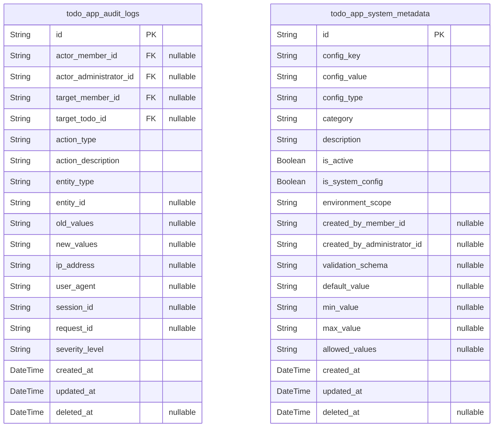
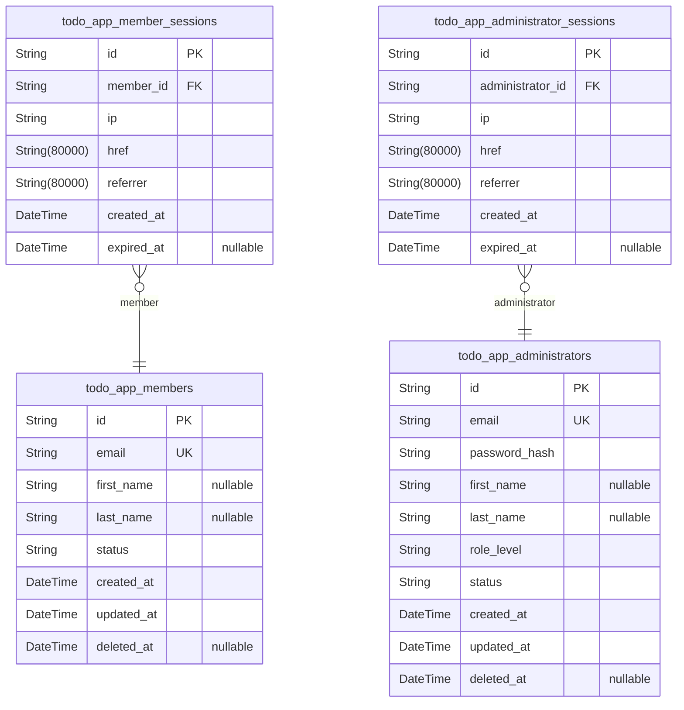
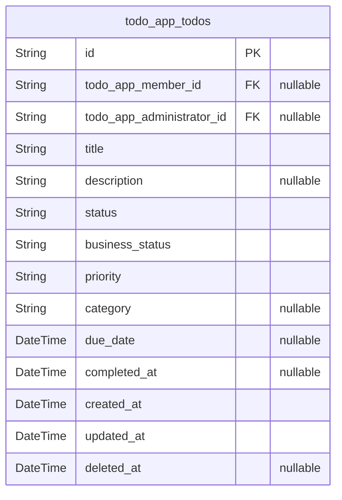

# Prisma Markdown

> Generated by [`prisma-markdown`](https://github.com/samchon/prisma-markdown)

- [Systematic](#systematic)
- [Actors](#actors)
- [Business](#business)

## Systematic

### `todo_app_audit_logs`

Comprehensive activity tracking system that records all user actions and
system events for security, compliance, and operational monitoring
purposes.

This table provides a complete audit trail of user interactions with the
TodoApp system, including member and administrator actions on todos, user
account activities, session management, and system-level events. Each
audit log entry captures the actor, action performed, affected entities,
and detailed context information to support forensic analysis and
regulatory compliance requirements.

The audit logging system ensures transparency and accountability by
tracking who performed what actions, when they occurred, and what data
was affected. This enables security monitoring, user behavior analysis,
compliance reporting, and incident investigation capabilities across the
entire TodoApp ecosystem.

All user actions on todos, user account modifications, administrative
operations, and system events are logged with comprehensive metadata
including IP addresses, user agent information, and detailed action
descriptions to provide complete operational visibility and security
oversight.

Properties as follows:

- `id`: Primary Key.
- `actor_member_id`
  > Member user who performed the audited action, if applicable. References
  > [todo_app_members.id](#todo_app_members) when the action was performed by a regular
  > member user.
- `actor_administrator_id`
  > Administrator user who performed the audited action, if applicable.
  > References [todo_app_administrators.id](#todo_app_administrators) when the action was
  > performed by an administrative user.
- `target_member_id`
  > Member user who is the subject of the audited action, if applicable.
  > References [todo_app_members.id](#todo_app_members) when the action targets a specific
  > member user.
- `target_todo_id`
  > Todo item that is the subject of the audited action, if applicable.
  > References [todo_app_todos.id](#todo_app_todos) when the action involves a specific
  > todo item.
- `action_type`
  > Type of action that was performed. Valid values include: create_todo,
  > update_todo, delete_todo, complete_todo, incomplete_todo, login, logout,
  > register, update_profile, admin_create_user, admin_update_user,
  > admin_delete_user, admin_view_user, system_config_update,
  > system_maintenance, and other action types.
- `action_description`
  > Detailed description of the action performed, providing context and
  > specific information about what was done. This field contains
  > human-readable explanation of the audit event for operational review and
  > compliance purposes.
- `entity_type`
  > Type of entity that was affected by the action. Valid values include:
  > user, todo, session, system_config, and other entity types that can be
  > audited.
- `entity_id`
  > Unique identifier of the specific entity that was affected by the action.
  > This references the primary key of the affected entity (todo, user, etc.)
  > and is null for system-level actions that don't target specific entities.
- `old_values`
  > Previous state of the entity before the action was performed, stored as
  > JSON string. This captures the "before" state for update actions to
  > enable complete change tracking and rollback capabilities. Null for
  > actions that don't modify state (create, delete, read operations).
- `new_values`
  > New state of the entity after the action was performed, stored as JSON
  > string. This captures the "after" state for update actions and the
  > complete state for create actions. Null for delete operations and
  > read-only actions.
- `ip_address`
  > IP address of the user who performed the action, used for security
  > monitoring, location-based security analysis, and forensic
  > investigations. This field supports both IPv4 and IPv6 addresses.
- `user_agent`
  > User agent string from the client's browser or application, providing
  > information about the client software, operating system, and device used
  > for the action. This aids in security analysis and client compatibility
  > monitoring.
- `session_id`
  > Session identifier that was active when the action was performed, linking
  > the audit log to the specific user session for comprehensive activity
  > tracking and session-based analysis.
- `request_id`
  > Unique request identifier for correlating related actions and requests
  > across distributed system components, enabling request tracing and
  > distributed transaction analysis.
- `severity_level`
  > Severity level of the audit event for filtering and prioritization. Valid
  > values include: info, warning, error, critical, and security. Used for
  > operational monitoring and alert filtering.
- `created_at`
  > Timestamp when the audit log entry was created, automatically set to
  > current system time when the action occurs. This serves as the primary
  > temporal reference for audit timeline analysis and compliance reporting.
- `updated_at`
  > Timestamp when the audit log entry was last modified, automatically
  > updated when any field of the log entry is changed. This supports audit
  > log integrity and change tracking requirements.
- `deleted_at`
  > Soft delete timestamp for audit log entries that are marked for removal
  > but preserved for compliance requirements. When populated, indicates that
  > this audit log entry has been logically deleted but retained for legal
  > and regulatory requirements.

### `todo_app_system_metadata`

Application-wide configuration and operational metadata storage that
provides centralized management of system settings, feature flags,
operational parameters, and application-wide configuration values.

This table serves as the single source of truth for all TodoApp system
configuration, enabling dynamic configuration management, feature
toggles, operational settings, and application metadata without requiring
code deployments. System administrators can modify configuration values
through administrative interfaces while maintaining complete audit trails
of all configuration changes.

The system metadata framework supports various configuration types
including boolean feature flags for enabling/disabling functionality,
numeric thresholds and limits, string configuration values for system
parameters, JSON configuration objects for complex structured data, and
version tracking for configuration schema evolution.

All configuration changes are fully audited through the audit logging
system, ensuring complete traceability of who made configuration changes,
when they occurred, and what the previous values were. This enables
rollback capabilities, compliance reporting, and operational governance
of the TodoApp system configuration.

The metadata system supports environment-specific configurations,
allowing different settings for development, staging, and production
environments while maintaining centralized control and consistent
management practices across all deployment environments.

Properties as follows:

- `id`: Primary Key.
- `config_key`
  > Unique configuration key that identifies the specific metadata entry.
  > Keys follow a hierarchical naming convention using dots for organization
  > (e.g., 'features.todo_sharing', 'limits.max_todos_per_user',
  > 'ui.theme_default') and must be unique across the entire system.
- `config_value`
  > Configuration value stored as string, which can represent various data
  > types based on the configuration schema. Numeric values are stored as
  > strings and parsed by applications, boolean values use 'true'/'false',
  > and complex objects are stored as JSON strings.
- `config_type`
  > Data type of the configuration value for validation and parsing. Valid
  > values include: string, number, boolean, json, and url. This enables
  > proper validation and type conversion by consuming applications.
- `category`
  > Configuration category for organizational purposes and administrative
  > grouping. Valid categories include: feature_flags, system_limits,
  > ui_settings, security_settings, performance_settings,
  > integration_settings, and operational_settings.
- `description`
  > Human-readable description of what this configuration controls, its
  > purpose, valid values, and impact on system behavior. This provides
  > context for administrators and supports configuration management best
  > practices.
- `is_active`
  > Whether this configuration entry is currently active and being used by
  > the system. Inactive configurations are preserved for reference but not
  > applied to system behavior, enabling safe deprecation and rollback
  > scenarios.
- `is_system_config`
  > Whether this configuration is a system-level setting that affects all
  > users and cannot be overridden by user-specific settings. System
  > configurations take precedence over user-level settings and are typically
  > managed by administrators only.
- `environment_scope`
  > Deployment environment scope for this configuration. Valid values
  > include: all, development, staging, production. Configurations with 'all'
  > scope apply to all environments, while specific environment scopes apply
  > only to those environments.
- `created_by_member_id`
  > Member user who created this configuration entry, if applicable.
  > References [todo_app_members.id](#todo_app_members) when the configuration was created
  > by a member user (typically for user-level preferences).
- `created_by_administrator_id`
  > Administrator user who created this configuration entry, if applicable.
  > References [todo_app_administrators.id](#todo_app_administrators) when the configuration was
  > created by an administrative user.
- `validation_schema`
  > JSON schema string that defines validation rules for this configuration
  > value, enabling runtime validation of configuration changes and ensuring
  > configuration integrity before application.
- `default_value`
  > Default value for this configuration if not explicitly set, providing
  > fallback behavior and ensuring system stability when specific
  > configurations are not defined.
- `min_value`
  > Minimum allowed value for numeric configurations, providing lower bounds
  > validation for system limits and thresholds. Null for non-numeric
  > configurations.
- `max_value`
  > Maximum allowed value for numeric configurations, providing upper bounds
  > validation for system limits and thresholds. Null for non-numeric
  > configurations.
- `allowed_values`
  > JSON array string of allowed values for this configuration, providing
  > enumeration validation for configurations with limited valid value sets.
  > Null for configurations without value restrictions.
- `created_at`
  > Timestamp when this configuration entry was created, automatically set to
  > current system time during initial configuration setup.
- `updated_at`
  > Timestamp when this configuration entry was last modified, automatically
  > updated when any field of the configuration is changed.
- `deleted_at`
  > Soft delete timestamp for configuration entries that are marked for
  > removal but preserved for rollback and audit purposes. When populated,
  > indicates that this configuration has been logically deleted but retained
  > for historical reference and potential restoration.

## Actors

### `todo_app_members`

User profile information with separated concerns for enhanced security
and proper 3NF normalization.

Contains only profile data (names, contact info, status) that directly
relates to member identity and user experience. Authentication security
is handled by separate authentication table to prevent transitive
dependencies and security vulnerabilities.

Profile data is independent of authentication mechanisms and can be
updated without affecting login credentials. This separation supports
better security practices and enables flexible authentication
implementations.

The profile maintains soft deletion capability for account recovery while
ensuring profile operations don't impact authentication security. Status
tracking enables proper user lifecycle management.

Properties as follows:

- `id`: Primary Key.
- `email`
  > Member email address used for account identification and communication.
  > Must be unique across all members for account differentiation and contact
  > purposes.
- `first_name`
  > Member's first name for personalization and user interface display. Used
  > for addressing the user in communications and displaying personalized
  > content.
- `last_name`
  > Member's last name for complete user identification and family name
  > tracking. Works with first name for full name display and formal
  > communications.
- `status`
  > Current account status for lifecycle management. Valid values: active,
  > suspended, deactivated. Controls member access to Todo management
  > functionality and system features.
- `created_at`
  > Member profile creation timestamp. Records when the member account was
  > initially created and registered in the system for audit trail purposes.
- `updated_at`
  > Last profile modification timestamp. Updates whenever member profile
  > information is changed to maintain accurate audit trail and change
  > history.
- `deleted_at`
  > Soft deletion timestamp for account recovery. Null when account is
  > active, contains deletion timestamp when account is soft deleted for
  > recoverable account management.

### `todo_app_administrators`

System administrators with elevated permissions to manage all users,
system operations, and provide oversight of the entire TodoApp system.

Represents administrative users who can access all user data, manage
member accounts, monitor system performance, and perform administrative
functions. Administrators have system-wide privileges while maintaining
secure authentication and session management.

Administrative accounts include enhanced security measures and
comprehensive audit logging for all administrative actions. These
accounts can manage user lifecycle, system configuration, and provide
user support through full system access.

Properties as follows:

- `id`: Primary Key.
- `email`
  > Administrator email address for secure authentication and administrative
  > access. Must be unique across all administrators for security and
  > accountability.
- `password_hash`
  > Encrypted password hash for administrative authentication. Uses strong
  > hashing algorithm to protect administrative accounts from unauthorized
  > access.
- `first_name`
  > Administrator's first name for identification and audit logging. Used for
  > accountability and administrative user interface display.
- `last_name`
  > Administrator's last name for complete identification. Works with first
  > name for comprehensive administrator identification in audit trails.
- `role_level`
  > Administrative role level for permission management. Valid values:
  > super_admin, admin, moderator. Controls the scope of administrative
  > privileges.
- `status`
  > Current administrative account status. Valid values: active, suspended,
  > deactivated. Controls access to administrative functions and system
  > oversight.
- `created_at`
  > Administrative account creation timestamp. Records when the administrator
  > account was created for audit and compliance tracking.
- `updated_at`
  > Last administrative account modification timestamp. Updates when role
  > level, status, or other administrative fields are changed.
- `deleted_at`
  > Soft deletion timestamp for administrative account recovery. Null when
  > account is active, contains deletion timestamp when account is soft
  > deleted.

### `todo_app_member_sessions`

Independent session management for authenticated member users with
comprehensive security tracking and operational oversight.

Manages secure session records for individual members, providing
authentication context for Todo operations and enabling comprehensive
security monitoring. Each session supports independent management for
cross-member analytics, security incident investigation, and
administrative oversight.

Sessions include detailed connection metadata for security monitoring,
audit trail support for user activity tracking, and independent
operational management for compliance and security requirements.
Essential for maintaining system security while enabling member
functionality.

Primary stance ensures sessions can be independently queried, managed,
and audited without requiring nested operations through member accounts.

Properties as follows:

- `id`: Primary Key.
- `member_id`
  > Reference to the member account that owns this session. {@link
  > todo_app_members.id}. Each session belongs to exactly one member account
  > for proper security isolation.
- `ip`
  > Member's IP address for connection tracking and security monitoring. Used
  > to identify session origin, detect suspicious login patterns, and support
  > geographic security analysis.
- `href`
  > Connection URL where the session was established. Records the originating
  > URL or endpoint for session audit, security analysis, and user experience
  > tracking.
- `referrer`
  > Referrer URL that led to the session creation. Provides context for how
  > the member accessed the system for security analysis, marketing
  > attribution, and user journey tracking.
- `created_at`
  > Session creation timestamp. Records when the member successfully
  > authenticated and established this session for audit trail and session
  > lifecycle management.
- `expired_at`
  > Session expiration timestamp for automatic cleanup and access control.
  > When session expires, member must re-authenticate to continue accessing
  > Todo functionality.

### `todo_app_administrator_sessions`

Independent session management for authenticated administrator users with
enhanced security oversight and comprehensive audit capabilities.

Manages secure session records for administrative users, providing
authentication context for system-wide management operations with
independent operational oversight. Each session supports comprehensive
security monitoring, cross-administrator analytics, and detailed audit
requirements for privileged access.

Administrative sessions include enhanced connection metadata for security
tracking, comprehensive audit trail support for compliance, and
independent session management capabilities. Critical for maintaining
system security while enabling full administrative functionality.

Primary stance ensures administrative sessions can be independently
monitored, audited, and managed for security compliance and operational
oversight without requiring nested administrative account operations.

Properties as follows:

- `id`: Primary Key.
- `administrator_id`
  > Reference to the administrator account that owns this session. {@link
  > todo_app_administrators.id}. Each session belongs to exactly one
  > administrative account for proper security isolation and accountability.
- `ip`
  > Administrator's IP address for security tracking and audit logging.
  > Monitors administrative access patterns, detects potential security
  > threats, and supports forensic investigation of administrative actions.
- `href`
  > Connection URL for administrative session establishment. Records
  > administrative access origin for security analysis, compliance reporting,
  > and administrative activity attribution.
- `referrer`
  > Referrer URL for administrative session context. Provides administrative
  > access analytics, security investigation capabilities, and administrative
  > user journey understanding.
- `created_at`
  > Administrative session creation timestamp. Records when administrator
  > successfully authenticated and gained system management access for
  > comprehensive audit trail.
- `expired_at`
  > Administrative session expiration timestamp for privileged access control
  > and security best practices. Automatic expiration ensures administrative
  > accounts don't remain indefinitely logged in.

## Business

### `todo_app_todos`

Core business entity representing personal task items managed by users in
the TodoApp system.

Stores individual todo items that users create, manage, and organize to
improve their productivity and task completion rates. Each todo item is
owned by a specific user (member or administrator) and contains all
necessary information for effective task management including title,
description, completion status, priority level, and categorization.

Todo items support the complete task lifecycle from creation through
completion, with proper tracking of creation timestamps, modification
history, and optional due dates for deadline management. The system
enables users to organize their personal tasks efficiently while
maintaining data isolation between different users.

Soft deletion is supported to maintain audit trails while allowing task
removal when no longer needed.

Properties as follows:

- `id`: Primary Key.
- `todo_app_member_id`
  > Reference to the member who owns this todo item. Null when todo is owned
  > by an administrator.
- `todo_app_administrator_id`
  > Reference to the administrator who owns this todo item. Null when todo is
  > owned by a member.
- `title`
  > Todo task title describing the specific task or objective. Required field
  > between 1-200 characters.
- `description`
  > Optional detailed description providing additional context, requirements,
  > or notes for the todo task. Maximum 1000 characters.
- `status`
  > Current status of the todo item. Values: 'pending', 'in_progress',
  > 'completed', 'cancelled'. Default: 'pending'.
- `business_status`
  > Business workflow status for advanced task tracking. Values: 'active',
  > 'on_hold', 'archived'. Default: 'active'.
- `priority`
  > Task priority level for organization and focus management. Values: 'low',
  > 'medium', 'high', 'urgent'. Default: 'medium'.
- `category`
  > Optional category or tag for task grouping and organization. Maximum 50
  > characters.
- `due_date`
  > Optional due date for task deadline management. Must be current date or
  > future date.
- `completed_at`
  > Timestamp when the todo item was marked as completed. Null for incomplete
  > items.
- `created_at`: Task creation timestamp showing when the todo item was originally created.
- `updated_at`
  > Last modification timestamp showing when the todo item was most recently
  > updated.
- `deleted_at`: Soft delete timestamp for maintaining audit trails. Null for active tasks.
