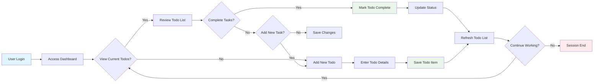
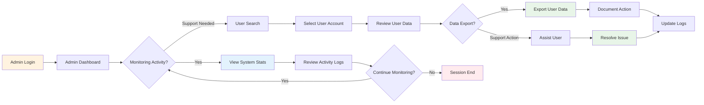
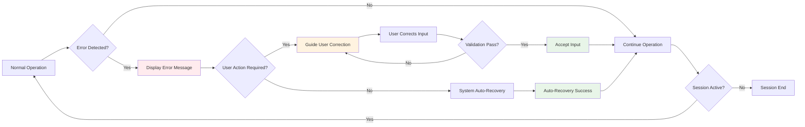

# TodoApp User Stories and Scenarios

## Executive Summary

This document outlines comprehensive user stories and scenarios for the TodoApp system, providing detailed workflows and user journeys that demonstrate how users interact with the application to accomplish their goals. The scenarios focus on minimum functionality while ensuring robust user experiences for Todo list management.

### Document Purpose
- Define practical user workflows and journeys
- Provide detailed scenarios for testing and development
- Establish user experience expectations
- Guide implementation of core features
- Ensure comprehensive coverage of user needs

### Target Users
This document serves development teams, product managers, and QA personnel in understanding how users interact with the TodoApp system across different scenarios and user roles.

### Minimum Functionality Overview
The TodoApp system provides essential Todo list management capabilities with user authentication, enabling users to create, view, edit, and delete their personal Todo items through a web-based interface. The system supports two user types: regular Members who manage their own Todo lists, and Administrators who can monitor system usage and provide user support.

## Primary User Scenarios

### Member User: Personal Todo Management

#### Scenario 1: First-Time User Getting Started
**User Persona:** New member creating their first Todo item
**Goal:** Create a simple Todo item and verify it appears correctly

**WHEN a new user accesses the TodoApp system for the first time, THE system SHALL guide the user through account login and initial setup.

**Step-by-Step Journey:**
1. User accesses the TodoApp login page
2. User enters valid email and password credentials
3. User clicks "Sign In" button
4. System validates credentials and creates authenticated session
5. User is redirected to the main Todo dashboard
6. User clicks "Add New Todo" button
7. User enters Todo title: "Buy groceries"
8. User clicks "Save" button
9. System validates and saves the new Todo item
10. Todo item appears in the user's active Todo list
11. User can see the item is marked as "Incomplete"
12. User verifies the Todo is saved and accessible

**Expected Outcome:** User successfully creates their first Todo item and sees it displayed in their personal dashboard.

**Success Criteria:**
- Todo item is created and persisted
- Item appears immediately in the user's Todo list
- System provides clear confirmation of successful creation
- User can see all item details (title, status, creation date)

#### Scenario 2: Daily Todo Management
**User Persona:** Regular member managing daily tasks
**Goal:** Complete existing Todo items and add new ones

**WHEN a user wants to manage their existing Todo list, THE system SHALL provide functionality to view, update, and organize Todo items efficiently.

**Step-by-Step Journey:**
1. User logs into TodoApp with existing account
2. System displays current Todo list with multiple items
3. User reviews existing Todo items and their statuses
4. User finds an incomplete Todo: "Send weekly report"
5. User clicks on the Todo item to mark it complete
6. System updates Todo status to "Completed"
7. User decides to add a new Todo: "Call dentist"
8. User enters the new Todo title and saves it
9. New Todo appears in the list as "Incomplete"
10. User scrolls through the list to see completed and incomplete items
11. User filters the view to show only incomplete items
12. User can see the remaining pending tasks clearly

**Expected Outcome:** User efficiently manages their Todo list by completing tasks and adding new ones with clear status visibility.

**Success Criteria:**
- Existing Todo items can be marked complete/incomplete
- New Todo items are immediately available in the list
- Status changes are reflected instantly
- Filtering and viewing options work correctly

#### Scenario 3: Todo Item Editing and Management
**User Persona:** Member needing to modify existing Todo items
**Goal:** Edit Todo content and manage item lifecycle

**WHEN a user needs to modify an existing Todo item, THE system SHALL provide editing capabilities while maintaining data integrity and user experience.

**Step-by-Step Journey:**
1. User logs in and accesses their Todo dashboard
2. User finds a Todo item that needs modification: "Meeting with client"
3. User clicks "Edit" button on the Todo item
4. System opens edit form with current Todo information
5. User modifies the title to: "Meeting with ABC client"
6. User saves the changes
7. System validates and updates the Todo item
8. Updated Todo item appears in the list with new content
9. User decides to delete an obsolete Todo: "Cancel subscription"
10. User clicks "Delete" button on the obsolete item
11. System asks for confirmation before deletion
12. User confirms deletion
13. Todo item is removed from the user's list permanently

**Expected Outcome:** User can modify and remove Todo items with appropriate confirmation and validation.

**Success Criteria:**
- Edit functionality works for existing Todo items
- Changes are persisted and displayed immediately
- Delete functionality includes confirmation step
- Deleted items are removed from active view

### Admin User: System Administration

#### Scenario 4: Administrative Overview and Monitoring
**User Persona:** System administrator monitoring user activity
**Goal:** View system-wide Todo activity and user management

**WHEN an administrator accesses the system, THE admin dashboard SHALL provide comprehensive oversight of user activity and system health metrics.

**Step-by-Step Journey:**
1. Admin user logs into TodoApp with administrator credentials
2. System recognizes admin role and provides administrative dashboard
3. Admin can view summary statistics (total users, active Todos, completed items)
4. Admin accesses user management section
5. Admin can see list of all registered users and their basic information
6. Admin selects a specific user to view their Todo items
7. System displays selected user's complete Todo history
8. Admin can review user activity and Todo management patterns
9. Admin has option to export user data if needed for reporting
10. Admin can view system-wide activity logs and recent actions

**Expected Outcome:** Administrator can effectively monitor system usage and manage user accounts as needed.

**Success Criteria:**
- Admin dashboard provides comprehensive overview
- User management functions work correctly
- Administrative actions are properly logged
- System data is accessible and reportable

#### Scenario 5: System Maintenance and User Support
**User Persona:** Admin handling user issues and system maintenance
**Goal:** Provide user support and maintain system integrity

**WHEN a user reports an issue or requires technical assistance, THE administrator SHALL have the tools and access needed to provide effective support while maintaining system security.

**Step-by-Step Journey:**
1. Admin receives notification about user-reported issue
2. Admin logs into administrative dashboard
3. Admin searches for the specific user account
4. Admin reviews user's Todo data and account status
5. Admin can view user's activity history and recent actions
6. If needed, Admin can reset user's session or provide technical assistance
7. Admin can export user data for support purposes
8. Admin documents the support interaction in system logs
9. Admin follows up to ensure issue resolution
10. Admin monitors system performance and usage patterns

**Expected Outcome:** Admin can efficiently provide user support and maintain system functionality.

**Success Criteria:**
- Administrative tools enable effective user support
- Data export and management functions work correctly
- Support actions are properly documented
- System integrity is maintained during administrative actions

## Secondary User Scenarios

### Scenario 6: User Account Registration and Setup
**New User Registration and Initial Setup**
**Goal:** Create new member account and set up initial Todo list

**WHEN a new user visits the TodoApp registration page, THE system SHALL provide a simple, secure account creation process that immediately enables Todo functionality.

**Step-by-Step Journey:**
1. New user visits TodoApp login page
2. User clicks "Create Account" or "Sign Up" link
3. User fills out registration form with email and password
4. System validates email format and password strength
5. User submits registration form
6. System creates new user account
7. System may send email verification (if implemented)
8. User is automatically logged in to their new account
9. System displays welcome message and basic Todo dashboard
10. User can immediately start creating their first Todo items
11. System provides helpful guidance for new users

**Expected Outcome:** New user successfully registers and can begin using the Todo system immediately.

**Success Criteria:**
- Registration process is simple and clear
- Account creation is successful
- New user can log in and access Todo functionality
- System provides appropriate welcome and guidance

### Scenario 7: Bulk Todo Management
**Power User Managing Multiple Tasks**
**Goal:** Efficiently handle multiple Todo items simultaneously

**WHEN a user has accumulated many Todo items and needs to manage them efficiently, THE system SHALL provide tools for bulk operations and enhanced organization capabilities.

**Step-by-Step Journey:**
1. User logs in and accesses Todo dashboard
2. User has accumulated many Todo items over time
3. User needs to complete several items quickly
4. User selects multiple Todo items using bulk selection
5. User performs bulk actions (mark complete, delete, organize)
6. System processes bulk operations efficiently
7. User can filter and sort Todo items by different criteria
8. User can view statistics about their Todo completion rate
9. User can export or backup their Todo data
10. User has options to organize Todos into categories or priorities

**Expected Outcome:** Users can efficiently manage large Todo lists with appropriate tools and views.

**Success Criteria:**
- Bulk operations work correctly and efficiently
- Filtering and sorting options are available and functional
- User can easily organize and manage multiple items
- Data export and organization features work properly

## Edge Cases and Error Scenarios

### Scenario 8: Network Connectivity Issues
**User Experience During Connection Problems**
**Goal:** Handle network interruptions gracefully

**WHEN network connectivity is lost during Todo operations, THE system SHALL detect the connection issue and provide clear guidance to the user while preserving their work.

**Step-by-Step Journey:**
1. User is working on Todo management with good internet connection
2. Network connection becomes unstable or disconnects
3. User attempts to save a new Todo item
4. System detects network connectivity issue
5. System displays appropriate error message to user
6. User may see "Connection lost" or similar notification
7. System attempts to save work locally or queue for later sync
8. User waits or attempts to reconnect
9. When connection is restored, system attempts to sync pending changes
10. User receives confirmation when their work is successfully saved
11. User can continue normal Todo management

**Expected Outcome:** System handles network issues transparently and recovers gracefully when connectivity returns.

**Success Criteria:**
- Network issues are detected and communicated clearly
- User work is not lost during connectivity problems
- System recovers automatically when connection is restored
- User can continue working without significant disruption

### Scenario 9: Invalid Input Handling
**User Entry Validation and Error Recovery**
**Goal:** Handle invalid user input and guide correction

**WHEN a user enters invalid data during Todo creation or editing, THE system SHALL validate the input and provide clear guidance for correction without losing other work.

**Step-by-Step Journey:**
1. User is creating or editing a Todo item
2. User enters invalid data (empty title, special characters, extremely long text)
3. User attempts to save the Todo item
4. System validates input and detects invalid data
5. System displays specific error message about the validation issue
6. System highlights the problematic field(s)
7. User can see clear guidance on what needs to be corrected
8. User corrects the input based on error guidance
9. User re-attempts to save the Todo item
10. System accepts the corrected input and saves successfully
11. Todo item appears in the user's list correctly

**Expected Outcome:** Invalid input is caught early with helpful guidance, and users can easily correct errors.

**Success Criteria:**
- Validation errors are clearly communicated
- Problem fields are highlighted appropriately
- Error messages provide actionable guidance
- Corrected input is accepted and processed correctly

### Scenario 10: Session Management and Security
**User Session Handling and Security**
**Goal:** Maintain secure access and handle session issues

**WHEN a user's session expires or encounters security issues, THE system SHALL maintain security while providing a smooth recovery experience for legitimate users.

**Step-by-Step Journey:**
1. User logs into TodoApp and begins working
2. User remains inactive for an extended period
3. User's session token approaches expiration
4. System may show session warning or automatically extend session
5. If session expires, user is redirected to login page
6. System informs user that their session has expired
7. User logs back in with their credentials
8. User's Todo data and preferences are restored
9. User can continue their work without data loss
10. Security measures protect user data during session transitions

**Expected Outcome:** Session management is secure and user-friendly, protecting data while maintaining usability.

**Success Criteria:**
- Session expiration is handled gracefully
- User data is protected during session transitions
- Login process after session expiry is smooth
- Security measures are maintained throughout

## User Journey Maps

### Primary Member Journey: Daily Todo Management Flow

### Administrative Journey: User Support and Monitoring

### Error Recovery Journey: Handling System Issues

## Success Paths

### Optimal User Experience: New User Success Flow
**Goal:** Ensure new users can quickly become productive with TodoApp

**Success Criteria:**
1. Registration takes less than 2 minutes
2. First Todo item can be created in under 30 seconds
3. User can easily navigate all core features
4. User understands how to complete and manage Todos
5. User receives positive feedback for all actions
6. No technical barriers prevent basic usage
7. User feels confident and successful after first session

**Implementation Considerations:**
- Minimize registration form fields
- Provide clear visual feedback for all actions
- Include helpful tooltips or guidance
- Ensure responsive design for different devices
- Make core features discoverable and intuitive

### Administrator Success Flow
**Goal:** Enable effective system administration and user support

**Success Criteria:**
1. Admin can quickly access user information and data
2. System statistics and monitoring tools are readily available
3. User support tasks can be completed efficiently
4. Administrative actions are logged and auditable
5. System health and performance are easily monitored
6. Admin workflows support both reactive and proactive management

**Implementation Considerations:**
- Provide comprehensive administrative dashboard
- Implement robust search and filtering for user data
- Include export and reporting capabilities
- Ensure all administrative actions are logged
- Design for both technical and non-technical administrators

## Data Validation Requirements

### Input Validation for Todo Creation
**Scope:** Validate all Todo item creation and editing operations

**WHEN a user attempts to create or modify a Todo item, THE system SHALL validate all input data to ensure data integrity and security.

**Validation Requirements:**
- Todo title must be between 1 and 500 characters
- Title cannot be empty or contain only whitespace
- Special characters should be handled appropriately
- Unicode characters should be supported for international users
- Duplicate Todo titles within the same user account should be allowed (flexible business rule)
- Character encoding should be consistent across the system

**User Experience Requirements:**
- Validation should occur in real-time when possible
- Error messages should be clear and actionable
- Invalid input should not be submitted to the database
- Users should be able to correct errors without losing other input data

### Authentication Data Validation
**Scope:** Validate user login and registration data

**WHEN a user attempts to register or log in, THE system SHALL validate credentials to ensure security and system integrity.

**Validation Requirements:**
- Email addresses must be valid format (basic email validation)
- Passwords must meet minimum security requirements
- Email addresses should be unique across the system
- Login attempts should be rate-limited to prevent abuse
- Session tokens should have appropriate expiration times

**Security Requirements:**
- Passwords should never be stored in plain text
- Session tokens should be cryptographically secure
- Failed login attempts should be logged for security monitoring
- Account lockout mechanisms should prevent brute force attacks

## Error Recovery Flows

### Network Connectivity Recovery
**Trigger:** Loss of internet connectivity during Todo operations

**WHEN network connectivity is lost during active user operations, THE system SHALL detect the issue and provide appropriate recovery mechanisms while preserving user work.

**Recovery Process:**
1. System detects connectivity loss
2. Queue pending operations for later synchronization
3. Display clear status message to user
4. Provide option to retry operations manually
5. Attempt automatic reconnection
6. Process queued operations when connectivity is restored
7. Provide confirmation of successful synchronization

**User Communication:**
- Clear, non-technical error messages
- Expected time for reconnection attempts
- Options for user action (retry, continue offline, etc.)
- Status updates during recovery process

### Authentication Session Recovery
**Trigger:** Session expiration or authentication token invalidation

**WHEN a user's session expires or authentication becomes invalid, THE system SHALL preserve user work while requiring re-authentication for security.

**Recovery Process:**
1. Detect session expiration or invalid token
2. Preserve user's current work temporarily
3. Redirect to secure login page
4. Inform user of session status
5. Allow user to re-authenticate
6. Restore user's session and pending work if possible
7. Continue with interrupted workflow

**User Experience:**
- Minimize disruption to user's workflow
- Provide clear explanation of what happened
- Ensure data is not lost during session recovery
- Maintain security while restoring access

## Performance and Scalability Considerations

### User Experience Under Load
**Scenario:** System handling multiple concurrent users

**WHEN multiple users access the system simultaneously, THE system SHALL maintain acceptable performance levels for all operations.

**Performance Expectations:**
- Todo operations should respond within 2 seconds
- Page loads should feel immediate (under 1 second for cached data)
- Search and filtering operations should complete within 3 seconds
- Bulk operations should provide progress indication for large datasets
- System should gracefully handle increased load without failing

**Scalability Requirements:**
- System should support growth from 10 to 10,000+ users
- Database queries should be optimized for efficiency
- Frontend should handle large Todo lists with appropriate pagination
- System should monitor performance and alert on degradation

### Mobile and Cross-Device Experience
**Scenario:** Users accessing TodoApp from various devices

**WHEN users access TodoApp from different devices and browsers, THE system SHALL provide consistent functionality and user experience across all platforms.

**User Requirements:**
- Responsive design that works on phones, tablets, and desktops
- Consistent user experience across different browsers
- Touch-friendly interface for mobile users
- Offline capability for basic Todo viewing and editing
- Synchronization across devices when online

**Technical Considerations:**
- Progressive Web App (PWA) capabilities for mobile installation
- Efficient data synchronization between devices
- Appropriate caching strategies for offline usage
- Optimized performance for various screen sizes and input methods

## Security and Privacy Requirements

### Data Protection During User Operations
**Scope:** Protect user Todo data throughout all operations

**WHEN users perform any operation on their Todo data, THE system SHALL implement appropriate security measures to protect personal information.

**Security Requirements:**
- All Todo data should be encrypted in transit and at rest
- User authentication should use secure protocols
- Authorization checks should verify user ownership of Todo items
- Administrative access should be properly controlled and logged
- Personal data should be handled according to privacy regulations

**User Trust Requirements:**
- Clear privacy policy explaining data usage
- Option for users to export or delete their data
- Transparent logging of administrative actions
- Secure handling of user credentials and sessions

### Authorization and Access Control
**Scope:** Ensure proper access control for all user types

**WHEN users attempt to access system resources, THE system SHALL verify appropriate permissions and enforce access controls based on user roles.

**Authorization Requirements:**
- Members can only access their own Todo items
- Administrators can view user data when providing support
- User authentication must be verified for all operations
- Session tokens must expire appropriately
- User actions must be logged for security monitoring

**Access Control Matrix:**
- Regular Members: Full CRUD operations on own Todos, read access to own data only
- Administrators: Read access to all user data, user management capabilities, system monitoring access
- Anonymous Users: Registration and login only

## Conclusion

These user stories and scenarios provide comprehensive coverage of how users interact with the TodoApp system across various situations and user roles. The scenarios focus on delivering minimum viable functionality while ensuring robust user experiences that can handle real-world usage patterns and edge cases.

The documentation serves as a foundation for development teams to understand user needs and design appropriate solutions, while providing QA teams with detailed test scenarios to validate system functionality. Regular review and updates of these scenarios will ensure the system continues to meet user needs as the application evolves.

### Implementation Priorities
1. **Core User Scenarios**: Focus on basic Todo creation, editing, and completion
2. **Authentication Flow**: Ensure secure and user-friendly login/logout processes
3. **Error Handling**: Implement graceful error recovery and user guidance
4. **Administrative Functions**: Provide essential user support and monitoring capabilities
5. **Performance Optimization**: Ensure responsive performance under normal usage conditions

### Success Metrics
- New users can create their first Todo item within 60 seconds of registration
- 95% of user operations complete successfully without errors
- Average user session satisfaction rating of 4+ out of 5
- System availability of 99.5% or higher
- Administrative tasks can be completed within acceptable timeframes