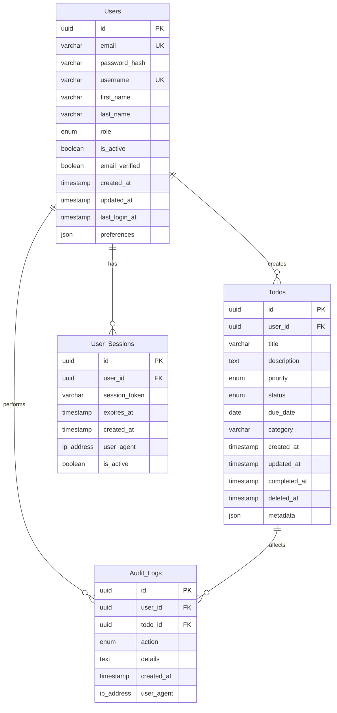

# TodoApp Database Schema Design

## Executive Summary

This document presents the complete database schema design for the TodoApp system, a minimal Todo list application that enables users to create, manage, and organize their personal tasks. The schema is designed to support essential Todo functionality while maintaining data integrity, user isolation, and efficient performance.

## Database Design Philosophy

The schema follows these core principles:
- **User Isolation**: Each user can only access their own Todo items
- **Data Integrity**: Comprehensive validation rules and constraints
- **Minimal Complexity**: Focus on essential fields without feature bloat
- **Audit Trail**: Track creation, modification, and completion timestamps
- **Scalability**: Efficient indexing and query optimization
- **Security**: Proper authentication and authorization support

## Entity Relationship Diagram

## Core Tables

### Users Table

**Purpose**: Store user account information and authentication data

**Table Name**: `users`

**Purpose**: Provides secure user authentication and personal information management for the TodoApp system. Each user gets a unique identifier and profile for managing their personal Todo items.

**Fields**:
- `id` (UUID, Primary Key) - Unique identifier for each user
- `email` (VARCHAR(255), Unique, Not Null) - User's email address for login and notifications
- `password_hash` (VARCHAR(255), Not Null) - Encrypted password for authentication
- `username` (VARCHAR(50), Unique, Null) - Optional username for display purposes
- `first_name` (VARCHAR(100), Null) - User's first name for personalization
- `last_name` (VARCHAR(100), Null) - User's last name for personalization
- `role` (ENUM('member', 'admin'), Default: 'member') - User role for authorization
- `is_active` (BOOLEAN, Default: true) - Account status for access control
- `email_verified` (BOOLEAN, Default: false) - Email verification status
- `created_at` (TIMESTAMP, Not Null, Default: CURRENT_TIMESTAMP) - Account creation timestamp
- `updated_at` (TIMESTAMP, Not Null, Default: CURRENT_TIMESTAMP ON UPDATE CURRENT_TIMESTAMP) - Last profile update
- `last_login_at` (TIMESTAMP, Null) - Most recent successful login timestamp
- `preferences` (JSON, Null) - User preferences and settings

**Constraints**:
- Email must be unique across the system
- Email format validation at application level
- Password must meet minimum complexity requirements
- Role determines system permissions and access levels

**Indexes**:
- Primary Key on `id`
- Unique Index on `email`
- Unique Index on `username` (when not null)
- Index on `role` for admin queries
- Index on `is_active` for active user filtering

### Todos Table

**Purpose**: Store individual Todo items owned by users

**Table Name**: `todos`

**Purpose**: Manages personal Todo items with comprehensive tracking of task lifecycle, priorities, and completion status. Each Todo is associated with a specific user and contains all necessary information for task management.

**Fields**:
- `id` (UUID, Primary Key) - Unique identifier for each Todo item
- `user_id` (UUID, Foreign Key, Not Null) - Reference to owning user
- `title` (VARCHAR(200), Not Null) - Todo task title (1-200 characters)
- `description` (TEXT, Null) - Optional detailed description (up to 1000 characters)
- `priority` (ENUM('low', 'medium', 'high', 'urgent'), Default: 'medium') - Task priority level
- `status` (ENUM('pending', 'in_progress', 'completed', 'cancelled'), Default: 'pending') - Task current status
- `due_date` (DATE, Null) - Optional due date for task completion
- `category` (VARCHAR(50), Null) - Optional category or tag for organization
- `created_at` (TIMESTAMP, Not Null, Default: CURRENT_TIMESTAMP) - Task creation timestamp
- `updated_at` (TIMESTAMP, Not Null, Default: CURRENT_TIMESTAMP ON UPDATE CURRENT_TIMESTAMP) - Last modification
- `completed_at` (TIMESTAMP, Null) - Timestamp when task was completed
- `deleted_at` (TIMESTAMP, Null) - Soft delete timestamp for data recovery
- `metadata` (JSON, Null) - Additional task-specific data and settings

**Constraints**:
- Todo must belong to an existing user
- Title is required and must be between 1-200 characters
- Due date cannot be in the past (validation at application level)
- Status transitions follow defined lifecycle rules
- Each user can only access their own Todo items

**Relationships**:
- Foreign Key to `users.id` with CASCADE DELETE for user removal
- Support for soft deletion to preserve data integrity

**Indexes**:
- Primary Key on `id`
- Foreign Key Index on `user_id` for user-specific queries
- Composite Index on `user_id, status` for filtering active/completed tasks
- Index on `due_date` for date-based filtering
- Index on `priority` for priority-based sorting
- Index on `category` for category-based organization
- Index on `created_at` for chronological sorting

### User Sessions Table

**Purpose**: Manage user authentication sessions and JWT token tracking

**Table Name**: `user_sessions`

**Purpose**: Maintains secure user session management for the TodoApp system, tracking active login sessions and supporting JWT token validation for API authentication.

**Fields**:
- `id` (UUID, Primary Key) - Unique session identifier
- `user_id` (UUID, Foreign Key, Not Null) - Reference to authenticated user
- `session_token` (VARCHAR(255), Not Null) - JWT access token or session identifier
- `expires_at` (TIMESTAMP, Not Null) - Session expiration timestamp
- `created_at` (TIMESTAMP, Not Null, Default: CURRENT_TIMESTAMP) - Session creation time
- `ip_address` (VARCHAR(45), Null) - User's IP address for security tracking
- `user_agent` (TEXT, Null) - Browser/client information for audit
- `is_active` (BOOLEAN, Default: true) - Session active status

**Constraints**:
- Session must reference existing user
- Session token must be unique across all sessions
- Expiration timestamps enforce security policies
- Active sessions enforce one session per user policy

**Relationships**:
- Foreign Key to `users.id`
- CASCADE DELETE when user account is removed

**Indexes**:
- Primary Key on `id`
- Foreign Key Index on `user_id` for user session lookup
- Unique Index on `session_token` for token validation
- Index on `expires_at` for cleanup of expired sessions
- Index on `is_active` for active session filtering

### Audit Logs Table

**Purpose**: Track system activities and changes for security and compliance

**Table Name**: `audit_logs`

**Purpose**: Provides comprehensive audit trail for all user actions and system changes in the TodoApp, enabling security monitoring, user activity tracking, and compliance reporting.

**Fields**:
- `id` (UUID, Primary Key) - Unique audit log entry identifier
- `user_id` (UUID, Foreign Key, Null) - User who performed the action (null for system events)
- `todo_id` (UUID, Foreign Key, Null) - Todo item affected by the action
- `action` (ENUM('create', 'read', 'update', 'delete', 'login', 'logout', 'password_change'), Not Null) - Type of action performed
- `details` (TEXT, Null) - Detailed description of the action and changes
- `created_at` (TIMESTAMP, Not Null, Default: CURRENT_TIMESTAMP) - Action timestamp
- `ip_address` (VARCHAR(45), Null) - Source IP address for security tracking
- `user_agent` (TEXT, Null) - Client information for audit purposes

**Constraints**:
- User action must be one of defined types
- Audit entries provide complete action trail
- IP and user agent tracking for security monitoring
- Details provide context for audit analysis

**Relationships**:
- Foreign Key to `users.id` (can be null for system actions)
- Foreign Key to `todos.id` (can be null for non-Todo actions)

**Indexes**:
- Primary Key on `id`
- Foreign Key Index on `user_id` for user activity tracking
- Foreign Key Index on `todo_id` for Todo-specific audit trail
- Index on `action` for action-type filtering
- Index on `created_at` for chronological audit review

## Data Validation Rules

### User Data Validation

**Email Validation**:
- Must be valid email format (validated at application level)
- Maximum length: 255 characters
- Must be unique across all user accounts
- Required for account creation and authentication

**Password Requirements**:
- Minimum 8 characters
- Must contain uppercase, lowercase, and numbers
- Stored as secure hash (bcrypt or similar)
- Never stored in plain text

**Username Validation**:
- Optional field, maximum 50 characters
- Must be unique if provided
- Can contain alphanumeric characters, underscores, and hyphens
- Used for display purposes and alternative login

### Todo Data Validation

**Title Requirements**:
- Required field, 1-200 characters
- Cannot be empty or contain only whitespace
- Case-insensitive uniqueness warning per user

**Description Requirements**:
- Optional field, maximum 1000 characters
- Plain text only (no HTML or special formatting)
- Can be empty or null

**Priority Levels**:
- Allowed values: 'low', 'medium', 'high', 'urgent'
- Default value: 'medium'
- Determines task ordering and visual indicators

**Status Lifecycle**:
- Allowed values: 'pending', 'in_progress', 'completed', 'cancelled'
- Default value: 'pending'
- Status transitions follow defined rules:
  - pending → in_progress, completed, cancelled
  - in_progress → completed, cancelled
  - completed → pending, in_progress (reopen)
  - cancelled → (cannot be reopened)

**Due Date Requirements**:
- Optional field, DATE format
- Cannot be in the past (application-level validation)
- Used for task scheduling and overdue tracking

**Category Organization**:
- Optional field, maximum 50 characters
- Case-insensitive for consistency
- Used for task grouping and filtering

## Security and Privacy Considerations

### Data Protection

**Password Security**:
- All passwords hashed using bcrypt or Argon2
- Salt rounds minimum: 12 for bcrypt
- Password never stored or transmitted in plain text

**Session Management**:
- JWT tokens with appropriate expiration times
- Access tokens: 15-minute expiration
- Refresh tokens: 30-day expiration
- Secure token generation using cryptographically secure random values

**Data Encryption**:
- Sensitive fields encrypted at rest (email, personal information)
- All data transmitted over HTTPS/TLS
- Database connection encryption

### Access Control

**User Isolation**:
- Users can only access their own Todo items
- Administrative users have elevated permissions
- API endpoints enforce user ownership validation

**Audit Trail**:
- All user actions logged with timestamps
- Security events tracked with IP and user agent
- Administrative actions require additional approval

## Performance Optimization

### Indexing Strategy

**Critical Indexes**:
- Primary keys on all tables for O(1) lookup
- Foreign key indexes for join performance
- Composite indexes for common query patterns

**Query Optimization**:
- Index on `user_id, status` for Todo filtering
- Index on `due_date` for date-based queries
- Index on `created_at` for chronological sorting
- Index on `priority` for priority-based sorting

### Database Maintenance

**Cleanup Procedures**:
- Automatic cleanup of expired sessions
- Archival of old audit logs (retention policy)
- Regular database statistics updates

**Backup Strategy**:
- Daily full backups
- Hourly incremental backups
- Point-in-time recovery capability
- Test backup restoration procedures

## Migration and Setup

### Database Initialization

**Schema Creation Order**:
1. Create base tables (users, todos, user_sessions, audit_logs)
2. Add foreign key constraints
3. Create indexes for performance
4. Set up initial admin user
5. Configure database-specific settings

**Initial Data Setup**:
- Create default admin user with strong password
- Set up database users with appropriate permissions
- Configure application database connection
- Test all relationships and constraints

### Migration Scripts

**Version Control**:
- All schema changes tracked in version control
- Forward and rollback migrations maintained
- Database schema version tracking table
- Staging environment testing before production

**Rollback Procedures**:
- Down migration scripts for all changes
- Data preservation strategies
- Emergency rollback procedures documented
- Testing procedures for rollback scenarios

## Monitoring and Maintenance

### Performance Monitoring

**Key Metrics**:
- Query execution times for Todo operations
- Database connection pool utilization
- Index usage and effectiveness
- Slow query identification and optimization

**Health Checks**:
- Database connectivity verification
- Constraint validation checks
- Data integrity verification
- Backup and recovery testing

### Scaling Considerations

**Horizontal Scaling**:
- Read replicas for query distribution
- Connection pooling for high concurrency
- Database partitioning for large datasets
- Caching layer for frequently accessed data

**Vertical Scaling**:
- Database server resource monitoring
- Memory and CPU usage optimization
- Storage performance tuning
- Query optimization for better performance

## Implementation Notes

### Database Technology Recommendations

**Primary Database**: PostgreSQL 14+
- Advanced JSON support for metadata fields
- Excellent performance for complex queries
- Strong consistency and ACID compliance
- Robust indexing and optimization features

**Alternative Options**:
- MySQL 8.0+ (if PostgreSQL not available)
- SQLite (for development and small deployments)
- MariaDB (MySQL alternative with better performance)

### Application Integration

**ORM Recommendation**: Prisma or TypeORM
- Type safety for database operations
- Automatic migration generation
- Built-in connection pooling
- Comprehensive validation and constraint support

**Connection Management**:
- Connection pooling for efficient resource usage
- Transaction management for data consistency
- Retry logic for transient database failures
- Proper connection cleanup and resource management

## Conclusion

This database schema provides a robust foundation for the TodoApp system, supporting essential Todo list functionality while maintaining data integrity, security, and performance. The design prioritizes user isolation, comprehensive audit trails, and efficient query performance to ensure a smooth user experience.

The schema is designed to scale from small personal use to moderate multi-user deployments, with proper indexing, security measures, and maintenance procedures to support growth and changing requirements.

Key benefits of this design:
- **Security First**: Comprehensive user authentication and data protection
- **User Isolation**: Strong guarantees that users only access their own data
- **Audit Trail**: Complete tracking of user actions for security and compliance
- **Performance**: Optimized indexes and query patterns for efficient operation
- **Scalability**: Design supports growth from individual users to moderate user bases
- **Data Integrity**: Comprehensive validation rules and constraints
- **Flexibility**: JSON metadata fields for future feature extensions

This schema serves as the foundation for implementing a secure, efficient, and user-friendly Todo list application that meets the minimum functionality requirements while providing room for future enhancements and feature additions.