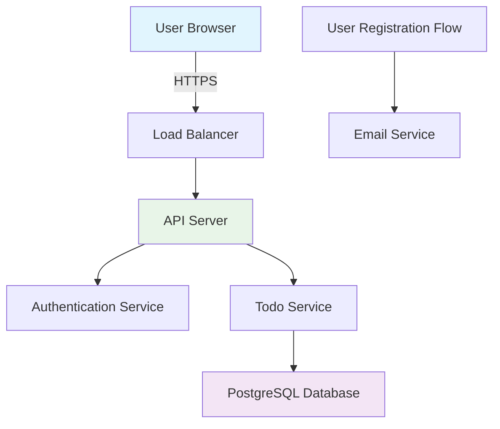
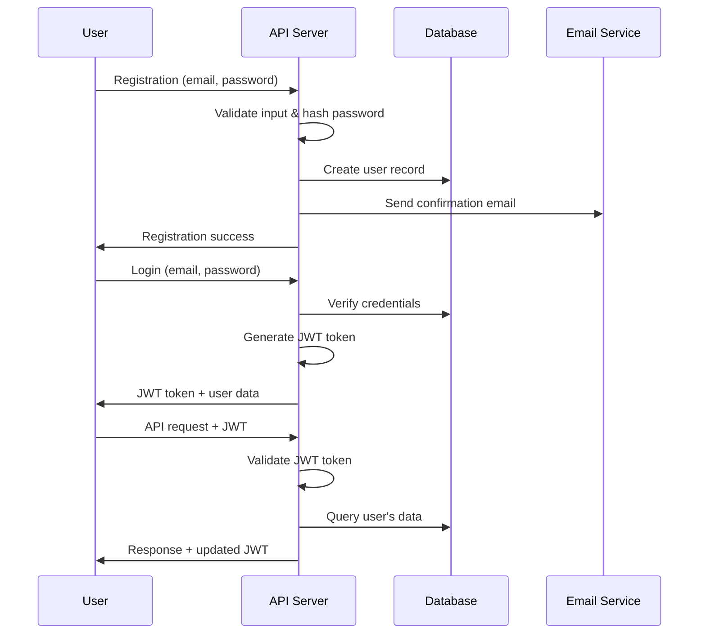
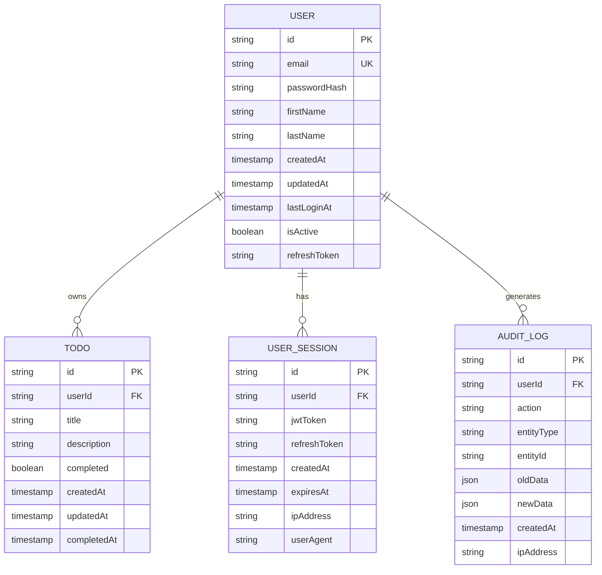
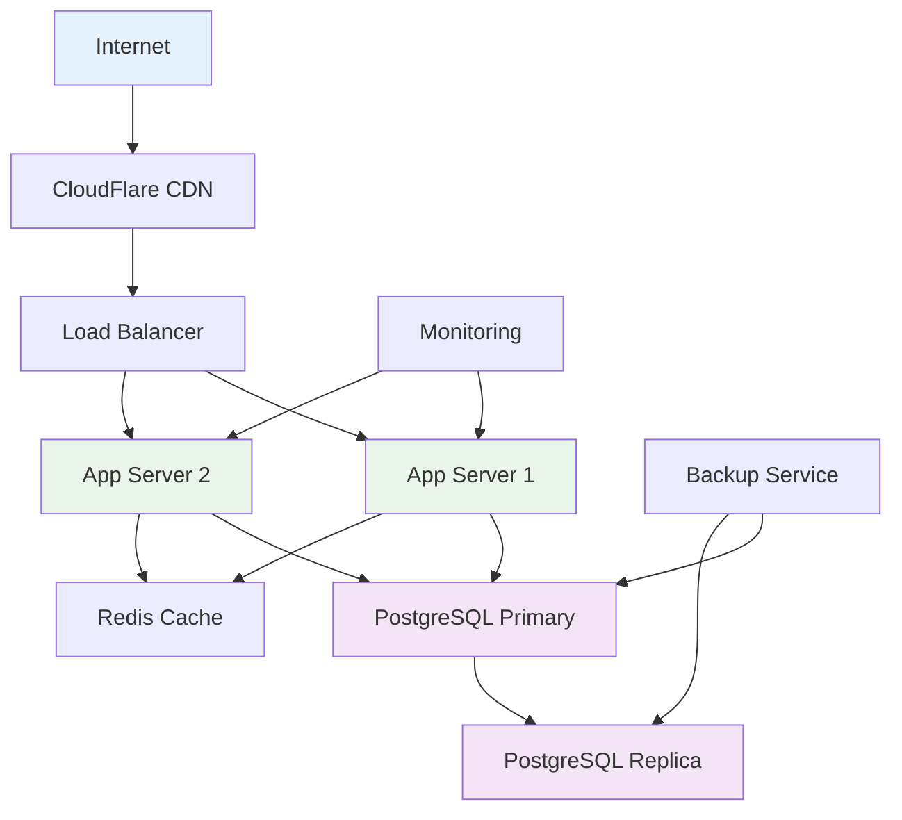

# TodoApp Requirements Analysis Report

## Executive Summary

The TodoApp is a simple, user-focused task management application designed to provide users with an intuitive way to create, manage, and track their personal tasks. The application emphasizes minimum viable functionality with clean user experience and reliable data management.

### Problem Statement

Users need a reliable, simple task management system that allows them to quickly add tasks, mark them as complete, and organize their daily activities without complex features that add cognitive overhead.

### Solution Overview

The TodoApp provides a streamlined task management experience with core CRUD operations, user authentication, and clean data organization. Users can create personal accounts, manage their tasks efficiently, and access their data securely across sessions.

### Business Value Proposition

- **Simplicity**: Focus on essential task management without overwhelming features
- **Reliability**: Secure, persistent task storage with consistent user experience
- **Personal Organization**: Help users maintain personal productivity and task tracking
- **Accessibility**: Clean interface accessible to all user skill levels

## Target Users

The application targets individual users who need personal task management capabilities without collaborative features or complex project management functionality.

## Success Metrics

- Users can create, update, and delete tasks within 3 clicks
- 99.9% uptime for task storage and retrieval
- Sub-second response times for core operations
- Zero data loss incidents
- User retention rate of 80%+ after first week

## User Actors

### 1. Unauthenticated User
**Description**: Visitors who have not registered or logged into the system
**Capabilities**:
- Cannot access any task management functionality
- Can view public landing page
- Can register for new account
- Can login with existing credentials

**Authentication Requirements**: Must register or login before accessing personal data
**Permission Level**: None - restricted to public pages only

### 2. Registered User
**Description**: Individual users who have created accounts and authenticated successfully
**Capabilities**:
- Create personal Todo items
- View own Todo items (list and detail views)
- Update existing Todo items (title, description, completion status)
- Delete own Todo items
- Manage personal profile information
- Access personal task history and statistics

**Authentication Requirements**: Valid JWT token required for all operations
**Permission Level**: Full access to own data only
**Data Access**: Can only read, create, update, and delete their own tasks

### 3. System Administrator
**Description**: Backend system maintainers with administrative access
**Capabilities**:
- Monitor system health and performance
- Access application logs and metrics
- Manage user accounts (view, suspend, delete)
- Perform system maintenance operations
- Access aggregate usage statistics

**Authentication Requirements**: Multi-factor authentication required
**Permission Level**: Full system access with audit logging
**Data Access**: Read-only access to user data for support purposes

## Functional Requirements

### FR-001: User Authentication System
**WHEN** a user attempts to access protected Todo functionality, **THE** system **SHALL** require valid authentication credentials and **SHALL** issue a secure JWT token upon successful login.

**Satisfaction Criteria**:
- Login process completes within 2 seconds
- JWT tokens expire after 15 minutes of inactivity
- Failed login attempts are rate-limited (max 5 attempts per 15 minutes)
- Password requirements: minimum 8 characters, mixed case, numbers
- Account locks after 3 consecutive failed login attempts

### FR-002: Todo Item Creation
**WHEN** an authenticated user submits a new Todo item with title and optional description, **THE** system **SHALL** create a unique Todo record associated with that user and **SHALL** return the complete Todo item data.

**Satisfaction Criteria**:
- Todo items require non-empty title (1-255 characters)
- Optional description allows 0-500 characters
- System assigns unique identifier to each Todo item
- Todo items are timestamped with creation and update times
- Created Todo items are immediately available for viewing

### FR-003: Todo Item Retrieval
**WHEN** an authenticated user requests their Todo items, **THE** system **SHALL** return all active Todo items associated with that user, sorted by creation date (newest first).

**Satisfaction Criteria**:
- System returns only Todo items belonging to the authenticated user
- Response includes completed and incomplete items
- Todo items are sorted by creation date (descending)
- Pagination support for users with 50+ Todo items
- Response time under 500ms for typical user loads

### FR-004: Todo Item Update
**WHEN** an authenticated user modifies a Todo item (title, description, or completion status), **THE** system **SHALL** update the existing record and **SHALL** maintain data integrity.

**Satisfaction Criteria**:
- Users can only update their own Todo items
- Title updates preserve same validation rules as creation
- Description updates support same length constraints
- Completion status can be toggled between complete/incomplete
- Update operations maintain original creation timestamp
- System records update timestamp for audit purposes

### FR-005: Todo Item Deletion
**WHEN** an authenticated user deletes a Todo item, **THE** system **SHALL** permanently remove the Todo record and **SHALL** ensure the item is no longer accessible.

**Satisfaction Criteria**:
- Users can only delete their own Todo items
- Deletion operations are permanent and irreversible
- System prevents access to deleted Todo items
- Deletion operations complete within 1 second
- Users receive confirmation of successful deletion

### FR-006: Data Validation
**WHEN** users submit Todo data, **THE** system **SHALL** validate all input against defined business rules and **SHALL** reject invalid data with clear error messages.

**Satisfaction Criteria**:
- Title validation: non-empty, 1-255 characters, no HTML/script tags
- Description validation: optional, 0-500 characters, no HTML/script tags
- Character encoding: UTF-8 support for international characters
- Input sanitization: removal of potentially malicious content
- Error messages provide specific guidance for correction

## User Stories and Scenarios

### US-001: Account Registration and Setup
**As a** new user, **I want to** create an account so that I can start managing my tasks.

**Scenario 1: Successful Registration**
1. User navigates to registration page
2. User enters valid email address
3. User creates password meeting requirements
4. User submits registration form
5. System creates account and sends confirmation email
6. User receives confirmation and can login immediately

**Scenario 2: Registration with Invalid Data**
1. User submits registration with weak password
2. System displays specific password requirements
3. User updates password to meet requirements
4. System accepts registration and creates account

**Scenario 3: Duplicate Email Registration**
1. User attempts registration with existing email
2. System displays "email already registered" message
3. User is directed to login page or password recovery

### US-002: Todo Item Management
**As a** registered user, **I want to** create, view, and manage my personal tasks.

**Scenario 1: Creating a New Todo**
1. User logs into application
2. User clicks "Add Todo" button
3. User enters task title and optional description
4. User saves the new Todo item
5. System displays the newly created Todo in user's task list

**Scenario 2: Marking Todo as Complete**
1. User views their Todo list
2. User finds incomplete Todo item
3. User clicks completion checkbox or button
4. System updates Todo status to completed
5. UI reflects completion status with visual indicator

**Scenario 3: Editing Existing Todo**
1. User clicks edit on existing Todo item
2. User modifies title or description
3. User saves changes
4. System updates Todo record and shows updated information

**Scenario 4: Deleting Todo Item**
1. User clicks delete button on Todo item
2. System shows confirmation dialog
3. User confirms deletion
4. System permanently removes Todo item
5. Todo item no longer appears in user's list

### US-003: Personal Task Organization
**As a** user with many tasks, **I want to** organize and filter my tasks effectively.

**Scenario 1: Viewing All Tasks**
1. User logs in
2. System displays all Todo items (completed and incomplete)
3. Tasks are sorted by creation date (newest first)
4. User can scroll through all personal tasks

**Scenario 2: Filtering Active Tasks**
1. User selects "Active Tasks" filter
2. System hides all completed Todo items
3. User sees only incomplete tasks
4. Filter can be cleared to show all tasks again

## Business Rules and Constraints

### BR-001: User Data Ownership
**Rule**: Users can only access, modify, or delete their own Todo items.
**Enforcement**: All database queries must include user ID validation
**Validation**: System enforces row-level security at database and application layers

### BR-002: Data Integrity Constraints
**Rule**: Todo item titles must be unique per user and non-empty.
**Enforcement**: Database-level constraints and application validation
**Validation**: Duplicate title prevention within user's Todo collection

### BR-003: Authentication Session Management
**Rule**: JWT tokens expire after 15 minutes of inactivity.
**Enforcement**: Token expiration time validation on each request
**Validation**: Automatic logout and token refresh mechanisms

### BR-004: Rate Limiting and Security
**Rule**: API endpoints are rate-limited to prevent abuse.
**Enforcement**: Per-user and per-IP rate limiting
**Validation**: 429 responses with retry-after headers for exceeded limits

### BR-005: Data Retention Policy
**Rule**: Deleted Todo items are permanently removed and cannot be recovered.
**Enforcement**: Hard delete operations with no soft delete or archiving
**Validation**: Database deletion operations are immediate and irreversible

## Non-Functional Requirements

### NFR-001: Performance Requirements
**Response Time**: All Todo CRUD operations must complete within 500ms for 95% of requests.
**Throughput**: System must support 100 concurrent users with average response times under 200ms.
**Database Query Performance**: Todo list retrieval queries must complete within 100ms for users with up to 1000 Todo items.
**Concurrent Operations**: System must handle 50 simultaneous Todo creation requests without degradation.

### NFR-002: Scalability Requirements
**User Growth**: System must scale to support 10,000 registered users within 12 months.
**Data Growth**: Database must handle 1,000,000 Todo items efficiently with proper indexing.
**Horizontal Scaling**: Application architecture must support multiple server instances.
**Database Scaling**: PostgreSQL must handle increased load through connection pooling and query optimization.

### NFR-003: Reliability Requirements
**Uptime**: 99.9% system availability (8.76 hours downtime per year maximum).
**Data Durability**: Zero data loss for committed transactions.
**Fault Tolerance**: System must continue operating with single server failure.
**Recovery Time**: System must recover from failures within 5 minutes.
**Backup and Recovery**: Daily automated backups with point-in-time recovery capability.

### NFR-004: Security Requirements
**Authentication Security**: JWT tokens must use strong signing algorithms (RS256).
**Data Protection**: All passwords must be hashed using bcrypt with minimum 12 rounds.
**Input Validation**: All user inputs must be sanitized and validated.
**HTTPS**: All communications must use TLS 1.2 or higher.
**Session Security**: Login sessions must expire after 15 minutes of inactivity.

### NFR-005: Quality Standards
**Code Coverage**: Minimum 90% test coverage for all application code.
**API Documentation**: Complete OpenAPI documentation for all endpoints.
**Error Handling**: All error scenarios must return meaningful HTTP status codes.
**Logging**: Comprehensive logging for security events and system errors.
**User Experience**: All user interactions must provide immediate feedback.

## Data Management and Flow

### Data Flow Architecture



### Data Lifecycle

**Creation Phase**:
1. User registers with email and password
2. System creates user account with hashed password
3. User authenticates and receives JWT token
4. User creates Todo items with title, description, timestamps
5. Database stores Todo with user relationship

**Active Phase**:
1. User accesses Todo list through authenticated API calls
2. System retrieves user's Todos from database
3. User updates or deletes Todo items
4. Changes are immediately persisted to database
5. Audit logs record all modification activities

**Archival Phase**:
1. Deleted Todos are permanently removed from database
2. Completed Todos remain in database for user history
3. User data is backed up daily for disaster recovery
4. Retention policy: Todos are kept indefinitely unless manually deleted

### Data Storage Requirements

**Primary Database**: PostgreSQL 13+
**Backup Strategy**: Daily automated backups with 30-day retention
**Disaster Recovery**: Point-in-time recovery capability up to 7 days
**Data Encryption**: Database-level encryption for sensitive fields
**Connection Pooling**: Maximum 100 connections per application instance

## Security Requirements

### Authentication Security Model



### JWT Token Management

**Token Structure**: Header.payload.signature format
**Algorithm**: RS256 with RSA 2048-bit keys
**Claims**: userId, email, issuedAt, expiresAt, refreshTokenId
**Expiration**: 15 minutes active, 7 days maximum with refresh
**Refresh Strategy**: New tokens issued on successful API calls

### Authorization Matrix

| Operation | Unauthenticated | Registered User | Admin |
|-----------|----------------|----------------|-------|
| View Landing Page | ✓ | ✓ | ✓ |
| Register Account | ✓ | ✓ | ✓ |
| Login | ✓ | ✓ | ✓ |
| Create Todo | ✗ | ✓ (Own) | ✓ (All) |
| View Todos | ✗ | ✓ (Own) | ✓ (All) |
| Update Todo | ✗ | ✓ (Own) | ✓ (All) |
| Delete Todo | ✗ | ✓ (Own) | ✓ (All) |
| View User Stats | ✗ | ✓ (Own) | ✓ (All) |
| Manage Users | ✗ | ✗ | ✓ |
| System Monitoring | ✗ | ✗ | ✓ |

### Security Controls

**Input Validation**: All user inputs validated against strict regex patterns
**SQL Injection Prevention**: Parameterized queries with ORM (Prisma)
**Cross-Site Scripting (XSS)**: Output encoding and Content Security Policy
**Cross-Site Request Forgery (CSRF)**: SameSite cookie attributes and CSRF tokens
**Session Management**: Secure cookie settings with HttpOnly and Secure flags
**Rate Limiting**: Per-user (100 req/min) and per-IP (1000 req/min) limits

## Database Schema Design

### Entity Relationship Diagram



### User Table (users)

```sql
CREATE TABLE "user" (
    "id" UUID PRIMARY KEY DEFAULT gen_random_uuid(),
    "email" VARCHAR(255) UNIQUE NOT NULL,
    "passwordHash" VARCHAR(255) NOT NULL,
    "firstName" VARCHAR(100),
    "lastName" VARCHAR(100),
    "createdAt" TIMESTAMP DEFAULT CURRENT_TIMESTAMP,
    "updatedAt" TIMESTAMP DEFAULT CURRENT_TIMESTAMP,
    "lastLoginAt" TIMESTAMP,
    "isActive" BOOLEAN DEFAULT true,
    "refreshToken" VARCHAR(500)
);

-- Indexes
CREATE INDEX idx_user_email ON "user"("email");
CREATE INDEX idx_user_created_at ON "user"("createdAt");
CREATE INDEX idx_user_is_active ON "user"("isActive");

-- Constraints
ALTER TABLE "user" ADD CONSTRAINT email_format CHECK (email ~* '^[A-Za-z0-9._%+-]+@[A-Za-z0-9.-]+\.[A-Za-z]{2,}$');
ALTER TABLE "user" ADD CONSTRAINT firstname_length CHECK (char_length("firstName") >= 2 AND char_length("firstName") <= 100);
ALTER TABLE "user" ADD CONSTRAINT lastname_length CHECK (char_length("lastName") >= 2 AND char_length("lastName") <= 100);
```

### Todo Table (todos)

```sql
CREATE TABLE "todo" (
    "id" UUID PRIMARY KEY DEFAULT gen_random_uuid(),
    "userId" UUID NOT NULL REFERENCES "user"("id") ON DELETE CASCADE,
    "title" VARCHAR(255) NOT NULL,
    "description" TEXT,
    "completed" BOOLEAN DEFAULT false,
    "createdAt" TIMESTAMP DEFAULT CURRENT_TIMESTAMP,
    "updatedAt" TIMESTAMP DEFAULT CURRENT_TIMESTAMP,
    "completedAt" TIMESTAMP
);

-- Indexes
CREATE INDEX idx_todo_user_id ON "todo"("userId");
CREATE INDEX idx_todo_user_completed ON "todo"("userId", "completed");
CREATE INDEX idx_todo_created_at ON "todo"("createdAt");
CREATE INDEX idx_todo_user_created ON "todo"("userId", "createdAt" DESC);

-- Constraints
ALTER TABLE "todo" ADD CONSTRAINT title_length CHECK (char_length("title") >= 1 AND char_length("title") <= 255);
ALTER TABLE "todo" ADD CONSTRAINT description_length CHECK (char_length("description") <= 1000);
ALTER TABLE "todo" ADD CONSTRAINT unique_title_per_user UNIQUE ("userId", "title");
```

### User Session Table (user_sessions)

```sql
CREATE TABLE "user_session" (
    "id" UUID PRIMARY KEY DEFAULT gen_random_uuid(),
    "userId" UUID NOT NULL REFERENCES "user"("id") ON DELETE CASCADE,
    "jwtToken" VARCHAR(1000) NOT NULL,
    "refreshToken" VARCHAR(500) NOT NULL,
    "createdAt" TIMESTAMP DEFAULT CURRENT_TIMESTAMP,
    "expiresAt" TIMESTAMP NOT NULL,
    "ipAddress" INET,
    "userAgent" TEXT
);

-- Indexes
CREATE INDEX idx_user_session_user_id ON "user_session"("userId");
CREATE INDEX idx_user_session_expires_at ON "user_session"("expiresAt");
CREATE INDEX idx_user_session_refresh_token ON "user_session"("refreshToken");

-- Constraints
ALTER TABLE "user_session" ADD CONSTRAINT jwt_token_format CHECK (char_length("jwtToken") > 100);
ALTER TABLE "user_session" ADD CONSTRAINT refresh_token_format CHECK (char_length("refreshToken") > 20);
```

### Audit Log Table (audit_logs)

```sql
CREATE TABLE "audit_log" (
    "id" UUID PRIMARY KEY DEFAULT gen_random_uuid(),
    "userId" UUID REFERENCES "user"("id") ON DELETE SET NULL,
    "action" VARCHAR(50) NOT NULL,
    "entityType" VARCHAR(50) NOT NULL,
    "entityId" UUID,
    "oldData" JSONB,
    "newData" JSONB,
    "createdAt" TIMESTAMP DEFAULT CURRENT_TIMESTAMP,
    "ipAddress" INET
);

-- Indexes
CREATE INDEX idx_audit_log_user_id ON "audit_log"("userId");
CREATE INDEX idx_audit_log_created_at ON "audit_log"("createdAt");
CREATE INDEX idx_audit_log_action ON "audit_log"("action");
CREATE INDEX idx_audit_log_entity ON "audit_log"("entityType", "entityId");

-- Constraints
ALTER TABLE "audit_log" ADD CONSTRAINT action_format CHECK ("action" IN ('CREATE', 'UPDATE', 'DELETE', 'LOGIN', 'LOGOUT', 'REGISTER'));
ALTER TABLE "audit_log" ADD CONSTRAINT entity_type_format CHECK ("entityType" IN ('USER', 'TODO', 'SESSION'));
```

### Database Relationships and Constraints

**User to Todo**: One-to-Many relationship with CASCADE DELETE
- When user is deleted, all their Todo items are automatically deleted
- Referential integrity ensures users cannot be orphaned
- Index on userId for efficient queries

**User to Session**: One-to-Many relationship with CASCADE DELETE
- Sessions automatically deleted when user account is removed
- Expired sessions are cleaned up automatically
- Unique refresh tokens prevent session hijacking

**Audit Logging**: Comprehensive activity tracking
- All user actions are logged with old and new data
- JSONB fields store flexible audit data
- Separate indexing for efficient log retrieval and analysis

### Data Integrity and Constraints

**Application-Level Validation**:
- Password strength requirements (8+ chars, mixed case, numbers)
- Email uniqueness verification
- Todo title uniqueness per user
- Input sanitization for XSS prevention

**Database-Level Constraints**:
- Foreign key relationships with appropriate CASCADE rules
- CHECK constraints for data format validation
- NOT NULL constraints for required fields
- UNIQUE constraints for business rule enforcement

**Performance Optimizations**:
- Strategic indexing on frequently queried fields
- Composite indexes for multi-column queries
- Proper data types for efficient storage and retrieval
- Query optimization through proper JOIN strategies

## Integration and Deployment Guidelines

### API Design Specifications

**Base URL**: `https://api.todoapp.com/v1`
**Authentication**: Bearer JWT tokens in Authorization header
**Content-Type**: application/json for all requests
**Response Format**: Standardized JSON response structure

#### Authentication Endpoints

```
POST /auth/register
- Request: { email, password, firstName, lastName }
- Response: { success, message, userId }

POST /auth/login  
- Request: { email, password }
- Response: { success, data: { token, refreshToken, user } }

POST /auth/refresh
- Request: { refreshToken }
- Response: { success, data: { token, refreshToken } }

POST /auth/logout
- Request: { refreshToken }
- Response: { success, message }
```

#### Todo Management Endpoints

```
GET /todos
- Headers: Authorization: Bearer {token}
- Query: page, limit, status (active|completed|all)
- Response: { success, data: { todos, pagination } }

POST /todos
- Headers: Authorization: Bearer {token}
- Request: { title, description }
- Response: { success, data: { todo } }

GET /todos/{id}
- Headers: Authorization: Bearer {token}
- Response: { success, data: { todo } }

PATCH /todos/{id}
- Headers: Authorization: Bearer {token}
- Request: { title?, description?, completed? }
- Response: { success, data: { todo } }

DELETE /todos/{id}
- Headers: Authorization: Bearer {token}
- Response: { success, message }
```

### Deployment Architecture



### Environment Configuration

**Development Environment**:
- Local PostgreSQL database with test data
- JWT secrets for development only
- Detailed logging and error reporting
- Hot reloading for rapid development

**Staging Environment**:
- Production-like configuration
- Automated testing against staging database
- Performance testing and load validation
- User acceptance testing environment

**Production Environment**:
- PostgreSQL with read replicas
- Redis for session storage and caching
- Load balancer with SSL termination
- Comprehensive monitoring and alerting
- Automated backups with point-in-time recovery

### Infrastructure Requirements

**Application Servers** (2 instances minimum):
- CPU: 2 vCPUs per instance
- Memory: 4GB RAM per instance
- Storage: 50GB SSD per instance
- Network: 1Gbps network interface

**Database Servers**:
- Primary: 4 vCPUs, 8GB RAM, 100GB SSD
- Replica: 2 vCPUs, 4GB RAM, 100GB SSD
- Automated backup storage: 500GB

**Load Balancer**:
- SSL certificate management
- Health check endpoints
- Session affinity for JWT token validation
- Rate limiting and DDoS protection

### Monitoring and Maintenance

**Application Monitoring**:
- Response time monitoring (95th percentile < 500ms)
- Error rate monitoring (< 0.1% for critical endpoints)
- Throughput monitoring (requests per second)
- User activity monitoring (active sessions, task creation rate)

**Database Monitoring**:
- Connection pool utilization
- Query performance metrics
- Database growth tracking
- Backup verification and restoration testing

**Security Monitoring**:
- Failed login attempt tracking
- Unusual API usage patterns
- Database security event logging
- SSL certificate expiration monitoring

**Maintenance Procedures**:
- Weekly dependency updates
- Monthly security patch review
- Quarterly performance optimization
- Annual disaster recovery testing

---

This comprehensive requirements analysis provides a complete foundation for developing the TodoApp with minimum functionality while ensuring scalability, security, and maintainability. The database schema supports all identified user workflows while maintaining data integrity and performance optimization for production deployment.