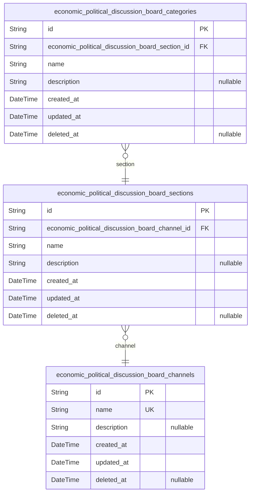
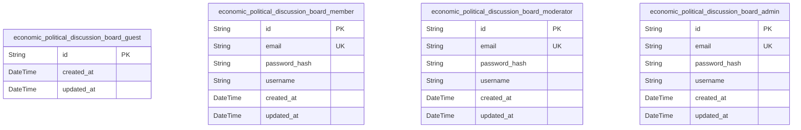
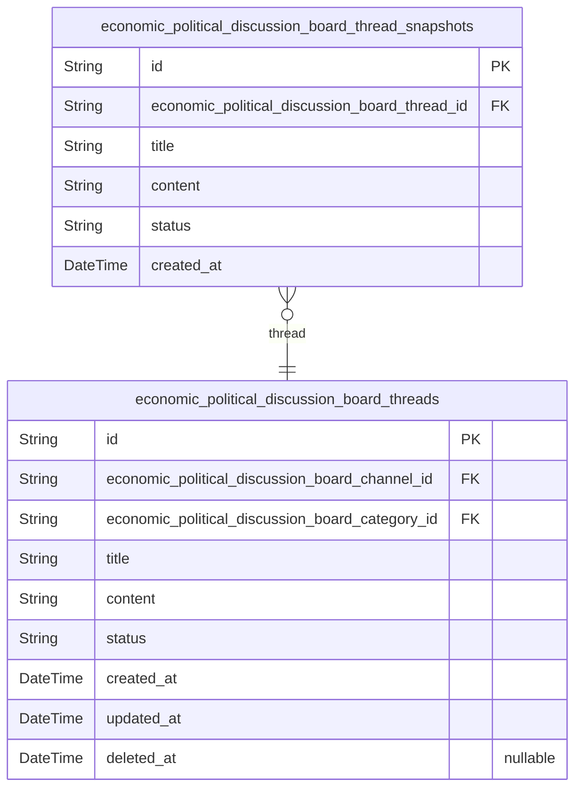
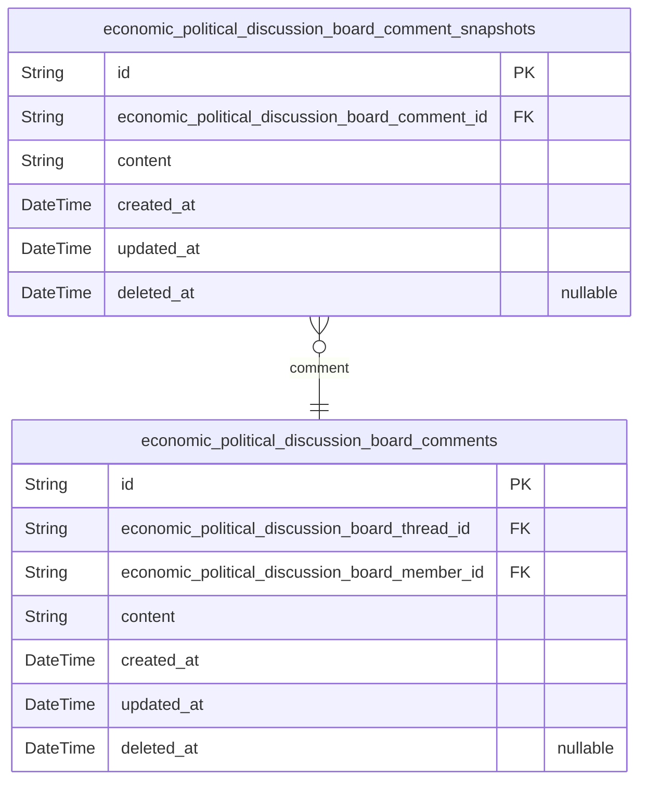
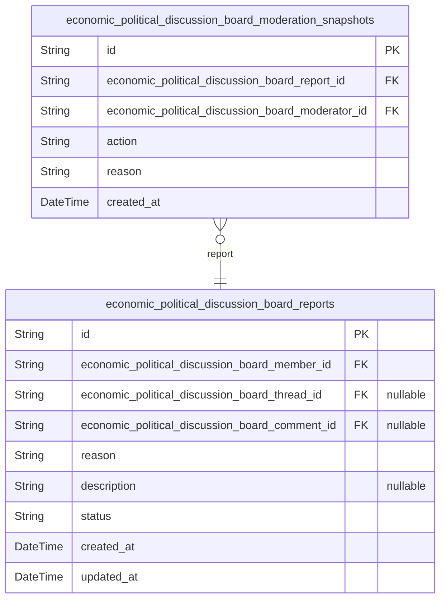

# Prisma Markdown

> Generated by [`prisma-markdown`](https://github.com/samchon/prisma-markdown)

- [Systematic](#systematic)
- [Actors](#actors)
- [Threads](#threads)
- [Comments](#comments)
- [Moderation](#moderation)

## Systematic

### `economic_political_discussion_board_channels`

Represents the main channels or sections of the discussion board where
users can engage in conversations. Each channel has a unique identifier,
name, and description. Channels are organized into sections and can
contain multiple categories. This table serves as the top-level
organizational structure for the discussion board.

Properties as follows:

- `id`: Primary Key.
- `name`: The name of the channel.
- `description`: A brief description of the channel's purpose and content.
- `created_at`: The timestamp when the channel was created.
- `updated_at`: The timestamp when the channel was last updated.
- `deleted_at`: The timestamp when the channel was deleted, if applicable.

### `economic_political_discussion_board_sections`

Represents the sections within a channel of the discussion board. Each
section has a unique identifier, name, and description. Sections are used
to further organize content within a channel and can contain multiple
categories. This table provides a mid-level organizational structure for
the discussion board.

Properties as follows:

- `id`: Primary Key.
- `economic_political_discussion_board_channel_id`
  > The ID of the channel that this section belongs to. {@link
  > economic_political_discussion_board_channels.id}
- `name`: The name of the section.
- `description`: A brief description of the section's purpose and content.
- `created_at`: The timestamp when the section was created.
- `updated_at`: The timestamp when the section was last updated.
- `deleted_at`: The timestamp when the section was deleted, if applicable.

### `economic_political_discussion_board_categories`

Represents the categories within a section of the discussion board. Each
category has a unique identifier, name, and description. Categories are
used to further organize content within a section and can contain
multiple discussion threads. This table provides a detailed
organizational structure for the discussion board.

Properties as follows:

- `id`: Primary Key.
- `economic_political_discussion_board_section_id`
  > The ID of the section that this category belongs to. {@link
  > economic_political_discussion_board_sections.id}
- `name`: The name of the category.
- `description`: A brief description of the category's purpose and content.
- `created_at`: The timestamp when the category was created.
- `updated_at`: The timestamp when the category was last updated.
- `deleted_at`: The timestamp when the category was deleted, if applicable.

## Actors

### `economic_political_discussion_board_guest`

Represents unauthenticated users who can only view public content.

Properties as follows:

- `id`: Primary Key.
- `created_at`: Timestamp when the guest record was created.
- `updated_at`: Timestamp when the guest record was last updated.

### `economic_political_discussion_board_member`

Represents authenticated users who can create and comment on discussion
threads.

Properties as follows:

- `id`: Primary Key.
- `email`: Email address of the member.
- `password_hash`: Hashed password for authentication.
- `username`: Username of the member.
- `created_at`: Timestamp when the member record was created.
- `updated_at`: Timestamp when the member record was last updated.

### `economic_political_discussion_board_moderator`

Represents users with elevated permissions who can manage content and
enforce community guidelines.

Properties as follows:

- `id`: Primary Key.
- `email`: Email address of the moderator.
- `password_hash`: Hashed password for authentication.
- `username`: Username of the moderator.
- `created_at`: Timestamp when the moderator record was created.
- `updated_at`: Timestamp when the moderator record was last updated.

### `economic_political_discussion_board_admin`

Represents system administrators with full access to manage users,
content, and system settings.

Properties as follows:

- `id`: Primary Key.
- `email`: Email address of the admin.
- `password_hash`: Hashed password for authentication.
- `username`: Username of the admin.
- `created_at`: Timestamp when the admin record was created.
- `updated_at`: Timestamp when the admin record was last updated.

## Threads

### `economic_political_discussion_board_threads`

Represents a discussion thread in the economic/political discussion
board. This table captures the essential information for a thread,
including its title, content, and status. It serves as the primary entity
for user interactions and content management.

Properties as follows:

- `id`: Primary Key.
- `economic_political_discussion_board_channel_id`
  > The channel to which this thread belongs. {@link
  > economic_political_discussion_board_channels.id}
- `economic_political_discussion_board_category_id`
  > The category to which this thread belongs. {@link
  > economic_political_discussion_board_categories.id}
- `title`: The title of the thread.
- `content`: The content of the thread.
- `status`: The status of the thread (e.g., open, closed, locked).
- `created_at`: The timestamp when the thread was created.
- `updated_at`: The timestamp when the thread was last updated.
- `deleted_at`: The timestamp when the thread was deleted (soft delete).

### `economic_political_discussion_board_thread_snapshots`

Represents a snapshot of a discussion thread at a specific point in time.
This table captures the historical states of threads, allowing for audit
trails and change tracking. It is used for historical data access and
audit trail queries.

Properties as follows:

- `id`: Primary Key.
- `economic_political_discussion_board_thread_id`
  > The thread to which this snapshot belongs. {@link
  > economic_political_discussion_board_threads.id}
- `title`: The title of the thread at the time of the snapshot.
- `content`: The content of the thread at the time of the snapshot.
- `status`: The status of the thread at the time of the snapshot.
- `created_at`: The timestamp when the snapshot was created.

## Comments

### `economic_political_discussion_board_comments`

Represents user comments on discussion threads in the economic/political
discussion board. Each comment is associated with a specific thread and
member, and maintains a complete history of changes through related
snapshots.

Properties as follows:

- `id`: Primary Key.
- `economic_political_discussion_board_thread_id`
  > The thread this comment belongs to. {@link
  > economic_political_discussion_board_threads.id}.
- `economic_political_discussion_board_member_id`
  > The member who created this comment. {@link
  > economic_political_discussion_board_member.id}.
- `content`: The text content of the comment.
- `created_at`: When the comment was created.
- `updated_at`: When the comment was last updated.
- `deleted_at`: When the comment was deleted (soft delete).

### `economic_political_discussion_board_comment_snapshots`

Historical snapshots of economic_political_discussion_board_comments for
audit trails and change tracking. Each snapshot captures the complete
state of a comment at a specific point in time.

Properties as follows:

- `id`: Primary Key.
- `economic_political_discussion_board_comment_id`
  > The comment this snapshot belongs to. {@link
  > economic_political_discussion_board_comments.id}.
- `content`: The text content of the comment at this snapshot.
- `created_at`: When this snapshot was created.
- `updated_at`: When the comment was last updated at this snapshot.
- `deleted_at`: When the comment was deleted at this snapshot (soft delete).

## Moderation

### `economic_political_discussion_board_reports`

Table for storing reports of inappropriate content in the
economic/political discussion board. This table captures user reports of
content violations, including the reason for reporting and the status of
the report. It establishes relationships with user tables and content
tables to maintain a complete record of reported content.

Properties as follows:

- `id`: Primary Key.
- `economic_political_discussion_board_member_id`
  > The member who submitted the report. {@link
  > economic_political_discussion_board_member.id}
- `economic_political_discussion_board_thread_id`
  > The thread that was reported. {@link
  > economic_political_discussion_board_threads.id}
- `economic_political_discussion_board_comment_id`
  > The comment that was reported. {@link
  > economic_political_discussion_board_comments.id}
- `reason`: The reason for the report.
- `description`: Additional details about the report.
- `status`: The current status of the report (e.g., pending, reviewed, resolved).
- `created_at`: The timestamp when the report was created.
- `updated_at`: The timestamp when the report was last updated.

### `economic_political_discussion_board_moderation_snapshots`

Table for storing snapshots of moderation actions taken on reported
content. This table captures the details of moderation actions, including
the action taken, the reason, and the moderator who took the action. It
establishes relationships with user tables and content tables to maintain
a complete audit trail of moderation actions.

Properties as follows:

- `id`: Primary Key.
- `economic_political_discussion_board_report_id`
  > The report that was moderated. {@link
  > economic_political_discussion_board_reports.id}
- `economic_political_discussion_board_moderator_id`
  > The moderator who took the action. {@link
  > economic_political_discussion_board_moderator.id}
- `action`: The action taken by the moderator (e.g., delete, warn, ban).
- `reason`: The reason for the moderation action.
- `created_at`: The timestamp when the moderation action was taken.
