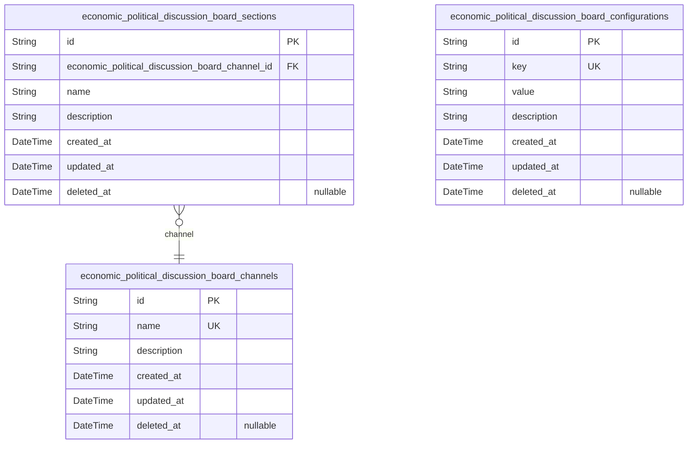
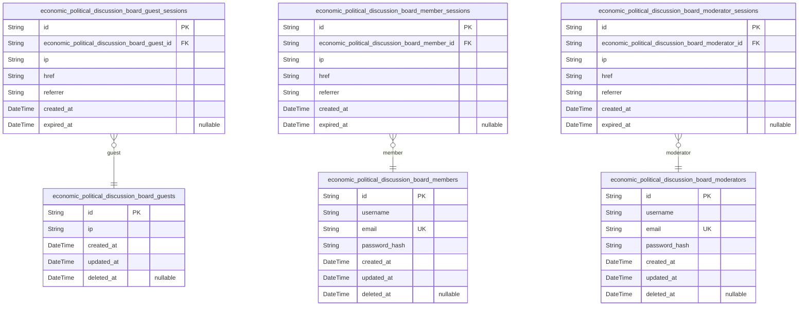
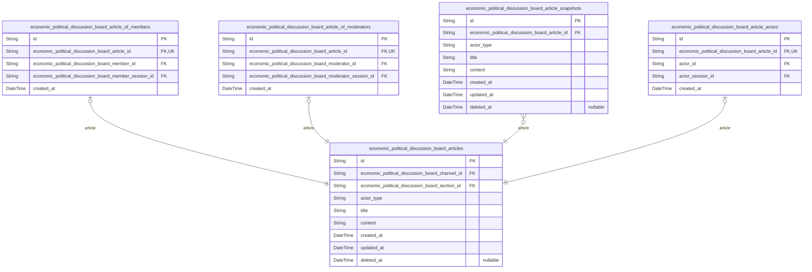
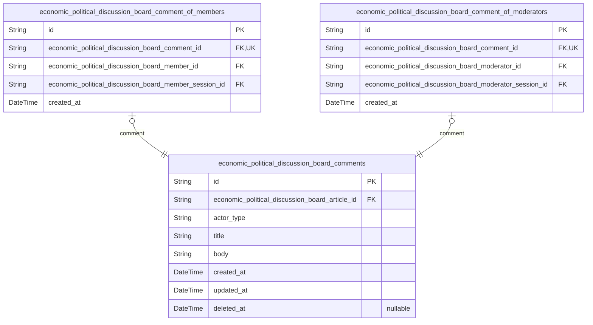
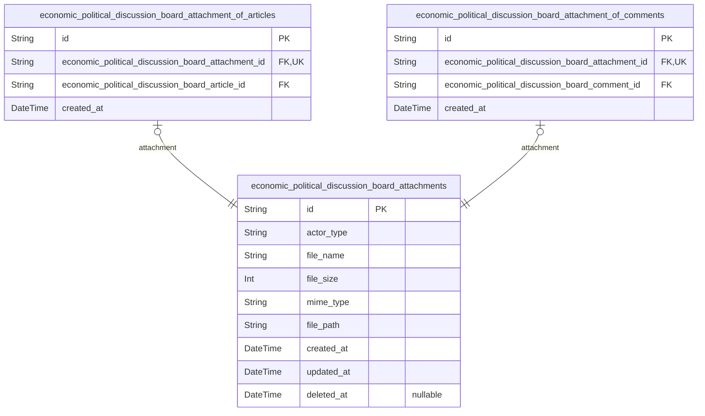

# Prisma Markdown

> Generated by [`prisma-markdown`](https://github.com/samchon/prisma-markdown)

- [Systematic](#systematic)
- [Actors](#actors)
- [Articles](#articles)
- [Comments](#comments)
- [Attachments](#attachments)

## Systematic

```mermaid
erDiagram
"economic_political_discussion_board_channels" {
  String id PK
  String name UK
  String description
  DateTime created_at
  DateTime updated_at
  DateTime deleted_at "nullable"
}
"economic_political_discussion_board_sections" {
  String id PK
  String economic_political_discussion_board_channel_id FK
  String name
  String description
  DateTime created_at
  DateTime updated_at
  DateTime deleted_at "nullable"
}
"economic_political_discussion_board_configurations" {
  String id PK
  String key UK
  String value
  String description
  DateTime created_at
  DateTime updated_at
  DateTime deleted_at "nullable"
}
"economic_political_discussion_board_sections" }o--|| "economic_political_discussion_board_channels" : channel
```

### `economic_political_discussion_board_channels`

Discussion board channels that organize content into distinct categories.

Channels serve as the primary organizational structure for the discussion
board,
providing users with clear categories to navigate and participate in
discussions.
Each channel represents a specific topic or theme that users can explore and
contribute to. Channels can contain multiple sections, which further
organize
the content within the channel.

The channel entity is a primary entity that users interact with directly,
requiring independent management capabilities. This includes the ability to
create, edit, and delete channels, as well as view and search across all
channels.

Properties as follows:

- `id`: Primary Key.
- `name`
  > The name of the channel, which is displayed to users and used for
  > identification purposes.
- `description`
  > A detailed description of the channel's purpose and content, helping
  > users understand what the channel is about.
- `created_at`: The timestamp when the channel was created.
- `updated_at`: The timestamp when the channel was last updated.
- `deleted_at`: The timestamp when the channel was deleted, if applicable.

### `economic_political_discussion_board_sections`

Sections within channels that further organize content into subcategories.

Sections provide an additional layer of organization within channels,
allowing for
the grouping of related content. Each section represents a specific
subtopic or
aspect of the channel's main theme. Sections can contain multiple articles,
which are the primary content items within the discussion board.

The section entity is a primary entity that users interact with directly,
requiring independent management capabilities. This includes the ability to
create, edit, and delete sections, as well as view and search across all
sections within a channel.

Properties as follows:

- `id`: Primary Key.
- `economic_political_discussion_board_channel_id`
  > The channel that this section belongs to. {@link
  > economic_political_discussion_board_channels.id}
- `name`
  > The name of the section, which is displayed to users and used for
  > identification purposes.
- `description`
  > A detailed description of the section's purpose and content, helping
  > users understand what the section is about.
- `created_at`: The timestamp when the section was created.
- `updated_at`: The timestamp when the section was last updated.
- `deleted_at`: The timestamp when the section was deleted, if applicable.

### `economic_political_discussion_board_configurations`

Configuration settings for the discussion board that control its behavior
and appearance.

Configurations provide administrators with the ability to customize the
appearance and behavior of the discussion board. These settings can include
options such as the default theme, the number of items to display per page,
and the rules for user participation.

The configuration entity is a primary entity that administrators interact
with
directly, requiring independent management capabilities. This includes the
ability to create, edit, and delete configurations, as well as view and
search
across all configurations.

Properties as follows:

- `id`: Primary Key.
- `key`
  > The unique identifier for the configuration setting, used to reference
  > the setting in the application code.
- `value`
  > The value of the configuration setting, which can be a string, number, or
  > boolean.
- `description`
  > A detailed description of the configuration setting, explaining its
  > purpose and how it affects the discussion board.
- `created_at`: The timestamp when the configuration setting was created.
- `updated_at`: The timestamp when the configuration setting was last updated.
- `deleted_at`: The timestamp when the configuration setting was deleted, if applicable.

## Actors

```mermaid
erDiagram
"economic_political_discussion_board_guests" {
  String id PK
  String ip
  DateTime created_at
  DateTime updated_at
  DateTime deleted_at "nullable"
}
"economic_political_discussion_board_guest_sessions" {
  String id PK
  String economic_political_discussion_board_guest_id FK
  String ip
  String href
  String referrer
  DateTime created_at
  DateTime expired_at "nullable"
}
"economic_political_discussion_board_members" {
  String id PK
  String username
  String email UK
  String password_hash
  DateTime created_at
  DateTime updated_at
  DateTime deleted_at "nullable"
}
"economic_political_discussion_board_member_sessions" {
  String id PK
  String economic_political_discussion_board_member_id FK
  String ip
  String href
  String referrer
  DateTime created_at
  DateTime expired_at "nullable"
}
"economic_political_discussion_board_moderators" {
  String id PK
  String username
  String email UK
  String password_hash
  DateTime created_at
  DateTime updated_at
  DateTime deleted_at "nullable"
}
"economic_political_discussion_board_moderator_sessions" {
  String id PK
  String economic_political_discussion_board_moderator_id FK
  String ip
  String href
  String referrer
  DateTime created_at
  DateTime expired_at "nullable"
}
"economic_political_discussion_board_guest_sessions" }o--|| "economic_political_discussion_board_guests" : guest
"economic_political_discussion_board_member_sessions" }o--|| "economic_political_discussion_board_members" : member
"economic_political_discussion_board_moderator_sessions" }o--|| "economic_political_discussion_board_moderators" : moderator
```

### `economic_political_discussion_board_guests`

Guest users who can view articles and comments but cannot create or edit
content.

Guests are unauthenticated users who can only view public content on the
discussion board. They do not have the ability to create articles,
comments, or attachments. Guest users are identified by their IP address
and session information, which is stored in the guest_sessions table.

Properties as follows:

- `id`: Primary Key.
- `ip`: IP address of the guest user.
- `created_at`: Timestamp when the guest record was created.
- `updated_at`: Timestamp when the guest record was last updated.
- `deleted_at`: Timestamp when the guest record was soft deleted.

### `economic_political_discussion_board_guest_sessions`

Session records for guest users.

Session records store information about the guest user's session,
including the IP address, connection URL, and referrer URL. This
information is used to track the guest user's activity on the discussion
board and to ensure that the guest user's session is valid.

Properties as follows:

- `id`: Primary Key.
- `economic_political_discussion_board_guest_id`
  > Guest user associated with this session. {@link
  > economic_political_discussion_board_guests.id}
- `ip`: IP address of the guest user.
- `href`: Connection URL of the guest user.
- `referrer`: Referrer URL of the guest user.
- `created_at`: Timestamp when the session record was created.
- `expired_at`: Timestamp when the session record expired.

### `economic_political_discussion_board_members`

Registered members who can create, edit, and delete their own articles
and comments.

Members are authenticated users who have registered on the discussion
board. They have the ability to create, edit, and delete their own
articles and comments. Member users are identified by their username,
email address, and password hash, which is stored securely in the
database.

Properties as follows:

- `id`: Primary Key.
- `username`: Username of the member user.
- `email`: Email address of the member user.
- `password_hash`: Secure hash of the member user's password.
- `created_at`: Timestamp when the member record was created.
- `updated_at`: Timestamp when the member record was last updated.
- `deleted_at`: Timestamp when the member record was soft deleted.

### `economic_political_discussion_board_member_sessions`

Session records for member users.

Session records store information about the member user's session,
including the IP address, connection URL, and referrer URL. This
information is used to track the member user's activity on the discussion
board and to ensure that the member user's session is valid.

Properties as follows:

- `id`: Primary Key.
- `economic_political_discussion_board_member_id`
  > Member user associated with this session. {@link
  > economic_political_discussion_board_members.id}
- `ip`: IP address of the member user.
- `href`: Connection URL of the member user.
- `referrer`: Referrer URL of the member user.
- `created_at`: Timestamp when the session record was created.
- `expired_at`: Timestamp when the session record expired.

### `economic_political_discussion_board_moderators`

Moderators who can manage all articles, comments, and user accounts.

Moderators are authenticated users who have administrative privileges on
the discussion board. They have the ability to manage all articles,
comments, and user accounts. Moderator users are identified by their
username, email address, and password hash, which is stored securely in
the database.

Properties as follows:

- `id`: Primary Key.
- `username`: Username of the moderator user.
- `email`: Email address of the moderator user.
- `password_hash`: Secure hash of the moderator user's password.
- `created_at`: Timestamp when the moderator record was created.
- `updated_at`: Timestamp when the moderator record was last updated.
- `deleted_at`: Timestamp when the moderator record was soft deleted.

### `economic_political_discussion_board_moderator_sessions`

Session records for moderator users.

Session records store information about the moderator user's session,
including the IP address, connection URL, and referrer URL. This
information is used to track the moderator user's activity on the
discussion board and to ensure that the moderator user's session is
valid.

Properties as follows:

- `id`: Primary Key.
- `economic_political_discussion_board_moderator_id`
  > Moderator user associated with this session. {@link
  > economic_political_discussion_board_moderators.id}
- `ip`: IP address of the moderator user.
- `href`: Connection URL of the moderator user.
- `referrer`: Referrer URL of the moderator user.
- `created_at`: Timestamp when the session record was created.
- `expired_at`: Timestamp when the session record expired.

## Articles

```mermaid
erDiagram
"economic_political_discussion_board_articles" {
  String id PK
  String economic_political_discussion_board_channel_id FK
  String economic_political_discussion_board_section_id FK
  String actor_type
  String title
  String content
  DateTime created_at
  DateTime updated_at
  DateTime deleted_at "nullable"
}
"economic_political_discussion_board_article_of_members" {
  String id PK
  String economic_political_discussion_board_article_id FK,UK
  String economic_political_discussion_board_member_id FK
  String economic_political_discussion_board_member_session_id FK
  DateTime created_at
}
"economic_political_discussion_board_article_of_moderators" {
  String id PK
  String economic_political_discussion_board_article_id FK,UK
  String economic_political_discussion_board_moderator_id FK
  String economic_political_discussion_board_moderator_session_id FK
  DateTime created_at
}
"economic_political_discussion_board_article_snapshots" {
  String id PK
  String economic_political_discussion_board_article_id FK
  String actor_type
  String title
  String content
  DateTime created_at
  DateTime updated_at
  DateTime deleted_at "nullable"
}
"economic_political_discussion_board_article_actors" {
  String id PK
  String economic_political_discussion_board_article_id FK,UK
  String actor_id FK
  String actor_session_id FK
  DateTime created_at
}
"economic_political_discussion_board_article_of_members" |o--|| "economic_political_discussion_board_articles" : article
"economic_political_discussion_board_article_of_moderators" |o--|| "economic_political_discussion_board_articles" : article
"economic_political_discussion_board_article_snapshots" }o--|| "economic_political_discussion_board_articles" : article
"economic_political_discussion_board_article_actors" |o--|| "economic_political_discussion_board_articles" : article
```

### `economic_political_discussion_board_articles`

Main article entity for economic/political discussion board.

Contains shared fields for all articles including title, content, and
creation metadata. The actor_type field indicates which user type created
the article (member or moderator).

Articles can have multiple attachments through the
[economic_political_discussion_board_attachment_of_articles](#economic_political_discussion_board_attachment_of_articles)
relationship. Comments are associated through the
[economic_political_discussion_board_comments](#economic_political_discussion_board_comments) relationship.

Each article is associated with a channel and section for
categorization. Historical versions are tracked through the
[economic_political_discussion_board_article_snapshots](#economic_political_discussion_board_article_snapshots)
relationship.

Soft deletion is supported through the deleted_at field to allow
content recovery while maintaining audit trails.

Properties as follows:

- `id`: Primary Key.
- `economic_political_discussion_board_channel_id`
  > Channel this article belongs to. {@link
  > economic_political_discussion_board_channels.id}
- `economic_political_discussion_board_section_id`
  > Section this article belongs to. {@link
  > economic_political_discussion_board_sections.id}
- `actor_type`: Type of actor who created this article. Either 'member' or 'moderator'.
- `title`: Title of the article.
- `content`: Main content of the article.
- `created_at`: When this article was created.
- `updated_at`: When this article was last updated.
- `deleted_at`: When this article was soft-deleted (null if active).

### `economic_political_discussion_board_article_of_members`

Tracks articles created by members.

Contains member-specific information about articles created by regular
members. Each record links to a specific article and member, recording
the member's session at creation time.

This table establishes the 1:1 relationship between articles and the
members who created them, while the main article table tracks the
shared article data.

The combination of article_id and member_id is unique to ensure
each article is associated with exactly one member.

Properties as follows:

- `id`: Primary Key.
- `economic_political_discussion_board_article_id`
  > Article created by this member. {@link
  > economic_political_discussion_board_articles.id}
- `economic_political_discussion_board_member_id`
  > Member who created this article. {@link
  > economic_political_discussion_board_members.id}
- `economic_political_discussion_board_member_session_id`
  > Session used when this article was created. {@link
  > economic_political_discussion_board_member_sessions.id}
- `created_at`: When this article was created by the member.

### `economic_political_discussion_board_article_of_moderators`

Tracks articles created by moderators.

Contains moderator-specific information about articles created by
moderators. Each record links to a specific article and moderator,
recording the moderator's session at creation time.

This table establishes the 1:1 relationship between articles and the
moderators who created them, while the main article table tracks the
shared article data.

The combination of article_id and moderator_id is unique to ensure
each article is associated with exactly one moderator.

Properties as follows:

- `id`: Primary Key.
- `economic_political_discussion_board_article_id`
  > Article created by this moderator. {@link
  > economic_political_discussion_board_articles.id}
- `economic_political_discussion_board_moderator_id`
  > Moderator who created this article. {@link
  > economic_political_discussion_board_moderators.id}
- `economic_political_discussion_board_moderator_session_id`
  > Session used when this article was created. {@link
  > economic_political_discussion_board_moderator_sessions.id}
- `created_at`: When this article was created by the moderator.

### `economic_political_discussion_board_article_snapshots`

Historical versions of articles for audit trail.

Captures point-in-time states of articles for historical tracking and
audit purposes. Each snapshot records the complete state of an article
at a specific point in time, including all shared fields from the main
article table.

Snapshots are created whenever an article is created, updated,
or deleted. This allows for complete reconstruction of an article's
lifecycle and provides a complete audit trail of all changes.

The relationship to the main article table allows tracking all versions
of each article, while the created_at field records when each snapshot
was taken.

Properties as follows:

- `id`: Primary Key.
- `economic_political_discussion_board_article_id`
  > Article this snapshot belongs to. {@link
  > economic_political_discussion_board_articles.id}
- `actor_type`: Type of actor who created this article. Either 'member' or 'moderator'.
- `title`: Title of the article at this snapshot.
- `content`: Content of the article at this snapshot.
- `created_at`: When this snapshot was taken.
- `updated_at`: When this article was last updated at this snapshot.
- `deleted_at`: When this article was soft-deleted at this snapshot (null if active).

### `economic_political_discussion_board_article_actors`

Tracks articles created by members or moderators.

Contains actor-specific information about articles created by members or
moderators. Each record links to a specific article and actor, recording
the actor's session at creation time.

This table establishes the 1:1 relationship between articles and the
actors who created them, while the main article table tracks the
shared article data.

The combination of article_id and actor_id is unique to ensure
each article is associated with exactly one actor.

Properties as follows:

- `id`: Primary Key.
- `economic_political_discussion_board_article_id`
  > Article created by this actor. {@link
  > economic_political_discussion_board_articles.id}
- `actor_id`: Actor who created this article. Either a member or moderator.
- `actor_session_id`
  > Session used when this article was created. Either a member session or
  > moderator session.
- `created_at`: When this article was created by the actor.

## Comments

```mermaid
erDiagram
"economic_political_discussion_board_comments" {
  String id PK
  String economic_political_discussion_board_article_id FK
  String actor_type
  String title
  String body
  DateTime created_at
  DateTime updated_at
  DateTime deleted_at "nullable"
}
"economic_political_discussion_board_comment_of_members" {
  String id PK
  String economic_political_discussion_board_comment_id FK,UK
  String economic_political_discussion_board_member_id FK
  String economic_political_discussion_board_member_session_id FK
  DateTime created_at
}
"economic_political_discussion_board_comment_of_moderators" {
  String id PK
  String economic_political_discussion_board_comment_id FK,UK
  String economic_political_discussion_board_moderator_id FK
  String economic_political_discussion_board_moderator_session_id FK
  DateTime created_at
}
"economic_political_discussion_board_comment_of_members" |o--|| "economic_political_discussion_board_comments" : comment
"economic_political_discussion_board_comment_of_moderators" |o--|| "economic_political_discussion_board_comments" : comment
```

### `economic_political_discussion_board_comments`

Main entity for storing comments on articles in the economic/political
discussion board.

This table serves as the central repository for all user comments,
capturing the core content and metadata for each comment. It establishes
the foundational structure for the comment system by tracking the
relationship between comments and articles, as well as identifying the
type of user who created the comment.

The comment content includes a title and body for structured
communication, and it maintains temporal information for auditing
purposes. Soft deletion is supported to maintain audit trails while
allowing content moderation.

Properties as follows:

- `id`: Primary Key.
- `economic_political_discussion_board_article_id`
  > The article that this comment belongs to. {@link
  > economic_political_discussion_board_articles.id}
- `actor_type`
  > Type of user who created the comment. Valid values: 'member' or
  > 'moderator'.
- `title`: Title of the comment.
- `body`: Content of the comment.
- `created_at`: When the comment was created.
- `updated_at`: When the comment was last updated.
- `deleted_at`: When the comment was deleted (soft delete).

### `economic_political_discussion_board_comment_of_members`

Subtype entity for storing member-specific information about comments.

This table captures member-specific details for comments created by
registered members. It maintains the relationship between comments and
the member who created them, including the member's session information
for audit purposes.

The table ensures that only members can create comments, and it tracks
the specific member session that was active when the comment was created.

Properties as follows:

- `id`: Primary Key.
- `economic_political_discussion_board_comment_id`
  > The comment that this record extends. {@link
  > economic_political_discussion_board_comments.id}
- `economic_political_discussion_board_member_id`
  > The member who created the comment. {@link
  > economic_political_discussion_board_members.id}
- `economic_political_discussion_board_member_session_id`
  > The session that was active when the comment was created. {@link
  > economic_political_discussion_board_member_sessions.id}
- `created_at`: When the comment was created by the member.

### `economic_political_discussion_board_comment_of_moderators`

Subtype entity for storing moderator-specific information about comments.

This table captures moderator-specific details for comments created by
moderators. It maintains the relationship between comments and the
moderator who created them, including the moderator's session information
for audit purposes.

The table ensures that only moderators can create comments, and it tracks
the specific moderator session that was active when the comment was
created.

Properties as follows:

- `id`: Primary Key.
- `economic_political_discussion_board_comment_id`
  > The comment that this record extends. {@link
  > economic_political_discussion_board_comments.id}
- `economic_political_discussion_board_moderator_id`
  > The moderator who created the comment. {@link
  > economic_political_discussion_board_moderators.id}
- `economic_political_discussion_board_moderator_session_id`
  > The session that was active when the comment was created. {@link
  > economic_political_discussion_board_moderator_sessions.id}
- `created_at`: When the comment was created by the moderator.

## Attachments

```mermaid
erDiagram
"economic_political_discussion_board_attachments" {
  String id PK
  String actor_type
  String file_name
  Int file_size
  String mime_type
  String file_path
  DateTime created_at
  DateTime updated_at
  DateTime deleted_at "nullable"
}
"economic_political_discussion_board_attachment_of_articles" {
  String id PK
  String economic_political_discussion_board_attachment_id FK,UK
  String economic_political_discussion_board_article_id FK
  DateTime created_at
}
"economic_political_discussion_board_attachment_of_comments" {
  String id PK
  String economic_political_discussion_board_attachment_id FK,UK
  String economic_political_discussion_board_comment_id FK
  DateTime created_at
}
"economic_political_discussion_board_attachment_of_articles" |o--|| "economic_political_discussion_board_attachments" : attachment
"economic_political_discussion_board_attachment_of_comments" |o--|| "economic_political_discussion_board_attachments" : attachment
```

### `economic_political_discussion_board_attachments`

Main attachment entity containing shared fields for all attachments.

Stores core attachment information including file metadata, upload
timestamps,
and system management fields. This is the primary entity that users interact
with when managing attachments across the system.

Attachments can be associated with either articles or comments through
subtype entities, creating a polymorphic relationship pattern.

The main entity contains shared fields like file name, size, and MIME type,
while subtype entities track which specific content type each attachment
belongs
to. This structure allows for proper data integrity while supporting
the different content types that can have attachments.

Properties as follows:

- `id`: Primary Key.
- `actor_type`: Type of actor who created the attachment (e.g., 'member', 'moderator').
- `file_name`: Original name of the uploaded file.
- `file_size`: Size of the file in bytes.
- `mime_type`: MIME type of the file (e.g., 'image/jpeg', 'application/pdf').
- `file_path`: Storage path of the file in the system.
- `created_at`: Timestamp when the attachment was created.
- `updated_at`: Timestamp when the attachment was last updated.
- `deleted_at`: Timestamp when the attachment was deleted (soft delete).

### `economic_political_discussion_board_attachment_of_articles`

Subtype entity tracking attachments associated with articles.

This table establishes the relationship between attachments and articles,
allowing articles to have multiple attachments while maintaining proper
data integrity. Each record links an attachment to a specific article and
includes the actor who created the attachment.

The subtype pattern ensures that attachments can be properly associated
with articles while maintaining the polymorphic relationship structure
with other content types.

Properties as follows:

- `id`: Primary Key.
- `economic_political_discussion_board_attachment_id`
  > Reference to the main attachment entity. {@link
  > economic_political_discussion_board_attachments.id}
- `economic_political_discussion_board_article_id`
  > Reference to the article this attachment belongs to. {@link
  > economic_political_discussion_board_articles.id}
- `created_at`: Timestamp when this attachment-article relationship was created.

### `economic_political_discussion_board_attachment_of_comments`

Subtype entity tracking attachments associated with comments.

This table establishes the relationship between attachments and comments,
allowing comments to have multiple attachments while maintaining proper
data integrity. Each record links an attachment to a specific comment and
includes the actor who created the attachment.

The subtype pattern ensures that attachments can be properly associated
with comments while maintaining the polymorphic relationship structure
with other content types.

Properties as follows:

- `id`: Primary Key.
- `economic_political_discussion_board_attachment_id`
  > Reference to the main attachment entity. {@link
  > economic_political_discussion_board_attachments.id}
- `economic_political_discussion_board_comment_id`
  > Reference to the comment this attachment belongs to. {@link
  > economic_political_discussion_board_comments.id}
- `created_at`: Timestamp when this attachment-comment relationship was created.
