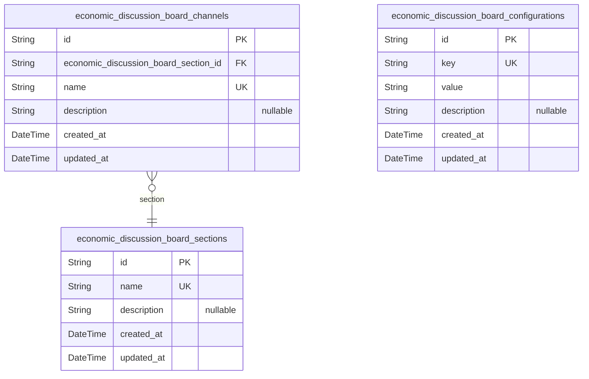
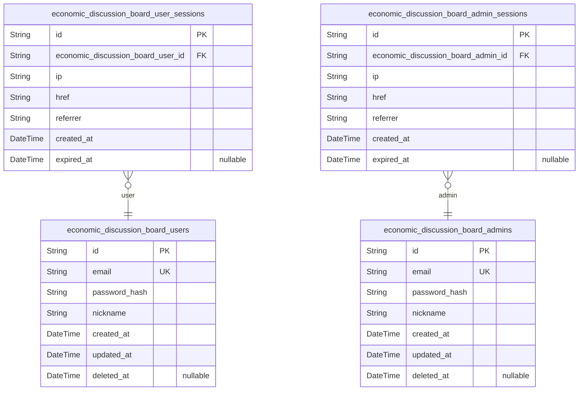
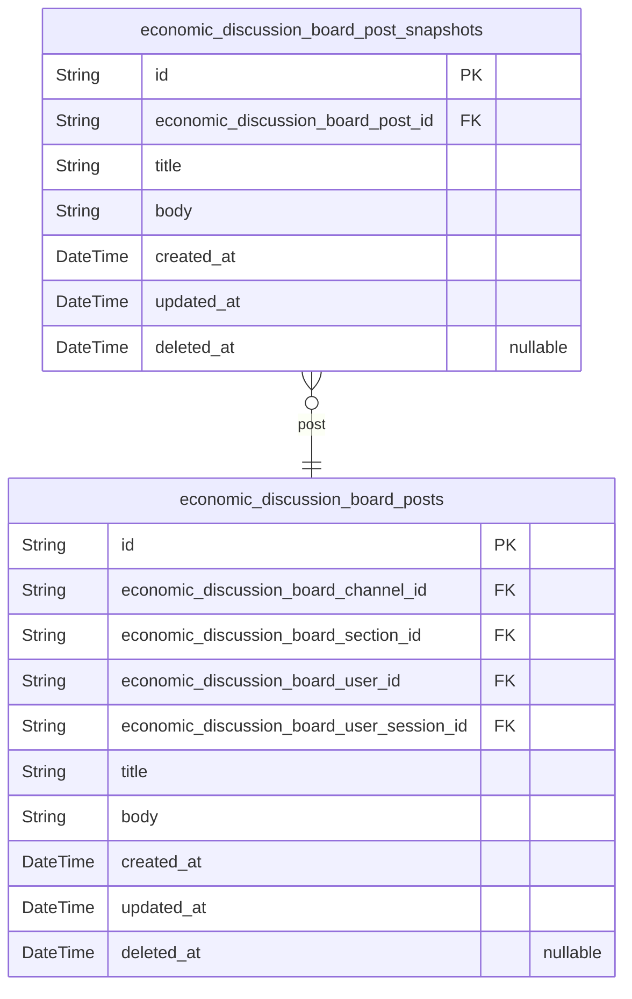
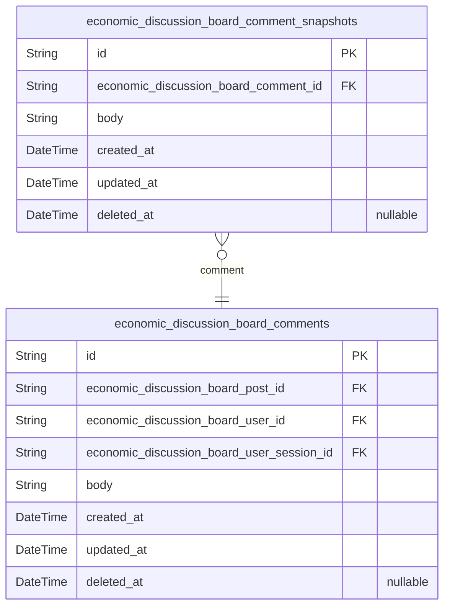
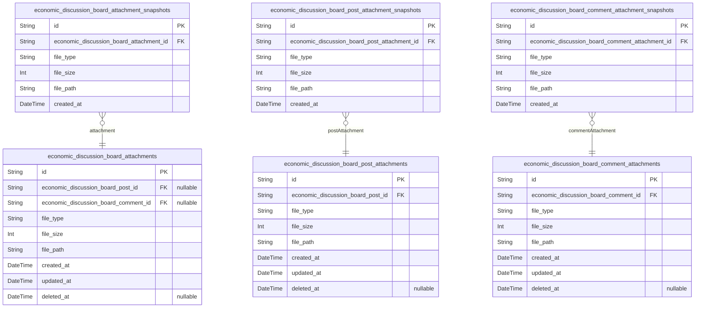

# Prisma Markdown

> Generated by [`prisma-markdown`](https://github.com/samchon/prisma-markdown)

- [Systematic](#systematic)
- [Actors](#actors)
- [Posts](#posts)
- [Comments](#comments)
- [Attachments](#attachments)

## Systematic

```mermaid
erDiagram
"economic_discussion_board_channels" {
  String id PK
  String economic_discussion_board_section_id FK
  String name UK
  String description "nullable"
  DateTime created_at
  DateTime updated_at
}
"economic_discussion_board_sections" {
  String id PK
  String name UK
  String description "nullable"
  DateTime created_at
  DateTime updated_at
}
"economic_discussion_board_configurations" {
  String id PK
  String key UK
  String value
  String description "nullable"
  DateTime created_at
  DateTime updated_at
}
"economic_discussion_board_channels" }o--|| "economic_discussion_board_sections" : section
```

### `economic_discussion_board_channels`

Represents discussion channels where users can post and discuss economic
topics. Each channel has a unique identifier and name, and can belong to
a specific section.

Properties as follows:

- `id`: Primary Key.
- `economic_discussion_board_section_id`
  > The section this channel belongs to. {@link
  > economic_discussion_board_sections.id}
- `name`: The name of the channel.
- `description`: A brief description of the channel's purpose.
- `created_at`: The date and time when the channel was created.
- `updated_at`: The date and time when the channel was last updated.

### `economic_discussion_board_sections`

Represents sections within the discussion board, grouping related
channels together. Each section has a unique identifier and name.

Properties as follows:

- `id`: Primary Key.
- `name`: The name of the section.
- `description`: A brief description of the section's purpose.
- `created_at`: The date and time when the section was created.
- `updated_at`: The date and time when the section was last updated.

### `economic_discussion_board_configurations`

Stores configuration settings for the economic discussion board, such as
default settings, feature flags, and system-wide parameters.

Properties as follows:

- `id`: Primary Key.
- `key`: The configuration key.
- `value`: The configuration value.
- `description`: A brief description of the configuration setting.
- `created_at`: The date and time when the configuration was created.
- `updated_at`: The date and time when the configuration was last updated.

## Actors

```mermaid
erDiagram
"economic_discussion_board_users" {
  String id PK
  String email UK
  String password_hash
  String nickname
  DateTime created_at
  DateTime updated_at
  DateTime deleted_at "nullable"
}
"economic_discussion_board_user_sessions" {
  String id PK
  String economic_discussion_board_user_id FK
  String ip
  String href
  String referrer
  DateTime created_at
  DateTime expired_at "nullable"
}
"economic_discussion_board_admins" {
  String id PK
  String email UK
  String password_hash
  String nickname
  DateTime created_at
  DateTime updated_at
  DateTime deleted_at "nullable"
}
"economic_discussion_board_admin_sessions" {
  String id PK
  String economic_discussion_board_admin_id FK
  String ip
  String href
  String referrer
  DateTime created_at
  DateTime expired_at "nullable"
}
"economic_discussion_board_user_sessions" }o--|| "economic_discussion_board_users" : user
"economic_discussion_board_admin_sessions" }o--|| "economic_discussion_board_admins" : admin
```

### `economic_discussion_board_users`

User accounts for the economic discussion board platform. Stores
authentication credentials and basic profile information for registered
users. Each user can create posts, comments, and manage their own
content. User accounts are required for all interactive features of the
platform.

Properties as follows:

- `id`: Primary Key.
- `email`
  > User's email address used for authentication and communication. Must be
  > unique across all users.
- `password_hash`
  > Secure hash of the user's password for authentication purposes. Never
  > store plain text passwords.
- `nickname`: Display name chosen by the user for public identification.
- `created_at`: Timestamp when the user account was created.
- `updated_at`: Timestamp when the user account was last updated.
- `deleted_at`
  > Timestamp when the user account was soft-deleted. Null if account is
  > active.

### `economic_discussion_board_user_sessions`

Authentication sessions for users on the economic discussion board.
Tracks active user sessions with connection details and temporal
information. Each session is associated with a specific user account and
provides audit trail for user activities.

Properties as follows:

- `id`: Primary Key.
- `economic_discussion_board_user_id`
  > Reference to the user account that owns this session. {@link
  > economic_discussion_board_users.id}
- `ip`: IP address from which the session was initiated.
- `href`: URL of the page where the session was initiated.
- `referrer`: Referrer URL that led to the session initiation.
- `created_at`: Timestamp when the session was created.
- `expired_at`
  > Timestamp when the session expired or was terminated. Null if session is
  > active.

### `economic_discussion_board_admins`

Administrator accounts for managing the economic discussion board
platform. Stores authentication credentials and basic profile information
for administrators. Admins have elevated privileges to moderate content
and manage platform settings.

Properties as follows:

- `id`: Primary Key.
- `email`
  > Admin's email address used for authentication and communication. Must be
  > unique across all admins.
- `password_hash`
  > Secure hash of the admin's password for authentication purposes. Never
  > store plain text passwords.
- `nickname`: Display name chosen by the admin for public identification.
- `created_at`: Timestamp when the admin account was created.
- `updated_at`: Timestamp when the admin account was last updated.
- `deleted_at`
  > Timestamp when the admin account was soft-deleted. Null if account is
  > active.

### `economic_discussion_board_admin_sessions`

Authentication sessions for administrators on the economic discussion
board. Tracks active admin sessions with connection details and temporal
information. Each session is associated with a specific admin account and
provides audit trail for admin activities.

Properties as follows:

- `id`: Primary Key.
- `economic_discussion_board_admin_id`
  > Reference to the admin account that owns this session. {@link
  > economic_discussion_board_admins.id}
- `ip`: IP address from which the session was initiated.
- `href`: URL of the page where the session was initiated.
- `referrer`: Referrer URL that led to the session initiation.
- `created_at`: Timestamp when the session was created.
- `expired_at`
  > Timestamp when the session expired or was terminated. Null if session is
  > active.

## Posts

```mermaid
erDiagram
"economic_discussion_board_posts" {
  String id PK
  String economic_discussion_board_channel_id FK
  String economic_discussion_board_section_id FK
  String economic_discussion_board_user_id FK
  String economic_discussion_board_user_session_id FK
  String title
  String body
  DateTime created_at
  DateTime updated_at
  DateTime deleted_at "nullable"
}
"economic_discussion_board_post_snapshots" {
  String id PK
  String economic_discussion_board_post_id FK
  String title
  String body
  DateTime created_at
  DateTime updated_at
  DateTime deleted_at "nullable"
}
"economic_discussion_board_post_snapshots" }o--|| "economic_discussion_board_posts" : post
```

### `economic_discussion_board_posts`

Primary entity for user-generated content in the economic discussion board.

Represents the core content creation feature where users can share their
thoughts, insights, and questions about economic and political topics.
Each post belongs to a specific channel and section, and is created by an
authenticated user through their active session.

Posts can be edited or deleted by their authors, and can accumulate
comments and attachments. The content includes title and body fields for
structured information presentation.

Soft deletion is supported to maintain audit trails while allowing
content moderation.

Properties as follows:

- `id`: Primary Key.
- `economic_discussion_board_channel_id`
  > Channel where the post is published. {@link
  > economic_discussion_board_channels.id}.
- `economic_discussion_board_section_id`
  > Section within the channel where the post is categorized. {@link
  > economic_discussion_board_sections.id}.
- `economic_discussion_board_user_id`: User who created the post. [economic_discussion_board_users.id](#economic_discussion_board_users).
- `economic_discussion_board_user_session_id`
  > Session during which the post was created. {@link
  > economic_discussion_board_user_sessions.id}.
- `title`: Title of the post summarizing its content.
- `body`: Main content of the post containing detailed information.
- `created_at`: Timestamp when the post was created.
- `updated_at`: Timestamp when the post was last updated.
- `deleted_at`: Timestamp when the post was deleted (soft delete).

### `economic_discussion_board_post_snapshots`

Historical record of post states for audit trail and content change
tracking.

Captures point-in-time states of economic_discussion_board_posts to
maintain a complete history of all modifications. Each snapshot records
the complete state of a post at a specific moment, including all content
fields and metadata.

Snapshots are created whenever a post is created, updated, or deleted,
providing a complete audit trail of all changes. The snapshot data
includes all fields from the original post to ensure historical accuracy.

This table supports content moderation by allowing administrators to
review the complete history of a post's evolution.

Properties as follows:

- `id`: Primary Key.
- `economic_discussion_board_post_id`
  > Post that this snapshot records. {@link
  > economic_discussion_board_posts.id}.
- `title`: Title of the post at the time of snapshot.
- `body`: Main content of the post at the time of snapshot.
- `created_at`: Timestamp when the snapshot was created.
- `updated_at`: Timestamp when the post was last updated (from original post).
- `deleted_at`: Timestamp when the post was deleted (from original post).

## Comments

```mermaid
erDiagram
"economic_discussion_board_comments" {
  String id PK
  String economic_discussion_board_post_id FK
  String economic_discussion_board_user_id FK
  String economic_discussion_board_user_session_id FK
  String body
  DateTime created_at
  DateTime updated_at
  DateTime deleted_at "nullable"
}
"economic_discussion_board_comment_snapshots" {
  String id PK
  String economic_discussion_board_comment_id FK
  String body
  DateTime created_at
  DateTime updated_at
  DateTime deleted_at "nullable"
}
"economic_discussion_board_comment_snapshots" }o--|| "economic_discussion_board_comments" : comment
```

### `economic_discussion_board_comments`

User comments on economic discussion board posts.

Stores user comments with content, timestamps, and relationships to posts
and users.
Each comment is associated with a specific post and created by an
authenticated user.
Comments support soft deletion for content moderation while maintaining
audit trails.
The comment content includes body text and timestamps for creation and
modification.

Properties as follows:

- `id`: Primary Key.
- `economic_discussion_board_post_id`: Target post's [economic_discussion_board_posts.id](#economic_discussion_board_posts).
- `economic_discussion_board_user_id`: Comment creator's [economic_discussion_board_users.id](#economic_discussion_board_users).
- `economic_discussion_board_user_session_id`
  > Session used to create comment's {@link
  > economic_discussion_board_user_sessions.id}.
- `body`: Comment content text.
- `created_at`: Comment creation timestamp.
- `updated_at`: Comment modification timestamp.
- `deleted_at`: Comment deletion timestamp for soft delete.

### `economic_discussion_board_comment_snapshots`

Historical snapshots of economic discussion board comments.

Stores point-in-time states of comments for audit trails and change
tracking.
Each snapshot captures the complete state of a comment at a specific
moment in time.
Snapshots are created whenever a comment is modified and are never
updated or deleted.
The snapshot includes all comment fields at the time of creation for
historical accuracy.

Properties as follows:

- `id`: Primary Key.
- `economic_discussion_board_comment_id`: Source comment's [economic_discussion_board_comments.id](#economic_discussion_board_comments).
- `body`: Comment content text at snapshot time.
- `created_at`: Snapshot creation timestamp.
- `updated_at`: Comment modification timestamp at snapshot time.
- `deleted_at`: Comment deletion timestamp at snapshot time.

## Attachments

```mermaid
erDiagram
"economic_discussion_board_attachments" {
  String id PK
  String economic_discussion_board_post_id FK "nullable"
  String economic_discussion_board_comment_id FK "nullable"
  String file_type
  Int file_size
  String file_path
  DateTime created_at
  DateTime updated_at
  DateTime deleted_at "nullable"
}
"economic_discussion_board_attachment_snapshots" {
  String id PK
  String economic_discussion_board_attachment_id FK
  String file_type
  Int file_size
  String file_path
  DateTime created_at
}
"economic_discussion_board_post_attachments" {
  String id PK
  String economic_discussion_board_post_id FK
  String file_type
  Int file_size
  String file_path
  DateTime created_at
  DateTime updated_at
  DateTime deleted_at "nullable"
}
"economic_discussion_board_comment_attachments" {
  String id PK
  String economic_discussion_board_comment_id FK
  String file_type
  Int file_size
  String file_path
  DateTime created_at
  DateTime updated_at
  DateTime deleted_at "nullable"
}
"economic_discussion_board_post_attachment_snapshots" {
  String id PK
  String economic_discussion_board_post_attachment_id FK
  String file_type
  Int file_size
  String file_path
  DateTime created_at
}
"economic_discussion_board_comment_attachment_snapshots" {
  String id PK
  String economic_discussion_board_comment_attachment_id FK
  String file_type
  Int file_size
  String file_path
  DateTime created_at
}
"economic_discussion_board_attachment_snapshots" }o--|| "economic_discussion_board_attachments" : attachment
"economic_discussion_board_post_attachment_snapshots" }o--|| "economic_discussion_board_post_attachments" : postAttachment
"economic_discussion_board_comment_attachment_snapshots" }o--|| "economic_discussion_board_comment_attachments" : commentAttachment
```

### `economic_discussion_board_attachments`

Attachment files uploaded by users to support posts and comments.

Stores metadata about uploaded files including file type, size, and
storage location.
Each attachment is associated with a specific post or comment and created
by an authenticated user.
Attachments remain attached to their parent entity even if the parent is
modified or deleted.
The system supports multiple attachments per post or comment.

Soft deletion is supported to maintain audit trails while allowing
content moderation.

Properties as follows:

- `id`: Primary Key.
- `economic_discussion_board_post_id`
  > Post that this attachment belongs to. {@link
  > economic_discussion_board_posts.id}.
- `economic_discussion_board_comment_id`
  > Comment that this attachment belongs to. {@link
  > economic_discussion_board_comments.id}.
- `file_type`: MIME type of the uploaded file.
- `file_size`: Size of the file in bytes.
- `file_path`: Storage path of the file in the system.
- `created_at`: Timestamp when the attachment was created.
- `updated_at`: Timestamp when the attachment was last updated.
- `deleted_at`: Timestamp when the attachment was deleted (soft delete).

### `economic_discussion_board_attachment_snapshots`

Historical snapshots of attachment metadata.

Captures point-in-time states of attachments for audit trails and change
tracking.
Each snapshot records the attachment metadata at a specific point in time.
Snapshots are created whenever an attachment is modified or when
significant changes occur.
The system maintains a complete history of attachment changes for
compliance and auditing purposes.

Snapshots are immutable and cannot be modified after creation.

Properties as follows:

- `id`: Primary Key.
- `economic_discussion_board_attachment_id`
  > Attachment that this snapshot belongs to. {@link
  > economic_discussion_board_attachments.id}.
- `file_type`: MIME type of the uploaded file at snapshot time.
- `file_size`: Size of the file in bytes at snapshot time.
- `file_path`: Storage path of the file in the system at snapshot time.
- `created_at`: Timestamp when the snapshot was created.

### `economic_discussion_board_post_attachments`

Attachment files uploaded by users to support posts.

Stores metadata about uploaded files including file type, size, and
storage location.
Each attachment is associated with a specific post and created by an
authenticated user.
Attachments remain attached to their parent entity even if the parent is
modified or deleted.
The system supports multiple attachments per post.

Soft deletion is supported to maintain audit trails while allowing
content moderation.

Properties as follows:

- `id`: Primary Key.
- `economic_discussion_board_post_id`
  > Post that this attachment belongs to. {@link
  > economic_discussion_board_posts.id}.
- `file_type`: MIME type of the uploaded file.
- `file_size`: Size of the file in bytes.
- `file_path`: Storage path of the file in the system.
- `created_at`: Timestamp when the attachment was created.
- `updated_at`: Timestamp when the attachment was last updated.
- `deleted_at`: Timestamp when the attachment was deleted (soft delete).

### `economic_discussion_board_comment_attachments`

Attachment files uploaded by users to support comments.

Stores metadata about uploaded files including file type, size, and
storage location.
Each attachment is associated with a specific comment and created by an
authenticated user.
Attachments remain attached to their parent entity even if the parent is
modified or deleted.
The system supports multiple attachments per comment.

Soft deletion is supported to maintain audit trails while allowing
content moderation.

Properties as follows:

- `id`: Primary Key.
- `economic_discussion_board_comment_id`
  > Comment that this attachment belongs to. {@link
  > economic_discussion_board_comments.id}.
- `file_type`: MIME type of the uploaded file.
- `file_size`: Size of the file in bytes.
- `file_path`: Storage path of the file in the system.
- `created_at`: Timestamp when the attachment was created.
- `updated_at`: Timestamp when the attachment was last updated.
- `deleted_at`: Timestamp when the attachment was deleted (soft delete).

### `economic_discussion_board_post_attachment_snapshots`

Historical snapshots of post attachment metadata.

Captures point-in-time states of post attachments for audit trails and
change tracking.
Each snapshot records the attachment metadata at a specific point in time.
Snapshots are created whenever an attachment is modified or when
significant changes occur.
The system maintains a complete history of attachment changes for
compliance and auditing purposes.

Snapshots are immutable and cannot be modified after creation.

Properties as follows:

- `id`: Primary Key.
- `economic_discussion_board_post_attachment_id`
  > Post attachment that this snapshot belongs to. {@link
  > economic_discussion_board_post_attachments.id}.
- `file_type`: MIME type of the uploaded file at snapshot time.
- `file_size`: Size of the file in bytes at snapshot time.
- `file_path`: Storage path of the file in the system at snapshot time.
- `created_at`: Timestamp when the snapshot was created.

### `economic_discussion_board_comment_attachment_snapshots`

Historical snapshots of comment attachment metadata.

Captures point-in-time states of comment attachments for audit trails and
change tracking.
Each snapshot records the attachment metadata at a specific point in time.
Snapshots are created whenever an attachment is modified or when
significant changes occur.
The system maintains a complete history of attachment changes for
compliance and auditing purposes.

Snapshots are immutable and cannot be modified after creation.

Properties as follows:

- `id`: Primary Key.
- `economic_discussion_board_comment_attachment_id`
  > Comment attachment that this snapshot belongs to. {@link
  > economic_discussion_board_comment_attachments.id}.
- `file_type`: MIME type of the uploaded file at snapshot time.
- `file_size`: Size of the file in bytes at snapshot time.
- `file_path`: Storage path of the file in the system at snapshot time.
- `created_at`: Timestamp when the snapshot was created.
