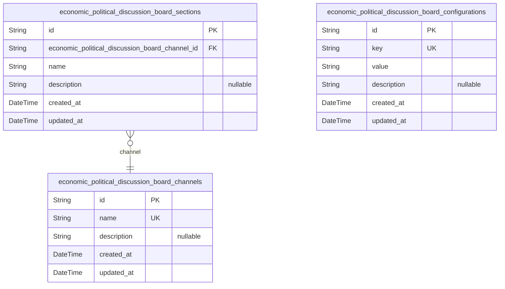
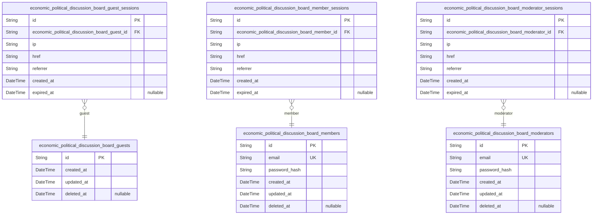
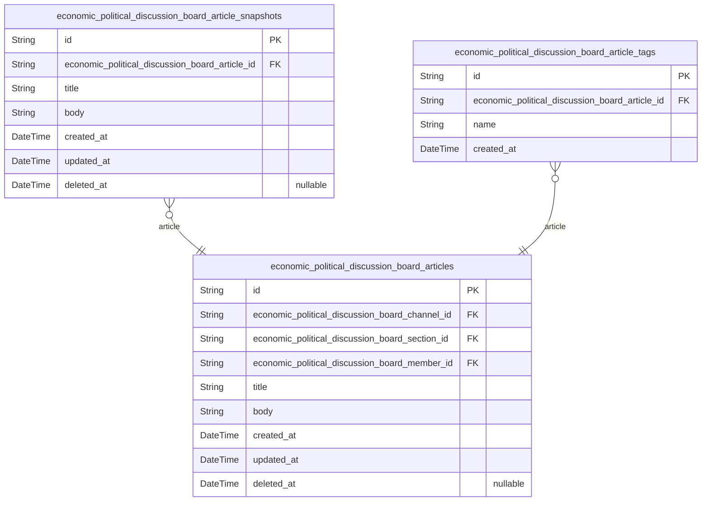
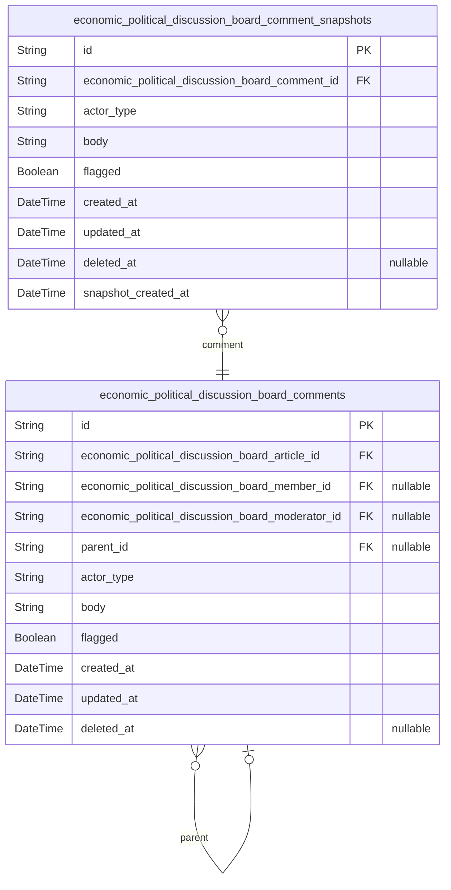
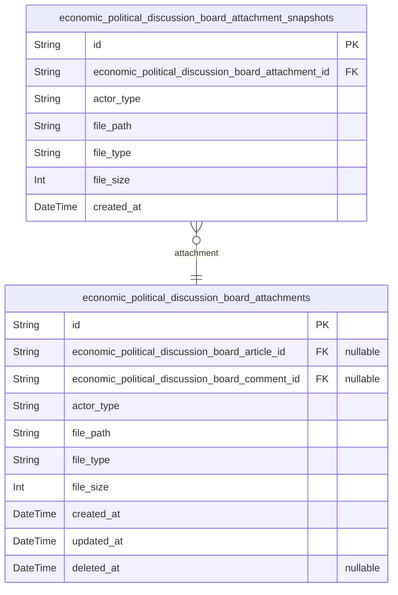

# Prisma Markdown

> Generated by [`prisma-markdown`](https://github.com/samchon/prisma-markdown)

- [Systematic](#systematic)
- [Actors](#actors)
- [Articles](#articles)
- [Comments](#comments)
- [Attachments](#attachments)

## Systematic

```mermaid
erDiagram
"economic_political_discussion_board_channels" {
  String id PK
  String name UK
  String description "nullable"
  DateTime created_at
  DateTime updated_at
}
"economic_political_discussion_board_sections" {
  String id PK
  String economic_political_discussion_board_channel_id FK
  String name
  String description "nullable"
  DateTime created_at
  DateTime updated_at
}
"economic_political_discussion_board_configurations" {
  String id PK
  String key UK
  String value
  String description "nullable"
  DateTime created_at
  DateTime updated_at
}
"economic_political_discussion_board_sections" }o--|| "economic_political_discussion_board_channels" : channel
```

### `economic_political_discussion_board_channels`

Channels for organizing discussion topics. Each channel represents a
broad category of discussion topics. Channels contain sections that
further organize content within the channel.

Properties as follows:

- `id`: Primary Key.
- `name`: Name of the channel.
- `description`: Description of the channel.
- `created_at`: Timestamp when the channel was created.
- `updated_at`: Timestamp when the channel was last updated.

### `economic_political_discussion_board_sections`

Sections within channels for organizing discussion topics. Each section
represents a specific topic within a channel. Sections contain articles
that discuss the topic.

Properties as follows:

- `id`: Primary Key.
- `economic_political_discussion_board_channel_id`
  > Channel that this section belongs to. {@link
  > economic_political_discussion_board_channels.id}
- `name`: Name of the section.
- `description`: Description of the section.
- `created_at`: Timestamp when the section was created.
- `updated_at`: Timestamp when the section was last updated.

### `economic_political_discussion_board_configurations`

Configuration settings for the discussion board. Each configuration
represents a specific setting that controls the behavior of the
discussion board.

Properties as follows:

- `id`: Primary Key.
- `key`: Key of the configuration setting.
- `value`: Value of the configuration setting.
- `description`: Description of the configuration setting.
- `created_at`: Timestamp when the configuration setting was created.
- `updated_at`: Timestamp when the configuration setting was last updated.

## Actors

```mermaid
erDiagram
"economic_political_discussion_board_guests" {
  String id PK
  DateTime created_at
  DateTime updated_at
  DateTime deleted_at "nullable"
}
"economic_political_discussion_board_guest_sessions" {
  String id PK
  String economic_political_discussion_board_guest_id FK
  String ip
  String href
  String referrer
  DateTime created_at
  DateTime expired_at "nullable"
}
"economic_political_discussion_board_members" {
  String id PK
  String email UK
  String password_hash
  DateTime created_at
  DateTime updated_at
  DateTime deleted_at "nullable"
}
"economic_political_discussion_board_member_sessions" {
  String id PK
  String economic_political_discussion_board_member_id FK
  String ip
  String href
  String referrer
  DateTime created_at
  DateTime expired_at "nullable"
}
"economic_political_discussion_board_moderators" {
  String id PK
  String email UK
  String password_hash
  DateTime created_at
  DateTime updated_at
  DateTime deleted_at "nullable"
}
"economic_political_discussion_board_moderator_sessions" {
  String id PK
  String economic_political_discussion_board_moderator_id FK
  String ip
  String href
  String referrer
  DateTime created_at
  DateTime expired_at "nullable"
}
"economic_political_discussion_board_guest_sessions" }o--|| "economic_political_discussion_board_guests" : guest
"economic_political_discussion_board_member_sessions" }o--|| "economic_political_discussion_board_members" : member
"economic_political_discussion_board_moderator_sessions" }o--|| "economic_political_discussion_board_moderators" : moderator
```

### `economic_political_discussion_board_guests`

Guest users who can view public content but cannot create or modify
content. Guests must register to become members. {@link
economic_political_discussion_board_members} for registered users.

Properties as follows:

- `id`: Primary Key.
- `created_at`: When the guest was created.
- `updated_at`: When the guest was last updated.
- `deleted_at`: When the guest was deleted (soft delete).

### `economic_political_discussion_board_guest_sessions`

Session records for guest users. Tracks guest activity and session
context. [economic_political_discussion_board_guests](#economic_political_discussion_board_guests) for the
associated guest.

Properties as follows:

- `id`: Primary Key.
- `economic_political_discussion_board_guest_id`: Guest user's [economic_political_discussion_board_guests.id](#economic_political_discussion_board_guests).
- `ip`: IP address of the guest's connection.
- `href`: URL of the guest's connection.
- `referrer`: Referrer URL of the guest's connection.
- `created_at`: When the session was created.
- `expired_at`: When the session expired.

### `economic_political_discussion_board_members`

Registered members who can create and manage their own content. Members
have full access to the platform's features. {@link
economic_political_discussion_board_articles} for member-created content.

Properties as follows:

- `id`: Primary Key.
- `email`: Member's email address for authentication and communication.
- `password_hash`: Hashed password for authentication.
- `created_at`: When the member was created.
- `updated_at`: When the member was last updated.
- `deleted_at`: When the member was deleted (soft delete).

### `economic_political_discussion_board_member_sessions`

Session records for member users. Tracks member activity and session
context. [economic_political_discussion_board_members](#economic_political_discussion_board_members) for the
associated member.

Properties as follows:

- `id`: Primary Key.
- `economic_political_discussion_board_member_id`: Member user's [economic_political_discussion_board_members.id](#economic_political_discussion_board_members).
- `ip`: IP address of the member's connection.
- `href`: URL of the member's connection.
- `referrer`: Referrer URL of the member's connection.
- `created_at`: When the session was created.
- `expired_at`: When the session expired.

### `economic_political_discussion_board_moderators`

Moderators who manage the platform's content and users. Moderators have
elevated permissions for content moderation and user management. {@link
economic_political_discussion_board_articles} for moderator-managed
content.

Properties as follows:

- `id`: Primary Key.
- `email`: Moderator's email address for authentication and communication.
- `password_hash`: Hashed password for authentication.
- `created_at`: When the moderator was created.
- `updated_at`: When the moderator was last updated.
- `deleted_at`: When the moderator was deleted (soft delete).

### `economic_political_discussion_board_moderator_sessions`

Session records for moderator users. Tracks moderator activity and
session context. [economic_political_discussion_board_moderators](#economic_political_discussion_board_moderators)
for the associated moderator.

Properties as follows:

- `id`: Primary Key.
- `economic_political_discussion_board_moderator_id`
  > Moderator user's {@link
  > economic_political_discussion_board_moderators.id}.
- `ip`: IP address of the moderator's connection.
- `href`: URL of the moderator's connection.
- `referrer`: Referrer URL of the moderator's connection.
- `created_at`: When the session was created.
- `expired_at`: When the session expired.

## Articles

```mermaid
erDiagram
"economic_political_discussion_board_articles" {
  String id PK
  String economic_political_discussion_board_channel_id FK
  String economic_political_discussion_board_section_id FK
  String economic_political_discussion_board_member_id FK
  String title
  String body
  DateTime created_at
  DateTime updated_at
  DateTime deleted_at "nullable"
}
"economic_political_discussion_board_article_snapshots" {
  String id PK
  String economic_political_discussion_board_article_id FK
  String title
  String body
  DateTime created_at
  DateTime updated_at
  DateTime deleted_at "nullable"
}
"economic_political_discussion_board_article_tags" {
  String id PK
  String economic_political_discussion_board_article_id FK
  String name
  DateTime created_at
}
"economic_political_discussion_board_article_snapshots" }o--|| "economic_political_discussion_board_articles" : article
"economic_political_discussion_board_article_tags" }o--|| "economic_political_discussion_board_articles" : article
```

### `economic_political_discussion_board_articles`

Primary article content management table.

Stores the core content of articles including title, body, and metadata.
Each article belongs to a specific channel and section, and is created by a
member. Articles support soft deletion for content recovery and maintain
audit trail through snapshots.

Articles can have multiple tags and attachments, and are the subject of
comments. The table includes fields for tracking creation, modification,
and deletion times to support content lifecycle management.

Properties as follows:

- `id`: Primary Key.
- `economic_political_discussion_board_channel_id`
  > Channel where the article is published. {@link
  > economic_political_discussion_board_channels.id}
- `economic_political_discussion_board_section_id`
  > Section within the channel where the article is categorized. {@link
  > economic_political_discussion_board_sections.id}
- `economic_political_discussion_board_member_id`
  > Member who created the article. {@link
  > economic_political_discussion_board_members.id}
- `title`: Title of the article. Used for display in listings and search results.
- `body`
  > Main content of the article. Contains the detailed information and
  > analysis.
- `created_at`: Timestamp when the article was created. Used for sorting and filtering.
- `updated_at`: Timestamp when the article was last modified. Used for tracking changes.
- `deleted_at`
  > Timestamp when the article was soft-deleted. Null if the article is
  > active.

### `economic_political_discussion_board_article_snapshots`

Historical states of articles for audit trails and version control.

Stores point-in-time copies of article content to preserve historical
information. Each snapshot captures the complete state of an article at a
specific moment, including all fields from the main article table. This
allows for tracking changes over time and recovering previous versions if
needed.

Snapshots are created whenever an article is modified and are never
deleted or modified after creation. They provide a complete audit trail
of all
changes to articles.

Properties as follows:

- `id`: Primary Key.
- `economic_political_discussion_board_article_id`
  > Article that this snapshot represents. {@link
  > economic_political_discussion_board_articles.id}
- `title`: Title of the article at the time of this snapshot.
- `body`: Content of the article at the time of this snapshot.
- `created_at`
  > Timestamp when this snapshot was created. Represents the point-in-time
  > state of the article.
- `updated_at`
  > Timestamp when the article was last modified before this snapshot was
  > taken.
- `deleted_at`
  > Timestamp when the article was soft-deleted at the time of this snapshot.
  > Null if the article was active.

### `economic_political_discussion_board_article_tags`

Tags associated with articles for categorization and search.

Stores tags that describe the content of articles, enabling better
categorization and search functionality. Each tag is associated with one
or more articles, allowing for flexible content organization.

Tags are used to improve search results and help users find relevant
articles based on their interests. The table maintains a many-to-many
relationship with articles through a junction table.

Properties as follows:

- `id`: Primary Key.
- `economic_political_discussion_board_article_id`
  > Article that this tag is associated with. {@link
  > economic_political_discussion_board_articles.id}
- `name`: Name of the tag. Used for display and search functionality.
- `created_at`
  > Timestamp when the tag was created. Used for tracking when tags were
  > added to articles.

## Comments

```mermaid
erDiagram
"economic_political_discussion_board_comments" {
  String id PK
  String economic_political_discussion_board_article_id FK
  String economic_political_discussion_board_member_id FK "nullable"
  String economic_political_discussion_board_moderator_id FK "nullable"
  String parent_id FK "nullable"
  String actor_type
  String body
  Boolean flagged
  DateTime created_at
  DateTime updated_at
  DateTime deleted_at "nullable"
}
"economic_political_discussion_board_comment_snapshots" {
  String id PK
  String economic_political_discussion_board_comment_id FK
  String actor_type
  String body
  Boolean flagged
  DateTime created_at
  DateTime updated_at
  DateTime deleted_at "nullable"
  DateTime snapshot_created_at
}
"economic_political_discussion_board_comments" }o--o| "economic_political_discussion_board_comments" : parent
"economic_political_discussion_board_comment_snapshots" }o--|| "economic_political_discussion_board_comments" : comment
```

### `economic_political_discussion_board_comments`

User comments on articles in the economic/political discussion board.

Stores user-generated content that engages with articles, allowing for
discussion and debate. Each comment is associated with a specific article
and created by an authenticated member or moderator through their active
session.

Comments can be nested to support threaded discussions, and they can be
edited or deleted by their authors. The comment content includes a body
field for the text of the comment.

Soft deletion is supported to maintain audit trails while allowing
content moderation. Comments can be flagged for review by moderators.

The comment system supports:
- Threaded discussions through parent_id field
- User authentication tracking through member/moderator relationships
- Content moderation through deleted_at and flagged fields
- Historical tracking through snapshot tables
- Soft delete capability for content management

Properties as follows:

- `id`: Primary Key.
- `economic_political_discussion_board_article_id`
  > Article that this comment belongs to. {@link
  > economic_political_discussion_board_articles.id}
- `economic_political_discussion_board_member_id`
  > Member who created this comment. {@link
  > economic_political_discussion_board_members.id}
- `economic_political_discussion_board_moderator_id`
  > Moderator who created this comment. {@link
  > economic_political_discussion_board_moderators.id}
- `parent_id`
  > Parent comment for threaded discussions. {@link
  > economic_political_discussion_board_comments.id}
- `actor_type`
  > Type of actor who created the comment. Valid values: 'member' or
  > 'moderator'
- `body`: Text content of the comment
- `flagged`: Whether the comment has been flagged for moderator review
- `created_at`: When the comment was created
- `updated_at`: When the comment was last updated
- `deleted_at`: When the comment was soft-deleted (null if active)

### `economic_political_discussion_board_comment_snapshots`

Historical snapshots of comments for audit trails and change tracking.

Stores point-in-time states of comments to maintain a complete history of
all changes made to comments. Each snapshot captures the complete state
of a comment at a specific moment in time, including the comment content,
author information, and timestamps.

Snapshots are created whenever a comment is created, updated, or deleted.
They provide a complete audit trail for content moderation and user
accountability.

The snapshot system supports:
- Complete historical tracking of all comment changes
- Restoration of previous comment states if needed
- Content moderation through historical review
- User accountability through author tracking
- Change tracking for content analysis

Properties as follows:

- `id`: Primary Key.
- `economic_political_discussion_board_comment_id`
  > Comment that this snapshot belongs to. {@link
  > economic_political_discussion_board_comments.id}
- `actor_type`
  > Type of actor who created the comment. Valid values: 'member' or
  > 'moderator'
- `body`: Text content of the comment
- `flagged`: Whether the comment was flagged for moderator review at this point in time
- `created_at`: When the comment was created
- `updated_at`: When the comment was last updated
- `deleted_at`: When the comment was soft-deleted (null if active)
- `snapshot_created_at`: When this snapshot was created

## Attachments

```mermaid
erDiagram
"economic_political_discussion_board_attachments" {
  String id PK
  String economic_political_discussion_board_article_id FK "nullable"
  String economic_political_discussion_board_comment_id FK "nullable"
  String actor_type
  String file_path
  String file_type
  Int file_size
  DateTime created_at
  DateTime updated_at
  DateTime deleted_at "nullable"
}
"economic_political_discussion_board_attachment_snapshots" {
  String id PK
  String economic_political_discussion_board_attachment_id FK
  String actor_type
  String file_path
  String file_type
  Int file_size
  DateTime created_at
}
"economic_political_discussion_board_attachment_snapshots" }o--|| "economic_political_discussion_board_attachments" : attachment
```

### `economic_political_discussion_board_attachments`

File and image attachments for articles and comments in the
economic/political discussion board.

Stores all file attachments including images, documents, and other media
types
associated with articles and comments. Each attachment is linked to
either an
article or a comment through polymorphic ownership. The system supports soft
deletion to allow for content moderation while maintaining audit trails.

Attachments are created by users (members or moderators) and include
metadata
such as file type, size, and upload timestamp. The attachment content is
stored
in the file system with the database containing only references to these
files.

The attachment system supports versioning through snapshots, allowing for
the
preservation of historical states of attachments. This is particularly
useful for
content moderation and historical analysis.

Properties as follows:

- `id`: Primary Key.
- `economic_political_discussion_board_article_id`
  > Article that this attachment belongs to. {@link
  > economic_political_discussion_board_articles.id}
- `economic_political_discussion_board_comment_id`
  > Comment that this attachment belongs to. {@link
  > economic_political_discussion_board_comments.id}
- `actor_type`
  > Type of actor who created the attachment. Valid values: 'member',
  > 'moderator'.
- `file_path`: Path to the stored file in the file system.
- `file_type`: MIME type of the file (e.g., 'image/jpeg', 'application/pdf').
- `file_size`: Size of the file in bytes.
- `created_at`: Timestamp when the attachment was created.
- `updated_at`: Timestamp when the attachment was last updated.
- `deleted_at`
  > Timestamp when the attachment was soft-deleted. Null if the attachment is
  > active.

### `economic_political_discussion_board_attachment_snapshots`

Historical snapshots of file and image attachments in the
economic/political discussion board.

Stores point-in-time states of attachments for audit trails and version
control.
Each snapshot captures the state of an attachment at a specific moment,
including
metadata and file references. This allows for the preservation of historical
states of attachments, which is essential for content moderation and
historical analysis.

Snapshots are created automatically whenever an attachment is created or
updated. They are immutable and cannot be modified or deleted, ensuring the
integrity of the audit trail. Each snapshot is linked to the original
attachment
and includes a timestamp indicating when the snapshot was taken.

Properties as follows:

- `id`: Primary Key.
- `economic_political_discussion_board_attachment_id`
  > Attachment that this snapshot belongs to. {@link
  > economic_political_discussion_board_attachments.id}
- `actor_type`
  > Type of actor who created the attachment. Valid values: 'member',
  > 'moderator'.
- `file_path`: Path to the stored file in the file system.
- `file_type`: MIME type of the file (e.g., 'image/jpeg', 'application/pdf').
- `file_size`: Size of the file in bytes.
- `created_at`: Timestamp when the snapshot was created.
