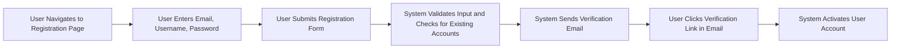
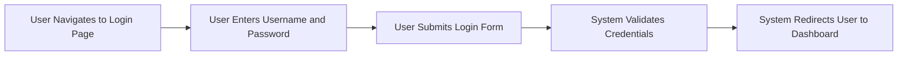
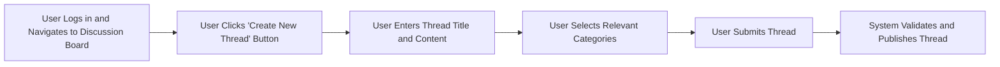
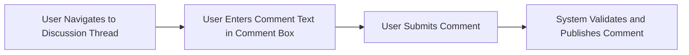
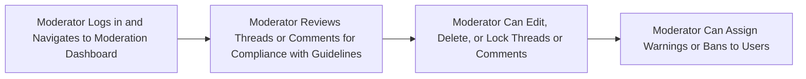
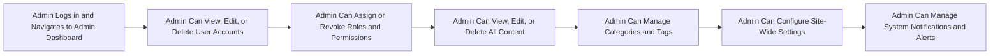

## Economic/Political Discussion Board User Flow Documentation

### User Registration and Login

#### User Registration

1. User navigates to the registration page
2. User enters email address, username, and password
3. User submits registration form
4. System validates input and checks for existing accounts
5. System sends verification email
6. User clicks verification link in email
7. System activates user account

#### User Login

1. User navigates to the login page
2. User enters username and password
3. User submits login form
4. System validates credentials
5. System redirects user to the dashboard

### Creating and Managing Discussion Threads

#### Creating a Discussion Thread

1. User logs in and navigates to the discussion board
2. User clicks "Create New Thread" button
3. User enters thread title and content
4. User selects relevant categories
5. User submits thread
6. System validates and publishes thread

#### Managing Discussion Threads

1. User navigates to their profile
2. User selects "My Threads"
3. User can edit, delete, or close threads
4. System updates thread status accordingly

### Posting and Managing Comments

#### Posting a Comment

1. User navigates to a discussion thread
2. User enters comment text in the comment box
3. User submits comment
4. System validates and publishes comment

#### Managing Comments

1. User navigates to their profile
2. User selects "My Comments"
3. User can edit or delete comments
4. System updates comment status accordingly

### Moderating Content

#### Moderating Discussion Threads

1. Moderator logs in and navigates to the moderation dashboard
2. Moderator reviews threads for compliance with guidelines
3. Moderator can edit, delete, or lock threads
4. Moderator can assign warnings or bans to users

#### Moderating Comments

1. Moderator navigates to the moderation dashboard
2. Moderator reviews comments for compliance with guidelines
3. Moderator can edit, delete, or hide comments
4. Moderator can assign warnings or bans to users

### Administering the System

#### Managing Users

1. Admin logs in and navigates to the admin dashboard
2. Admin can view, edit, or delete user accounts
3. Admin can assign or revoke roles and permissions

#### Managing Content

1. Admin navigates to the content management section
2. Admin can view, edit, or delete all content
3. Admin can manage categories and tags

#### System Settings

1. Admin navigates to the system settings
2. Admin can configure site-wide settings
3. Admin can manage system notifications and alerts

### Error Handling and Recovery

#### Common Errors and Solutions

- **Registration Errors**:
  - Email already in use: Prompt user to log in or reset password
  - Invalid email format: Display error message and request correction
  - Password requirements not met: Display error message and request correction

- **Login Errors**:
  - Incorrect username or password: Display error message and prompt for retry
  - Account locked: Display message and provide password reset option
  - Account not verified: Prompt user to check email for verification link

- **Thread Creation Errors**:
  - Missing title or content: Display error message and request correction
  - Invalid categories: Display error message and request correction

- **Comment Errors**:
  - Missing comment text: Display error message and request correction

- **Moderation Errors**:
  - Insufficient permissions: Display error message and redirect to appropriate page

- **Admin Errors**:
  - Insufficient permissions: Display error message and redirect to appropriate page

### User Flow Diagrams

#### User Registration Flow

#### User Login Flow

#### Creating a Discussion Thread Flow

#### Posting a Comment Flow

#### Moderating Content Flow

#### Administering the System Flow

### Conclusion

This document provides a comprehensive overview of the user flow for the economic/political discussion board, ensuring a seamless and intuitive user experience. By following these guidelines, developers can create a user-friendly platform that meets the needs of all stakeholders.