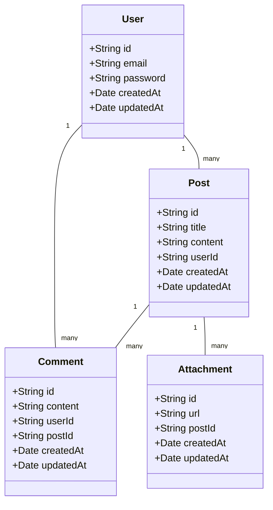

# Economic Discussion Board Requirements Analysis Report

## User Actors and Permissions

### User Actors

1. **User**:
   - Authenticated users who can create, edit, and delete their own posts and comments.
   - Can also upload attachments to their posts.

2. **Admin**:
   - System administrators who can manage all posts, comments, and users.
   - Have the ability to delete inappropriate content and ban users if necessary.

## Permission Hierarchy

### Permission Levels

1. **User**:
   - Create, edit, and delete their own posts and comments.
   - Upload attachments to their posts.

2. **Admin**:
   - Manage all posts, comments, and users.
   - Delete inappropriate content and ban users.

## Authentication Requirements

### Authentication Methods

- **Email and Password**: Users can register and log in using their email and password.
- **Session Management**: The system should maintain user sessions securely.

### Authentication Flow

1. **User Registration**: Users can register for the service using their email and password.
2. **User Login**: Users can log in to the service using their email and password.
3. **Session Management**: The system should maintain user sessions securely.

## Authorization Rules

### Authorization Rules

1. **User Authorization**:
   - Users can only create, edit, and delete their own posts and comments.
   - Users can only upload attachments to their own posts.

2. **Admin Authorization**:
   - Admins can manage all posts, comments, and users.
   - Admins can delete inappropriate content and ban users.

### Authorization Flow

1. **User Authorization Flow**:
   - Users can only perform actions on their own posts and comments.
   - Users can only upload attachments to their own posts.

2. **Admin Authorization Flow**:
   - Admins can perform actions on all posts, comments, and users.
   - Admins can delete inappropriate content and ban users.

### Error Handling

- **Unauthorized Access**: If a user attempts to perform an action they are not authorized for, the system should display an error message and prevent the action.
- **Invalid Credentials**: If a user enters invalid credentials, the system should display an error message and prevent login.

### Performance Requirements

- **Authentication Speed**: The system should authenticate users quickly, ideally within 2 seconds.
- **Authorization Speed**: The system should authorize users quickly, ideally within 1 second.

### Security Requirements

- **Data Encryption**: User data should be encrypted to ensure security.
- **Secure Password Storage**: User passwords should be securely stored using hashing algorithms.

### Compliance Requirements

- **Data Protection**: The system should comply with data protection regulations to ensure user data is protected.
- **Access Control**: The system should comply with access control regulations to ensure only authorized users can perform actions.

### User Experience Requirements

- **Intuitive Interface**: The system should have an intuitive interface to ensure users can easily navigate and use the service.
- **Clear Error Messages**: The system should display clear error messages to ensure users understand what went wrong and how to fix it.

### Future Considerations

- **Additional Authentication Methods**: The system should be designed to support additional authentication methods in the future, such as social media login.
- **Enhanced Authorization Rules**: The system should be designed to support enhanced authorization rules in the future, such as role-based access control.

### Conclusion

This document outlines the user actors and their permissions for the economic discussion board, ensuring a clear and secure authorization system. The document provides a detailed specification of the user actors, permission hierarchy, authentication requirements, and authorization rules for the service. The document is designed to be used by the development team to understand the requirements for the service and ensure a smooth and secure user experience.

## Functional Requirements

### Core Features

1. **User Registration**: Users can register for the service using their email and password.
2. **User Login**: Users can log in to the service using their email and password.
3. **Create Post**: Users can create posts with text and attachments.
4. **Edit Post**: Users can edit their own posts.
5. **Delete Post**: Users can delete their own posts.
6. **Create Comment**: Users can create comments on posts.
7. **Edit Comment**: Users can edit their own comments.
8. **Delete Comment**: Users can delete their own comments.
9. **Upload Attachment**: Users can upload attachments to their posts.
10. **View Posts**: Users can view posts and comments.

### User Needs

1. **User Registration**: Users need to register for the service to create posts and comments.
2. **User Login**: Users need to log in to the service to create, edit, and delete posts and comments.
3. **Create Post**: Users need to create posts to share their thoughts and ideas.
4. **Edit Post**: Users need to edit their posts to correct mistakes or update information.
5. **Delete Post**: Users need to delete their posts if they no longer want them to be visible.
6. **Create Comment**: Users need to create comments to engage in discussions.
7. **Edit Comment**: Users need to edit their comments to correct mistakes or update information.
8. **Delete Comment**: Users need to delete their comments if they no longer want them to be visible.
9. **Upload Attachment**: Users need to upload attachments to support their posts with additional information.
10. **View Posts**: Users need to view posts and comments to stay informed and engaged.

### Business Rules

1. **User Registration**: Users must provide a valid email and password to register for the service.
2. **User Login**: Users must provide valid credentials to log in to the service.
3. **Create Post**: Users must be logged in to create posts.
4. **Edit Post**: Users must be the author of the post to edit it.
5. **Delete Post**: Users must be the author of the post to delete it.
6. **Create Comment**: Users must be logged in to create comments.
7. **Edit Comment**: Users must be the author of the comment to edit it.
8. **Delete Comment**: Users must be the author of the comment to delete it.
9. **Upload Attachment**: Users must be logged in to upload attachments.
10. **View Posts**: Users can view posts and comments without being logged in.

### Performance Requirements

1. **Authentication Speed**: The system should authenticate users quickly, ideally within 2 seconds.
2. **Authorization Speed**: The system should authorize users quickly, ideally within 1 second.
3. **Post Creation Speed**: The system should create posts quickly, ideally within 1 second.
4. **Comment Creation Speed**: The system should create comments quickly, ideally within 1 second.
5. **Attachment Upload Speed**: The system should upload attachments quickly, ideally within 2 seconds.
6. **Post Viewing Speed**: The system should display posts quickly, ideally within 1 second.

## User Flows

### User Registration

1. **User Registration**: Users can register for the service using their email and password.
2. **User Login**: Users can log in to the service using their email and password.
3. **Create Post**: Users can create posts with text and attachments.
4. **Edit Post**: Users can edit their own posts.
5. **Delete Post**: Users can delete their own posts.
6. **Create Comment**: Users can create comments on posts.
7. **Edit Comment**: Users can edit their own comments.
8. **Delete Comment**: Users can delete their own comments.
9. **Upload Attachment**: Users can upload attachments to their posts.
10. **View Posts**: Users can view posts and comments.

### User Login

1. **User Login**: Users can log in to the service using their email and password.
2. **Create Post**: Users can create posts with text and attachments.
3. **Edit Post**: Users can edit their own posts.
4. **Delete Post**: Users can delete their own posts.
5. **Create Comment**: Users can create comments on posts.
6. **Edit Comment**: Users can edit their own comments.
7. **Delete Comment**: Users can delete their own comments.
8. **Upload Attachment**: Users can upload attachments to their posts.
9. **View Posts**: Users can view posts and comments.

### Creating a Post

1. **Create Post**: Users can create posts with text and attachments.
2. **Edit Post**: Users can edit their own posts.
3. **Delete Post**: Users can delete their own posts.
4. **Create Comment**: Users can create comments on posts.
5. **Edit Comment**: Users can edit their own comments.
6. **Delete Comment**: Users can delete their own comments.
7. **Upload Attachment**: Users can upload attachments to their posts.
8. **View Posts**: Users can view posts and comments.

### Editing a Post

1. **Edit Post**: Users can edit their own posts.
2. **Delete Post**: Users can delete their own posts.
3. **Create Comment**: Users can create comments on posts.
4. **Edit Comment**: Users can edit their own comments.
5. **Delete Comment**: Users can delete their own comments.
6. **Upload Attachment**: Users can upload attachments to their posts.
7. **View Posts**: Users can view posts and comments.

### Deleting a Post

1. **Delete Post**: Users can delete their own posts.
2. **Create Comment**: Users can create comments on posts.
3. **Edit Comment**: Users can edit their own comments.
4. **Delete Comment**: Users can delete their own comments.
5. **Upload Attachment**: Users can upload attachments to their posts.
6. **View Posts**: Users can view posts and comments.

### Uploading Attachments

1. **Upload Attachment**: Users can upload attachments to their posts.
2. **Create Comment**: Users can create comments on posts.
3. **Edit Comment**: Users can edit their own comments.
4. **Delete Comment**: Users can delete their own comments.
5. **View Posts**: Users can view posts and comments.

### Viewing Posts

1. **View Posts**: Users can view posts and comments.
2. **Create Comment**: Users can create comments on posts.
3. **Edit Comment**: Users can edit their own comments.
4. **Delete Comment**: Users can delete their own comments.

## Technical Specifications

### Database Schema

### API Endpoints

1. **User Registration**: `POST /api/users/register`
2. **User Login**: `POST /api/users/login`
3. **Create Post**: `POST /api/posts`
4. **Edit Post**: `PUT /api/posts/:id`
5. **Delete Post**: `DELETE /api/posts/:id`
6. **Create Comment**: `POST /api/comments`
7. **Edit Comment**: `PUT /api/comments/:id`
8. **Delete Comment**: `DELETE /api/comments/:id`
9. **Upload Attachment**: `POST /api/attachments`
10. **View Posts**: `GET /api/posts`

### Error Handling

1. **Unauthorized Access**: If a user attempts to perform an action they are not authorized for, the system should display an error message and prevent the action.
2. **Invalid Credentials**: If a user enters invalid credentials, the system should display an error message and prevent login.
3. **Post Not Found**: If a user attempts to edit or delete a post that does not exist, the system should display an error message.
4. **Comment Not Found**: If a user attempts to edit or delete a comment that does not exist, the system should display an error message.
5. **Attachment Upload Error**: If a user attempts to upload an attachment that is too large or of an unsupported type, the system should display an error message.

### Performance Requirements

1. **Authentication Speed**: The system should authenticate users quickly, ideally within 2 seconds.
2. **Authorization Speed**: The system should authorize users quickly, ideally within 1 second.
3. **Post Creation Speed**: The system should create posts quickly, ideally within 1 second.
4. **Comment Creation Speed**: The system should create comments quickly, ideally within 1 second.
5. **Attachment Upload Speed**: The system should upload attachments quickly, ideally within 2 seconds.
6. **Post Viewing Speed**: The system should display posts quickly, ideally within 1 second.

### Security Requirements

1. **Data Encryption**: User data should be encrypted to ensure security.
2. **Secure Password Storage**: User passwords should be securely stored using hashing algorithms.
3. **Secure API Endpoints**: API endpoints should be secured to prevent unauthorized access.
4. **Secure Session Management**: User sessions should be securely managed to prevent session hijacking.

### Compliance Requirements

1. **Data Protection**: The system should comply with data protection regulations to ensure user data is protected.
2. **Access Control**: The system should comply with access control regulations to ensure only authorized users can perform actions.
3. **Privacy Policy**: The system should have a privacy policy to ensure user data is handled in accordance with privacy regulations.
4. **Terms of Service**: The system should have terms of service to ensure users understand the rules and regulations of the service.

### User Experience Requirements

1. **Intuitive Interface**: The system should have an intuitive interface to ensure users can easily navigate and use the service.
2. **Clear Error Messages**: The system should display clear error messages to ensure users understand what went wrong and how to fix it.
3. **Responsive Design**: The system should have a responsive design to ensure users can use the service on any device.
4. **Accessibility**: The system should be accessible to ensure users with disabilities can use the service.

### Future Considerations

1. **Additional Authentication Methods**: The system should be designed to support additional authentication methods in the future, such as social media login.
2. **Enhanced Authorization Rules**: The system should be designed to support enhanced authorization rules in the future, such as role-based access control.
3. **Additional Features**: The system should be designed to support additional features in the future, such as notifications and messaging.

### Conclusion

This document outlines the requirements for the economic discussion board, ensuring a clear and comprehensive understanding of the service's needs. The document provides a detailed specification of the user actors, functional requirements, user flows, and technical specifications for the service. The document is designed to be used by the development team to understand the requirements for the service and ensure a smooth and secure user experience.