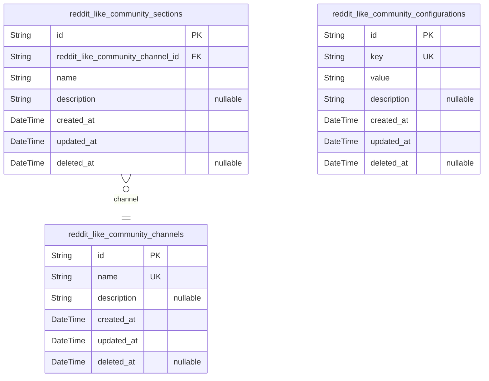
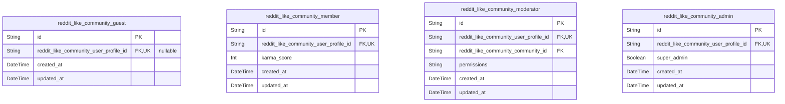
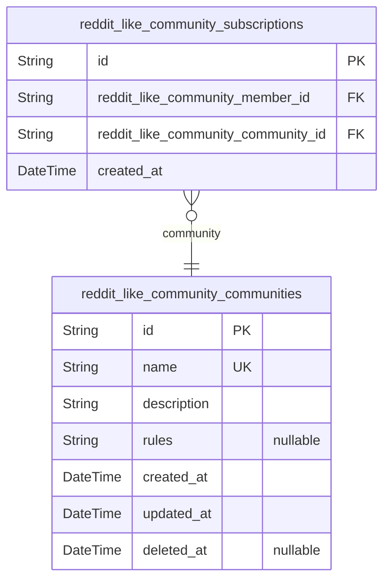
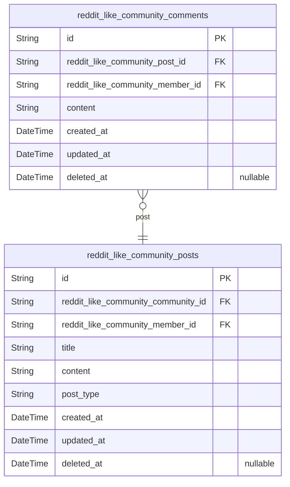
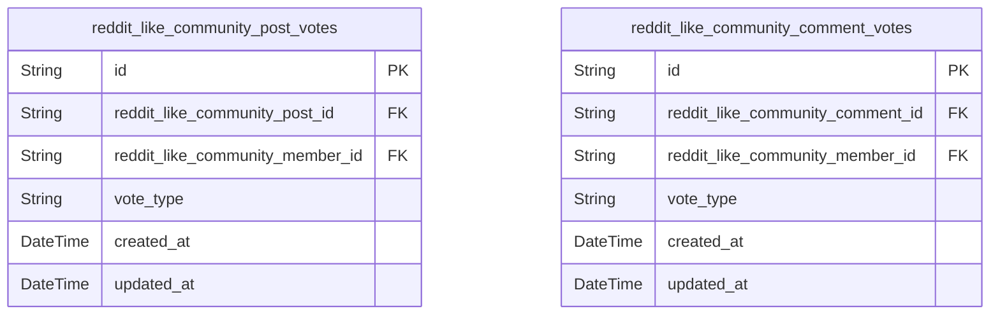
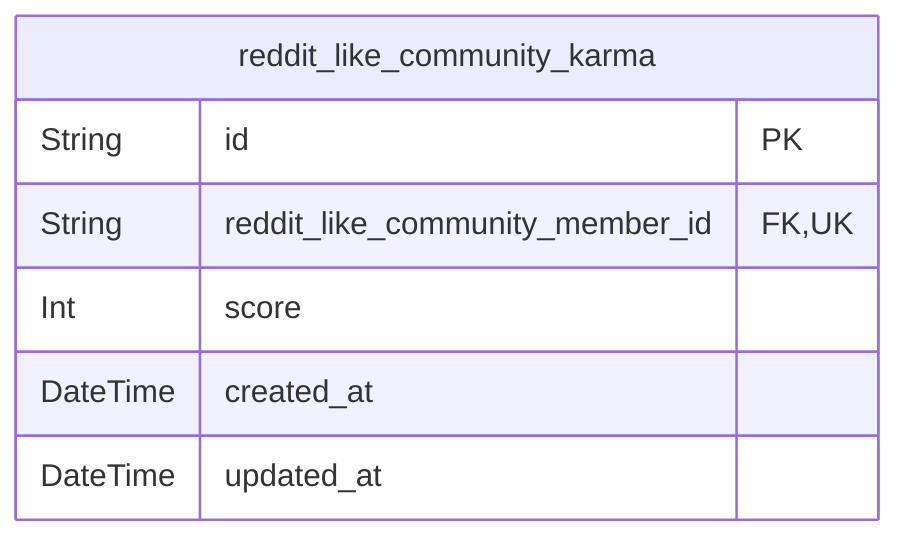
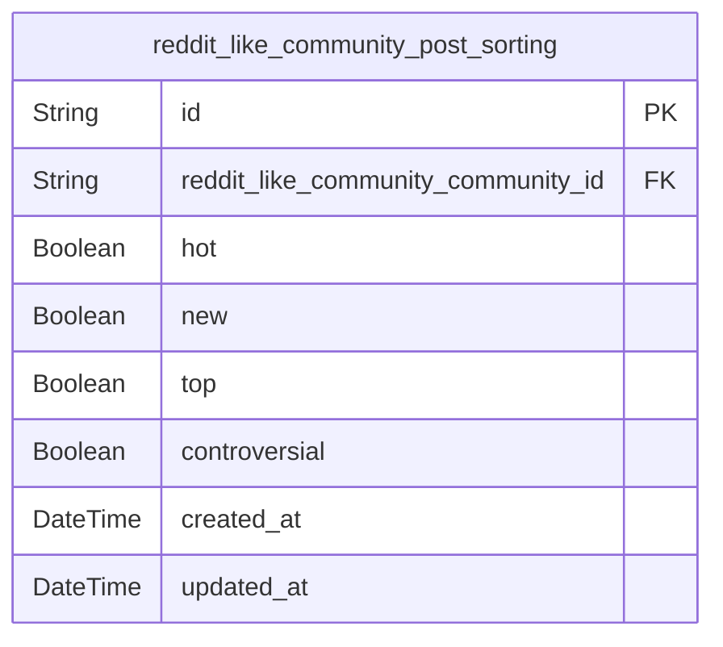
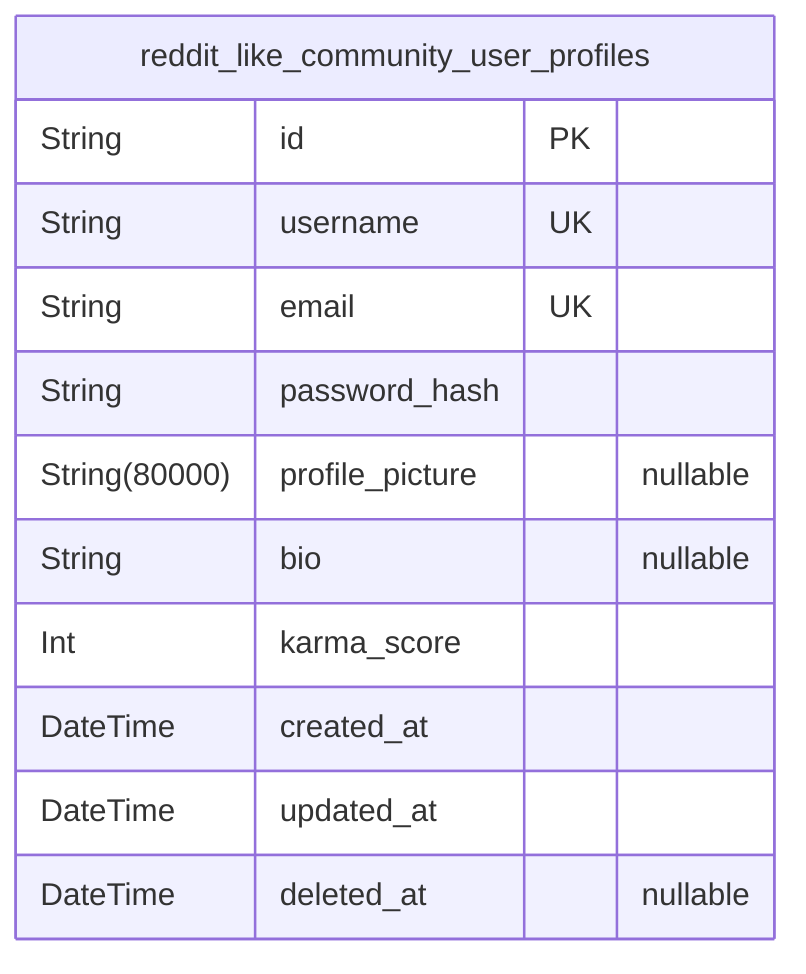
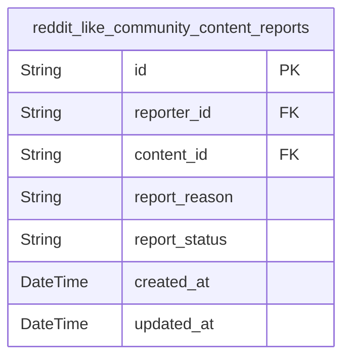
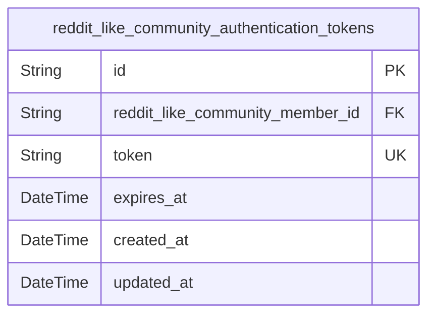

# Prisma Markdown

> Generated by [`prisma-markdown`](https://github.com/samchon/prisma-markdown)

- [Systematic](#systematic)
- [Actors](#actors)
- [Communities](#communities)
- [Content](#content)
- [Voting](#voting)
- [Karma](#karma)
- [Sorting](#sorting)
- [Profiles](#profiles)
- [Reporting](#reporting)
- [Authentication](#authentication)

## Systematic

### `reddit_like_community_channels`

Represents the channels within the community platform. Each channel
serves as a container for sections and configurations, enabling organized
content management.

Properties as follows:

- `id`: Primary Key.
- `name`: The name of the channel, which must be unique across the platform.
- `description`: A detailed description of the channel's purpose and content.
- `created_at`: The timestamp when the channel was created.
- `updated_at`: The timestamp when the channel was last updated.
- `deleted_at`: The timestamp when the channel was deleted, if applicable.

### `reddit_like_community_sections`

Represents the sections within a channel. Each section organizes content
into specific topics or categories, enhancing user navigation and content
discovery.

Properties as follows:

- `id`: Primary Key.
- `reddit_like_community_channel_id`
  > The channel to which this section belongs. {@link
  > reddit_like_community_channels.id}
- `name`: The name of the section, which must be unique within the channel.
- `description`: A detailed description of the section's purpose and content.
- `created_at`: The timestamp when the section was created.
- `updated_at`: The timestamp when the section was last updated.
- `deleted_at`: The timestamp when the section was deleted, if applicable.

### `reddit_like_community_configurations`

Stores configuration settings for the community platform. These settings
define the behavior and appearance of the platform, ensuring a consistent
user experience.

Properties as follows:

- `id`: Primary Key.
- `key`: The unique key identifying the configuration setting.
- `value`: The value of the configuration setting.
- `description`: A detailed description of the configuration setting and its purpose.
- `created_at`: The timestamp when the configuration was created.
- `updated_at`: The timestamp when the configuration was last updated.
- `deleted_at`: The timestamp when the configuration was deleted, if applicable.

## Actors

### `reddit_like_community_guest`

Guest users who can view public content but cannot interact with the
platform. This table represents unauthenticated users who have limited
access to the community platform.

Properties as follows:

- `id`: Primary Key.
- `reddit_like_community_user_profile_id`: Associated user profile. [reddit_like_community_user_profiles.id](#reddit_like_community_user_profiles)
- `created_at`: When the guest record was created.
- `updated_at`: When the guest record was last updated.

### `reddit_like_community_member`

Authenticated users who can create posts, comment, vote, and subscribe to
communities. This table represents regular members of the community
platform with full interaction capabilities.

Properties as follows:

- `id`: Primary Key.
- `reddit_like_community_user_profile_id`: Associated user profile. [reddit_like_community_user_profiles.id](#reddit_like_community_user_profiles)
- `karma_score`: Current karma score of the member.
- `created_at`: When the member account was created.
- `updated_at`: When the member account was last updated.

### `reddit_like_community_moderator`

Community managers who can manage posts, comments, and enforce community
rules. This table represents users with elevated privileges for specific
communities.

Properties as follows:

- `id`: Primary Key.
- `reddit_like_community_user_profile_id`: Associated user profile. [reddit_like_community_user_profiles.id](#reddit_like_community_user_profiles)
- `reddit_like_community_community_id`
  > Community this moderator manages. {@link
  > reddit_like_community_communities.id}
- `permissions`: JSON string representing moderator permissions.
- `created_at`: When the moderator role was created.
- `updated_at`: When the moderator role was last updated.

### `reddit_like_community_admin`

Platform administrators with full access to manage the platform,
including user accounts and community settings. This table represents
users with the highest level of privileges on the platform.

Properties as follows:

- `id`: Primary Key.
- `reddit_like_community_user_profile_id`: Associated user profile. [reddit_like_community_user_profiles.id](#reddit_like_community_user_profiles)
- `super_admin`: Whether this admin has super admin privileges.
- `created_at`: When the admin account was created.
- `updated_at`: When the admin account was last updated.

## Communities

### `reddit_like_community_communities`

Represents communities (subreddits) in the platform. Each community has a
unique name and description, and can have rules and guidelines set by
moderators. This table serves as the central entity for community
management and interaction.

Properties as follows:

- `id`: Primary Key.
- `name`: Unique name of the community.
- `description`: Description of the community.
- `rules`: Rules and guidelines for the community.
- `created_at`: Timestamp when the community was created.
- `updated_at`: Timestamp when the community was last updated.
- `deleted_at`: Timestamp when the community was deleted (soft delete).

### `reddit_like_community_subscriptions`

Represents the subscription relationship between users and communities.
This table tracks which users are subscribed to which communities and
when the subscription was created. It establishes a many-to-many
relationship between users and communities.

Properties as follows:

- `id`: Primary Key.
- `reddit_like_community_member_id`
  > Reference to the user who subscribed to the community. {@link
  > reddit_like_community_member.id}
- `reddit_like_community_community_id`
  > Reference to the community that the user subscribed to. {@link
  > reddit_like_community_communities.id}
- `created_at`: Timestamp when the subscription was created.

## Content

### `reddit_like_community_posts`

Represents posts created by community members. This model captures the
core content of the platform, including text, links, and images. It
establishes relationships with communities, users, and snapshots for
comprehensive content management.

Properties as follows:

- `id`: Primary Key.
- `reddit_like_community_community_id`
  > The community to which this post belongs. {@link
  > reddit_like_community_communities.id}
- `reddit_like_community_member_id`: The member who created this post. [reddit_like_community_member.id](#reddit_like_community_member)
- `title`: The title of the post.
- `content`: The content of the post, which can be text, a link, or an image.
- `post_type`: The type of the post (text, link, image).
- `created_at`: The timestamp when the post was created.
- `updated_at`: The timestamp when the post was last updated.
- `deleted_at`: The timestamp when the post was deleted (soft delete).

### `reddit_like_community_comments`

Represents comments created by community members on posts. This model
captures user interactions and discussions, establishing relationships
with posts, users, and snapshots for comprehensive comment management.

Properties as follows:

- `id`: Primary Key.
- `reddit_like_community_post_id`
  > The post to which this comment belongs. {@link
  > reddit_like_community_posts.id}
- `reddit_like_community_member_id`
  > The member who created this comment. {@link
  > reddit_like_community_member.id}
- `content`: The content of the comment.
- `created_at`: The timestamp when the comment was created.
- `updated_at`: The timestamp when the comment was last updated.
- `deleted_at`: The timestamp when the comment was deleted (soft delete).

## Voting

### `reddit_like_community_post_votes`

Tracks user votes on community posts. Represents the voting behavior of
members on posts within communities. {@link
reddit_like_community_posts.id} [reddit_like_community_member.id](#reddit_like_community_member)

Properties as follows:

- `id`: Primary Key.
- `reddit_like_community_post_id`: Target post's [reddit_like_community_posts.id](#reddit_like_community_posts).
- `reddit_like_community_member_id`: Voting member's [reddit_like_community_member.id](#reddit_like_community_member).
- `vote_type`: Type of vote: 'upvote' or 'downvote'.
- `created_at`: When the vote was cast.
- `updated_at`: When the vote was last updated.

### `reddit_like_community_comment_votes`

Tracks user votes on community comments. Represents the voting behavior
of members on comments within communities. {@link
reddit_like_community_comments.id} {@link
reddit_like_community_member.id}

Properties as follows:

- `id`: Primary Key.
- `reddit_like_community_comment_id`: Target comment's [reddit_like_community_comments.id](#reddit_like_community_comments).
- `reddit_like_community_member_id`: Voting member's [reddit_like_community_member.id](#reddit_like_community_member).
- `vote_type`: Type of vote: 'upvote' or 'downvote'.
- `created_at`: When the vote was cast.
- `updated_at`: When the vote was last updated.

## Karma

### `reddit_like_community_karma`

Tracks user karma scores across the platform. This model represents the
core business entity for user reputation management, allowing users to
view and understand their standing within communities. It serves as a
reference point for other tables and requires comprehensive API
operations for user interaction.

Properties as follows:

- `id`: Primary Key.
- `reddit_like_community_member_id`: Reference to the member's [reddit_like_community_member.id](#reddit_like_community_member).
- `score`: Current karma score of the user.
- `created_at`: Timestamp when the karma record was created.
- `updated_at`: Timestamp when the karma record was last updated.

## Sorting

### `reddit_like_community_post_sorting`

Manages the sorting preferences for posts within communities. This table
allows users to customize how posts are displayed, such as by hot, new,
top, or controversial criteria. Each sorting configuration is associated
with a specific community and includes timestamps for tracking creation
and updates.

Properties as follows:

- `id`: Primary Key.
- `reddit_like_community_community_id`
  > The community to which this sorting configuration belongs. {@link
  > reddit_like_community_communities.id}
- `hot`: Whether the community uses hot sorting for posts.
- `new`: Whether the community uses new sorting for posts.
- `top`: Whether the community uses top sorting for posts.
- `controversial`: Whether the community uses controversial sorting for posts.
- `created_at`: The timestamp when the sorting configuration was created.
- `updated_at`: The timestamp when the sorting configuration was last updated.

## Profiles

### `reddit_like_community_user_profiles`

User profile information including karma score and personal details.
Central to the platform as it connects users to their activities and
communities.

Properties as follows:

- `id`: Primary Key.
- `username`: Unique username for the user.
- `email`: User's email address for notifications.
- `password_hash`: Hashed password for user authentication.
- `profile_picture`: URL to the user's profile picture.
- `bio`: User's personal biography.
- `karma_score`: User's karma score based on voting activity.
- `created_at`: Timestamp when the user profile was created.
- `updated_at`: Timestamp when the user profile was last updated.
- `deleted_at`: Timestamp when the user profile was deleted (soft delete).

## Reporting

### `reddit_like_community_content_reports`

Tracks reported content within the community platform for moderation and
review. This table captures details about reported posts, comments, and
other content, including the reporter, the content being reported, and
the reason for the report. It serves as the central repository for
content moderation activities and provides the necessary information for
moderators to take appropriate actions.

Properties as follows:

- `id`: Primary Key.
- `reporter_id`: The user who reported the content. [reddit_like_community_member.id](#reddit_like_community_member)
- `content_id`
  > The content being reported. [reddit_like_community_posts.id](#reddit_like_community_posts) or
  > [reddit_like_community_comments.id](#reddit_like_community_comments)
- `report_reason`: The reason provided by the reporter for reporting the content.
- `report_status`: The current status of the report (e.g., pending, reviewed, resolved).
- `created_at`: The timestamp when the report was created.
- `updated_at`: The timestamp when the report was last updated.

## Authentication

### `reddit_like_community_authentication_tokens`

Stores authentication tokens for secure user access to the platform. Each
token is associated with a specific user and has an expiration time to
ensure security. The table supports token management and validation for
authentication processes.

Properties as follows:

- `id`: Primary Key.
- `reddit_like_community_member_id`
  > The member associated with this authentication token. {@link
  > reddit_like_community_member.id}
- `token`: The authentication token value used for secure access.
- `expires_at`: The expiration time of the authentication token.
- `created_at`: The creation time of the authentication token.
- `updated_at`: The last update time of the authentication token.
