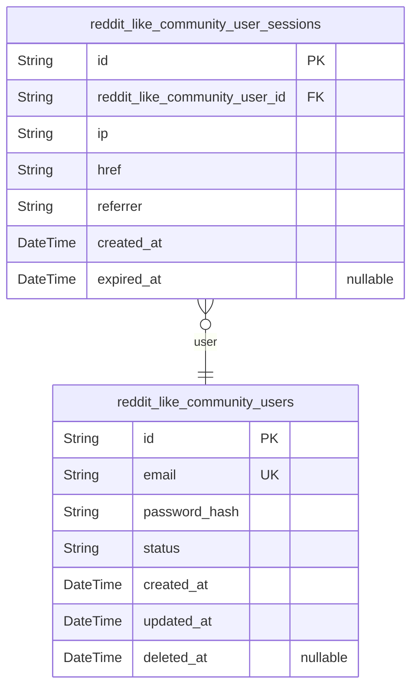
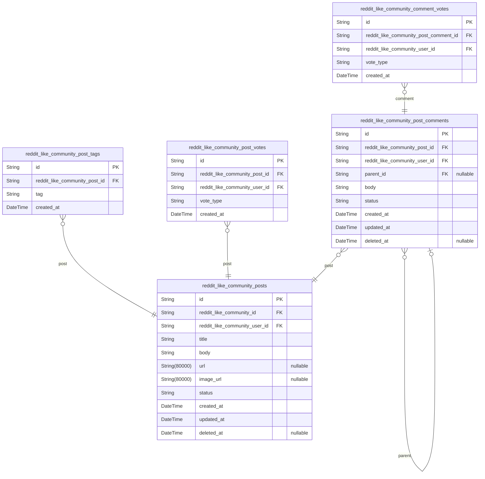
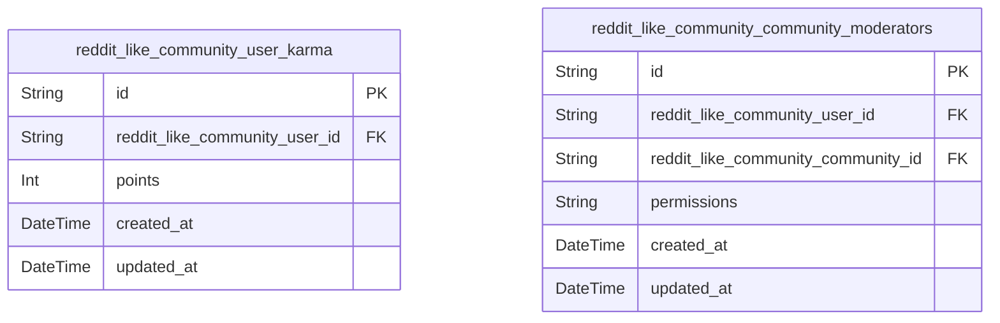
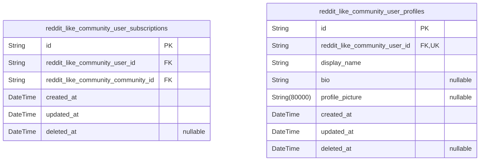
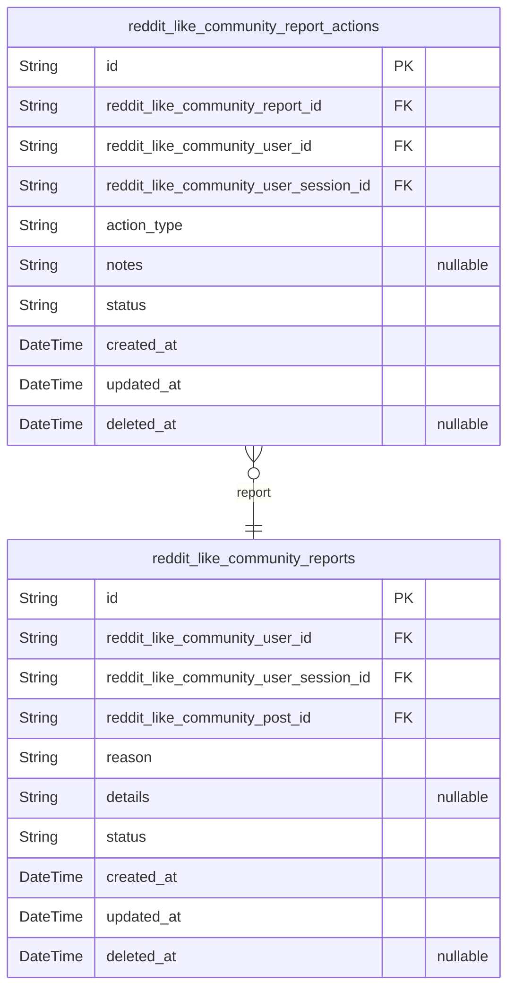

# Prisma Markdown

> Generated by [`prisma-markdown`](https://github.com/samchon/prisma-markdown)

- [Actors](#actors)
- [Content](#content)
- [Moderation](#moderation)
- [Profiles](#profiles)
- [Reporting](#reporting)

## Actors

```mermaid
erDiagram
"reddit_like_community_users" {
  String id PK
  String email UK
  String password_hash
  String status
  DateTime created_at
  DateTime updated_at
  DateTime deleted_at "nullable"
}
"reddit_like_community_user_sessions" {
  String id PK
  String reddit_like_community_user_id FK
  String ip
  String href
  String referrer
  DateTime created_at
  DateTime expired_at "nullable"
}
"reddit_like_community_user_sessions" }o--|| "reddit_like_community_users" : user
```

### `reddit_like_community_users`

User accounts for the Reddit-like community platform.

Stores essential user information for authentication and identity
management.
Each user has a unique email address and password hash for secure login.
Additional fields track account status and timestamps for auditing purposes.

This model serves as the foundation for all user-related operations and
relationships within the platform.

Properties as follows:

- `id`: Primary Key.
- `email`
  > User's email address for authentication and communication. Must be unique
  > across all users.
- `password_hash`
  > Hashed password for secure authentication. Never store plain text
  > passwords.
- `status`
  > Current account status. Valid values: active, inactive, suspended.
  > Defaults to active.
- `created_at`: Timestamp when the user account was created.
- `updated_at`: Timestamp when the user account was last updated.
- `deleted_at`
  > Timestamp when the user account was soft-deleted. Null if account is
  > active.

### `reddit_like_community_user_sessions`

User session records for tracking active user sessions.

Stores information about active user sessions including connection
details and timestamps.
Each session is associated with a specific user account and contains
information
about the connection context for security and auditing purposes.

This model supports session management and provides audit trails for user
activities.

Properties as follows:

- `id`: Primary Key.
- `reddit_like_community_user_id`
  > User account associated with this session. {@link
  > reddit_like_community_users.id}
- `ip`: IP address of the client device used to establish the session.
- `href`: Connection URL where the session was established.
- `referrer`: Referrer URL that led to the session establishment.
- `created_at`: Timestamp when the session was created.
- `expired_at`
  > Timestamp when the session expired or was terminated. Null if session is
  > active.

## Content

```mermaid
erDiagram
"reddit_like_community_posts" {
  String id PK
  String reddit_like_community_id FK
  String reddit_like_community_user_id FK
  String title
  String body
  String(80000) url "nullable"
  String(80000) image_url "nullable"
  String status
  DateTime created_at
  DateTime updated_at
  DateTime deleted_at "nullable"
}
"reddit_like_community_post_tags" {
  String id PK
  String reddit_like_community_post_id FK
  String tag
  DateTime created_at
}
"reddit_like_community_post_votes" {
  String id PK
  String reddit_like_community_post_id FK
  String reddit_like_community_user_id FK
  String vote_type
  DateTime created_at
}
"reddit_like_community_post_comments" {
  String id PK
  String reddit_like_community_post_id FK
  String reddit_like_community_user_id FK
  String parent_id FK "nullable"
  String body
  String status
  DateTime created_at
  DateTime updated_at
  DateTime deleted_at "nullable"
}
"reddit_like_community_comment_votes" {
  String id PK
  String reddit_like_community_post_comment_id FK
  String reddit_like_community_user_id FK
  String vote_type
  DateTime created_at
}
"reddit_like_community_post_tags" }o--|| "reddit_like_community_posts" : post
"reddit_like_community_post_votes" }o--|| "reddit_like_community_posts" : post
"reddit_like_community_post_comments" }o--|| "reddit_like_community_posts" : post
"reddit_like_community_post_comments" }o--o| "reddit_like_community_post_comments" : parent
"reddit_like_community_comment_votes" }o--|| "reddit_like_community_post_comments" : comment
```

### `reddit_like_community_posts`

User-generated content posts in communities.

Stores text, links, or images shared by community members. Each post
belongs to a specific community and is created by an authenticated user.
Posts can be categorized with tags, voted on, and commented on. The
content includes title, body, and optional URL or image reference. Posts
have a status indicating their current state (active, locked, deleted)
and track creation, modification, and deletion timestamps.

Properties as follows:

- `id`: Primary Key.
- `reddit_like_community_id`
  > Community where this post is published. {@link
  > reddit_like_community_communities.id}
- `reddit_like_community_user_id`: User who created this post. [reddit_like_community_users.id](#reddit_like_community_users)
- `title`: Title of the post.
- `body`: Main content of the post.
- `url`: URL for link posts.
- `image_url`: URL for image posts.
- `status`: Current status of the post (active, locked, deleted).
- `created_at`: When the post was created.
- `updated_at`: When the post was last updated.
- `deleted_at`: When the post was deleted (soft delete).

### `reddit_like_community_post_tags`

Tags associated with community posts.

Enables categorization and discovery of posts. Each tag is a keyword that
helps users find relevant content. Tags are created by community members
and associated with specific posts. The system maintains a count of how
many times each tag is used across all posts.

Properties as follows:

- `id`: Primary Key.
- `reddit_like_community_post_id`: Post this tag is associated with. [reddit_like_community_posts.id](#reddit_like_community_posts)
- `tag`: Tag keyword.
- `created_at`: When the tag was created.

### `reddit_like_community_post_votes`

Votes cast on community posts.

Tracks user engagement and content quality. Each vote represents a user's
preference for a post, either upvote or downvote. Votes are associated
with specific posts and users. The system maintains a count of upvotes
and downvotes for each post to determine its popularity and ranking.

Properties as follows:

- `id`: Primary Key.
- `reddit_like_community_post_id`: Post being voted on. [reddit_like_community_posts.id](#reddit_like_community_posts)
- `reddit_like_community_user_id`: User casting the vote. [reddit_like_community_users.id](#reddit_like_community_users)
- `vote_type`: Type of vote (upvote, downvote).
- `created_at`: When the vote was cast.

### `reddit_like_community_post_comments`

Comments on community posts.

Enables discussions and engagement around posts. Each comment is a
response to a post and can be replied to, voted on, and moderated.
Comments are created by community members and associated with specific
posts. The system tracks the comment's status and timestamps for
management and auditing purposes.

Properties as follows:

- `id`: Primary Key.
- `reddit_like_community_post_id`
  > Post this comment is associated with. {@link
  > reddit_like_community_posts.id}
- `reddit_like_community_user_id`: User who created this comment. [reddit_like_community_users.id](#reddit_like_community_users)
- `parent_id`
  > Parent comment for nested replies. {@link
  > reddit_like_community_post_comments.id}
- `body`: Content of the comment.
- `status`: Current status of the comment (active, deleted).
- `created_at`: When the comment was created.
- `updated_at`: When the comment was last updated.
- `deleted_at`: When the comment was deleted (soft delete).

### `reddit_like_community_comment_votes`

Votes cast on post comments.

Tracks user engagement and comment quality. Each vote represents a user's
preference for a comment, either upvote or downvote. Votes are associated
with specific comments and users. The system maintains a count of upvotes
and downvotes for each comment to determine its popularity and ranking.

Properties as follows:

- `id`: Primary Key.
- `reddit_like_community_post_comment_id`: Comment being voted on. [reddit_like_community_post_comments.id](#reddit_like_community_post_comments)
- `reddit_like_community_user_id`: User casting the vote. [reddit_like_community_users.id](#reddit_like_community_users)
- `vote_type`: Type of vote (upvote, downvote).
- `created_at`: When the vote was cast.

## Moderation

```mermaid
erDiagram
"reddit_like_community_user_karma" {
  String id PK
  String reddit_like_community_user_id FK
  Int points
  DateTime created_at
  DateTime updated_at
}
"reddit_like_community_community_moderators" {
  String id PK
  String reddit_like_community_user_id FK
  String reddit_like_community_community_id FK
  String permissions
  DateTime created_at
  DateTime updated_at
}
```

### `reddit_like_community_user_karma`

User karma tracking for community engagement metrics.

Tracks user engagement through karma points earned from voting and
participation.
Each record represents a user's karma score at a specific point in time.
Karma points influence user privileges and visibility within communities.

Users can view their karma history and compare with others.
Karma points are calculated based on upvotes, downvotes, and participation.
The system maintains a historical record of karma changes for
accountability.

This table supports the platform's reputation system and encourages positive
behavior through visible engagement metrics.

Properties as follows:

- `id`: Primary Key.
- `reddit_like_community_user_id`: User who earned this karma. [reddit_like_community_users.id](#reddit_like_community_users).
- `points`: Total karma points earned by the user.
- `created_at`: Timestamp when this karma record was created.
- `updated_at`: Timestamp when this karma record was last updated.

### `reddit_like_community_community_moderators`

Community moderator assignments and permissions.

Tracks which users have moderator privileges for specific communities.
Each record represents a user's moderator status within a community.
Moderators have additional permissions to manage content and enforce rules.

Moderators can approve/reject posts, remove inappropriate content, and
manage community settings. The system tracks moderator assignments for
accountability and transparency.

This table supports community governance and helps maintain a positive
environment through designated moderators.

Properties as follows:

- `id`: Primary Key.
- `reddit_like_community_user_id`: User who has moderator privileges. [reddit_like_community_users.id](#reddit_like_community_users).
- `reddit_like_community_community_id`
  > Community where this user has moderator privileges. {@link
  > reddit_like_community_communities.id}.
- `permissions`: JSON string representing moderator permissions for this community.
- `created_at`: Timestamp when this moderator assignment was created.
- `updated_at`: Timestamp when this moderator assignment was last updated.

## Profiles

```mermaid
erDiagram
"reddit_like_community_user_subscriptions" {
  String id PK
  String reddit_like_community_user_id FK
  String reddit_like_community_community_id FK
  DateTime created_at
  DateTime updated_at
  DateTime deleted_at "nullable"
}
"reddit_like_community_user_profiles" {
  String id PK
  String reddit_like_community_user_id FK,UK
  String display_name
  String bio "nullable"
  String(80000) profile_picture "nullable"
  DateTime created_at
  DateTime updated_at
  DateTime deleted_at "nullable"
}
```

### `reddit_like_community_user_subscriptions`

User subscriptions to communities.

Tracks which users are subscribed to which communities. Each subscription
record links a user to a community and captures the subscription creation
time. This allows users to receive updates on new posts in their subscribed
communities.

Users can have multiple subscriptions to different communities, and
communities can have multiple subscribers. The subscription relationship
is many-to-many between users and communities.

The subscription table serves as a junction table to implement this
many-to-many relationship between users and communities.

Properties as follows:

- `id`: Primary Key.
- `reddit_like_community_user_id`
  > User who subscribed to the community. {@link
  > reddit_like_community_users.id}.
- `reddit_like_community_community_id`
  > Community to which the user subscribed. {@link
  > reddit_like_community_communities.id}.
- `created_at`: When the user subscribed to the community.
- `updated_at`: When the subscription record was last updated.
- `deleted_at`: When the subscription was deleted (soft delete).

### `reddit_like_community_user_profiles`

User profile information.

Stores user-specific profile data including display name, bio, and profile
picture. Each user has exactly one profile record that contains their
personal information and preferences.

The profile information is displayed on the user's profile page and
appears alongside their posts and comments. Users can edit their profile
information to update their personal details and preferences.

The profile table serves as a one-to-one relationship with the users table,
containing additional user-specific information that doesn't belong in the
core user authentication table.

Properties as follows:

- `id`: Primary Key.
- `reddit_like_community_user_id`: User who owns this profile. [reddit_like_community_users.id](#reddit_like_community_users).
- `display_name`: Name displayed on the user's profile and posts.
- `bio`: User's self-description or biography.
- `profile_picture`: URL to the user's profile picture image.
- `created_at`: When the user profile was created.
- `updated_at`: When the profile information was last updated.
- `deleted_at`: When the profile was deleted (soft delete).

## Reporting

```mermaid
erDiagram
"reddit_like_community_reports" {
  String id PK
  String reddit_like_community_user_id FK
  String reddit_like_community_user_session_id FK
  String reddit_like_community_post_id FK
  String reason
  String details "nullable"
  String status
  DateTime created_at
  DateTime updated_at
  DateTime deleted_at "nullable"
}
"reddit_like_community_report_actions" {
  String id PK
  String reddit_like_community_report_id FK
  String reddit_like_community_user_id FK
  String reddit_like_community_user_session_id FK
  String action_type
  String notes "nullable"
  String status
  DateTime created_at
  DateTime updated_at
  DateTime deleted_at "nullable"
}
"reddit_like_community_report_actions" }o--|| "reddit_like_community_reports" : report
```

### `reddit_like_community_reports`

User-generated reports of inappropriate content in communities.

Stores reports created by users about content that violates community
guidelines. Each report references the specific content being reported
and the user who created the report. Reports can have multiple actions
taken by moderators, and each report has a status indicating its current
state in the moderation process.

Soft deletion is supported to maintain audit trails while allowing
content moderation.

Properties as follows:

- `id`: Primary Key.
- `reddit_like_community_user_id`: User who created the report. [reddit_like_community_users.id](#reddit_like_community_users)
- `reddit_like_community_user_session_id`
  > Session used when creating the report. {@link
  > reddit_like_community_user_sessions.id}
- `reddit_like_community_post_id`: Post being reported. [reddit_like_community_posts.id](#reddit_like_community_posts)
- `reason`: Reason for the report selected by the user.
- `details`: Additional details provided by the user about the report.
- `status`: Current status of the report. Valid values: pending, reviewed, resolved.
- `created_at`: When the report was created.
- `updated_at`: When the report was last updated.
- `deleted_at`: When the report was soft-deleted.

### `reddit_like_community_report_actions`

Moderator actions taken on reported content.

Stores actions taken by moderators on reported content. Each action
references the specific report it addresses and the moderator who took
the action. Actions include the type of action taken, any notes from the
moderator, and the status of the action.

Soft deletion is supported to maintain audit trails while allowing
content moderation.

Properties as follows:

- `id`: Primary Key.
- `reddit_like_community_report_id`
  > Report being addressed by this action. {@link
  > reddit_like_community_reports.id}
- `reddit_like_community_user_id`: Moderator who took the action. [reddit_like_community_users.id](#reddit_like_community_users)
- `reddit_like_community_user_session_id`
  > Session used when taking the action. {@link
  > reddit_like_community_user_sessions.id}
- `action_type`: Type of action taken. Valid values: warning, removal, ban.
- `notes`: Additional notes from the moderator about the action.
- `status`: Current status of the action. Valid values: pending, completed.
- `created_at`: When the action was created.
- `updated_at`: When the action was last updated.
- `deleted_at`: When the action was soft-deleted.
