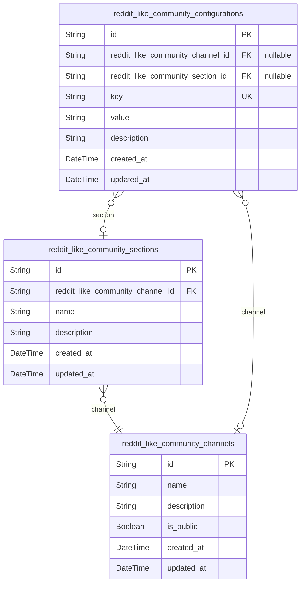
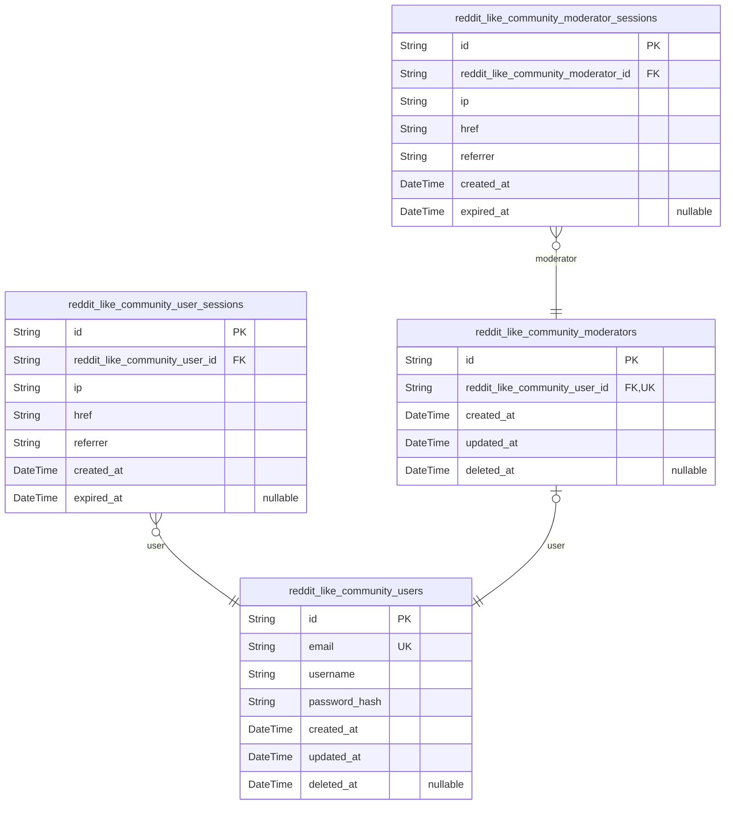
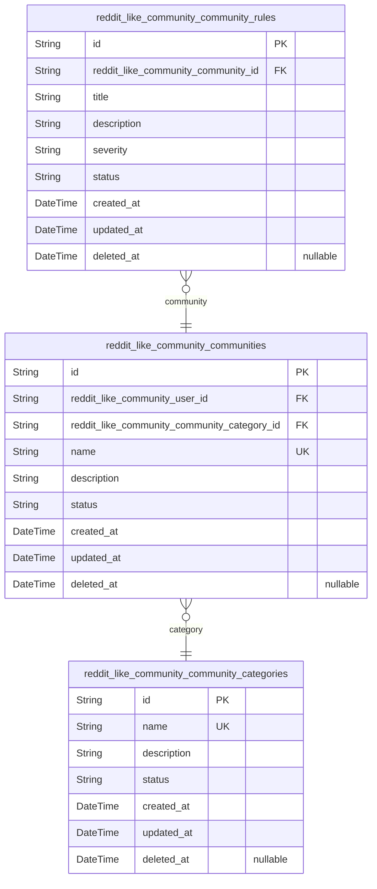
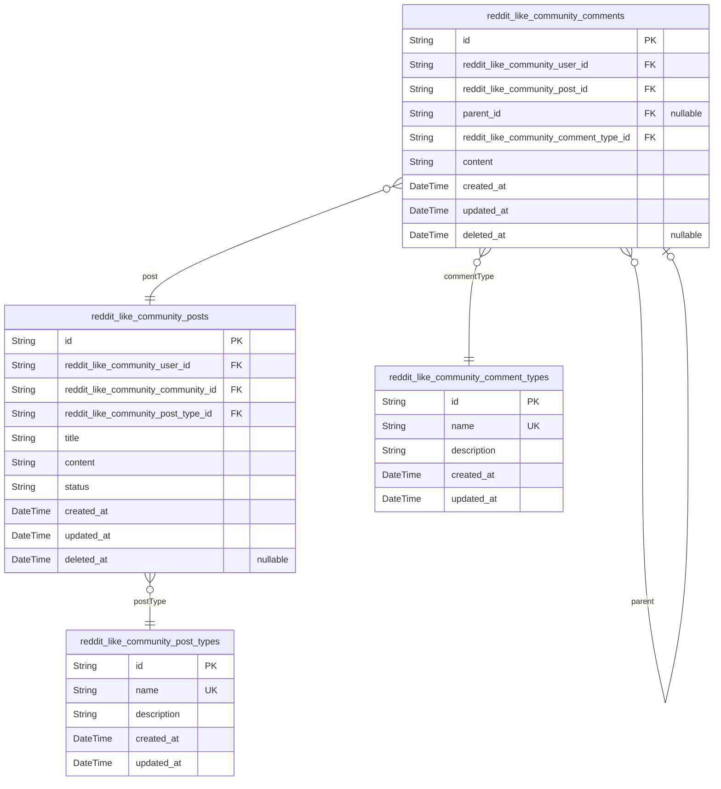
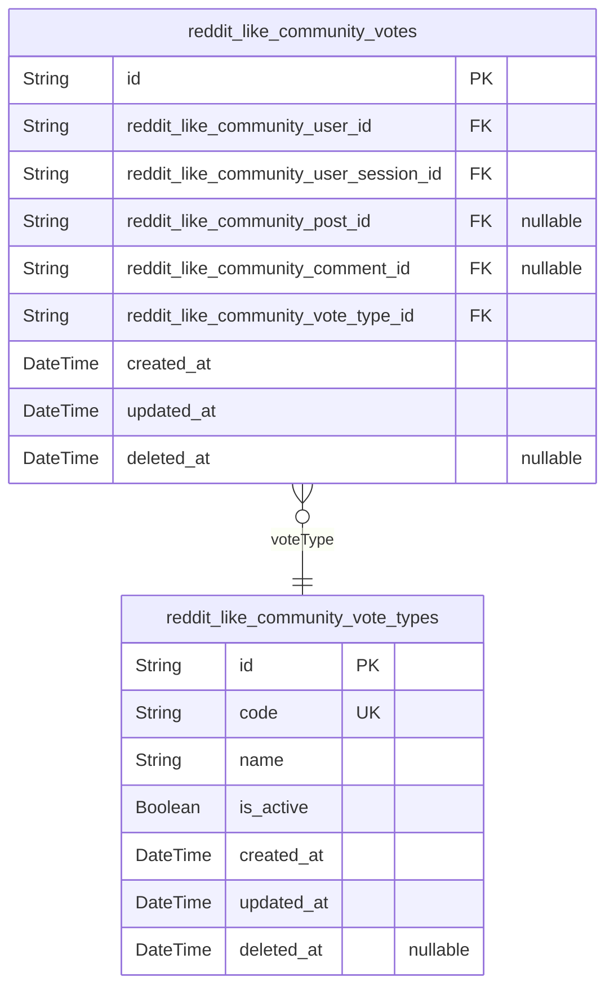
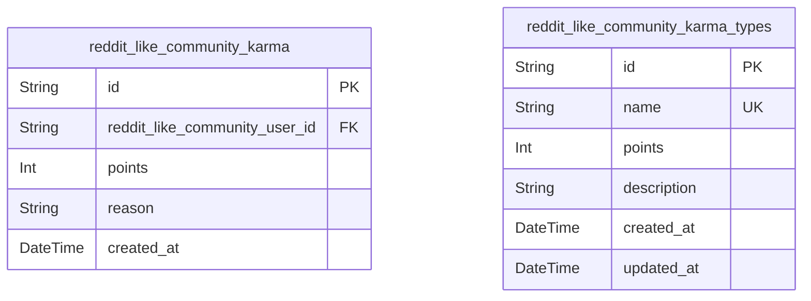
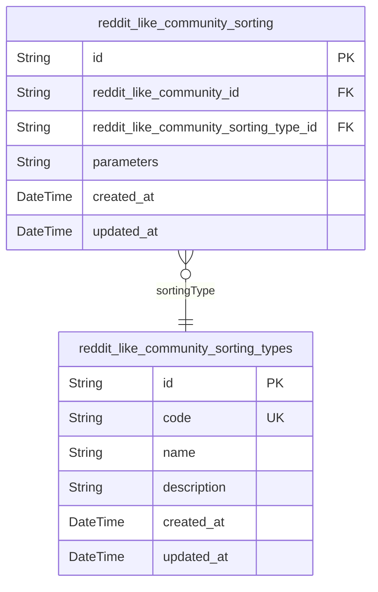
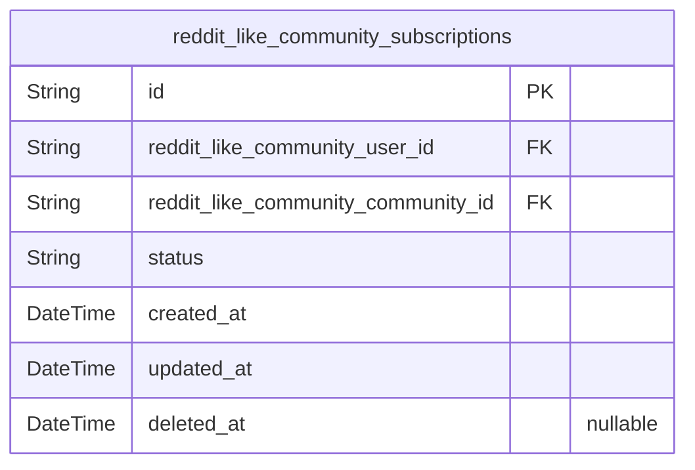
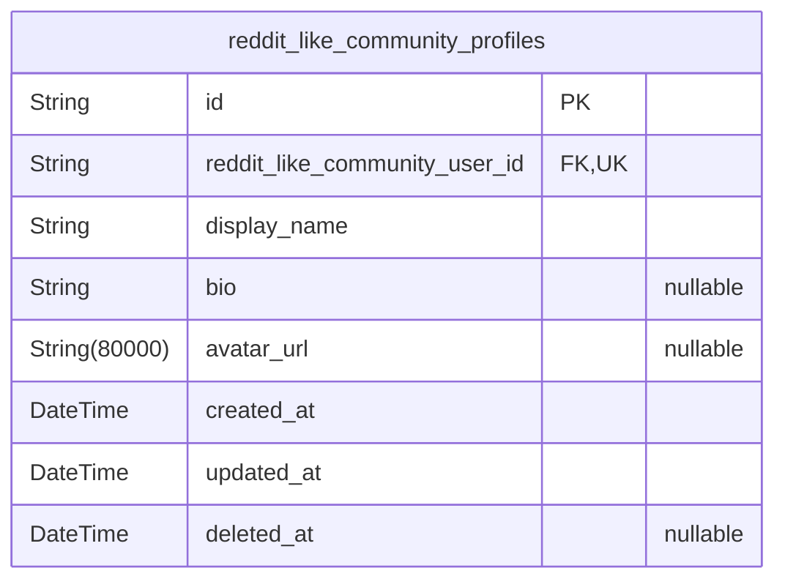
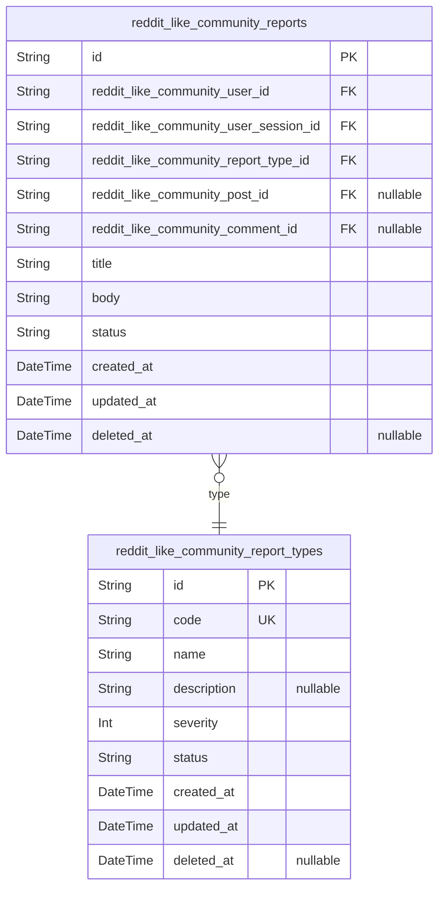

# Prisma Markdown

> Generated by [`prisma-markdown`](https://github.com/samchon/prisma-markdown)

- [Systematic](#systematic)
- [Actors](#actors)
- [Communities](#communities)
- [Content](#content)
- [Voting](#voting)
- [Karma](#karma)
- [Sorting](#sorting)
- [Subscriptions](#subscriptions)
- [Profiles](#profiles)
- [Reporting](#reporting)

## Systematic

```mermaid
erDiagram
"reddit_like_community_channels" {
  String id PK
  String name
  String description
  Boolean is_public
  DateTime created_at
  DateTime updated_at
}
"reddit_like_community_sections" {
  String id PK
  String reddit_like_community_channel_id FK
  String name
  String description
  DateTime created_at
  DateTime updated_at
}
"reddit_like_community_configurations" {
  String id PK
  String reddit_like_community_channel_id FK "nullable"
  String reddit_like_community_section_id FK "nullable"
  String key UK
  String value
  String description
  DateTime created_at
  DateTime updated_at
}
"reddit_like_community_sections" }o--|| "reddit_like_community_channels" : channel
"reddit_like_community_configurations" }o--o| "reddit_like_community_channels" : channel
"reddit_like_community_configurations" }o--o| "reddit_like_community_sections" : section
```

### `reddit_like_community_channels`

Core community channels where users engage with content.

Represents the main categories or topics that users can join and
participate in.
Each channel has a unique name and description that defines its purpose and
content focus. Channels can be public or private, and users can subscribe to
multiple channels to follow their interests.

Channels serve as the primary organizational structure for content on the
platform, grouping related discussions and resources together. They
provide a
structured way for users to discover and engage with content based on their
interests and preferences.

Channels are created by community moderators and administrators, and they
can be customized with specific rules and guidelines to ensure a positive
and
engaging environment for users.

Properties as follows:

- `id`: Primary Key.
- `name`
  > The display name of the channel, used for identification and
  > user navigation.
- `description`: A detailed description of the channel's purpose and content focus.
- `is_public`: Indicates whether the channel is publicly visible or private.
- `created_at`: The timestamp when the channel was created.
- `updated_at`: The timestamp when the channel was last updated.

### `reddit_like_community_sections`

Sections within channels that organize content and discussions.

Represents subcategories or topics within a channel that help users navigate
and find relevant content. Sections provide a more granular way to organize
discussions and resources within a channel, making it easier for users to
locate specific topics of interest.

Sections are created by community moderators and can be customized with
specific rules and guidelines to ensure a focused and engaging environment
for users. They can be nested within other sections to create a hierarchical
structure for content organization.

Sections are associated with a specific channel and can be subscribed to by
users to receive updates on new content and discussions within that
section.

Properties as follows:

- `id`: Primary Key.
- `reddit_like_community_channel_id`
  > The channel that this section belongs to. {@link
  > reddit_like_community_channels.id}
- `name`
  > The display name of the section, used for identification and user
  > navigation.
- `description`: A detailed description of the section's purpose and content focus.
- `created_at`: The timestamp when the section was created.
- `updated_at`: The timestamp when the section was last updated.

### `reddit_like_community_configurations`

System configurations that define platform behavior and settings.

Represents the various settings and parameters that control the behavior of
the platform, such as content moderation rules, user permissions, and
feature toggles. Configurations are used to customize the platform to meet
the specific needs of the community and ensure a positive user experience.

Configurations are managed by administrators and can be updated to reflect
changes in community guidelines, platform policies, or technical
requirements. They provide a centralized way to manage and enforce
platform-wide settings and rules.

Configurations are associated with specific channels or sections to allow
for granular control over platform behavior and settings. They can be
customized to meet the unique needs of different communities and ensure a
consistent and engaging environment for users.

Properties as follows:

- `id`: Primary Key.
- `reddit_like_community_channel_id`
  > The channel that this configuration applies to. {@link
  > reddit_like_community_channels.id}
- `reddit_like_community_section_id`
  > The section that this configuration applies to. {@link
  > reddit_like_community_sections.id}
- `key`: The unique identifier for the configuration setting.
- `value`: The value of the configuration setting.
- `description`: A detailed description of the configuration setting and its purpose.
- `created_at`: The timestamp when the configuration was created.
- `updated_at`: The timestamp when the configuration was last updated.

## Actors

```mermaid
erDiagram
"reddit_like_community_users" {
  String id PK
  String email UK
  String username
  String password_hash
  DateTime created_at
  DateTime updated_at
  DateTime deleted_at "nullable"
}
"reddit_like_community_user_sessions" {
  String id PK
  String reddit_like_community_user_id FK
  String ip
  String href
  String referrer
  DateTime created_at
  DateTime expired_at "nullable"
}
"reddit_like_community_moderators" {
  String id PK
  String reddit_like_community_user_id FK,UK
  DateTime created_at
  DateTime updated_at
  DateTime deleted_at "nullable"
}
"reddit_like_community_moderator_sessions" {
  String id PK
  String reddit_like_community_moderator_id FK
  String ip
  String href
  String referrer
  DateTime created_at
  DateTime expired_at "nullable"
}
"reddit_like_community_user_sessions" }o--|| "reddit_like_community_users" : user
"reddit_like_community_moderators" |o--|| "reddit_like_community_users" : user
"reddit_like_community_moderator_sessions" }o--|| "reddit_like_community_moderators" : moderator
```

### `reddit_like_community_users`

User accounts for the community platform. Stores authentication
information and user profiles. Each user has a unique email address and
username. Users can create communities, post content, and engage with
other users. Soft deletion is supported to maintain audit trails while
allowing account recovery.

Properties as follows:

- `id`: Primary Key.
- `email`
  > User's email address for authentication and communication. Must be unique
  > across all users.
- `username`: User's chosen display name. Must be unique across all users.
- `password_hash`: Hashed password for user authentication. Never stored in plain text.
- `created_at`: Timestamp when the user account was created.
- `updated_at`: Timestamp when the user account was last updated.
- `deleted_at`
  > Timestamp when the user account was soft-deleted. Null if the account is
  > active.

### `reddit_like_community_user_sessions`

User session tracking for the community platform. Stores information
about active user sessions including IP address, connection details, and
session duration. Each session is associated with a specific user
account. Soft deletion is not supported as sessions are temporary and not
recoverable.

Properties as follows:

- `id`: Primary Key.
- `reddit_like_community_user_id`
  > The user associated with this session. {@link
  > reddit_like_community_users.id}
- `ip`: IP address from which the session was initiated.
- `href`: URL of the page where the session was initiated.
- `referrer`: Referrer URL that led to the session initiation.
- `created_at`: Timestamp when the session was created.
- `expired_at`: Timestamp when the session expired or was terminated.

### `reddit_like_community_moderators`

Moderator accounts for the community platform. Stores information about
users who have moderator privileges. Each moderator is associated with a
specific user account. Moderators can manage communities, moderate
content, and handle reports. Soft deletion is supported to maintain audit
trails while allowing account recovery.

Properties as follows:

- `id`: Primary Key.
- `reddit_like_community_user_id`
  > The user account associated with this moderator. {@link
  > reddit_like_community_users.id}
- `created_at`: Timestamp when the moderator privileges were granted.
- `updated_at`: Timestamp when the moderator privileges were last updated.
- `deleted_at`
  > Timestamp when the moderator privileges were revoked. Null if the
  > privileges are active.

### `reddit_like_community_moderator_sessions`

Moderator session tracking for the community platform. Stores information
about active moderator sessions including IP address, connection details,
and session duration. Each session is associated with a specific
moderator account. Soft deletion is not supported as sessions are
temporary and not recoverable.

Properties as follows:

- `id`: Primary Key.
- `reddit_like_community_moderator_id`
  > The moderator associated with this session. {@link
  > reddit_like_community_moderators.id}
- `ip`: IP address from which the session was initiated.
- `href`: URL of the page where the session was initiated.
- `referrer`: Referrer URL that led to the session initiation.
- `created_at`: Timestamp when the session was created.
- `expired_at`: Timestamp when the session expired or was terminated.

## Communities

```mermaid
erDiagram
"reddit_like_community_communities" {
  String id PK
  String reddit_like_community_user_id FK
  String reddit_like_community_community_category_id FK
  String name UK
  String description
  String status
  DateTime created_at
  DateTime updated_at
  DateTime deleted_at "nullable"
}
"reddit_like_community_community_rules" {
  String id PK
  String reddit_like_community_community_id FK
  String title
  String description
  String severity
  String status
  DateTime created_at
  DateTime updated_at
  DateTime deleted_at "nullable"
}
"reddit_like_community_community_categories" {
  String id PK
  String name UK
  String description
  String status
  DateTime created_at
  DateTime updated_at
  DateTime deleted_at "nullable"
}
"reddit_like_community_communities" }o--|| "reddit_like_community_community_categories" : category
"reddit_like_community_community_rules" }o--|| "reddit_like_community_communities" : community
```

### `reddit_like_community_communities`

Core community entity representing a discussion space on the platform.

Communities are the primary organizational units where users can create
posts, engage in discussions, and build around shared interests. Each
community has a unique name, description, and set of rules that govern
content creation and behavior.

Communities can be categorized for easier discovery and are managed by
moderators who enforce community guidelines. The status field tracks
whether the community is active, pending approval, or suspended.

Soft deletion is supported to allow for content moderation and audit
trails while maintaining historical records of community activity.

Properties as follows:

- `id`: Primary Key.
- `reddit_like_community_user_id`: Creator of the community. [reddit_like_community_users.id](#reddit_like_community_users)
- `reddit_like_community_community_category_id`
  > Category to which the community belongs. {@link
  > reddit_like_community_community_categories.id}
- `name`: Unique name of the community. Used for URL paths and display purposes.
- `description`: Detailed description of the community's purpose and guidelines.
- `status`: Current status of the community. Valid values: active, pending, suspended.
- `created_at`: Timestamp when the community was created.
- `updated_at`: Timestamp when the community was last updated.
- `deleted_at`: Timestamp when the community was deleted (soft delete).

### `reddit_like_community_community_rules`

Rules and guidelines that govern content creation and behavior within a
community.

Community rules define the standards and expectations for content
creation, moderation, and user behavior. Each rule has a title,
description, and may have associated severity levels that determine how
violations are handled.

Rules are associated with specific communities and can be updated by
moderators to adapt to changing community needs. The status field tracks
whether the rule is active, pending review, or deprecated.

Soft deletion is supported to maintain historical records of rule changes
while allowing for content moderation and audit trails.

Properties as follows:

- `id`: Primary Key.
- `reddit_like_community_community_id`
  > Community to which the rule belongs. {@link
  > reddit_like_community_communities.id}
- `title`: Title of the rule.
- `description`: Detailed description of the rule and its purpose.
- `severity`: Severity level of the rule. Valid values: low, medium, high.
- `status`: Current status of the rule. Valid values: active, pending, deprecated.
- `created_at`: Timestamp when the rule was created.
- `updated_at`: Timestamp when the rule was last updated.
- `deleted_at`: Timestamp when the rule was deleted (soft delete).

### `reddit_like_community_community_categories`

Categories that classify communities for easier discovery and organization.

Community categories provide a hierarchical structure for organizing
communities based on their topics, interests, or themes. Each category
has a unique name and description that help users understand the scope
and focus of communities within that category.

Categories are used to improve community discoverability and help users
find communities that align with their interests. The status field tracks
whether the category is active, pending review, or deprecated.

Soft deletion is supported to maintain historical records of category
changes while allowing for content moderation and audit trails.

Properties as follows:

- `id`: Primary Key.
- `name`: Unique name of the category. Used for display and filtering purposes.
- `description`: Detailed description of the category and its scope.
- `status`: Current status of the category. Valid values: active, pending, deprecated.
- `created_at`: Timestamp when the category was created.
- `updated_at`: Timestamp when the category was last updated.
- `deleted_at`: Timestamp when the category was deleted (soft delete).

## Content

```mermaid
erDiagram
"reddit_like_community_posts" {
  String id PK
  String reddit_like_community_user_id FK
  String reddit_like_community_community_id FK
  String reddit_like_community_post_type_id FK
  String title
  String content
  String status
  DateTime created_at
  DateTime updated_at
  DateTime deleted_at "nullable"
}
"reddit_like_community_comments" {
  String id PK
  String reddit_like_community_user_id FK
  String reddit_like_community_post_id FK
  String parent_id FK "nullable"
  String reddit_like_community_comment_type_id FK
  String content
  DateTime created_at
  DateTime updated_at
  DateTime deleted_at "nullable"
}
"reddit_like_community_post_types" {
  String id PK
  String name UK
  String description
  DateTime created_at
  DateTime updated_at
}
"reddit_like_community_comment_types" {
  String id PK
  String name UK
  String description
  DateTime created_at
  DateTime updated_at
}
"reddit_like_community_posts" }o--|| "reddit_like_community_post_types" : postType
"reddit_like_community_comments" }o--|| "reddit_like_community_posts" : post
"reddit_like_community_comments" }o--o| "reddit_like_community_comments" : parent
"reddit_like_community_comments" }o--|| "reddit_like_community_comment_types" : commentType
```

### `reddit_like_community_posts`

Community posts created by users within specific communities. Each post
belongs to a community and is created by a user. Posts can have different
types and can be upvoted/downvoted by other users. Posts can be pinned or
locked by moderators. Posts can be reported for inappropriate content.
Posts can be sorted by hot, new, top, or controversial.

Properties as follows:

- `id`: Primary Key.
- `reddit_like_community_user_id`: User who created the post. [reddit_like_community_users.id](#reddit_like_community_users)
- `reddit_like_community_community_id`
  > Community where the post was created. {@link
  > reddit_like_community_communities.id}
- `reddit_like_community_post_type_id`: Type of the post. [reddit_like_community_post_types.id](#reddit_like_community_post_types)
- `title`: Title of the post.
- `content`: Content of the post.
- `status`: Status of the post (active, locked, pinned).
- `created_at`: Timestamp when the post was created.
- `updated_at`: Timestamp when the post was last updated.
- `deleted_at`: Timestamp when the post was deleted (soft delete).

### `reddit_like_community_comments`

Comments created by users on posts within communities. Each comment
belongs to a post and is created by a user. Comments can be
upvoted/downvoted by other users. Comments can be reported for
inappropriate content. Comments can be nested under other comments.

Properties as follows:

- `id`: Primary Key.
- `reddit_like_community_user_id`: User who created the comment. [reddit_like_community_users.id](#reddit_like_community_users)
- `reddit_like_community_post_id`: Post where the comment was created. [reddit_like_community_posts.id](#reddit_like_community_posts)
- `parent_id`
  > Parent comment if this is a nested reply. {@link
  > reddit_like_community_comments.id}
- `reddit_like_community_comment_type_id`: Type of the comment. [reddit_like_community_comment_types.id](#reddit_like_community_comment_types)
- `content`: Content of the comment.
- `created_at`: Timestamp when the comment was created.
- `updated_at`: Timestamp when the comment was last updated.
- `deleted_at`: Timestamp when the comment was deleted (soft delete).

### `reddit_like_community_post_types`

Types of posts that can be created within communities. Each post type has
a unique identifier and a name. Post types are used to categorize posts
within communities.

Properties as follows:

- `id`: Primary Key.
- `name`: Name of the post type.
- `description`: Description of the post type.
- `created_at`: Timestamp when the post type was created.
- `updated_at`: Timestamp when the post type was last updated.

### `reddit_like_community_comment_types`

Types of comments that can be created on posts within communities. Each
comment type has a unique identifier and a name. Comment types are used
to categorize comments within communities.

Properties as follows:

- `id`: Primary Key.
- `name`: Name of the comment type.
- `description`: Description of the comment type.
- `created_at`: Timestamp when the comment type was created.
- `updated_at`: Timestamp when the comment type was last updated.

## Voting

```mermaid
erDiagram
"reddit_like_community_votes" {
  String id PK
  String reddit_like_community_user_id FK
  String reddit_like_community_user_session_id FK
  String reddit_like_community_post_id FK "nullable"
  String reddit_like_community_comment_id FK "nullable"
  String reddit_like_community_vote_type_id FK
  DateTime created_at
  DateTime updated_at
  DateTime deleted_at "nullable"
}
"reddit_like_community_vote_types" {
  String id PK
  String code UK
  String name
  Boolean is_active
  DateTime created_at
  DateTime updated_at
  DateTime deleted_at "nullable"
}
"reddit_like_community_votes" }o--|| "reddit_like_community_vote_types" : voteType
```

### `reddit_like_community_votes`

User votes on posts and comments.

Stores user voting actions on content within communities. Each vote is
associated with a specific user, session, and content item (post or
comment). Votes can be either upvotes or downvotes, and the system tracks
the type of vote through a reference to the vote types table. The vote
entity captures the temporal context of when the vote was cast and
maintains a soft delete capability for audit purposes.

Properties as follows:

- `id`: Primary Key.
- `reddit_like_community_user_id`: User who cast the vote. [reddit_like_community_users.id](#reddit_like_community_users)
- `reddit_like_community_user_session_id`
  > Session during which the vote was cast. {@link
  > reddit_like_community_user_sessions.id}
- `reddit_like_community_post_id`: Post being voted on. [reddit_like_community_posts.id](#reddit_like_community_posts)
- `reddit_like_community_comment_id`: Comment being voted on. [reddit_like_community_comments.id](#reddit_like_community_comments)
- `reddit_like_community_vote_type_id`
  > Type of vote (upvote/downvote). {@link
  > reddit_like_community_vote_types.id}
- `created_at`: When the vote was cast.
- `updated_at`: When the vote was last updated.
- `deleted_at`: When the vote was deleted (soft delete).

### `reddit_like_community_vote_types`

Types of votes available in the system.

Defines the different types of votes that users can cast on content. Each
vote type has a unique code and name, and the system tracks whether the
vote type is active or not. Vote types are used to categorize and manage
different voting behaviors within the platform.

Properties as follows:

- `id`: Primary Key.
- `code`: Unique code identifying the vote type.
- `name`: Display name of the vote type.
- `is_active`: Whether the vote type is currently active and available for use.
- `created_at`: When the vote type was created.
- `updated_at`: When the vote type was last updated.
- `deleted_at`: When the vote type was deleted (soft delete).

## Karma

```mermaid
erDiagram
"reddit_like_community_karma" {
  String id PK
  String reddit_like_community_user_id FK
  Int points
  String reason
  DateTime created_at
}
"reddit_like_community_karma_types" {
  String id PK
  String name UK
  Int points
  String description
  DateTime created_at
  DateTime updated_at
}
```

### `reddit_like_community_karma`

User karma records tracking reputation points earned through platform
activities.

Stores the karma points earned by users through various activities on the
platform.
Each record is associated with a specific user and tracks the points earned,
lost, or gained through different actions. The karma system is designed to
reflect user engagement and contribution levels, with points being awarded
for activities such as posting, commenting, and voting. The system also
allows for the deduction of points for negative actions or violations of
community guidelines. The karma records are used to determine user
reputation, influence, and access to certain features within the platform.

The karma system is an essential component of the platform, as it encourages
positive behavior and discourages negative actions. The system is designed
to be transparent and fair, with clear rules for earning and losing points.
The karma records are stored in a dedicated table to ensure efficient
retrieval and management.

Properties as follows:

- `id`: Primary Key.
- `reddit_like_community_user_id`
  > User who earned or lost karma points. {@link
  > reddit_like_community_users.id}
- `points`
  > Karma points earned or lost by the user. Positive values indicate points
  > earned, while negative values indicate points lost.
- `reason`
  > Reason for earning or losing karma points. Describes the specific action
  > or activity that resulted in the karma change.
- `created_at`
  > Timestamp when the karma record was created. Indicates when the karma
  > points were earned or lost.

### `reddit_like_community_karma_types`

Reference data for different types of karma actions and their point values.

Stores predefined types of karma actions and their corresponding point
values.
Each type represents a specific action or activity that can result in the
earning
or loss of karma points. The types are used to categorize and standardize
the karma system, ensuring consistency and fairness in the distribution of
points. The system allows for the creation of new types as needed, with each
type having a unique identifier, name, and point value. The types are
stored in
a dedicated table to facilitate efficient retrieval and management.

Properties as follows:

- `id`: Primary Key.
- `name`
  > Name of the karma type. Describes the specific action or activity that
  > results in the earning or loss of karma points.
- `points`
  > Point value associated with the karma type. Indicates the number of
  > points earned or lost for the specific action or activity.
- `description`
  > Description of the karma type. Provides additional details about the
  > specific action or activity that results in the earning or loss of karma
  > points.
- `created_at`
  > Timestamp when the karma type was created. Indicates when the type was
  > added to the system.
- `updated_at`
  > Timestamp when the karma type was last updated. Indicates when the type
  > was modified or changed.

## Sorting

```mermaid
erDiagram
"reddit_like_community_sorting" {
  String id PK
  String reddit_like_community_id FK
  String reddit_like_community_sorting_type_id FK
  String parameters
  DateTime created_at
  DateTime updated_at
}
"reddit_like_community_sorting_types" {
  String id PK
  String code UK
  String name
  String description
  DateTime created_at
  DateTime updated_at
}
"reddit_like_community_sorting" }o--|| "reddit_like_community_sorting_types" : sortingType
```

### `reddit_like_community_sorting`

Sorting configurations for community content.

Defines how posts are sorted within communities. Each configuration
specifies a sorting type and its parameters, allowing communities to
customize their content display. Sorting configurations are associated
with specific communities and can be modified by community moderators to
reflect changing community preferences or content types.

Properties as follows:

- `id`: Primary Key.
- `reddit_like_community_id`
  > Community that this sorting configuration belongs to. {@link
  > reddit_like_community_communities.id}
- `reddit_like_community_sorting_type_id`: Type of sorting applied. [reddit_like_community_sorting_types.id](#reddit_like_community_sorting_types)
- `parameters`: JSON string containing sorting parameters specific to the sorting type.
- `created_at`: When this sorting configuration was created.
- `updated_at`: When this sorting configuration was last updated.

### `reddit_like_community_sorting_types`

Types of sorting available for community content.

Defines the different sorting algorithms or methods that can be applied
to community content. Each sorting type has a unique identifier and a
description of how it works. Sorting types are referenced by sorting
configurations to determine how content should be displayed within
communities.

Properties as follows:

- `id`: Primary Key.
- `code`
  > Unique code identifying this sorting type (e.g., 'hot', 'new', 'top',
  > 'controversial').
- `name`: Human-readable name of the sorting type.
- `description`: Detailed explanation of how this sorting type works and what it displays.
- `created_at`: When this sorting type was created.
- `updated_at`: When this sorting type was last updated.

## Subscriptions

```mermaid
erDiagram
"reddit_like_community_subscriptions" {
  String id PK
  String reddit_like_community_user_id FK
  String reddit_like_community_community_id FK
  String status
  DateTime created_at
  DateTime updated_at
  DateTime deleted_at "nullable"
}
```

### `reddit_like_community_subscriptions`

User subscriptions to communities on the Reddit-like platform.

Tracks which users are subscribed to which communities, including the
subscription status and timestamps for audit trails.

This entity forms the foundation for user community engagement and
content discovery. It enables users to follow communities they're
interested in and receive updates about new posts.

The subscription status field tracks whether the subscription is active,
pending, or expired, allowing for proper management of user community
relationships.

Soft delete capability is implemented to maintain audit trails while
allowing users to unsubscribe from communities.

Relationships:
- Belongs to a user ([reddit_like_community_users](#reddit_like_community_users))
- Belongs to a community ([reddit_like_community_communities](#reddit_like_community_communities))

Audit trail fields:
- created_at: When the subscription was created
- updated_at: When the subscription was last modified
- deleted_at: When the subscription was deleted (soft delete)

Status tracking:
- status: Current state of the subscription (active, pending, expired)

Properties as follows:

- `id`: Primary Key.
- `reddit_like_community_user_id`
  > User who subscribed to the community. {@link
  > reddit_like_community_users.id}
- `reddit_like_community_community_id`
  > Community that the user subscribed to. {@link
  > reddit_like_community_communities.id}
- `status`
  > Current status of the subscription. Possible values: active, pending,
  > expired.
- `created_at`: Timestamp when the subscription was created.
- `updated_at`: Timestamp when the subscription was last updated.
- `deleted_at`: Timestamp when the subscription was deleted (soft delete).

## Profiles

```mermaid
erDiagram
"reddit_like_community_profiles" {
  String id PK
  String reddit_like_community_user_id FK,UK
  String display_name
  String bio "nullable"
  String(80000) avatar_url "nullable"
  DateTime created_at
  DateTime updated_at
  DateTime deleted_at "nullable"
}
```

### `reddit_like_community_profiles`

User profile information for community platform users.

Stores user profile details including display name, bio, avatar URL, and
profile creation metadata. Each profile is associated with a specific user
account and contains information that users can share with the community.

Profiles support soft deletion to allow users to temporarily remove their
profile while maintaining audit trails. The profile data is used for user
identification and personalization across the platform.

Properties as follows:

- `id`: Primary Key.
- `reddit_like_community_user_id`
  > The user account associated with this profile. {@link
  > reddit_like_community_users.id}
- `display_name`: The name displayed publicly for the user.
- `bio`: A brief description of the user's interests or background.
- `avatar_url`: URL to the user's profile image.
- `created_at`: When the profile was created.
- `updated_at`: When the profile was last updated.
- `deleted_at`: When the profile was soft-deleted (null if active).

## Reporting

```mermaid
erDiagram
"reddit_like_community_reports" {
  String id PK
  String reddit_like_community_user_id FK
  String reddit_like_community_user_session_id FK
  String reddit_like_community_report_type_id FK
  String reddit_like_community_post_id FK "nullable"
  String reddit_like_community_comment_id FK "nullable"
  String title
  String body
  String status
  DateTime created_at
  DateTime updated_at
  DateTime deleted_at "nullable"
}
"reddit_like_community_report_types" {
  String id PK
  String code UK
  String name
  String description "nullable"
  Int severity
  String status
  DateTime created_at
  DateTime updated_at
  DateTime deleted_at "nullable"
}
"reddit_like_community_reports" }o--|| "reddit_like_community_report_types" : type
```

### `reddit_like_community_reports`

User-generated reports of inappropriate content or behavior in communities.

Stores reports created by users about posts, comments, or other users.
Each report is associated with a specific content item and created by an
authenticated user through their active session. Reports contain a title,
body,
and reason for reporting. The report status tracks the current state of the
reporting process (pending, reviewed, resolved). Soft deletion is supported
to maintain audit trails while allowing content moderation.

Properties as follows:

- `id`: Primary Key.
- `reddit_like_community_user_id`: User who created the report. [reddit_like_community_users.id](#reddit_like_community_users)
- `reddit_like_community_user_session_id`
  > Session used when creating the report. {@link
  > reddit_like_community_user_sessions.id}
- `reddit_like_community_report_type_id`: Type of report. [reddit_like_community_report_types.id](#reddit_like_community_report_types)
- `reddit_like_community_post_id`: Post being reported. [reddit_like_community_posts.id](#reddit_like_community_posts)
- `reddit_like_community_comment_id`: Comment being reported. [reddit_like_community_comments.id](#reddit_like_community_comments)
- `title`: Brief title summarizing the report.
- `body`: Detailed explanation of the reporting issue.
- `status`: Current status of the report (pending, reviewed, resolved).
- `created_at`: When the report was created.
- `updated_at`: When the report was last updated.
- `deleted_at`: When the report was soft-deleted (null if active).

### `reddit_like_community_report_types`

Predefined categories for user reports of inappropriate content.

Stores the types of reports that users can create when flagging content.
Each report type has a unique code and name, and may have a description
and severity level. Report types are used to categorize reports and guide
moderation actions. The type status indicates whether the type is active or
archived. Soft deletion is supported to maintain audit trails while allowing
content moderation.

Properties as follows:

- `id`: Primary Key.
- `code`: Unique code identifying the report type.
- `name`: Display name of the report type.
- `description`: Detailed explanation of what this report type covers.
- `severity`: Severity level of the report type (1-5 scale).
- `status`: Current status of the report type (active, archived).
- `created_at`: When the report type was created.
- `updated_at`: When the report type was last updated.
- `deleted_at`: When the report type was soft-deleted (null if active).
