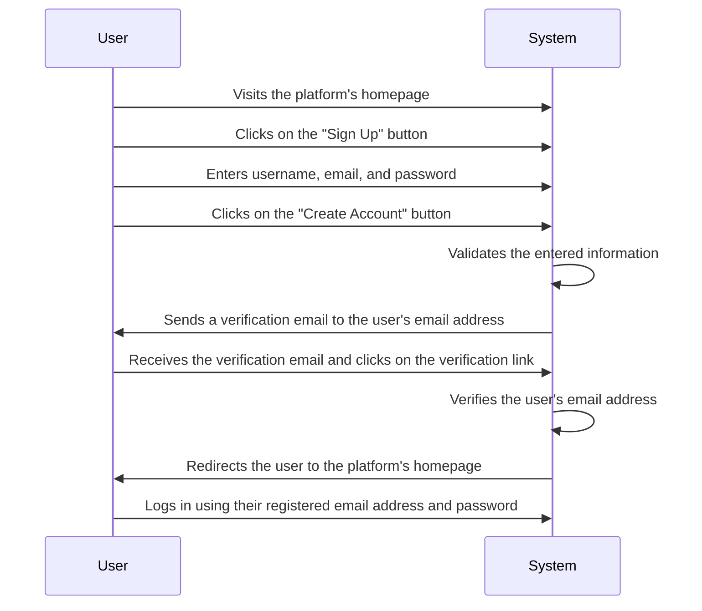
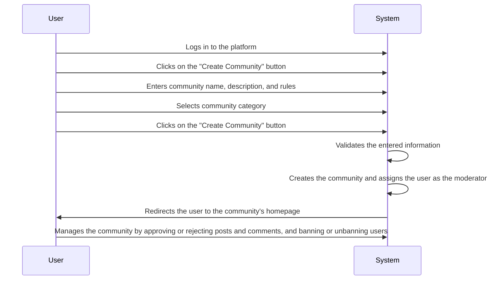
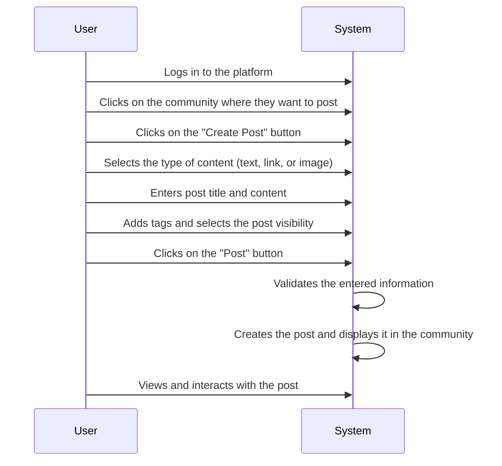
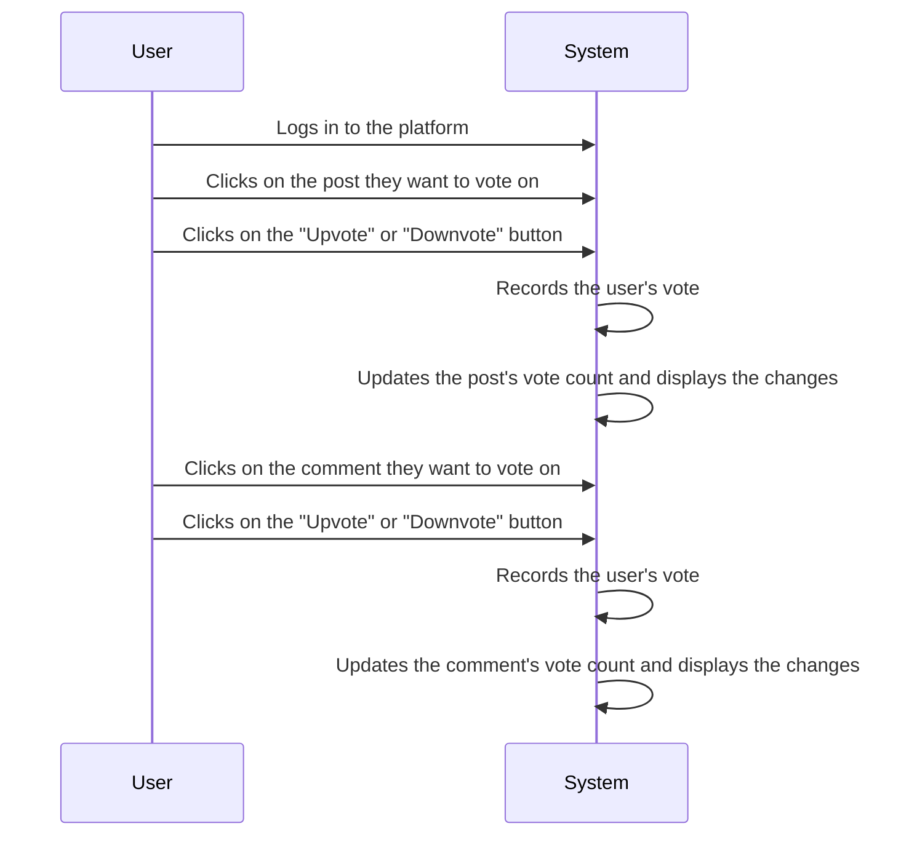
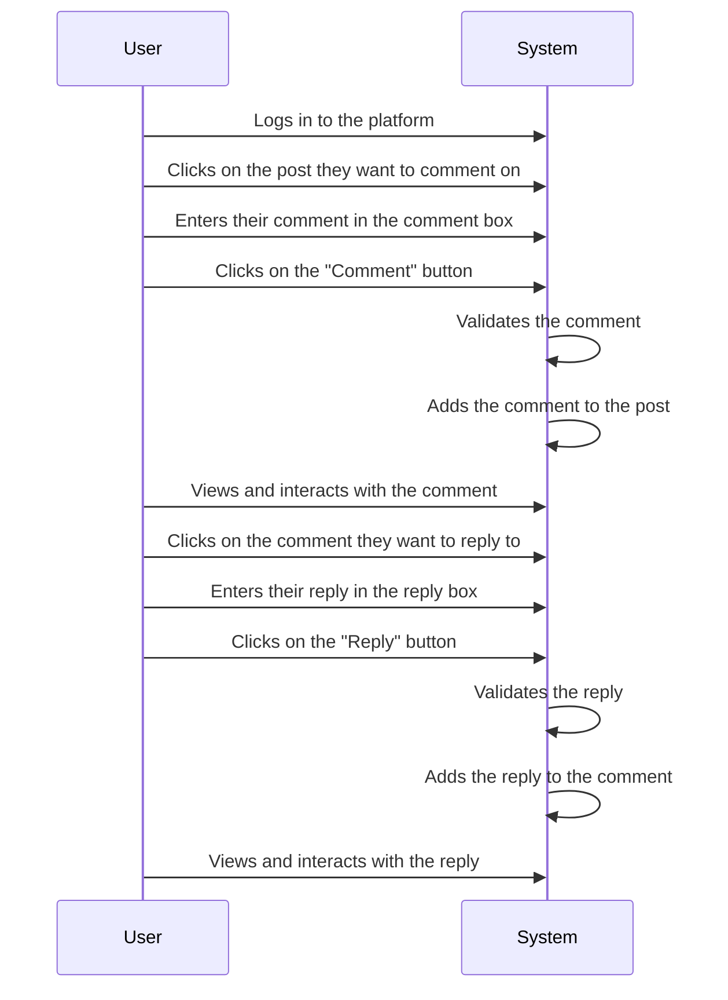
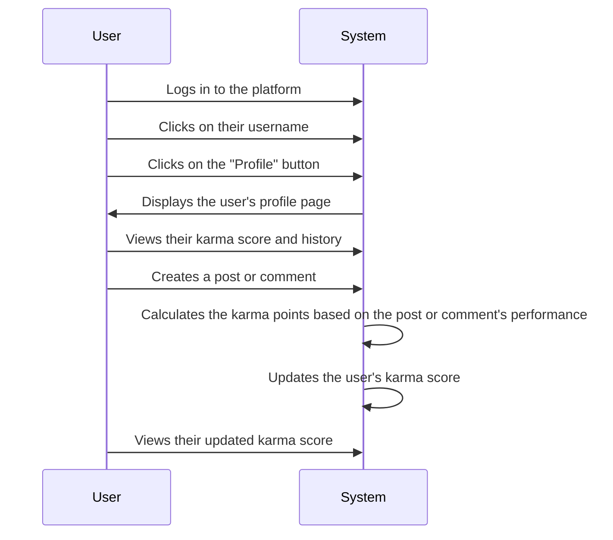
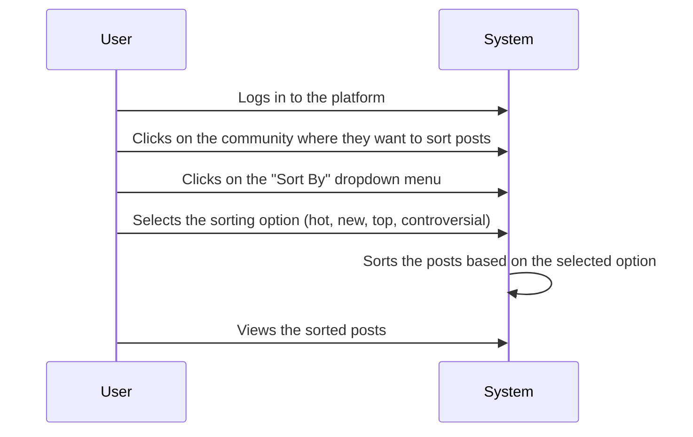
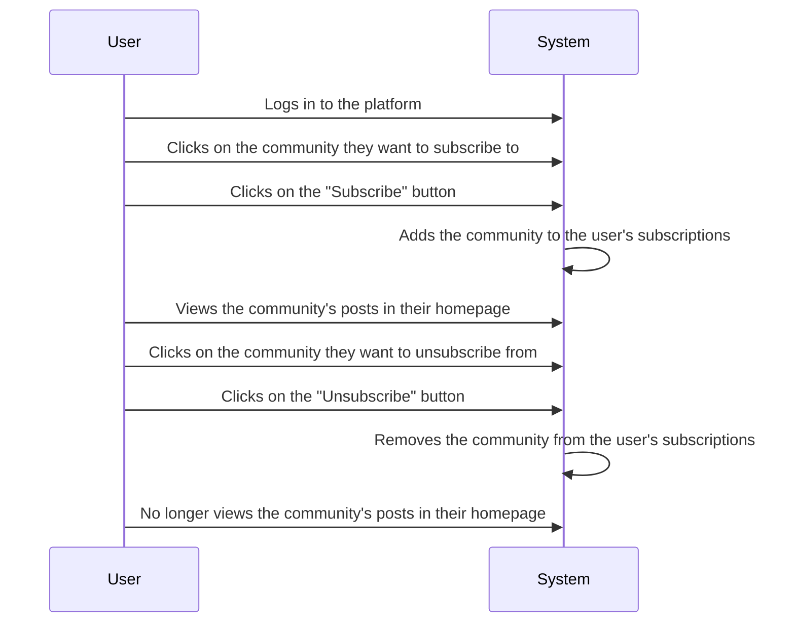
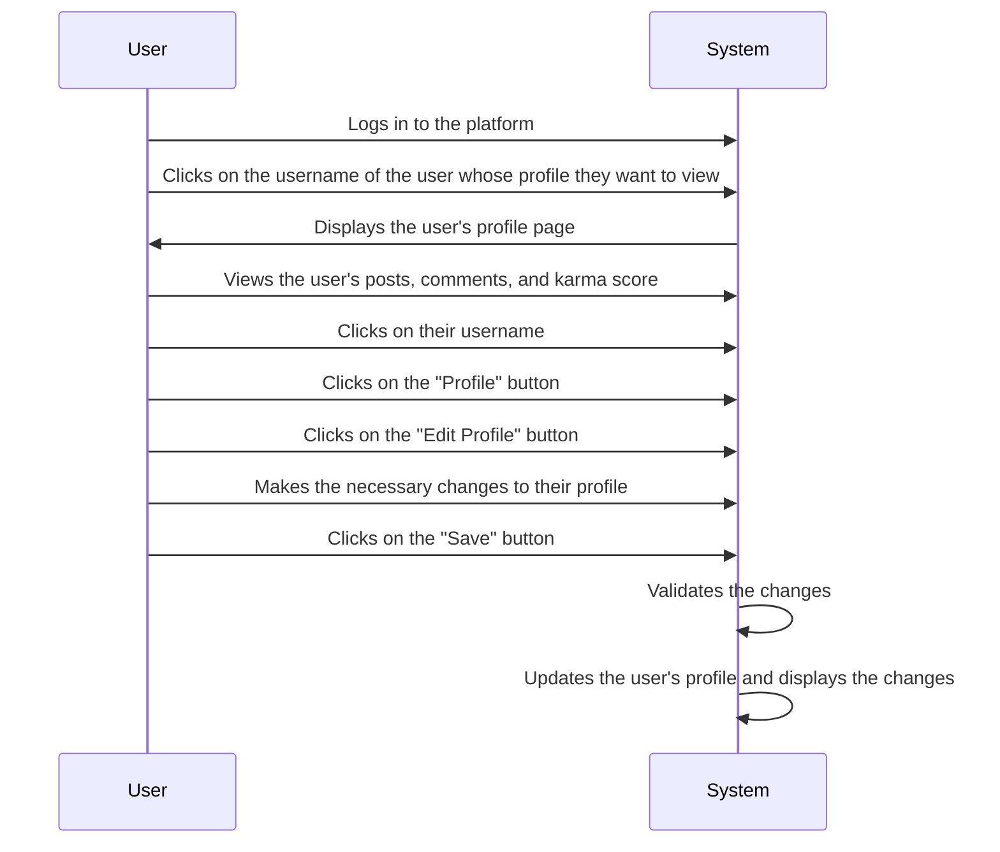
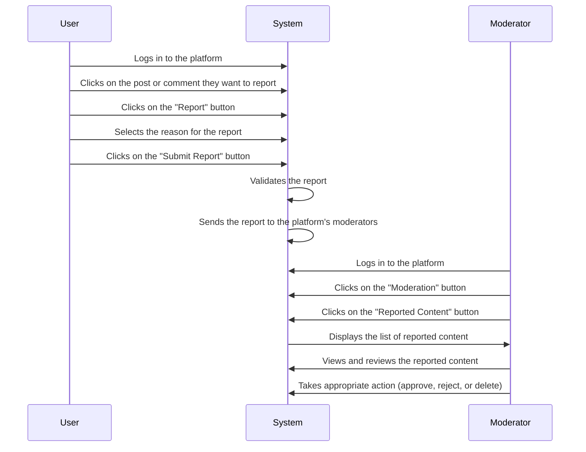

# Requirements Analysis Report for Reddit-like Community Platform

## Executive Summary

This document outlines the detailed requirements for developing a Reddit-like community platform. It includes functional requirements, user scenarios, and user flows to ensure a comprehensive understanding of the platform's features and user interactions.

## Functional Requirements

### User Registration and Login

- **User Registration**: Users should be able to register using their email address or social media accounts.
- **User Login**: Users should be able to log in using their registered email address and password or social media accounts.
- **Password Reset**: Users should be able to reset their password if they forget it.
- **Email Verification**: Users should receive a verification email after registration to confirm their email address.

### Create Communities

- **Community Creation**: Users should be able to create communities with a unique name, description, and rules.
- **Community Categories**: Communities should be categorized for easy navigation and discovery.
- **Community Management**: Community creators should be able to manage community settings, rules, and members.

### Post Content

- **Text Posts**: Users should be able to create text posts with a title and content.
- **Link Posts**: Users should be able to create link posts with a title and URL.
- **Image Posts**: Users should be able to create image posts with a title and image.
- **Post Visibility**: Users should be able to set the visibility of their posts (public or private).
- **Post Tags**: Users should be able to add tags to their posts for better categorization.

### Voting System

- **Upvote/Downvote Posts**: Users should be able to upvote or downvote posts to indicate their preference.
- **Upvote/Downvote Comments**: Users should be able to upvote or downvote comments to indicate their preference.
- **Vote Count**: The platform should display the total number of upvotes and downvotes for each post and comment.

### Commenting System

- **Comment on Posts**: Users should be able to comment on posts to engage in discussions.
- **Reply to Comments**: Users should be able to reply to comments to continue the conversation.
- **Edit Comments**: Users should be able to edit their comments if they make a mistake or want to update the information.
- **Delete Comments**: Users should be able to delete their comments if they no longer want them to be visible.

### Karma System

- **Karma Tracking**: The platform should track and display each user's karma score based on their activity.
- **Karma Calculation**: Karma should be calculated based on the number of upvotes and downvotes received on their posts and comments.
- **Karma Display**: Users should be able to view their karma score and history on their profile page.

### Content Sorting

- **Sort by Hot**: Posts should be sorted by hotness, which is calculated based on the number of upvotes, downvotes, and age of the post.
- **Sort by New**: Posts should be sorted by the time they were posted, with the newest posts appearing first.
- **Sort by Top**: Posts should be sorted by the total number of upvotes, with the highest-rated posts appearing first.
- **Sort by Controversial**: Posts should be sorted by the number of upvotes and downvotes, with the most controversial posts appearing first.

### Subscriptions

- **Subscribe to Communities**: Users should be able to subscribe to communities to receive updates on new posts.
- **Unsubscribe from Communities**: Users should be able to unsubscribe from communities if they no longer want to receive updates.
- **Subscription Management**: Users should be able to manage their subscriptions and view the communities they are subscribed to.

### User Profiles

- **View User Profiles**: Users should be able to view other users' profiles to see their posts, comments, and karma score.
- **Edit User Profiles**: Users should be able to edit their profile information, including their username, profile picture, and bio.
- **User Activity**: Users should be able to view their activity history, including posts, comments, and votes.

### Reporting System

- **Report Inappropriate Content**: Users should be able to report posts, comments, or user profiles that violate the community guidelines.
- **Report Reasons**: Users should be able to select a reason for the report, such as spam, offensive content, or harassment.
- **Moderation Queue**: Reported content should be added to a moderation queue for review by community moderators.
- **Moderation Actions**: Moderators should be able to take actions on reported content, such as approving, rejecting, or deleting the content.

## User Scenarios

### User Personas

- **New User**: A new user who is exploring the platform and wants to find communities that interest them.
- **Active User**: An active user who is regularly posting and commenting on content in various communities.
- **Community Creator**: A user who has created a community and is managing its content and members.
- **Moderator**: A user who has been appointed as a moderator for a community and is responsible for enforcing the community guidelines.

### User Scenarios

- **Scenario 1: User Registration and Login**
  - A new user visits the platform and registers using their email address.
  - The user receives a verification email and clicks on the verification link to confirm their email address.
  - The user logs in using their registered email address and password.

- **Scenario 2: Create and Manage a Community**
  - An active user creates a new community with a unique name, description, and rules.
  - The user selects a category for the community to make it easier for other users to find.
  - The user manages the community by approving or rejecting posts and comments, and banning or unbanning users.

- **Scenario 3: Post Content and Engage in Discussions**
  - An active user creates a text post in a community with a title and content.
  - Other users comment on the post and engage in discussions by replying to comments.
  - The user upvotes or downvotes posts and comments to indicate their preference.

- **Scenario 4: Track Karma and Sort Content**
  - An active user views their karma score and history on their profile page.
  - The user sorts posts in a community by hot, new, top, or controversial to find the most relevant content.

- **Scenario 5: Subscribe to Communities and Manage Subscriptions**
  - An active user subscribes to a community to receive updates on new posts.
  - The user manages their subscriptions by unsubscribing from communities they no longer want to follow.

- **Scenario 6: View and Edit User Profiles**
  - An active user views another user's profile to see their posts, comments, and karma score.
  - The user edits their profile information, including their username, profile picture, and bio.

- **Scenario 7: Report Inappropriate Content and Moderate Content**
  - An active user reports a post, comment, or user profile that violates the community guidelines.
  - A moderator reviews the reported content and takes appropriate action, such as approving, rejecting, or deleting the content.

## User Flow Documentation

### User Registration Flow

### Community Creation Flow

### Content Posting Flow

### Voting Flow

### Commenting Flow

### Karma System Flow

### Content Sorting Flow

### Subscriptions Flow

### User Profiles Flow

### Reporting Flow

## Conclusion

This requirements analysis report provides a comprehensive overview of the functional requirements, user scenarios, and user flows for developing a Reddit-like community platform. It serves as a guide for the development team to ensure that the platform meets the needs of its target audience and provides a seamless user experience.