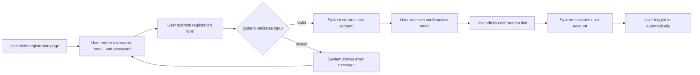
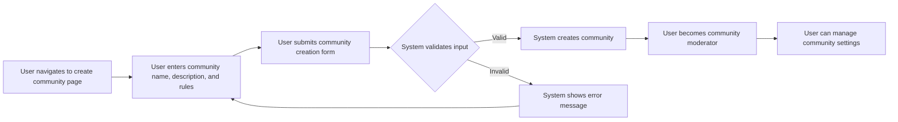
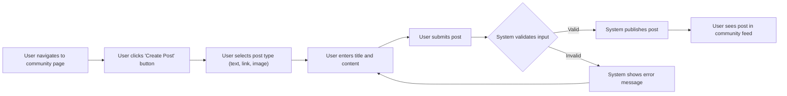
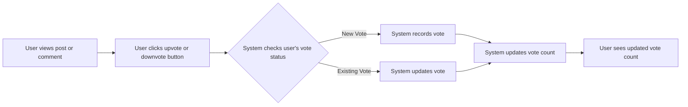
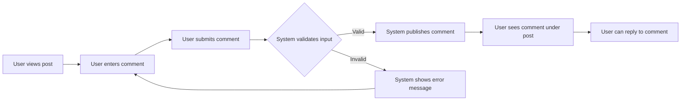
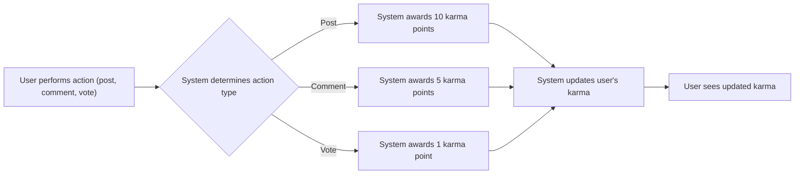
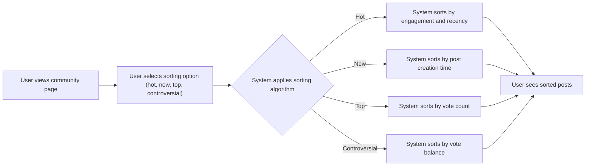
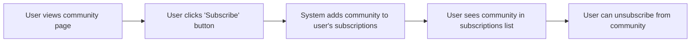
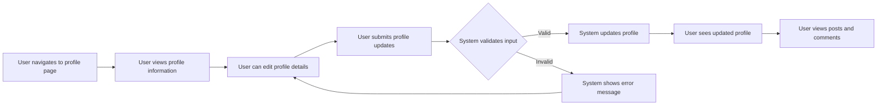
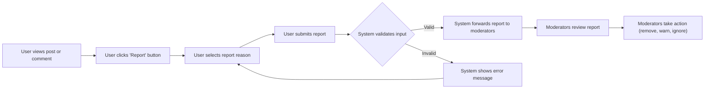

# User Flow Documentation for Reddit-like Community Platform

## User Registration Flow

## Community Creation Flow

## Content Posting Flow

## Voting Flow

## Commenting Flow

## Karma System Flow

## Content Sorting Flow

## Subscriptions Flow

## User Profiles Flow

## Reporting Flow

