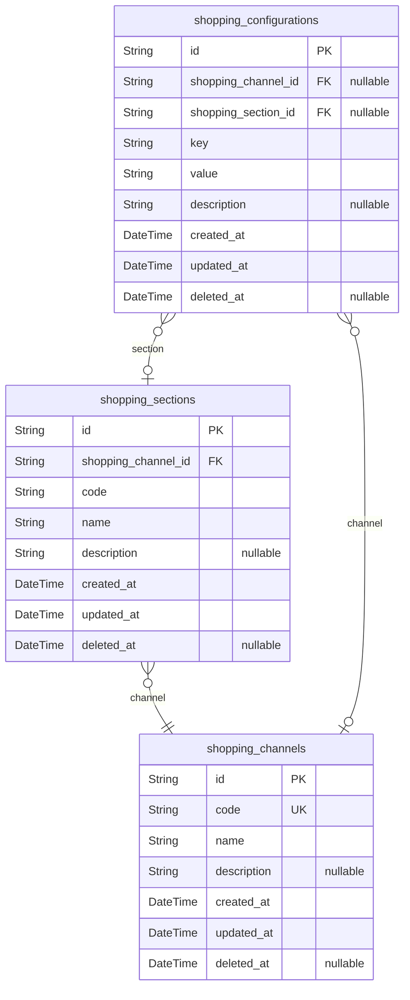
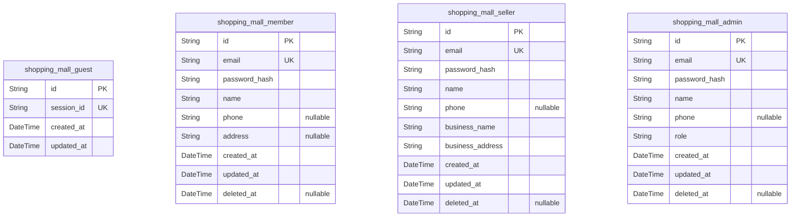
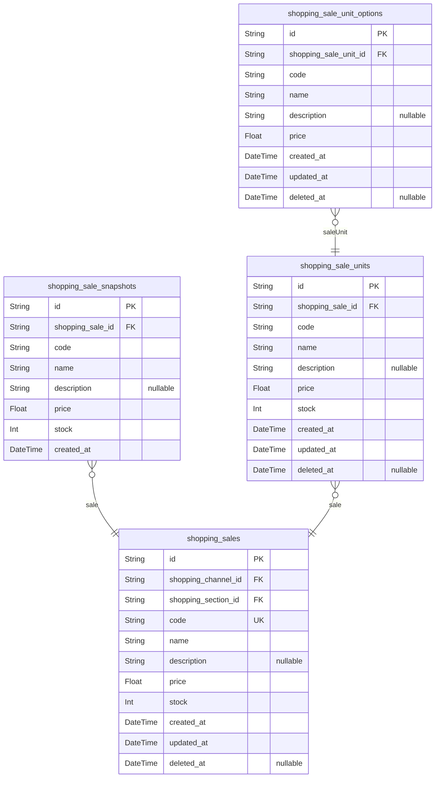
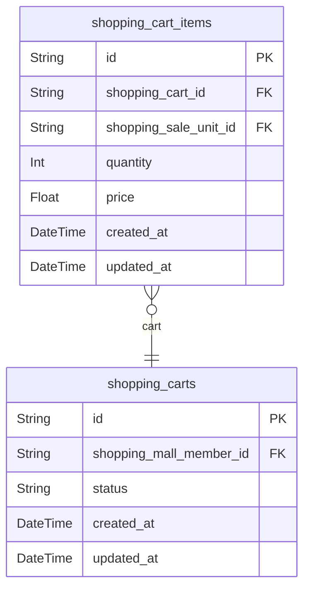
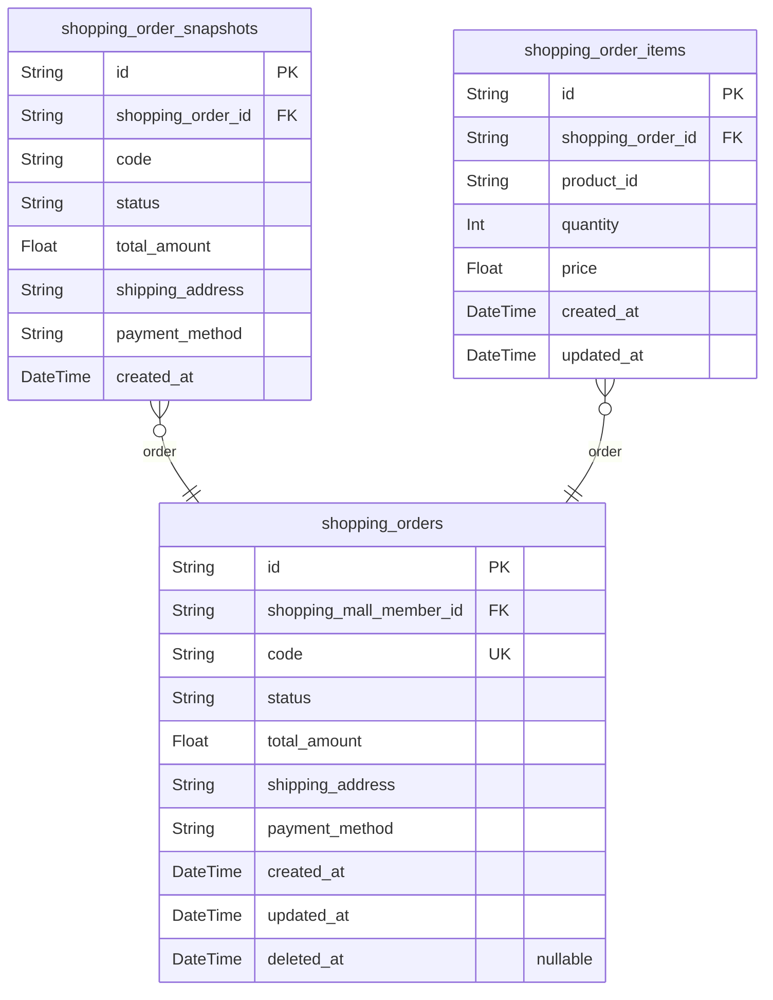
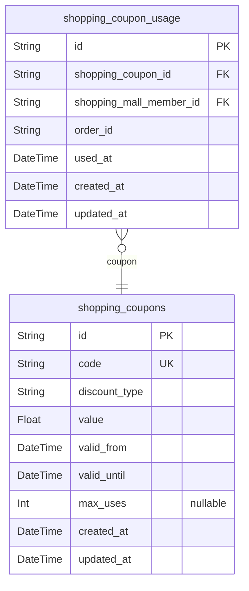
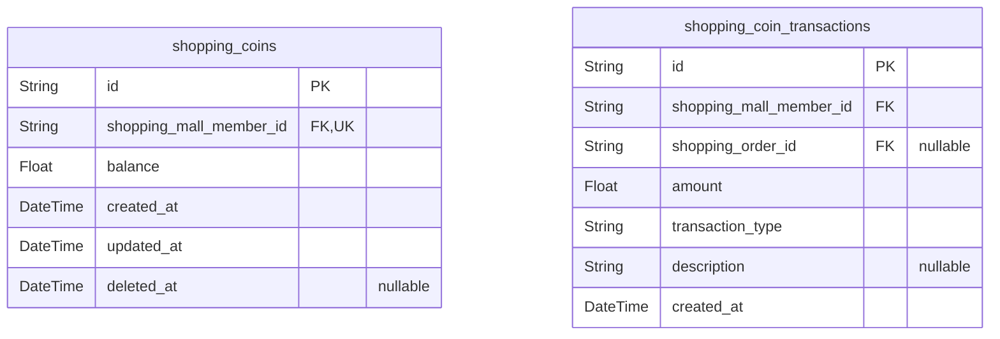
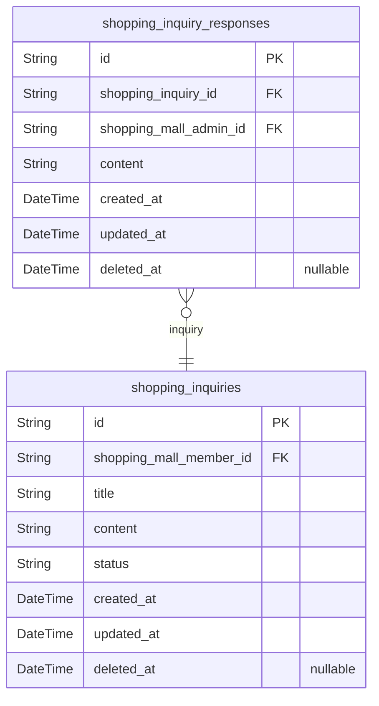
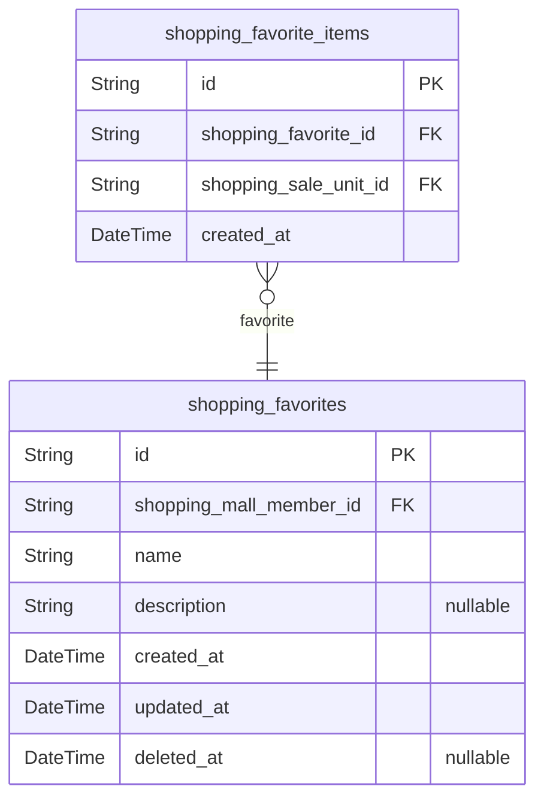
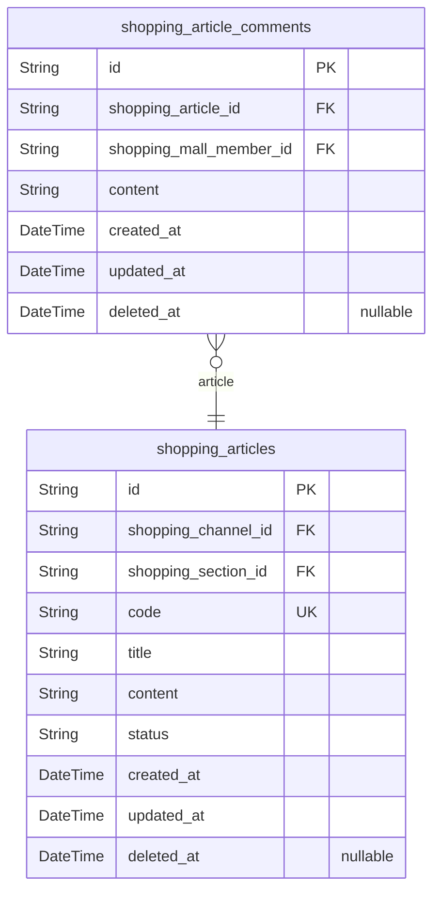

# Prisma Markdown

> Generated by [`prisma-markdown`](https://github.com/samchon/prisma-markdown)

- [Systematic](#systematic)
- [Actors](#actors)
- [Sales](#sales)
- [Carts](#carts)
- [Orders](#orders)
- [Coupons](#coupons)
- [Coins](#coins)
- [Inquiries](#inquiries)
- [Favorites](#favorites)
- [Articles](#articles)

## Systematic

### `shopping_channels`

Represents the shopping channels available in the system. Each channel
has a unique code and name, and is associated with a specific mall.
Channels are the top-level organizational units for products and
services.

Properties as follows:

- `id`: Primary Key.
- `code`: Unique code identifying the channel.
- `name`: Name of the channel.
- `description`: Description of the channel.
- `created_at`: Timestamp when the channel was created.
- `updated_at`: Timestamp when the channel was last updated.
- `deleted_at`: Timestamp when the channel was deleted (soft delete).

### `shopping_sections`

Represents the sections within a shopping channel. Each section has a
unique code and name, and is associated with a specific channel. Sections
help organize products and services within a channel.

Properties as follows:

- `id`: Primary Key.
- `shopping_channel_id`: The channel to which this section belongs. [shopping_channels.id](#shopping_channels)
- `code`: Unique code identifying the section.
- `name`: Name of the section.
- `description`: Description of the section.
- `created_at`: Timestamp when the section was created.
- `updated_at`: Timestamp when the section was last updated.
- `deleted_at`: Timestamp when the section was deleted (soft delete).

### `shopping_configurations`

Represents the configurations for a shopping channel or section. Each
configuration has a unique key and value, and is associated with a
specific channel or section. Configurations define system behavior and
settings for different parts of the system.

Properties as follows:

- `id`: Primary Key.
- `shopping_channel_id`
  > The channel to which this configuration belongs. {@link
  > shopping_channels.id}
- `shopping_section_id`
  > The section to which this configuration belongs. {@link
  > shopping_sections.id}
- `key`: Unique key identifying the configuration.
- `value`: Value of the configuration.
- `description`: Description of the configuration.
- `created_at`: Timestamp when the configuration was created.
- `updated_at`: Timestamp when the configuration was last updated.
- `deleted_at`: Timestamp when the configuration was deleted (soft delete).

## Actors

### `shopping_mall_guest`

Represents unauthenticated users who can browse products and add items to
cart.

Properties as follows:

- `id`: Primary Key.
- `session_id`: Unique identifier for the guest session.
- `created_at`: Timestamp when the guest record was created.
- `updated_at`: Timestamp when the guest record was last updated.

### `shopping_mall_member`

Represents authenticated users who can place orders, manage their
profile, and view order history.

Properties as follows:

- `id`: Primary Key.
- `email`: Email address of the member.
- `password_hash`: Hashed password for authentication.
- `name`: Full name of the member.
- `phone`: Phone number of the member.
- `address`: Shipping address of the member.
- `created_at`: Timestamp when the member record was created.
- `updated_at`: Timestamp when the member record was last updated.
- `deleted_at`: Timestamp when the member record was soft deleted.

### `shopping_mall_seller`

Represents users who can manage their products, inventory, and view sales
reports.

Properties as follows:

- `id`: Primary Key.
- `email`: Email address of the seller.
- `password_hash`: Hashed password for authentication.
- `name`: Full name of the seller.
- `phone`: Phone number of the seller.
- `business_name`: Business name of the seller.
- `business_address`: Business address of the seller.
- `created_at`: Timestamp when the seller record was created.
- `updated_at`: Timestamp when the seller record was last updated.
- `deleted_at`: Timestamp when the seller record was soft deleted.

### `shopping_mall_admin`

Represents system administrators who can manage all users, products,
orders, and system settings.

Properties as follows:

- `id`: Primary Key.
- `email`: Email address of the admin.
- `password_hash`: Hashed password for authentication.
- `name`: Full name of the admin.
- `phone`: Phone number of the admin.
- `role`: Role of the admin (e.g., superadmin, moderator).
- `created_at`: Timestamp when the admin record was created.
- `updated_at`: Timestamp when the admin record was last updated.
- `deleted_at`: Timestamp when the admin record was soft deleted.

## Sales

### `shopping_sales`

Main sales entity representing product offerings in the shopping mall.
This table captures all essential information about products available
for purchase, including pricing, availability, and basic attributes. It
serves as the primary reference for all sales-related operations.

Properties as follows:

- `id`: Primary Key.
- `shopping_channel_id`: Belonged channel's [shopping_channels.id](#shopping_channels).
- `shopping_section_id`: Belonged section's [shopping_sections.id](#shopping_sections).
- `code`: Unique business identifier for the sale.
- `name`: Display name of the sale.
- `description`: Detailed description of the sale.
- `price`: Current price of the sale.
- `stock`: Current inventory stock level.
- `created_at`: Timestamp when the sale was created.
- `updated_at`: Timestamp when the sale was last updated.
- `deleted_at`: Timestamp when the sale was deleted (soft delete).

### `shopping_sale_snapshots`

Historical snapshots of shopping_sales for audit trails and version
control. This table captures point-in-time states of sales entities,
allowing for complete historical tracking of all changes to product
offerings. Each snapshot represents a complete state of a sale at a
specific moment in time.

Properties as follows:

- `id`: Primary Key.
- `shopping_sale_id`: Belonged sale's [shopping_sales.id](#shopping_sales).
- `code`: Unique business identifier for the sale at this snapshot.
- `name`: Display name of the sale at this snapshot.
- `description`: Detailed description of the sale at this snapshot.
- `price`: Price of the sale at this snapshot.
- `stock`: Inventory stock level at this snapshot.
- `created_at`: Timestamp when this snapshot was created.

### `shopping_sale_units`

Product variants for sales entities. This table represents different
versions or options of a product offering, allowing for flexible product
configurations and customization. Each unit belongs to a specific sale
and has its own unique attributes and pricing.

Properties as follows:

- `id`: Primary Key.
- `shopping_sale_id`: Belonged sale's [shopping_sales.id](#shopping_sales).
- `code`: Unique business identifier for the sale unit.
- `name`: Display name of the sale unit.
- `description`: Detailed description of the sale unit.
- `price`: Price of the sale unit.
- `stock`: Inventory stock level of the sale unit.
- `created_at`: Timestamp when the sale unit was created.
- `updated_at`: Timestamp when the sale unit was last updated.
- `deleted_at`: Timestamp when the sale unit was deleted (soft delete).

### `shopping_sale_unit_options`

Customizable options for sale units. This table represents additional
configuration choices that can be made for product variants, allowing
customers to personalize their purchases. Each option belongs to a
specific sale unit and has its own unique attributes and pricing.

Properties as follows:

- `id`: Primary Key.
- `shopping_sale_unit_id`: Belonged sale unit's [shopping_sale_units.id](#shopping_sale_units).
- `code`: Unique business identifier for the sale unit option.
- `name`: Display name of the sale unit option.
- `description`: Detailed description of the sale unit option.
- `price`: Price of the sale unit option.
- `created_at`: Timestamp when the sale unit option was created.
- `updated_at`: Timestamp when the sale unit option was last updated.
- `deleted_at`: Timestamp when the sale unit option was deleted (soft delete).

## Carts

### `shopping_carts`

Shopping carts represent temporary holding areas for items that users
intend to purchase. Each cart is associated with a specific user and
contains multiple cart items. The cart system supports session-based
interactions, allowing users to accumulate items before proceeding to
checkout. The cart maintains temporal fields for tracking creation and
updates, and includes a status field to manage its lifecycle.

Properties as follows:

- `id`: Primary Key.
- `shopping_mall_member_id`: Belonged member's [shopping_mall_member.id](#shopping_mall_member).
- `status`: Status of the shopping cart.
- `created_at`: Creation timestamp of the shopping cart.
- `updated_at`: Last update timestamp of the shopping cart.

### `shopping_cart_items`

Shopping cart items represent individual products or product variants
that users have added to their shopping carts. Each cart item is
associated with a specific cart and product variant, and includes details
such as quantity and price. The cart item system supports session-based
interactions, allowing users to manage their selections before checkout.
The cart item maintains temporal fields for tracking creation and
updates.

Properties as follows:

- `id`: Primary Key.
- `shopping_cart_id`: Belonged cart's [shopping_carts.id](#shopping_carts).
- `shopping_sale_unit_id`: Belonged sale unit's [shopping_sale_units.id](#shopping_sale_units).
- `quantity`: Quantity of the product variant in the cart.
- `price`: Price of the product variant at the time of adding to the cart.
- `created_at`: Creation timestamp of the cart item.
- `updated_at`: Last update timestamp of the cart item.

## Orders

### `shopping_orders`

Primary table for managing customer orders. This table captures all
essential order information including customer details, order status, and
total amount. It serves as the central entity for order processing and
tracking.

Properties as follows:

- `id`: Primary Key.
- `shopping_mall_member_id`
  > Reference to the customer who placed the order. {@link
  > shopping_mall_member.id}
- `code`: Unique order code for tracking and reference purposes.
- `status`
  > Current status of the order (e.g., pending, processing, shipped,
  > delivered).
- `total_amount`: Total amount of the order including all items and taxes.
- `shipping_address`: Shipping address for the order.
- `payment_method`: Payment method used for the order (e.g., credit card, PayPal).
- `created_at`: Timestamp when the order was created.
- `updated_at`: Timestamp when the order was last updated.
- `deleted_at`: Timestamp when the order was deleted (soft delete).

### `shopping_order_snapshots`

Table for capturing historical states of orders for audit trails and
version control. This table records all changes to order information over
time, allowing for comprehensive tracking and analysis.

Properties as follows:

- `id`: Primary Key.
- `shopping_order_id`: Reference to the order being snapshotted. [shopping_orders.id](#shopping_orders)
- `code`: Unique order code for tracking and reference purposes.
- `status`: Status of the order at the time of the snapshot.
- `total_amount`: Total amount of the order including all items and taxes.
- `shipping_address`: Shipping address for the order.
- `payment_method`: Payment method used for the order.
- `created_at`: Timestamp when the snapshot was created.

### `shopping_order_items`

Table for managing items within each order. This table captures detailed
information about each item in the order, including quantity, price, and
product details.

Properties as follows:

- `id`: Primary Key.
- `shopping_order_id`: Reference to the order that contains this item. [shopping_orders.id](#shopping_orders)
- `product_id`: Unique identifier for the product.
- `quantity`: Quantity of the product ordered.
- `price`: Price of the product at the time of order.
- `created_at`: Timestamp when the order item was created.
- `updated_at`: Timestamp when the order item was last updated.

## Coupons

### `shopping_coupons`

Coupon definitions for promotional discounts. Represents available
coupons that can be applied to orders.

Properties as follows:

- `id`: Primary Key.
- `code`: Unique coupon code for redemption.
- `discount_type`: Type of discount (percentage or fixed amount).
- `value`: Discount value (percentage or fixed amount).
- `valid_from`: Start date when the coupon becomes valid.
- `valid_until`: End date when the coupon expires.
- `max_uses`: Maximum number of times the coupon can be used.
- `created_at`: Timestamp when the coupon was created.
- `updated_at`: Timestamp when the coupon was last updated.

### `shopping_coupon_usage`

Records of coupon usage by users. Tracks each application of a coupon to
an order.

Properties as follows:

- `id`: Primary Key.
- `shopping_coupon_id`: Coupon that was used. [shopping_coupons.id](#shopping_coupons)
- `shopping_mall_member_id`: User who applied the coupon. [shopping_mall_member.id](#shopping_mall_member)
- `order_id`: Order to which the coupon was applied.
- `used_at`: Timestamp when the coupon was used.
- `created_at`: Timestamp when the usage record was created.
- `updated_at`: Timestamp when the usage record was last updated.

## Coins

### `shopping_coins`

Tracks user coin balances and financial information. Represents the
current state of a user's coin account.

Properties as follows:

- `id`: Primary Key.
- `shopping_mall_member_id`: Belonged member's [shopping_mall_member.id](#shopping_mall_member).
- `balance`: Current coin balance.
- `created_at`: When the coin account was created.
- `updated_at`: When the coin account was last updated.
- `deleted_at`: When the coin account was deleted (soft delete).

### `shopping_coin_transactions`

Records all financial activities related to coin usage. Captures every
transaction for audit and tracking purposes.

Properties as follows:

- `id`: Primary Key.
- `shopping_mall_member_id`: Belonged member's [shopping_mall_member.id](#shopping_mall_member).
- `shopping_order_id`: Belonged order's [shopping_orders.id](#shopping_orders).
- `amount`: Amount of coins involved in the transaction.
- `transaction_type`: Type of transaction (e.g., 'purchase', 'refund', 'earn').
- `description`: Description of the transaction.
- `created_at`: When the transaction occurred.

## Inquiries

### `shopping_inquiries`

Customer inquiries for support or information. Represents the initial
contact point for customer service interactions. {@link
shopping_mall_member} for the customer who created the inquiry.

Properties as follows:

- `id`: Primary Key.
- `shopping_mall_member_id`: Customer who created the inquiry. [shopping_mall_member.id](#shopping_mall_member)
- `title`: Title of the inquiry.
- `content`: Detailed content of the inquiry.
- `status`: Current status of the inquiry (e.g., 'open', 'in-progress', 'resolved').
- `created_at`: When the inquiry was created.
- `updated_at`: When the inquiry was last updated.
- `deleted_at`: When the inquiry was deleted (soft delete).

### `shopping_inquiry_responses`

Responses to customer inquiries. Represents support activities and
resolutions. [shopping_inquiries](#shopping_inquiries) for the inquiry being responded
to. [shopping_mall_admin](#shopping_mall_admin) for the admin who responded.

Properties as follows:

- `id`: Primary Key.
- `shopping_inquiry_id`: Inquiry being responded to. [shopping_inquiries.id](#shopping_inquiries)
- `shopping_mall_admin_id`: Admin who created the response. [shopping_mall_admin.id](#shopping_mall_admin)
- `content`: Content of the response.
- `created_at`: When the response was created.
- `updated_at`: When the response was last updated.
- `deleted_at`: When the response was deleted (soft delete).

## Favorites

### `shopping_favorites`

User preference management for favorite items. Represents a user's
collection of favorite items across different products. {@link
shopping_mall_member.id}

Properties as follows:

- `id`: Primary Key.
- `shopping_mall_member_id`: Belonged member's [shopping_mall_member.id](#shopping_mall_member)
- `name`: Name of the favorite collection.
- `description`: Description of the favorite collection.
- `created_at`: When the favorite collection was created.
- `updated_at`: When the favorite collection was last updated.
- `deleted_at`: When the favorite collection was deleted (soft delete).

### `shopping_favorite_items`

Favorite items within a user's favorite collection. Represents individual
items that a user has marked as favorites within their collections.
[shopping_favorites.id](#shopping_favorites) [shopping_sale_units.id](#shopping_sale_units)

Properties as follows:

- `id`: Primary Key.
- `shopping_favorite_id`: Belonged favorite collection's [shopping_favorites.id](#shopping_favorites)
- `shopping_sale_unit_id`: Belonged sale unit's [shopping_sale_units.id](#shopping_sale_units)
- `created_at`: When the favorite item was added to the collection.

## Articles

### `shopping_articles`

Represents articles in the shopping mall. This table stores information
about articles that are displayed in the shopping mall. The articles can
be categorized and have various attributes such as title, content, and
status. The table also includes temporal fields for tracking creation,
updates, and deletion times.

Properties as follows:

- `id`: Primary Key.
- `shopping_channel_id`: Belonged channel's [shopping_channels.id](#shopping_channels).
- `shopping_section_id`: Belonged section's [shopping_sections.id](#shopping_sections).
- `code`: Article code.
- `title`: Article title.
- `content`: Article content.
- `status`: Article status.
- `created_at`: When the article was created.
- `updated_at`: When the article was last updated.
- `deleted_at`: When the article was deleted.

### `shopping_article_comments`

Represents comments on articles in the shopping mall. This table stores
information about comments made on articles. Each comment is associated
with a specific article and a user. The table includes temporal fields
for tracking creation, updates, and deletion times.

Properties as follows:

- `id`: Primary Key.
- `shopping_article_id`: Belonged article's [shopping_articles.id](#shopping_articles).
- `shopping_mall_member_id`: Belonged member's [shopping_mall_member.id](#shopping_mall_member).
- `content`: Comment content.
- `created_at`: When the comment was created.
- `updated_at`: When the comment was last updated.
- `deleted_at`: When the comment was deleted.
