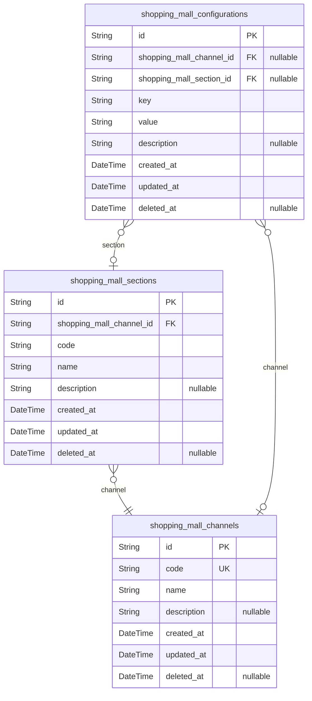
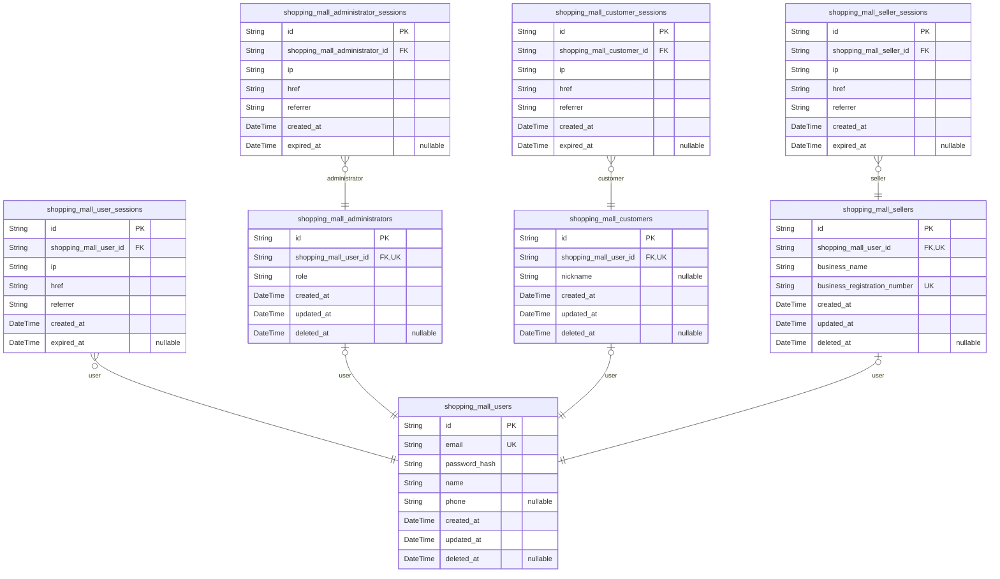
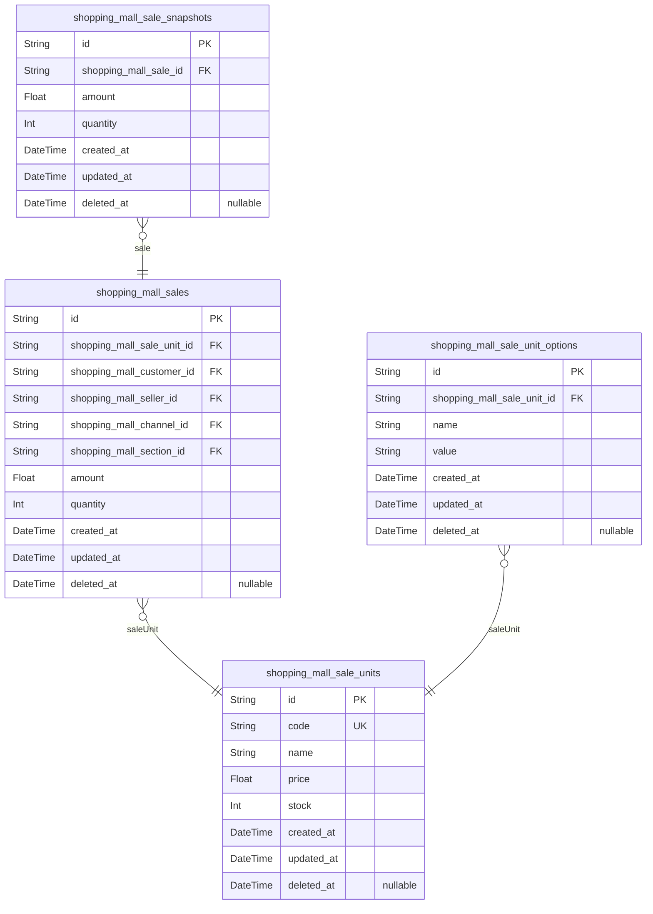
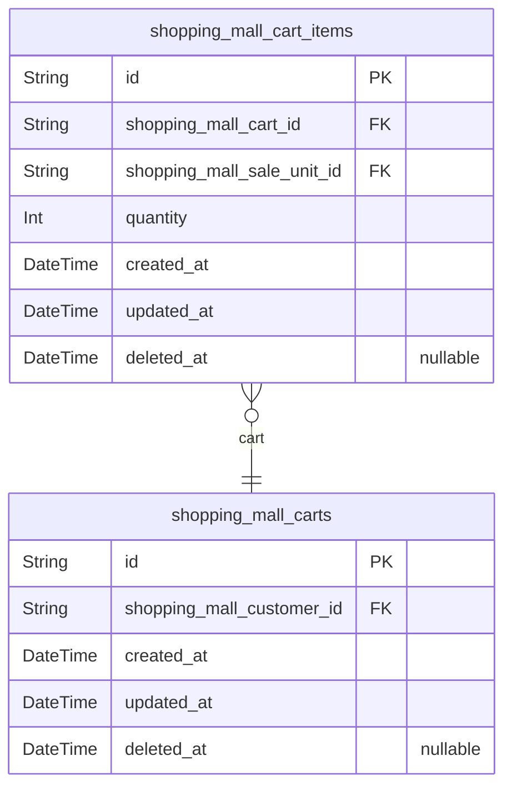
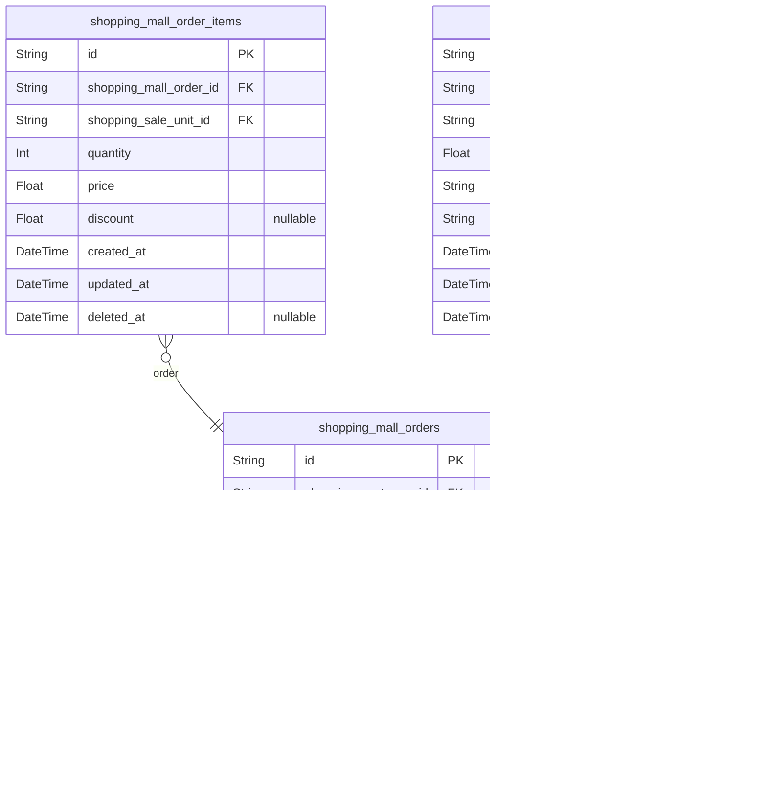
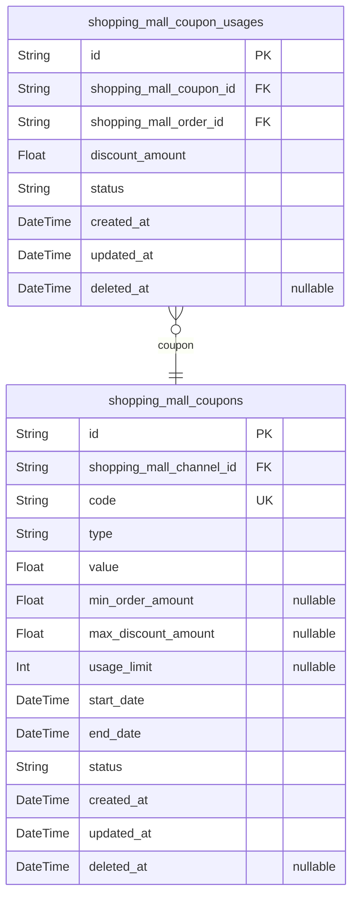
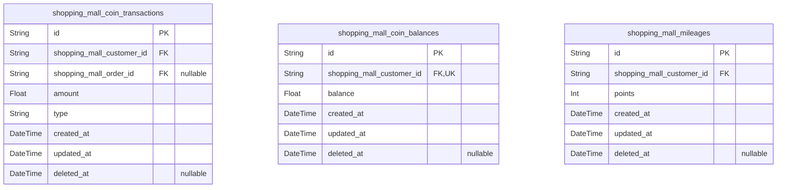
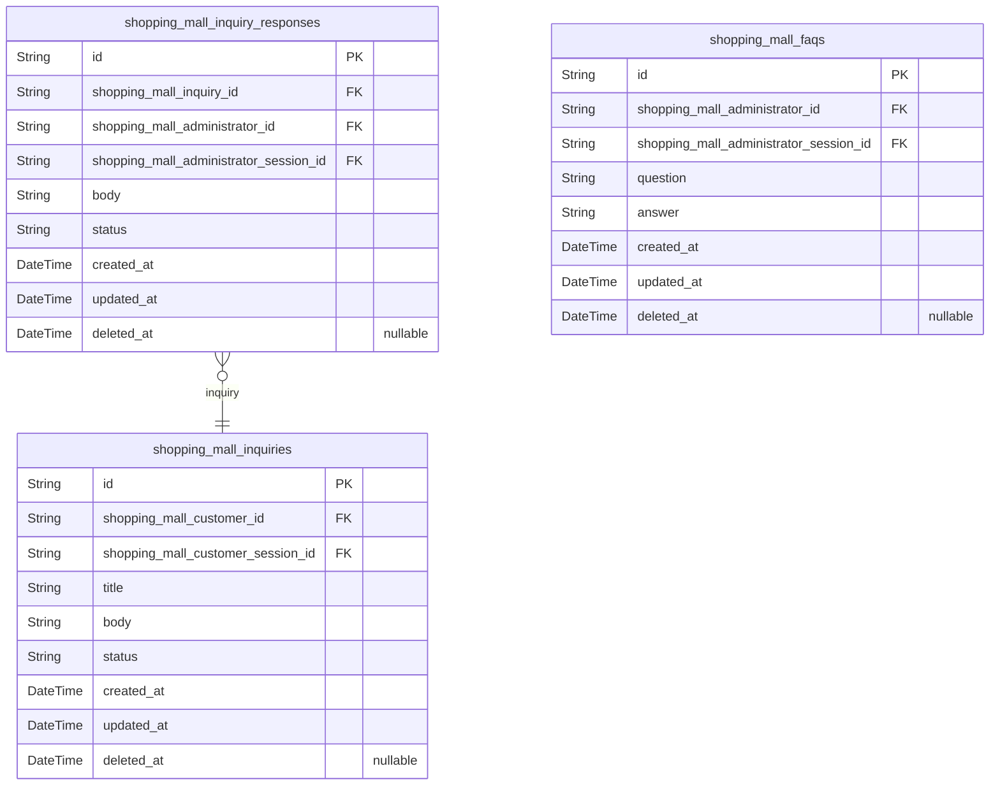
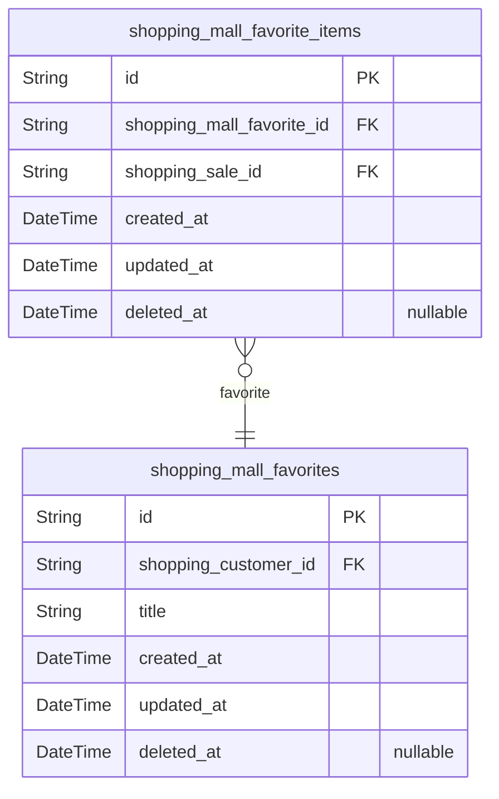
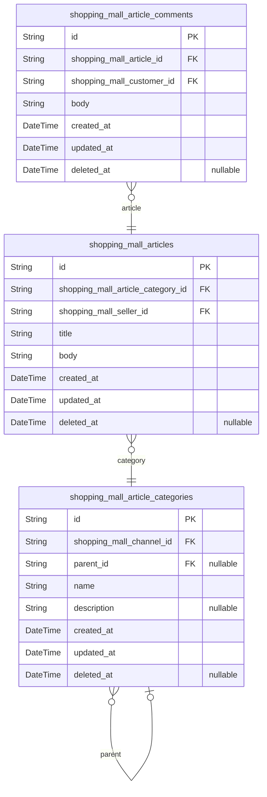

# Prisma Markdown

> Generated by [`prisma-markdown`](https://github.com/samchon/prisma-markdown)

- [Systematic](#systematic)
- [Actors](#actors)
- [Sales](#sales)
- [Carts](#carts)
- [Orders](#orders)
- [Coupons](#coupons)
- [Coins](#coins)
- [Inquiries](#inquiries)
- [Favorites](#favorites)
- [Articles](#articles)

## Systematic

```mermaid
erDiagram
"shopping_mall_channels" {
  String id PK
  String code UK
  String name
  String description "nullable"
  DateTime created_at
  DateTime updated_at
  DateTime deleted_at "nullable"
}
"shopping_mall_sections" {
  String id PK
  String shopping_mall_channel_id FK
  String code
  String name
  String description "nullable"
  DateTime created_at
  DateTime updated_at
  DateTime deleted_at "nullable"
}
"shopping_mall_configurations" {
  String id PK
  String shopping_mall_channel_id FK "nullable"
  String shopping_mall_section_id FK "nullable"
  String key
  String value
  String description "nullable"
  DateTime created_at
  DateTime updated_at
  DateTime deleted_at "nullable"
}
"shopping_mall_sections" }o--|| "shopping_mall_channels" : channel
"shopping_mall_configurations" }o--o| "shopping_mall_channels" : channel
"shopping_mall_configurations" }o--o| "shopping_mall_sections" : section
```

### `shopping_mall_channels`

Shopping mall channel information. Represents individual sales channels
within the mall system. Each channel has unique configuration and can
contain multiple sections. Channels are managed by administrators and
referenced by other domain entities.

Properties as follows:

- `id`: Primary Key.
- `code`
  > Unique channel code. Used for identification and reference across the
  > system.
- `name`: Display name of the channel. Used for user-facing identification.
- `description`
  > Detailed description of the channel. Provides context about the channel's
  > purpose and content.
- `created_at`: Timestamp when the channel was created. Used for auditing and sorting.
- `updated_at`: Timestamp when the channel was last updated. Used for version tracking.
- `deleted_at`
  > Timestamp when the channel was deleted. Used for soft deletion and
  > auditing.

### `shopping_mall_sections`

Shopping mall section information. Represents organizational units within
channels. Sections group related products and content within a channel.
Each section belongs to a specific channel and can contain multiple
configurations.

Properties as follows:

- `id`: Primary Key.
- `shopping_mall_channel_id`: Belongs to channel's [shopping_mall_channels.id](#shopping_mall_channels).
- `code`
  > Unique section code within the channel. Used for identification and
  > reference.
- `name`: Display name of the section. Used for user-facing identification.
- `description`
  > Detailed description of the section. Provides context about the section's
  > purpose and content.
- `created_at`: Timestamp when the section was created. Used for auditing and sorting.
- `updated_at`: Timestamp when the section was last updated. Used for version tracking.
- `deleted_at`
  > Timestamp when the section was deleted. Used for soft deletion and
  > auditing.

### `shopping_mall_configurations`

Shopping mall configuration information. Represents system settings and
preferences for channels and sections. Configurations control behavior
and appearance of the mall components. Each configuration belongs to
either a channel or a section.

Properties as follows:

- `id`: Primary Key.
- `shopping_mall_channel_id`: Belongs to channel's [shopping_mall_channels.id](#shopping_mall_channels).
- `shopping_mall_section_id`: Belongs to section's [shopping_mall_sections.id](#shopping_mall_sections).
- `key`: Configuration key. Identifies the specific setting being configured.
- `value`: Configuration value. Contains the setting's value or data.
- `description`
  > Detailed description of the configuration. Explains the purpose and usage
  > of the setting.
- `created_at`
  > Timestamp when the configuration was created. Used for auditing and
  > sorting.
- `updated_at`
  > Timestamp when the configuration was last updated. Used for version
  > tracking.
- `deleted_at`
  > Timestamp when the configuration was deleted. Used for soft deletion and
  > auditing.

## Actors

```mermaid
erDiagram
"shopping_mall_users" {
  String id PK
  String email UK
  String password_hash
  String name
  String phone "nullable"
  DateTime created_at
  DateTime updated_at
  DateTime deleted_at "nullable"
}
"shopping_mall_user_sessions" {
  String id PK
  String shopping_mall_user_id FK
  String ip
  String href
  String referrer
  DateTime created_at
  DateTime expired_at "nullable"
}
"shopping_mall_administrators" {
  String id PK
  String shopping_mall_user_id FK,UK
  String role
  DateTime created_at
  DateTime updated_at
  DateTime deleted_at "nullable"
}
"shopping_mall_administrator_sessions" {
  String id PK
  String shopping_mall_administrator_id FK
  String ip
  String href
  String referrer
  DateTime created_at
  DateTime expired_at "nullable"
}
"shopping_mall_customers" {
  String id PK
  String shopping_mall_user_id FK,UK
  String nickname "nullable"
  DateTime created_at
  DateTime updated_at
  DateTime deleted_at "nullable"
}
"shopping_mall_customer_sessions" {
  String id PK
  String shopping_mall_customer_id FK
  String ip
  String href
  String referrer
  DateTime created_at
  DateTime expired_at "nullable"
}
"shopping_mall_sellers" {
  String id PK
  String shopping_mall_user_id FK,UK
  String business_name
  String business_registration_number UK
  DateTime created_at
  DateTime updated_at
  DateTime deleted_at "nullable"
}
"shopping_mall_seller_sessions" {
  String id PK
  String shopping_mall_seller_id FK
  String ip
  String href
  String referrer
  DateTime created_at
  DateTime expired_at "nullable"
}
"shopping_mall_user_sessions" }o--|| "shopping_mall_users" : user
"shopping_mall_administrators" |o--|| "shopping_mall_users" : user
"shopping_mall_administrator_sessions" }o--|| "shopping_mall_administrators" : administrator
"shopping_mall_customers" |o--|| "shopping_mall_users" : user
"shopping_mall_customer_sessions" }o--|| "shopping_mall_customers" : customer
"shopping_mall_sellers" |o--|| "shopping_mall_users" : user
"shopping_mall_seller_sessions" }o--|| "shopping_mall_sellers" : seller
```

### `shopping_mall_users`

User accounts for the shopping mall platform. Represents individuals who
interact with the system, including customers, sellers, and
administrators. Contains authentication credentials and personal
information.

Properties as follows:

- `id`: Primary Key.
- `email`
  > User's email address for authentication and communication. Must be unique
  > across all users.
- `password_hash`: Hashed password for user authentication. Never store plain text passwords.
- `name`: User's full name for identification purposes.
- `phone`: User's contact phone number for communication.
- `created_at`: Timestamp when the user account was created.
- `updated_at`: Timestamp when the user account was last updated.
- `deleted_at`: Timestamp when the user account was soft-deleted. Null if active.

### `shopping_mall_user_sessions`

Authentication sessions for users. Tracks active login sessions for
security and audit purposes. Contains session metadata and connection
details.

Properties as follows:

- `id`: Primary Key.
- `shopping_mall_user_id`: User who owns this session. [shopping_mall_users.id](#shopping_mall_users)
- `ip`: IP address from which the session was initiated.
- `href`: URL of the page where the session was initiated.
- `referrer`: Referrer URL that led to the session initiation.
- `created_at`: Timestamp when the session was created.
- `expired_at`: Timestamp when the session expired or was terminated.

### `shopping_mall_administrators`

Administrator accounts for platform management. Represents staff members
with elevated privileges for system administration and oversight.

Properties as follows:

- `id`: Primary Key.
- `shopping_mall_user_id`
  > User account associated with this administrator. {@link
  > shopping_mall_users.id}
- `role`: Administrator's role and permission level within the system.
- `created_at`: Timestamp when the administrator account was created.
- `updated_at`: Timestamp when the administrator account was last updated.
- `deleted_at`: Timestamp when the administrator account was soft-deleted. Null if active.

### `shopping_mall_administrator_sessions`

Authentication sessions for administrators. Tracks active login sessions
for security and audit purposes. Contains session metadata and connection
details.

Properties as follows:

- `id`: Primary Key.
- `shopping_mall_administrator_id`
  > Administrator who owns this session. {@link
  > shopping_mall_administrators.id}
- `ip`: IP address from which the session was initiated.
- `href`: URL of the page where the session was initiated.
- `referrer`: Referrer URL that led to the session initiation.
- `created_at`: Timestamp when the session was created.
- `expired_at`: Timestamp when the session expired or was terminated.

### `shopping_mall_customers`

Customer accounts for shopping mall platform. Represents individuals who
purchase products and services. Contains customer-specific information
and preferences.

Properties as follows:

- `id`: Primary Key.
- `shopping_mall_user_id`: User account associated with this customer. [shopping_mall_users.id](#shopping_mall_users)
- `nickname`: Customer's preferred display name or alias.
- `created_at`: Timestamp when the customer account was created.
- `updated_at`: Timestamp when the customer account was last updated.
- `deleted_at`: Timestamp when the customer account was soft-deleted. Null if active.

### `shopping_mall_customer_sessions`

Authentication sessions for customers. Tracks active login sessions for
security and audit purposes. Contains session metadata and connection
details.

Properties as follows:

- `id`: Primary Key.
- `shopping_mall_customer_id`: Customer who owns this session. [shopping_mall_customers.id](#shopping_mall_customers)
- `ip`: IP address from which the session was initiated.
- `href`: URL of the page where the session was initiated.
- `referrer`: Referrer URL that led to the session initiation.
- `created_at`: Timestamp when the session was created.
- `expired_at`: Timestamp when the session expired or was terminated.

### `shopping_mall_sellers`

Seller accounts for the shopping mall platform. Represents businesses or
individuals who list and sell products. Contains seller-specific
information and business details.

Properties as follows:

- `id`: Primary Key.
- `shopping_mall_user_id`: User account associated with this seller. [shopping_mall_users.id](#shopping_mall_users)
- `business_name`: Legal name of the business or seller.
- `business_registration_number`: Official business registration number or identifier.
- `created_at`: Timestamp when the seller account was created.
- `updated_at`: Timestamp when the seller account was last updated.
- `deleted_at`: Timestamp when the seller account was soft-deleted. Null if active.

### `shopping_mall_seller_sessions`

Authentication sessions for sellers. Tracks active login sessions for
security and audit purposes. Contains session metadata and connection
details.

Properties as follows:

- `id`: Primary Key.
- `shopping_mall_seller_id`: Seller who owns this session. [shopping_mall_sellers.id](#shopping_mall_sellers)
- `ip`: IP address from which the session was initiated.
- `href`: URL of the page where the session was initiated.
- `referrer`: Referrer URL that led to the session initiation.
- `created_at`: Timestamp when the session was created.
- `expired_at`: Timestamp when the session expired or was terminated.

## Sales

```mermaid
erDiagram
"shopping_mall_sales" {
  String id PK
  String shopping_mall_sale_unit_id FK
  String shopping_mall_customer_id FK
  String shopping_mall_seller_id FK
  String shopping_mall_channel_id FK
  String shopping_mall_section_id FK
  Float amount
  Int quantity
  DateTime created_at
  DateTime updated_at
  DateTime deleted_at "nullable"
}
"shopping_mall_sale_snapshots" {
  String id PK
  String shopping_mall_sale_id FK
  Float amount
  Int quantity
  DateTime created_at
  DateTime updated_at
  DateTime deleted_at "nullable"
}
"shopping_mall_sale_units" {
  String id PK
  String code UK
  String name
  Float price
  Int stock
  DateTime created_at
  DateTime updated_at
  DateTime deleted_at "nullable"
}
"shopping_mall_sale_unit_options" {
  String id PK
  String shopping_mall_sale_unit_id FK
  String name
  String value
  DateTime created_at
  DateTime updated_at
  DateTime deleted_at "nullable"
}
"shopping_mall_sales" }o--|| "shopping_mall_sale_units" : saleUnit
"shopping_mall_sale_snapshots" }o--|| "shopping_mall_sales" : sale
"shopping_mall_sale_unit_options" }o--|| "shopping_mall_sale_units" : saleUnit
```

### `shopping_mall_sales`

Product sales information for the shopping mall.

Represents individual product sales transactions within the shopping
mall. Each sale is associated with a specific product variant and
customer. Contains details about the sale amount, quantity, and
timestamps for tracking the sale lifecycle.

Key relationships:

- Belongs to a specific product variant ([shopping_mall_sale_units](#shopping_mall_sale_units))
- Created by a specific customer ([shopping_mall_customers](#shopping_mall_customers))
- Has a specific seller ([shopping_mall_sellers](#shopping_mall_sellers))
- Has a specific channel ([shopping_mall_channels](#shopping_mall_channels))
- Has a specific section ([shopping_mall_sections](#shopping_mall_sections))

The sale records the point-in-time pricing and quantity at the moment of
purchase, which may differ from current product prices. This historical
data is preserved through the snapshot architecture.

Properties as follows:

- `id`: Primary Key.
- `shopping_mall_sale_unit_id`: Belongs to a specific product variant. [shopping_mall_sale_units.id](#shopping_mall_sale_units)
- `shopping_mall_customer_id`: Created by a specific customer. [shopping_mall_customers.id](#shopping_mall_customers)
- `shopping_mall_seller_id`: Has a specific seller. [shopping_mall_sellers.id](#shopping_mall_sellers)
- `shopping_mall_channel_id`: Has a specific channel. [shopping_mall_channels.id](#shopping_mall_channels)
- `shopping_mall_section_id`: Has a specific section. [shopping_mall_sections.id](#shopping_mall_sections)
- `amount`: Amount of cash payment.
- `quantity`: Quantity of product sold.
- `created_at`: When the sale was created.
- `updated_at`: When the sale was last updated.
- `deleted_at`: When the sale was deleted (soft delete).

### `shopping_mall_sale_snapshots`

Historical snapshots of product sales for audit and tracking.

Preserves the state of sales at specific points in time, allowing for
historical analysis and audit trails. Each snapshot captures the complete
state of a sale including all relevant details at the moment of
recording.

Key relationships:

- Belongs to a specific sale ([shopping_mall_sales](#shopping_mall_sales))

The snapshot architecture ensures that changes to sales data can be
tracked and analyzed over time, providing a complete audit trail of all
modifications to sale records.

Properties as follows:

- `id`: Primary Key.
- `shopping_mall_sale_id`: Belongs to a specific sale. [shopping_mall_sales.id](#shopping_mall_sales)
- `amount`: Amount of cash payment at the time of snapshot.
- `quantity`: Quantity of product sold at the time of snapshot.
- `created_at`: When the snapshot was created.
- `updated_at`: When the snapshot was last updated.
- `deleted_at`: When the snapshot was deleted (soft delete).

### `shopping_mall_sale_units`

Product variants available for sale in the shopping mall.

Represents specific product variants that are available for purchase
within the shopping mall. Each unit is associated with a specific product
and contains details about the variant's attributes, pricing, and
availability.

Key relationships:

- Belongs to a specific product ([shopping_mall_products](#shopping_mall_products))
- Has specific options ([shopping_mall_sale_unit_options](#shopping_mall_sale_unit_options))

The sale unit represents a specific configuration of a product that is
available for purchase, allowing for detailed tracking of product
variants and their sales performance.

Properties as follows:

- `id`: Primary Key.
- `code`: Unique code for the sale unit.
- `name`: Name of the sale unit.
- `price`: Price of the sale unit.
- `stock`: Stock quantity of the sale unit.
- `created_at`: When the sale unit was created.
- `updated_at`: When the sale unit was last updated.
- `deleted_at`: When the sale unit was deleted (soft delete).

### `shopping_mall_sale_unit_options`

Options for product variants available for sale in the shopping mall.

Represents specific options for product variants that are available for
purchase within the shopping mall. Each option is associated with a
specific sale unit and contains details about the option's attributes and
values.

Key relationships:

- Belongs to a specific sale unit ([shopping_mall_sale_units](#shopping_mall_sale_units))

The sale unit option represents a specific configuration option for a
product variant, allowing for detailed tracking of product variant
options and their sales performance.

Properties as follows:

- `id`: Primary Key.
- `shopping_mall_sale_unit_id`: Belongs to a specific sale unit. [shopping_mall_sale_units.id](#shopping_mall_sale_units)
- `name`: Name of the sale unit option.
- `value`: Value of the sale unit option.
- `created_at`: When the sale unit option was created.
- `updated_at`: When the sale unit option was last updated.
- `deleted_at`: When the sale unit option was deleted (soft delete).

## Carts

```mermaid
erDiagram
"shopping_mall_carts" {
  String id PK
  String shopping_mall_customer_id FK
  DateTime created_at
  DateTime updated_at
  DateTime deleted_at "nullable"
}
"shopping_mall_cart_items" {
  String id PK
  String shopping_mall_cart_id FK
  String shopping_mall_sale_unit_id FK
  Int quantity
  DateTime created_at
  DateTime updated_at
  DateTime deleted_at "nullable"
}
"shopping_mall_cart_items" }o--|| "shopping_mall_carts" : cart
```

### `shopping_mall_carts`

Shopping cart entity that stores user's selected items before purchase.

Represents a user's temporary collection of products they intend to
purchase.
Each cart belongs to a specific customer and contains multiple cart items.
The cart serves as a container for the shopping process before order
placement.

This entity is part of the shopping cart functionality that allows users to
collect products before proceeding to checkout. The cart maintains the
selected items until the user decides to place an order or remove items.

The cart entity is essential for the shopping experience as it provides a
persistent storage for items between user sessions. It enables users to
accumulate products over time and manage their selections before purchase.

The shopping_mall_carts table is a primary entity that requires independent
user management and operations. Users can create, view, and manage their
own carts, and the system tracks cart creation and modification times.

The cart entity is referenced by the shopping_mall_cart_items table to
establish the relationship between carts and the products they contain.

Properties as follows:

- `id`: Primary Key.
- `shopping_mall_customer_id`: Belongs to customer's [shopping_mall_customers.id](#shopping_mall_customers).
- `created_at`: When the cart was created.
- `updated_at`: When the cart was last updated.
- `deleted_at`: When the cart was deleted (soft delete).

### `shopping_mall_cart_items`

Shopping cart item entity that represents products in a user's cart.

Each cart item belongs to a specific cart and references a product unit.
The item stores quantity and other relevant information about the product
in the cart. The cart item entity enables users to specify how many
of each product they want to purchase.

This entity is part of the shopping cart functionality that allows users to
collect products before proceeding to checkout. The cart item maintains
the quantity and other details of each product in the cart.

The cart item entity is essential for the shopping experience as it
provides a way to track the quantity and details of each product in the
cart. It enables users to manage their selections before purchase.

The shopping_mall_cart_items table is a primary entity that requires
independent user management and operations. Users can create, view,
and manage their own cart items, and the system tracks cart item creation
and modification times.

The cart item entity is referenced by the shopping_mall_carts table to
establish the relationship between carts and the products they contain.

Properties as follows:

- `id`: Primary Key.
- `shopping_mall_cart_id`: Belongs to cart's [shopping_mall_carts.id](#shopping_mall_carts).
- `shopping_mall_sale_unit_id`: Belongs to sale unit's [shopping_mall_sale_units.id](#shopping_mall_sale_units).
- `quantity`: Quantity of the product in the cart.
- `created_at`: When the cart item was created.
- `updated_at`: When the cart item was last updated.
- `deleted_at`: When the cart item was deleted (soft delete).

## Orders

```mermaid
erDiagram
"shopping_mall_orders" {
  String id PK
  String shopping_customer_id FK
  String code UK
  String status
  String payment_status
  String shipping_address
  Float total_amount
  DateTime created_at
  DateTime updated_at
  DateTime deleted_at "nullable"
}
"shopping_mall_order_items" {
  String id PK
  String shopping_mall_order_id FK
  String shopping_sale_unit_id FK
  Int quantity
  Float price
  Float discount "nullable"
  DateTime created_at
  DateTime updated_at
  DateTime deleted_at "nullable"
}
"shopping_mall_payments" {
  String id PK
  String shopping_mall_order_id FK
  String payment_method
  Float amount
  String status
  String transaction_id UK "nullable"
  DateTime created_at
  DateTime updated_at
  DateTime deleted_at "nullable"
}
"shopping_mall_order_items" }o--|| "shopping_mall_orders" : order
"shopping_mall_payments" }o--|| "shopping_mall_orders" : order
```

### `shopping_mall_orders`

Customer orders containing order items and payment information.

Stores complete order details including customer information, shipping
address,
order status, and payment status. Each order is associated with a specific
customer and contains one or more order items. The order status tracks the
current state of the order (e.g., pending, processing, shipped, delivered,
cancelled). The payment status indicates whether the order has been paid
for.

The order table serves as the central entity for order management, providing
a complete record of all order-related information. It references the
customer
who placed the order and contains the shipping address details. The order
status and payment status fields track the progression of the order
through the
fulfillment process.

This table is the primary entity for order management and is referenced by
other order-related tables such as order items and payments.

Properties as follows:

- `id`: Primary Key.
- `shopping_customer_id`: Belonged customer's [shopping_mall_customers.id](#shopping_mall_customers)
- `code`: Unique order code for tracking and reference.
- `status`: Current order status (pending, processing, shipped, delivered, cancelled).
- `payment_status`: Payment status of the order (pending, paid, failed).
- `shipping_address`: Shipping address for the order.
- `total_amount`: Total amount of the order.
- `created_at`: Timestamp when the order was created.
- `updated_at`: Timestamp when the order was last updated.
- `deleted_at`: Timestamp when the order was deleted (soft delete).

### `shopping_mall_order_items`

Individual items within a customer order.

Stores details of each item purchased in an order, including the product,
quantity, price, and any discounts applied. Each order item is associated
with a
specific order and product. The quantity field indicates the number of
units of
the product purchased. The price field stores the price of the product at
the time
of purchase. The discount field records any discounts applied to the item.

The order item table serves as a supporting entity for order management,
providing
detailed information about each item in an order. It references the order
to which
the item belongs and the product that was purchased. The quantity, price,
and
discount fields provide the necessary information for calculating the
total cost of
the order.

This table is a subsidiary entity for order management and is referenced
by the
order table.

Properties as follows:

- `id`: Primary Key.
- `shopping_mall_order_id`: Belonged order's [shopping_mall_orders.id](#shopping_mall_orders)
- `shopping_sale_unit_id`: Belonged sale unit's [shopping_mall_sale_units.id](#shopping_mall_sale_units)
- `quantity`: Quantity of the product purchased.
- `price`: Price of the product at the time of purchase.
- `discount`: Discount applied to the item.
- `created_at`: Timestamp when the order item was created.
- `updated_at`: Timestamp when the order item was last updated.
- `deleted_at`: Timestamp when the order item was deleted (soft delete).

### `shopping_mall_payments`

Payment transactions for customer orders.

Stores details of payment transactions, including the payment method,
amount,
and status. Each payment is associated with a specific order. The payment
method
field indicates the method used for the payment (e.g., credit card, PayPal,
bank transfer). The amount field stores the total amount paid. The status
field
indicates the current status of the payment (e.g., pending, completed,
failed).

The payment table serves as a supporting entity for order management,
providing
detailed information about payment transactions. It references the order
to which the
payment belongs. The payment method, amount, and status fields provide the
necessary information for tracking and managing payment transactions.

This table is a subsidiary entity for order management and is referenced
by the
order table.

Properties as follows:

- `id`: Primary Key.
- `shopping_mall_order_id`: Belonged order's [shopping_mall_orders.id](#shopping_mall_orders)
- `payment_method`: Payment method used (credit card, PayPal, bank transfer).
- `amount`: Amount paid.
- `status`: Payment status (pending, completed, failed).
- `transaction_id`: Unique transaction ID from the payment gateway.
- `created_at`: Timestamp when the payment was created.
- `updated_at`: Timestamp when the payment was last updated.
- `deleted_at`: Timestamp when the payment was deleted (soft delete).

## Coupons

```mermaid
erDiagram
"shopping_mall_coupons" {
  String id PK
  String shopping_mall_channel_id FK
  String code UK
  String type
  Float value
  Float min_order_amount "nullable"
  Float max_discount_amount "nullable"
  Int usage_limit "nullable"
  DateTime start_date
  DateTime end_date
  String status
  DateTime created_at
  DateTime updated_at
  DateTime deleted_at "nullable"
}
"shopping_mall_coupon_usages" {
  String id PK
  String shopping_mall_coupon_id FK
  String shopping_mall_order_id FK
  Float discount_amount
  String status
  DateTime created_at
  DateTime updated_at
  DateTime deleted_at "nullable"
}
"shopping_mall_coupon_usages" }o--|| "shopping_mall_coupons" : coupon
```

### `shopping_mall_coupons`

Coupon information for discounts and promotions.

Stores discount codes, their types, values, and validity periods. Each
coupon
is associated with a specific channel and can be used by customers to
generate discounts on orders. Coupons have different types (percentage,
fixed
amount) and can be limited by usage counts or expiration dates.

Coupons are created by administrators and can be applied to specific
products or the entire order. The coupon status tracks whether it's active,
expired, or suspended. Soft deletion is supported to maintain audit trails
while allowing content moderation.

Properties as follows:

- `id`: Primary Key.
- `shopping_mall_channel_id`: Belonged channel's [shopping_mall_channels.id](#shopping_mall_channels).
- `code`: Unique coupon code for redemption.
- `type`: Type of discount (percentage, fixed amount).
- `value`: Discount value (percentage or fixed amount).
- `min_order_amount`: Minimum order amount required to use the coupon.
- `max_discount_amount`: Maximum discount amount that can be applied.
- `usage_limit`: Maximum number of times the coupon can be used.
- `start_date`: Start date when the coupon becomes valid.
- `end_date`: End date when the coupon expires.
- `status`: Current status of the coupon (active, expired, suspended).
- `created_at`: Timestamp when the coupon was created.
- `updated_at`: Timestamp when the coupon was last updated.
- `deleted_at`: Timestamp when the coupon was deleted (soft delete).

### `shopping_mall_coupon_usages`

Coupon usage records for tracking discount applications.

Stores information about when and how coupons were applied to orders. Each
usage record links a specific coupon to an order and tracks the discount
amount applied. Usage records help monitor coupon effectiveness and
prevent abuse. The status field indicates whether the usage was valid or
invalid (e.g., expired, already used). Soft deletion is supported to
maintain audit trails while allowing content moderation.

Properties as follows:

- `id`: Primary Key.
- `shopping_mall_coupon_id`: Belonged coupon's [shopping_mall_coupons.id](#shopping_mall_coupons).
- `shopping_mall_order_id`: Belonged order's [shopping_mall_orders.id](#shopping_mall_orders).
- `discount_amount`: Amount of discount applied to the order.
- `status`: Status of the coupon usage (valid, invalid, expired).
- `created_at`: Timestamp when the coupon was applied to the order.
- `updated_at`: Timestamp when the coupon usage was last updated.
- `deleted_at`: Timestamp when the coupon usage was deleted (soft delete).

## Coins

```mermaid
erDiagram
"shopping_mall_coin_transactions" {
  String id PK
  String shopping_mall_customer_id FK
  String shopping_mall_order_id FK "nullable"
  Float amount
  String type
  DateTime created_at
  DateTime updated_at
  DateTime deleted_at "nullable"
}
"shopping_mall_coin_balances" {
  String id PK
  String shopping_mall_customer_id FK,UK
  Float balance
  DateTime created_at
  DateTime updated_at
  DateTime deleted_at "nullable"
}
"shopping_mall_mileages" {
  String id PK
  String shopping_mall_customer_id FK
  Int points
  DateTime created_at
  DateTime updated_at
  DateTime deleted_at "nullable"
}
```

### `shopping_mall_coin_transactions`

Records all coin transactions between users and the system.

Stores details of each coin transaction including the amount, type
(deposit or withdrawal),
and associated user. Each transaction is linked to a specific user and
maintains a reference to the order if applicable. The transaction records
include timestamps for creation, updates, and soft deletion to support audit
trails and historical tracking.

Properties as follows:

- `id`: Primary Key.
- `shopping_mall_customer_id`: Customer who performed the transaction. [shopping_mall_customers.id](#shopping_mall_customers)
- `shopping_mall_order_id`: Order associated with the transaction. [shopping_mall_orders.id](#shopping_mall_orders)
- `amount`: Amount of coins involved in the transaction.
- `type`: Type of transaction (deposit or withdrawal).
- `created_at`: Timestamp when the transaction was created.
- `updated_at`: Timestamp when the transaction was last updated.
- `deleted_at`: Timestamp when the transaction was soft deleted.

### `shopping_mall_coin_balances`

Tracks the current coin balance for each user.

Stores the current balance of coins for each user, allowing quick access to
user's available coins. Each balance record is linked to a specific user
and includes timestamps for creation, updates, and soft deletion to support
audit trails and historical tracking.

Properties as follows:

- `id`: Primary Key.
- `shopping_mall_customer_id`: Customer who owns the coin balance. [shopping_mall_customers.id](#shopping_mall_customers)
- `balance`: Current balance of coins for the user.
- `created_at`: Timestamp when the balance record was created.
- `updated_at`: Timestamp when the balance record was last updated.
- `deleted_at`: Timestamp when the balance record was soft deleted.

### `shopping_mall_mileages`

Tracks the mileage points earned by users through purchases.

Stores the mileage points earned by users for each purchase. Each mileage
record is linked to a specific user and includes timestamps for creation,
updates, and soft deletion to support audit trails and historical
tracking.

Properties as follows:

- `id`: Primary Key.
- `shopping_mall_customer_id`: Customer who earned the mileage points. [shopping_mall_customers.id](#shopping_mall_customers)
- `points`: Mileage points earned by the user.
- `created_at`: Timestamp when the mileage record was created.
- `updated_at`: Timestamp when the mileage record was last updated.
- `deleted_at`: Timestamp when the mileage record was soft deleted.

## Inquiries

```mermaid
erDiagram
"shopping_mall_inquiries" {
  String id PK
  String shopping_mall_customer_id FK
  String shopping_mall_customer_session_id FK
  String title
  String body
  String status
  DateTime created_at
  DateTime updated_at
  DateTime deleted_at "nullable"
}
"shopping_mall_inquiry_responses" {
  String id PK
  String shopping_mall_inquiry_id FK
  String shopping_mall_administrator_id FK
  String shopping_mall_administrator_session_id FK
  String body
  String status
  DateTime created_at
  DateTime updated_at
  DateTime deleted_at "nullable"
}
"shopping_mall_faqs" {
  String id PK
  String shopping_mall_administrator_id FK
  String shopping_mall_administrator_session_id FK
  String question
  String answer
  DateTime created_at
  DateTime updated_at
  DateTime deleted_at "nullable"
}
"shopping_mall_inquiry_responses" }o--|| "shopping_mall_inquiries" : inquiry
```

### `shopping_mall_inquiries`

Customer inquiries about products or services. Stores customer questions
and requests for assistance. Each inquiry is associated with a specific
customer and session, and may have multiple responses from
administrators. Inquiries can be marked with a status to track their
resolution process. Soft deletion is supported to maintain audit trails
while allowing content moderation.

Properties as follows:

- `id`: Primary Key.
- `shopping_mall_customer_id`: Customer who created the inquiry. [shopping_mall_customers.id](#shopping_mall_customers)
- `shopping_mall_customer_session_id`
  > Session during which the inquiry was created. {@link
  > shopping_mall_customer_sessions.id}
- `title`: Title of the inquiry.
- `body`: Detailed content of the inquiry.
- `status`: Current status of the inquiry (e.g., 'pending', 'resolved').
- `created_at`: Timestamp when the inquiry was created.
- `updated_at`: Timestamp when the inquiry was last updated.
- `deleted_at`: Timestamp when the inquiry was deleted (soft delete).

### `shopping_mall_inquiry_responses`

Responses to customer inquiries. Stores administrator replies to customer
inquiries. Each response is associated with a specific inquiry and
administrator, and may include additional context or solutions. Responses
can be marked with a status to track their resolution process. Soft
deletion is supported to maintain audit trails while allowing content
moderation.

Properties as follows:

- `id`: Primary Key.
- `shopping_mall_inquiry_id`: Inquiry to which this response belongs. [shopping_mall_inquiries.id](#shopping_mall_inquiries)
- `shopping_mall_administrator_id`
  > Administrator who created the response. {@link
  > shopping_mall_administrators.id}
- `shopping_mall_administrator_session_id`
  > Session during which the response was created. {@link
  > shopping_mall_administrator_sessions.id}
- `body`: Content of the response.
- `status`: Current status of the response (e.g., 'pending', 'resolved').
- `created_at`: Timestamp when the response was created.
- `updated_at`: Timestamp when the response was last updated.
- `deleted_at`: Timestamp when the response was deleted (soft delete).

### `shopping_mall_faqs`

Frequently Asked Questions and Answers. Stores common questions and their
answers to provide quick reference for customers. Each FAQ is associated
with a specific administrator and session, and may be updated or deleted
as needed. Soft deletion is supported to maintain audit trails while
allowing content moderation.

Properties as follows:

- `id`: Primary Key.
- `shopping_mall_administrator_id`: Administrator who created the FAQ. [shopping_mall_administrators.id](#shopping_mall_administrators)
- `shopping_mall_administrator_session_id`
  > Session during which the FAQ was created. {@link
  > shopping_mall_administrator_sessions.id}
- `question`: The frequently asked question.
- `answer`: The answer to the frequently asked question.
- `created_at`: Timestamp when the FAQ was created.
- `updated_at`: Timestamp when the FAQ was last updated.
- `deleted_at`: Timestamp when the FAQ was deleted (soft delete).

## Favorites

```mermaid
erDiagram
"shopping_mall_favorites" {
  String id PK
  String shopping_customer_id FK
  String title
  DateTime created_at
  DateTime updated_at
  DateTime deleted_at "nullable"
}
"shopping_mall_favorite_items" {
  String id PK
  String shopping_mall_favorite_id FK
  String shopping_sale_id FK
  DateTime created_at
  DateTime updated_at
  DateTime deleted_at "nullable"
}
"shopping_mall_favorite_items" }o--|| "shopping_mall_favorites" : favorite
```

### `shopping_mall_favorites`

User's favorite items collection.

Stores user-specific collections of favorite items. Each favorite collection
belongs to a specific customer and can contain multiple favorite items.

The favorite collection serves as a container for organizing and managing a
user's preferred items. It provides a way for users to save and access their
favorite products across different shopping sessions.

The favorite collection is associated with a specific customer through the
shopping_customer_id foreign key. This establishes a relationship between
the
favorite collection and the customer who owns it.

The favorite collection can contain multiple favorite items, which are
stored
in the shopping_mall_favorite_items table. Each favorite item represents a
specific product that the user has marked as a favorite.

The favorite collection also includes a title field, which allows users to
provide a descriptive name for their favorite collection. This helps
users to
better organize and identify their favorite items.

The favorite collection includes timestamp fields for tracking when it was
created, last updated, and deleted. These fields are used for auditing
purposes and to manage the lifecycle of the favorite collection.

The favorite collection is designed to be flexible and customizable,
allowing
users to create multiple collections for different purposes, such as gift
lists, wishlists, or simply for personal reference.

The favorite collection is an essential feature for enhancing the user
experience and providing a convenient way for users to save and access their
favorite products.

Properties as follows:

- `id`: Primary Key.
- `shopping_customer_id`: Belonged customer's [shopping_mall_customers.id](#shopping_mall_customers).
- `title`: Title of the favorite collection.
- `created_at`: Creation timestamp of the favorite collection.
- `updated_at`: Last update timestamp of the favorite collection.
- `deleted_at`: Deletion timestamp of the favorite collection.

### `shopping_mall_favorite_items`

Individual favorite items within a user's favorite collection.

Stores specific products that a user has marked as favorites within their
favorite collections. Each favorite item is associated with a specific
favorite collection and a specific product.

The favorite item represents a specific product that the user has marked
as a
favorite. It serves as a reference to the product within the user's favorite
collection.

The favorite item is associated with a specific favorite collection
through the shopping_mall_favorite_id foreign key. This establishes a
relationship between the favorite item and the favorite collection it
belongs to.

The favorite item is also associated with a specific product through the
shopping_sale_id foreign key. This establishes a relationship between the
favorite item and the product it represents.

The favorite item includes timestamp fields for tracking when it was
created,
last updated, and deleted. These fields are used for auditing purposes
and to
manage the lifecycle of the favorite item.

The favorite item is designed to be flexible and customizable, allowing
users
to add and remove favorite items from their collections as needed.

The favorite item is an essential feature for enhancing the user experience
and providing a convenient way for users to save and access their favorite
products.

Properties as follows:

- `id`: Primary Key.
- `shopping_mall_favorite_id`: Belonged favorite collection's [shopping_mall_favorites.id](#shopping_mall_favorites).
- `shopping_sale_id`: Belonged product's [shopping_mall_sales.id](#shopping_mall_sales).
- `created_at`: Creation timestamp of the favorite item.
- `updated_at`: Last update timestamp of the favorite item.
- `deleted_at`: Deletion timestamp of the favorite item.

## Articles

```mermaid
erDiagram
"shopping_mall_articles" {
  String id PK
  String shopping_mall_article_category_id FK
  String shopping_mall_seller_id FK
  String title
  String body
  DateTime created_at
  DateTime updated_at
  DateTime deleted_at "nullable"
}
"shopping_mall_article_comments" {
  String id PK
  String shopping_mall_article_id FK
  String shopping_mall_customer_id FK
  String body
  DateTime created_at
  DateTime updated_at
  DateTime deleted_at "nullable"
}
"shopping_mall_article_categories" {
  String id PK
  String shopping_mall_channel_id FK
  String parent_id FK "nullable"
  String name
  String description "nullable"
  DateTime created_at
  DateTime updated_at
  DateTime deleted_at "nullable"
}
"shopping_mall_articles" }o--|| "shopping_mall_article_categories" : category
"shopping_mall_article_comments" }o--|| "shopping_mall_articles" : article
"shopping_mall_article_categories" }o--o| "shopping_mall_article_categories" : parent
```

### `shopping_mall_articles`

Articles published on the shopping mall platform.

Stores information about articles including title, content, and
publication status.
Each article belongs to a specific category and is associated with a seller.
Articles can be commented on by customers and have snapshots for
historical tracking.

The article content includes title, body, and other relevant information.
Soft deletion is supported to maintain audit trails while allowing
content moderation.

Properties as follows:

- `id`: Primary Key.
- `shopping_mall_article_category_id`: Belongs to category. [shopping_mall_article_categories.id](#shopping_mall_article_categories)
- `shopping_mall_seller_id`: Belongs to seller. [shopping_mall_sellers.id](#shopping_mall_sellers)
- `title`: Title of the article.
- `body`: Content of the article.
- `created_at`: When the article was created.
- `updated_at`: When the article was last updated.
- `deleted_at`: When the article was deleted (soft delete).

### `shopping_mall_article_comments`

Comments on articles published on the shopping mall platform.

Stores information about comments including content and publication status.
Each comment belongs to a specific article and is associated with a
customer.
Comments can be replied to by other customers and have snapshots for
historical tracking.

The comment content includes body and other relevant information.
Soft deletion is supported to maintain audit trails while allowing
content moderation.

Properties as follows:

- `id`: Primary Key.
- `shopping_mall_article_id`: Belongs to article. [shopping_mall_articles.id](#shopping_mall_articles)
- `shopping_mall_customer_id`: Belongs to customer. [shopping_mall_customers.id](#shopping_mall_customers)
- `body`: Content of the comment.
- `created_at`: When the comment was created.
- `updated_at`: When the comment was last updated.
- `deleted_at`: When the comment was deleted (soft delete).

### `shopping_mall_article_categories`

Categories for articles published on the shopping mall platform.

Stores information about article categories including name and description.
Each category can contain multiple articles and is associated with a
specific channel.
Categories can be nested to create a hierarchical structure for better
organization.

The category information includes name, description, and other relevant
information.
Soft deletion is supported to maintain audit trails while allowing
content moderation.

Properties as follows:

- `id`: Primary Key.
- `shopping_mall_channel_id`: Belongs to channel. [shopping_mall_channels.id](#shopping_mall_channels)
- `parent_id`: Parent category. [shopping_mall_article_categories.id](#shopping_mall_article_categories)
- `name`: Name of the category.
- `description`: Description of the category.
- `created_at`: When the category was created.
- `updated_at`: When the category was last updated.
- `deleted_at`: When the category was deleted (soft delete).
