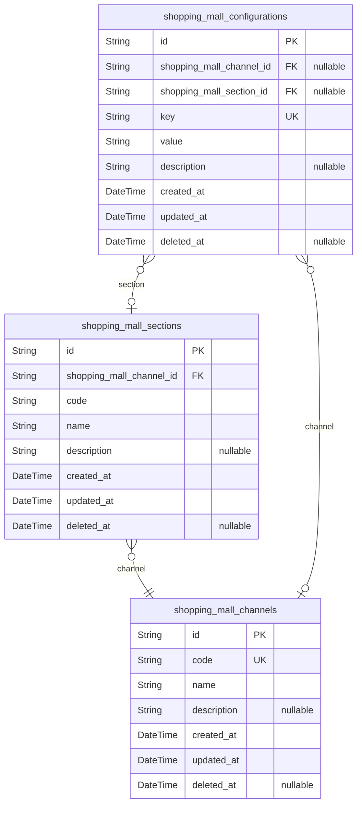
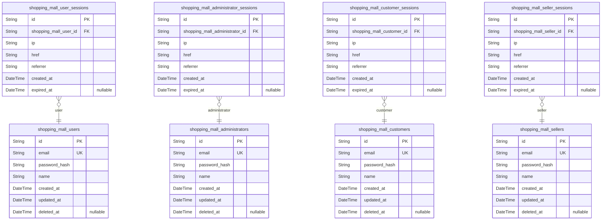
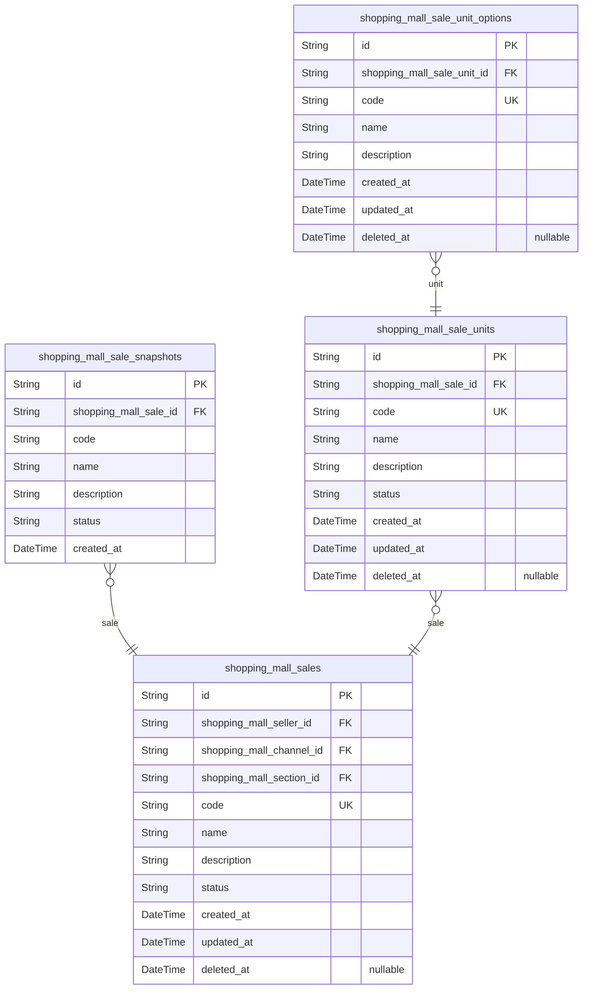
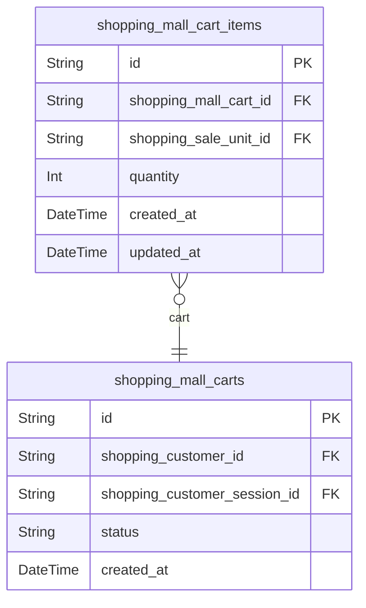
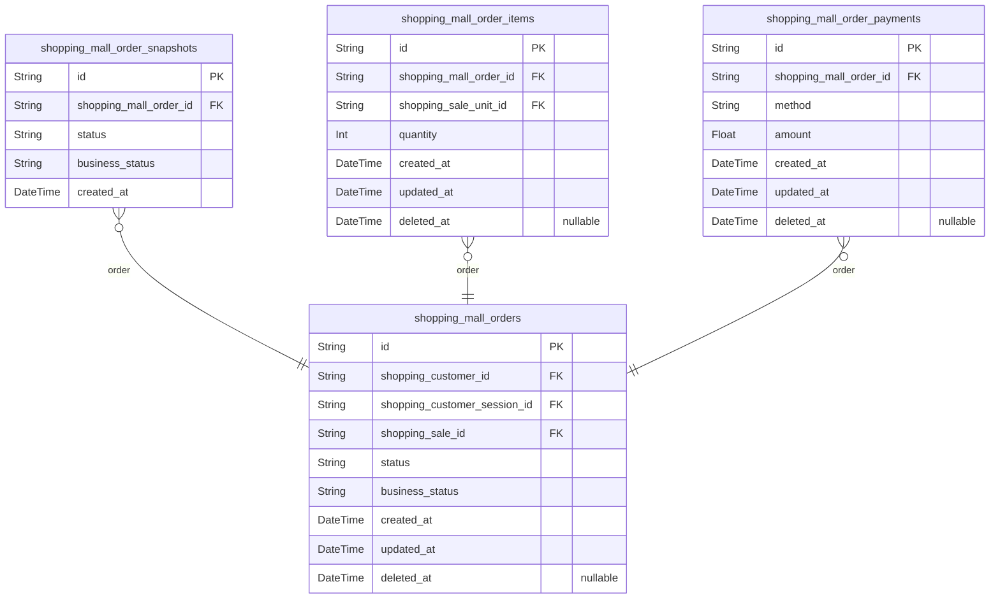
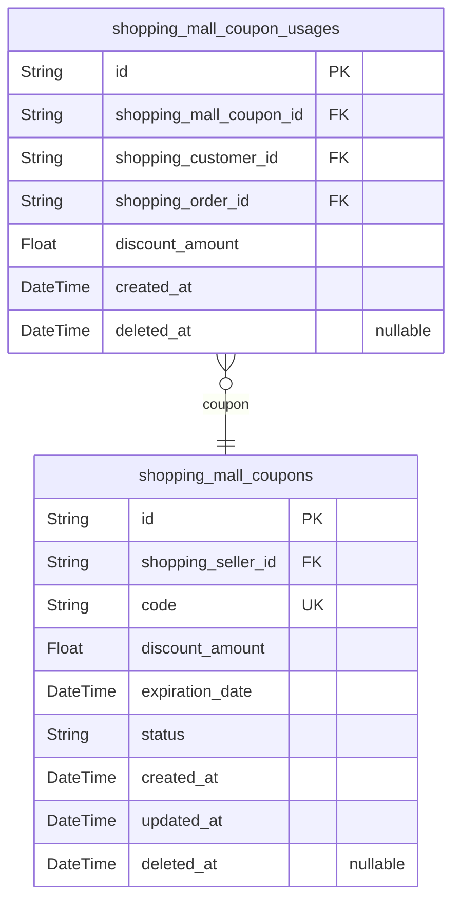
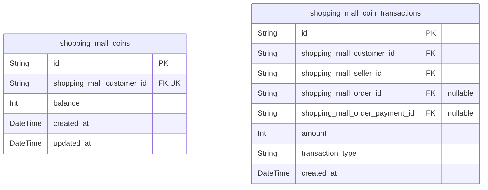
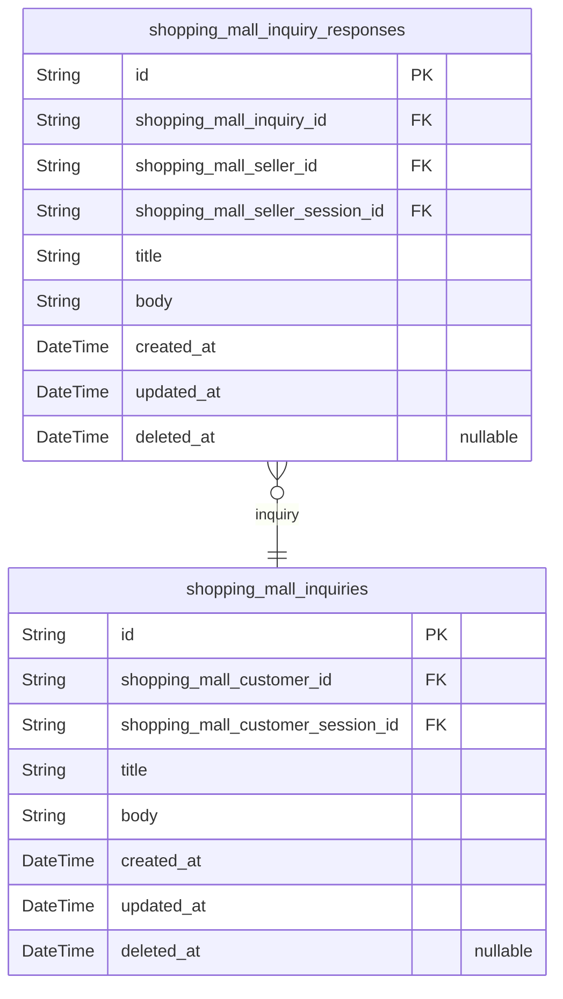
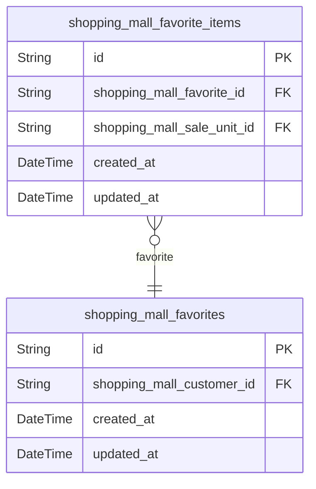
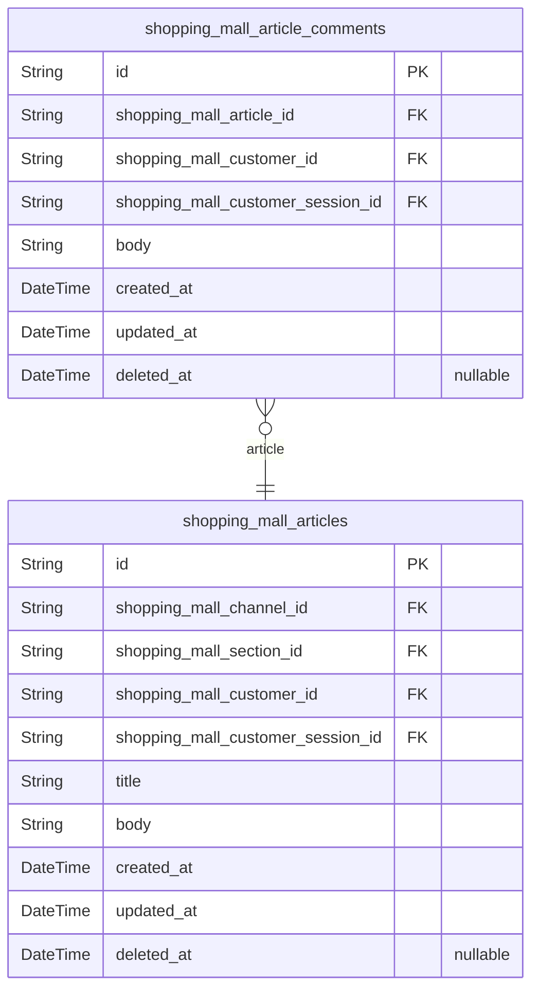

# Prisma Markdown

> Generated by [`prisma-markdown`](https://github.com/samchon/prisma-markdown)

- [Systematic](#systematic)
- [Actors](#actors)
- [Sales](#sales)
- [Carts](#carts)
- [Orders](#orders)
- [Coupons](#coupons)
- [Coins](#coins)
- [Inquiries](#inquiries)
- [Favorites](#favorites)
- [Articles](#articles)

## Systematic

```mermaid
erDiagram
"shopping_mall_channels" {
  String id PK
  String code UK
  String name
  String description "nullable"
  DateTime created_at
  DateTime updated_at
  DateTime deleted_at "nullable"
}
"shopping_mall_sections" {
  String id PK
  String shopping_mall_channel_id FK
  String code
  String name
  String description "nullable"
  DateTime created_at
  DateTime updated_at
  DateTime deleted_at "nullable"
}
"shopping_mall_configurations" {
  String id PK
  String shopping_mall_channel_id FK "nullable"
  String shopping_mall_section_id FK "nullable"
  String key UK
  String value
  String description "nullable"
  DateTime created_at
  DateTime updated_at
  DateTime deleted_at "nullable"
}
"shopping_mall_sections" }o--|| "shopping_mall_channels" : channel
"shopping_mall_configurations" }o--o| "shopping_mall_channels" : channel
"shopping_mall_configurations" }o--o| "shopping_mall_sections" : section
```

### `shopping_mall_channels`

Shopping mall channel information. A channel is a distinct section of the
shopping mall that can have its own configuration and sections. Channels
are used to organize products and services into logical groups.

Properties as follows:

- `id`: Primary Key.
- `code`
  > Unique code for the channel. Used for identification and reference
  > purposes.
- `name`: Name of the channel. Displayed to users to identify the channel.
- `description`
  > Description of the channel. Provides additional information about the
  > channel's purpose and content.
- `created_at`: Timestamp when the channel was created.
- `updated_at`: Timestamp when the channel was last updated.
- `deleted_at`: Timestamp when the channel was deleted (soft delete).

### `shopping_mall_sections`

Shopping mall section information. A section is a distinct area within a
channel that can have its own configuration and products. Sections are
used to further organize products and services into logical subgroups.

Properties as follows:

- `id`: Primary Key.
- `shopping_mall_channel_id`: Channel that this section belongs to. [shopping_mall_channels.id](#shopping_mall_channels)
- `code`
  > Unique code for the section. Used for identification and reference
  > purposes.
- `name`: Name of the section. Displayed to users to identify the section.
- `description`
  > Description of the section. Provides additional information about the
  > section's purpose and content.
- `created_at`: Timestamp when the section was created.
- `updated_at`: Timestamp when the section was last updated.
- `deleted_at`: Timestamp when the section was deleted (soft delete).

### `shopping_mall_configurations`

Shopping mall configuration information. Configurations are used to store
system-wide settings and preferences for the shopping mall.
Configurations can be specific to a channel or section.

Properties as follows:

- `id`: Primary Key.
- `shopping_mall_channel_id`
  > Channel that this configuration belongs to. {@link
  > shopping_mall_channels.id}
- `shopping_mall_section_id`
  > Section that this configuration belongs to. {@link
  > shopping_mall_sections.id}
- `key`
  > Unique key for the configuration. Used for identification and reference
  > purposes.
- `value`: Value of the configuration. Stores the actual configuration data.
- `description`
  > Description of the configuration. Provides additional information about
  > the configuration's purpose and usage.
- `created_at`: Timestamp when the configuration was created.
- `updated_at`: Timestamp when the configuration was last updated.
- `deleted_at`: Timestamp when the configuration was deleted (soft delete).

## Actors

```mermaid
erDiagram
"shopping_mall_users" {
  String id PK
  String email UK
  String password_hash
  String name
  DateTime created_at
  DateTime updated_at
  DateTime deleted_at "nullable"
}
"shopping_mall_user_sessions" {
  String id PK
  String shopping_mall_user_id FK
  String ip
  String href
  String referrer
  DateTime created_at
  DateTime expired_at "nullable"
}
"shopping_mall_administrators" {
  String id PK
  String email UK
  String password_hash
  String name
  DateTime created_at
  DateTime updated_at
  DateTime deleted_at "nullable"
}
"shopping_mall_administrator_sessions" {
  String id PK
  String shopping_mall_administrator_id FK
  String ip
  String href
  String referrer
  DateTime created_at
  DateTime expired_at "nullable"
}
"shopping_mall_customers" {
  String id PK
  String email UK
  String password_hash
  String name
  DateTime created_at
  DateTime updated_at
  DateTime deleted_at "nullable"
}
"shopping_mall_customer_sessions" {
  String id PK
  String shopping_mall_customer_id FK
  String ip
  String href
  String referrer
  DateTime created_at
  DateTime expired_at "nullable"
}
"shopping_mall_sellers" {
  String id PK
  String email UK
  String password_hash
  String name
  DateTime created_at
  DateTime updated_at
  DateTime deleted_at "nullable"
}
"shopping_mall_seller_sessions" {
  String id PK
  String shopping_mall_seller_id FK
  String ip
  String href
  String referrer
  DateTime created_at
  DateTime expired_at "nullable"
}
"shopping_mall_user_sessions" }o--|| "shopping_mall_users" : user
"shopping_mall_administrator_sessions" }o--|| "shopping_mall_administrators" : administrator
"shopping_mall_customer_sessions" }o--|| "shopping_mall_customers" : customer
"shopping_mall_seller_sessions" }o--|| "shopping_mall_sellers" : seller
```

### `shopping_mall_users`

User accounts for the shopping mall platform. These accounts represent
individual users who interact with the system, including customers,
sellers, and administrators. Each user has a unique email address and
password for authentication purposes. The user accounts are used to track
user activity, manage permissions, and provide personalized experiences.
The user accounts are also used to store user preferences and settings.

Properties as follows:

- `id`: Primary Key.
- `email`
  > User's email address for authentication and communication. Must be unique
  > across all users.
- `password_hash`: Hashed password for user authentication. Never store plain text passwords.
- `name`: User's full name for identification purposes.
- `created_at`: Timestamp when the user account was created.
- `updated_at`: Timestamp when the user account was last updated.
- `deleted_at`: Timestamp when the user account was deleted (soft delete).

### `shopping_mall_user_sessions`

Session tracking for user accounts. These sessions represent the active
login sessions for users, including customers, sellers, and
administrators. Each session is associated with a specific user account
and includes details such as the IP address, connection URL, and referrer
URL. The session tracking is used to monitor user activity, manage
security, and provide personalized experiences. The session tracking is
also used to enforce session timeouts and manage concurrent sessions.

Properties as follows:

- `id`: Primary Key.
- `shopping_mall_user_id`: User account associated with this session. [shopping_mall_users.id](#shopping_mall_users)
- `ip`: IP address of the user's device during the session.
- `href`: Connection URL used during the session.
- `referrer`: Referrer URL that led to the session.
- `created_at`: Timestamp when the session was created.
- `expired_at`: Timestamp when the session expired or was terminated.

### `shopping_mall_administrators`

Administrator accounts for the shopping mall platform. These accounts
represent individuals with elevated privileges to manage the platform,
including user accounts, product listings, and order processing. Each
administrator has a unique email address and password for authentication
purposes. The administrator accounts are used to track administrative
activity, manage permissions, and provide access to administrative
features. The administrator accounts are also used to store administrator
preferences and settings.

Properties as follows:

- `id`: Primary Key.
- `email`
  > Administrator's email address for authentication and communication. Must
  > be unique across all administrators.
- `password_hash`
  > Hashed password for administrator authentication. Never store plain text
  > passwords.
- `name`: Administrator's full name for identification purposes.
- `created_at`: Timestamp when the administrator account was created.
- `updated_at`: Timestamp when the administrator account was last updated.
- `deleted_at`: Timestamp when the administrator account was deleted (soft delete).

### `shopping_mall_administrator_sessions`

Session tracking for administrator accounts. These sessions represent the
active login sessions for administrators, including the platform's super
administrators and regular administrators. Each session is associated
with a specific administrator account and includes details such as the IP
address, connection URL, and referrer URL. The session tracking is used
to monitor administrator activity, manage security, and provide access to
administrative features. The session tracking is also used to enforce
session timeouts and manage concurrent sessions.

Properties as follows:

- `id`: Primary Key.
- `shopping_mall_administrator_id`
  > Administrator account associated with this session. {@link
  > shopping_mall_administrators.id}
- `ip`: IP address of the administrator's device during the session.
- `href`: Connection URL used during the session.
- `referrer`: Referrer URL that led to the session.
- `created_at`: Timestamp when the session was created.
- `expired_at`: Timestamp when the session expired or was terminated.

### `shopping_mall_customers`

Customer accounts for the shopping mall platform. These accounts
represent individuals who purchase products from the platform. Each
customer has a unique email address and password for authentication
purposes. The customer accounts are used to track customer activity,
manage orders, and provide personalized experiences. The customer
accounts are also used to store customer preferences and settings.

Properties as follows:

- `id`: Primary Key.
- `email`
  > Customer's email address for authentication and communication. Must be
  > unique across all customers.
- `password_hash`
  > Hashed password for customer authentication. Never store plain text
  > passwords.
- `name`: Customer's full name for identification purposes.
- `created_at`: Timestamp when the customer account was created.
- `updated_at`: Timestamp when the customer account was last updated.
- `deleted_at`: Timestamp when the customer account was deleted (soft delete).

### `shopping_mall_customer_sessions`

Session tracking for customer accounts. These sessions represent the
active login sessions for customers, including registered customers and
guest customers. Each session is associated with a specific customer
account and includes details such as the IP address, connection URL, and
referrer URL. The session tracking is used to monitor customer activity,
manage orders, and provide personalized experiences. The session tracking
is also used to enforce session timeouts and manage concurrent sessions.

Properties as follows:

- `id`: Primary Key.
- `shopping_mall_customer_id`
  > Customer account associated with this session. {@link
  > shopping_mall_customers.id}
- `ip`: IP address of the customer's device during the session.
- `href`: Connection URL used during the session.
- `referrer`: Referrer URL that led to the session.
- `created_at`: Timestamp when the session was created.
- `expired_at`: Timestamp when the session expired or was terminated.

### `shopping_mall_sellers`

Seller accounts for the shopping mall platform. These accounts represent
individuals or businesses that sell products on the platform. Each seller
has a unique email address and password for authentication purposes. The
seller accounts are used to track seller activity, manage product
listings, and process orders. The seller accounts are also used to store
seller preferences and settings.

Properties as follows:

- `id`: Primary Key.
- `email`
  > Seller's email address for authentication and communication. Must be
  > unique across all sellers.
- `password_hash`
  > Hashed password for seller authentication. Never store plain text
  > passwords.
- `name`: Seller's full name or business name for identification purposes.
- `created_at`: Timestamp when the seller account was created.
- `updated_at`: Timestamp when the seller account was last updated.
- `deleted_at`: Timestamp when the seller account was deleted (soft delete).

### `shopping_mall_seller_sessions`

Session tracking for seller accounts. These sessions represent the active
login sessions for sellers, including individual sellers and business
sellers. Each session is associated with a specific seller account and
includes details such as the IP address, connection URL, and referrer
URL. The session tracking is used to monitor seller activity, manage
product listings, and process orders. The session tracking is also used
to enforce session timeouts and manage concurrent sessions.

Properties as follows:

- `id`: Primary Key.
- `shopping_mall_seller_id`
  > Seller account associated with this session. {@link
  > shopping_mall_sellers.id}
- `ip`: IP address of the seller's device during the session.
- `href`: Connection URL used during the session.
- `referrer`: Referrer URL that led to the session.
- `created_at`: Timestamp when the session was created.
- `expired_at`: Timestamp when the session expired or was terminated.

## Sales

```mermaid
erDiagram
"shopping_mall_sales" {
  String id PK
  String shopping_mall_seller_id FK
  String shopping_mall_channel_id FK
  String shopping_mall_section_id FK
  String code UK
  String name
  String description
  String status
  DateTime created_at
  DateTime updated_at
  DateTime deleted_at "nullable"
}
"shopping_mall_sale_snapshots" {
  String id PK
  String shopping_mall_sale_id FK
  String code
  String name
  String description
  String status
  DateTime created_at
}
"shopping_mall_sale_units" {
  String id PK
  String shopping_mall_sale_id FK
  String code UK
  String name
  String description
  String status
  DateTime created_at
  DateTime updated_at
  DateTime deleted_at "nullable"
}
"shopping_mall_sale_unit_options" {
  String id PK
  String shopping_mall_sale_unit_id FK
  String code UK
  String name
  String description
  DateTime created_at
  DateTime updated_at
  DateTime deleted_at "nullable"
}
"shopping_mall_sale_snapshots" }o--|| "shopping_mall_sales" : sale
"shopping_mall_sale_units" }o--|| "shopping_mall_sales" : sale
"shopping_mall_sale_unit_options" }o--|| "shopping_mall_sale_units" : unit
```

### `shopping_mall_sales`

Main sales entity representing products available for purchase. Contains
core product information and business attributes for sales transactions.
[shopping_mall_sellers.id](#shopping_mall_sellers) for seller relationship. {@link
shopping_mall_channels.id} for channel relationship. {@link
shopping_mall_sections.id} for section relationship.

Properties as follows:

- `id`: Primary Key.
- `shopping_mall_seller_id`: Seller who created this sale. [shopping_mall_sellers.id](#shopping_mall_sellers)
- `shopping_mall_channel_id`: Channel where this sale is available. [shopping_mall_channels.id](#shopping_mall_channels)
- `shopping_mall_section_id`: Section where this sale is categorized. [shopping_mall_sections.id](#shopping_mall_sections)
- `code`: Unique business identifier for the sale.
- `name`: Display name of the sale.
- `description`: Detailed description of the sale.
- `status`: Current status of the sale (active, paused, sold_out).
- `created_at`: When this sale was created.
- `updated_at`: When this sale was last updated.
- `deleted_at`: When this sale was soft-deleted.

### `shopping_mall_sale_snapshots`

Historical snapshots of sales for audit trails and version tracking.
Captures point-in-time states of sales entities for historical reference
and change tracking. [shopping_mall_sales.id](#shopping_mall_sales) for sale
relationship.

Properties as follows:

- `id`: Primary Key.
- `shopping_mall_sale_id`: Sale this snapshot belongs to. [shopping_mall_sales.id](#shopping_mall_sales)
- `code`: Unique business identifier for the sale at this snapshot.
- `name`: Display name of the sale at this snapshot.
- `description`: Detailed description of the sale at this snapshot.
- `status`: Status of the sale at this snapshot.
- `created_at`: When this snapshot was created.

### `shopping_mall_sale_units`

Product variants for sales, representing different options or versions of
a product. Contains variant-specific information and business attributes.
[shopping_mall_sales.id](#shopping_mall_sales) for sale relationship.

Properties as follows:

- `id`: Primary Key.
- `shopping_mall_sale_id`: Sale this unit belongs to. [shopping_mall_sales.id](#shopping_mall_sales)
- `code`: Unique business identifier for the unit.
- `name`: Display name of the unit.
- `description`: Detailed description of the unit.
- `status`: Current status of the unit (active, paused, sold_out).
- `created_at`: When this unit was created.
- `updated_at`: When this unit was last updated.
- `deleted_at`: When this unit was soft-deleted.

### `shopping_mall_sale_unit_options`

Options for sale units, representing additional choices or
configurations. Contains option-specific information and business
attributes. [shopping_mall_sale_units.id](#shopping_mall_sale_units) for unit relationship.

Properties as follows:

- `id`: Primary Key.
- `shopping_mall_sale_unit_id`: Unit this option belongs to. [shopping_mall_sale_units.id](#shopping_mall_sale_units)
- `code`: Unique business identifier for the option.
- `name`: Display name of the option.
- `description`: Detailed description of the option.
- `created_at`: When this option was created.
- `updated_at`: When this option was last updated.
- `deleted_at`: When this option was soft-deleted.

## Carts

```mermaid
erDiagram
"shopping_mall_carts" {
  String id PK
  String shopping_customer_id FK
  String shopping_customer_session_id FK
  String status
  DateTime created_at
}
"shopping_mall_cart_items" {
  String id PK
  String shopping_mall_cart_id FK
  String shopping_sale_unit_id FK
  Int quantity
  DateTime created_at
  DateTime updated_at
}
"shopping_mall_cart_items" }o--|| "shopping_mall_carts" : cart
```

### `shopping_mall_carts`

Shopping cart entity that stores customer's cart information.

This model represents the main shopping cart entity that contains the
customer's cart information. It serves as the container for cart items and
provides the necessary context for cart operations. The cart is associated
with a specific customer and maintains the cart's state and creation
timestamp.

The cart's primary purpose is to temporarily store items that a customer
intends to purchase, allowing them to review and modify their selection
before proceeding to checkout. The cart's lifecycle is tied to the
customer's
session, and it persists until the customer either completes the purchase
or explicitly clears the cart.

The cart's state is maintained through the `status` field, which tracks
whether the cart is active, abandoned, or completed. This allows for
better cart management and analytics.

The cart's creation timestamp (`created_at`) is used to track when the cart
was created, which can be useful for cart abandonment analysis and
customer behavior tracking.

The cart's relationship with the customer is established through the
`shopping_customer_id` field, which references the {@link
shopping_mall_customers.id} of the customer who owns the cart. This
ensures that each cart is uniquely associated with a specific customer.

The cart's relationship with the customer session is established through the
`shopping_customer_session_id` field, which references the {@link
shopping_mall_customer_sessions.id} of the customer session that created the
cart. This provides additional context for cart operations and allows for
better tracking of customer behavior.

The cart's status is maintained through the `status` field, which tracks
whether the cart is active, abandoned, or completed. This allows for better
cart management and analytics.

The cart's creation timestamp (`created_at`) is used to track when the cart
was created, which can be useful for cart abandonment analysis and
customer behavior tracking.

The cart's relationship with the customer is established through the
`shopping_customer_id` field, which references the {@link
shopping_mall_customers.id} of the customer who owns the cart. This ensures
that each cart is uniquely associated with a specific customer.

The cart's relationship with the customer session is established through the
`shopping_customer_session_id` field, which references the {@link
shopping_mall_customer_sessions.id} of the customer session that created the
cart. This provides additional context for cart operations and allows for
better tracking of customer behavior.

Properties as follows:

- `id`: Primary Key.
- `shopping_customer_id`: Customer who owns the cart. [shopping_mall_customers.id](#shopping_mall_customers).
- `shopping_customer_session_id`
  > Customer session that created the cart. {@link
  > shopping_mall_customer_sessions.id}.
- `status`: Current status of the cart. Valid values: active, abandoned, completed.
- `created_at`: Timestamp when the cart was created.

### `shopping_mall_cart_items`

Shopping cart item entity that stores information about items in the cart.

This model represents the items within a shopping cart. Each cart item is
associated with a specific cart and a sale unit, and it tracks the quantity
of the item. The cart item also maintains timestamps for creation and
updates, which are useful for tracking changes and managing the cart's
content.

The cart item's primary purpose is to store the details of the items
that a customer has added to their cart. This allows the customer to
review and modify their selection before proceeding to checkout. The cart
item's lifecycle is tied to the cart's lifecycle, and it is deleted when the
cart is cleared or the customer completes the purchase.

The cart item's relationship with the cart is established through the
`shopping_mall_cart_id` field, which references the {@link
shopping_mall_carts.id} of the cart that contains the item. This ensures
that each cart item is uniquely associated with a specific cart.

The cart item's relationship with the sale unit is established through the
`shopping_sale_unit_id` field, which references the {@link
shopping_mall_sale_units.id} of the sale unit that the item represents. This
provides the necessary context for pricing, availability, and other
relevant information about the item.

The cart item's quantity is maintained through the `quantity` field, which
tracks the number of units of the item that the customer has added to their
cart. This allows the customer to adjust the quantity of the item before
proceeding to checkout.

The cart item's creation timestamp (`created_at`) is used to track when
the item was added to the cart, which can be useful for cart abandonment
analysis and customer behavior tracking.

The cart item's update timestamp (`updated_at`) is used to track when the
item was last modified, which can be useful for tracking changes to the
cart's content and managing the cart's state.

The cart item's relationship with the cart is established through the
`shopping_mall_cart_id` field, which references the {@link
shopping_mall_carts.id} of the cart that contains the item. This ensures
that each
cart item is uniquely associated with a specific cart.

The cart item's relationship with the sale unit is established through the
`shopping_sale_unit_id` field, which references the {@link
shopping_mall_sale_units.id} of the sale unit that the item represents. This
provides the necessary context for pricing, availability, and other
relevant information about the item.

The cart item's quantity is maintained through the `quantity` field, which
tracks the number of units of the item that the customer has added to their
cart. This allows the customer to adjust the quantity of the item before
proceeding to checkout.

The cart item's creation timestamp (`created_at`) is used to track when
the item was added to the cart, which can be useful for cart abandonment
analysis and customer behavior tracking.

The cart item's update timestamp (`updated_at`) is used to track when the
item was last modified, which can be useful for tracking changes to the
cart's content and managing the cart's state.

Properties as follows:

- `id`: Primary Key.
- `shopping_mall_cart_id`: Cart that contains the item. [shopping_mall_carts.id](#shopping_mall_carts).
- `shopping_sale_unit_id`: Sale unit that the item represents. [shopping_mall_sale_units.id](#shopping_mall_sale_units).
- `quantity`: Number of units of the item in the cart.
- `created_at`: Timestamp when the item was added to the cart.
- `updated_at`: Timestamp when the item was last modified.

## Orders

```mermaid
erDiagram
"shopping_mall_orders" {
  String id PK
  String shopping_customer_id FK
  String shopping_customer_session_id FK
  String shopping_sale_id FK
  String status
  String business_status
  DateTime created_at
  DateTime updated_at
  DateTime deleted_at "nullable"
}
"shopping_mall_order_snapshots" {
  String id PK
  String shopping_mall_order_id FK
  String status
  String business_status
  DateTime created_at
}
"shopping_mall_order_items" {
  String id PK
  String shopping_mall_order_id FK
  String shopping_sale_unit_id FK
  Int quantity
  DateTime created_at
  DateTime updated_at
  DateTime deleted_at "nullable"
}
"shopping_mall_order_payments" {
  String id PK
  String shopping_mall_order_id FK
  String method
  Float amount
  DateTime created_at
  DateTime updated_at
  DateTime deleted_at "nullable"
}
"shopping_mall_order_snapshots" }o--|| "shopping_mall_orders" : order
"shopping_mall_order_items" }o--|| "shopping_mall_orders" : order
"shopping_mall_order_payments" }o--|| "shopping_mall_orders" : order
```

### `shopping_mall_orders`

Main order entity representing customer purchases. Contains order header
information and status tracking. Each order is associated with a specific
customer and sale, and contains temporal information for lifecycle
management.

Properties as follows:

- `id`: Primary Key.
- `shopping_customer_id`: Customer who placed the order. [shopping_mall_customers.id](#shopping_mall_customers)
- `shopping_customer_session_id`
  > Customer session during order placement. {@link
  > shopping_mall_customer_sessions.id}
- `shopping_sale_id`: Sale that the order is based on. [shopping_mall_sales.id](#shopping_mall_sales)
- `status`
  > Current order status. Valid values: pending, processing, shipped,
  > delivered, cancelled
- `business_status`
  > Business workflow status. Valid values: normal, hold, return_requested,
  > refunded
- `created_at`: Order creation timestamp
- `updated_at`: Last update timestamp
- `deleted_at`: Soft delete timestamp

### `shopping_mall_order_snapshots`

Historical states of orders for audit trails and reconciliation. Captures
point-in-time states of orders including status and business status. Each
snapshot is associated with a specific order and contains temporal
information for historical tracking.

Properties as follows:

- `id`: Primary Key.
- `shopping_mall_order_id`: Order that this snapshot represents. [shopping_mall_orders.id](#shopping_mall_orders)
- `status`: Order status at snapshot time
- `business_status`: Business workflow status at snapshot time
- `created_at`: Snapshot creation timestamp

### `shopping_mall_order_items`

Order items representing purchased products. Contains product information
and quantity. Each item is associated with a specific order and sale
unit, and contains temporal information for lifecycle management.

Properties as follows:

- `id`: Primary Key.
- `shopping_mall_order_id`: Order that this item belongs to. [shopping_mall_orders.id](#shopping_mall_orders)
- `shopping_sale_unit_id`: Sale unit that was purchased. [shopping_mall_sale_units.id](#shopping_mall_sale_units)
- `quantity`: Quantity of the product purchased
- `created_at`: Item creation timestamp
- `updated_at`: Last update timestamp
- `deleted_at`: Soft delete timestamp

### `shopping_mall_order_payments`

Payment information for orders. Contains payment method and amount. Each
payment is associated with a specific order, and contains temporal
information for lifecycle management.

Properties as follows:

- `id`: Primary Key.
- `shopping_mall_order_id`: Order that this payment belongs to. [shopping_mall_orders.id](#shopping_mall_orders)
- `method`
  > Payment method used. Valid values: credit_card, bank_transfer,
  > digital_wallet
- `amount`: Payment amount
- `created_at`: Payment creation timestamp
- `updated_at`: Last update timestamp
- `deleted_at`: Soft delete timestamp

## Coupons

```mermaid
erDiagram
"shopping_mall_coupons" {
  String id PK
  String shopping_seller_id FK
  String code UK
  Float discount_amount
  DateTime expiration_date
  String status
  DateTime created_at
  DateTime updated_at
  DateTime deleted_at "nullable"
}
"shopping_mall_coupon_usages" {
  String id PK
  String shopping_mall_coupon_id FK
  String shopping_customer_id FK
  String shopping_order_id FK
  Float discount_amount
  DateTime created_at
  DateTime deleted_at "nullable"
}
"shopping_mall_coupon_usages" }o--|| "shopping_mall_coupons" : coupon
```

### `shopping_mall_coupons`

Coupon information for sales promotions. Coupons are issued by sellers
and can be used by customers to receive discounts on purchases. Each
coupon has a unique code, discount amount, and expiration date. Coupons
can be applied to specific products or the entire order. The coupon's
status indicates whether it is active, expired, or used up.

Properties as follows:

- `id`: Primary Key.
- `shopping_seller_id`: Seller who issued the coupon. [shopping_mall_sellers.id](#shopping_mall_sellers)
- `code`: Unique code for the coupon.
- `discount_amount`: Discount amount provided by the coupon.
- `expiration_date`: Expiration date of the coupon.
- `status`: Status of the coupon (active, expired, used_up).
- `created_at`: Creation timestamp of the coupon.
- `updated_at`: Last update timestamp of the coupon.
- `deleted_at`: Deletion timestamp of the coupon.

### `shopping_mall_coupon_usages`

Coupon usage information for tracking coupon usage by customers. Each
coupon usage record includes the customer who used the coupon, the order
in which it was used, and the discount amount applied. The usage record
also includes timestamps for creation and deletion.

Properties as follows:

- `id`: Primary Key.
- `shopping_mall_coupon_id`: Coupon used by the customer. [shopping_mall_coupons.id](#shopping_mall_coupons)
- `shopping_customer_id`: Customer who used the coupon. [shopping_mall_customers.id](#shopping_mall_customers)
- `shopping_order_id`: Order in which the coupon was used. [shopping_mall_orders.id](#shopping_mall_orders)
- `discount_amount`: Discount amount applied by the coupon.
- `created_at`: Creation timestamp of the coupon usage record.
- `deleted_at`: Deletion timestamp of the coupon usage record.

## Coins

```mermaid
erDiagram
"shopping_mall_coins" {
  String id PK
  String shopping_mall_customer_id FK,UK
  Int balance
  DateTime created_at
  DateTime updated_at
}
"shopping_mall_coin_transactions" {
  String id PK
  String shopping_mall_customer_id FK
  String shopping_mall_seller_id FK
  String shopping_mall_order_id FK "nullable"
  String shopping_mall_order_payment_id FK "nullable"
  Int amount
  String transaction_type
  DateTime created_at
}
```

### `shopping_mall_coins`

Customer coin balances for digital currency transactions.

Stores the current balance of coins for each customer, including the
total amount of coins available for use in transactions. The balance is
updated whenever a customer makes a purchase, receives coins as a reward,
or uses coins to make a purchase. The balance is displayed to the
customer on their account dashboard and is used to determine the
customer's eligibility for coin-based discounts and promotions.

Properties as follows:

- `id`: Primary Key.
- `shopping_mall_customer_id`: Customer who owns the coin balance. [shopping_mall_customers.id](#shopping_mall_customers)
- `balance`: Current coin balance.
- `created_at`: When the coin balance was created.
- `updated_at`: When the coin balance was last updated.

### `shopping_mall_coin_transactions`

Records of coin transactions between customers and sellers.

Stores detailed information about each coin transaction, including the
amount of coins transferred, the type of transaction (purchase, refund,
reward), and the associated order or payment. Coin transactions are used
to track the flow of coins within the system and to ensure that customers
have sufficient coins to make purchases. The transaction records are
displayed to customers on their account dashboard and are used to
generate reports for sellers and administrators.

Properties as follows:

- `id`: Primary Key.
- `shopping_mall_customer_id`: Customer involved in the transaction. [shopping_mall_customers.id](#shopping_mall_customers)
- `shopping_mall_seller_id`: Seller involved in the transaction. [shopping_mall_sellers.id](#shopping_mall_sellers)
- `shopping_mall_order_id`: Order associated with the transaction. [shopping_mall_orders.id](#shopping_mall_orders)
- `shopping_mall_order_payment_id`
  > Payment associated with the transaction. {@link
  > shopping_mall_order_payments.id}
- `amount`: Amount of coins transferred.
- `transaction_type`: Type of transaction (purchase, refund, reward).
- `created_at`: When the transaction occurred.

## Inquiries

```mermaid
erDiagram
"shopping_mall_inquiries" {
  String id PK
  String shopping_mall_customer_id FK
  String shopping_mall_customer_session_id FK
  String title
  String body
  DateTime created_at
  DateTime updated_at
  DateTime deleted_at "nullable"
}
"shopping_mall_inquiry_responses" {
  String id PK
  String shopping_mall_inquiry_id FK
  String shopping_mall_seller_id FK
  String shopping_mall_seller_session_id FK
  String title
  String body
  DateTime created_at
  DateTime updated_at
  DateTime deleted_at "nullable"
}
"shopping_mall_inquiry_responses" }o--|| "shopping_mall_inquiries" : inquiry
```

### `shopping_mall_inquiries`

Customer inquiries about products or services. Stores questions or
concerns from customers seeking assistance or information. Each inquiry
is associated with a specific customer and can be linked to a product or
service for context. Inquiries can have multiple responses from customer
support or sellers. The inquiry content includes title and body fields
for structured communication. Soft deletion is supported to maintain
audit trails while allowing content moderation.

Properties as follows:

- `id`: Primary Key.
- `shopping_mall_customer_id`: Customer who created the inquiry. [shopping_mall_customers.id](#shopping_mall_customers)
- `shopping_mall_customer_session_id`
  > Customer session during inquiry creation. {@link
  > shopping_mall_customer_sessions.id}
- `title`: Title of the inquiry.
- `body`: Detailed content of the inquiry.
- `created_at`: Timestamp when the inquiry was created.
- `updated_at`: Timestamp when the inquiry was last updated.
- `deleted_at`: Timestamp when the inquiry was soft-deleted.

### `shopping_mall_inquiry_responses`

Responses to customer inquiries. Stores replies from customer support or
sellers to address customer concerns or questions. Each response is
associated with a specific inquiry and can be linked to a seller or
administrator for accountability. Responses can include attachments or
references to other resources. The response content includes title and
body fields for structured communication. Soft deletion is supported to
maintain audit trails while allowing content moderation.

Properties as follows:

- `id`: Primary Key.
- `shopping_mall_inquiry_id`: Inquiry to which this response belongs. [shopping_mall_inquiries.id](#shopping_mall_inquiries)
- `shopping_mall_seller_id`: Seller who provided the response. [shopping_mall_sellers.id](#shopping_mall_sellers)
- `shopping_mall_seller_session_id`
  > Seller session during response creation. {@link
  > shopping_mall_seller_sessions.id}
- `title`: Title of the response.
- `body`: Detailed content of the response.
- `created_at`: Timestamp when the response was created.
- `updated_at`: Timestamp when the response was last updated.
- `deleted_at`: Timestamp when the response was soft-deleted.

## Favorites

```mermaid
erDiagram
"shopping_mall_favorites" {
  String id PK
  String shopping_mall_customer_id FK
  DateTime created_at
  DateTime updated_at
}
"shopping_mall_favorite_items" {
  String id PK
  String shopping_mall_favorite_id FK
  String shopping_mall_sale_unit_id FK
  DateTime created_at
  DateTime updated_at
}
"shopping_mall_favorite_items" }o--|| "shopping_mall_favorites" : favorite
```

### `shopping_mall_favorites`

Main entity for user favorites. Represents a collection of favorite items
for a specific customer. Each favorite collection is associated with a
specific customer and can contain multiple favorite items. The favorite
collection itself doesn't contain any business data, but serves as a
container for the favorite items. It's primarily used to organize and
manage the customer's favorite items.

Properties as follows:

- `id`: Primary Key.
- `shopping_mall_customer_id`: Belonged customer's [shopping_mall_customers.id](#shopping_mall_customers).
- `created_at`: When the favorite collection was created.
- `updated_at`: When the favorite collection was last updated.

### `shopping_mall_favorite_items`

Items within a user's favorite collection. Represents individual items
that a customer has marked as favorites. Each favorite item is associated
with a specific favorite collection and a specific sale unit. The
favorite item entity captures the specific variant of a product that the
customer has favorited, including any selected options. It also tracks
when the item was added to the favorites collection.

Properties as follows:

- `id`: Primary Key.
- `shopping_mall_favorite_id`: Belonged favorite collection's [shopping_mall_favorites.id](#shopping_mall_favorites).
- `shopping_mall_sale_unit_id`: Belonged sale unit's [shopping_mall_sale_units.id](#shopping_mall_sale_units).
- `created_at`: When the item was added to the favorite collection.
- `updated_at`: When the favorite item was last updated.

## Articles

```mermaid
erDiagram
"shopping_mall_articles" {
  String id PK
  String shopping_mall_channel_id FK
  String shopping_mall_section_id FK
  String shopping_mall_customer_id FK
  String shopping_mall_customer_session_id FK
  String title
  String body
  DateTime created_at
  DateTime updated_at
  DateTime deleted_at "nullable"
}
"shopping_mall_article_comments" {
  String id PK
  String shopping_mall_article_id FK
  String shopping_mall_customer_id FK
  String shopping_mall_customer_session_id FK
  String body
  DateTime created_at
  DateTime updated_at
  DateTime deleted_at "nullable"
}
"shopping_mall_article_comments" }o--|| "shopping_mall_articles" : article
```

### `shopping_mall_articles`

Articles published on the shopping mall platform.

Stores article content including title, body, and metadata. Each article
belongs to a specific channel and section, and is associated with a
customer who created it. Articles support soft deletion to maintain audit
trails while allowing content moderation.

Articles are the primary content type for the platform's BBS (Bulletin
Board System) functionality, allowing customers to share information, ask
questions, and engage with the community.

The article content includes title and body fields for structured content
formatting. Soft deletion is supported to maintain audit trails while
allowing content moderation.

Properties as follows:

- `id`: Primary Key.
- `shopping_mall_channel_id`: Channel where the article is published. [shopping_mall_channels.id](#shopping_mall_channels)
- `shopping_mall_section_id`: Section where the article is published. [shopping_mall_sections.id](#shopping_mall_sections)
- `shopping_mall_customer_id`: Customer who created the article. [shopping_mall_customers.id](#shopping_mall_customers)
- `shopping_mall_customer_session_id`
  > Session used to create the article. {@link
  > shopping_mall_customer_sessions.id}
- `title`: Title of the article.
- `body`: Content of the article.
- `created_at`: When the article was created.
- `updated_at`: When the article was last updated.
- `deleted_at`: When the article was deleted (soft delete).

### `shopping_mall_article_comments`

Comments on articles published on the shopping mall platform.

Stores comment content including body and metadata. Each comment belongs
to a specific article and is associated with a customer who created it.
Comments support soft deletion to maintain audit trails while allowing
content moderation.

Comments are the primary interaction type for the platform's BBS
(Bulletin Board System) functionality, allowing customers to engage with
article content and each other.

The comment content includes body field for structured content
formatting. Soft deletion is supported to maintain audit trails while
allowing content moderation.

Properties as follows:

- `id`: Primary Key.
- `shopping_mall_article_id`: Article that the comment belongs to. [shopping_mall_articles.id](#shopping_mall_articles)
- `shopping_mall_customer_id`: Customer who created the comment. [shopping_mall_customers.id](#shopping_mall_customers)
- `shopping_mall_customer_session_id`
  > Session used to create the comment. {@link
  > shopping_mall_customer_sessions.id}
- `body`: Content of the comment.
- `created_at`: When the comment was created.
- `updated_at`: When the comment was last updated.
- `deleted_at`: When the comment was deleted (soft delete).
