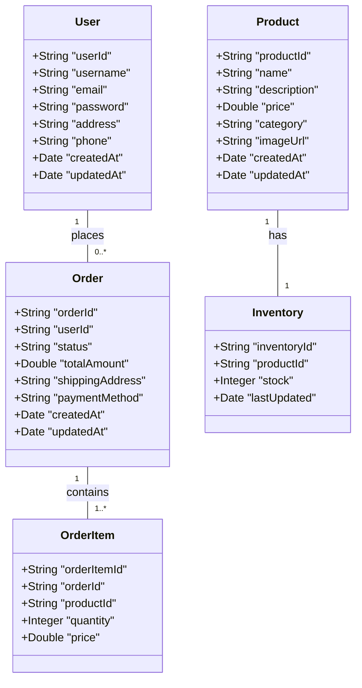

## Technical Guide for E-commerce Platform

### System Architecture

#### Overview of the System Architecture

The e-commerce platform will be built using a microservices architecture to ensure scalability, maintainability, and flexibility. The system will consist of the following services:

- **User Service**: Handles user registration, login, and profile management.
- **Product Service**: Manages product catalog, categories, and search functionality.
- **Order Service**: Processes order placement, payment, and order tracking.
- **Inventory Service**: Manages inventory levels and stock updates.
- **Notification Service**: Sends notifications to users via email and SMS.
- **Admin Service**: Provides an admin dashboard for managing users, products, and orders.

#### Design Patterns and Best Practices

- **Microservices Architecture**: Each service will be independently deployable and scalable.
- **API Gateway**: A single entry point for all client requests, handling routing, authentication, and load balancing.
- **Event-Driven Architecture**: Services will communicate asynchronously using events.
- **Containerization**: Docker containers for consistent deployment and scaling.
- **CI/CD Pipeline**: Automated build, test, and deployment processes.

### Database Design

#### Database Schemas and Relationships

The database will be designed using a relational database management system (RDBMS) to ensure data integrity and consistency. The following schemas will be used:

- **User Schema**: Stores user information, including personal details, addresses, and authentication credentials.
- **Product Schema**: Stores product information, including name, description, price, and images.
- **Order Schema**: Stores order details, including order items, shipping address, and payment information.
- **Inventory Schema**: Stores inventory levels and stock updates.
- **Notification Schema**: Stores notification templates and user preferences.

#### Data Models and Entity-Relationship Diagrams

### API Specifications

#### API Endpoints and Request/Response Formats

The API will follow RESTful principles and use JSON for request/response formats. The following endpoints will be available:

- **User Service**:
  - `POST /api/users/register` - Register a new user.
  - `POST /api/users/login` - Login a user.
  - `GET /api/users/{userId}` - Get user details.
  - `PUT /api/users/{userId}` - Update user details.

- **Product Service**:
  - `GET /api/products` - Get a list of products.
  - `GET /api/products/{productId}` - Get product details.
  - `POST /api/products` - Add a new product.
  - `PUT /api/products/{productId}` - Update product details.
  - `DELETE /api/products/{productId}` - Delete a product.

- **Order Service**:
  - `POST /api/orders` - Place a new order.
  - `GET /api/orders/{orderId}` - Get order details.
  - `PUT /api/orders/{orderId}` - Update order status.
  - `GET /api/orders/user/{userId}` - Get user's order history.

- **Inventory Service**:
  - `GET /api/inventory/{productId}` - Get inventory levels.
  - `PUT /api/inventory/{productId}` - Update inventory levels.

#### Authentication and Authorization Requirements

- **JWT Tokens**: JSON Web Tokens for authentication and authorization.
- **Role-Based Access Control (RBAC)**: Different roles for users, sellers, and admins.
- **API Gateway**: Handles authentication and authorization for all services.

### Authentication and Authorization

#### User Authentication Mechanisms

- **JWT Tokens**: JSON Web Tokens for authentication and authorization.
- **OAuth 2.0**: For third-party authentication and authorization.
- **Password Hashing**: Secure password storage using bcrypt.

#### Role-Based Access Control (RBAC)

- **User Roles**:
  - **Guest**: Unauthenticated users who can browse products and add items to cart.
  - **Member**: Authenticated users who can place orders, manage their profile, and view order history.
  - **Seller**: Users who can manage their products, inventory, and view sales reports.
  - **Admin**: System administrators who can manage all users, products, orders, and system settings.

#### JWT Token Management

- **Access Tokens**: Short-lived tokens for accessing protected resources.
- **Refresh Tokens**: Long-lived tokens for obtaining new access tokens.
- **Token Storage**: Secure storage of tokens in HTTP-only cookies.

### Error Handling

#### Error Handling and Recovery Procedures

- **HTTP Status Codes**: Standard HTTP status codes for error responses.
- **Error Responses**: JSON error responses with error codes and messages.
- **Logging and Monitoring**: Centralized logging and monitoring for error tracking.

#### Logging and Monitoring

- **Centralized Logging**: Aggregates logs from all services.
- **Monitoring**: Real-time monitoring of system performance and health.

### Performance Optimization

#### Performance Optimization Techniques

- **Caching**: Redis for caching frequently accessed data.
- **Load Balancing**: Distributes traffic across multiple instances.
- **Database Optimization**: Indexing and query optimization.

#### Caching Strategies

- **Redis**: In-memory data store for caching.
- **Cache Invalidation**: Strategies for cache invalidation.

#### Load Balancing and Scaling

- **Horizontal Scaling**: Adds more instances to handle increased load.
- **Vertical Scaling**: Increases resources for existing instances.

### Security Considerations

#### Security Best Practices

- **Data Encryption**: Encrypts sensitive data at rest and in transit.
- **Secure Authentication**: Secure authentication mechanisms.
- **Input Validation**: Validates all user inputs to prevent injection attacks.

#### Data Protection and Encryption

- **Encryption**: Encrypts sensitive data using AES-256.
- **Secure Storage**: Secure storage of sensitive data.

#### Compliance and Regulations

- **GDPR**: Compliance with GDPR regulations.
- **PCI DSS**: Compliance with PCI DSS regulations.

### Deployment and Scaling

#### Deployment Strategies

- **Containerization**: Docker containers for consistent deployment.
- **Orchestration**: Kubernetes for container orchestration.
- **CI/CD Pipeline**: Automated build, test, and deployment processes.

#### Scaling and Load Balancing

- **Horizontal Scaling**: Adds more instances to handle increased load.
- **Vertical Scaling**: Increases resources for existing instances.

#### Monitoring and Maintenance

- **Centralized Logging**: Aggregates logs from all services.
- **Monitoring**: Real-time monitoring of system performance and health.

> *Developer Note: This document defines **business requirements only**. All technical implementations (architecture, APIs, database design, etc.) are at the discretion of the development team.*