# User Flows for E-commerce Shopping Mall Platform

## Overview

This document outlines the complete user journeys and scenarios for the e-commerce shopping mall platform, focusing on customer, seller, and admin experiences. It serves as a blueprint for user experience design and development.

## User Registration Flow

### Guest to Customer Journey

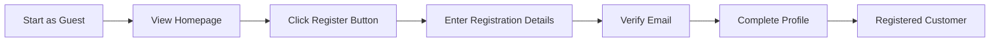

### Address Management Process

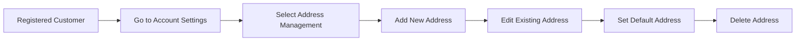

## Product Browsing Flow

### Catalog Navigation

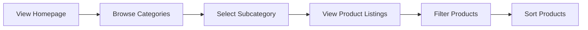

### Search Functionality

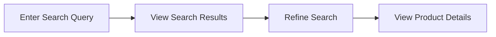

### Product Detail View

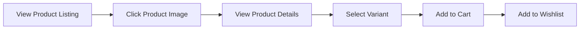

## Product Purchase Flow

### Shopping Cart Management

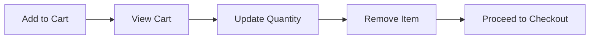

### Wishlist Integration

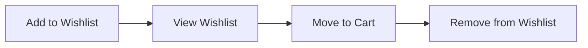

### Checkout Process

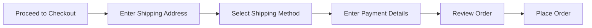

### Payment Processing

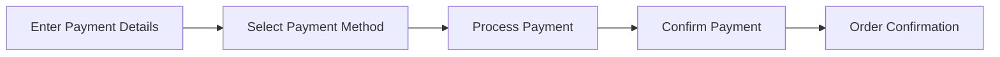

## Order Management Flow

### Order Tracking

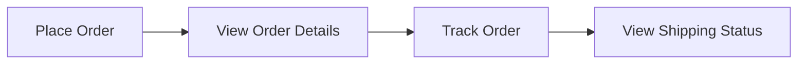

### Shipping Status Updates

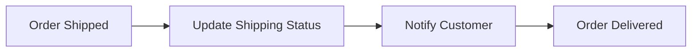

### Order History

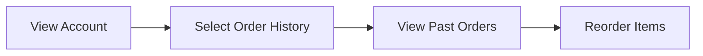

### Cancellation/Refund Requests

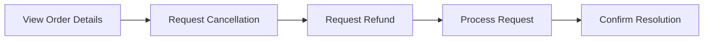

## Seller Product Management Flow

### Product Listing

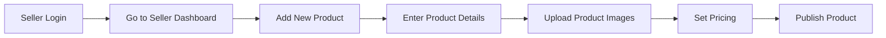

### Inventory Management

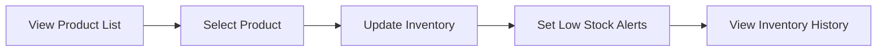

### Order Processing

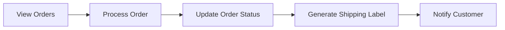

## Admin Dashboard Flow

### User Management

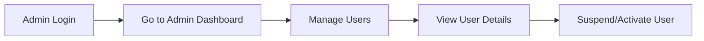

### Product Approval

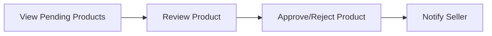

### Order Processing

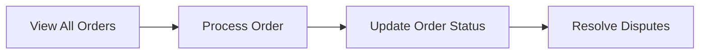

### System Monitoring

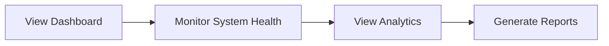

## Functional Requirements

### User Registration and Login

- WHEN a guest clicks the register button, THE system SHALL display the registration form.
- WHEN a user submits registration details, THE system SHALL validate and create a new account.
- WHEN a user requests password reset, THE system SHALL send a reset link to their email.

### Product Catalog and Search

- WHEN a user browses categories, THE system SHALL display relevant product listings.
- WHEN a user searches for products, THE system SHALL return matching results.
- WHEN a user filters products, THE system SHALL update the product listings accordingly.

### Product Variants and SKUs

- WHEN a user selects a product variant, THE system SHALL display the updated details.
- WHEN a user adds a product to cart, THE system SHALL record the selected variant.

### Shopping Cart and Wishlist

- WHEN a user adds a product to cart, THE system SHALL update the cart count.
- WHEN a user views their cart, THE system SHALL display all added items.
- WHEN a user adds a product to wishlist, THE system SHALL save it for later.

### Order Placement and Payment Processing

- WHEN a user proceeds to checkout, THE system SHALL display the order summary.
- WHEN a user enters payment details, THE system SHALL process the payment.
- WHEN payment is successful, THE system SHALL generate an order confirmation.

### Order Tracking and Shipping Status Updates

- WHEN an order is shipped, THE system SHALL update the shipping status.
- WHEN a user tracks their order, THE system SHALL display the current status.

### Product Reviews and Ratings

- WHEN a user submits a product review, THE system SHALL save the review.
- WHEN a user views product details, THE system SHALL display existing reviews.

### Seller Accounts and Product Management

- WHEN a seller adds a new product, THE system SHALL validate and publish the product.
- WHEN a seller updates inventory, THE system SHALL reflect the changes.

### Inventory Management

- WHEN inventory levels are low, THE system SHALL notify the seller.
- WHEN a seller views inventory, THE system SHALL display current stock levels.

### Order History and Cancellation/Refund Requests

- WHEN a user views order history, THE system SHALL display past orders.
- WHEN a user requests cancellation, THE system SHALL process the request.

### Admin Dashboard

- WHEN an admin manages users, THE system SHALL allow user suspension/activation.
- WHEN an admin approves products, THE system SHALL update the product status.
- WHEN an admin processes orders, THE system SHALL update the order status.

## Conclusion

This document provides a comprehensive overview of the user flows and functional requirements for the e-commerce shopping mall platform. It serves as a foundation for user experience design and development, ensuring that all user journeys are well-understood and implemented effectively.

> *Developer Note: This document defines **business requirements only**. All technical implementations (architecture, APIs, database design, etc.) are at the discretion of the development team.*