# User Flow Documentation for E-commerce Shopping Mall Platform

## Table of Contents

1. [User Registration and Login](#user-registration-and-login)
2. [Product Catalog and Search](#product-catalog-and-search)
3. [Product Variants and Options](#product-variants-and-options)
4. [Shopping Cart and Wishlist](#shopping-cart-and-wishlist)
5. [Order Placement and Payment Processing](#order-placement-and-payment-processing)
6. [Order Tracking and Shipping Status Updates](#order-tracking-and-shipping-status-updates)
7. [Product Reviews and Ratings](#product-reviews-and-ratings)
8. [Seller Accounts and Product Management](#seller-accounts-and-product-management)
9. [Inventory Management](#inventory-management)
10. [Order History and Cancellation/Refund Requests](#order-history-and-cancellationrefund-requests)
11. [Admin Dashboard and Order/Product Management](#admin-dashboard-and-orderproduct-management)

## User Registration and Login

### User Flow Diagram

```mermaid
flowchart LR
    A["Start"] --> B["User selects 'Register'"]
    B --> C["User enters email, password, and personal information"]
    C --> D["System validates information"]
    D --> E["User receives verification email"]
    E --> F["User clicks verification link"]
    F --> G["User account created"]
    G --> H["User logs in with email and password"]
    H --> I["User enters address information"]
    I --> J["User address saved"]
    J --> K["User can now browse products"]
```

### User Interactions and Decision Points

- User selects 'Register' or 'Login'
- System validates email format and password strength
- User receives verification email
- User clicks verification link
- User enters address information
- System saves address information

### User Feedback and Expectations

- Users expect a smooth registration process
- Users expect verification emails to arrive quickly
- Users expect to be able to manage their addresses

### User Onboarding and Retention Considerations

- Simplify the registration process to reduce friction
- Ensure verification emails are sent promptly
- Allow users to manage their addresses easily

### User Testing and Validation Scenarios

- Test registration with valid and invalid email formats
- Test password strength requirements
- Test verification email delivery and link functionality
- Test address management functionality

## Product Catalog and Search

### User Flow Diagram

```mermaid
flowchart LR
    A["User logs in"] --> B["User browses product categories"]
    B --> C["User selects a product"]
    C --> D["User views product details"]
    D --> E["User searches for products"]
    E --> F["System displays search results"]
    F --> G["User filters search results"]
    G --> H["User sorts search results"]
    H --> I["User selects a product"]
```

### User Interactions and Decision Points

- User browses product categories
- User selects a product
- User views product details
- User searches for products
- System displays search results
- User filters and sorts search results

### User Feedback and Expectations

- Users expect a comprehensive product catalog
- Users expect fast and accurate search results
- Users expect the ability to filter and sort products

### User Onboarding and Retention Considerations

- Ensure the product catalog is easy to navigate
- Optimize search functionality for speed and accuracy
- Provide clear filtering and sorting options

### User Testing and Validation Scenarios

- Test product category navigation
- Test product detail pages
- Test search functionality with various keywords
- Test filtering and sorting options

## Product Variants and Options

### User Flow Diagram

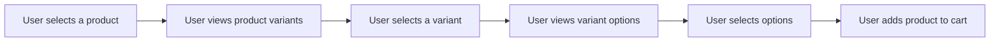

### User Interactions and Decision Points

- User views product variants
- User selects a variant
- User views variant options
- User selects options
- User adds product to cart

### User Feedback and Expectations

- Users expect to see all available product variants
- Users expect to be able to select options for each variant
- Users expect to add the selected product to their cart

### User Onboarding and Retention Considerations

- Display all available product variants clearly
- Provide clear options for each variant
- Ensure the add-to-cart process is straightforward

### User Testing and Validation Scenarios

- Test product variant display
- Test variant selection functionality
- Test option selection functionality
- Test add-to-cart process

## Shopping Cart and Wishlist

### User Flow Diagram

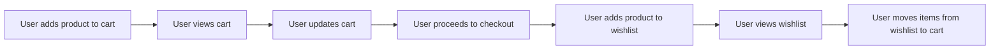

### User Interactions and Decision Points

- User adds product to cart
- User views cart
- User updates cart
- User proceeds to checkout
- User adds product to wishlist
- User views wishlist
- User moves items from wishlist to cart

### User Feedback and Expectations

- Users expect to see all items in their cart
- Users expect to be able to update quantities and remove items
- Users expect to proceed to checkout easily
- Users expect to be able to save items for later
- Users expect to move items from wishlist to cart

### User Onboarding and Retention Considerations

- Display cart contents clearly
- Provide easy-to-use update and remove options
- Ensure the checkout process is straightforward
- Allow users to save items for later
- Provide a seamless transition from wishlist to cart

### User Testing and Validation Scenarios

- Test add-to-cart functionality
- Test cart view and update functionality
- Test checkout process
- Test wishlist functionality
- Test transition from wishlist to cart

## Order Placement and Payment Processing

### User Flow Diagram

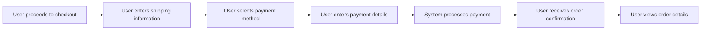

### User Interactions and Decision Points

- User proceeds to checkout
- User enters shipping information
- User selects payment method
- User enters payment details
- System processes payment
- User receives order confirmation
- User views order details

### User Feedback and Expectations

- Users expect a smooth checkout process
- Users expect to see order confirmation details
- Users expect to view order details easily

### User Onboarding and Retention Considerations

- Simplify the checkout process to reduce friction
- Ensure order confirmation details are clear and comprehensive
- Allow users to view order details easily

### User Testing and Validation Scenarios

- Test checkout process with various payment methods
- Test order confirmation details
- Test order detail view functionality

## Order Tracking and Shipping Status Updates

### User Flow Diagram

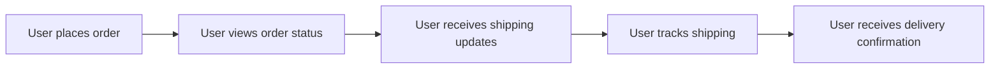

### User Interactions and Decision Points

- User views order status
- User receives shipping updates
- User tracks shipping
- User receives delivery confirmation

### User Feedback and Expectations

- Users expect to see order status updates
- Users expect to receive shipping updates
- Users expect to track shipping easily
- Users expect to receive delivery confirmation

### User Onboarding and Retention Considerations

- Provide clear order status updates
- Ensure shipping updates are sent promptly
- Allow users to track shipping easily
- Provide delivery confirmation

### User Testing and Validation Scenarios

- Test order status updates
- Test shipping update notifications
- Test shipping tracking functionality
- Test delivery confirmation

## Product Reviews and Ratings

### User Flow Diagram

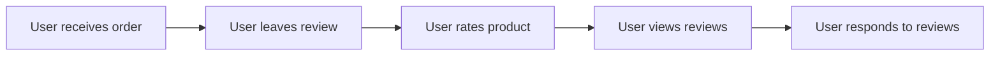

### User Interactions and Decision Points

- User leaves review
- User rates product
- User views reviews
- User responds to reviews

### User Feedback and Expectations

- Users expect to be able to leave reviews
- Users expect to be able to rate products
- Users expect to view reviews easily
- Users expect to respond to reviews

### User Onboarding and Retention Considerations

- Allow users to leave reviews easily
- Provide clear rating options
- Display reviews prominently
- Allow users to respond to reviews

### User Testing and Validation Scenarios

- Test review submission functionality
- Test rating functionality
- Test review display
- Test review response functionality

## Seller Accounts and Product Management

### User Flow Diagram

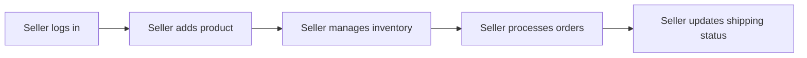

### User Interactions and Decision Points

- Seller adds product
- Seller manages inventory
- Seller processes orders
- Seller updates shipping status

### User Feedback and Expectations

- Sellers expect to be able to add products easily
- Sellers expect to manage inventory efficiently
- Sellers expect to process orders quickly
- Sellers expect to update shipping status easily

### User Onboarding and Retention Considerations

- Simplify the product addition process
- Provide efficient inventory management tools
- Streamline order processing
- Allow easy shipping status updates

### User Testing and Validation Scenarios

- Test product addition functionality
- Test inventory management tools
- Test order processing functionality
- Test shipping status update functionality

## Inventory Management

### User Flow Diagram

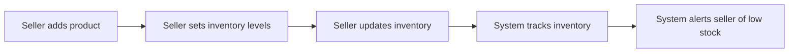

### User Interactions and Decision Points

- Seller sets inventory levels
- Seller updates inventory
- System tracks inventory
- System alerts seller of low stock

### User Feedback and Expectations

- Sellers expect to set inventory levels easily
- Sellers expect to update inventory efficiently
- Sellers expect the system to track inventory accurately
- Sellers expect alerts for low stock

### User Onboarding and Retention Considerations

- Provide easy inventory level setting
- Allow efficient inventory updates
- Ensure accurate inventory tracking
- Send timely low stock alerts

### User Testing and Validation Scenarios

- Test inventory level setting functionality
- Test inventory update functionality
- Test inventory tracking
- Test low stock alerts

## Order History and Cancellation/Refund Requests

### User Flow Diagram

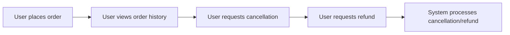

### User Interactions and Decision Points

- User views order history
- User requests cancellation
- User requests refund
- System processes cancellation/refund

### User Feedback and Expectations

- Users expect to view order history easily
- Users expect to request cancellations easily
- Users expect to request refunds easily
- Users expect the system to process cancellations and refunds promptly

### User Onboarding and Retention Considerations

- Display order history clearly
- Allow easy cancellation requests
- Allow easy refund requests
- Ensure prompt processing of cancellations and refunds

### User Testing and Validation Scenarios

- Test order history display
- Test cancellation request functionality
- Test refund request functionality
- Test cancellation and refund processing

## Admin Dashboard and Order/Product Management

### User Flow Diagram

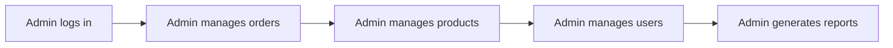

### User Interactions and Decision Points

- Admin manages orders
- Admin manages products
- Admin manages users
- Admin generates reports

### User Feedback and Expectations

- Admins expect to manage orders efficiently
- Admins expect to manage products easily
- Admins expect to manage users efficiently
- Admins expect to generate reports quickly

### User Onboarding and Retention Considerations

- Provide efficient order management tools
- Allow easy product management
- Streamline user management
- Ensure quick report generation

### User Testing and Validation Scenarios

- Test order management functionality
- Test product management functionality
- Test user management functionality
- Test report generation

> *Developer Note: This document defines **business requirements only**. All technical implementations (architecture, APIs, database design, etc.) are at the discretion of the development team.*