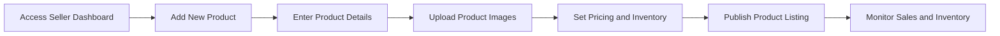
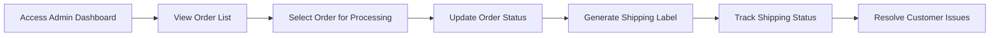

# E-commerce Shopping Mall Platform Requirements Analysis

## Service Vision and Overview

The e-commerce shopping mall platform aims to provide a comprehensive online shopping experience for customers, while also offering sellers a platform to manage their products and orders. The platform will be designed to be scalable, secure, and user-friendly, with a focus on delivering a seamless shopping experience.

## Problem Definition

The current e-commerce landscape is highly competitive, with numerous platforms vying for customer attention. Many existing platforms suffer from poor user experiences, lack of customization options, and limited seller support. Additionally, there is a need for a platform that can handle high traffic volumes and provide real-time order tracking and management.

## Core Value Proposition

The core value proposition of the e-commerce shopping mall platform is to provide a seamless, secure, and customizable online shopping experience for customers, while also offering sellers a comprehensive platform to manage their products and orders. The platform will be designed to be scalable, reliable, and user-friendly, with a focus on delivering real-time order tracking and management.

## User Personas and Scenarios

### Customer Persona

Customers are the primary users of the e-commerce platform, responsible for browsing products, adding items to cart, and placing orders.

#### Goals
- Find and purchase desired products
- Track order status
- Leave reviews and ratings
- Manage account and address information

#### Pain Points
- Difficulty finding specific products
- Complex checkout process
- Lack of order tracking information
- Poor customer support experience

#### Motivations
- Convenience and time savings
- Competitive pricing
- Reliable delivery
- Positive customer reviews

### Seller Persona

Sellers are users who list and manage their products on the platform, process orders, and manage inventory.

#### Goals
- List and manage products
- Process orders and fulfill customer requests
- Track sales and inventory levels
- Communicate with customers

#### Pain Points
- Complex product listing process
- Difficulty managing inventory
- Lack of order tracking information
- Poor customer communication

#### Motivations
- Increased sales and revenue
- Expanded customer base
- Efficient order management
- Positive customer feedback

### Admin Persona

Admins are responsible for managing the overall platform, including user accounts, products, and orders.

#### Goals
- Manage user accounts and permissions
- Oversee product listings and inventory
- Monitor order processing and fulfillment
- Ensure platform security and compliance

#### Pain Points
- Complex user management
- Difficulty tracking platform performance
- Lack of real-time monitoring
- Poor incident response

#### Motivations
- Efficient platform management
- Improved user experience
- Enhanced security and compliance
- Positive platform performance

### User Scenarios

#### Scenario 1: Product Search and Purchase

#### Key Steps
1. Start on homepage
2. Search for product
3. View product details
4. Add to cart
5. Proceed to checkout
6. Enter shipping information
7. Select payment method
8. Confirm order
9. View order confirmation

#### Scenario 2: Product Listing and Management

#### Key Steps
1. Access seller dashboard
2. Add new product
3. Enter product details
4. Upload product images
5. Set pricing and inventory
6. Publish product listing
7. Monitor sales and inventory

#### Scenario 3: Order Management and Fulfillment

#### Key Steps
1. Access admin dashboard
2. View order list
3. Select order for processing
4. Update order status
5. Generate shipping label
6. Track shipping status
7. Resolve customer issues

## Functional Requirements

### User Registration and Login

- WHEN a user visits the platform, THEY SHALL be able to register for an account
- WHEN a user registers, THEY SHALL provide their email address, password, and personal information
- WHEN a user registers, THEY SHALL receive a confirmation email to verify their account
- WHEN a user logs in, THEY SHALL be able to manage their account and address information

### Product Catalog and Search

- WHEN a user searches for a product, THEY SHALL be able to filter results by category, price, and rating
- WHEN a user views a product, THEY SHALL see detailed information, including images, descriptions, and reviews
- WHEN a user searches for a product, THEY SHALL be able to sort results by relevance, price, and rating

### Product Variants and SKUs

- WHEN a user views a product, THEY SHALL see available variants, including colors, sizes, and options
- WHEN a user selects a variant, THEY SHALL see the updated price and availability
- WHEN a user adds a product to cart, THEY SHALL specify the selected variant

### Shopping Cart and Wishlist

- WHEN a user adds a product to cart, THEY SHALL see the updated cart total and item count
- WHEN a user views their cart, THEY SHALL be able to update quantities, remove items, and proceed to checkout
- WHEN a user adds a product to wishlist, THEY SHALL be able to view and manage their wishlist

### Order Placement and Payment Processing

- WHEN a user proceeds to checkout, THEY SHALL enter their shipping and payment information
- WHEN a user places an order, THEY SHALL receive an order confirmation email
- WHEN a user pays for an order, THEY SHALL be able to select from multiple payment methods

### Order Tracking and Shipping Status Updates

- WHEN a user places an order, THEY SHALL receive real-time updates on order status
- WHEN a user views their order, THEY SHALL see detailed information, including tracking number and shipping carrier
- WHEN a user tracks their order, THEY SHALL receive notifications for shipping status updates

### Product Reviews and Ratings

- WHEN a user purchases a product, THEY SHALL be able to leave a review and rating
- WHEN a user views a product, THEY SHALL see average rating and customer reviews
- WHEN a user leaves a review, THEY SHALL be able to include text, images, and a rating

### Seller Accounts and Product Management

- WHEN a seller registers, THEY SHALL be able to create a seller account and manage their products
- WHEN a seller adds a product, THEY SHALL provide detailed information, including images, descriptions, and pricing
- WHEN a seller manages their products, THEY SHALL be able to update inventory, pricing, and availability

### Inventory Management

- WHEN a seller adds a product, THEY SHALL specify the available variants and quantities
- WHEN a seller manages inventory, THEY SHALL be able to update stock levels and availability
- WHEN a seller views inventory, THEY SHALL see real-time updates on stock levels and sales

### Order History and Cancellation/Refund Requests

- WHEN a user views their order history, THEY SHALL see detailed information, including order status and tracking number
- WHEN a user cancels an order, THEY SHALL receive a confirmation email
- WHEN a user requests a refund, THEY SHALL be able to submit a refund request and track its status

### Admin Dashboard

- WHEN an admin accesses the dashboard, THEY SHALL be able to manage user accounts, products, and orders
- WHEN an admin manages users, THEY SHALL be able to update permissions, suspend accounts, and view user activity
- WHEN an admin manages products, THEY SHALL be able to approve listings, remove products, and view sales data

## Technical Architecture

### System Architecture

The e-commerce shopping mall platform will be designed using a microservices architecture, with each service responsible for a specific function. The platform will be built using modern web technologies, including React for the frontend, Node.js for the backend, and MongoDB for the database.

### Technology Stack

- Frontend: React, Redux, Material-UI
- Backend: Node.js, Express, MongoDB
- Infrastructure: AWS, Docker, Kubernetes
- Monitoring: Prometheus, Grafana
- Security: JWT, OAuth, SSL/TLS

### Infrastructure Requirements

- The platform will be hosted on AWS, with a focus on scalability and reliability
- The platform will use Docker containers for deployment, with Kubernetes for orchestration
- The platform will be monitored using Prometheus and Grafana for real-time performance tracking

### Data Flow

- User data will be stored in MongoDB, with sensitive information encrypted and stored separately
- Product data will be stored in MongoDB, with images stored in AWS S3
- Order data will be stored in MongoDB, with real-time updates provided to users

### Security and Compliance

- The platform will use JWT for authentication and OAuth for authorization
- The platform will be compliant with GDPR and CCPA regulations, with a focus on data privacy and security
- The platform will use SSL/TLS for secure communication, with regular security audits and updates

### Performance and Scalability

- The platform will be designed to handle high traffic volumes, with a focus on performance and scalability
- The platform will use caching and load balancing to ensure fast response times and reliable performance
- The platform will be monitored for performance metrics, with automated scaling based on traffic patterns

## Database Schema

### Database Schema

The e-commerce shopping mall platform will use a MongoDB database, with the following collections:

- Users: Stores user account information, including email, password, and personal details
- Products: Stores product information, including name, description, price, and images
- Orders: Stores order information, including user, products, and shipping details
- Reviews: Stores product reviews and ratings, including user, product, and review text
- Carts: Stores shopping cart information, including user and products
- Wishlists: Stores wishlist information, including user and products

### Data Models

- User Model: Contains fields for user account information, including email, password, and personal details
- Product Model: Contains fields for product information, including name, description, price, and images
- Order Model: Contains fields for order information, including user, products, and shipping details
- Review Model: Contains fields for product reviews and ratings, including user, product, and review text
- Cart Model: Contains fields for shopping cart information, including user and products
- Wishlist Model: Contains fields for wishlist information, including user and products

### Relationships

- Users can have many orders, reviews, and wishlists
- Products can have many reviews and orders
- Orders can have many products
- Reviews can have one user and one product
- Carts can have many products
- Wishlists can have many products

### Indexes and Constraints

- Indexes will be created on frequently queried fields, including email, product name, and order status
- Constraints will be enforced on fields, including email uniqueness and password requirements

### Data Migration Strategy

- The platform will use a data migration strategy to ensure seamless transitions between versions
- The platform will use automated testing to ensure data integrity and consistency during migrations

## API Specifications

### API Endpoints

- User Registration and Login: POST /api/users/register, POST /api/users/login
- Product Catalog and Search: GET /api/products, GET /api/products/search
- Product Variants and SKUs: GET /api/products/{id}/variants
- Shopping Cart and Wishlist: POST /api/carts, GET /api/carts, DELETE /api/carts/{id}
- Order Placement and Payment Processing: POST /api/orders, GET /api/orders/{id}
- Order Tracking and Shipping Status Updates: GET /api/orders/{id}/tracking
- Product Reviews and Ratings: POST /api/reviews, GET /api/reviews
- Seller Accounts and Product Management: POST /api/sellers, GET /api/sellers/products
- Inventory Management: GET /api/inventory, PUT /api/inventory/{id}
- Order History and Cancellation/Refund Requests: GET /api/orders/history, PUT /api/orders/{id}/cancel
- Admin Dashboard: GET /api/admin/users, GET /api/admin/products, GET /api/admin/orders

### Request and Response Formats

- Requests will be sent in JSON format, with required fields specified in the API documentation
- Responses will be sent in JSON format, with status codes and error messages as appropriate

### Authentication and Authorization

- The platform will use JWT for authentication, with tokens issued upon successful login
- The platform will use role-based access control for authorization, with roles assigned to users upon registration

### Error Handling

- The platform will use standardized error codes and messages for API responses
- The platform will log errors for debugging and monitoring purposes

### Rate Limiting and Throttling

- The platform will use rate limiting and throttling to prevent abuse and ensure fair usage
- The platform will monitor API usage and adjust limits as necessary to maintain performance

## Testing Strategy

### Testing Strategy

The e-commerce shopping mall platform will use a comprehensive testing strategy, including unit tests, integration tests, and end-to-end tests.

### Quality Assurance Plan

- The platform will use a quality assurance plan to ensure that all features are thoroughly tested and meet requirements
- The platform will use automated testing to ensure consistency and reliability across different environments

### Test Cases and Scenarios

- The platform will use test cases and scenarios to cover all user personas and features
- The platform will use real-world scenarios to ensure that the platform meets user needs and expectations

### Performance Testing

- The platform will use performance testing to ensure that the platform can handle high traffic volumes and maintain performance
- The platform will use load testing to simulate real-world usage patterns and identify potential bottlenecks

### Security Testing

- The platform will use security testing to ensure that the platform is secure and compliant with regulations
- The platform will use penetration testing to identify and address vulnerabilities and security risks

### User Acceptance Testing

- The platform will use user acceptance testing to ensure that the platform meets user requirements and expectations
- The platform will use beta testing to gather feedback and identify areas for improvement

## Deployment Strategy

### Deployment Strategy

The e-commerce shopping mall platform will use a continuous deployment strategy, with automated builds, tests, and deployments to ensure fast and reliable updates.

### Monitoring and Logging

- The platform will use monitoring and logging to ensure that the platform is performing as expected and to identify and address issues
- The platform will use real-time monitoring to detect and respond to issues quickly and effectively

### Incident Response Plan

- The platform will use an incident response plan to ensure that issues are addressed quickly and effectively
- The platform will use a dedicated team to monitor the platform and respond to issues as they arise

### Continuous Integration and Deployment

- The platform will use continuous integration and deployment to ensure that updates are deployed quickly and reliably
- The platform will use automated testing to ensure that updates do not introduce issues or regressions

### Scalability and Load Balancing

- The platform will use scalability and load balancing to ensure that the platform can handle high traffic volumes and maintain performance
- The platform will use automated scaling to adjust resources based on traffic patterns and demand

> *Developer Note: This document defines **business requirements only**. All technical implementations (architecture, APIs, database design, etc.) are at the discretion of the development team.*