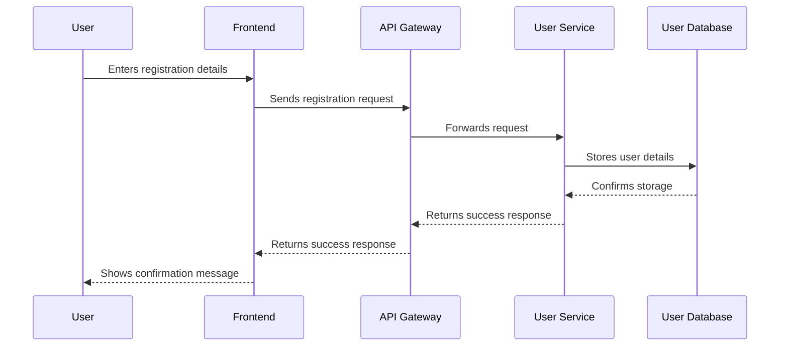
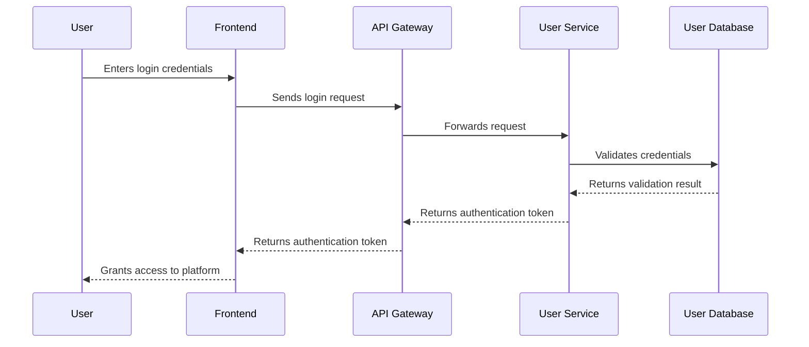
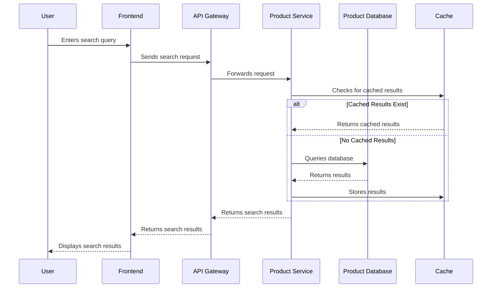
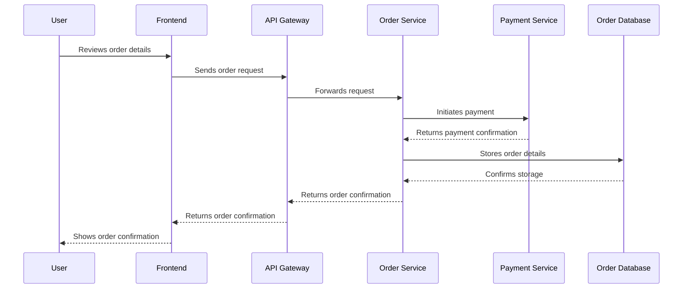

# E-Commerce Shopping Mall Platform Requirements Analysis

## Service Vision & Overview

The e-commerce shopping mall platform aims to provide a comprehensive online shopping experience for customers while offering robust tools for sellers and administrators. The platform will facilitate product discovery, purchase, and management through an intuitive interface and secure transaction processing.

## Problem Definition

The current market lacks a unified platform that seamlessly integrates all aspects of e-commerce, from product listing and discovery to secure transactions and order management. Existing solutions often fragment these functionalities across multiple platforms, leading to a disjointed user experience. Additionally, there is a need for enhanced seller tools and administrative oversight to ensure platform integrity and user satisfaction.

## Core Value Proposition

The core value proposition of the e-commerce shopping mall platform is to offer a unified, user-friendly, and secure e-commerce solution that integrates all essential functionalities into a single platform. This integration will enhance the shopping experience for customers, provide comprehensive tools for sellers, and offer robust administrative capabilities for platform management.

## User Registration and Login

### User Registration Flow

### User Login Flow

### Address Management

Users shall be able to add, edit, and delete their shipping addresses. The system shall validate address formats and ensure that at least one address is available for order placement.

## Product Catalog and Search

### Product Listing

The platform shall display products in a grid layout with images, names, prices, and ratings. Each product listing shall include a link to the product detail page.

### Product Search

### Category Navigation

The platform shall provide a category navigation menu that allows users to browse products by category. Each category shall have subcategories for more granular navigation.

## Product Variants and SKUs

### Variant Management

Sellers shall be able to create and manage product variants based on attributes such as color, size, and material. Each variant shall have a unique SKU and inventory level.

### Variant Selection

Users shall be able to select product variants from the product detail page. The system shall display the available variants and update the product image and price accordingly.

## Shopping Cart and Wishlist

### Shopping Cart

Users shall be able to add products to their shopping cart, view the cart contents, and proceed to checkout. The system shall calculate the total price, including taxes and shipping costs.

### Wishlist

Users shall be able to add products to their wishlist for future reference. The system shall allow users to move items from their wishlist to their shopping cart.

## Order Placement and Payment Processing

### Order Placement Flow

### Payment Processing

The platform shall support multiple payment methods, including credit cards, PayPal, and bank transfers. The system shall ensure secure payment processing and provide users with order confirmation and receipts.

## Order Tracking and Shipping Status Updates

### Order Tracking

Users shall be able to track the status of their orders, including processing, shipping, and delivery. The system shall provide real-time updates on the order status.

### Shipping Status Updates

Sellers shall be able to update the shipping status of orders, and the system shall notify users of any changes. The platform shall support integration with shipping carriers for automated tracking updates.

## Product Reviews and Ratings

### Review Submission

Users shall be able to submit reviews and ratings for products they have purchased. The system shall validate reviews to ensure they meet quality standards.

### Review Moderation

Administrators shall be able to moderate reviews to ensure they comply with platform guidelines. The system shall provide tools for flagging and removing inappropriate reviews.

## Seller Accounts and Product Management

### Seller Registration

Sellers shall be able to register for accounts and provide necessary business information. The system shall verify seller identities and approve accounts for listing products.

### Product Management

Sellers shall be able to add, edit, and delete their products, including product details, images, and pricing. The system shall provide tools for managing product variants and inventory levels.

## Inventory Management

### Inventory Tracking

Sellers shall be able to track inventory levels for their products, including variants. The system shall provide alerts for low inventory levels and support bulk inventory updates.

### Inventory Adjustments

Administrators shall be able to adjust inventory levels and manage stock for all products. The system shall provide tools for bulk updates and inventory audits.

## Order History and Cancellation/Refund Requests

### Order History

Users shall be able to view their order history, including past orders and their statuses. The system shall provide detailed order information, including products, quantities, and prices.

### Cancellation/Refund Requests

Users shall be able to request order cancellations or refunds. The system shall process these requests based on the order status and provide users with updates on the request status.

## Admin Dashboard

### Order Management

Administrators shall be able to view and manage all orders, including processing, shipping, and delivery. The system shall provide tools for order tracking, status updates, and dispute resolution.

### Product Management

Administrators shall be able to manage all products, including approval, rejection, and removal. The system shall provide tools for product categorization, tagging, and search optimization.

### User Management

Administrators shall be able to manage user accounts, including registration approval, account suspension, and role assignments. The system shall provide tools for user search, filtering, and reporting.

### Analytics and Reporting

Administrators shall be able to access analytics and reports on platform performance, including sales, user activity, and product popularity. The system shall provide tools for generating custom reports and exporting data.

> *Developer Note: This document defines **business requirements only**. All technical implementations (architecture, APIs, database design, etc.) are at the discretion of the development team.*