# E-Commerce Platform Requirements Analysis

## 1. Service Vision & Overview

### 1.1 Vision Statement

The e-commerce platform aims to revolutionize online shopping by providing a seamless, intuitive, and secure shopping experience for customers while offering powerful tools for sellers and administrators.

### 1.2 Core Value Proposition

- **For Customers**: Discover and purchase products from a vast catalog with personalized recommendations, secure checkout, and real-time order tracking.
- **For Sellers**: Manage products, track inventory, and process orders with an easy-to-use dashboard.
- **For Administrators**: Oversee platform operations, manage users, and ensure compliance with a comprehensive admin dashboard.

## 2. Problem Definition

### 2.1 Current Challenges

- Fragmented shopping experiences across multiple platforms
- Lack of personalized recommendations
- Complex checkout processes
- Inconsistent seller tools and support
- Limited order tracking and customer service integration

### 2.2 Target Audience

- **Customers**: Online shoppers of all ages and demographics
- **Sellers**: Small to medium-sized businesses looking to expand their online presence
- **Administrators**: Platform managers responsible for overseeing operations and ensuring compliance

## 3. Functional Requirements

### 3.1 User Registration and Login

#### 3.1.1 User Registration Flow

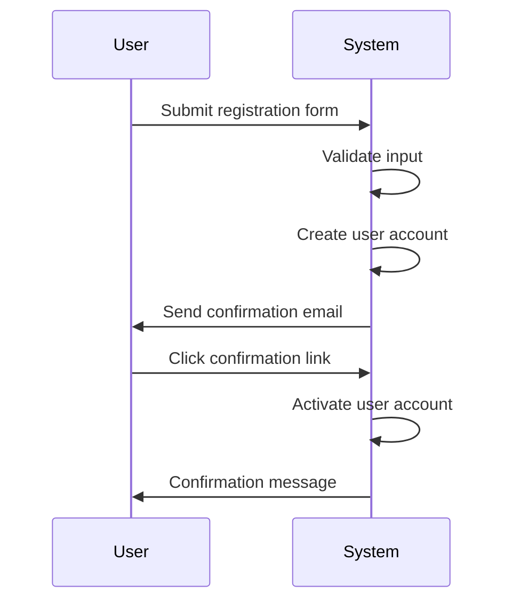

#### 3.1.2 Login Flow

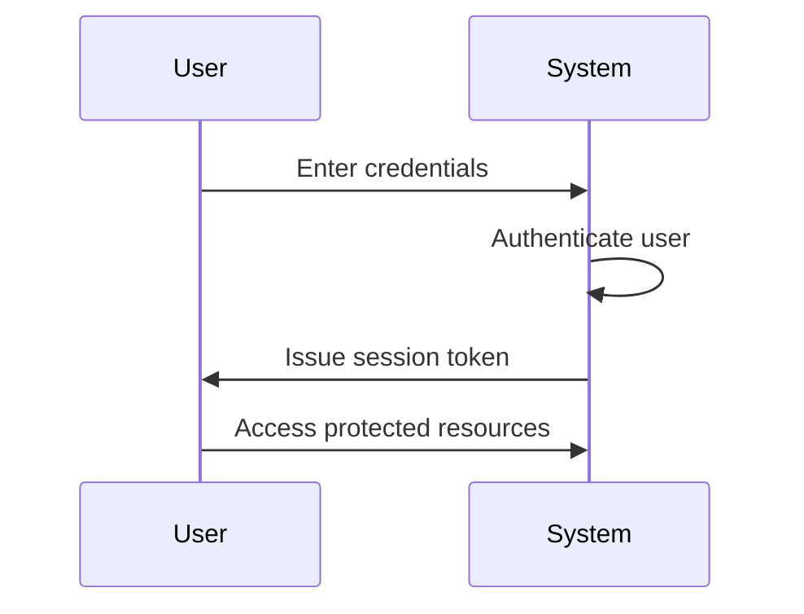

### 3.2 Product Catalog and Search

#### 3.2.1 Product Listing

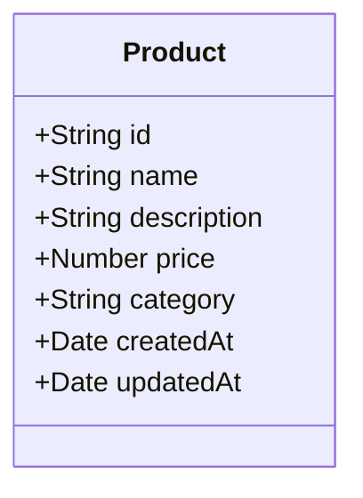

#### 3.2.2 Search Functionality

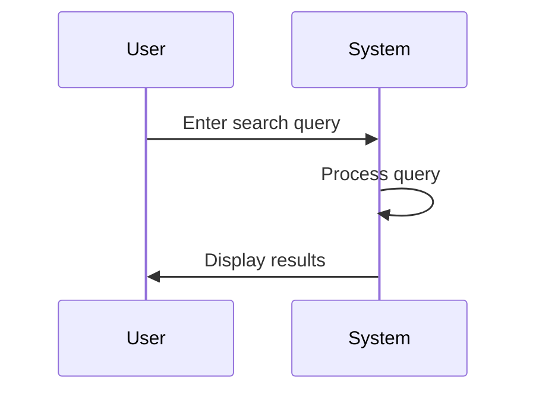

### 3.3 Product Variants and SKUs

#### 3.3.1 Variant Management

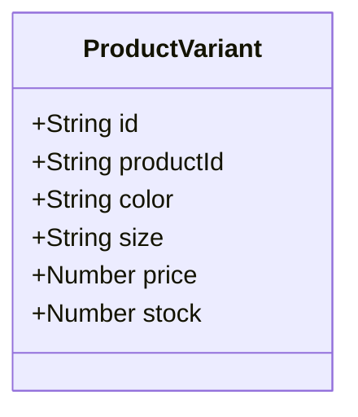

#### 3.3.2 SKU Tracking

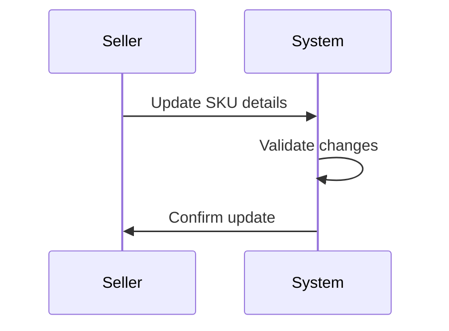

### 3.4 Shopping Cart and Wishlist

#### 3.4.1 Cart Management

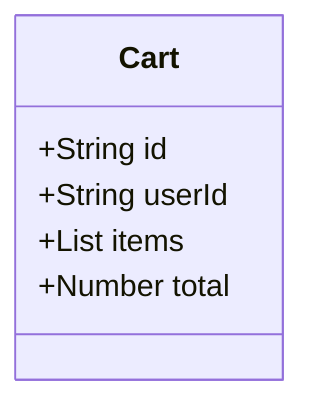

#### 3.4.2 Wishlist Management

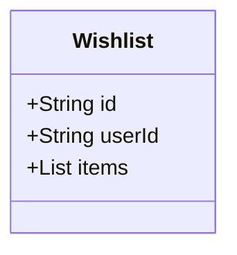

### 3.5 Order Placement and Payment Processing

#### 3.5.1 Order Flow

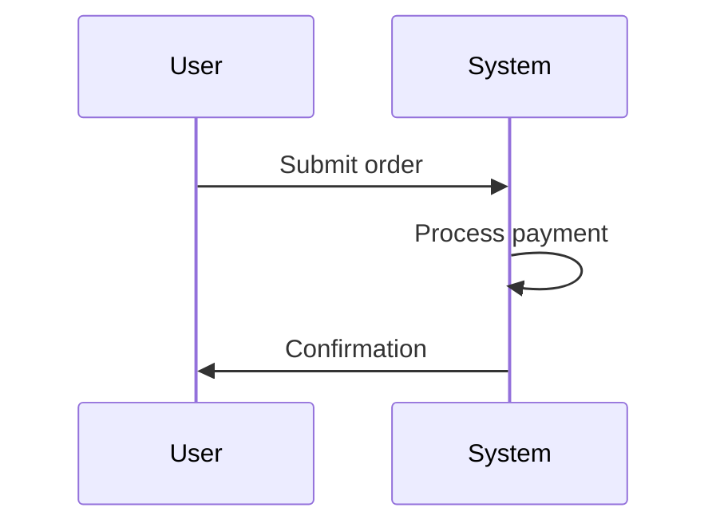

#### 3.5.2 Payment Processing

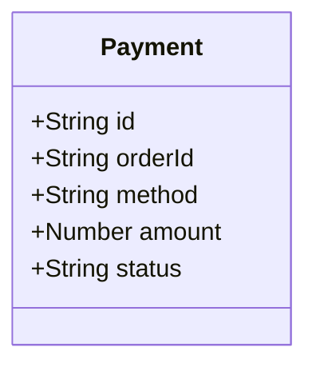

### 3.6 Order Tracking and Shipping Status Updates

#### 3.6.1 Tracking Flow

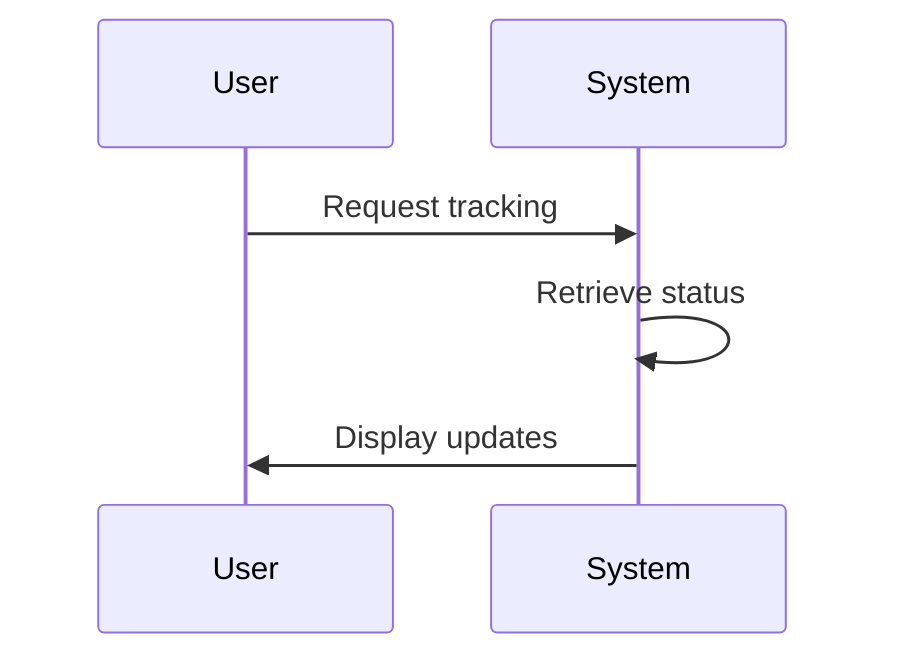

#### 3.6.2 Shipping Notifications

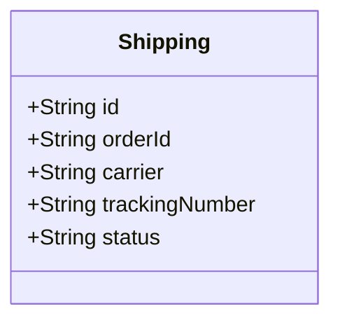

### 3.7 Product Reviews and Ratings

#### 3.7.1 Review Submission


#### 3.7.2 Rating System

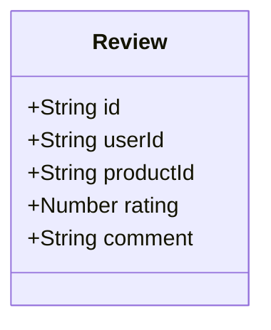

### 3.8 Seller Accounts and Product Management

#### 3.8.1 Seller Registration

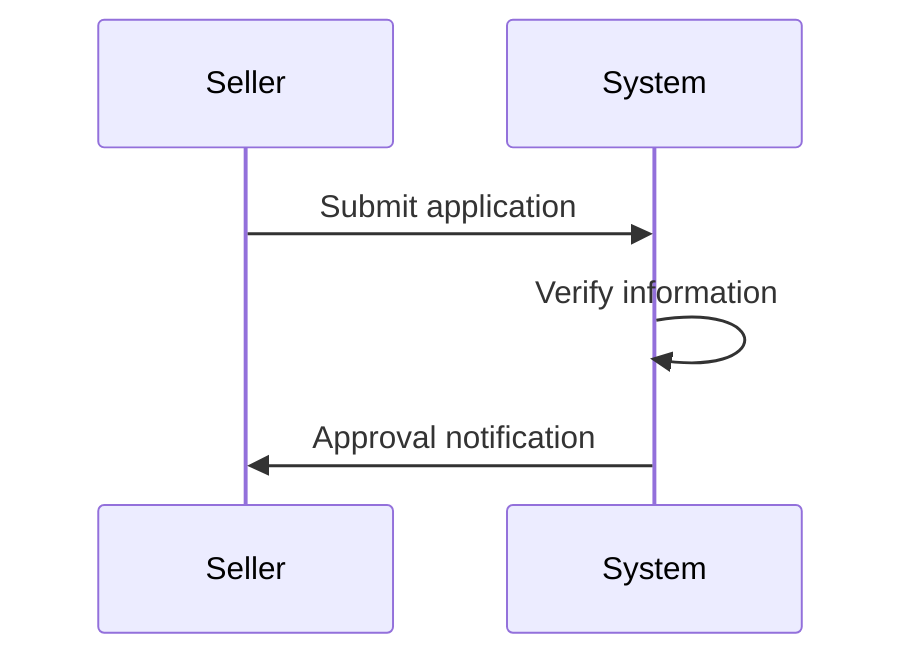

#### 3.8.2 Product Management

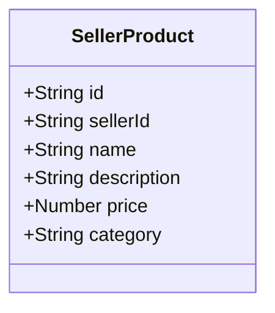

### 3.9 Inventory Management

#### 3.9.1 Inventory Tracking

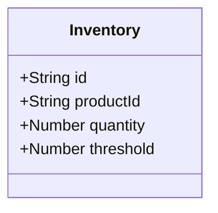

#### 3.9.2 Stock Alerts

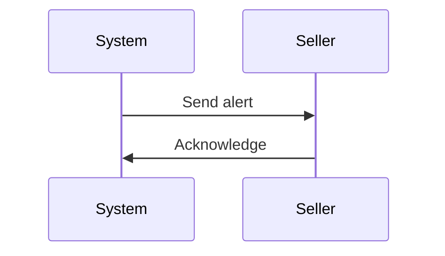

### 3.10 Order History and Cancellation/Refund Requests

#### 3.10.1 Order History

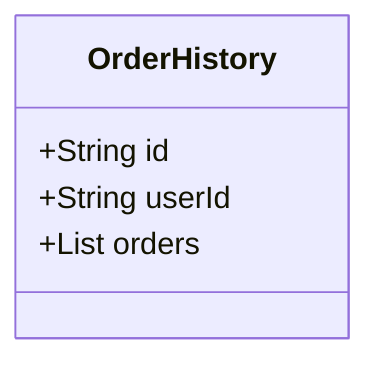

#### 3.10.2 Cancellation/Refund Flow

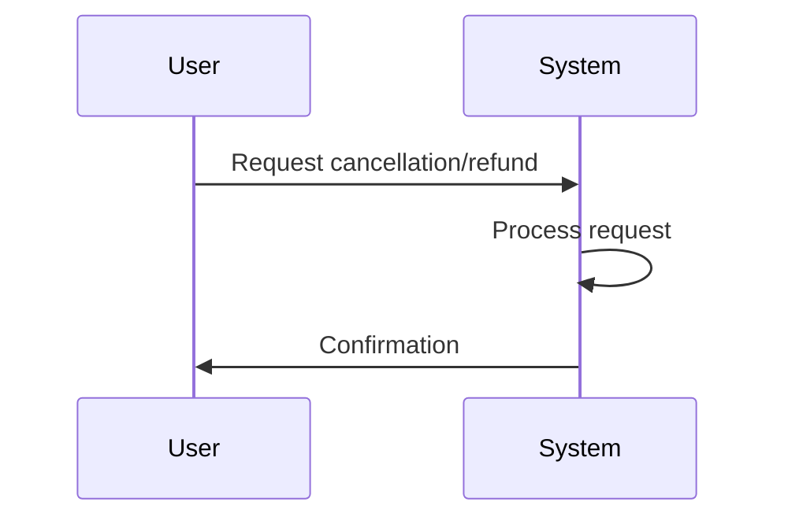

### 3.11 Admin Dashboard

#### 3.11.1 User Management

```mermaid
classDiagram
    class Admin {
        +String id
        +String username
        +String role
    }
```

#### 3.11.2 Platform Analytics

```mermaid
classDiagram
    class Analytics {
        +String id
        +Number activeUsers
        +Number orders
        +Number revenue
    }
```

## 4. User Flows

### 4.1 User Registration Flow

```mermaid
sequenceDiagram
    participant User
    participant System
    User->>System: Submit registration form
    System->>System: Validate input
    System->>System: Create user account
    System->>User: Send confirmation email
    User->>System: Click confirmation link
    System->>System: Activate user account
    System->>User: Confirmation message
```

### 4.2 Product Browsing Flow

```mermaid
sequenceDiagram
    participant User
    participant System
    User->>System: Browse categories
    System->>User: Display products
    User->>System: Search for products
    System->>User: Display results
```

### 4.3 Product Purchase Flow

```mermaid
sequenceDiagram
    participant User
    participant System
    User->>System: Add to cart
    System->>User: Confirmation
    User->>System: Proceed to checkout
    System->>User: Payment page
    User->>System: Submit payment
    System->>User: Confirmation
```

### 4.4 Order Management Flow

```mermaid
sequenceDiagram
    participant User
    participant System
    User->>System: View order history
    System->>User: Display orders
    User->>System: Request cancellation/refund
    System->>User: Confirmation
```

### 4.5 Seller Product Management Flow

```mermaid
sequenceDiagram
    participant Seller
    participant System
    Seller->>System: Add product
    System->>User: Confirmation
    Seller->>System: Update inventory
    System->>User: Confirmation
```

### 4.6 Admin Dashboard Flow

```mermaid
sequenceDiagram
    participant Admin
    participant System
    Admin->>System: Login
    System->>Admin: Dashboard
    Admin->>System: Manage users
    System->>Admin: Confirmation
```

## 5. User Personas

### 5.1 Customer Persona

- **Name**: Alex Johnson
- **Age**: 32
- **Occupation**: Marketing Manager
- **Goals**: Find high-quality products at competitive prices
- **Pain Points**: Complex checkout processes, lack of personalized recommendations

### 5.2 Seller Persona

- **Name**: Sarah Williams
- **Age**: 28
- **Occupation**: Small Business Owner
- **Goals**: Expand online sales, manage inventory efficiently
- **Pain Points**: Limited tools for tracking sales and inventory

### 5.3 Admin Persona

- **Name**: Michael Brown
- **Age**: 45
- **Occupation**: Platform Manager
- **Goals**: Oversee platform operations, ensure compliance
- **Pain Points**: Lack of comprehensive analytics and user management tools

## 6. Technical Architecture

### 6.1 System Architecture

```mermaid
graph TD
    A[Client] --> B[API Gateway]
    B --> C[Authentication Service]
    B --> D[Product Service]
    B --> E[Order Service]
    B --> F[User Service]
    C --> G[(Database)]
    D --> G
    E --> G
    F --> G
```

### 6.2 Technology Stack

- **Frontend**: React, Next.js
- **Backend**: Node.js, Express
- **Database**: PostgreSQL
- **ORM**: Prisma
- **Hosting**: AWS

### 6.3 Infrastructure Requirements

- **Scalability**: Designed for 1M+ users
- **Redundancy**: Multi-AZ deployment
- **Backup**: Automated daily backups

## 7. API Specifications

### 7.1 API Endpoints

- **User API**: `/api/users`
- **Product API**: `/api/products`
- **Order API**: `/api/orders`
- **Payment API**: `/api/payments`

### 7.2 Authentication and Authorization

- **JWT Tokens**: For secure authentication
- **Role-Based Access Control**: For authorization

## 8. Testing Strategy

### 8.1 Testing Types

- **Unit Testing**: For individual components
- **Integration Testing**: For component interactions
- **End-to-End Testing**: For full user flows

### 8.2 Quality Assurance

- **Code Reviews**: For quality assurance
- **Automated Testing**: For regression testing

## 9. Deployment Strategy

### 9.1 Deployment Plan

- **CI/CD Pipeline**: For automated deployments
- **Blue-Green Deployment**: For zero downtime

### 9.2 Monitoring and Logging

- **Logging**: For error tracking
- **Monitoring**: For performance tracking

> *Developer Note: This document defines **business requirements only**. All technical implementations (architecture, APIs, database design, etc.) are at the discretion of the development team.*