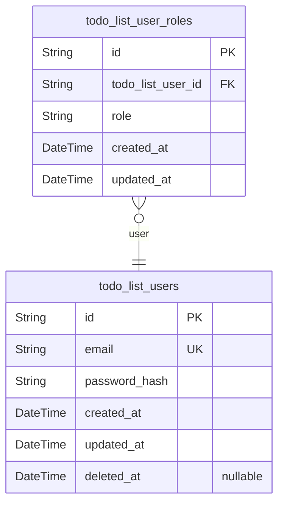
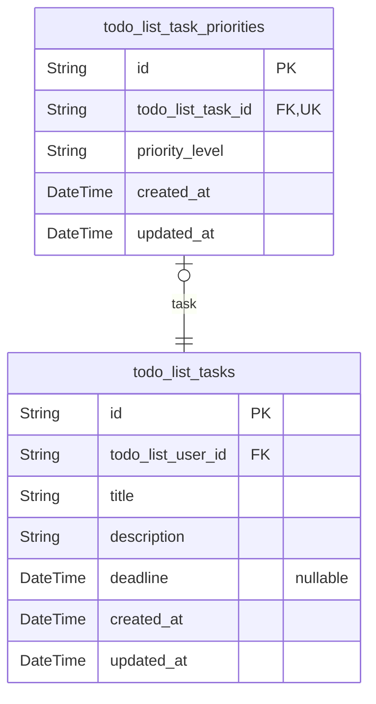

# Prisma Markdown

> Generated by [`prisma-markdown`](https://github.com/samchon/prisma-markdown)

- [Actors](#actors)
- [Tasks](#tasks)

## Actors

### `todo_list_users`

User information for authentication and authorization. This table stores
essential user details required for system access and role management.

Properties as follows:

- `id`: Primary Key.
- `email`: User's email address for login and notifications.
- `password_hash`: Hashed password for secure authentication.
- `created_at`: Timestamp when the user account was created.
- `updated_at`: Timestamp when the user account was last updated.
- `deleted_at`: Timestamp when the user account was soft-deleted.

### `todo_list_user_roles`

User role assignments for authorization purposes. This table manages the
roles assigned to users for access control and permission management.

Properties as follows:

- `id`: Primary Key.
- `todo_list_user_id`: User to whom this role is assigned. [todo_list_users.id](#todo_list_users).
- `role`: Role assigned to the user (e.g., 'admin', 'user').
- `created_at`: Timestamp when the role assignment was created.
- `updated_at`: Timestamp when the role assignment was last updated.

## Tasks

### `todo_list_tasks`

Represents tasks in the todo list application. Each task has a title,
description, priority, and deadline. Tasks are associated with users
through the todo_list_users table.

Properties as follows:

- `id`: Primary Key.
- `todo_list_user_id`: The user who created this task. [todo_list_users.id](#todo_list_users).
- `title`: The title of the task.
- `description`: The description of the task.
- `deadline`: The deadline for the task.
- `created_at`: The timestamp when the task was created.
- `updated_at`: The timestamp when the task was last updated.

### `todo_list_task_priorities`

Represents the priority levels for tasks in the todo list application.
Each priority has a name and a description.

Properties as follows:

- `id`: Primary Key.
- `todo_list_task_id`: The task associated with this priority. [todo_list_tasks.id](#todo_list_tasks).
- `priority_level`: The priority level of the task (Low, Medium, High).
- `created_at`: The timestamp when the priority was created.
- `updated_at`: The timestamp when the priority was last updated.
