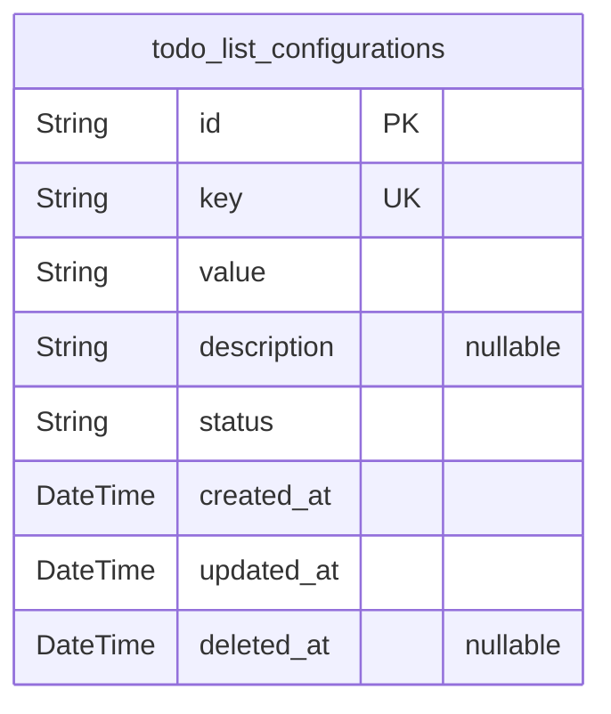
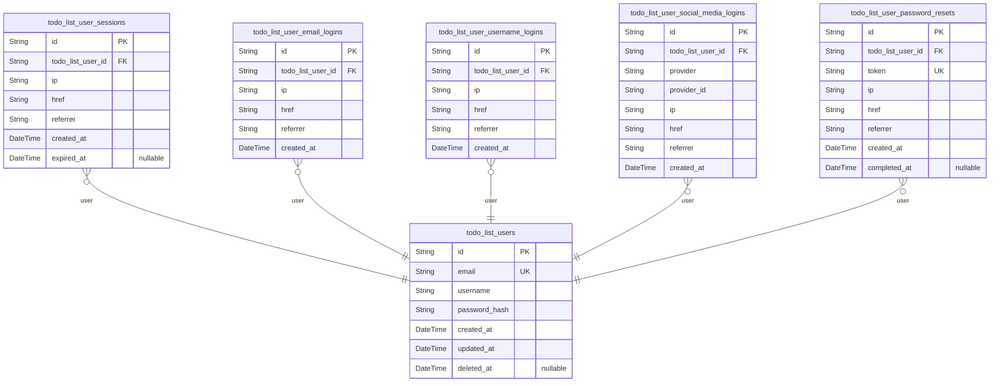
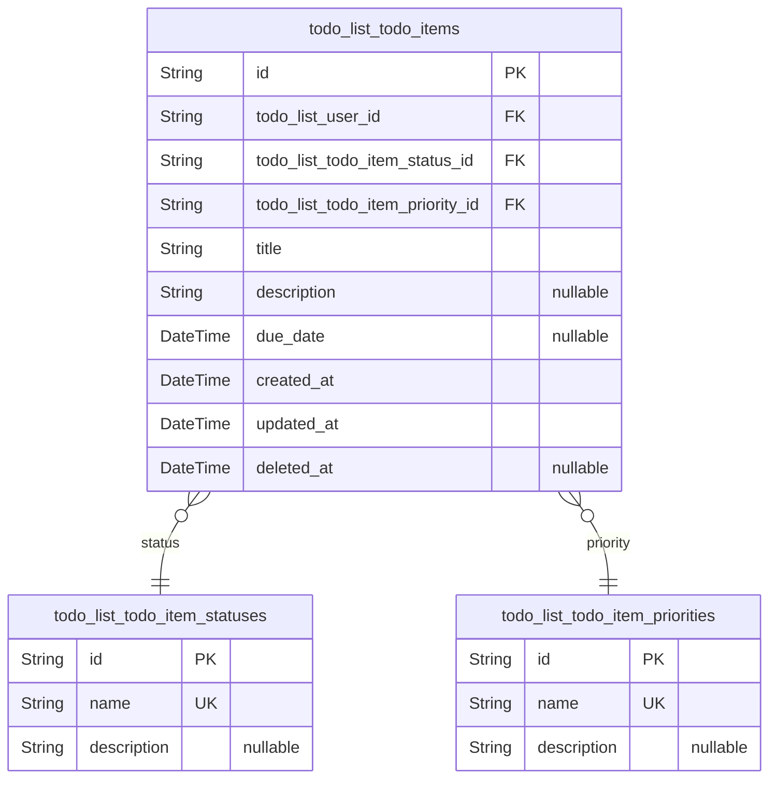

# Prisma Markdown

> Generated by [`prisma-markdown`](https://github.com/samchon/prisma-markdown)

- [Systematic](#systematic)
- [Actors](#actors)
- [TodoItems](#todoitems)

## Systematic

```mermaid
erDiagram
"todo_list_configurations" {
  String id PK
  String key UK
  String value
  String description "nullable"
  String status
  DateTime created_at
  DateTime updated_at
  DateTime deleted_at "nullable"
}
```

### `todo_list_configurations`

System-wide configuration settings for the todo list application.

Stores application-wide settings that control behavior and appearance of the
application. These configurations apply across all users and devices,
providing
centralized control over system behavior.

Configuration settings include:

- Application name and branding
- Default settings for new users
- Feature toggles for experimental features
- System-wide limits and constraints
- Integration settings with external services

The configuration table serves as a central repository for system-wide
settings that can be modified by administrators to control application
behavior
without requiring code changes.

This table is critical for maintaining consistent behavior across the
application and enabling centralized administration of system-wide
parameters.

Properties as follows:

- `id`: Primary Key.
- `key`: Unique identifier for the configuration setting.
- `value`: Value of the configuration setting.
- `description`: Human-readable description of the configuration setting.
- `status`
  > Current status of the configuration setting. Valid values: active,
  > inactive.
- `created_at`: Timestamp when the configuration setting was created.
- `updated_at`: Timestamp when the configuration setting was last updated.
- `deleted_at`: Timestamp when the configuration setting was deleted (soft delete).

## Actors

```mermaid
erDiagram
"todo_list_users" {
  String id PK
  String email UK
  String username
  String password_hash
  DateTime created_at
  DateTime updated_at
  DateTime deleted_at "nullable"
}
"todo_list_user_sessions" {
  String id PK
  String todo_list_user_id FK
  String ip
  String href
  String referrer
  DateTime created_at
  DateTime expired_at "nullable"
}
"todo_list_user_email_logins" {
  String id PK
  String todo_list_user_id FK
  String ip
  String href
  String referrer
  DateTime created_at
}
"todo_list_user_username_logins" {
  String id PK
  String todo_list_user_id FK
  String ip
  String href
  String referrer
  DateTime created_at
}
"todo_list_user_social_media_logins" {
  String id PK
  String todo_list_user_id FK
  String provider
  String provider_id
  String ip
  String href
  String referrer
  DateTime created_at
}
"todo_list_user_password_resets" {
  String id PK
  String todo_list_user_id FK
  String token UK
  String ip
  String href
  String referrer
  DateTime created_at
  DateTime completed_at "nullable"
}
"todo_list_user_sessions" }o--|| "todo_list_users" : user
"todo_list_user_email_logins" }o--|| "todo_list_users" : user
"todo_list_user_username_logins" }o--|| "todo_list_users" : user
"todo_list_user_social_media_logins" }o--|| "todo_list_users" : user
"todo_list_user_password_resets" }o--|| "todo_list_users" : user
```

### `todo_list_users`

User accounts for the todo list application.

Stores core user information including authentication credentials and
account status. Each user has a unique email address and username.
Passwords are stored as secure hashes. Users can have multiple login
methods (email, username, social media).

Supports soft deletion to allow account recovery while maintaining audit
trails. Includes timestamps for account creation and last update.

Properties as follows:

- `id`: Primary Key.
- `email`
  > User's email address for authentication and communication. Must be unique
  > across all users.
- `username`
  > User's chosen username for authentication. Must be unique across all
  > users.
- `password_hash`: Secure hash of user's password. Never store plain text passwords.
- `created_at`: Timestamp when the user account was created.
- `updated_at`: Timestamp when the user account was last updated.
- `deleted_at`
  > Timestamp when the user account was soft-deleted. Null if account is
  > active.

### `todo_list_user_sessions`

User session records for tracking active user sessions.

Stores information about active user sessions including IP address,
connection
context, and session duration. Each session is associated with a specific
user account and session type.

Supports session expiration and provides audit trail for user activity.
Includes timestamps for session creation and expiration.

Properties as follows:

- `id`: Primary Key.
- `todo_list_user_id`: User account associated with this session. [todo_list_users.id](#todo_list_users)
- `ip`: IP address from which the session was initiated.
- `href`: URL of the page where the session was initiated.
- `referrer`: Referrer URL that led to the session initiation.
- `created_at`: Timestamp when the session was created.
- `expired_at`
  > Timestamp when the session expired or was terminated. Null if session is
  > active.

### `todo_list_user_email_logins`

Email login records for user authentication.

Stores information about successful email logins including IP address and
connection context. Each login record is associated with a specific user
account.

Provides audit trail for user authentication activity. Includes
timestamps for login attempts.

Properties as follows:

- `id`: Primary Key.
- `todo_list_user_id`: User account associated with this login. [todo_list_users.id](#todo_list_users)
- `ip`: IP address from which the login attempt was made.
- `href`: URL of the page where the login attempt was initiated.
- `referrer`: Referrer URL that led to the login attempt.
- `created_at`: Timestamp when the login attempt was recorded.

### `todo_list_user_username_logins`

Username login records for user authentication.

Stores information about successful username logins including IP address and
connection context. Each login record is associated with a specific user
account.

Provides audit trail for user authentication activity. Includes
timestamps for login attempts.

Properties as follows:

- `id`: Primary Key.
- `todo_list_user_id`: User account associated with this login. [todo_list_users.id](#todo_list_users)
- `ip`: IP address from which the login attempt was made.
- `href`: URL of the page where the login attempt was initiated.
- `referrer`: Referrer URL that led to the login attempt.
- `created_at`: Timestamp when the login attempt was recorded.

### `todo_list_user_social_media_logins`

Social media login records for user authentication.

Stores information about successful social media logins including provider
information, IP address, and connection context. Each login record is
associated with a specific user account.

Provides audit trail for user authentication activity. Includes
timestamps for login attempts.

Properties as follows:

- `id`: Primary Key.
- `todo_list_user_id`: User account associated with this login. [todo_list_users.id](#todo_list_users)
- `provider`
  > Social media provider used for authentication (e.g., 'google',
  > 'facebook').
- `provider_id`: Unique identifier provided by the social media provider for the user.
- `ip`: IP address from which the login attempt was made.
- `href`: URL of the page where the login attempt was initiated.
- `referrer`: Referrer URL that led to the login attempt.
- `created_at`: Timestamp when the login attempt was recorded.

### `todo_list_user_password_resets`

Password reset records for user account recovery.

Stores information about password reset requests including reset token, IP
address, and connection context. Each reset record is associated with a
specific user account.

Provides audit trail for password reset activity. Includes timestamps
for reset requests and completions.

Properties as follows:

- `id`: Primary Key.
- `todo_list_user_id`
  > User account associated with this password reset. {@link
  > todo_list_users.id}
- `token`
  > Secure token for password reset verification. Must be unique and
  > time-limited.
- `ip`: IP address from which the password reset request was made.
- `href`: URL of the page where the password reset request was initiated.
- `referrer`: Referrer URL that led to the password reset request.
- `created_at`: Timestamp when the password reset request was created.
- `completed_at`: Timestamp when the password reset was completed. Null if reset is pending.

## TodoItems

```mermaid
erDiagram
"todo_list_todo_items" {
  String id PK
  String todo_list_user_id FK
  String todo_list_todo_item_status_id FK
  String todo_list_todo_item_priority_id FK
  String title
  String description "nullable"
  DateTime due_date "nullable"
  DateTime created_at
  DateTime updated_at
  DateTime deleted_at "nullable"
}
"todo_list_todo_item_statuses" {
  String id PK
  String name UK
  String description "nullable"
}
"todo_list_todo_item_priorities" {
  String id PK
  String name UK
  String description "nullable"
}
"todo_list_todo_items" }o--|| "todo_list_todo_item_statuses" : status
"todo_list_todo_items" }o--|| "todo_list_todo_item_priorities" : priority
```

### `todo_list_todo_items`

Core todo item entity representing tasks that users need to complete.

Stores the fundamental task information including title, description, and
due date.
Each todo item is associated with a specific user and has a status and
priority.
Supports soft deletion to allow for task recovery and history tracking.

This entity forms the central focus of the todo list application,
allowing users to
manage their tasks through creation, modification, and completion tracking.
The todo item maintains relationships with user accounts, status types, and
priority levels to provide comprehensive task management capabilities.

Properties as follows:

- `id`: Primary Key.
- `todo_list_user_id`: User who owns this todo item. [todo_list_users.id](#todo_list_users)
- `todo_list_todo_item_status_id`: Current status of this todo item. [todo_list_todo_item_statuses.id](#todo_list_todo_item_statuses)
- `todo_list_todo_item_priority_id`
  > Priority level of this todo item. {@link
  > todo_list_todo_item_priorities.id}
- `title`: Title of the todo item. Must be between 1 and 100 characters.
- `description`: Detailed description of the todo item. Can be up to 1000 characters.
- `due_date`: Date and time when the todo item is due. Must be in the future.
- `created_at`: Timestamp when the todo item was created.
- `updated_at`: Timestamp when the todo item was last updated.
- `deleted_at`: Timestamp when the todo item was soft-deleted. Null if not deleted.

### `todo_list_todo_item_statuses`

Enumeration of possible statuses for todo items.

Defines the lifecycle states that todo items can transition through,
providing
clear visibility into task progress. Statuses include pending, in-progress,
completed, and archived, allowing users to track task completion and
prioritize their workload effectively.

This entity serves as a reference table for todo item statuses, enabling
consistent status management across the application. The predefined status
values ensure standardized task tracking and reporting capabilities.

Properties as follows:

- `id`: Primary Key.
- `name`
  > Name of the status. Must be one of: pending, in-progress, completed,
  > archived.
- `description`: Detailed description of the status meaning and usage.

### `todo_list_todo_item_priorities`

Enumeration of possible priority levels for todo items.

Defines the importance levels that can be assigned to todo items, allowing
users to prioritize their tasks effectively. Priority levels include low,
medium, high, and critical, enabling clear task prioritization and
workload management.

This entity serves as a reference table for todo item priorities, enabling
consistent priority management across the application. The predefined
priority
levels ensure standardized task prioritization and reporting capabilities.

Properties as follows:

- `id`: Primary Key.
- `name`: Name of the priority level. Must be one of: low, medium, high, critical.
- `description`: Detailed description of the priority level meaning and usage.
